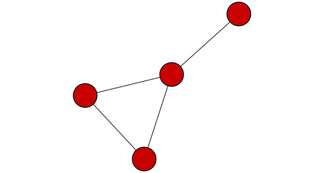

```{r setup, include=FALSE}
knitr::opts_chunk$set(echo = TRUE)
```

```{r}
library("RCy3")
library("igraph")
library("RColorBrewer")
```

```{r}
library(RCy3)
library(igraph)
library(RColorBrewer)

```
##First Contact

These functions are a convenient way to verify a connection to Cytoscape and for logging the versions of RCy3 and Cytoscape in your scripts.
```{r}
library(RCy3)

# Test the connection to Cytoscape.
cytoscapePing()
```

```{r}
# Check the version
cytoscapeVersionInfo()

```

```{r}
g <- makeSimpleIgraph()
createNetworkFromIgraph(g,"myGraph")

```

```{r}
fig <- exportImage(filename="demo", type="png", height=350)
```
```{r}


```

```{r}
setVisualStyle("Marquee")
```

```{r}
fig <- exportImage(filename="demo_marquee", type="png", height=350)

knitr::include_graphics("./demo_marquee.png")
```

```{r}
styles <- getVisualStyleNames()
styles
```

```{r}
#setVisualStyle(styles[13])
#setVisualStyle(styles[18])
```

```{r}
plot(g)
```

