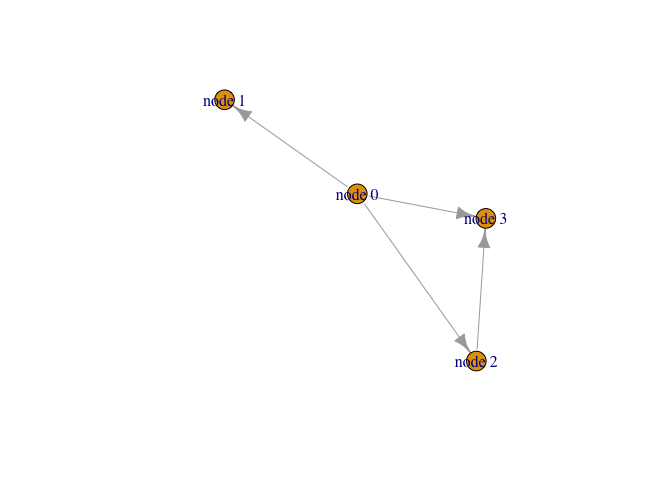

Class 17 - Hands On Pt. II
================
Analine Aguayo
11/20/2019

``` r
library("RCy3")
library("igraph")
```

    ## 
    ## Attaching package: 'igraph'

    ## The following objects are masked from 'package:stats':
    ## 
    ##     decompose, spectrum

    ## The following object is masked from 'package:base':
    ## 
    ##     union

``` r
library("RColorBrewer")
```

``` r
library(RCy3)
library(igraph)
library(RColorBrewer)
```

\#\#First Contact

These functions are a convenient way to verify a connection to Cytoscape
and for logging the versions of RCy3 and Cytoscape in your scripts.

``` r
library(RCy3)

# Test the connection to Cytoscape.
cytoscapePing()
```

    ## [1] "You are connected to Cytoscape!"

``` r
# Check the version
cytoscapeVersionInfo()
```

    ##       apiVersion cytoscapeVersion 
    ##             "v1"          "3.7.2"

``` r
g <- makeSimpleIgraph()
createNetworkFromIgraph(g,"myGraph")
```

    ## Loading data...
    ## Applying default style...
    ## Applying preferred layout...

    ## networkSUID 
    ##        1562

``` r
fig <- exportImage(filename="demo", type="png", height=350)
```

    ## Warning: This file already exists. A Cytoscape popup 
    ##                 will be generated to confirm overwrite.

``` r
knitr::include_graphics("./demo.png")
```

<!-- -->

``` r
setVisualStyle("Marquee")
```

    ##                 message 
    ## "Visual Style applied."

``` r
fig <- exportImage(filename="demo_marquee", type="png", height=350)
```

    ## Warning: This file already exists. A Cytoscape popup 
    ##                 will be generated to confirm overwrite.

``` r
knitr::include_graphics("./demo_marquee.png")
```

<!-- -->

``` r
styles <- getVisualStyleNames()
styles
```

    ##  [1] "Curved"               "Sample3"              "Solid"               
    ##  [4] "Big Labels"           "default black"        "Minimal"             
    ##  [7] "default"              "BioPAX_SIF"           "Nested Network Style"
    ## [10] "Ripple"               "size_rank"            "Universe"            
    ## [13] "Sample1"              "Marquee"              "BioPAX"              
    ## [16] "Gradient1"            "Directed"             "Sample2"

``` r
#setVisualStyle(styles[13])
#setVisualStyle(styles[18])
```

``` r
plot(g)
```

<!-- -->
