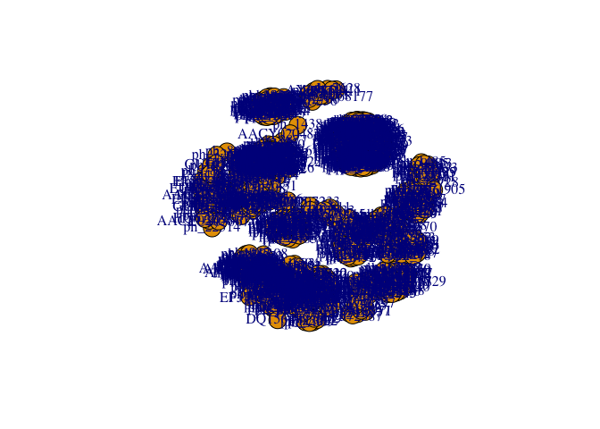
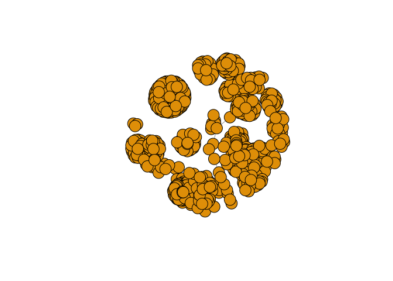
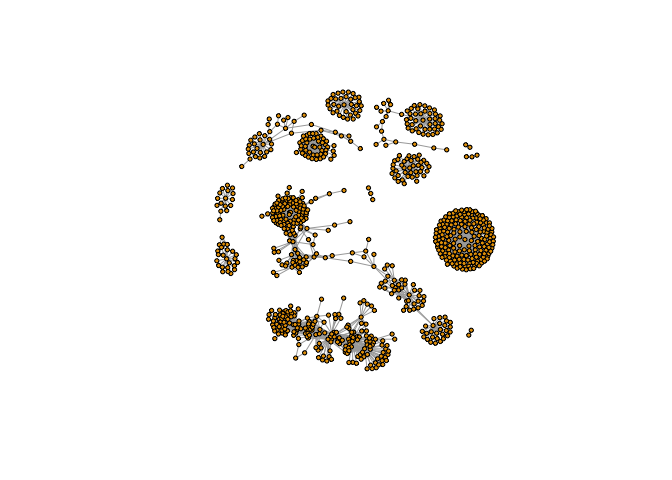

Class 17 - Hands On Pt. II
================
Analine Aguayo
11/20/2019

``` r
library("RCy3")
library("igraph")
```

    ## 
    ## Attaching package: 'igraph'

    ## The following objects are masked from 'package:stats':
    ## 
    ##     decompose, spectrum

    ## The following object is masked from 'package:base':
    ## 
    ##     union

``` r
library("RColorBrewer")
```

``` r
library(RCy3)
library(igraph)
library(RColorBrewer)
```

\#\#First Contact

These functions are a convenient way to verify a connection to Cytoscape
and for logging the versions of RCy3 and Cytoscape in your scripts.

``` r
library(RCy3)

# Test the connection to Cytoscape.
cytoscapePing()
```

    ## [1] "You are connected to Cytoscape!"

``` r
# Check the version
cytoscapeVersionInfo()
```

    ##       apiVersion cytoscapeVersion 
    ##             "v1"          "3.7.2"

``` r
g <- makeSimpleIgraph()
createNetworkFromIgraph(g,"myGraph")
```

    ## Loading data...
    ## Applying default style...
    ## Applying preferred layout...

    ## networkSUID 
    ##        1590

``` r
fig <- exportImage(filename="demo", type="png", height=350)
```

    ## Warning: This file already exists. A Cytoscape popup 
    ##                 will be generated to confirm overwrite.

``` r
knitr::include_graphics("./demo.png")
```

<!-- -->

``` r
setVisualStyle("Marquee")
```

    ##                 message 
    ## "Visual Style applied."

``` r
fig <- exportImage(filename="demo_marquee", type="png", height=350)
```

    ## Warning: This file already exists. A Cytoscape popup 
    ##                 will be generated to confirm overwrite.

``` r
knitr::include_graphics("./demo_marquee.png")
```

<!-- -->

``` r
styles <- getVisualStyleNames()
styles
```

    ##  [1] "Curved"               "Sample3"              "Solid"               
    ##  [4] "Big Labels"           "default black"        "Minimal"             
    ##  [7] "default"              "BioPAX_SIF"           "Nested Network Style"
    ## [10] "Ripple"               "size_rank"            "Universe"            
    ## [13] "Sample1"              "Marquee"              "BioPAX"              
    ## [16] "Gradient1"            "Directed"             "Sample2"

``` r
#setVisualStyle(styles[13])
#setVisualStyle(styles[18])
```

``` r
plot(g)
```

<!-- -->

``` r
## scripts for processing located in "inst/data-raw/"
prok_vir_cor <- read.delim("virus_prok_cor_abundant.tsv", stringsAsFactors = FALSE)

## Have a peak at the first 6 rows
head(prok_vir_cor)
```

    ##       Var1          Var2    weight
    ## 1  ph_1061 AACY020068177 0.8555342
    ## 2  ph_1258 AACY020207233 0.8055750
    ## 3  ph_3164 AACY020207233 0.8122517
    ## 4  ph_1033 AACY020255495 0.8487498
    ## 5 ph_10996 AACY020255495 0.8734617
    ## 6 ph_11038 AACY020255495 0.8740782

``` r
g <- graph.data.frame(prok_vir_cor, directed = FALSE)
g
```

    ## IGRAPH cc7dbce UNW- 845 1544 -- 
    ## + attr: name (v/c), weight (e/n)
    ## + edges from cc7dbce (vertex names):
    ##  [1] ph_1061 --AACY020068177 ph_1258 --AACY020207233
    ##  [3] ph_3164 --AACY020207233 ph_1033 --AACY020255495
    ##  [5] ph_10996--AACY020255495 ph_11038--AACY020255495
    ##  [7] ph_11040--AACY020255495 ph_11048--AACY020255495
    ##  [9] ph_11096--AACY020255495 ph_1113 --AACY020255495
    ## [11] ph_1208 --AACY020255495 ph_13207--AACY020255495
    ## [13] ph_1346 --AACY020255495 ph_14679--AACY020255495
    ## [15] ph_1572 --AACY020255495 ph_16045--AACY020255495
    ## + ... omitted several edges

``` r
class(g)
```

    ## [1] "igraph"

``` r
g
```

    ## IGRAPH cc7dbce UNW- 845 1544 -- 
    ## + attr: name (v/c), weight (e/n)
    ## + edges from cc7dbce (vertex names):
    ##  [1] ph_1061 --AACY020068177 ph_1258 --AACY020207233
    ##  [3] ph_3164 --AACY020207233 ph_1033 --AACY020255495
    ##  [5] ph_10996--AACY020255495 ph_11038--AACY020255495
    ##  [7] ph_11040--AACY020255495 ph_11048--AACY020255495
    ##  [9] ph_11096--AACY020255495 ph_1113 --AACY020255495
    ## [11] ph_1208 --AACY020255495 ph_13207--AACY020255495
    ## [13] ph_1346 --AACY020255495 ph_14679--AACY020255495
    ## [15] ph_1572 --AACY020255495 ph_16045--AACY020255495
    ## + ... omitted several edges

``` r
plot(g)
```

<!-- -->

``` r
#lets turn off the blue labels
plot(g, vertex.label=NA)
```

<!-- -->

``` r
plot(g, vertex.size=3, vertex.label=NA)
```

<!-- -->
