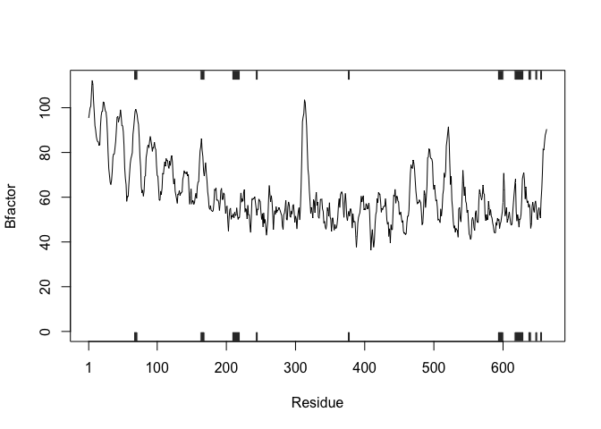
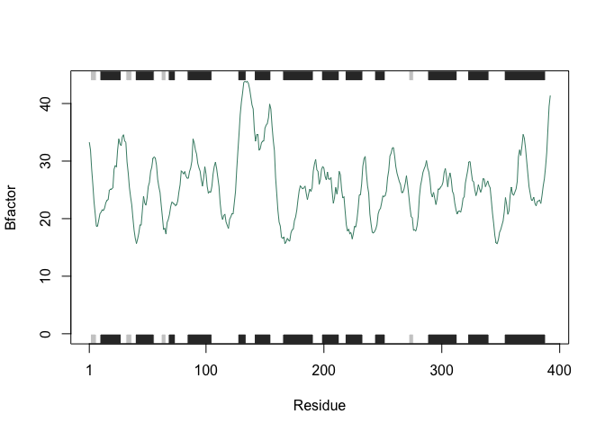

Class 06 Homework
================
Analine Aguayo
10/31/2019

``` r
# Can you improve this analysis code?
library(bio3d)
s1 <- read.pdb("3CIG")  # kinase with drug
```

    ##   Note: Accessing on-line PDB file

``` r
s2 <- read.pdb("1AKE")  # kinase no drug
```

    ##   Note: Accessing on-line PDB file
    ##    PDB has ALT records, taking A only, rm.alt=TRUE

``` r
s3 <- read.pdb("1E4Y")  # kinase with drug
```

    ##   Note: Accessing on-line PDB file

``` r
s1.chainA <- trim.pdb(s1, chain="A", elety="CA")
s2.chainA <- trim.pdb(s2, chain="A", elety="CA")
s3.chainA <- trim.pdb(s1, chain="A", elety="CA")

s1.b <- s1.chainA$atom$b
s2.b <- s2.chainA$atom$b
s3.b <- s3.chainA$atom$b

plotb3(s1.b, sse=s1.chainA, typ="l", ylab="Bfactor") 
```

<!-- -->

``` r
plotb3(s2.b, sse=s2.chainA, typ="l", ylab="Bfactor") 
```

<!-- -->

``` r
plotb3(s3.b, sse=s3.chainA, typ="l", ylab="Bfactor")
```

<!-- -->

``` r
#Understanding what the part does with only one of the proteins
library(bio3d)
s1 <- read.pdb("4AKE")  # kinase with drug
```

    ##   Note: Accessing on-line PDB file

``` r
s1.chainA <- trim.pdb(s1, chain="A", elety="CA")
s1.b <- s1.chainA$atom$b
plotb3(s1.b, sse=s1.chainA, typ="l", ylab="Bfactor") 
```

<!-- -->

``` r
#it appears as if this function gives you the Bfactor (whatever that is) of each residue along the length of a specific protein 4AKE
```

``` r
library(bio3d)
#this appears to load the plugin named bio3d
#in other words I think it lets you access the database
```

``` r
s1 <- read.pdb("4AKE")
```

    ##   Note: Accessing on-line PDB file

    ## Warning in get.pdb(file, path = tempdir(), verbose = FALSE): /var/folders/
    ## g1/z0y9g2jx0_51crr2rqk0c90w0000gn/T//RtmpR3IIrg/4AKE.pdb exists. Skipping
    ## download

``` r
s1
```

    ## 
    ##  Call:  read.pdb(file = "4AKE")
    ## 
    ##    Total Models#: 1
    ##      Total Atoms#: 3459,  XYZs#: 10377  Chains#: 2  (values: A B)
    ## 
    ##      Protein Atoms#: 3312  (residues/Calpha atoms#: 428)
    ##      Nucleic acid Atoms#: 0  (residues/phosphate atoms#: 0)
    ## 
    ##      Non-protein/nucleic Atoms#: 147  (residues: 147)
    ##      Non-protein/nucleic resid values: [ HOH (147) ]
    ## 
    ##    Protein sequence:
    ##       MRIILLGAPGAGKGTQAQFIMEKYGIPQISTGDMLRAAVKSGSELGKQAKDIMDAGKLVT
    ##       DELVIALVKERIAQEDCRNGFLLDGFPRTIPQADAMKEAGINVDYVLEFDVPDELIVDRI
    ##       VGRRVHAPSGRVYHVKFNPPKVEGKDDVTGEELTTRKDDQEETVRKRLVEYHQMTAPLIG
    ##       YYSKEAEAGNTKYAKVDGTKPVAEVRADLEKILGMRIILLGAPGA...<cut>...KILG
    ## 
    ## + attr: atom, xyz, seqres, helix, sheet,
    ##         calpha, remark, call

``` r
#s1 seems to make r read the pdb file for 4AKE
#this will be an important part to manipulate when we want to look at different proteins
#maybe we can just sub in a variable for 4AKE?
```

``` r
s1.chainA <- trim.pdb(s1, chain="A", elety="CA")
s1.chainA
```

    ## 
    ##  Call:  trim.pdb(pdb = s1, chain = "A", elety = "CA")
    ## 
    ##    Total Models#: 1
    ##      Total Atoms#: 214,  XYZs#: 642  Chains#: 1  (values: A)
    ## 
    ##      Protein Atoms#: 214  (residues/Calpha atoms#: 214)
    ##      Nucleic acid Atoms#: 0  (residues/phosphate atoms#: 0)
    ## 
    ##      Non-protein/nucleic Atoms#: 0  (residues: 0)
    ##      Non-protein/nucleic resid values: [ none ]
    ## 
    ##    Protein sequence:
    ##       MRIILLGAPGAGKGTQAQFIMEKYGIPQISTGDMLRAAVKSGSELGKQAKDIMDAGKLVT
    ##       DELVIALVKERIAQEDCRNGFLLDGFPRTIPQADAMKEAGINVDYVLEFDVPDELIVDRI
    ##       VGRRVHAPSGRVYHVKFNPPKVEGKDDVTGEELTTRKDDQEETVRKRLVEYHQMTAPLIG
    ##       YYSKEAEAGNTKYAKVDGTKPVAEVRADLEKILG
    ## 
    ## + attr: atom, helix, sheet, seqres, xyz,
    ##         calpha, call

``` r
#the previous pdb file states that there were two chains in the 4AKE protein.
#i think this command makes you show only the A chain.
#do we know what elety is?
#http://thegrantlab.org/bio3d/html/read.pdb.html
#the link above shows me that elety means "atom type"
#there are options of C, N, CA, and N
```

``` r
s1.b <- s1.chainA$atom$b
s1.b
```

    ##   [1]  29.02  18.44  16.20  19.67  20.26  20.55  17.05  22.13  26.71  33.05
    ##  [11]  30.66  32.73  25.61  33.19  41.03  24.09  16.18  19.14  29.19  14.79
    ##  [21]  19.63  28.54  27.49  32.56  17.13  15.50   6.98  24.07  24.00  23.94
    ##  [31]  30.70  24.70  32.84  34.60  33.01  44.60  50.74  57.32  47.04  67.13
    ##  [41]  81.04  75.20  59.68  55.63  45.12  39.04  44.31  38.21  43.70  44.19
    ##  [51]  47.00  48.67  41.54  50.22  45.07  49.77  52.04  44.82  39.75  35.79
    ##  [61]  38.92  37.93  27.18  26.86  27.53  31.16  27.08  23.03  28.12  24.78
    ##  [71]  24.22  18.69  40.67  38.08  55.26  46.29  26.25  37.14  27.50  16.86
    ##  [81]  27.76  19.27  22.22  26.70  25.52  21.22  15.90  15.84  22.44  19.61
    ##  [91]  21.23  21.79  17.64  22.19  22.73  16.80  23.25  35.95  24.42  20.96
    ## [101]  20.00  25.99  24.39  17.19  12.16  17.35  24.97  14.08  22.01  22.26
    ## [111]  22.78  27.47  30.49  32.02  20.90  27.03  23.84  44.37  42.47  33.48
    ## [121]  44.56  56.67  60.18  66.62  59.95  70.81  88.63 100.11  86.60  85.80
    ## [131]  77.48  68.13  52.66  45.34  52.43  60.90  62.64  72.19  66.75  58.73
    ## [141]  74.57  79.29  79.53  76.58  66.40  64.76  70.48  74.84  70.11  74.82
    ## [151]  78.61  78.24  66.70  66.10  67.01  72.28  80.64  68.54  43.23  51.24
    ## [161]  45.72  61.60  45.61  42.57  41.03  41.02  33.34  19.48  34.38  33.11
    ## [171]  25.48  29.68  40.71  32.91  24.41  19.20  15.43  19.93  20.66  12.72
    ## [181]  21.40  18.21  26.68  34.50  25.77  26.52  36.85  31.05  39.84  48.03
    ## [191]  23.04  29.57  23.00  23.80  26.59  25.49  23.25  19.89  32.37  30.97
    ## [201]  42.16  29.64  29.69  33.15  26.38  23.17  29.35  32.80  25.92  38.01
    ## [211]  45.95  44.26  44.35  70.26

``` r
#this looks like it printed out some values from each of the residues
#these residues are the ones that are in the A chain
#there are 214 residues in this chain compared to 3312 from the whole protein
#bfactor is the possibility of the alpha carbons' positions
#I think that a high bfactor means that the possibility of where a particular alpha carbon is high?
```

``` r
plotb3(s3.b, sse=s3.chainA, typ="l", ylab="Bfactor")
```

<!-- -->

``` r
plotb3(s1.b, sse=s1.chainA, typ="l", ylab="Bfactor")
```

<!-- -->

``` r
plotb3
```

    ## function (x, resno = NULL, rm.gaps = FALSE, type = "h", main = "", 
    ##     sub = "", xlim = NULL, ylim = NULL, ylim2zero = TRUE, xlab = "Residue", 
    ##     ylab = NULL, axes = TRUE, ann = par("ann"), col = par("col"), 
    ##     sse = NULL, sse.type = "classic", sse.min.length = 5, top = TRUE, 
    ##     bot = TRUE, helix.col = "gray20", sheet.col = "gray80", sse.border = FALSE, 
    ##     ...) 
    ## {
    ##     gaps.pos = gap.inspect(x)
    ##     if (rm.gaps && length(gaps.pos$f.inds) == 0) 
    ##         stop("No data to plot (all positions of \"x\" have gaps).")
    ##     if (is.matrix(x)) 
    ##         x = x[1, ]
    ##     if (!is.vector(x)) 
    ##         stop("Input x should be a numeric vector")
    ##     if (!is.null(resno)) {
    ##         if (is.pdb(resno)) {
    ##             ca.inds <- atom.select(resno, "calpha", verbose = FALSE)
    ##             resno <- resno$atom$resno[ca.inds$atom]
    ##         }
    ##         if (any(is.na(resno))) 
    ##             resno <- resno[!is.na(resno)]
    ##         if (any(is.na(x))) {
    ##             tmp.resno <- rep(NA, length(x))
    ##             tmp.resno[!is.na(x)] = resno
    ##             resno = tmp.resno
    ##         }
    ##         if (length(resno) != length(x)) {
    ##             warning("Length of input 'resno' does not equal the length of input 'x'; Ignoring 'resno'")
    ##             resno = NULL
    ##         }
    ##     }
    ##     if (!is.null(sse)) {
    ##         if (is.pdb(sse) || inherits(sse, "sse")) {
    ##             if (is.pdb(sse)) 
    ##                 sse <- pdb2sse(sse)
    ##             else sse <- sse$sse
    ##         }
    ##         if (any(is.na(sse))) 
    ##             sse <- sse[!is.na(sse)]
    ##         if (any(is.na(x))) {
    ##             tmp.sse = rep(" ", length(x))
    ##             tmp.sse[!is.na(x)] <- sse
    ##             sse <- tmp.sse
    ##         }
    ##         if (length(sse) != length(x)) {
    ##             warning("Length of input 'sse' does not equal the length of input 'x'; Ignoring 'sse'")
    ##             sse = NULL
    ##         }
    ##     }
    ##     if (rm.gaps) {
    ##         xy <- xy.coords(x[gaps.pos$f.inds])
    ##         if (!is.null(resno)) 
    ##             resno <- resno[gaps.pos$f.inds]
    ##         if (!is.null(sse)) 
    ##             sse <- sse[gaps.pos$f.inds]
    ##     }
    ##     else xy <- xy.coords(x)
    ##     if (is.null(xlim)) 
    ##         xlim <- range(xy$x[is.finite(xy$x)])
    ##     if (is.null(ylim)) 
    ##         ylim <- range(xy$y[is.finite(xy$y)])
    ##     if (ylim2zero) 
    ##         ylim[1] = 0
    ##     plot.new()
    ##     plot.window(xlim, ylim, ...)
    ##     points(xy$x, xy$y, col = col, type = type, ...)
    ##     if (!is.null(sse)) {
    ##         h <- bounds(which(sse == "H"))
    ##         e <- bounds(which(sse == "E"))
    ##         if (length(h) > 0) {
    ##             h <- h[h[, "length"] >= sse.min.length, , drop = FALSE]
    ##         }
    ##         else {
    ##             h <- NULL
    ##         }
    ##         if (length(e) > 0) {
    ##             e <- e[e[, "length"] >= sse.min.length, , drop = FALSE]
    ##         }
    ##         else {
    ##             e <- NULL
    ##         }
    ##         if (sse.type != "classic") 
    ##             warning("Only sse.type='classic' is currently available, 'fancy' coming soon")
    ##         if (top) {
    ##             bo <- max(ylim) + (diff(ylim) * 0.001)
    ##             to <- max(ylim) + (diff(ylim) * 0.04)
    ##             if (length(h) > 0) 
    ##                 rect(xleft = h[, "start"], xright = h[, "end"], 
    ##                   ybottom = bo, ytop = to, col = helix.col, border = sse.border)
    ##             if (length(e) > 0) 
    ##                 rect(xleft = e[, "start"], xright = e[, "end"], 
    ##                   ybottom = bo, ytop = to, col = sheet.col, border = sse.border)
    ##         }
    ##         if (bot) {
    ##             to <- min(ylim) - (diff(ylim) * 0.001)
    ##             bo <- min(ylim) - (diff(ylim) * 0.04)
    ##             if (length(h) > 0) 
    ##                 rect(xleft = h[, "start"], xright = h[, "end"], 
    ##                   ybottom = bo, ytop = to, col = helix.col, border = sse.border)
    ##             if (length(e) > 0) 
    ##                 rect(xleft = e[, "start"], xright = e[, "end"], 
    ##                   ybottom = bo, ytop = to, col = sheet.col, border = sse.border)
    ##         }
    ##     }
    ##     if (axes) {
    ##         axis(2)
    ##         box()
    ##         at <- axTicks(1)
    ##         at[1] = 1
    ##         if (is.null(resno)) {
    ##             axis(1, at)
    ##         }
    ##         else {
    ##             labels <- resno[at]
    ##             labels[is.na(labels)] <- ""
    ##             axis(1, at = at, labels = labels)
    ##         }
    ##     }
    ##     if (ann) {
    ##         if (is.null(xlab)) 
    ##             xlab = xy$xlab
    ##         if (is.null(ylab)) 
    ##             ylab = xy$ylab
    ##         title(main = main, sub = sub, xlab = xlab, ylab = ylab, 
    ##             ...)
    ##     }
    ## }
    ## <bytecode: 0x7ff12633b428>
    ## <environment: namespace:bio3d>

``` r
#this is a plot of s1.b
#sse seems to be the name of what we are plotting
#type is the kind of graph that we are plotting
#and ylab is the value for the y axis label
#i do not know what the b3 part of the plot is.....
?plot

#sse looks like it adds the secondary structure objects (the boxes above and below the chart)
# type l is for line graph
#and ylab is the y axis label
```

``` r
library(bio3d)
Bfactor_graph <- function(x) {
  #reads the appropriate pdb file (of the protein of your choice)
  x.a <- read.pdb(x)
  #trims the protein to be only the A chain with alpha Carbons displayed
  x.chainA <- trim.pdb(x.a, chain="A", elety="CA")
  #chooses apropriate atoms as before and their bfactors
  x.b <- x.chainA$atom$b
  #makes the scatter plot out of selected information, I changed the color of the line.
  plotb3(x.b, sse=x.chainA,typ="l", ylab="Bfactor", col = "aquamarine4")
}

#i will change the x to a random protein the postdoc in my lab worked on
x <- "3CIG"
Bfactor_graph(x)
```

    ##   Note: Accessing on-line PDB file

    ## Warning in get.pdb(file, path = tempdir(), verbose = FALSE): /var/folders/
    ## g1/z0y9g2jx0_51crr2rqk0c90w0000gn/T//RtmpR3IIrg/3CIG.pdb exists. Skipping
    ## download

<!-- -->

``` r
#any other protein can be inputted into x to run now, I think.... let's try again
```

``` r
#trying again with another random protein
library(bio3d)
Bfactor_graph <- function(x) {
  x.a <- read.pdb(x)
  x.chainA <- trim.pdb(x.a, chain="A", elety="CA")
  x.b <- x.chainA$atom$b
  plotb3(x.b, sse=x.chainA,typ="l", ylab="Bfactor", col = "aquamarine4")
}

x <- "2B3B"
Bfactor_graph(x)
```

    ##   Note: Accessing on-line PDB file

<!-- -->
