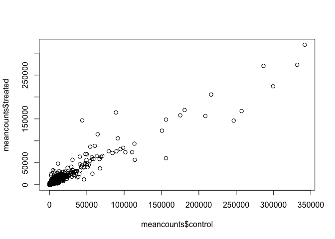
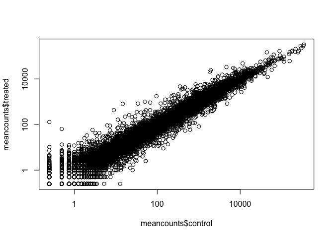

ranscriptomics and the analysis of RNA-Seq data
================
Analine Aguayo
11/13/2019

\#\#Setup Bioconductor DESeq2

``` r
 install.packages("BiocManager")
 BiocManager::install()
 BiocManager::install("DESeq2")
 library(DESeq2)
```

``` r
library(DESeq2)
```

    ## Loading required package: S4Vectors

    ## Loading required package: stats4

    ## Loading required package: BiocGenerics

    ## Loading required package: parallel

    ## 
    ## Attaching package: 'BiocGenerics'

    ## The following objects are masked from 'package:parallel':
    ## 
    ##     clusterApply, clusterApplyLB, clusterCall, clusterEvalQ,
    ##     clusterExport, clusterMap, parApply, parCapply, parLapply,
    ##     parLapplyLB, parRapply, parSapply, parSapplyLB

    ## The following objects are masked from 'package:stats':
    ## 
    ##     IQR, mad, sd, var, xtabs

    ## The following objects are masked from 'package:base':
    ## 
    ##     anyDuplicated, append, as.data.frame, basename, cbind,
    ##     colnames, dirname, do.call, duplicated, eval, evalq, Filter,
    ##     Find, get, grep, grepl, intersect, is.unsorted, lapply, Map,
    ##     mapply, match, mget, order, paste, pmax, pmax.int, pmin,
    ##     pmin.int, Position, rank, rbind, Reduce, rownames, sapply,
    ##     setdiff, sort, table, tapply, union, unique, unsplit, which,
    ##     which.max, which.min

    ## 
    ## Attaching package: 'S4Vectors'

    ## The following object is masked from 'package:base':
    ## 
    ##     expand.grid

    ## Loading required package: IRanges

    ## Loading required package: GenomicRanges

    ## Loading required package: GenomeInfoDb

    ## Loading required package: SummarizedExperiment

    ## Loading required package: Biobase

    ## Welcome to Bioconductor
    ## 
    ##     Vignettes contain introductory material; view with
    ##     'browseVignettes()'. To cite Bioconductor, see
    ##     'citation("Biobase")', and for packages 'citation("pkgname")'.

    ## Loading required package: DelayedArray

    ## Loading required package: matrixStats

    ## 
    ## Attaching package: 'matrixStats'

    ## The following objects are masked from 'package:Biobase':
    ## 
    ##     anyMissing, rowMedians

    ## Loading required package: BiocParallel

    ## 
    ## Attaching package: 'DelayedArray'

    ## The following objects are masked from 'package:matrixStats':
    ## 
    ##     colMaxs, colMins, colRanges, rowMaxs, rowMins, rowRanges

    ## The following objects are masked from 'package:base':
    ## 
    ##     aperm, apply, rowsum

``` r
read.csv("airway_scaledcounts.csv")
```

    ##               ensgene SRR1039508 SRR1039509 SRR1039512 SRR1039513
    ## 1     ENSG00000000003        723        486        904        445
    ## 2     ENSG00000000005          0          0          0          0
    ## 3     ENSG00000000419        467        523        616        371
    ## 4     ENSG00000000457        347        258        364        237
    ## 5     ENSG00000000460         96         81         73         66
    ## 6     ENSG00000000938          0          0          1          0
    ## 7     ENSG00000000971       3413       3916       6000       4308
    ## 8     ENSG00000001036       2328       1714       2640       1381
    ## 9     ENSG00000001084        670        372        692        448
    ## 10    ENSG00000001167        426        295        531        178
    ## 11    ENSG00000001460        191        182        287        137
    ## 12    ENSG00000001461       2232       1969       5252       2698
    ## 13    ENSG00000001497        556        513        619        355
    ## 14    ENSG00000001561         74         53        212        160
    ## 15    ENSG00000001617        560        372        934        436
    ## 16    ENSG00000001626         16          9         14          8
    ## 17    ENSG00000001629       1491       1204       2438       1041
    ## 18    ENSG00000001630       1014        807       1135        689
    ## 19    ENSG00000001631        694        725       1052        475
    ## 20    ENSG00000002016        256        202        263        109
    ## 21    ENSG00000002079          1          0          7          7
    ## 22    ENSG00000002330        760        653        796        431
    ## 23    ENSG00000002549       1460       1274       1280        980
    ## 24    ENSG00000002586       7314       7067       9639       6221
    ## 25    ENSG00000002587          2          3          1          1
    ## 26    ENSG00000002726          1          0          4          2
    ## 27    ENSG00000002745          5          5         28          9
    ## 28    ENSG00000002746        172        160        104         86
    ## 29    ENSG00000002822        391        306        415        185
    ## 30    ENSG00000002834       7577       7641       9125       7305
    ## 31    ENSG00000002919        230        225        273        207
    ## 32    ENSG00000002933       1296       1542        594        433
    ## 33    ENSG00000003056       1954       1665       1960       1309
    ## 34    ENSG00000003096        644        330        590        178
    ## 35    ENSG00000003137        140         55        235         75
    ## 36    ENSG00000003147          9          4          9          8
    ## 37    ENSG00000003249         85         73        221         84
    ## 38    ENSG00000003393        900        728        875        514
    ## 39    ENSG00000003400        101         71        121        104
    ## 40    ENSG00000003402       2065       3648       2340       2991
    ## 41    ENSG00000003436       4665       4109       6899       3253
    ## 42    ENSG00000003509        306        249        379        203
    ## 43    ENSG00000003756       3095       2413       3940       1763
    ## 44    ENSG00000003987         25         28         34         35
    ## 45    ENSG00000003989         61         51         13          3
    ## 46    ENSG00000004059       1589       1893       1519       1136
    ## 47    ENSG00000004139        311        354        326        168
    ## 48    ENSG00000004142       1501       1570       1618        981
    ## 49    ENSG00000004399       4107       4116       3858       2064
    ## 50    ENSG00000004455       1349       1098       1549        733
    ## 51    ENSG00000004468          8          8          2          3
    ## 52    ENSG00000004478        552        638        727        396
    ## 53    ENSG00000004487       1345       1018       1705        788
    ## 54    ENSG00000004534       1246       1002       2084        930
    ## 55    ENSG00000004660         98         58         59         38
    ## 56    ENSG00000004700       1376       1618       1714       1127
    ## 57    ENSG00000004766        567        383        533        365
    ## 58    ENSG00000004776      14175      12857      13950       8278
    ## 59    ENSG00000004777        206        106        102         62
    ## 60    ENSG00000004779        330        340        486        265
    ## 61    ENSG00000004799         82        835        127       1130
    ## 62    ENSG00000004809          2          2          3          2
    ## 63    ENSG00000004838         19          8         28          8
    ## 64    ENSG00000004846         33          9         75         12
    ## 65    ENSG00000004848          0          1          0          0
    ## 66    ENSG00000004864        141        141        104        110
    ## 67    ENSG00000004866        522        387       1077        288
    ## 68    ENSG00000004897       1662       1367       2114       1041
    ## 69    ENSG00000004939          9          7         12          3
    ## 70    ENSG00000004948          0          0          0          0
    ## 71    ENSG00000004961        444        345        541        289
    ## 72    ENSG00000004975       1330        954       1146        517
    ## 73    ENSG00000005001          0          0          0          0
    ## 74    ENSG00000005007       2288       2284       2515       1544
    ## 75    ENSG00000005020        881        710        781        499
    ## 76    ENSG00000005022       1581       1253       1555        839
    ## 77    ENSG00000005059        200        206        242        206
    ## 78    ENSG00000005073          1          0          1          0
    ## 79    ENSG00000005075        631        693        719        378
    ## 80    ENSG00000005100        440        437        554        357
    ## 81    ENSG00000005102          1          0          0          0
    ## 82    ENSG00000005108         10         12          6          5
    ## 83    ENSG00000005156        370        170        370        178
    ## 84    ENSG00000005175        334        346        318        119
    ## 85    ENSG00000005187         24         26         35         24
    ## 86    ENSG00000005189         78         61         89         56
    ## 87    ENSG00000005194        438        373        620        314
    ## 88    ENSG00000005206        748        656        767        377
    ## 89    ENSG00000005238        801        634        853        408
    ## 90    ENSG00000005243       1171        949       1236        746
    ## 91    ENSG00000005249        227        247        279        328
    ## 92    ENSG00000005302        441        547        488        338
    ## 93    ENSG00000005339       2660       1793       3240       1690
    ## 94    ENSG00000005379        213        128        120        134
    ## 95    ENSG00000005381          3         30          7          1
    ## 96    ENSG00000005421          0          0          0          0
    ## 97    ENSG00000005436        313        303        292        239
    ## 98    ENSG00000005448        241        214        267        158
    ## 99    ENSG00000005469        503        396        344        191
    ## 100   ENSG00000005471         67         15         61         16
    ## 101   ENSG00000005483       1863       1563       1921       1107
    ## 102   ENSG00000005486        741        620       1121        562
    ## 103   ENSG00000005513         10          2          5          0
    ## 104   ENSG00000005700        543        431        790        393
    ## 105   ENSG00000005801        210        212        298        161
    ## 106   ENSG00000005810       3126       2627       3159       2108
    ## 107   ENSG00000005812       1493       1459       1472       1359
    ## 108   ENSG00000005844          5          0          1          3
    ## 109   ENSG00000005882        954        877       1254        681
    ## 110   ENSG00000005884        701        795       1582       1106
    ## 111   ENSG00000005889        792        584        766        404
    ## 112   ENSG00000005893       5053       4502       6271       3792
    ## 113   ENSG00000005961          9         13         24          5
    ## 114   ENSG00000005981          4          6          4          2
    ## 115   ENSG00000006007       2249       2181       3008       2143
    ## 116   ENSG00000006015        544        481        416        195
    ## 117   ENSG00000006016        154        112         91         82
    ## 118   ENSG00000006025        226        178        229         95
    ## 119   ENSG00000006042       3108       2545       3486       2057
    ## 120   ENSG00000006047          0          1          1          1
    ## 121   ENSG00000006059          0          0          0          0
    ## 122   ENSG00000006062        335        294        333        115
    ## 123   ENSG00000006071          0          0          0          0
    ## 124   ENSG00000006116          0          0          1          0
    ## 125   ENSG00000006118        528        369        604        282
    ## 126   ENSG00000006125       7030       5372       7725       5197
    ## 127   ENSG00000006128          0          4          1          0
    ## 128   ENSG00000006194        527        508        612        377
    ## 129   ENSG00000006210          9         19          9          6
    ## 130   ENSG00000006282       1765       1372       1340        752
    ## 131   ENSG00000006283        100         46         48         11
    ## 132   ENSG00000006327        523        347        708        250
    ## 133   ENSG00000006377          0          0          0          1
    ## 134   ENSG00000006432          8          5         12          8
    ## 135   ENSG00000006451       1833        949       1094        568
    ## 136   ENSG00000006453        214        151        260        150
    ## 137   ENSG00000006459        381        299        461        266
    ## 138   ENSG00000006468        190        109        167        133
    ## 139   ENSG00000006530        251        254        292        173
    ## 140   ENSG00000006534        885       1132       1380        847
    ## 141   ENSG00000006555          9          4          6          2
    ## 142   ENSG00000006576        946        718       1612        711
    ## 143   ENSG00000006606          3          3          8          1
    ## 144   ENSG00000006607        709        903        971        860
    ## 145   ENSG00000006611          0          0          0          0
    ## 146   ENSG00000006625        195        186        196         84
    ## 147   ENSG00000006634        132         72        104         74
    ## 148   ENSG00000006638         76         54        105         46
    ## 149   ENSG00000006652        922        788       1022        597
    ## 150   ENSG00000006659          1          0          0          1
    ## 151   ENSG00000006695        184        140        200        141
    ## 152   ENSG00000006704        337        281        380        164
    ## 153   ENSG00000006712        985        879       1550        719
    ## 154   ENSG00000006715       2045       1560       2949       1410
    ## 155   ENSG00000006740         42         29         33         20
    ## 156   ENSG00000006744        836        931       1008        636
    ## 157   ENSG00000006747         18         29         35         12
    ## 158   ENSG00000006756        538        423        591        371
    ## 159   ENSG00000006757        161        155        176        105
    ## 160   ENSG00000006788          5         37          0          1
    ## 161   ENSG00000006831       1055       1009       1170        894
    ## 162   ENSG00000006837         72         56         90         80
    ## 163   ENSG00000007001          2          4          5          0
    ## 164   ENSG00000007038          0          0          2          1
    ## 165   ENSG00000007047        641        654        925        519
    ## 166   ENSG00000007062          3          2          6          1
    ## 167   ENSG00000007080        633        715        707        402
    ## 168   ENSG00000007129          0          0          0          0
    ## 169   ENSG00000007168       3486       3399       4955       2670
    ## 170   ENSG00000007171          0          2          0          0
    ## 171   ENSG00000007174          1          3          3          4
    ## 172   ENSG00000007202       6595       5389       7849       4289
    ## 173   ENSG00000007216          0          0          0          0
    ## 174   ENSG00000007237        378        153        304         37
    ## 175   ENSG00000007255        140        155        124        118
    ## 176   ENSG00000007264          3          3          4          1
    ## 177   ENSG00000007306          0          0          0          0
    ## 178   ENSG00000007312          1          2          0          4
    ## 179   ENSG00000007314          0          1          2          1
    ## 180   ENSG00000007341        274        172        282        171
    ## 181   ENSG00000007350          0          0          0          0
    ## 182   ENSG00000007372         29         62         32         11
    ## 183   ENSG00000007376        278        265        222        137
    ## 184   ENSG00000007384       2000       1978       1951        983
    ## 185   ENSG00000007392        792        659        766        430
    ## 186   ENSG00000007402         21         24         24         29
    ## 187   ENSG00000007516          6          6          6         14
    ## 188   ENSG00000007520        655        565        632        317
    ## 189   ENSG00000007541        710        669        694        361
    ## 190   ENSG00000007545        615        679        771        383
    ## 191   ENSG00000007866       1522       2112       1701       1244
    ## 192   ENSG00000007908          0          0          0          0
    ## 193   ENSG00000007923        880        885       1095        611
    ## 194   ENSG00000007933        782        826       2205       1633
    ## 195   ENSG00000007944        368        247        535        185
    ## 196   ENSG00000007952         11         15          7          8
    ## 197   ENSG00000007968          4          6          6          3
    ## 198   ENSG00000008018       1674       1494       1789       1115
    ## 199   ENSG00000008056          7         23         24         15
    ## 200   ENSG00000008083        274        260        283        227
    ## 201   ENSG00000008086        323        293        585        198
    ## 202   ENSG00000008118          2          4         13          2
    ## 203   ENSG00000008128        574        559        657        336
    ## 204   ENSG00000008130       1345       2061       1441       1443
    ## 205   ENSG00000008196          1          1          6          1
    ## 206   ENSG00000008197          0          0          0          0
    ## 207   ENSG00000008226          8          3         13          5
    ## 208   ENSG00000008256       1746       3230       3066       3432
    ## 209   ENSG00000008277         28         19         18         20
    ## 210   ENSG00000008282       1959       1841       1966       1707
    ## 211   ENSG00000008283        594        538        645        336
    ## 212   ENSG00000008294       2688       2195       3950       1736
    ## 213   ENSG00000008300         55         76        127         85
    ## 214   ENSG00000008311        478        972        549        670
    ## 215   ENSG00000008323          8         12          7          3
    ## 216   ENSG00000008324        112        157         85        106
    ## 217   ENSG00000008382        156        124        167         87
    ## 218   ENSG00000008394       2589       2703       3127       1895
    ## 219   ENSG00000008405        296        308        269        208
    ## 220   ENSG00000008438          0          6          1          1
    ## 221   ENSG00000008441      14126       9551      13469       6036
    ## 222   ENSG00000008513       2256       1341       1760        554
    ## 223   ENSG00000008516         19         22         31          6
    ## 224   ENSG00000008517        179         82        210         63
    ## 225   ENSG00000008710       5059       5956       5307       3517
    ## 226   ENSG00000008735         15         22         21         13
    ## 227   ENSG00000008838       1320       1003       1229        659
    ## 228   ENSG00000008853        644        727        956        562
    ## 229   ENSG00000008869        796        639        799        505
    ## 230   ENSG00000008952       4233       4365       5671       3341
    ## 231   ENSG00000008988      13036      11874      13193       7244
    ## 232   ENSG00000009307      15086      12706      19963      11668
    ## 233   ENSG00000009335       1932       2021       2275       1634
    ## 234   ENSG00000009413       5320      10463       6250       7792
    ## 235   ENSG00000009694         18          7          2          3
    ## 236   ENSG00000009709          0          0          0          0
    ## 237   ENSG00000009724         40         30         60         24
    ## 238   ENSG00000009765         12         30          4          1
    ## 239   ENSG00000009780        150        187        173        146
    ## 240   ENSG00000009790          3          6          6          3
    ## 241   ENSG00000009830        381        460        546        285
    ## 242   ENSG00000009844        829        675       1092        532
    ## 243   ENSG00000009950         10         21          6          2
    ## 244   ENSG00000009954       2827       2653       3352       2041
    ## 245   ENSG00000010017       1510       2278       1804       2001
    ## 246   ENSG00000010030         30         15         22         11
    ## 247   ENSG00000010072        194        143        203        105
    ## 248   ENSG00000010165        959        950       1177        688
    ## 249   ENSG00000010219        262        189        326        142
    ## 250   ENSG00000010244       2884       2599       2943       1669
    ## 251   ENSG00000010256       1649       1795       1587       1379
    ## 252   ENSG00000010270        888        800        884        504
    ## 253   ENSG00000010278       3133       3438       3747       3527
    ## 254   ENSG00000010282          0          0          0          0
    ## 255   ENSG00000010292       1407       1139       1356        827
    ## 256   ENSG00000010295       1471       1280       1679        865
    ## 257   ENSG00000010310         27         13         30         12
    ## 258   ENSG00000010318         61         71         81         71
    ## 259   ENSG00000010319          1          0          1          0
    ## 260   ENSG00000010322       2581       2022       3157       1472
    ## 261   ENSG00000010327          0          0          1          1
    ## 262   ENSG00000010361        273        226        312        170
    ## 263   ENSG00000010379          0          1          7          1
    ## 264   ENSG00000010404       2447       2016       3319       1999
    ## 265   ENSG00000010438          7         11         12          6
    ## 266   ENSG00000010539        140        128        166        108
    ## 267   ENSG00000010610         37         18         97         53
    ## 268   ENSG00000010626        151        103        210        111
    ## 269   ENSG00000010671          0          0          0          0
    ## 270   ENSG00000010704        508        302        674        303
    ## 271   ENSG00000010803        770        660        858        531
    ## 272   ENSG00000010810       1783       1707       1607        882
    ## 273   ENSG00000010818       1884       1023       1633        835
    ## 274   ENSG00000010932         16         33         70         46
    ## 275   ENSG00000011007       1470       1365       1388        954
    ## 276   ENSG00000011009        451        500        518        265
    ## 277   ENSG00000011021        879        666        655        397
    ## 278   ENSG00000011028      17930      13855      25972      10769
    ## 279   ENSG00000011052        307        195        298         80
    ## 280   ENSG00000011083          0          0          1          1
    ## 281   ENSG00000011105       3095       2676       3524       2493
    ## 282   ENSG00000011114        721        462        606        398
    ## 283   ENSG00000011132        198        220        301        143
    ## 284   ENSG00000011143        207        145        226        100
    ## 285   ENSG00000011198        586       1488        820       1040
    ## 286   ENSG00000011201          2          0          1          0
    ## 287   ENSG00000011243        823        694        963        430
    ## 288   ENSG00000011258        473        282        405        224
    ## 289   ENSG00000011260        489        465        369        295
    ## 290   ENSG00000011275       1680       1455       1932       1070
    ## 291   ENSG00000011295        428        369        466        329
    ## 292   ENSG00000011304       3395       3914       3193       2347
    ## 293   ENSG00000011332         25         12         18         18
    ## 294   ENSG00000011347        174         87        157         69
    ## 295   ENSG00000011376        547        454        448        278
    ## 296   ENSG00000011405       1181       1300       1462        843
    ## 297   ENSG00000011422        399        368        489        250
    ## 298   ENSG00000011426        265        251        239        138
    ## 299   ENSG00000011451       1536       1653       1596        899
    ## 300   ENSG00000011454       1864       1776       2363       2292
    ## 301   ENSG00000011465     218156     190421     427652     214758
    ## 302   ENSG00000011478         95        138        138        133
    ## 303   ENSG00000011485        818       1191        963        672
    ## 304   ENSG00000011523        752        710        999        580
    ## 305   ENSG00000011566        851       1132       1434       1153
    ## 306   ENSG00000011590          6          7          7          0
    ## 307   ENSG00000011600          0          1          4          3
    ## 308   ENSG00000011638        975        808        771        661
    ## 309   ENSG00000011677          0          2          1          2
    ## 310   ENSG00000012048        332        109        485         89
    ## 311   ENSG00000012061       1160        913       1519        599
    ## 312   ENSG00000012124          4          4          4          0
    ## 313   ENSG00000012171       1860        956       2108        723
    ## 314   ENSG00000012174        722        620        848        523
    ## 315   ENSG00000012211        109        139        138         65
    ## 316   ENSG00000012223          0          0          0          1
    ## 317   ENSG00000012232       1271       1030       1370        885
    ## 318   ENSG00000012504          0          0          0          0
    ## 319   ENSG00000012660       2069       1877       2572       2274
    ## 320   ENSG00000012779          0          1          0          0
    ## 321   ENSG00000012817        887        816        993        483
    ## 322   ENSG00000012822       4687       5376       6913       5128
    ## 323   ENSG00000012963        333        305        451        250
    ## 324   ENSG00000012983       1997       1575       2569       1205
    ## 325   ENSG00000013016       2070       3397       1763        885
    ## 326   ENSG00000013275        503        522        518        317
    ## 327   ENSG00000013288       3106       2541       4085       2321
    ## 328   ENSG00000013293        222         63        389        114
    ## 329   ENSG00000013297       6526       1575       5336       1498
    ## 330   ENSG00000013306       1015       1023       1095        602
    ## 331   ENSG00000013364       9639       8804       9096       5778
    ## 332   ENSG00000013374       1208       1116       1788       1043
    ## 333   ENSG00000013375       1452        984       1762        707
    ## 334   ENSG00000013392        226        142        275        153
    ## 335   ENSG00000013441       2515       2754       2337       2351
    ## 336   ENSG00000013503        336        295        369        143
    ## 337   ENSG00000013523        428        303        483        192
    ## 338   ENSG00000013561        770        854       1054        783
    ## 339   ENSG00000013563        406        361        770        440
    ## 340   ENSG00000013573        331        229        264        126
    ## 341   ENSG00000013583       1258       1289       1497       1299
    ## 342   ENSG00000013588        594        450        975        541
    ## 343   ENSG00000013619        757       1112       1256        823
    ## 344   ENSG00000013725         11         10          6          7
    ## 345   ENSG00000013810         95        134        124         65
    ## 346   ENSG00000014123        934        716       1014        621
    ## 347   ENSG00000014138        190        108        276         84
    ## 348   ENSG00000014164        578        498        546        286
    ## 349   ENSG00000014216       3114       3533       3956       2480
    ## 350   ENSG00000014257         26         16         21          5
    ## 351   ENSG00000014641       1613       1301       1892       1105
    ## 352   ENSG00000014824       1102       1101       1449       1056
    ## 353   ENSG00000014914        597        348        775        439
    ## 354   ENSG00000014919        714        510        728        441
    ## 355   ENSG00000015133          5         10          1          3
    ## 356   ENSG00000015153        183        279        273        201
    ## 357   ENSG00000015171       2042       1927       2663       1381
    ## 358   ENSG00000015285          7         14         12          2
    ## 359   ENSG00000015413          0          3          0          1
    ## 360   ENSG00000015475        270        322        406        163
    ## 361   ENSG00000015479       5543       3333       6399       2983
    ## 362   ENSG00000015520         22          4         23          1
    ## 363   ENSG00000015532        724        598        782        431
    ## 364   ENSG00000015568        210        112        173         85
    ## 365   ENSG00000015592          0          3          0          2
    ## 366   ENSG00000015676       1829       1527       1866       1061
    ## 367   ENSG00000016082          0          0          1          0
    ## 368   ENSG00000016391        155         25        157         30
    ## 369   ENSG00000016402         22          6          8          3
    ## 370   ENSG00000016490          0          1          0          0
    ## 371   ENSG00000016602          1          0          0          0
    ## 372   ENSG00000016864       1537       1445       1959       1185
    ## 373   ENSG00000017260       2792       2045       3487       2004
    ## 374   ENSG00000017427       1100        832       1138        766
    ## 375   ENSG00000017483        703        396        566        123
    ## 376   ENSG00000017797       2930       3683       2819       2432
    ## 377   ENSG00000018189       1110        845       1108        655
    ## 378   ENSG00000018236        101         47         27         31
    ## 379   ENSG00000018280         23         15         19         13
    ## 380   ENSG00000018408       3114       2596       2997       1784
    ## 381   ENSG00000018510        850        656        846        462
    ## 382   ENSG00000018607          0          0          0          0
    ## 383   ENSG00000018610        315        261        355        164
    ## 384   ENSG00000018625        285        146       3356        855
    ## 385   ENSG00000018699        255        208        268        246
    ## 386   ENSG00000018869         63         65         71         58
    ## 387   ENSG00000019102          1          0          3          7
    ## 388   ENSG00000019144       3326       4395       3783       2512
    ## 389   ENSG00000019169          0          2          0          0
    ## 390   ENSG00000019186         65          5          8          0
    ## 391   ENSG00000019485        314        332        320        171
    ## 392   ENSG00000019505          1          0          2          2
    ## 393   ENSG00000019549       3353       5423       2830       1636
    ## 394   ENSG00000019582         22         25        101         40
    ## 395   ENSG00000019991       1517        926       1399        338
    ## 396   ENSG00000019995       1356       2658       1592       1916
    ## 397   ENSG00000020129       1459        974       1272        481
    ## 398   ENSG00000020181      11137       6620      11659       5319
    ## 399   ENSG00000020219          0          0          0          0
    ## 400   ENSG00000020256        373        291        413        170
    ## 401   ENSG00000020426        196        181        311        181
    ## 402   ENSG00000020577       2269       4046       1925       2507
    ## 403   ENSG00000020633        143        176         90         60
    ## 404   ENSG00000020922        562        464        553        376
    ## 405   ENSG00000021300         19          6         22          8
    ## 406   ENSG00000021355        588        567        662        457
    ## 407   ENSG00000021461          3          2          6          2
    ## 408   ENSG00000021488          5          4          4          1
    ## 409   ENSG00000021574        527        443        563        357
    ## 410   ENSG00000021645          9         22         47         71
    ## 411   ENSG00000021762       1443       1806       1032        759
    ## 412   ENSG00000021776       1228       1276       1378       1016
    ## 413   ENSG00000021826        404        261        461        226
    ## 414   ENSG00000021852          0          0          0          0
    ## 415   ENSG00000022267       7166       8589      11992       8443
    ## 416   ENSG00000022277       1947       1718       2425       1378
    ## 417   ENSG00000022355          0          0          0          0
    ## 418   ENSG00000022556          5          1          4          1
    ## 419   ENSG00000022567        146        133        156         96
    ## 420   ENSG00000022840       2564       2576       3094       2034
    ## 421   ENSG00000022976        205        124        206        104
    ## 422   ENSG00000023041        674        637        697        481
    ## 423   ENSG00000023171         62         16        120         29
    ## 424   ENSG00000023191       2903       2739       2997       1614
    ## 425   ENSG00000023228       1597       1657       2041       1173
    ## 426   ENSG00000023287       2603       2406       2881       2069
    ## 427   ENSG00000023318       1340       1261       1476       1068
    ## 428   ENSG00000023330       1025        840       1159        549
    ## 429   ENSG00000023445         78         83         59         29
    ## 430   ENSG00000023516       1937       1549       2110       1219
    ## 431   ENSG00000023572         96        108         97         85
    ## 432   ENSG00000023608        230        338        430        368
    ## 433   ENSG00000023697        460        502        510        357
    ## 434   ENSG00000023734       1655       1993       2171       1574
    ## 435   ENSG00000023839         23         33         23          6
    ## 436   ENSG00000023892          7          2          5          8
    ## 437   ENSG00000023902        654        766        618        474
    ## 438   ENSG00000023909       1079       1615       1324       1867
    ## 439   ENSG00000024048       1322       1162       1558        997
    ## 440   ENSG00000024422      10748      11310      12572       7587
    ## 441   ENSG00000024526         22         33         22         17
    ## 442   ENSG00000024862        210        231        287        192
    ## 443   ENSG00000025039          3         11          8          6
    ## 444   ENSG00000025156        302        237        300        146
    ## 445   ENSG00000025293       1417       1420       1516        908
    ## 446   ENSG00000025423        235         61        605         58
    ## 447   ENSG00000025434        403        492        513        311
    ## 448   ENSG00000025708        136        405        110        122
    ## 449   ENSG00000025770        426        364        444        191
    ## 450   ENSG00000025772        840        574        933        396
    ## 451   ENSG00000025796       3318       2361       4840       2777
    ## 452   ENSG00000025800       1962       1835       2372       1649
    ## 453   ENSG00000026025      98471      64439     119665      60034
    ## 454   ENSG00000026036        322        170        381         59
    ## 455   ENSG00000026103        991        874       1425        660
    ## 456   ENSG00000026297        266        148        288        133
    ## 457   ENSG00000026508      19783      12248      29627      14247
    ## 458   ENSG00000026559         34         20         16          4
    ## 459   ENSG00000026652        556        312        359        125
    ## 460   ENSG00000026751          0          1          2          4
    ## 461   ENSG00000026950       1003        485       1098        400
    ## 462   ENSG00000027001        548        370        794        309
    ## 463   ENSG00000027075         78         43         75         52
    ## 464   ENSG00000027644          1          0          1          0
    ## 465   ENSG00000027697       1353       1607       1341       1244
    ## 466   ENSG00000027847        453        411        568        271
    ## 467   ENSG00000027869          1          0          1          0
    ## 468   ENSG00000028116        225        247        275        180
    ## 469   ENSG00000028137        403        613        596        489
    ## 470   ENSG00000028203        997        858       1720       1051
    ## 471   ENSG00000028277         68         29         38          3
    ## 472   ENSG00000028310        524        498        718        373
    ## 473   ENSG00000028528       3551       2885       4343       2343
    ## 474   ENSG00000028839        490        440        496        284
    ## 475   ENSG00000029153        311        218        422        245
    ## 476   ENSG00000029363       3179       2186       4444       2097
    ## 477   ENSG00000029364       1468       1022       1628        933
    ## 478   ENSG00000029534         69         30        156        114
    ## 479   ENSG00000029559          0          0          5          0
    ## 480   ENSG00000029639        129        100        128         83
    ## 481   ENSG00000029725       1589       1435       2424       1297
    ## 482   ENSG00000029993        495        318        928        398
    ## 483   ENSG00000030066        978        850       1050        610
    ## 484   ENSG00000030110        183        186        193        122
    ## 485   ENSG00000030304         35         54         41         14
    ## 486   ENSG00000030419        227        139        239        158
    ## 487   ENSG00000030582      10961       7853      13343       6964
    ## 488   ENSG00000031003       1339       1017       1665        903
    ## 489   ENSG00000031081        464        216        463        125
    ## 490   ENSG00000031691         58         56         83         53
    ## 491   ENSG00000031698       3373       2391       4016       1609
    ## 492   ENSG00000031823       1565       1070       2421        781
    ## 493   ENSG00000032219        701        523        782        409
    ## 494   ENSG00000032389        238        207        314        113
    ## 495   ENSG00000032444       1317       1167       1821       1105
    ## 496   ENSG00000032742        287        148        344        122
    ## 497   ENSG00000033011        521        473        622        335
    ## 498   ENSG00000033030        395        425        464        272
    ## 499   ENSG00000033050       1036       1349       1257        922
    ## 500   ENSG00000033100       2425       1977       2652       1648
    ## 501   ENSG00000033122          9          3          9          1
    ## 502   ENSG00000033170       1457       1386       2170        991
    ## 503   ENSG00000033178        979        515       1532        435
    ## 504   ENSG00000033327       1158       1135       1271       1112
    ## 505   ENSG00000033627        758       1319        961        857
    ## 506   ENSG00000033800       1118        900       1206        842
    ## 507   ENSG00000033867       2526       1161       3813       1080
    ## 508   ENSG00000034053         46         53         21          4
    ## 509   ENSG00000034152        886       1178        924        896
    ## 510   ENSG00000034239         14          9         17          4
    ## 511   ENSG00000034510      11323      10854      17313       8263
    ## 512   ENSG00000034533        142         98        152         64
    ## 513   ENSG00000034677        837        833       1106        657
    ## 514   ENSG00000034693        345        210        420        192
    ## 515   ENSG00000034713       1332       1382       1392       1186
    ## 516   ENSG00000034971        339        260       1033        645
    ## 517   ENSG00000035115        650        352        583        252
    ## 518   ENSG00000035141        364        374        382        261
    ## 519   ENSG00000035403      11492      16965      17242      16658
    ## 520   ENSG00000035499         21         15         19          2
    ## 521   ENSG00000035664        168        517        631        966
    ## 522   ENSG00000035681       1162        868       1307        569
    ## 523   ENSG00000035687        866        750       1039        673
    ## 524   ENSG00000035720          0          0          0          0
    ## 525   ENSG00000035862      51281      43711      66689      48258
    ## 526   ENSG00000035928       1042        988       1126        736
    ## 527   ENSG00000036054       1278       1230       1180        854
    ## 528   ENSG00000036257       1672       1488       2047       1331
    ## 529   ENSG00000036448          7         13          6          1
    ## 530   ENSG00000036473          0          0          0          0
    ## 531   ENSG00000036530         43         24         45         23
    ## 532   ENSG00000036549       1008        800        951        543
    ## 533   ENSG00000036565          3          5          1          3
    ## 534   ENSG00000036672         20          8         11         13
    ## 535   ENSG00000036828          0          0          0          0
    ## 536   ENSG00000037042        440        347        568        309
    ## 537   ENSG00000037241        296        310        297        218
    ## 538   ENSG00000037280          9         17         15          2
    ## 539   ENSG00000037474        766        742        806        480
    ## 540   ENSG00000037637        632        624        701        477
    ## 541   ENSG00000037749        386        373        540        370
    ## 542   ENSG00000037757        397        372        434        255
    ## 543   ENSG00000037897         71         52        116         42
    ## 544   ENSG00000037965          6          7          8          4
    ## 545   ENSG00000038002        792        462        806        343
    ## 546   ENSG00000038210        410        437        390        274
    ## 547   ENSG00000038219       2660       1743       2596       1621
    ## 548   ENSG00000038274       1642       1880       1446       1509
    ## 549   ENSG00000038295         13          7         35          7
    ## 550   ENSG00000038358       1004        878       1338        715
    ## 551   ENSG00000038382       6242       5674       7550       3781
    ## 552   ENSG00000038427       9784       7411      12674       4848
    ## 553   ENSG00000038532        743        486        796        424
    ## 554   ENSG00000038945        112         46        112         23
    ## 555   ENSG00000039068         12          1          8          7
    ## 556   ENSG00000039123       1387       1084       1806        785
    ## 557   ENSG00000039139        177        237        306         65
    ## 558   ENSG00000039319       1050        848       1441        651
    ## 559   ENSG00000039523       1783       2025       1795       1130
    ## 560   ENSG00000039537          2         22         13         27
    ## 561   ENSG00000039560       3738       3886       5161       3804
    ## 562   ENSG00000039600          2          2          3          4
    ## 563   ENSG00000039650        475        376        375        165
    ## 564   ENSG00000039987          1          3          4          1
    ## 565   ENSG00000040199        268        262        311        222
    ## 566   ENSG00000040275        235        186        359         93
    ## 567   ENSG00000040341        707        447        978        480
    ## 568   ENSG00000040487        227        267        207        145
    ## 569   ENSG00000040531        476        443        592        327
    ## 570   ENSG00000040608          3          1          4          0
    ## 571   ENSG00000040633        858        775        921        443
    ## 572   ENSG00000040731        121         47        109         13
    ## 573   ENSG00000040933        762        533        852        502
    ## 574   ENSG00000041353         29         18         23         18
    ## 575   ENSG00000041357       1326       1279       1547        943
    ## 576   ENSG00000041515          3          5          3          5
    ## 577   ENSG00000041802        527        559        628        351
    ## 578   ENSG00000041880        383        396        474        240
    ## 579   ENSG00000041982       3271       1080       7309       2955
    ## 580   ENSG00000041988        193        173        219        124
    ## 581   ENSG00000042062       1517       1894       1191        712
    ## 582   ENSG00000042088        212        133        256        100
    ## 583   ENSG00000042286        450        649        583        488
    ## 584   ENSG00000042304          4          4          5          7
    ## 585   ENSG00000042317        221        130        249        183
    ## 586   ENSG00000042429        381        316        402        342
    ## 587   ENSG00000042445       1401       1246       1835        984
    ## 588   ENSG00000042493        813        839       1109        664
    ## 589   ENSG00000042753       1145       1211       1388        856
    ## 590   ENSG00000042781          4          0          3          2
    ## 591   ENSG00000042813          0          0          0          0
    ## 592   ENSG00000042832         24         17         56         31
    ## 593   ENSG00000042980          4         15         14          2
    ## 594   ENSG00000043039          0          0          1          1
    ## 595   ENSG00000043093        686        652        704        416
    ## 596   ENSG00000043143       1585       1706       1711        993
    ## 597   ENSG00000043355          0          0          0          0
    ## 598   ENSG00000043462          0          0          0          0
    ## 599   ENSG00000043514        213        175        313        162
    ## 600   ENSG00000043591          0          1          1          2
    ## 601   ENSG00000044012          0          0          0          0
    ## 602   ENSG00000044090       1604        950       1685        728
    ## 603   ENSG00000044115       7374       6300      10501       5382
    ## 604   ENSG00000044446        412        402        394        292
    ## 605   ENSG00000044459        498        377        718        357
    ## 606   ENSG00000044524         54         21         38         43
    ## 607   ENSG00000044574      16885      13716      19883       7801
    ## 608   ENSG00000046604         22          7         73         35
    ## 609   ENSG00000046647        306        340        348        219
    ## 610   ENSG00000046651        359        264        518        419
    ## 611   ENSG00000046653        100        354        289       1343
    ## 612   ENSG00000046774          0          0          1          0
    ## 613   ENSG00000046889         56         38        124         16
    ## 614   ENSG00000047056        509        510        566        428
    ## 615   ENSG00000047188        771        852        664        460
    ## 616   ENSG00000047230        378        286        292        235
    ## 617   ENSG00000047249        873        743        967        641
    ## 618   ENSG00000047315       2664       2145       2422       1597
    ## 619   ENSG00000047346        830        623        835        607
    ## 620   ENSG00000047365         42         25        156         58
    ## 621   ENSG00000047410       4915       4010       5486       3152
    ## 622   ENSG00000047457         11         12         25         30
    ## 623   ENSG00000047578        875        637       1054        613
    ## 624   ENSG00000047579        245        233        246        177
    ## 625   ENSG00000047597          1          0          1          0
    ## 626   ENSG00000047617         10         12         12         12
    ## 627   ENSG00000047621        463        290        567        173
    ## 628   ENSG00000047634        357        444        578        287
    ## 629   ENSG00000047644       1203       1400       1714       1045
    ## 630   ENSG00000047648        616        617        451        196
    ## 631   ENSG00000047662          7          1          8         13
    ## 632   ENSG00000047849      15464      14951      18872      12281
    ## 633   ENSG00000047932       1617       1301       1917        966
    ## 634   ENSG00000047936          0          2          1          1
    ## 635   ENSG00000048028        437        508        579        302
    ## 636   ENSG00000048052        317        199        577        208
    ## 637   ENSG00000048140        826        784        923        638
    ## 638   ENSG00000048162        144        179        198        158
    ## 639   ENSG00000048342        881        751       1087        422
    ## 640   ENSG00000048392       1635       1171       1846       1036
    ## 641   ENSG00000048405        349        308        352        291
    ## 642   ENSG00000048462          0          0          0          0
    ## 643   ENSG00000048471       1651       1603       2521       2150
    ## 644   ENSG00000048540         28         52         37         50
    ## 645   ENSG00000048544        794        609        879        572
    ## 646   ENSG00000048545          2          1         17          4
    ## 647   ENSG00000048649       1572       1274       1897        866
    ## 648   ENSG00000048707       2111       3225       3534       4218
    ## 649   ENSG00000048740       5021       6150       4519       4301
    ## 650   ENSG00000048828       4149       3772       4612       2534
    ## 651   ENSG00000048991        605        441        623        289
    ## 652   ENSG00000049089         93         40        104         31
    ## 653   ENSG00000049130       2839       1905       3426       1836
    ## 654   ENSG00000049167        232        144        227         91
    ## 655   ENSG00000049192        162        172        278         94
    ## 656   ENSG00000049239       5872       5571       6818       4982
    ## 657   ENSG00000049245       3228       2884       3828       2744
    ## 658   ENSG00000049246        378         71        303        109
    ## 659   ENSG00000049247          0          0          1          0
    ## 660   ENSG00000049249         22         25         30         21
    ## 661   ENSG00000049283         15          7         16          4
    ## 662   ENSG00000049323      14366      22442      19773      17739
    ## 663   ENSG00000049449       6334       4866       6408       3404
    ## 664   ENSG00000049540       4716       8814       8340       6851
    ## 665   ENSG00000049541        163        103        211         70
    ## 666   ENSG00000049618       2039       1619       1678        892
    ## 667   ENSG00000049656       1031       1148       1187       1033
    ## 668   ENSG00000049759       1833        728       2217        391
    ## 669   ENSG00000049768          2          4          4          2
    ## 670   ENSG00000049769        125         68         87         80
    ## 671   ENSG00000049860       3927       3192       5167       3670
    ## 672   ENSG00000049883        402        243        486        252
    ## 673   ENSG00000050030          0          0          0          0
    ## 674   ENSG00000050130        879        801       1256        722
    ## 675   ENSG00000050165      12605      11942      20829      13969
    ## 676   ENSG00000050327        240        132        616        405
    ## 677   ENSG00000050344        183        177        230        134
    ## 678   ENSG00000050393        459        456        603        414
    ## 679   ENSG00000050405       6346       5769      12985       5326
    ## 680   ENSG00000050426        939        804       1167        618
    ## 681   ENSG00000050438        102         82        115        129
    ## 682   ENSG00000050555        103         38         36         22
    ## 683   ENSG00000050628        337        353        509        240
    ## 684   ENSG00000050730          6          4          9          3
    ## 685   ENSG00000050748        906        739       1149        571
    ## 686   ENSG00000050767          0          3          0          0
    ## 687   ENSG00000050820       1149       1168       1209        671
    ## 688   ENSG00000051009        416        413        448        278
    ## 689   ENSG00000051108       1663       2423       2228       2027
    ## 690   ENSG00000051128        969        814       1065        487
    ## 691   ENSG00000051180         17         45         32         45
    ## 692   ENSG00000051341         22         22         33         14
    ## 693   ENSG00000051382        340        252        354        282
    ## 694   ENSG00000051523        759        840        665        472
    ## 695   ENSG00000051596        169        122        206        158
    ## 696   ENSG00000051620       1116       1437       1212       1020
    ## 697   ENSG00000051825        271        207        327        150
    ## 698   ENSG00000052126       1521       1113       1846       1001
    ## 699   ENSG00000052344          0          0          6          1
    ## 700   ENSG00000052723        726        715        640        505
    ## 701   ENSG00000052749        354        267        444        234
    ## 702   ENSG00000052795        438        419        595        323
    ## 703   ENSG00000052802        373        304        447        241
    ## 704   ENSG00000052841       2204       1798       2935       1369
    ## 705   ENSG00000052850          9          0          4          0
    ## 706   ENSG00000053108          5          0          9          0
    ## 707   ENSG00000053254       3743       3620       3234       2949
    ## 708   ENSG00000053328         21          7         21          3
    ## 709   ENSG00000053371       1011        922        956        611
    ## 710   ENSG00000053372        340        331        381        273
    ## 711   ENSG00000053438         45         51         36         20
    ## 712   ENSG00000053501        336        284        385        178
    ## 713   ENSG00000053524         35         99         38         23
    ## 714   ENSG00000053702         29         23         69         20
    ## 715   ENSG00000053747        749       1644        447       1245
    ## 716   ENSG00000053770        638        534        819        491
    ## 717   ENSG00000053900        514        499        699        325
    ## 718   ENSG00000053918          0          0          0          0
    ## 719   ENSG00000054116        729        710        814        505
    ## 720   ENSG00000054118       2977       2534       3404       1712
    ## 721   ENSG00000054148       1290       1095        996        398
    ## 722   ENSG00000054179          1          0          5          0
    ## 723   ENSG00000054219         14         33         39         45
    ## 724   ENSG00000054267       1060        809       1449        751
    ## 725   ENSG00000054277        346        395        304        349
    ## 726   ENSG00000054282        263        238        153        136
    ## 727   ENSG00000054356         34         26         29          5
    ## 728   ENSG00000054392         52         41         61         35
    ## 729   ENSG00000054523       1580       1573       1733       1118
    ## 730   ENSG00000054598        470        354        424        250
    ## 731   ENSG00000054611        615        529        753        400
    ## 732   ENSG00000054654       1709       1263       2043       1267
    ## 733   ENSG00000054690         16         12          6          2
    ## 734   ENSG00000054793       2789       2136       3446       2468
    ## 735   ENSG00000054796          0          0          0          0
    ## 736   ENSG00000054803          0          0          0          0
    ## 737   ENSG00000054938         93         23        137         27
    ## 738   ENSG00000054965       1972       1307       2452        944
    ## 739   ENSG00000054967         17         14          9         11
    ## 740   ENSG00000054983        653        668        877        440
    ## 741   ENSG00000055044        495        466        560        440
    ## 742   ENSG00000055070       3325       3125       4271       2392
    ## 743   ENSG00000055118         53         18         22          1
    ## 744   ENSG00000055130       1201       1341       1280        884
    ## 745   ENSG00000055147        529        484        650        338
    ## 746   ENSG00000055163        492        194        369        100
    ## 747   ENSG00000055208       1656       1381       1805       1245
    ## 748   ENSG00000055211       1901       1955       2794       2175
    ## 749   ENSG00000055332       2374       1446       2331       1054
    ## 750   ENSG00000055483        981        857        921        550
    ## 751   ENSG00000055609       2723       1683       2111       1006
    ## 752   ENSG00000055732        155        131        125         53
    ## 753   ENSG00000055813         77         39        103         18
    ## 754   ENSG00000055917       2359       1990       2371       1525
    ## 755   ENSG00000055950        885        646        819        398
    ## 756   ENSG00000055955         16         28         14         16
    ## 757   ENSG00000055957          0          0          0          4
    ## 758   ENSG00000056050        358        310        312        202
    ## 759   ENSG00000056097       2581       2500       3279       2061
    ## 760   ENSG00000056277        170        127        203         52
    ## 761   ENSG00000056291          0          0          0          0
    ## 762   ENSG00000056487          0          0          0          0
    ## 763   ENSG00000056558        199        268        263        163
    ## 764   ENSG00000056586       1230       1173       1541       1048
    ## 765   ENSG00000056736        112         47        106         34
    ## 766   ENSG00000056972        507        532        475        349
    ## 767   ENSG00000056998        262        240        289        183
    ## 768   ENSG00000057019       2581       1686       2784       1449
    ## 769   ENSG00000057149          0          0          0          0
    ## 770   ENSG00000057252        924       1364        905        933
    ## 771   ENSG00000057294         15         43         11          8
    ## 772   ENSG00000057468          5          2          2          0
    ## 773   ENSG00000057593          2          5         11          5
    ## 774   ENSG00000057608       3707       3092       3860       2235
    ## 775   ENSG00000057657        150        151        202        195
    ## 776   ENSG00000057663        577        547        532        469
    ## 777   ENSG00000057704         35         59         12         19
    ## 778   ENSG00000057757        494        438        570        387
    ## 779   ENSG00000057935        816        575       1017        449
    ## 780   ENSG00000058056        363        291        411        308
    ## 781   ENSG00000058063       1312       1419       1835       1164
    ## 782   ENSG00000058085         54        110         69         59
    ## 783   ENSG00000058091       1277        981       1701        920
    ## 784   ENSG00000058262      11775       8428      14219       6590
    ## 785   ENSG00000058272       1412       1469       1904       1436
    ## 786   ENSG00000058335          2          3          2          7
    ## 787   ENSG00000058404          1          1          7          2
    ## 788   ENSG00000058453        696        662        587        267
    ## 789   ENSG00000058600        404        477        637        335
    ## 790   ENSG00000058668       9826       7785      15544       8548
    ## 791   ENSG00000058673       4744       3815       4337       2731
    ## 792   ENSG00000058729        386        270        469        215
    ## 793   ENSG00000058799        326        385        502        393
    ## 794   ENSG00000058804        276        225        309        191
    ## 795   ENSG00000058866         11          0          8          3
    ## 796   ENSG00000059122       1367       1244       1653        975
    ## 797   ENSG00000059145        499        494        739        416
    ## 798   ENSG00000059377         14         28         10         15
    ## 799   ENSG00000059378        279        244        267        212
    ## 800   ENSG00000059573       1671       1088       1767        805
    ## 801   ENSG00000059588        392        259        537        224
    ## 802   ENSG00000059691        400        289        412        243
    ## 803   ENSG00000059728        248        207        194        129
    ## 804   ENSG00000059758        961        689       1124        394
    ## 805   ENSG00000059769        254        198        333        220
    ## 806   ENSG00000059804       1347        990       1187        657
    ## 807   ENSG00000059915        171        112        129         74
    ## 808   ENSG00000060069        490        442        441        326
    ## 809   ENSG00000060138       4418       5513       4396       3641
    ## 810   ENSG00000060140          0          0          4          0
    ## 811   ENSG00000060237       5494       3794       6432       3027
    ## 812   ENSG00000060303          0          0          0          0
    ## 813   ENSG00000060339       1569       1441       1569       1000
    ## 814   ENSG00000060491       1053        978        980        639
    ## 815   ENSG00000060558          0          0          1          0
    ## 816   ENSG00000060566          0          0          1          0
    ## 817   ENSG00000060642        249        250        369        270
    ## 818   ENSG00000060656        360        462        670        206
    ## 819   ENSG00000060688        442        429        524        306
    ## 820   ENSG00000060709          0          0          1          0
    ## 821   ENSG00000060718         86        216        242        601
    ## 822   ENSG00000060749       1119        764       1079        566
    ## 823   ENSG00000060762        275        315        322        290
    ## 824   ENSG00000060971        647        748        964        547
    ## 825   ENSG00000060982       2433       1574       2948       1368
    ## 826   ENSG00000061273       2798       3689       2972       2647
    ## 827   ENSG00000061337         91         31        128         32
    ## 828   ENSG00000061455       1143        861       1607        477
    ## 829   ENSG00000061492          0          0          0          0
    ## 830   ENSG00000061656         47         86        107         51
    ## 831   ENSG00000061676       5306       5609       5175       4646
    ## 832   ENSG00000061794        492        541        612        482
    ## 833   ENSG00000061918       1760       2049       1874       1211
    ## 834   ENSG00000061936        820        682        986        584
    ## 835   ENSG00000061938        690        557        594        234
    ## 836   ENSG00000061987       1360       1088       1796        961
    ## 837   ENSG00000062038          2          1         10          6
    ## 838   ENSG00000062096          2          1          2          2
    ## 839   ENSG00000062194       1118        911       1310        683
    ## 840   ENSG00000062282         19         20         15         11
    ## 841   ENSG00000062370        231        152        165        106
    ## 842   ENSG00000062485       1963       1805       2057       1249
    ## 843   ENSG00000062524          4          5          0          0
    ## 844   ENSG00000062582        756        640        710        355
    ## 845   ENSG00000062598       1200       1331       1147        882
    ## 846   ENSG00000062650       1133       1145       1228        871
    ## 847   ENSG00000062716       2671       3110       3308       2646
    ## 848   ENSG00000062725       2093       1690       1688       1010
    ## 849   ENSG00000062822        259        117        138         67
    ## 850   ENSG00000063015          0          4          2          3
    ## 851   ENSG00000063046      14380      12282      16261       8918
    ## 852   ENSG00000063127         32         20         12         26
    ## 853   ENSG00000063169        227        198        366        277
    ## 854   ENSG00000063176        313        256        372        289
    ## 855   ENSG00000063177       9590       9185       9806       4422
    ## 856   ENSG00000063180         67         55        203         86
    ## 857   ENSG00000063241        417        348        430        200
    ## 858   ENSG00000063244       2321       1826       2437       1089
    ## 859   ENSG00000063245       2500       2669       2749       1502
    ## 860   ENSG00000063322       1382       1125       1694        799
    ## 861   ENSG00000063438        541        299        798        369
    ## 862   ENSG00000063515          0          0          0          0
    ## 863   ENSG00000063587        584        682        568        383
    ## 864   ENSG00000063601        686        690        868        439
    ## 865   ENSG00000063660       5824       3360       7024       2362
    ## 866   ENSG00000063761        102        107        128         57
    ## 867   ENSG00000063854        316        305        445        258
    ## 868   ENSG00000063978       1192        941       1353        895
    ## 869   ENSG00000064012        347        214        442        236
    ## 870   ENSG00000064042        499        330        420        214
    ## 871   ENSG00000064102        360        425        405        273
    ## 872   ENSG00000064115       1187       1720       1247       1441
    ## 873   ENSG00000064195          0          0          0          0
    ## 874   ENSG00000064199        154        144        272        173
    ## 875   ENSG00000064201         36          9         32          2
    ## 876   ENSG00000064205       1456        492       4473       1644
    ## 877   ENSG00000064218          0          0          0          0
    ## 878   ENSG00000064225         29         14         46         18
    ## 879   ENSG00000064270          6         10          3          3
    ## 880   ENSG00000064300          2          6          2          0
    ## 881   ENSG00000064309        640        113        772        180
    ## 882   ENSG00000064313        741        680        885        687
    ## 883   ENSG00000064393       2260       2793       2190       1561
    ## 884   ENSG00000064419       1347       1100       1576        880
    ## 885   ENSG00000064489        106         93        120         56
    ## 886   ENSG00000064490        394        312        482        256
    ## 887   ENSG00000064545        369        279        331        168
    ## 888   ENSG00000064547         29         32         52         14
    ## 889   ENSG00000064601       9407       6413      12749       6189
    ## 890   ENSG00000064607       1732       1587       2052       1012
    ## 891   ENSG00000064651        332        467        578        306
    ## 892   ENSG00000064652        214        240        274        188
    ## 893   ENSG00000064655         64         75        192        148
    ## 894   ENSG00000064666       6315       8443       9283       8666
    ## 895   ENSG00000064687        125         73        305         86
    ## 896   ENSG00000064692        123         64        157         12
    ## 897   ENSG00000064703        323        403        354        243
    ## 898   ENSG00000064726       1848       1740       2420       1555
    ## 899   ENSG00000064763        184        262        229        273
    ## 900   ENSG00000064787          5          2         15          4
    ## 901   ENSG00000064835          0          0          0          0
    ## 902   ENSG00000064886       1027       1256       1533        788
    ## 903   ENSG00000064932        739        597        609        196
    ## 904   ENSG00000064933        353        464        469        419
    ## 905   ENSG00000064961       1168       1150       1168        778
    ## 906   ENSG00000064989         54         47         48         28
    ## 907   ENSG00000064995        252        233        354        204
    ## 908   ENSG00000064999        603        633        826        567
    ## 909   ENSG00000065000       4612       3298       4404       2446
    ## 910   ENSG00000065029        408        359        550        338
    ## 911   ENSG00000065054        941        683        893        349
    ## 912   ENSG00000065057        119        126        137         59
    ## 913   ENSG00000065060        424        326        448        246
    ## 914   ENSG00000065135       2154       1840       1922       1412
    ## 915   ENSG00000065150       4410       3336       5124       2937
    ## 916   ENSG00000065154       2953       2936       3405       2116
    ## 917   ENSG00000065183        602        509        560        332
    ## 918   ENSG00000065243       1405       1166       1388        921
    ## 919   ENSG00000065268        325        363        262        146
    ## 920   ENSG00000065308       9864       9970      10270       7393
    ## 921   ENSG00000065320       4762       5795       4678       3721
    ## 922   ENSG00000065325          6          5          1          0
    ## 923   ENSG00000065328         19         12         11          9
    ## 924   ENSG00000065357        970        921       1213        631
    ## 925   ENSG00000065361         14         12         53         34
    ## 926   ENSG00000065371          1          1          0          0
    ## 927   ENSG00000065413        148        107        371        150
    ## 928   ENSG00000065427       1929       1945       2284       1256
    ## 929   ENSG00000065457        270        252        289        172
    ## 930   ENSG00000065485        759        574        961        446
    ## 931   ENSG00000065491        384        294        391        175
    ## 932   ENSG00000065518        761        583        941        460
    ## 933   ENSG00000065526       1358       1671       1412       1328
    ## 934   ENSG00000065534      17517      17284      26844      17310
    ## 935   ENSG00000065548        935        793       1081        666
    ## 936   ENSG00000065559        639        519        618        449
    ## 937   ENSG00000065600         76         86        129         54
    ## 938   ENSG00000065609          3          0          0          0
    ## 939   ENSG00000065613       1499       1477       2086       1080
    ## 940   ENSG00000065615        400        468        424        245
    ## 941   ENSG00000065618         13          1          1          0
    ## 942   ENSG00000065621         40         44        152        100
    ## 943   ENSG00000065665        158        117        179         74
    ## 944   ENSG00000065675          1          0          0          3
    ## 945   ENSG00000065717        284        465        154        154
    ## 946   ENSG00000065802       1270       1476       1172        657
    ## 947   ENSG00000065809       2480       1134       5215       1138
    ## 948   ENSG00000065833        809        519        874        398
    ## 949   ENSG00000065882        574        732        929        629
    ## 950   ENSG00000065883       1155       1111       1283        955
    ## 951   ENSG00000065911        616        650        775        612
    ## 952   ENSG00000065923        846        415       1828        709
    ## 953   ENSG00000065970        806        721        831        505
    ## 954   ENSG00000065978      11695      10291      12584       7088
    ## 955   ENSG00000065989        699        744        697        438
    ## 956   ENSG00000066027        670        596        762        640
    ## 957   ENSG00000066032          3          6          5          1
    ## 958   ENSG00000066044       1168        985       1201        731
    ## 959   ENSG00000066056          4         10         13         15
    ## 960   ENSG00000066084       1316        837        979        547
    ## 961   ENSG00000066117        650        886        882        525
    ## 962   ENSG00000066135       1295        919       1301        656
    ## 963   ENSG00000066136        426        320        537        254
    ## 964   ENSG00000066185         26         11         32         10
    ## 965   ENSG00000066230        234        187        174         82
    ## 966   ENSG00000066248          3          2          2          0
    ## 967   ENSG00000066279         83         78        268         93
    ## 968   ENSG00000066294          7          8         11          3
    ## 969   ENSG00000066322        931       1142       1011        817
    ## 970   ENSG00000066336          0          0          2          1
    ## 971   ENSG00000066379         21         21         17          8
    ## 972   ENSG00000066382         26         37         31          5
    ## 973   ENSG00000066405         25         25         37         14
    ## 974   ENSG00000066422        633        397        685        328
    ## 975   ENSG00000066427        512        414        990        625
    ## 976   ENSG00000066455       1223       1226       1734        971
    ## 977   ENSG00000066468         80         12         46          8
    ## 978   ENSG00000066557        374        289        314        222
    ## 979   ENSG00000066583        435        345        286        180
    ## 980   ENSG00000066629       2735       2001       2797       1799
    ## 981   ENSG00000066651        212        193        299        148
    ## 982   ENSG00000066654        817        650        928        517
    ## 983   ENSG00000066697       1059        557        940        351
    ## 984   ENSG00000066735          5          3          5          0
    ## 985   ENSG00000066739       1654       1191       1839        823
    ## 986   ENSG00000066777       1524       1365       1866       1236
    ## 987   ENSG00000066813         29         16         13         19
    ## 988   ENSG00000066827        248        181        259        140
    ## 989   ENSG00000066855        300        273        333        218
    ## 990   ENSG00000066923        179        163        231        143
    ## 991   ENSG00000066926        415        340        653        313
    ## 992   ENSG00000066933       1127       1047       1098        645
    ## 993   ENSG00000067048       1385       1057       1283        876
    ## 994   ENSG00000067057       2233       1727       2148        848
    ## 995   ENSG00000067064        568        452        477        279
    ## 996   ENSG00000067066       1981       1640       2653       1747
    ## 997   ENSG00000067082       2450       3481       2632       2583
    ## 998   ENSG00000067113       2116       1355       2267        835
    ## 999   ENSG00000067141       1276        768       1577        673
    ## 1000  ENSG00000067167       8948      11506      15421      11920
    ## 1001  ENSG00000067177        227        449        489        501
    ## 1002  ENSG00000067182       3791       3677       4481       2781
    ## 1003  ENSG00000067191        117        153        162        113
    ## 1004  ENSG00000067208        701        639        884        492
    ## 1005  ENSG00000067221        376        291        493        209
    ## 1006  ENSG00000067225      26386      18153      28783      13114
    ## 1007  ENSG00000067248       1407       1161       1373        782
    ## 1008  ENSG00000067334        792        721       1029        711
    ## 1009  ENSG00000067365        412        431        401        239
    ## 1010  ENSG00000067369       2878       1566       2894       1055
    ## 1011  ENSG00000067445        890        493        957        267
    ## 1012  ENSG00000067533        152        219        417        239
    ## 1013  ENSG00000067560       8178       7853      12167       7498
    ## 1014  ENSG00000067596       1029       1034       1331        763
    ## 1015  ENSG00000067601         16          8         18         10
    ## 1016  ENSG00000067606         14         11         22         10
    ## 1017  ENSG00000067646        348        320        351        269
    ## 1018  ENSG00000067704       2824       2422       2917       2082
    ## 1019  ENSG00000067715          5          6         10          7
    ## 1020  ENSG00000067798        395        291        423        758
    ## 1021  ENSG00000067829        842        772        885        460
    ## 1022  ENSG00000067836        161        149        244        176
    ## 1023  ENSG00000067840         15         13         16         13
    ## 1024  ENSG00000067842          5          0          3          0
    ## 1025  ENSG00000067900       1913       2435       2677       2390
    ## 1026  ENSG00000067955        532        546        558        432
    ## 1027  ENSG00000067992         65         48         79         48
    ## 1028  ENSG00000068001        703        553        810        407
    ## 1029  ENSG00000068024        507        458        548        213
    ## 1030  ENSG00000068028        715        831        704        598
    ## 1031  ENSG00000068078         14         15         10          9
    ## 1032  ENSG00000068079        396        407        413        286
    ## 1033  ENSG00000068097        389        424        538        228
    ## 1034  ENSG00000068120        852        872        908        641
    ## 1035  ENSG00000068137        438        453        542        252
    ## 1036  ENSG00000068305       1330       1490       1753       1487
    ## 1037  ENSG00000068308       1367       1387       1653       1085
    ## 1038  ENSG00000068323       2210       1881       2614       1433
    ## 1039  ENSG00000068354        341        299        348        163
    ## 1040  ENSG00000068366       4068       2440       3486       1631
    ## 1041  ENSG00000068383        642       1285       1119       1781
    ## 1042  ENSG00000068394        350        300        372        251
    ## 1043  ENSG00000068400        606        545        794        396
    ## 1044  ENSG00000068438        452        352        446        225
    ## 1045  ENSG00000068489        134         79         88         53
    ## 1046  ENSG00000068615          1          0          0          0
    ## 1047  ENSG00000068650        970        851       1175        581
    ## 1048  ENSG00000068654       1054        917       1251        989
    ## 1049  ENSG00000068697       8944       6925       9390       4812
    ## 1050  ENSG00000068724       1088        782       1438        732
    ## 1051  ENSG00000068745        969        613       1200        581
    ## 1052  ENSG00000068781         35         48         72         85
    ## 1053  ENSG00000068784        362        228        374        134
    ## 1054  ENSG00000068796        646        481        771        318
    ## 1055  ENSG00000068831         43         99         66        114
    ## 1056  ENSG00000068878       1315       1582       1617       1340
    ## 1057  ENSG00000068885       1627        921       2379        979
    ## 1058  ENSG00000068903        647        570        645        369
    ## 1059  ENSG00000068912       1701       1666       2299       1505
    ## 1060  ENSG00000068971        480        503        470        294
    ## 1061  ENSG00000068976         35         15         46         18
    ## 1062  ENSG00000068985          0          0          0          0
    ## 1063  ENSG00000069011        142        105         97         38
    ## 1064  ENSG00000069018          0          0          0          0
    ## 1065  ENSG00000069020        989        654       1065        447
    ## 1066  ENSG00000069122          0          0          1          0
    ## 1067  ENSG00000069188         44         46         13          3
    ## 1068  ENSG00000069206          0          0          0          0
    ## 1069  ENSG00000069248       1195       1015       1104        985
    ## 1070  ENSG00000069275       5673       3720       7212       3359
    ## 1071  ENSG00000069329       3648       2357       3447       1955
    ## 1072  ENSG00000069345       1320       1168       1320        930
    ## 1073  ENSG00000069399        376        365        583        201
    ## 1074  ENSG00000069424        144        218        227        153
    ## 1075  ENSG00000069431        608       1068       1056       1151
    ## 1076  ENSG00000069482          5          2          7          2
    ## 1077  ENSG00000069493         89        101        137        146
    ## 1078  ENSG00000069509        144        136        193        133
    ## 1079  ENSG00000069535        231        310        373        431
    ## 1080  ENSG00000069667        568        489        440        240
    ## 1081  ENSG00000069696          4          2          3          4
    ## 1082  ENSG00000069702       3830       3930       4393       2572
    ## 1083  ENSG00000069712        156        120        229        159
    ## 1084  ENSG00000069764          3          1          4          2
    ## 1085  ENSG00000069812          5          8         17         16
    ## 1086  ENSG00000069849       1505       1500       2162       1283
    ## 1087  ENSG00000069869       1231       1193       1571        792
    ## 1088  ENSG00000069943        306        198        319        221
    ## 1089  ENSG00000069956       1087        773        943        557
    ## 1090  ENSG00000069966        844        700        896        485
    ## 1091  ENSG00000069974        571        793        795        382
    ## 1092  ENSG00000069998        393        578        319        255
    ## 1093  ENSG00000070010        858        946       1043        531
    ## 1094  ENSG00000070018       1058        657       1133        432
    ## 1095  ENSG00000070019          2          1          6          3
    ## 1096  ENSG00000070031          1          1          1          1
    ## 1097  ENSG00000070047        516        510          0          0
    ## 1098  ENSG00000070061       1155        776        964        544
    ## 1099  ENSG00000070081       1739       1107       2426        967
    ## 1100  ENSG00000070087       2805       1862       3228       1650
    ## 1101  ENSG00000070159         79         94         68         36
    ## 1102  ENSG00000070182          0          3          2          0
    ## 1103  ENSG00000070190          0          3          1          4
    ## 1104  ENSG00000070193        372        115         80         22
    ## 1105  ENSG00000070214       2870       2938       3798       2710
    ## 1106  ENSG00000070269        632        405        654        291
    ## 1107  ENSG00000070366       1564       1232       1906        988
    ## 1108  ENSG00000070367       1452       1411       1764        841
    ## 1109  ENSG00000070371        149        184        263        174
    ## 1110  ENSG00000070388          2         10          6         16
    ## 1111  ENSG00000070404       1043       3695        939       1660
    ## 1112  ENSG00000070413       2885       2286       2824       1657
    ## 1113  ENSG00000070423        299        331        292        187
    ## 1114  ENSG00000070444        939       1080        801        473
    ## 1115  ENSG00000070476        349        393        385        287
    ## 1116  ENSG00000070495        274        355        270        154
    ## 1117  ENSG00000070501        133         72        146         85
    ## 1118  ENSG00000070526          2          1          0          0
    ## 1119  ENSG00000070540       3544       6222       3263       3784
    ## 1120  ENSG00000070601          2          3          4          2
    ## 1121  ENSG00000070610        779        856        773        546
    ## 1122  ENSG00000070614       6239       6529      10683       5331
    ## 1123  ENSG00000070669        563        272        709        227
    ## 1124  ENSG00000070718        395        248        606        289
    ## 1125  ENSG00000070729          2          2          3          0
    ## 1126  ENSG00000070731        562        470        405        310
    ## 1127  ENSG00000070748          0          0          0          0
    ## 1128  ENSG00000070756      21327      19622      22868      12344
    ## 1129  ENSG00000070759        105         63        147         73
    ## 1130  ENSG00000070761        379        267        430        216
    ## 1131  ENSG00000070770       1501       1120       1493        893
    ## 1132  ENSG00000070778       1480       1313       1842       1023
    ## 1133  ENSG00000070785        272        290        376        195
    ## 1134  ENSG00000070808         34          9         37         13
    ## 1135  ENSG00000070814        761        699        936        357
    ## 1136  ENSG00000070831       3589       2973       4092       2479
    ## 1137  ENSG00000070882       1477        819       2440        442
    ## 1138  ENSG00000070886          0          0          0          0
    ## 1139  ENSG00000070915          0          2          0          1
    ## 1140  ENSG00000070950        173         96        205        184
    ## 1141  ENSG00000070961       1269       1948       1510        936
    ## 1142  ENSG00000070985          0          0          0          0
    ## 1143  ENSG00000071051        526        483        610        356
    ## 1144  ENSG00000071054      12848       9850      14650       7904
    ## 1145  ENSG00000071073         33         10          9          8
    ## 1146  ENSG00000071082      12962      12473      13131       7338
    ## 1147  ENSG00000071127       7054       8895       9807       7205
    ## 1148  ENSG00000071189       1208        867       1428        638
    ## 1149  ENSG00000071203          0          0          0          0
    ## 1150  ENSG00000071205        805        983        880        701
    ## 1151  ENSG00000071242       7373      11684       9602       7924
    ## 1152  ENSG00000071243        136        126        189         99
    ## 1153  ENSG00000071246        449        328        387        214
    ## 1154  ENSG00000071282       2007       4271       3107       4749
    ## 1155  ENSG00000071462        803        703        809        401
    ## 1156  ENSG00000071537       5101       4111       7217       3664
    ## 1157  ENSG00000071539         60         55         58         21
    ## 1158  ENSG00000071553       1732       1609       2197       1324
    ## 1159  ENSG00000071564       1589       1071       1606        590
    ## 1160  ENSG00000071575        368        156        547        228
    ## 1161  ENSG00000071626        966        901       1109        755
    ## 1162  ENSG00000071655       1574       1306       1550        813
    ## 1163  ENSG00000071677          0          0          0          0
    ## 1164  ENSG00000071794       1068        649       1152        579
    ## 1165  ENSG00000071859       1220       1534       1805       1156
    ## 1166  ENSG00000071889        760        712        804        509
    ## 1167  ENSG00000071894       2045       1958       1416        755
    ## 1168  ENSG00000071909         32         35         29          8
    ## 1169  ENSG00000071967      22813      22208      33006      23521
    ## 1170  ENSG00000071991          1          3          4          3
    ## 1171  ENSG00000071994        707        719        688        428
    ## 1172  ENSG00000072041         81         50         11         23
    ## 1173  ENSG00000072042        932        857        964        591
    ## 1174  ENSG00000072062       1721       1403       2081       1097
    ## 1175  ENSG00000072071        563        398        412        244
    ## 1176  ENSG00000072080         14          7          9          6
    ## 1177  ENSG00000072110      10271      11201      13252       9168
    ## 1178  ENSG00000072121       1306        785       1164        577
    ## 1179  ENSG00000072133        452        329        304         89
    ## 1180  ENSG00000072134       1076       1003       1018        816
    ## 1181  ENSG00000072135        417        503        369        231
    ## 1182  ENSG00000072163        253        507        755        860
    ## 1183  ENSG00000072182          1          0          3          0
    ## 1184  ENSG00000072195       1173        675       1622        794
    ## 1185  ENSG00000072201        242        216        240        224
    ## 1186  ENSG00000072210       1479        662       1438        439
    ## 1187  ENSG00000072274       4155       3826       4350       2906
    ## 1188  ENSG00000072310       2823       1360       3070        838
    ## 1189  ENSG00000072315          4          2          4          0
    ## 1190  ENSG00000072364       3555       2710       3664       2021
    ## 1191  ENSG00000072401        582        515        593        482
    ## 1192  ENSG00000072415        835        628       1049        509
    ## 1193  ENSG00000072422        626        702        903        523
    ## 1194  ENSG00000072501       1288        902       1364        573
    ## 1195  ENSG00000072506        536        554        510        325
    ## 1196  ENSG00000072518        458        350        438        240
    ## 1197  ENSG00000072571         28         56         36         54
    ## 1198  ENSG00000072609        525        554        524        284
    ## 1199  ENSG00000072657       1038        710       1951        848
    ## 1200  ENSG00000072682       5414       3688       4641       2159
    ## 1201  ENSG00000072694          2          1          4          0
    ## 1202  ENSG00000072736        543        490        610        367
    ## 1203  ENSG00000072756        286        273        379        190
    ## 1204  ENSG00000072778       3539       3055       3225       1837
    ## 1205  ENSG00000072786        676        783        687        506
    ## 1206  ENSG00000072803       1781       1347       1835       1053
    ## 1207  ENSG00000072818         72         74         90         49
    ## 1208  ENSG00000072832        579        438        681        370
    ## 1209  ENSG00000072840       3537       2595       3773       1705
    ## 1210  ENSG00000072849        735        580        743        432
    ## 1211  ENSG00000072858          6         11          8          1
    ## 1212  ENSG00000072864        107        167        202        100
    ## 1213  ENSG00000072952       3915       3154       7638       5920
    ## 1214  ENSG00000072954         81         47         94         55
    ## 1215  ENSG00000072958       1625       3030       1627       1775
    ## 1216  ENSG00000073008       1205        989       4026       1094
    ## 1217  ENSG00000073050        588        416        577        280
    ## 1218  ENSG00000073060        301        183        503        165
    ## 1219  ENSG00000073067          0          0          2          2
    ## 1220  ENSG00000073111        235        122        248         88
    ## 1221  ENSG00000073146        109         76         98         30
    ## 1222  ENSG00000073150        106         73         54         18
    ## 1223  ENSG00000073169        453        629        421        362
    ## 1224  ENSG00000073282          0          0          7          2
    ## 1225  ENSG00000073331        543        382        870        364
    ## 1226  ENSG00000073350          5          4          9          0
    ## 1227  ENSG00000073417        583        593        743        439
    ## 1228  ENSG00000073464        543        691        702        436
    ## 1229  ENSG00000073536        506        352        418        125
    ## 1230  ENSG00000073578       2510       2147       2324       1330
    ## 1231  ENSG00000073584       3157       2410       4202       1890
    ## 1232  ENSG00000073598          2          3          2          1
    ## 1233  ENSG00000073605        195        116        277        140
    ## 1234  ENSG00000073614       1643       1181       2010       1059
    ## 1235  ENSG00000073670         41         19         62         26
    ## 1236  ENSG00000073711        740        545        910        424
    ## 1237  ENSG00000073712       3204       4772       3641       2732
    ## 1238  ENSG00000073734          0          0          0          0
    ## 1239  ENSG00000073737          0          2          0          0
    ## 1240  ENSG00000073754          0          1          0          0
    ## 1241  ENSG00000073756         72         12         93         36
    ## 1242  ENSG00000073792       1664       2660       1679       2035
    ## 1243  ENSG00000073803        256        237        316        220
    ## 1244  ENSG00000073849         31          7         30         44
    ## 1245  ENSG00000073861          0          0          0          0
    ## 1246  ENSG00000073905          0          0          0          0
    ## 1247  ENSG00000073910        984        766       1849       1815
    ## 1248  ENSG00000073921       3294       3145       4293       2802
    ## 1249  ENSG00000073969        562        452        642        412
    ## 1250  ENSG00000074047        476        168        433        163
    ## 1251  ENSG00000074054       1771       1384       1662       1047
    ## 1252  ENSG00000074071        650        624        567        306
    ## 1253  ENSG00000074181        384        737        908        720
    ## 1254  ENSG00000074201       1230        924       1365        676
    ## 1255  ENSG00000074211          8         13         11         29
    ## 1256  ENSG00000074219        688        413        751        258
    ## 1257  ENSG00000074266        257        192        259        185
    ## 1258  ENSG00000074276          8          5          4          1
    ## 1259  ENSG00000074317          0          4          1          0
    ## 1260  ENSG00000074319        815       1035       1267        696
    ## 1261  ENSG00000074356       1066        689       1198        914
    ## 1262  ENSG00000074370         75         82         56         30
    ## 1263  ENSG00000074410       3393       1371       2519        843
    ## 1264  ENSG00000074416       3409       4650       5429       3041
    ## 1265  ENSG00000074527       2154       3085       5495       4015
    ## 1266  ENSG00000074582        426        387        425        218
    ## 1267  ENSG00000074590        247        395        393        428
    ## 1268  ENSG00000074603       1440       1116       1485        920
    ## 1269  ENSG00000074621        490        457        522        267
    ## 1270  ENSG00000074657       2824       2128       3978       2054
    ## 1271  ENSG00000074660         10         29         11         10
    ## 1272  ENSG00000074695       3806       2918       4754       2505
    ## 1273  ENSG00000074696       2133       1735       2570       1294
    ## 1274  ENSG00000074706         60         18         31         14
    ## 1275  ENSG00000074755       1971       1678       1961       1215
    ## 1276  ENSG00000074771          0          0          0          0
    ## 1277  ENSG00000074800      17328      15895      14807       7494
    ## 1278  ENSG00000074803          2         10         16          0
    ## 1279  ENSG00000074842       1557       1504       1746       1119
    ## 1280  ENSG00000074855        225        181        211         80
    ## 1281  ENSG00000074935        274        190        447        131
    ## 1282  ENSG00000074964        808        697        888        499
    ## 1283  ENSG00000074966          4          0          6          5
    ## 1284  ENSG00000075035          1          0          0          1
    ## 1285  ENSG00000075043          0          0          0          0
    ## 1286  ENSG00000075073         11          3          7          3
    ## 1287  ENSG00000075089        342        222        326        238
    ## 1288  ENSG00000075131         87         40        176         69
    ## 1289  ENSG00000075142       1301       1603       1470       1178
    ## 1290  ENSG00000075151       3356       2510       4006       1796
    ## 1291  ENSG00000075188        578        408        520        295
    ## 1292  ENSG00000075213        860        351        955        207
    ## 1293  ENSG00000075218          7         28         20          9
    ## 1294  ENSG00000075223       2872       2435       5728       1698
    ## 1295  ENSG00000075234        513        490        436        310
    ## 1296  ENSG00000075239        943       1136       1344       1008
    ## 1297  ENSG00000075240        857        417        723        200
    ## 1298  ENSG00000075275          2          0         11          4
    ## 1299  ENSG00000075290          1          0          2          1
    ## 1300  ENSG00000075292       1848       1651       2224       1581
    ## 1301  ENSG00000075303        255        123        292        171
    ## 1302  ENSG00000075336        340        231        338        186
    ## 1303  ENSG00000075340          1          1          4          1
    ## 1304  ENSG00000075388          0          0          0          0
    ## 1305  ENSG00000075391        757        746       1053        615
    ## 1306  ENSG00000075399        792        714        659        352
    ## 1307  ENSG00000075407        914        829        987        650
    ## 1308  ENSG00000075413       1200        992       1344        880
    ## 1309  ENSG00000075415       6789       7199       6985       4983
    ## 1310  ENSG00000075420       4285       5281       5207       4079
    ## 1311  ENSG00000075426       2980       2876       3328       2269
    ## 1312  ENSG00000075429          0          1          0          0
    ## 1313  ENSG00000075461          0          0          0          0
    ## 1314  ENSG00000075539       1137        986       1019        889
    ## 1315  ENSG00000075568       1826       1337       2389       1202
    ## 1316  ENSG00000075618       3813       2567       2596        974
    ## 1317  ENSG00000075624      55989      76951      84200      82671
    ## 1318  ENSG00000075643        229        166        319        251
    ## 1319  ENSG00000075651        792        540       1364        503
    ## 1320  ENSG00000075673          1          0          0          0
    ## 1321  ENSG00000075702         22         17         23         12
    ## 1322  ENSG00000075711       1150       1104       1430        928
    ## 1323  ENSG00000075785       6188       5953      10886       5670
    ## 1324  ENSG00000075790        871        748        971        684
    ## 1325  ENSG00000075826        267        344        372        253
    ## 1326  ENSG00000075856        905        803       1041        597
    ## 1327  ENSG00000075884          4          4          8          8
    ## 1328  ENSG00000075886         14          3          1          7
    ## 1329  ENSG00000075891          0          0          0          0
    ## 1330  ENSG00000075914        425        431        510        325
    ## 1331  ENSG00000075945        956        738       1193        604
    ## 1332  ENSG00000075975        912       1236        962        763
    ## 1333  ENSG00000076003        539        378        646        426
    ## 1334  ENSG00000076043       1918       1710       2232       1376
    ## 1335  ENSG00000076053        561        422        619        344
    ## 1336  ENSG00000076067       1341       1120       2272        954
    ## 1337  ENSG00000076108       1964       1974       2493       1147
    ## 1338  ENSG00000076201       1540       1408       1504        887
    ## 1339  ENSG00000076242        671        487        730        330
    ## 1340  ENSG00000076248        330        256        399        188
    ## 1341  ENSG00000076258        144        123        169        102
    ## 1342  ENSG00000076321        866        753        972        499
    ## 1343  ENSG00000076344        279        338        411        252
    ## 1344  ENSG00000076351        153        108        151        106
    ## 1345  ENSG00000076356        260        183        466        123
    ## 1346  ENSG00000076382         87         92         65         42
    ## 1347  ENSG00000076513       4570       6574       7053       6285
    ## 1348  ENSG00000076554          3          1          2          0
    ## 1349  ENSG00000076555        325        481        624        371
    ## 1350  ENSG00000076604        415        283        404        116
    ## 1351  ENSG00000076641        360        144        367        119
    ## 1352  ENSG00000076650        180         94        180        124
    ## 1353  ENSG00000076662        164        216        123         97
    ## 1354  ENSG00000076685       1629       1660       2163       1588
    ## 1355  ENSG00000076706         24         31         37         51
    ## 1356  ENSG00000076716        347        437        359        452
    ## 1357  ENSG00000076770        128        105        193         54
    ## 1358  ENSG00000076826          0          1          0          0
    ## 1359  ENSG00000076864          5          5         11          4
    ## 1360  ENSG00000076924        816        743        923        481
    ## 1361  ENSG00000076928       1180       1472       1250        735
    ## 1362  ENSG00000076944         33         72        155         91
    ## 1363  ENSG00000076984        863        688        792        452
    ## 1364  ENSG00000077009          0          0          0          0
    ## 1365  ENSG00000077044        126        118        146         81
    ## 1366  ENSG00000077063        672        301        545        144
    ## 1367  ENSG00000077080          0          0          0          0
    ## 1368  ENSG00000077092        357        210        518        233
    ## 1369  ENSG00000077097       3477       2948       4054       2132
    ## 1370  ENSG00000077147       4848       4000       5188       3752
    ## 1371  ENSG00000077150        571        618        562        440
    ## 1372  ENSG00000077152         63         51         61         30
    ## 1373  ENSG00000077157        662        941       3024       2358
    ## 1374  ENSG00000077232       4360       3160       4413       2785
    ## 1375  ENSG00000077235       2472       1986       3196       1329
    ## 1376  ENSG00000077238        377        437        538        252
    ## 1377  ENSG00000077254       2003       3380       2334       2373
    ## 1378  ENSG00000077264        166         71        133         21
    ## 1379  ENSG00000077274          2          2          2          2
    ## 1380  ENSG00000077279          1          2          1          1
    ## 1381  ENSG00000077312        506        312        557        299
    ## 1382  ENSG00000077327          0          0          0          1
    ## 1383  ENSG00000077348         79         84         62         40
    ## 1384  ENSG00000077380       2770       2510       3927       2010
    ## 1385  ENSG00000077420        407        333        718        320
    ## 1386  ENSG00000077454        680        668        735        340
    ## 1387  ENSG00000077458        258        280        468        276
    ## 1388  ENSG00000077463        243        241        218        120
    ## 1389  ENSG00000077498          0          0          0          0
    ## 1390  ENSG00000077514        402        312        541        231
    ## 1391  ENSG00000077522         10         35          6          8
    ## 1392  ENSG00000077549       4758       5269       6009       4049
    ## 1393  ENSG00000077585        604        602        620        576
    ## 1394  ENSG00000077616         52         20         81         19
    ## 1395  ENSG00000077684       1122       2153       1248       1673
    ## 1396  ENSG00000077713        529        732        482        358
    ## 1397  ENSG00000077721       1420       1312       1658       1094
    ## 1398  ENSG00000077782      15177      13850      19353       9643
    ## 1399  ENSG00000077800          6          5          2          1
    ## 1400  ENSG00000077935          3          0          3          4
    ## 1401  ENSG00000077942     168325     144338     204462     125434
    ## 1402  ENSG00000077943        282        548        392        441
    ## 1403  ENSG00000077984          0          0          1          0
    ## 1404  ENSG00000078018        435        517       3226       3613
    ## 1405  ENSG00000078043        601        578        742        362
    ## 1406  ENSG00000078053        275        380        323        295
    ## 1407  ENSG00000078061        917        837       1019        589
    ## 1408  ENSG00000078070        411        537        639        515
    ## 1409  ENSG00000078081         38         32         19          3
    ## 1410  ENSG00000078098       2525       2043       3439       2309
    ## 1411  ENSG00000078114         13         27         29          1
    ## 1412  ENSG00000078124        197        289        300        309
    ## 1413  ENSG00000078140       1054       1031       1072        621
    ## 1414  ENSG00000078142        975        925       1278        777
    ## 1415  ENSG00000078177        406        424        484        336
    ## 1416  ENSG00000078237        420        267        420        184
    ## 1417  ENSG00000078246       1323       1134       1497        915
    ## 1418  ENSG00000078269       1299        635       1662        680
    ## 1419  ENSG00000078295         17         14         21         18
    ## 1420  ENSG00000078304       2325       1897       2814       1571
    ## 1421  ENSG00000078319         47         42         65         48
    ## 1422  ENSG00000078328          0          0          0          0
    ## 1423  ENSG00000078369       6548       5779       8751       4709
    ## 1424  ENSG00000078399          0          0          0          0
    ## 1425  ENSG00000078401         10         14         28         14
    ## 1426  ENSG00000078403        820        703        702        368
    ## 1427  ENSG00000078487        166        190        241        133
    ## 1428  ENSG00000078549          5          1          2          0
    ## 1429  ENSG00000078579          2          0          1          0
    ## 1430  ENSG00000078589          0          0          0          0
    ## 1431  ENSG00000078596          1          2          0          3
    ## 1432  ENSG00000078618       3143       3253       3967       2443
    ## 1433  ENSG00000078668       1092       1050       1411        845
    ## 1434  ENSG00000078674       3312       2220       3693       1776
    ## 1435  ENSG00000078687        514        279        678        286
    ## 1436  ENSG00000078699        617        391        646        218
    ## 1437  ENSG00000078725         32         11         58          9
    ## 1438  ENSG00000078747       1448       1294       1553       1017
    ## 1439  ENSG00000078795          4         10          5          4
    ## 1440  ENSG00000078804        637        874        794        895
    ## 1441  ENSG00000078808       4427       4475       5814       2962
    ## 1442  ENSG00000078814         44         50         34         24
    ## 1443  ENSG00000078898          0          0          0          0
    ## 1444  ENSG00000078900         14         14         16          9
    ## 1445  ENSG00000078902       1236       1049       1100        691
    ## 1446  ENSG00000078967        421        220        389        209
    ## 1447  ENSG00000079101         23          3         32         10
    ## 1448  ENSG00000079102       1249        830       1258        456
    ## 1449  ENSG00000079112          7          5         16          2
    ## 1450  ENSG00000079134        391        277        411        211
    ## 1451  ENSG00000079150        889        667        882        369
    ## 1452  ENSG00000079156         36         15         47         17
    ## 1453  ENSG00000079215         81        101         67         31
    ## 1454  ENSG00000079246       5148       5167       5670       3754
    ## 1455  ENSG00000079257       3848       1672       3136        987
    ## 1456  ENSG00000079263          6          3          9          8
    ## 1457  ENSG00000079277        518        401        612        409
    ## 1458  ENSG00000079308       9319       6107       9181       3895
    ## 1459  ENSG00000079313        387        388        406        371
    ## 1460  ENSG00000079332       3338       3330       3359       2643
    ## 1461  ENSG00000079335         65         38         91         30
    ## 1462  ENSG00000079337        139         94        109         51
    ## 1463  ENSG00000079385          0          3         17          8
    ## 1464  ENSG00000079387        443        348        454        285
    ## 1465  ENSG00000079393          0          0          0          1
    ## 1466  ENSG00000079432       2519       1644       2822       1012
    ## 1467  ENSG00000079435         28         53         52         35
    ## 1468  ENSG00000079459        998        908       1227        694
    ## 1469  ENSG00000079462        118         47        127         34
    ## 1470  ENSG00000079482        384        290        429        232
    ## 1471  ENSG00000079557          0          0          0          0
    ## 1472  ENSG00000079616        195        182        258        131
    ## 1473  ENSG00000079689          0          0          0          0
    ## 1474  ENSG00000079691        939       1480       1008       1342
    ## 1475  ENSG00000079739       1291       1154       1928       1154
    ## 1476  ENSG00000079785       2012       1889       2041       1357
    ## 1477  ENSG00000079805       2424       2212       2700       1633
    ## 1478  ENSG00000079819       6984       5604      10252       3398
    ## 1479  ENSG00000079841         14         17         82         75
    ## 1480  ENSG00000079931       7407       4087       6384       3760
    ## 1481  ENSG00000079950       1292       1174       1343       1053
    ## 1482  ENSG00000079974        546        494        630        246
    ## 1483  ENSG00000079999       1816       1615       1623       1178
    ## 1484  ENSG00000080007         83         36         22          9
    ## 1485  ENSG00000080031         26         15         95         20
    ## 1486  ENSG00000080166          3          5         11          2
    ## 1487  ENSG00000080189        742        638        850        468
    ## 1488  ENSG00000080200       2054       1277       2530        799
    ## 1489  ENSG00000080224          0          1          0          0
    ## 1490  ENSG00000080293          0          1          0          0
    ## 1491  ENSG00000080298        127        104        171         67
    ## 1492  ENSG00000080345       1152       1066       1361        840
    ## 1493  ENSG00000080371       1027       1073       1151        881
    ## 1494  ENSG00000080493        346        146        495        109
    ## 1495  ENSG00000080503       3031       2395       4383       2845
    ## 1496  ENSG00000080511          1          0          2          1
    ## 1497  ENSG00000080546        844        616        955        421
    ## 1498  ENSG00000080561        140        143        176         79
    ## 1499  ENSG00000080572          1          0          1          0
    ## 1500  ENSG00000080573        230        524        275        212
    ## 1501  ENSG00000080603       2512       2140       2936       1298
    ## 1502  ENSG00000080608        357        447        538        286
    ## 1503  ENSG00000080618          1          0          1          0
    ## 1504  ENSG00000080644          0          0          1          0
    ## 1505  ENSG00000080709         10          7          6          8
    ## 1506  ENSG00000080802        561        450        753        372
    ## 1507  ENSG00000080815       1376       1661       1817       1579
    ## 1508  ENSG00000080819        540        517        491        258
    ## 1509  ENSG00000080822        939       1182       1037        764
    ## 1510  ENSG00000080823        133         77        219         67
    ## 1511  ENSG00000080824      15567      10950      20756       8656
    ## 1512  ENSG00000080839        186        135        157         95
    ## 1513  ENSG00000080845       2358       1951       2859       1318
    ## 1514  ENSG00000080854          3          0          0          0
    ## 1515  ENSG00000080910          0          0          0          0
    ## 1516  ENSG00000080947        175        110        190         46
    ## 1517  ENSG00000080986         66         57         32         36
    ## 1518  ENSG00000081014        526        390        711        356
    ## 1519  ENSG00000081019        369        347        353        264
    ## 1520  ENSG00000081026        371        250        358        168
    ## 1521  ENSG00000081041          1          2          2          0
    ## 1522  ENSG00000081051          1          2          5          1
    ## 1523  ENSG00000081052         59        197        154        332
    ## 1524  ENSG00000081059         61         41         79         36
    ## 1525  ENSG00000081087       1068        984       1146       1113
    ## 1526  ENSG00000081138          7          7          2          2
    ## 1527  ENSG00000081148          9          9         12          6
    ## 1528  ENSG00000081154       2761       2128       3518       1770
    ## 1529  ENSG00000081177        474        390        601        381
    ## 1530  ENSG00000081181         10         24         17          6
    ## 1531  ENSG00000081189        153        116        190         52
    ## 1532  ENSG00000081237          6          7         13          7
    ## 1533  ENSG00000081248          0          0          0          0
    ## 1534  ENSG00000081277          1          0          0          0
    ## 1535  ENSG00000081307        975        667       1122        508
    ## 1536  ENSG00000081320        712        977        944       1359
    ## 1537  ENSG00000081377       1621       2362       1923       2316
    ## 1538  ENSG00000081386        367        185        349        203
    ## 1539  ENSG00000081479          2          2         11          2
    ## 1540  ENSG00000081665        153         74        255        122
    ## 1541  ENSG00000081692        308        178        349        141
    ## 1542  ENSG00000081721        257        184        272        111
    ## 1543  ENSG00000081760        451        302        457        302
    ## 1544  ENSG00000081791       1038        885       1219        590
    ## 1545  ENSG00000081800          0          0          1          0
    ## 1546  ENSG00000081803        739       1697        978       1825
    ## 1547  ENSG00000081818         22         31         13         18
    ## 1548  ENSG00000081842          7         14          6          5
    ## 1549  ENSG00000081853        227        208        367        208
    ## 1550  ENSG00000081870        200        253        253        177
    ## 1551  ENSG00000081913        230        112        335        156
    ## 1552  ENSG00000081923       1318       1132       1796       1197
    ## 1553  ENSG00000081985          1          6          6          4
    ## 1554  ENSG00000082014        801        775       1016        600
    ## 1555  ENSG00000082068        584        641        656        476
    ## 1556  ENSG00000082074          1          7         10          1
    ## 1557  ENSG00000082126         11         18         18         31
    ## 1558  ENSG00000082146        607       1090        998       1086
    ## 1559  ENSG00000082153       5055       5255       6440       3902
    ## 1560  ENSG00000082175         16          4         10          2
    ## 1561  ENSG00000082196         12         25         33         15
    ## 1562  ENSG00000082212        492        408        532        339
    ## 1563  ENSG00000082213        408        298        508        308
    ## 1564  ENSG00000082258        659        551        839        465
    ## 1565  ENSG00000082269        288        123        236        119
    ## 1566  ENSG00000082293          8          7          6          4
    ## 1567  ENSG00000082397        958        827        270        136
    ## 1568  ENSG00000082438        704        499       1133        567
    ## 1569  ENSG00000082458        493        184        578        194
    ## 1570  ENSG00000082482         43         17         43         17
    ## 1571  ENSG00000082497          7          5          2          2
    ## 1572  ENSG00000082512        379        434        496        311
    ## 1573  ENSG00000082515        257        251        275        184
    ## 1574  ENSG00000082516        434        424        418        344
    ## 1575  ENSG00000082556          0          0          1          0
    ## 1576  ENSG00000082641       9858       9443      13977       9119
    ## 1577  ENSG00000082684          0          0          1          1
    ## 1578  ENSG00000082701       1471       1111       1647        811
    ## 1579  ENSG00000082781       6955       5582       9059       4203
    ## 1580  ENSG00000082805       1222       1043        986        572
    ## 1581  ENSG00000082898       2755       2308       3358       1413
    ## 1582  ENSG00000082996       1052        984       1056       1007
    ## 1583  ENSG00000083067         11         22         29          8
    ## 1584  ENSG00000083093        226        159        247        112
    ## 1585  ENSG00000083097        591        322        686        312
    ## 1586  ENSG00000083099        515        391        831        367
    ## 1587  ENSG00000083123        322        322        353        371
    ## 1588  ENSG00000083168       1610       1094       1541        651
    ## 1589  ENSG00000083223        868       1288        923       1659
    ## 1590  ENSG00000083290        808       1761       1235       1436
    ## 1591  ENSG00000083307          0          0          1          0
    ## 1592  ENSG00000083312       4589       3448       5178       2819
    ## 1593  ENSG00000083444       6591       4480       8122       4370
    ## 1594  ENSG00000083454          8         13         13         19
    ## 1595  ENSG00000083457        264        281        258        212
    ## 1596  ENSG00000083520        946       1013       1268        838
    ## 1597  ENSG00000083535        333        282        317        272
    ## 1598  ENSG00000083544        334        221        302        196
    ## 1599  ENSG00000083635        130        106        169         85
    ## 1600  ENSG00000083642        890        703       1058        569
    ## 1601  ENSG00000083720        602        858       1010       1028
    ## 1602  ENSG00000083750        537        379        428        363
    ## 1603  ENSG00000083782          3          0          0          0
    ## 1604  ENSG00000083799       1271        897       1497        797
    ## 1605  ENSG00000083807        111        148        102         48
    ## 1606  ENSG00000083812        281        189        257        146
    ## 1607  ENSG00000083814        129         99        231         94
    ## 1608  ENSG00000083817         95         71        138         64
    ## 1609  ENSG00000083828         69         48         63         30
    ## 1610  ENSG00000083838        229        175        260        134
    ## 1611  ENSG00000083844        409        344        361        214
    ## 1612  ENSG00000083845      10314      10182      10205       4774
    ## 1613  ENSG00000083857       8339       5687      10286       4597
    ## 1614  ENSG00000083896        562        450        713        408
    ## 1615  ENSG00000083937        646        631        944        619
    ## 1616  ENSG00000084070        521        471        466        255
    ## 1617  ENSG00000084072        529        482        679        371
    ## 1618  ENSG00000084073       1857       1814       2108       1512
    ## 1619  ENSG00000084090       2063       3711       2598       4600
    ## 1620  ENSG00000084092        644        511        618        331
    ## 1621  ENSG00000084093        926        737       1110        724
    ## 1622  ENSG00000084110          0          3         21          4
    ## 1623  ENSG00000084112       2345       2071       3266       1387
    ## 1624  ENSG00000084207       4224       3656       4239       2074
    ## 1625  ENSG00000084234      20770      19160      30854      19164
    ## 1626  ENSG00000084444        259        274        232        208
    ## 1627  ENSG00000084453          7          3          2          1
    ## 1628  ENSG00000084463       1186       1085       1318       1009
    ## 1629  ENSG00000084623       3027       2600       3080       1699
    ## 1630  ENSG00000084628          4          2          5          1
    ## 1631  ENSG00000084636       4925       3123       3558       1174
    ## 1632  ENSG00000084652       3096       3631       3967       2971
    ## 1633  ENSG00000084674         68        163        290        281
    ## 1634  ENSG00000084676       1302       1209       1340        844
    ## 1635  ENSG00000084693        676        453        705        434
    ## 1636  ENSG00000084710         48         10         33          7
    ## 1637  ENSG00000084731        707        586        794        461
    ## 1638  ENSG00000084733       2564       2042       3144       1622
    ## 1639  ENSG00000084734          3          6          9          5
    ## 1640  ENSG00000084754       4210       4816       5109       3595
    ## 1641  ENSG00000084764        480        234        426        162
    ## 1642  ENSG00000084774       1059       1262       1323        751
    ## 1643  ENSG00000085063       9584       8950      12371       7921
    ## 1644  ENSG00000085117       1186       3723       1371       1515
    ## 1645  ENSG00000085185        556        476        505        326
    ## 1646  ENSG00000085224       3146       1848       3973       1557
    ## 1647  ENSG00000085231        102         74        109         61
    ## 1648  ENSG00000085265          5         17         15         21
    ## 1649  ENSG00000085274        454        344        422        211
    ## 1650  ENSG00000085276       1288       1144       1830        886
    ## 1651  ENSG00000085365       1095        853       1254        640
    ## 1652  ENSG00000085377        556        724        616        545
    ## 1653  ENSG00000085382        335        304        383        255
    ## 1654  ENSG00000085415        259        461        346        281
    ## 1655  ENSG00000085433        583        556        648        424
    ## 1656  ENSG00000085449       1872       1654       2215       1181
    ## 1657  ENSG00000085465         28         73         32         56
    ## 1658  ENSG00000085491        929        848        889        708
    ## 1659  ENSG00000085511       1011        689        761        429
    ## 1660  ENSG00000085514          7         22         49         32
    ## 1661  ENSG00000085552          8          1          6          1
    ## 1662  ENSG00000085563        129         88        164         73
    ## 1663  ENSG00000085644        385        292        368        150
    ## 1664  ENSG00000085662       2379       1720       2727       1124
    ## 1665  ENSG00000085719       2547       2749       2425       2068
    ## 1666  ENSG00000085721        318        329        417        263
    ## 1667  ENSG00000085733       9454       8852      10484       6371
    ## 1668  ENSG00000085741          6          6         16          2
    ## 1669  ENSG00000085760        517        453        598        369
    ## 1670  ENSG00000085788        940        852       1476        827
    ## 1671  ENSG00000085831          8          8         12          9
    ## 1672  ENSG00000085832       1874       1791       2485       1666
    ## 1673  ENSG00000085840          8         10          9          5
    ## 1674  ENSG00000085871        122         88        170         96
    ## 1675  ENSG00000085872        844        753        877        467
    ## 1676  ENSG00000085978        217        267        282        201
    ## 1677  ENSG00000085982       1195        946       1414        670
    ## 1678  ENSG00000085998        992       1017       1334        862
    ## 1679  ENSG00000085999         16          5         10          5
    ## 1680  ENSG00000086015       1806       1424       2698       1123
    ## 1681  ENSG00000086061       3796       3433       4657       2263
    ## 1682  ENSG00000086062       3844       2541       5295       1735
    ## 1683  ENSG00000086065       1275       1131       1612       1055
    ## 1684  ENSG00000086102       1219        914       1409        647
    ## 1685  ENSG00000086159          5          7          2          1
    ## 1686  ENSG00000086189        553        558        390        335
    ## 1687  ENSG00000086200        485        434        747        340
    ## 1688  ENSG00000086205          2          1          4          3
    ## 1689  ENSG00000086232       2072       1952       2313       1526
    ## 1690  ENSG00000086288          0          0          0          0
    ## 1691  ENSG00000086289        798        739       2053       1222
    ## 1692  ENSG00000086300          4          2          2          2
    ## 1693  ENSG00000086475        808        771        989        471
    ## 1694  ENSG00000086504        608        495        783        345
    ## 1695  ENSG00000086506          0          0          1          1
    ## 1696  ENSG00000086544        812       1370        926        827
    ## 1697  ENSG00000086548          0          0          0          1
    ## 1698  ENSG00000086570         17         13         19         12
    ## 1699  ENSG00000086589        621        498        557        339
    ## 1700  ENSG00000086598       4955       4476       6943       3442
    ## 1701  ENSG00000086619        121        145         94         83
    ## 1702  ENSG00000086666       1059        913       1220        695
    ## 1703  ENSG00000086696        126        126         40          4
    ## 1704  ENSG00000086712        494        539        537        376
    ## 1705  ENSG00000086717          2          5          2          5
    ## 1706  ENSG00000086730         40         29         51         33
    ## 1707  ENSG00000086758       7884       7266      10505       5376
    ## 1708  ENSG00000086827        347        272        393        217
    ## 1709  ENSG00000086848        523        573        564        326
    ## 1710  ENSG00000086967          1          1          0          0
    ## 1711  ENSG00000086991         33         16         46         24
    ## 1712  ENSG00000087008        409        269        430        181
    ## 1713  ENSG00000087053        689        713        740        438
    ## 1714  ENSG00000087074       1753       1357       1704       1134
    ## 1715  ENSG00000087076        249        188        390        170
    ## 1716  ENSG00000087077       2259       1734       2020        879
    ## 1717  ENSG00000087085          4          3          9          8
    ## 1718  ENSG00000087086     240336     142218     236329      98441
    ## 1719  ENSG00000087087       1733       1869       1658       1004
    ## 1720  ENSG00000087088       2089       1725       1544        923
    ## 1721  ENSG00000087095        204        211        235        143
    ## 1722  ENSG00000087111        965        889       1453        881
    ## 1723  ENSG00000087116       3216       5277       4301       3189
    ## 1724  ENSG00000087128          0          1          0          0
    ## 1725  ENSG00000087152       1201       1235        986        707
    ## 1726  ENSG00000087157        845        764        788        481
    ## 1727  ENSG00000087191       1628       2093       1543       1348
    ## 1728  ENSG00000087206        457        413        551        281
    ## 1729  ENSG00000087237          6          4          6          4
    ## 1730  ENSG00000087245     139897     100785     146475      72791
    ## 1731  ENSG00000087250          1          1          2          1
    ## 1732  ENSG00000087253        866        573        897        432
    ## 1733  ENSG00000087258          2          3         15          1
    ## 1734  ENSG00000087263        718        591        805        508
    ## 1735  ENSG00000087266        546        247        554        175
    ## 1736  ENSG00000087269        787        851        834        603
    ## 1737  ENSG00000087274       6923       6352       8469       5623
    ## 1738  ENSG00000087299        146         94        205         98
    ## 1739  ENSG00000087301        225        226        291        243
    ## 1740  ENSG00000087302       1814       1714       2360       1374
    ## 1741  ENSG00000087303       4389       4366       9623       7817
    ## 1742  ENSG00000087338        315        430        285        262
    ## 1743  ENSG00000087365       4410       4020       4752       3073
    ## 1744  ENSG00000087448        722       1179        676        866
    ## 1745  ENSG00000087460      12759      10660      20535      10375
    ## 1746  ENSG00000087470        962       1124       1295        831
    ## 1747  ENSG00000087494         19         22         65         53
    ## 1748  ENSG00000087495          1          0          9          5
    ## 1749  ENSG00000087502       1007        780       1305        825
    ## 1750  ENSG00000087510         10         18          9         12
    ## 1751  ENSG00000087586        178        170        252         67
    ## 1752  ENSG00000087589        349        276        555        287
    ## 1753  ENSG00000087842        180        119        305        129
    ## 1754  ENSG00000087884        243        296        350        217
    ## 1755  ENSG00000087903        262        186        367        104
    ## 1756  ENSG00000087995        257        220        291        148
    ## 1757  ENSG00000088002         11          2          9          6
    ## 1758  ENSG00000088035        156        115        191        134
    ## 1759  ENSG00000088038        777        843        646        459
    ## 1760  ENSG00000088053          1          1          0          0
    ## 1761  ENSG00000088179        296        209        394        153
    ## 1762  ENSG00000088205       1028        836       1142        702
    ## 1763  ENSG00000088247       3160       2705       2901       1650
    ## 1764  ENSG00000088256       1682       1920       2059       1143
    ## 1765  ENSG00000088280        898        893       1151        609
    ## 1766  ENSG00000088298        656        641        851        499
    ## 1767  ENSG00000088305         66         21         54         25
    ## 1768  ENSG00000088320          0          8          3          6
    ## 1769  ENSG00000088325        391        244        354        120
    ## 1770  ENSG00000088340        101         75        181         97
    ## 1771  ENSG00000088356        228        209        250        163
    ## 1772  ENSG00000088367       1160       1003       1700        845
    ## 1773  ENSG00000088386          7          7          5          3
    ## 1774  ENSG00000088387        425        300        328        335
    ## 1775  ENSG00000088448       1709       1025       1659        889
    ## 1776  ENSG00000088451         99         95        150         64
    ## 1777  ENSG00000088538         32         19         57         21
    ## 1778  ENSG00000088543        478        456        653        362
    ## 1779  ENSG00000088682        536        516        619        279
    ## 1780  ENSG00000088726          4          5          3          1
    ## 1781  ENSG00000088727         58         61         71         61
    ## 1782  ENSG00000088756       1840        747       1004        166
    ## 1783  ENSG00000088766        330        460        350        370
    ## 1784  ENSG00000088782          0          0          0          0
    ## 1785  ENSG00000088808        106         71        237        102
    ## 1786  ENSG00000088812       2717       2294       3555       2020
    ## 1787  ENSG00000088826        384        195        285        113
    ## 1788  ENSG00000088827          2          1          3          4
    ## 1789  ENSG00000088832       4191       3717       4506       3048
    ## 1790  ENSG00000088833       1070        824       1323        613
    ## 1791  ENSG00000088836         62         99         61         36
    ## 1792  ENSG00000088854       1546       1583       1574       1108
    ## 1793  ENSG00000088876        287        362        338        292
    ## 1794  ENSG00000088881        111         91         52         33
    ## 1795  ENSG00000088882         53         18         68         35
    ## 1796  ENSG00000088888       2488       3031       2572       2358
    ## 1797  ENSG00000088899        262        260        270        129
    ## 1798  ENSG00000088926          0          0          0          0
    ## 1799  ENSG00000088930       2644       2389       3223       1824
    ## 1800  ENSG00000088970        571        509        794        398
    ## 1801  ENSG00000088986       2121       1822       2860       1423
    ## 1802  ENSG00000088992          3          0          2          5
    ## 1803  ENSG00000089006       1810       2261       2381       2009
    ## 1804  ENSG00000089009      17956      16815      18657       9972
    ## 1805  ENSG00000089012          0          0          0          0
    ## 1806  ENSG00000089022        536        413        561        386
    ## 1807  ENSG00000089041        321        105        220         37
    ## 1808  ENSG00000089048        327        318        440        288
    ## 1809  ENSG00000089050        451        214        458        192
    ## 1810  ENSG00000089053       2140       2207       2778       1563
    ## 1811  ENSG00000089057       1125        689       1037        534
    ## 1812  ENSG00000089060        684        957       1027        755
    ## 1813  ENSG00000089063       3023       2589       2950       1820
    ## 1814  ENSG00000089091         43         29         70         30
    ## 1815  ENSG00000089094        616        496        647        302
    ## 1816  ENSG00000089101          3          4          5          3
    ## 1817  ENSG00000089116          0          0          0          0
    ## 1818  ENSG00000089123         92        157        126        121
    ## 1819  ENSG00000089127         41          8         41         25
    ## 1820  ENSG00000089154       3370       2548       2578       1501
    ## 1821  ENSG00000089157      57313      57683      44124      22976
    ## 1822  ENSG00000089159       4578       3324       5506       2606
    ## 1823  ENSG00000089163         26         12         25         19
    ## 1824  ENSG00000089169          9          3          4          2
    ## 1825  ENSG00000089177        423        490        632        279
    ## 1826  ENSG00000089195        162        146        195        135
    ## 1827  ENSG00000089199          3          8          7          5
    ## 1828  ENSG00000089220       3865       3741       4398       2701
    ## 1829  ENSG00000089225        841        715        899        384
    ## 1830  ENSG00000089234        536        383        675        378
    ## 1831  ENSG00000089248       2263       1780       2562       1329
    ## 1832  ENSG00000089250         12         21         19         18
    ## 1833  ENSG00000089280       2087       2205       2610       1421
    ## 1834  ENSG00000089289       1098       1112       1375        828
    ## 1835  ENSG00000089327        767        647       1264        630
    ## 1836  ENSG00000089335        626        414        858        461
    ## 1837  ENSG00000089351        889        664        867        414
    ## 1838  ENSG00000089356          0          1          1          3
    ## 1839  ENSG00000089472       2717       1721       3309       1718
    ## 1840  ENSG00000089486        447        414        462        253
    ## 1841  ENSG00000089505         29         23         36         13
    ## 1842  ENSG00000089558          0          1          0          1
    ## 1843  ENSG00000089597       9273       9254      11507       7357
    ## 1844  ENSG00000089639        142        131        206         77
    ## 1845  ENSG00000089682        233        203        307        173
    ## 1846  ENSG00000089685         44         60         32         45
    ## 1847  ENSG00000089692          2          8          7          4
    ## 1848  ENSG00000089693       2765       2477       2837       1450
    ## 1849  ENSG00000089723         49         28         72         36
    ## 1850  ENSG00000089737        199        129        120        280
    ## 1851  ENSG00000089775        297        248        359        179
    ## 1852  ENSG00000089818        454        434        544        301
    ## 1853  ENSG00000089820         14         10         47         19
    ## 1854  ENSG00000089847         46         74         82         28
    ## 1855  ENSG00000089876        576        416        682        397
    ## 1856  ENSG00000089902        491        352        533        296
    ## 1857  ENSG00000089916       1332        997       1398        735
    ## 1858  ENSG00000090006      34244      26678      36910      17049
    ## 1859  ENSG00000090013        889        739        970        404
    ## 1860  ENSG00000090020       1228        955       1385        658
    ## 1861  ENSG00000090054       1653       1470       1808       1002
    ## 1862  ENSG00000090060       3083       3037       3677       2170
    ## 1863  ENSG00000090061        702        764        854        715
    ## 1864  ENSG00000090097       1138        890       1159        546
    ## 1865  ENSG00000090104          0          0          0          0
    ## 1866  ENSG00000090238        847        943        967        797
    ## 1867  ENSG00000090263        404        354        517        276
    ## 1868  ENSG00000090266        663        692        628        391
    ## 1869  ENSG00000090273       1041       1168       1199        805
    ## 1870  ENSG00000090316       1342       1133       1507        752
    ## 1871  ENSG00000090339        273        234        457        387
    ## 1872  ENSG00000090372       1410       1265       1314        948
    ## 1873  ENSG00000090376        516        824        323        470
    ## 1874  ENSG00000090382          0          3          0          0
    ## 1875  ENSG00000090402          0          0          0          0
    ## 1876  ENSG00000090432        745        667        825        543
    ## 1877  ENSG00000090447        157        147        198         73
    ## 1878  ENSG00000090470        597        748        524        341
    ## 1879  ENSG00000090487       1987       1852       2073       1354
    ## 1880  ENSG00000090512          1          0          0          0
    ## 1881  ENSG00000090520        686        644        992        676
    ## 1882  ENSG00000090530         91         64        128         72
    ## 1883  ENSG00000090534         22         20         42         22
    ## 1884  ENSG00000090539        235        250        410        175
    ## 1885  ENSG00000090554        277        206        288        132
    ## 1886  ENSG00000090565        743        865        951        817
    ## 1887  ENSG00000090581       1548       1101       1584        743
    ## 1888  ENSG00000090612        566        325        658        261
    ## 1889  ENSG00000090615       2307       2492       2693       1261
    ## 1890  ENSG00000090621       5067       4568       5397       2963
    ## 1891  ENSG00000090659          3          5          1          1
    ## 1892  ENSG00000090661        381        282        168         89
    ## 1893  ENSG00000090674        615        644        548        362
    ## 1894  ENSG00000090686       1609       1646       2020       1199
    ## 1895  ENSG00000090776        764        405        924        285
    ## 1896  ENSG00000090857       2160       1659       1422        830
    ## 1897  ENSG00000090861       3182       2133       3902       1697
    ## 1898  ENSG00000090863       6384       4817       7743       4035
    ## 1899  ENSG00000090889         40         25         36         27
    ## 1900  ENSG00000090905       2716       2593       3352       1993
    ## 1901  ENSG00000090924       1124       1026       1143        550
    ## 1902  ENSG00000090932          3          3          3          1
    ## 1903  ENSG00000090971        347        354        310        191
    ## 1904  ENSG00000090975        626        555        533        431
    ## 1905  ENSG00000090989       1440       1250       1696       1197
    ## 1906  ENSG00000091009        596        562        573        474
    ## 1907  ENSG00000091010          0          1          0          0
    ## 1908  ENSG00000091039       4294       3072       7683       3311
    ## 1909  ENSG00000091073        193        150        200         93
    ## 1910  ENSG00000091106          2          4         12          6
    ## 1911  ENSG00000091127        168        163        120         98
    ## 1912  ENSG00000091128          3         11         10         16
    ## 1913  ENSG00000091129        513        368        101         75
    ## 1914  ENSG00000091136      21690      42559      28771      27103
    ## 1915  ENSG00000091137          8         15          4         12
    ## 1916  ENSG00000091138          0          0          0          0
    ## 1917  ENSG00000091140        845        828       1028        624
    ## 1918  ENSG00000091157        421        387        553        357
    ## 1919  ENSG00000091164       1418        977       1619        808
    ## 1920  ENSG00000091181          0          1          2          1
    ## 1921  ENSG00000091262        108         39         83         21
    ## 1922  ENSG00000091317       1751       2112       2080       2033
    ## 1923  ENSG00000091409        117        114        425        370
    ## 1924  ENSG00000091428         49         27         63          7
    ## 1925  ENSG00000091436       5189       4469       5338       2813
    ## 1926  ENSG00000091482          0          0          0          1
    ## 1927  ENSG00000091483        876        832        811        671
    ## 1928  ENSG00000091490       1440        626       2524        994
    ## 1929  ENSG00000091513         14         14         45         33
    ## 1930  ENSG00000091527       3497       4840       4432       4564
    ## 1931  ENSG00000091536         55         67         76         24
    ## 1932  ENSG00000091542       1607       1408       1977       1076
    ## 1933  ENSG00000091583          2          2          0          2
    ## 1934  ENSG00000091592       1881       1078       2132        895
    ## 1935  ENSG00000091622         32         16         37         35
    ## 1936  ENSG00000091640        763        880       1041        645
    ## 1937  ENSG00000091651         77         63         95         45
    ## 1938  ENSG00000091656        842        489       1033        378
    ## 1939  ENSG00000091664          0          0          0          0
    ## 1940  ENSG00000091704          2          2         18          5
    ## 1941  ENSG00000091732        223        211        316        183
    ## 1942  ENSG00000091831         68         24         60          9
    ## 1943  ENSG00000091844        148         74         46         33
    ## 1944  ENSG00000091879          8          8          4          6
    ## 1945  ENSG00000091947        478        425        518        247
    ## 1946  ENSG00000091972         23         21        149         46
    ## 1947  ENSG00000091986     141919     124077     279760     154161
    ## 1948  ENSG00000092009          0          0          4          2
    ## 1949  ENSG00000092010       1571       1387       1841       1022
    ## 1950  ENSG00000092020        351        342        516        351
    ## 1951  ENSG00000092036        434        544        543        329
    ## 1952  ENSG00000092051          3          0          3          0
    ## 1953  ENSG00000092054          0          0          0          0
    ## 1954  ENSG00000092067          0          0          0          0
    ## 1955  ENSG00000092068       1734       2276       1571       2045
    ## 1956  ENSG00000092094        358        257        406        169
    ## 1957  ENSG00000092096        524        379        399        176
    ## 1958  ENSG00000092098        613        541        812        439
    ## 1959  ENSG00000092108       1112        905       1229        798
    ## 1960  ENSG00000092140        340        308        375        222
    ## 1961  ENSG00000092148       5730       4918       7867       4975
    ## 1962  ENSG00000092199       4623       4818       6104       3571
    ## 1963  ENSG00000092200          4          4         10          2
    ## 1964  ENSG00000092201       2554       2255       2846       1746
    ## 1965  ENSG00000092203       1568       1456       2043        976
    ## 1966  ENSG00000092208        104         70         97         61
    ## 1967  ENSG00000092295         26          7         26         16
    ## 1968  ENSG00000092330        820        646       1016        507
    ## 1969  ENSG00000092345          3          0          1          0
    ## 1970  ENSG00000092377          0          0          0          0
    ## 1971  ENSG00000092421         66         60         96         29
    ## 1972  ENSG00000092439       1660       1827       2071       1625
    ## 1973  ENSG00000092445        583        353        513        277
    ## 1974  ENSG00000092470        103         87        109         58
    ## 1975  ENSG00000092529        153        296        170        155
    ## 1976  ENSG00000092531       1131       1016       1630        881
    ## 1977  ENSG00000092607          2          1          5          4
    ## 1978  ENSG00000092621       1907        785       2619        532
    ## 1979  ENSG00000092758          4          2          6          5
    ## 1980  ENSG00000092820       1472       1643       2383       1283
    ## 1981  ENSG00000092841       8044      11527      14232      11087
    ## 1982  ENSG00000092847       1314        749       1253        540
    ## 1983  ENSG00000092850          0          1          3          3
    ## 1984  ENSG00000092853        107         24         55          9
    ## 1985  ENSG00000092871        457        394        434        310
    ## 1986  ENSG00000092929         32         79         28         34
    ## 1987  ENSG00000092931        459        348        519        277
    ## 1988  ENSG00000092964       4356       2403       5357       2401
    ## 1989  ENSG00000092969        196        109        389         53
    ## 1990  ENSG00000092978        274        245        288        147
    ## 1991  ENSG00000093000       1344       1527       1459        976
    ## 1992  ENSG00000093009         27         12          4          3
    ## 1993  ENSG00000093010       2855       2910       3094       1824
    ## 1994  ENSG00000093072        935        573        725        370
    ## 1995  ENSG00000093134         22          7         26         11
    ## 1996  ENSG00000093144       1178       1865       1224       1457
    ## 1997  ENSG00000093167       1537       2394       1998       1916
    ## 1998  ENSG00000093183       1213       1500       1298       1080
    ## 1999  ENSG00000093217         90         47        149         15
    ## 2000  ENSG00000094631        523        413        589        262
    ## 2001  ENSG00000094661          0          0          0          0
    ## 2002  ENSG00000094755         17         23         32         12
    ## 2003  ENSG00000094796          0          0          0          0
    ## 2004  ENSG00000094804         32         33         29         14
    ## 2005  ENSG00000094841        158        125        161        101
    ## 2006  ENSG00000094880        632        456        783        447
    ## 2007  ENSG00000094914        794        732        949        533
    ## 2008  ENSG00000094916       2961       1512       3490       1113
    ## 2009  ENSG00000094963       1562       1423       4409       3697
    ## 2010  ENSG00000094975        848        745        950        523
    ## 2011  ENSG00000095002        545        313        476        185
    ## 2012  ENSG00000095015        344        244        502        230
    ## 2013  ENSG00000095059        498        507        525        365
    ## 2014  ENSG00000095066        205        288        277        113
    ## 2015  ENSG00000095110          1          0          1          0
    ## 2016  ENSG00000095139       4351       4293       4341       3066
    ## 2017  ENSG00000095203         61         56        112         55
    ## 2018  ENSG00000095209        214        117        232        112
    ## 2019  ENSG00000095261        942        830       1264        624
    ## 2020  ENSG00000095303        853       1555       1034        751
    ## 2021  ENSG00000095319       1246        888       1090        657
    ## 2022  ENSG00000095321       1535       1599       1837       1237
    ## 2023  ENSG00000095370          3          3          1          2
    ## 2024  ENSG00000095380        468        565        652        493
    ## 2025  ENSG00000095383        183        215        352        264
    ## 2026  ENSG00000095397        138         95        126         38
    ## 2027  ENSG00000095464          1          6          0          3
    ## 2028  ENSG00000095485        225        236        303        244
    ## 2029  ENSG00000095539        166        127        200        123
    ## 2030  ENSG00000095564       1744       1588       1606       1002
    ## 2031  ENSG00000095574        402        295        414        283
    ## 2032  ENSG00000095585         86         11         48          1
    ## 2033  ENSG00000095587          4         14          6          1
    ## 2034  ENSG00000095596          0          2          0          0
    ## 2035  ENSG00000095627          1          0          1          0
    ## 2036  ENSG00000095637         35        104         35         50
    ## 2037  ENSG00000095713          0          0          0          0
    ## 2038  ENSG00000095739         51         71        188         72
    ## 2039  ENSG00000095752         34         38         44         29
    ## 2040  ENSG00000095777          0          0          0          0
    ## 2041  ENSG00000095787       2135       2256       2714       1508
    ## 2042  ENSG00000095794        247        244        282        151
    ## 2043  ENSG00000095906        585        556        493        273
    ## 2044  ENSG00000095917          0          0          0          0
    ## 2045  ENSG00000095932          1          0          2          0
    ## 2046  ENSG00000095951        565        328        605        256
    ## 2047  ENSG00000095970          4          0          0          0
    ## 2048  ENSG00000095981          0          0          0          0
    ## 2049  ENSG00000096006          0          0          0          0
    ## 2050  ENSG00000096060        273       4798        386       4042
    ## 2051  ENSG00000096063        643        659        862        635
    ## 2052  ENSG00000096070        974        726       1083        689
    ## 2053  ENSG00000096080        281        241        304        181
    ## 2054  ENSG00000096088          0          0          0          1
    ## 2055  ENSG00000096092        446        557        418        348
    ## 2056  ENSG00000096093        631        553        706        428
    ## 2057  ENSG00000096150       5398       5438       4986       2529
    ## 2058  ENSG00000096155        346        264        384        161
    ## 2059  ENSG00000096171        176        154         68         77
    ## 2060  ENSG00000096264          0          0          0          0
    ## 2061  ENSG00000096384      11752       8562      13766       6343
    ## 2062  ENSG00000096395          0          1          1          0
    ## 2063  ENSG00000096401        987       1068       1185        763
    ## 2064  ENSG00000096433       2034       1889       3398       2008
    ## 2065  ENSG00000096654        195        107        198         86
    ## 2066  ENSG00000096696         28         32         36         64
    ## 2067  ENSG00000096717        521        510        500        415
    ## 2068  ENSG00000096746       1727       1685       2228       1115
    ## 2069  ENSG00000096872        257        227        384        230
    ## 2070  ENSG00000096968        555        906        572        602
    ## 2071  ENSG00000096996         12         12          8          3
    ## 2072  ENSG00000097007       6333       5766       7101       3188
    ## 2073  ENSG00000097021        526        464        651        367
    ## 2074  ENSG00000097033       2828       2608       3466       2582
    ## 2075  ENSG00000097046         47         48        101         53
    ## 2076  ENSG00000097096         95        240        172        164
    ## 2077  ENSG00000099139        401        350        592        209
    ## 2078  ENSG00000099194       3649        581       3005        370
    ## 2079  ENSG00000099203        443        339        462        226
    ## 2080  ENSG00000099204        434       1046        750        899
    ## 2081  ENSG00000099219        508        493        623        541
    ## 2082  ENSG00000099246       1577       1419       1712       1159
    ## 2083  ENSG00000099250       6607       5180       8421       4163
    ## 2084  ENSG00000099251         24         11         13          5
    ## 2085  ENSG00000099256        433        349        465        208
    ## 2086  ENSG00000099260         90         68        170         43
    ## 2087  ENSG00000099282          1          0          0          0
    ## 2088  ENSG00000099284        570        489        436        186
    ## 2089  ENSG00000099290       4148       5430       5764       3839
    ## 2090  ENSG00000099308        459        441        480        340
    ## 2091  ENSG00000099326        513        347        555        229
    ## 2092  ENSG00000099330        131        171        204        153
    ## 2093  ENSG00000099331       3165       2588       2913       1285
    ## 2094  ENSG00000099337        171        585        421       1175
    ## 2095  ENSG00000099338         18         25         12          9
    ## 2096  ENSG00000099341       1693       1838       2053       1378
    ## 2097  ENSG00000099364        352        342        265        197
    ## 2098  ENSG00000099365         99         40        125         38
    ## 2099  ENSG00000099377        435        408        374        212
    ## 2100  ENSG00000099381        587        552        618        338
    ## 2101  ENSG00000099385        598        537        613        352
    ## 2102  ENSG00000099399          0          0          0          0
    ## 2103  ENSG00000099617          0          0          1          0
    ## 2104  ENSG00000099622       2979       2061       3859       1805
    ## 2105  ENSG00000099624        609        510        642        327
    ## 2106  ENSG00000099625         83         59         72         50
    ## 2107  ENSG00000099715          3          1          7          0
    ## 2108  ENSG00000099721          0          0          0          0
    ## 2109  ENSG00000099725        377        260        410        149
    ## 2110  ENSG00000099769          2          0          3          2
    ## 2111  ENSG00000099783       3452       3339       2732       1868
    ## 2112  ENSG00000099785        388        372        445        413
    ## 2113  ENSG00000099795        607        607        828        324
    ## 2114  ENSG00000099797        727        710        807        444
    ## 2115  ENSG00000099800        525        598        440        276
    ## 2116  ENSG00000099804        640        630        670        382
    ## 2117  ENSG00000099810        731        625        760        465
    ## 2118  ENSG00000099812          5          3          3          3
    ## 2119  ENSG00000099814       1000        843        958        465
    ## 2120  ENSG00000099817       2893       2537       3377       1598
    ## 2121  ENSG00000099821        498        558        510        257
    ## 2122  ENSG00000099822         29         57         46         33
    ## 2123  ENSG00000099834          3          3          3          0
    ## 2124  ENSG00000099840         29         64         27         39
    ## 2125  ENSG00000099849         19         44         35         46
    ## 2126  ENSG00000099860        205        574        292        311
    ## 2127  ENSG00000099864       1901       1576       3108       1894
    ## 2128  ENSG00000099866         12         10         11          6
    ## 2129  ENSG00000099875       1480       1851       1828       1277
    ## 2130  ENSG00000099889        225        150        341        128
    ## 2131  ENSG00000099899        569        503        595        256
    ## 2132  ENSG00000099901        594        530        656        341
    ## 2133  ENSG00000099904       1141       1222       1098        739
    ## 2134  ENSG00000099910        484        399        575        276
    ## 2135  ENSG00000099917       1927       1729       2152       1193
    ## 2136  ENSG00000099937          0          2          1          0
    ## 2137  ENSG00000099940       1071        797       1287        514
    ## 2138  ENSG00000099942       1629       1322       1565        948
    ## 2139  ENSG00000099949       1806       1943       1471        998
    ## 2140  ENSG00000099953        205        114        167         69
    ## 2141  ENSG00000099954          3          8          9          4
    ## 2142  ENSG00000099956        447        349        532        218
    ## 2143  ENSG00000099957         93        129        112         14
    ## 2144  ENSG00000099958          4          2          1          0
    ## 2145  ENSG00000099960         11          9         29          8
    ## 2146  ENSG00000099968       1220        962       1895        966
    ## 2147  ENSG00000099974         28         30         24         16
    ## 2148  ENSG00000099977        268        292        278        181
    ## 2149  ENSG00000099984          0          6         10          0
    ## 2150  ENSG00000099985          0          0          0          0
    ## 2151  ENSG00000099991       1359       1320       1478       1586
    ## 2152  ENSG00000099992        366        445        411        245
    ## 2153  ENSG00000099994          7         11         65         71
    ## 2154  ENSG00000099995       2227       2058       2088       1392
    ## 2155  ENSG00000099998         29        159        359        733
    ## 2156  ENSG00000099999        312        275        408        197
    ## 2157  ENSG00000100003        191        273        224        196
    ## 2158  ENSG00000100012          1          1          1          1
    ## 2159  ENSG00000100014       2051       1924       2710       1995
    ## 2160  ENSG00000100023       1017        799       1238        539
    ## 2161  ENSG00000100024          4          3          6         14
    ## 2162  ENSG00000100027        104         63         82         95
    ## 2163  ENSG00000100028        781        668       1038        468
    ## 2164  ENSG00000100029       1085       1071       1309        724
    ## 2165  ENSG00000100030       3540       2750       3753       2002
    ## 2166  ENSG00000100031         43         29         92         38
    ## 2167  ENSG00000100033          8        136         13         96
    ## 2168  ENSG00000100034       1572       1041       1196        583
    ## 2169  ENSG00000100036         79        113         91         54
    ## 2170  ENSG00000100038        473        458        323        253
    ## 2171  ENSG00000100053          0          0          0          0
    ## 2172  ENSG00000100055          8          2          7          1
    ## 2173  ENSG00000100056        345        343        398        238
    ## 2174  ENSG00000100058        234        179        141         66
    ## 2175  ENSG00000100060          0          0          0          0
    ## 2176  ENSG00000100065         77         47        132         50
    ## 2177  ENSG00000100068         40         31         15          6
    ## 2178  ENSG00000100075       1166       1390       1282        748
    ## 2179  ENSG00000100077        105         44        107         49
    ## 2180  ENSG00000100078          0          1          1          0
    ## 2181  ENSG00000100079         12         14         21          8
    ## 2182  ENSG00000100083        766        698        907        386
    ## 2183  ENSG00000100084        874        897        949        635
    ## 2184  ENSG00000100092        183        118        182         82
    ## 2185  ENSG00000100095          0          0          0          0
    ## 2186  ENSG00000100097      19819      16649      20961      10339
    ## 2187  ENSG00000100099        728        514        887        338
    ## 2188  ENSG00000100100       2520       1814       3207       2297
    ## 2189  ENSG00000100101          0          0          0          0
    ## 2190  ENSG00000100104        315        299        354        200
    ## 2191  ENSG00000100105        508        349        460        246
    ## 2192  ENSG00000100106       7263       5135       6685       2376
    ## 2193  ENSG00000100109        779        735        779        470
    ## 2194  ENSG00000100116         94        128        111         92
    ## 2195  ENSG00000100121          0          1          3          1
    ## 2196  ENSG00000100122          1          0          0          1
    ## 2197  ENSG00000100124        215        281        260        167
    ## 2198  ENSG00000100129       8521       7783       8454       4962
    ## 2199  ENSG00000100138       1284       1249       1414        635
    ## 2200  ENSG00000100139        851        707        737        297
    ## 2201  ENSG00000100142        459        474        481        293
    ## 2202  ENSG00000100146          1          2          1          0
    ## 2203  ENSG00000100147         38         27         46         26
    ## 2204  ENSG00000100150        211         91        244         91
    ## 2205  ENSG00000100151         90         75        133         66
    ## 2206  ENSG00000100154       2878       1670       2807        719
    ## 2207  ENSG00000100156          2          7          4          2
    ## 2208  ENSG00000100162         24          8         11          3
    ## 2209  ENSG00000100167         49         21         23          3
    ## 2210  ENSG00000100170          0          1          0          1
    ## 2211  ENSG00000100191          0          0          0          0
    ## 2212  ENSG00000100196       1266       1342       1634       1039
    ## 2213  ENSG00000100197          0          0          7          9
    ## 2214  ENSG00000100201      13221      11488      12872       8151
    ## 2215  ENSG00000100206         26         49         39         47
    ## 2216  ENSG00000100207        123         76        152         72
    ## 2217  ENSG00000100209        195        138        253        106
    ## 2218  ENSG00000100211        477        373        610        357
    ## 2219  ENSG00000100216        889        813        823        476
    ## 2220  ENSG00000100218          1          0          2          0
    ## 2221  ENSG00000100219       1251       1144       1464        627
    ## 2222  ENSG00000100220       1266       1045       1282        760
    ## 2223  ENSG00000100221       1130       1445       1058        938
    ## 2224  ENSG00000100225       1532       1474       2140       1227
    ## 2225  ENSG00000100226       1034        755       1112        621
    ## 2226  ENSG00000100227       1873       1519       1824       1129
    ## 2227  ENSG00000100228        174         90        205        116
    ## 2228  ENSG00000100234      57712      35806      80167      36015
    ## 2229  ENSG00000100239       1223       1194       1290        762
    ## 2230  ENSG00000100241       3108       2817       3602       2215
    ## 2231  ENSG00000100242       1995       6026       2349       4192
    ## 2232  ENSG00000100243      11846      12691      16259       9778
    ## 2233  ENSG00000100246        246        248        360        162
    ## 2234  ENSG00000100249          3          1          6          2
    ## 2235  ENSG00000100253          0          1          0          1
    ## 2236  ENSG00000100258       1678       1378       1661        860
    ## 2237  ENSG00000100263        296        315        366        194
    ## 2238  ENSG00000100266        845       1049       1098        706
    ## 2239  ENSG00000100271        314        201        329        162
    ## 2240  ENSG00000100276          0          0          0          0
    ## 2241  ENSG00000100280       1375       1026       1656        831
    ## 2242  ENSG00000100281        695        551        691        404
    ## 2243  ENSG00000100284        816        777       1216        720
    ## 2244  ENSG00000100285         59         63         22         14
    ## 2245  ENSG00000100288        482        413        628        322
    ## 2246  ENSG00000100290          0          0          0          0
    ## 2247  ENSG00000100292       4430       1334       2067        887
    ## 2248  ENSG00000100294        174        177        207        118
    ## 2249  ENSG00000100296        498        467       1265        849
    ## 2250  ENSG00000100297        210        240        291        130
    ## 2251  ENSG00000100298          3          1          2          0
    ## 2252  ENSG00000100299       1011        890       1118        673
    ## 2253  ENSG00000100300       2012       1998       1834       1180
    ## 2254  ENSG00000100302         48         25         86          6
    ## 2255  ENSG00000100304        599        899        444        318
    ## 2256  ENSG00000100307        848        698        926        638
    ## 2257  ENSG00000100311          0          0          2          0
    ## 2258  ENSG00000100312          1          0          0          0
    ## 2259  ENSG00000100314          3          1          9          3
    ## 2260  ENSG00000100316      41907      37611      34296      18007
    ## 2261  ENSG00000100319        264        232        318        163
    ## 2262  ENSG00000100320       6292       4423       7130       2700
    ## 2263  ENSG00000100321        683        605       1004        425
    ## 2264  ENSG00000100324        699        594        736        388
    ## 2265  ENSG00000100325        940        819       1207        528
    ## 2266  ENSG00000100330       1575       1147       2062       1096
    ## 2267  ENSG00000100335       1104        937       1056        771
    ## 2268  ENSG00000100336        270        230        215         99
    ## 2269  ENSG00000100341          9          9          6          3
    ## 2270  ENSG00000100342        931        682       1500        891
    ## 2271  ENSG00000100344        166        126         83         42
    ## 2272  ENSG00000100345      37152      34631      43731      29927
    ## 2273  ENSG00000100346          1          1          3          2
    ## 2274  ENSG00000100347        921        943        896        564
    ## 2275  ENSG00000100348       1216       1185       1475        723
    ## 2276  ENSG00000100350        761        349        601        242
    ## 2277  ENSG00000100351          0          1          0          0
    ## 2278  ENSG00000100353       3604       3288       4375       2178
    ## 2279  ENSG00000100354        997        855       1177        359
    ## 2280  ENSG00000100359        768        796        709        391
    ## 2281  ENSG00000100360        647        484        775        399
    ## 2282  ENSG00000100362          0          0          0          0
    ## 2283  ENSG00000100364       2729       2022       2206        834
    ## 2284  ENSG00000100365          0          0          0          1
    ## 2285  ENSG00000100368          0          0          0          0
    ## 2286  ENSG00000100372        252        192        232        187
    ## 2287  ENSG00000100373          0          0          0          0
    ## 2288  ENSG00000100376        698        501       1790        640
    ## 2289  ENSG00000100379        270        268        302        159
    ## 2290  ENSG00000100380       7077       5224       8204       3774
    ## 2291  ENSG00000100385          7          1         10          7
    ## 2292  ENSG00000100387        792        733        612        504
    ## 2293  ENSG00000100393       2378       2402       2985       1683
    ## 2294  ENSG00000100395        495        337        627        260
    ## 2295  ENSG00000100399         42         17         43         11
    ## 2296  ENSG00000100401       1628       1907       1864       1480
    ## 2297  ENSG00000100403       4115       3597       4296       2367
    ## 2298  ENSG00000100410        276        249        294        204
    ## 2299  ENSG00000100412       1773       1734       2027       1189
    ## 2300  ENSG00000100413        878        840       1077        532
    ## 2301  ENSG00000100416        336        385        310        227
    ## 2302  ENSG00000100417        812        784        836        571
    ## 2303  ENSG00000100418        509        585        690        540
    ## 2304  ENSG00000100422       1617       1383       1536       1047
    ## 2305  ENSG00000100425        751        591        851        440
    ## 2306  ENSG00000100426        322        294        309        175
    ## 2307  ENSG00000100427         36         21         11          4
    ## 2308  ENSG00000100429        385        376        370        184
    ## 2309  ENSG00000100433          2          1          3          0
    ## 2310  ENSG00000100439       2152       1661       2696       1245
    ## 2311  ENSG00000100441       1789       1506       1797       1132
    ## 2312  ENSG00000100442        759        750        699        458
    ## 2313  ENSG00000100445        401        348        565        264
    ## 2314  ENSG00000100448          0          0          0          0
    ## 2315  ENSG00000100450          0          0          0          0
    ## 2316  ENSG00000100453          0          0          0          1
    ## 2317  ENSG00000100461        969        837       1304        593
    ## 2318  ENSG00000100462        756        705        999        562
    ## 2319  ENSG00000100473          4          3          4          2
    ## 2320  ENSG00000100478         81         97        135         67
    ## 2321  ENSG00000100479         33         11         28         15
    ## 2322  ENSG00000100483         87         66         62         54
    ## 2323  ENSG00000100485        767        885        935        852
    ## 2324  ENSG00000100490        186        170        324        182
    ## 2325  ENSG00000100503       1565       1335       1916        940
    ## 2326  ENSG00000100504       1130        986       1191        670
    ## 2327  ENSG00000100505        142        109         40         24
    ## 2328  ENSG00000100519        895        725       1017        605
    ## 2329  ENSG00000100522        738        862        907        644
    ## 2330  ENSG00000100523       1046       1007       1403        582
    ## 2331  ENSG00000100526         53         59         60         42
    ## 2332  ENSG00000100528       1814       1928       2648       1961
    ## 2333  ENSG00000100532        196        152        218        142
    ## 2334  ENSG00000100554        857        948       1021        732
    ## 2335  ENSG00000100557          2          1          6          2
    ## 2336  ENSG00000100558          5          4          8          2
    ## 2337  ENSG00000100564        171        194        179        130
    ## 2338  ENSG00000100565          0          0          0          1
    ## 2339  ENSG00000100567        930        938        964        607
    ## 2340  ENSG00000100568       2164       1849       2878       1511
    ## 2341  ENSG00000100575        261        212        360        199
    ## 2342  ENSG00000100577        220        157        273        122
    ## 2343  ENSG00000100578        296        273        461        202
    ## 2344  ENSG00000100580        403        357        356        317
    ## 2345  ENSG00000100583         16         13         25         16
    ## 2346  ENSG00000100591        713        758       1463        887
    ## 2347  ENSG00000100592        886        393       1655        387
    ## 2348  ENSG00000100593          0          1          5          0
    ## 2349  ENSG00000100596        880        760       1000        555
    ## 2350  ENSG00000100599        729        596        952        332
    ## 2351  ENSG00000100600        803       1087       1237        911
    ## 2352  ENSG00000100601        128        129        138        150
    ## 2353  ENSG00000100603       1086       1021       1217        800
    ## 2354  ENSG00000100604          1          0          1          0
    ## 2355  ENSG00000100605        190        332        333        158
    ## 2356  ENSG00000100612        783        768        966        651
    ## 2357  ENSG00000100614       1164       1130       1413       1133
    ## 2358  ENSG00000100625        428        366        777        293
    ## 2359  ENSG00000100626        742        334        825        264
    ## 2360  ENSG00000100628         20         44         14          5
    ## 2361  ENSG00000100629         47         54         63         80
    ## 2362  ENSG00000100632       1054        983       1431        719
    ## 2363  ENSG00000100644       5166       7081       8012       4873
    ## 2364  ENSG00000100647        633        925        918        799
    ## 2365  ENSG00000100650       4719       4176       6544       3632
    ## 2366  ENSG00000100652          0          1          0          0
    ## 2367  ENSG00000100664       4215       3799       5083       2546
    ## 2368  ENSG00000100665          0          0          0          0
    ## 2369  ENSG00000100678          0          1          0          0
    ## 2370  ENSG00000100697       1511       1502       1758        918
    ## 2371  ENSG00000100711       1425       1123       1596        888
    ## 2372  ENSG00000100714        837        961       1010        971
    ## 2373  ENSG00000100721          2          3          2          0
    ## 2374  ENSG00000100722       1294       1073       1364        827
    ## 2375  ENSG00000100726        389        367        341        196
    ## 2376  ENSG00000100731       2108       1691       2897       1323
    ## 2377  ENSG00000100739        348        126        301         35
    ## 2378  ENSG00000100744        518        437        463        311
    ## 2379  ENSG00000100749         78         82        102         50
    ## 2380  ENSG00000100764       1049        914       1323        788
    ## 2381  ENSG00000100767        182        158        261        357
    ## 2382  ENSG00000100784        279         41        286         68
    ## 2383  ENSG00000100796       1351       1086       1148        680
    ## 2384  ENSG00000100802        164         94        214        113
    ## 2385  ENSG00000100804       1902       1641       1942       1141
    ## 2386  ENSG00000100811       2628       2071       2482       1575
    ## 2387  ENSG00000100813       5307       3458       5679       2361
    ## 2388  ENSG00000100814        566        500        629        378
    ## 2389  ENSG00000100815       1452        981       1881        980
    ## 2390  ENSG00000100823       2175       1853       2144        919
    ## 2391  ENSG00000100836       2120       1970       2258       1240
    ## 2392  ENSG00000100842        437        240        292        130
    ## 2393  ENSG00000100852       1845       1485       1827       1248
    ## 2394  ENSG00000100865        415        389        592        294
    ## 2395  ENSG00000100867         13         70         20          3
    ## 2396  ENSG00000100883        848        779       1009        699
    ## 2397  ENSG00000100884          0          0          0          0
    ## 2398  ENSG00000100888       1924       1327       2166       1227
    ## 2399  ENSG00000100889        343        242        597        208
    ## 2400  ENSG00000100890        431        446        404        396
    ## 2401  ENSG00000100897       1105       1019       1109        818
    ## 2402  ENSG00000100902       1040       1113       1177        763
    ## 2403  ENSG00000100906        428        874        435        430
    ## 2404  ENSG00000100908         65         60        120         56
    ## 2405  ENSG00000100911        807        679        921        354
    ## 2406  ENSG00000100916        200        230        173        154
    ## 2407  ENSG00000100918         45         54         49         16
    ## 2408  ENSG00000100926       1349       1141       1408        923
    ## 2409  ENSG00000100934       4440       3023       4325       2432
    ## 2410  ENSG00000100938       1112       1122       1297        826
    ## 2411  ENSG00000100941       1709       1542       1999       1120
    ## 2412  ENSG00000100949        310        269        382        194
    ## 2413  ENSG00000100968       4771       3914       4435       1688
    ## 2414  ENSG00000100979       8712       6094       8724       4319
    ## 2415  ENSG00000100982        627        527        598        323
    ## 2416  ENSG00000100983        737        529        870        341
    ## 2417  ENSG00000100985          0          0          0          0
    ## 2418  ENSG00000100987          6          2          2          0
    ## 2419  ENSG00000100991       2485       2123       2564       1561
    ## 2420  ENSG00000100994       2244       3171       2828       2727
    ## 2421  ENSG00000100997       1151       1292       1306       1014
    ## 2422  ENSG00000101000        274        277        346        161
    ## 2423  ENSG00000101003         32         27         60         36
    ## 2424  ENSG00000101004        612        352        634        205
    ## 2425  ENSG00000101017         82        117        103        118
    ## 2426  ENSG00000101019        817        649        879        548
    ## 2427  ENSG00000101040        638        512        682        441
    ## 2428  ENSG00000101049         10          6         25          8
    ## 2429  ENSG00000101052        812        682        899        526
    ## 2430  ENSG00000101057          3          9         12          7
    ## 2431  ENSG00000101074          0          0          1          0
    ## 2432  ENSG00000101076          1          5          5          5
    ## 2433  ENSG00000101079        810        491       1363        591
    ## 2434  ENSG00000101082          0          3          6          3
    ## 2435  ENSG00000101084        569        755        645        554
    ## 2436  ENSG00000101096          7          3          6          2
    ## 2437  ENSG00000101098         17         31         43          5
    ## 2438  ENSG00000101104        472        448        401        173
    ## 2439  ENSG00000101109        938        685        834        504
    ## 2440  ENSG00000101115         33         20         46          6
    ## 2441  ENSG00000101126       1806       1295       2123        977
    ## 2442  ENSG00000101132        354        287        405        296
    ## 2443  ENSG00000101134        484        289        371        126
    ## 2444  ENSG00000101138        654        521        663        310
    ## 2445  ENSG00000101144          1          2          0          0
    ## 2446  ENSG00000101146        471        412        495        288
    ## 2447  ENSG00000101150       3573       3809       4337       2778
    ## 2448  ENSG00000101152       1880       1797       2148       1412
    ## 2449  ENSG00000101158        893        896        940        479
    ## 2450  ENSG00000101160       1812       1885       2528       1568
    ## 2451  ENSG00000101161       2028       1886       2185       1256
    ## 2452  ENSG00000101162          2          5          3          2
    ## 2453  ENSG00000101166        532        529        771        483
    ## 2454  ENSG00000101180          0          1          0          0
    ## 2455  ENSG00000101181        404        400        456        262
    ## 2456  ENSG00000101182       1657       1867       1643       1055
    ## 2457  ENSG00000101187          9          5         10          4
    ## 2458  ENSG00000101188          0          0          1          0
    ## 2459  ENSG00000101189        396        408        360        255
    ## 2460  ENSG00000101190        376        409        571        361
    ## 2461  ENSG00000101191       1604       1199       1922       1007
    ## 2462  ENSG00000101193        846        616        876        628
    ## 2463  ENSG00000101194         88         93         82         39
    ## 2464  ENSG00000101197          0          0          0          0
    ## 2465  ENSG00000101198          0          0          1          1
    ## 2466  ENSG00000101199       1818       1450       1722        935
    ## 2467  ENSG00000101200          0          1          0          0
    ## 2468  ENSG00000101203          2          3          0          0
    ## 2469  ENSG00000101204          0          0          0          0
    ## 2470  ENSG00000101210         25         18         41         17
    ## 2471  ENSG00000101213          6          5         13          6
    ## 2472  ENSG00000101216        384        305        357        206
    ## 2473  ENSG00000101220        609        456        538        423
    ## 2474  ENSG00000101222          7          8         11          5
    ## 2475  ENSG00000101224       3459       2195       2932       1248
    ## 2476  ENSG00000101230         37         81         56         58
    ## 2477  ENSG00000101236       2310       1837       2108       1800
    ## 2478  ENSG00000101246        427        300        607        259
    ## 2479  ENSG00000101247        109        119        174         79
    ## 2480  ENSG00000101251          0          0          5          2
    ## 2481  ENSG00000101255        427        219        415         84
    ## 2482  ENSG00000101265       2350       1159       3555        727
    ## 2483  ENSG00000101266       1916       1593       2204       1079
    ## 2484  ENSG00000101276          3          4          3          5
    ## 2485  ENSG00000101278          4          1          4          0
    ## 2486  ENSG00000101280          2          6          7          2
    ## 2487  ENSG00000101282          1          1          0          0
    ## 2488  ENSG00000101290       1469       1796       2055       1842
    ## 2489  ENSG00000101292          0          0          0          0
    ## 2490  ENSG00000101294       2488       2361       3037       1816
    ## 2491  ENSG00000101298        332        278        352        139
    ## 2492  ENSG00000101306          0          0          0          0
    ## 2493  ENSG00000101307         34         14         54         11
    ## 2494  ENSG00000101310        472        486        672        320
    ## 2495  ENSG00000101311         97         40         58         24
    ## 2496  ENSG00000101323          0          0          0          0
    ## 2497  ENSG00000101327          0          0          0          0
    ## 2498  ENSG00000101331          0          0          0          0
    ## 2499  ENSG00000101333        517        461        629        490
    ## 2500  ENSG00000101335       9957      12316      21113      15851
    ## 2501  ENSG00000101336          1          0          0          0
    ## 2502  ENSG00000101337       2011       1636       2510       1359
    ## 2503  ENSG00000101342          8         70          5         96
    ## 2504  ENSG00000101343        607        676        846        563
    ## 2505  ENSG00000101346       2328       1781       2923       1542
    ## 2506  ENSG00000101347       1785      19253       2285      22245
    ## 2507  ENSG00000101349          0          0          0          0
    ## 2508  ENSG00000101350       2228       2052       2556       1755
    ## 2509  ENSG00000101353         75         33         91         33
    ## 2510  ENSG00000101361       1089       1189       1078        695
    ## 2511  ENSG00000101363        913        913       1111        782
    ## 2512  ENSG00000101365        850        799        916        549
    ## 2513  ENSG00000101367       1751       1883       1847       1303
    ## 2514  ENSG00000101384       1498       1012       1910        578
    ## 2515  ENSG00000101391        283        276        265        194
    ## 2516  ENSG00000101400        358        314        520        317
    ## 2517  ENSG00000101405          0          1          0          3
    ## 2518  ENSG00000101407        413        308        424        221
    ## 2519  ENSG00000101412         35         53         46         26
    ## 2520  ENSG00000101413        624        553        688        403
    ## 2521  ENSG00000101417        370        210        447        144
    ## 2522  ENSG00000101421       2044       1957       2545       1673
    ## 2523  ENSG00000101425         14          7         14         12
    ## 2524  ENSG00000101435          0          0          0          0
    ## 2525  ENSG00000101438          0          0          0          0
    ## 2526  ENSG00000101439       3513       4128       4141       3191
    ## 2527  ENSG00000101440          3          0          1          0
    ## 2528  ENSG00000101441          0          0          0          0
    ## 2529  ENSG00000101442         92         79         97         51
    ## 2530  ENSG00000101443          0          0          0          0
    ## 2531  ENSG00000101444       1668       1592       1375        886
    ## 2532  ENSG00000101445          0          0          2          0
    ## 2533  ENSG00000101446          0          0          0          0
    ## 2534  ENSG00000101447         27        109        102         82
    ## 2535  ENSG00000101448          8          3         16          4
    ## 2536  ENSG00000101452        285        340        346        249
    ## 2537  ENSG00000101457        419        316        474        220
    ## 2538  ENSG00000101460        340        461        433        389
    ## 2539  ENSG00000101463          1          0          0          0
    ## 2540  ENSG00000101464        264        209        293        197
    ## 2541  ENSG00000101470         25         12         46          9
    ## 2542  ENSG00000101473        432        375        501        242
    ## 2543  ENSG00000101474       2383       2551       2771       2044
    ## 2544  ENSG00000101489          6          8         12          2
    ## 2545  ENSG00000101493       1298        896       1083        603
    ## 2546  ENSG00000101542          5          1          5          0
    ## 2547  ENSG00000101544        476        434        539        338
    ## 2548  ENSG00000101546        219        230        292        139
    ## 2549  ENSG00000101557       1270       1166       1512       1017
    ## 2550  ENSG00000101558       2235       2463       2513       2178
    ## 2551  ENSG00000101574        190        232        224        216
    ## 2552  ENSG00000101577       1524       1004       1321        693
    ## 2553  ENSG00000101596       1876       1512       1986       1036
    ## 2554  ENSG00000101605         63         87         55         43
    ## 2555  ENSG00000101608       3252       4599       5048       5190
    ## 2556  ENSG00000101624        111         85         97         58
    ## 2557  ENSG00000101638         17         11          4         36
    ## 2558  ENSG00000101639        656        610        803        448
    ## 2559  ENSG00000101654       1215        890       1340        748
    ## 2560  ENSG00000101665        232        228        246        198
    ## 2561  ENSG00000101670         23         15         23         14
    ## 2562  ENSG00000101680        148        149        177        114
    ## 2563  ENSG00000101695         17         10         32         21
    ## 2564  ENSG00000101745       1468       1494       1579        866
    ## 2565  ENSG00000101746          1          0          1          0
    ## 2566  ENSG00000101751        679        583        650        465
    ## 2567  ENSG00000101752       1397       1398       1725       1018
    ## 2568  ENSG00000101773        378        409        559        318
    ## 2569  ENSG00000101782       1084       1318       1559       1249
    ## 2570  ENSG00000101811        184        197        230        116
    ## 2571  ENSG00000101812          9          6         13          2
    ## 2572  ENSG00000101825       5186       2001      12267       2504
    ## 2573  ENSG00000101842          9          2         10          2
    ## 2574  ENSG00000101843        830        490        734        372
    ## 2575  ENSG00000101844        272        192        284        148
    ## 2576  ENSG00000101846       1398       1815       1622        998
    ## 2577  ENSG00000101849        698        522        773        425
    ## 2578  ENSG00000101850          0          0          0          0
    ## 2579  ENSG00000101856       3402       2859       4730       2276
    ## 2580  ENSG00000101868        287        226        297        115
    ## 2581  ENSG00000101871       3194       1742       4002       1268
    ## 2582  ENSG00000101882        409        354        469        286
    ## 2583  ENSG00000101883          0          0          0          0
    ## 2584  ENSG00000101888        276        235        251        136
    ## 2585  ENSG00000101890          0          0          0          0
    ## 2586  ENSG00000101892          6          4          6          1
    ## 2587  ENSG00000101898         15         10         18          6
    ## 2588  ENSG00000101901        380        464        443        373
    ## 2589  ENSG00000101911        599        497        535        363
    ## 2590  ENSG00000101916          0          0          2          0
    ## 2591  ENSG00000101928        833        856        987        852
    ## 2592  ENSG00000101935        371        335        263        161
    ## 2593  ENSG00000101938         90        188        235        266
    ## 2594  ENSG00000101940       1294       1260       1290        936
    ## 2595  ENSG00000101945         67         49         89         39
    ## 2596  ENSG00000101951          0          0          0          0
    ## 2597  ENSG00000101955       2877       5970       2734       2927
    ## 2598  ENSG00000101958          5          2         10          2
    ## 2599  ENSG00000101966        955        887       1028        557
    ## 2600  ENSG00000101972       2095       1922       2350       1466
    ## 2601  ENSG00000101974       1087       1396       1345       1264
    ## 2602  ENSG00000101977          1          8          4          9
    ## 2603  ENSG00000101981          0          0          0          0
    ## 2604  ENSG00000101986        456        561        637        297
    ## 2605  ENSG00000101997        264        233        264        164
    ## 2606  ENSG00000102001          0          0          9          5
    ## 2607  ENSG00000102003         26         36         23         22
    ## 2608  ENSG00000102007        728       1119       1083        818
    ## 2609  ENSG00000102010          1          0          0          0
    ## 2610  ENSG00000102021          0          0          0          1
    ## 2611  ENSG00000102024       6041       5309       9832       6769
    ## 2612  ENSG00000102030        645        689        662        349
    ## 2613  ENSG00000102032         10         13         38         29
    ## 2614  ENSG00000102034        662        500        570        282
    ## 2615  ENSG00000102038       3030       2449       3285       1877
    ## 2616  ENSG00000102043         15          6          8          3
    ## 2617  ENSG00000102048          9         14          8          3
    ## 2618  ENSG00000102053         88         69        117         57
    ## 2619  ENSG00000102054       1974       1968       2152       1390
    ## 2620  ENSG00000102055          0          0          0          0
    ## 2621  ENSG00000102057        201        137        198        138
    ## 2622  ENSG00000102076          0          0          0          0
    ## 2623  ENSG00000102078        123        116        134         82
    ## 2624  ENSG00000102081        709        582        891        453
    ## 2625  ENSG00000102096         60         49         68         60
    ## 2626  ENSG00000102098         52         38         74         39
    ## 2627  ENSG00000102100        326        320        379        277
    ## 2628  ENSG00000102103        529        476        514        270
    ## 2629  ENSG00000102104          0          0          0          0
    ## 2630  ENSG00000102109         28         18          1          0
    ## 2631  ENSG00000102119        807        955        969        645
    ## 2632  ENSG00000102125        368        384        283        234
    ## 2633  ENSG00000102128          3          3          5          3
    ## 2634  ENSG00000102144       7415       6746       9231       5256
    ## 2635  ENSG00000102145          0          0          0          0
    ## 2636  ENSG00000102158       2253       1493       2979       1677
    ## 2637  ENSG00000102172       1510       1438       1403        741
    ## 2638  ENSG00000102174        581        381        147         61
    ## 2639  ENSG00000102178        632        596        610        464
    ## 2640  ENSG00000102181       3328       2685       3975       2343
    ## 2641  ENSG00000102189       2862       2751       3690       1463
    ## 2642  ENSG00000102195          0          0          0          0
    ## 2643  ENSG00000102218        399        458        410        361
    ## 2644  ENSG00000102221        297        141        282        115
    ## 2645  ENSG00000102225       1684       1505       1962       1115
    ## 2646  ENSG00000102226       1612       1261       1894        926
    ## 2647  ENSG00000102230          2          7          7          1
    ## 2648  ENSG00000102239          0          0          0          0
    ## 2649  ENSG00000102241       1569       1234       1677        912
    ## 2650  ENSG00000102243          0          0          0          0
    ## 2651  ENSG00000102245          1          3          2          0
    ## 2652  ENSG00000102265      15013       8585      19104      11274
    ## 2653  ENSG00000102271          2          0          2          2
    ## 2654  ENSG00000102287        160         68        234         42
    ## 2655  ENSG00000102290          2          3          4          4
    ## 2656  ENSG00000102302        563        440        592        281
    ## 2657  ENSG00000102309        197        182        319        156
    ## 2658  ENSG00000102312        202        203        235        166
    ## 2659  ENSG00000102313          0          0          0          0
    ## 2660  ENSG00000102316       3666       2342       4131       1553
    ## 2661  ENSG00000102317       2776       2828       4151       2966
    ## 2662  ENSG00000102349         96         64        154         99
    ## 2663  ENSG00000102359        564        650       1066        593
    ## 2664  ENSG00000102362        200        259        247        288
    ## 2665  ENSG00000102383         32         11         23          5
    ## 2666  ENSG00000102384         55         49         69         32
    ## 2667  ENSG00000102385        108         52        159         42
    ## 2668  ENSG00000102387         14         21         15          4
    ## 2669  ENSG00000102390        371        286        411        212
    ## 2670  ENSG00000102393        298        262        317        185
    ## 2671  ENSG00000102401       3596       2487       3562       1716
    ## 2672  ENSG00000102409        326        241        336        187
    ## 2673  ENSG00000102445        491        219        419        191
    ## 2674  ENSG00000102452         54         70        195        134
    ## 2675  ENSG00000102466        309        499        316        186
    ## 2676  ENSG00000102468         16         11          9          2
    ## 2677  ENSG00000102471        564        500        740        356
    ## 2678  ENSG00000102524         82         46        124         21
    ## 2679  ENSG00000102531       2705       2089       2607       1300
    ## 2680  ENSG00000102539          0          2          1          0
    ## 2681  ENSG00000102543        125        217        234        137
    ## 2682  ENSG00000102547        515        509        646        544
    ## 2683  ENSG00000102554         22         73         79        337
    ## 2684  ENSG00000102572       1247       1272       1322       1031
    ## 2685  ENSG00000102575         22          7         92         20
    ## 2686  ENSG00000102580       1898       1943       2080       1810
    ## 2687  ENSG00000102595        851        737        998        709
    ## 2688  ENSG00000102606       1282       1105       1799       1223
    ## 2689  ENSG00000102678        168        227        436         85
    ## 2690  ENSG00000102683         16          7         15         11
    ## 2691  ENSG00000102699       2912       2688       3198       2016
    ## 2692  ENSG00000102710        784        647        951        463
    ## 2693  ENSG00000102738        166        185        246        111
    ## 2694  ENSG00000102743         84         73         93         30
    ## 2695  ENSG00000102753       1287       1422       1346       1012
    ## 2696  ENSG00000102755         19         29         66         34
    ## 2697  ENSG00000102760        199        268        325       1451
    ## 2698  ENSG00000102763        785        505        787        445
    ## 2699  ENSG00000102780        317        521        481        344
    ## 2700  ENSG00000102781        657        605        616        457
    ## 2701  ENSG00000102786        696        591        695        472
    ## 2702  ENSG00000102794          0          0          0          0
    ## 2703  ENSG00000102796         84         90        128         76
    ## 2704  ENSG00000102802        799       1957       2344       1349
    ## 2705  ENSG00000102804       2785       5789       4225       5288
    ## 2706  ENSG00000102805       1262        896       1114        707
    ## 2707  ENSG00000102837          0          0          1          0
    ## 2708  ENSG00000102854          0          1          3          0
    ## 2709  ENSG00000102858       1358       1238       1199        772
    ## 2710  ENSG00000102870        846        785       1089        649
    ## 2711  ENSG00000102871        376        347        338        197
    ## 2712  ENSG00000102878        223        184        287         99
    ## 2713  ENSG00000102879         23          7          8          2
    ## 2714  ENSG00000102882       2619       1953       3291       1470
    ## 2715  ENSG00000102886        104         87         84         43
    ## 2716  ENSG00000102890         35         12         21          7
    ## 2717  ENSG00000102891          0          0          0          0
    ## 2718  ENSG00000102893       1566       1239       1794       1009
    ## 2719  ENSG00000102897        356        349        424        321
    ## 2720  ENSG00000102898       1213       1161       1519        874
    ## 2721  ENSG00000102900        537        644        608        537
    ## 2722  ENSG00000102901        753        788        852        418
    ## 2723  ENSG00000102904         50         46         53         27
    ## 2724  ENSG00000102908       1970       1693       3247       1387
    ## 2725  ENSG00000102910       2418       1818       2621       1255
    ## 2726  ENSG00000102921        988        635        933        501
    ## 2727  ENSG00000102924          0          2          0          0
    ## 2728  ENSG00000102931       1439       1282       1824       1031
    ## 2729  ENSG00000102934        107        252        136         72
    ## 2730  ENSG00000102935         45         26         42         13
    ## 2731  ENSG00000102962          9          5          8          2
    ## 2732  ENSG00000102967        102         85        127         62
    ## 2733  ENSG00000102970          0          0          0          0
    ## 2734  ENSG00000102974        762        618        850        405
    ## 2735  ENSG00000102977        266        210        247        146
    ## 2736  ENSG00000102978        932        904        956        619
    ## 2737  ENSG00000102981         39         23         23         19
    ## 2738  ENSG00000102984        134         59        149         39
    ## 2739  ENSG00000102996        148        250         96        179
    ## 2740  ENSG00000103005        595        586        619        533
    ## 2741  ENSG00000103018       1090        763       1397        633
    ## 2742  ENSG00000103021        200        139        184         85
    ## 2743  ENSG00000103023          0          0          0          2
    ## 2744  ENSG00000103024        318        279        265        150
    ## 2745  ENSG00000103034        168         75        194        130
    ## 2746  ENSG00000103035       1089       1235       1383       1015
    ## 2747  ENSG00000103037        204        149        170        100
    ## 2748  ENSG00000103042        653        595        687        406
    ## 2749  ENSG00000103043       1066        869       1078        571
    ## 2750  ENSG00000103044         14          9         16          9
    ## 2751  ENSG00000103047        293        291        241        130
    ## 2752  ENSG00000103051       1855       1617       1781        997
    ## 2753  ENSG00000103056         37         77         65         23
    ## 2754  ENSG00000103061        648        468        634        533
    ## 2755  ENSG00000103064        902       2186       1233       1784
    ## 2756  ENSG00000103066        740        706       1167        823
    ## 2757  ENSG00000103067          2          2          3          3
    ## 2758  ENSG00000103089          0          0          0          0
    ## 2759  ENSG00000103091        651        694        793        549
    ## 2760  ENSG00000103111       1129       1189       1062        740
    ## 2761  ENSG00000103121        208        195        166        134
    ## 2762  ENSG00000103126        547        529        462        358
    ## 2763  ENSG00000103145       1128        783       1265        549
    ## 2764  ENSG00000103148        741        572       1064        587
    ## 2765  ENSG00000103150        206        333        251        287
    ## 2766  ENSG00000103152       1099       1092       1107        577
    ## 2767  ENSG00000103154          0          4          3          0
    ## 2768  ENSG00000103160        512        411        462        256
    ## 2769  ENSG00000103168        720        767        731        435
    ## 2770  ENSG00000103174        446        360        555        262
    ## 2771  ENSG00000103175         84        237        267        429
    ## 2772  ENSG00000103184        147         99        123        116
    ## 2773  ENSG00000103187       1814       2274       2289       1623
    ## 2774  ENSG00000103194        921        975        808        651
    ## 2775  ENSG00000103196        789       5636       1296       4088
    ## 2776  ENSG00000103197       2312       2028       2531       1201
    ## 2777  ENSG00000103199        292        276        440        198
    ## 2778  ENSG00000103200          0          0          0          0
    ## 2779  ENSG00000103202       1600       1496       1941        893
    ## 2780  ENSG00000103222       4442       2632       2691       1125
    ## 2781  ENSG00000103226         29         31         68         41
    ## 2782  ENSG00000103227        247        299        326        177
    ## 2783  ENSG00000103241       1621       1786       1645       1029
    ## 2784  ENSG00000103245        348        320        313        194
    ## 2785  ENSG00000103248        358        192        382        158
    ## 2786  ENSG00000103249       2081       1674       2298       1200
    ## 2787  ENSG00000103253         85        110         73         43
    ## 2788  ENSG00000103254        104        104         99         72
    ## 2789  ENSG00000103257        539        342        835        109
    ## 2790  ENSG00000103260        327        346        227        136
    ## 2791  ENSG00000103264       1228       1151       1522        855
    ## 2792  ENSG00000103266       1225       1215       1406        744
    ## 2793  ENSG00000103269         49         38         47         37
    ## 2794  ENSG00000103274        229        187        216        107
    ## 2795  ENSG00000103275       2329       1965       2534       1550
    ## 2796  ENSG00000103310          0          2          1          0
    ## 2797  ENSG00000103313          8          6          9          8
    ## 2798  ENSG00000103316          6          4         13          4
    ## 2799  ENSG00000103319       1415       1587       1219        766
    ## 2800  ENSG00000103326        611        612        550        353
    ## 2801  ENSG00000103335       3380       3037       4432       2945
    ## 2802  ENSG00000103342       2216       2196       2610       1773
    ## 2803  ENSG00000103343        156        153        238        130
    ## 2804  ENSG00000103351        718        481        893        369
    ## 2805  ENSG00000103353       2576       1715       2710       1198
    ## 2806  ENSG00000103355          0          0          0          0
    ## 2807  ENSG00000103356        470        356        338        214
    ## 2808  ENSG00000103363       1955       1840       2009       1063
    ## 2809  ENSG00000103365       1702       1012       1663        579
    ## 2810  ENSG00000103375          0          2          1          0
    ## 2811  ENSG00000103381        549        846        652        730
    ## 2812  ENSG00000103404        250        353        267        256
    ## 2813  ENSG00000103415        236        281        265        162
    ## 2814  ENSG00000103423        405        325        393        208
    ## 2815  ENSG00000103426          9         11          0         10
    ## 2816  ENSG00000103429        536        516        715        438
    ## 2817  ENSG00000103449         18         56         10          3
    ## 2818  ENSG00000103460          0          0          0          0
    ## 2819  ENSG00000103472         23         21         59         40
    ## 2820  ENSG00000103479       2445       2658       2590       1965
    ## 2821  ENSG00000103485       1302        530       1483        416
    ## 2822  ENSG00000103489        962        747       1255        501
    ## 2823  ENSG00000103490        212        262        170         97
    ## 2824  ENSG00000103494        260        212        329        150
    ## 2825  ENSG00000103495       1413       1233       1585        720
    ## 2826  ENSG00000103496        690        655        718        370
    ## 2827  ENSG00000103502       2605       4042       2595       2774
    ## 2828  ENSG00000103507        855        765       1010        489
    ## 2829  ENSG00000103510        495        436        516        302
    ## 2830  ENSG00000103512         29          1        150         24
    ## 2831  ENSG00000103522         21         10         15          5
    ## 2832  ENSG00000103528         10          3         18          6
    ## 2833  ENSG00000103534          1          3          3          1
    ## 2834  ENSG00000103540        452        341        464        231
    ## 2835  ENSG00000103544       1746       1622       1886       1186
    ## 2836  ENSG00000103546          0          0          1          0
    ## 2837  ENSG00000103549       1836       1762       1976       1019
    ## 2838  ENSG00000103550        307        227        326        254
    ## 2839  ENSG00000103569          0          0          0          0
    ## 2840  ENSG00000103591        730        559        899        491
    ## 2841  ENSG00000103599         44         36         57         25
    ## 2842  ENSG00000103642        416        443        418        373
    ## 2843  ENSG00000103647        861        288        841        208
    ## 2844  ENSG00000103653        462        447        602        337
    ## 2845  ENSG00000103657       1938       1794       2280       1683
    ## 2846  ENSG00000103671        383        343        446        288
    ## 2847  ENSG00000103707        214        205        246        167
    ## 2848  ENSG00000103710       1872        990       1325        406
    ## 2849  ENSG00000103723         52         85         70         25
    ## 2850  ENSG00000103740         22         14         43          6
    ## 2851  ENSG00000103742        630        125        314         68
    ## 2852  ENSG00000103769       1692       1576       2241       1316
    ## 2853  ENSG00000103811        938        847       1361       1071
    ## 2854  ENSG00000103832          0          0          1          0
    ## 2855  ENSG00000103852        451        299        630        308
    ## 2856  ENSG00000103855       2927       2023       3024       1608
    ## 2857  ENSG00000103876        441        333        494        179
    ## 2858  ENSG00000103888      42092      56397     165118     153370
    ## 2859  ENSG00000103932        499        570        531        298
    ## 2860  ENSG00000103942         89         89         92         32
    ## 2861  ENSG00000103966        551        640        661        395
    ## 2862  ENSG00000103978        859        970        953        861
    ## 2863  ENSG00000103994       9233       8124      11484       8184
    ## 2864  ENSG00000103995        126         90        233         53
    ## 2865  ENSG00000104043        687        429       1027        480
    ## 2866  ENSG00000104044          0          0          0          1
    ## 2867  ENSG00000104047       2108       1369       2048        887
    ## 2868  ENSG00000104055          2          4         11          2
    ## 2869  ENSG00000104059          0          1          1          0
    ## 2870  ENSG00000104064        602        609        662        350
    ## 2871  ENSG00000104067       1036        849       1169        811
    ## 2872  ENSG00000104081        387        209        274         98
    ## 2873  ENSG00000104093        859        623       1068        415
    ## 2874  ENSG00000104112         10          6         12          6
    ## 2875  ENSG00000104129        163        133        180         87
    ## 2876  ENSG00000104131        500        600        600        490
    ## 2877  ENSG00000104133       1934       1700       2206       1279
    ## 2878  ENSG00000104140          1          0          0          2
    ## 2879  ENSG00000104142        893       1100        806        655
    ## 2880  ENSG00000104147          8          6         17          9
    ## 2881  ENSG00000104154        427        410        516        386
    ## 2882  ENSG00000104164       1980       1725       2406       1415
    ## 2883  ENSG00000104177        198        181        317        184
    ## 2884  ENSG00000104205        154        222        294        182
    ## 2885  ENSG00000104213        193        230        308        223
    ## 2886  ENSG00000104218        428        330        471        224
    ## 2887  ENSG00000104219       1180        889       1880       1242
    ## 2888  ENSG00000104221        284        265        454        277
    ## 2889  ENSG00000104228        404        386        513        272
    ## 2890  ENSG00000104231        306        224        379        196
    ## 2891  ENSG00000104237          0          0          0          0
    ## 2892  ENSG00000104267          0          2          0          0
    ## 2893  ENSG00000104290         24          7          9         25
    ## 2894  ENSG00000104299        235        226        275        161
    ## 2895  ENSG00000104312        301        269        306        153
    ## 2896  ENSG00000104313        159         84        131         39
    ## 2897  ENSG00000104320        899        638        878        422
    ## 2898  ENSG00000104321        997        664        810        402
    ## 2899  ENSG00000104324       1350        985       1650        932
    ## 2900  ENSG00000104325        832        794       1019        649
    ## 2901  ENSG00000104327          8         10         23          7
    ## 2902  ENSG00000104331       2670       2697       2861       1998
    ## 2903  ENSG00000104332       4691       4031      14613      15804
    ## 2904  ENSG00000104341       1556       1178       1361        778
    ## 2905  ENSG00000104343        432        346        418        397
    ## 2906  ENSG00000104356        235        184        227        106
    ## 2907  ENSG00000104361       1033        819       1917        757
    ## 2908  ENSG00000104365       1085        876       1167        705
    ## 2909  ENSG00000104368        995        544        933        451
    ## 2910  ENSG00000104369          0          0          0          0
    ## 2911  ENSG00000104371          0          0          0          0
    ## 2912  ENSG00000104375        701        503        862        453
    ## 2913  ENSG00000104381        161        137        204         70
    ## 2914  ENSG00000104388       2507       2307       3098       2341
    ## 2915  ENSG00000104408       5768       5127       6497       3535
    ## 2916  ENSG00000104412        535        484        670        373
    ## 2917  ENSG00000104413          0          0          0          0
    ## 2918  ENSG00000104415        802        318        703        142
    ## 2919  ENSG00000104419       3108       2390       3479       1704
    ## 2920  ENSG00000104427        365        239        356        264
    ## 2921  ENSG00000104432         17         20         13         11
    ## 2922  ENSG00000104435          0          2          5          0
    ## 2923  ENSG00000104442        654        459        639        416
    ## 2924  ENSG00000104447        629        361        636        191
    ## 2925  ENSG00000104450         47         54         49         23
    ## 2926  ENSG00000104472        488        543        688        434
    ## 2927  ENSG00000104490         28         22         93         22
    ## 2928  ENSG00000104497        236        192        187        120
    ## 2929  ENSG00000104499          0          0          0          0
    ## 2930  ENSG00000104517       3694       3684       4373       3358
    ## 2931  ENSG00000104518        390        411        333        192
    ## 2932  ENSG00000104522        284        238        288        134
    ## 2933  ENSG00000104524         65         66         65         47
    ## 2934  ENSG00000104529       3570       3467       3551       1887
    ## 2935  ENSG00000104537          3         11          8          8
    ## 2936  ENSG00000104549        387        268        400        287
    ## 2937  ENSG00000104611        762        573       1774        440
    ## 2938  ENSG00000104613        973        862        783        556
    ## 2939  ENSG00000104626        405        300        547        313
    ## 2940  ENSG00000104635       1250       1297       1306        707
    ## 2941  ENSG00000104643        397        340        524        276
    ## 2942  ENSG00000104660        497        389        821        410
    ## 2943  ENSG00000104671        382        419        547        352
    ## 2944  ENSG00000104679        358        326        309        151
    ## 2945  ENSG00000104687        798       1292        784        801
    ## 2946  ENSG00000104689         39         43         53         43
    ## 2947  ENSG00000104691        194        173        223        130
    ## 2948  ENSG00000104695       1680       2105       1853       1818
    ## 2949  ENSG00000104714        228        226        358        207
    ## 2950  ENSG00000104722         23         37        102         32
    ## 2951  ENSG00000104723       1528       1012       1639        946
    ## 2952  ENSG00000104728       1061        843        951        542
    ## 2953  ENSG00000104731        301        234        314        174
    ## 2954  ENSG00000104738        591        302        806        345
    ## 2955  ENSG00000104755          0          0          0          0
    ## 2956  ENSG00000104756       1289       1783       1536       1595
    ## 2957  ENSG00000104760          0          0          0          0
    ## 2958  ENSG00000104763       2741       1957       3821       2901
    ## 2959  ENSG00000104765       7046       5741       9917       5202
    ## 2960  ENSG00000104774       3236       3186       3642       2127
    ## 2961  ENSG00000104783          4          6         12          2
    ## 2962  ENSG00000104804          8         29          5          4
    ## 2963  ENSG00000104805       6728       5936       8179       4975
    ## 2964  ENSG00000104808          2          6          2          1
    ## 2965  ENSG00000104812       1423       1540       1904        931
    ## 2966  ENSG00000104814          9          1          7          4
    ## 2967  ENSG00000104818          0          0          0          0
    ## 2968  ENSG00000104823        646        866        746        508
    ## 2969  ENSG00000104824       1629       1310       1808        957
    ## 2970  ENSG00000104825        179        255        217        144
    ## 2971  ENSG00000104826          0          0          1          1
    ## 2972  ENSG00000104827          0          0          1          0
    ## 2973  ENSG00000104833          3          3          2          0
    ## 2974  ENSG00000104835         71         70        116         45
    ## 2975  ENSG00000104848          3          4         13          5
    ## 2976  ENSG00000104852       4400       4660       4173       2538
    ## 2977  ENSG00000104853       1920       1850       2304       1465
    ## 2978  ENSG00000104856        116         77        176         86
    ## 2979  ENSG00000104859        454        450        477        251
    ## 2980  ENSG00000104863         56         29         54         12
    ## 2981  ENSG00000104866        648        497        611        354
    ## 2982  ENSG00000104870       3064       2444       2980       1984
    ## 2983  ENSG00000104872        637        565        665        435
    ## 2984  ENSG00000104879          2          2          1          2
    ## 2985  ENSG00000104880        917        757        828        506
    ## 2986  ENSG00000104881        126        140        148        155
    ## 2987  ENSG00000104883         34         22         39         24
    ## 2988  ENSG00000104884        408        309        480        260
    ## 2989  ENSG00000104885        420        348        385        215
    ## 2990  ENSG00000104886        472        564        435        351
    ## 2991  ENSG00000104888         19         17         34         20
    ## 2992  ENSG00000104889        101         79         93         41
    ## 2993  ENSG00000104892         11          8         12          2
    ## 2994  ENSG00000104894         27          8         37         17
    ## 2995  ENSG00000104897        664        504        633        377
    ## 2996  ENSG00000104899         13         31         12         11
    ## 2997  ENSG00000104901          2          2          8          1
    ## 2998  ENSG00000104903          4         13          7          7
    ## 2999  ENSG00000104904       9664       9940      12180       6882
    ## 3000  ENSG00000104907        399        550        370        208
    ## 3001  ENSG00000104915        655        563        675        345
    ## 3002  ENSG00000104918          0          0          0          0
    ## 3003  ENSG00000104921          0          0          0          0
    ## 3004  ENSG00000104936       1382       1785       1908       2044
    ## 3005  ENSG00000104938          0          5          0          0
    ## 3006  ENSG00000104941          0          0          1          0
    ## 3007  ENSG00000104946       1227       1305       1404        896
    ## 3008  ENSG00000104951         13          0         12          3
    ## 3009  ENSG00000104953          9         16         22         11
    ## 3010  ENSG00000104957        389        445        417        273
    ## 3011  ENSG00000104960       1931       1766       2004       1070
    ## 3012  ENSG00000104964       5218       6425       5426       4350
    ## 3013  ENSG00000104967          4         26         13         10
    ## 3014  ENSG00000104969        999       1047       1125        677
    ## 3015  ENSG00000104970          1          1          0          5
    ## 3016  ENSG00000104972          0          0          0          0
    ## 3017  ENSG00000104973        722        557        825        497
    ## 3018  ENSG00000104974          0          0          0          0
    ## 3019  ENSG00000104976        325        389        333        215
    ## 3020  ENSG00000104979       1042       1000       1095        575
    ## 3021  ENSG00000104980        389        409        430        259
    ## 3022  ENSG00000104983         97         84        121         60
    ## 3023  ENSG00000104998         26         13         65         37
    ## 3024  ENSG00000105011         24         16         12          8
    ## 3025  ENSG00000105048          6          3         39         27
    ## 3026  ENSG00000105053        462        402        587        327
    ## 3027  ENSG00000105058       1438       1633       1789       1199
    ## 3028  ENSG00000105063       1469       1489       1884       1050
    ## 3029  ENSG00000105072        265        266        243        133
    ## 3030  ENSG00000105085        180        153        205         93
    ## 3031  ENSG00000105088         35          7         65          8
    ## 3032  ENSG00000105122          0          4          4          0
    ## 3033  ENSG00000105127        528        713        619        349
    ## 3034  ENSG00000105131          2          0          2          2
    ## 3035  ENSG00000105135        931        638        833        458
    ## 3036  ENSG00000105136        188        165        290        180
    ## 3037  ENSG00000105137       1326       1556       1401       1012
    ## 3038  ENSG00000105141          7          8          6          1
    ## 3039  ENSG00000105143         23         20         26         13
    ## 3040  ENSG00000105146         12         12        129         85
    ## 3041  ENSG00000105171        474        407        549        294
    ## 3042  ENSG00000105173         43         37         83         25
    ## 3043  ENSG00000105176       1399       1238       1770        973
    ## 3044  ENSG00000105185        633        849        687        517
    ## 3045  ENSG00000105186        484        647        570        423
    ## 3046  ENSG00000105193      10144      10612      10758       4882
    ## 3047  ENSG00000105197        685        673        772        383
    ## 3048  ENSG00000105198          0          0          0          0
    ## 3049  ENSG00000105202        515        527        494        300
    ## 3050  ENSG00000105204        250        180        285        119
    ## 3051  ENSG00000105205          0          0          0          0
    ## 3052  ENSG00000105219         10          7          8          1
    ## 3053  ENSG00000105220       4264       3420       4797       2291
    ## 3054  ENSG00000105221       3073       2282       3803       1658
    ## 3055  ENSG00000105223       5247       4171       8188       4588
    ## 3056  ENSG00000105227        248        143        244        140
    ## 3057  ENSG00000105229        308        244        248        212
    ## 3058  ENSG00000105245       2626       2363       2579       1359
    ## 3059  ENSG00000105246          0          3          0          1
    ## 3060  ENSG00000105248        153        174        210        114
    ## 3061  ENSG00000105251          0          0          0          0
    ## 3062  ENSG00000105254        956       1080        982        626
    ## 3063  ENSG00000105255         65         56         72         34
    ## 3064  ENSG00000105258        183        181        279        145
    ## 3065  ENSG00000105261          0          0          0          0
    ## 3066  ENSG00000105270       2334       2136       3233       2212
    ## 3067  ENSG00000105278          7          4          9          6
    ## 3068  ENSG00000105281       4422       5473       5743       4623
    ## 3069  ENSG00000105287        425        393        516        234
    ## 3070  ENSG00000105289          4          4          4          4
    ## 3071  ENSG00000105290        102         37        127         54
    ## 3072  ENSG00000105298        576        484        603        378
    ## 3073  ENSG00000105321        339        388        493        237
    ## 3074  ENSG00000105323       5623       4801       6070       3231
    ## 3075  ENSG00000105325        810        719        902        408
    ## 3076  ENSG00000105327        510        282        415        133
    ## 3077  ENSG00000105329       2168       1824       1986        945
    ## 3078  ENSG00000105339        463        582        607        420
    ## 3079  ENSG00000105341        596        598        637        355
    ## 3080  ENSG00000105352          0          0          0          0
    ## 3081  ENSG00000105355       3126       3076       3409       1639
    ## 3082  ENSG00000105357          2          1          4          2
    ## 3083  ENSG00000105364        575        677        602        370
    ## 3084  ENSG00000105366          6          5          5          4
    ## 3085  ENSG00000105369         10          5          5          5
    ## 3086  ENSG00000105370          0          0          0          0
    ## 3087  ENSG00000105371         35         33         36         21
    ## 3088  ENSG00000105372      20560      20496      16951       8363
    ## 3089  ENSG00000105373       4316       4191       4276       2134
    ## 3090  ENSG00000105374          0          0          0          0
    ## 3091  ENSG00000105376         67         58         63         30
    ## 3092  ENSG00000105379        746        698        788        459
    ## 3093  ENSG00000105383          0          0          3          1
    ## 3094  ENSG00000105388          0          3          5          1
    ## 3095  ENSG00000105392          9          9         15          9
    ## 3096  ENSG00000105393       1045        967       1305        660
    ## 3097  ENSG00000105397       1125       1139       1209        664
    ## 3098  ENSG00000105398          3          2          6          3
    ## 3099  ENSG00000105401       2487       2556       3003       1559
    ## 3100  ENSG00000105402       1713       2068       2305       1404
    ## 3101  ENSG00000105404       1857       2102       1661       1148
    ## 3102  ENSG00000105409          5          3         14          1
    ## 3103  ENSG00000105419        718        998        905        746
    ## 3104  ENSG00000105426       2829       3459       3668       3401
    ## 3105  ENSG00000105427          1          0          2          0
    ## 3106  ENSG00000105428          0          0          0          0
    ## 3107  ENSG00000105429       4320       3745       4610       2574
    ## 3108  ENSG00000105438       2619       2597       3737       2091
    ## 3109  ENSG00000105443       1131       1008       1079        563
    ## 3110  ENSG00000105447        334        406        488        229
    ## 3111  ENSG00000105464         11          7         20         13
    ## 3112  ENSG00000105467          0          0          0          0
    ## 3113  ENSG00000105472        728        641        759        451
    ## 3114  ENSG00000105479         10          4          6          0
    ## 3115  ENSG00000105483        345        284        583        309
    ## 3116  ENSG00000105486        302        123        219         56
    ## 3117  ENSG00000105492          0          0          0          0
    ## 3118  ENSG00000105497        248        209        324        181
    ## 3119  ENSG00000105499        149         53        169         46
    ## 3120  ENSG00000105501          0          0          0          1
    ## 3121  ENSG00000105507          0          0          1          0
    ## 3122  ENSG00000105509          0          0          5          2
    ## 3123  ENSG00000105514        303        331        348        223
    ## 3124  ENSG00000105516        174         53        169         34
    ## 3125  ENSG00000105518        443        429        473        267
    ## 3126  ENSG00000105519        254        235        286        161
    ## 3127  ENSG00000105520       1073        933       1090        515
    ## 3128  ENSG00000105523          4          3          0          1
    ## 3129  ENSG00000105538         37         38         42         30
    ## 3130  ENSG00000105549          0          0          0          0
    ## 3131  ENSG00000105550          0          0          0          0
    ## 3132  ENSG00000105552        450        644        407        459
    ## 3133  ENSG00000105556        324        342        363        158
    ## 3134  ENSG00000105559       1441        655       1428        782
    ## 3135  ENSG00000105568       6172       5653       6559       4590
    ## 3136  ENSG00000105576       2805       2431       2844       1715
    ## 3137  ENSG00000105583       1285       1129       1392        779
    ## 3138  ENSG00000105605         40         25         11         12
    ## 3139  ENSG00000105607        176        218        181        140
    ## 3140  ENSG00000105609          5          3          2          1
    ## 3141  ENSG00000105610          0          0          0          0
    ## 3142  ENSG00000105612        946        838       1193        748
    ## 3143  ENSG00000105613          9          8         10          2
    ## 3144  ENSG00000105617          3          4          7          3
    ## 3145  ENSG00000105618        393        328        461        281
    ## 3146  ENSG00000105619         47         48         61         39
    ## 3147  ENSG00000105639         80         77        116         69
    ## 3148  ENSG00000105640      16430      16560      13250       6740
    ## 3149  ENSG00000105641          8          4          4          3
    ## 3150  ENSG00000105642          2          2          4          3
    ## 3151  ENSG00000105643        254        342        260        275
    ## 3152  ENSG00000105647       2217       1530       2517       1020
    ## 3153  ENSG00000105649         54         39         39         18
    ## 3154  ENSG00000105650        179         45         63         54
    ## 3155  ENSG00000105655        141         49        187         70
    ## 3156  ENSG00000105656        389        422        349        280
    ## 3157  ENSG00000105662        828        746        863        447
    ## 3158  ENSG00000105664          1         14          5          5
    ## 3159  ENSG00000105668          9         15         45         22
    ## 3160  ENSG00000105669       1623       1537       1809        970
    ## 3161  ENSG00000105671        462        442        624        301
    ## 3162  ENSG00000105672          6         15         18         12
    ## 3163  ENSG00000105675          0          0          0          0
    ## 3164  ENSG00000105676        441        349        436        240
    ## 3165  ENSG00000105677        849        779       1016        556
    ## 3166  ENSG00000105679         42         58         46         35
    ## 3167  ENSG00000105694          0          0          0          0
    ## 3168  ENSG00000105695          0          0          0          0
    ## 3169  ENSG00000105696        105         70         56         59
    ## 3170  ENSG00000105697          3          1          8          4
    ## 3171  ENSG00000105698       1039       1125       1476        739
    ## 3172  ENSG00000105699         27         16         30         14
    ## 3173  ENSG00000105700       1440       1310       1558        886
    ## 3174  ENSG00000105701       5549       4944       6588       3879
    ## 3175  ENSG00000105705        493        413        599        336
    ## 3176  ENSG00000105707          5          4          3          7
    ## 3177  ENSG00000105708         82         57        137         63
    ## 3178  ENSG00000105711        149         51        148         38
    ## 3179  ENSG00000105717          9          9         13         11
    ## 3180  ENSG00000105722        747        630        497        314
    ## 3181  ENSG00000105723        851        918        983        577
    ## 3182  ENSG00000105726        808       1126        969        567
    ## 3183  ENSG00000105732        339        244        289        128
    ## 3184  ENSG00000105737        181        117        217         89
    ## 3185  ENSG00000105738        338        405        370         99
    ## 3186  ENSG00000105750         21          5         27          9
    ## 3187  ENSG00000105755        722        496       1416        542
    ## 3188  ENSG00000105767         22         32         55         14
    ## 3189  ENSG00000105771        633        480        798        323
    ## 3190  ENSG00000105778        766        874        835        527
    ## 3191  ENSG00000105784         67         30        108         51
    ## 3192  ENSG00000105792        220        261        202        239
    ## 3193  ENSG00000105793        293        314        443        271
    ## 3194  ENSG00000105808        362        283        811        530
    ## 3195  ENSG00000105810       1488        760       1972        678
    ## 3196  ENSG00000105819        947        898       1062        734
    ## 3197  ENSG00000105821        433        441        417        321
    ## 3198  ENSG00000105825         76        104        109         37
    ## 3199  ENSG00000105829        465        341        485        244
    ## 3200  ENSG00000105835       1770       3123       1893       2445
    ## 3201  ENSG00000105849        269        288        353        205
    ## 3202  ENSG00000105851          0          0          1          0
    ## 3203  ENSG00000105852          0          2          0          0
    ## 3204  ENSG00000105854       1067       1005       1498        976
    ## 3205  ENSG00000105855       2713       1308       2405        920
    ## 3206  ENSG00000105856       2110       1739       2678       1616
    ## 3207  ENSG00000105865         82         58         87         56
    ## 3208  ENSG00000105866        139        100        257        101
    ## 3209  ENSG00000105875        305        205        341        148
    ## 3210  ENSG00000105877         26         31         30         13
    ## 3211  ENSG00000105879        384        349        571        356
    ## 3212  ENSG00000105880          3          2         11          4
    ## 3213  ENSG00000105887       4232       3567       5418       3840
    ## 3214  ENSG00000105889         78        133        159        172
    ## 3215  ENSG00000105894       5345       2816       6706       2964
    ## 3216  ENSG00000105926        248        193        444        173
    ## 3217  ENSG00000105928        770        654        837        550
    ## 3218  ENSG00000105929          0          0          0          0
    ## 3219  ENSG00000105939       1597       1502       1771       1165
    ## 3220  ENSG00000105948        194        132        181        124
    ## 3221  ENSG00000105953       1247        993       1320        867
    ## 3222  ENSG00000105954          1          0          1          0
    ## 3223  ENSG00000105963          5         28         27         63
    ## 3224  ENSG00000105967          1          6          3          0
    ## 3225  ENSG00000105968       1647       1337       1726        919
    ## 3226  ENSG00000105971        998       1281       1489       1302
    ## 3227  ENSG00000105974       8481      12622      10703      10068
    ## 3228  ENSG00000105976        512        690       1270        757
    ## 3229  ENSG00000105982         51         31         60         16
    ## 3230  ENSG00000105983        708        556        894        490
    ## 3231  ENSG00000105988          0          0          0          0
    ## 3232  ENSG00000105989        549         45       1461        101
    ## 3233  ENSG00000105991         21         28         26         21
    ## 3234  ENSG00000105993       1739       2037       2071       1541
    ## 3235  ENSG00000105996         85         45         70         23
    ## 3236  ENSG00000105997        233        218        194         67
    ## 3237  ENSG00000106003         24          4         13          3
    ## 3238  ENSG00000106004        176        174        149         93
    ## 3239  ENSG00000106006          1          0          0          0
    ## 3240  ENSG00000106009        604        449        455        252
    ## 3241  ENSG00000106012        715        554       1048        514
    ## 3242  ENSG00000106013         12          5          8          9
    ## 3243  ENSG00000106018          4          7          4         13
    ## 3244  ENSG00000106025         35         38         20         13
    ## 3245  ENSG00000106028        489        474        640        347
    ## 3246  ENSG00000106031          0          0          0          0
    ## 3247  ENSG00000106034       1106       1547       2432       2729
    ## 3248  ENSG00000106038          0          0          0          0
    ## 3249  ENSG00000106049       1354        965       2037       1099
    ## 3250  ENSG00000106052       3225       2940       4322       2499
    ## 3251  ENSG00000106066          0          0          5          2
    ## 3252  ENSG00000106069         20         11         26          6
    ## 3253  ENSG00000106070        647        820        637        372
    ## 3254  ENSG00000106077         99         78        140         36
    ## 3255  ENSG00000106078          4          1          1          0
    ## 3256  ENSG00000106080       1161        883       1515        682
    ## 3257  ENSG00000106086        397        456        328        447
    ## 3258  ENSG00000106089        163        193        163         74
    ## 3259  ENSG00000106100        283        197        319        153
    ## 3260  ENSG00000106105       3032       2278       3807       1875
    ## 3261  ENSG00000106113          0          3          0          0
    ## 3262  ENSG00000106123        485       1302        904       1237
    ## 3263  ENSG00000106125        147        119        200        119
    ## 3264  ENSG00000106128          0          0          0          0
    ## 3265  ENSG00000106133        200        191        204        100
    ## 3266  ENSG00000106144        524        362        381        327
    ## 3267  ENSG00000106153       2196       2085       2296       1268
    ## 3268  ENSG00000106178          0          3          1          0
    ## 3269  ENSG00000106211       7325      10160       9461       6715
    ## 3270  ENSG00000106236          0          8          1          0
    ## 3271  ENSG00000106244       1768       1763       2399       1242
    ## 3272  ENSG00000106245        819        751        936        597
    ## 3273  ENSG00000106246        161        187        199        118
    ## 3274  ENSG00000106258         90         76        123         59
    ## 3275  ENSG00000106261       3009       1990       4053       1626
    ## 3276  ENSG00000106263       2426       2574       2836       1843
    ## 3277  ENSG00000106266        889        818        804        462
    ## 3278  ENSG00000106268        171        189        176        126
    ## 3279  ENSG00000106278          0          0          0         10
    ## 3280  ENSG00000106290       1275       1076       1352        737
    ## 3281  ENSG00000106299       1191       1401       1337       1118
    ## 3282  ENSG00000106302          2          3          2          1
    ## 3283  ENSG00000106304          0          0          0          0
    ## 3284  ENSG00000106305        202        252        234        153
    ## 3285  ENSG00000106327          4         10         10          5
    ## 3286  ENSG00000106328          0          1          0          0
    ## 3287  ENSG00000106330        321        285        389        154
    ## 3288  ENSG00000106331          0          0          0          0
    ## 3289  ENSG00000106333      13542       7312      12126       4527
    ## 3290  ENSG00000106336         25         18         42         17
    ## 3291  ENSG00000106341          0          0          0          0
    ## 3292  ENSG00000106344        571        439        567        388
    ## 3293  ENSG00000106346        236        173        293        133
    ## 3294  ENSG00000106348        828       1035        799        469
    ## 3295  ENSG00000106351        190        137        143        116
    ## 3296  ENSG00000106355        325        347        314        229
    ## 3297  ENSG00000106366       3673       4161       7465       5650
    ## 3298  ENSG00000106367        924        830       1045        557
    ## 3299  ENSG00000106384          8          0         10          3
    ## 3300  ENSG00000106392        478        442        865        419
    ## 3301  ENSG00000106397       1743       1844       1913       1376
    ## 3302  ENSG00000106399        147         92        136         90
    ## 3303  ENSG00000106400        867        970        859        497
    ## 3304  ENSG00000106404        206        226        166        108
    ## 3305  ENSG00000106410          0          0          0          0
    ## 3306  ENSG00000106415        151        208        306        263
    ## 3307  ENSG00000106436          1          1          2          0
    ## 3308  ENSG00000106443        620        558        758        357
    ## 3309  ENSG00000106459        214        207        306        119
    ## 3310  ENSG00000106460       1623       1074       1913       1189
    ## 3311  ENSG00000106462        146         88        125         53
    ## 3312  ENSG00000106477        225        120        293        121
    ## 3313  ENSG00000106479        877        576        689        504
    ## 3314  ENSG00000106483        163         94       2033        689
    ## 3315  ENSG00000106484        927        258       3272        428
    ## 3316  ENSG00000106511          3          4          4          6
    ## 3317  ENSG00000106524        498        259        484        167
    ## 3318  ENSG00000106526         12          9         19          2
    ## 3319  ENSG00000106536          1          2          2          0
    ## 3320  ENSG00000106537         25          7         14         11
    ## 3321  ENSG00000106538       3782       2552       3970       1622
    ## 3322  ENSG00000106540          3          1          0          1
    ## 3323  ENSG00000106541          0          0          0          0
    ## 3324  ENSG00000106546       1464        827       2744       1026
    ## 3325  ENSG00000106554        689        597        829        469
    ## 3326  ENSG00000106560         13         14         12          6
    ## 3327  ENSG00000106565       2061       2266       1018        745
    ## 3328  ENSG00000106571        929        681        974        392
    ## 3329  ENSG00000106588       1080        970       1005        756
    ## 3330  ENSG00000106591        540        629        571        454
    ## 3331  ENSG00000106603        475        392        532        213
    ## 3332  ENSG00000106605        563        495        467        366
    ## 3333  ENSG00000106608        691        556        693        483
    ## 3334  ENSG00000106609       3022       2705       3569       2026
    ## 3335  ENSG00000106610         75         59        142         52
    ## 3336  ENSG00000106615       1451       2361       1772       2421
    ## 3337  ENSG00000106617        280       1206        954       1296
    ## 3338  ENSG00000106624      10422       6024      17647      10444
    ## 3339  ENSG00000106628       1129       1011       1301        577
    ## 3340  ENSG00000106631          0          0          0          0
    ## 3341  ENSG00000106633         45         31         41         14
    ## 3342  ENSG00000106635        605        625        803        517
    ## 3343  ENSG00000106636       2129       1840       2370       1536
    ## 3344  ENSG00000106638        714        613        790        435
    ## 3345  ENSG00000106648          0          0          0          0
    ## 3346  ENSG00000106665       2092       1424       2262        994
    ## 3347  ENSG00000106682       6763       5961       6841       4056
    ## 3348  ENSG00000106683       1407        990       1124        596
    ## 3349  ENSG00000106686         13         14         16         10
    ## 3350  ENSG00000106688        285        343       1017        683
    ## 3351  ENSG00000106689          0          0          0          0
    ## 3352  ENSG00000106692       1133        791       1325        712
    ## 3353  ENSG00000106701         96        110        149         89
    ## 3354  ENSG00000106714         13          9         30         13
    ## 3355  ENSG00000106723       2171       1301       2406       1338
    ## 3356  ENSG00000106733        283        261        288        215
    ## 3357  ENSG00000106771       2219       1962       2425       1457
    ## 3358  ENSG00000106772       3890       5363       5149       5105
    ## 3359  ENSG00000106780       1299       1339       1363       1177
    ## 3360  ENSG00000106785        303        161        316        125
    ## 3361  ENSG00000106789         12         13         25         15
    ## 3362  ENSG00000106799       3240       3339       6278       1675
    ## 3363  ENSG00000106803        892        883        937        533
    ## 3364  ENSG00000106804        232        211        273        197
    ## 3365  ENSG00000106809       3551       1808       3642       1183
    ## 3366  ENSG00000106819       1206        956       3522       3071
    ## 3367  ENSG00000106823        587        298       1480        799
    ## 3368  ENSG00000106829       1040        676        869        589
    ## 3369  ENSG00000106852          0          0          0          0
    ## 3370  ENSG00000106853       1227       1402       1648        816
    ## 3371  ENSG00000106868        509        427        559        392
    ## 3372  ENSG00000106927          3          6          8          3
    ## 3373  ENSG00000106948        649        325       1003        244
    ## 3374  ENSG00000106952          0          0          0          0
    ## 3375  ENSG00000106976       1653        416       1564        268
    ## 3376  ENSG00000106991       3954       2610       3851       1689
    ## 3377  ENSG00000106992       1587       1238       1643        723
    ## 3378  ENSG00000106993        338        448        449        350
    ## 3379  ENSG00000107014          0          0          0          0
    ## 3380  ENSG00000107018          0          0          0          0
    ## 3381  ENSG00000107020        218        225        207        147
    ## 3382  ENSG00000107021       1068        855       1187        734
    ## 3383  ENSG00000107036       1440       1258       2095       1084
    ## 3384  ENSG00000107077        444        273        435        221
    ## 3385  ENSG00000107099         13          8         26         15
    ## 3386  ENSG00000107104        648        962       1129       1424
    ## 3387  ENSG00000107105          6          5         12          1
    ## 3388  ENSG00000107130       1451        769       1268        500
    ## 3389  ENSG00000107140        737        834        637        439
    ## 3390  ENSG00000107147          2          8          1          0
    ## 3391  ENSG00000107159         22          5         25         13
    ## 3392  ENSG00000107164       1154       1098       1306        675
    ## 3393  ENSG00000107165          0          1          0          0
    ## 3394  ENSG00000107175       1017        815       1156        642
    ## 3395  ENSG00000107185       1544       1234       1555        763
    ## 3396  ENSG00000107186       1298       1047       2304       1137
    ## 3397  ENSG00000107187          0          1          0          0
    ## 3398  ENSG00000107201        381        234        455        269
    ## 3399  ENSG00000107223       2468       2219       2862       1442
    ## 3400  ENSG00000107242          1          3          1          1
    ## 3401  ENSG00000107249        554        662        768        513
    ## 3402  ENSG00000107262        578        618        650        430
    ## 3403  ENSG00000107263       1670       1574       2051       1323
    ## 3404  ENSG00000107281        909        873        802        454
    ## 3405  ENSG00000107282        330        259        467        197
    ## 3406  ENSG00000107290       3086       2980       3313       2045
    ## 3407  ENSG00000107295          1          0          1          0
    ## 3408  ENSG00000107317       8441       5310       4955       2750
    ## 3409  ENSG00000107331       1225        800       1547        733
    ## 3410  ENSG00000107338        479        219        445        138
    ## 3411  ENSG00000107341       1640       1375       1776       1258
    ## 3412  ENSG00000107362        195        194        166        156
    ## 3413  ENSG00000107371        219        252        219        139
    ## 3414  ENSG00000107372       3848       4116       5340       6082
    ## 3415  ENSG00000107404       1183       1113       1165        637
    ## 3416  ENSG00000107438       2115       4141       2455       2544
    ## 3417  ENSG00000107443        148        121        118         69
    ## 3418  ENSG00000107447          0          0          0          0
    ## 3419  ENSG00000107485          0          2          2          0
    ## 3420  ENSG00000107518         19         15         29         12
    ## 3421  ENSG00000107521       2056       1915       2156       1256
    ## 3422  ENSG00000107537        701        669        831        532
    ## 3423  ENSG00000107551        584        742        517        221
    ## 3424  ENSG00000107554       1043        872       1144        488
    ## 3425  ENSG00000107560        807        591        757        421
    ## 3426  ENSG00000107562      53992      10871      26305       5402
    ## 3427  ENSG00000107566       1832       1452       2003       1080
    ## 3428  ENSG00000107581       8140       8363       9034       6131
    ## 3429  ENSG00000107593          0          0          0          0
    ## 3430  ENSG00000107611         47         13        134         24
    ## 3431  ENSG00000107614        148        101        166         84
    ## 3432  ENSG00000107625       1022        786       1007        589
    ## 3433  ENSG00000107643        493        416        538        295
    ## 3434  ENSG00000107651       1062       1007       1285        818
    ## 3435  ENSG00000107669        495        589        580        397
    ## 3436  ENSG00000107672        151        179        210        168
    ## 3437  ENSG00000107679        530        688        657        503
    ## 3438  ENSG00000107719         23         15         12         18
    ## 3439  ENSG00000107731        919        468        871        267
    ## 3440  ENSG00000107736          6          7         12         14
    ## 3441  ENSG00000107738       4488       5002       6823       4148
    ## 3442  ENSG00000107742          8          6         10          4
    ## 3443  ENSG00000107745       1646       1277       1933       1131
    ## 3444  ENSG00000107758       1406       1537       1788       1239
    ## 3445  ENSG00000107771       1303        992       1446        720
    ## 3446  ENSG00000107779        926        920       1175        490
    ## 3447  ENSG00000107789        575        496        617        471
    ## 3448  ENSG00000107796       2867       4638       5917       7359
    ## 3449  ENSG00000107798       1227       1218       1471        987
    ## 3450  ENSG00000107807          0          1          0          0
    ## 3451  ENSG00000107815        113        133        124         78
    ## 3452  ENSG00000107816       3245       3255       2607       1855
    ## 3453  ENSG00000107819       2433       2275       1957       1359
    ## 3454  ENSG00000107821        556        248        785        216
    ## 3455  ENSG00000107829        414        382        576        458
    ## 3456  ENSG00000107831          1          2          1          1
    ## 3457  ENSG00000107833        275        247        259        102
    ## 3458  ENSG00000107854       2786       1978       2458       1408
    ## 3459  ENSG00000107859          1          3          1          1
    ## 3460  ENSG00000107862       2932       2173       3035       1674
    ## 3461  ENSG00000107863       4783       4321       6066       3733
    ## 3462  ENSG00000107864         34         30         54         36
    ## 3463  ENSG00000107872        157        176        131         79
    ## 3464  ENSG00000107874        954        905        980        538
    ## 3465  ENSG00000107882        864        532       1010        440
    ## 3466  ENSG00000107890        268        228        439        159
    ## 3467  ENSG00000107897        712        627        811        453
    ## 3468  ENSG00000107902        308        239        288        145
    ## 3469  ENSG00000107929        989       1021       1155       1123
    ## 3470  ENSG00000107937        626        787        800        528
    ## 3471  ENSG00000107938        316        362        383        214
    ## 3472  ENSG00000107949        438        477        519        344
    ## 3473  ENSG00000107951        276        280        285        143
    ## 3474  ENSG00000107954          1         11         20         14
    ## 3475  ENSG00000107957       8998       7928       9825       5752
    ## 3476  ENSG00000107959       1294       1398       1810       1199
    ## 3477  ENSG00000107960        259        180        333        200
    ## 3478  ENSG00000107968        390        623        470        493
    ## 3479  ENSG00000107984        278        409        632        386
    ## 3480  ENSG00000108001        175        172        304        108
    ## 3481  ENSG00000108010        681        696        698        483
    ## 3482  ENSG00000108018          0          0          0          1
    ## 3483  ENSG00000108021       1398        964       1306        680
    ## 3484  ENSG00000108039       1087       1219       1201        811
    ## 3485  ENSG00000108055       1533       1319       1573       1122
    ## 3486  ENSG00000108061       1250       1178       1326        977
    ## 3487  ENSG00000108064        446        298        387        181
    ## 3488  ENSG00000108091       1596       1581       1622       1021
    ## 3489  ENSG00000108094        835        732        916        537
    ## 3490  ENSG00000108100       2086       1786       2078       1359
    ## 3491  ENSG00000108106        258        281        272        125
    ## 3492  ENSG00000108107      13076      10962      11067       5347
    ## 3493  ENSG00000108175       4324       3045       4257       1827
    ## 3494  ENSG00000108176         40         25         16         10
    ## 3495  ENSG00000108179        521        549        537        356
    ## 3496  ENSG00000108187        181        210        212        110
    ## 3497  ENSG00000108219        971        845        964        494
    ## 3498  ENSG00000108231         47         15         73         31
    ## 3499  ENSG00000108239        665        620        841        574
    ## 3500  ENSG00000108242          0          5          0          0
    ## 3501  ENSG00000108244          1          0          0          0
    ## 3502  ENSG00000108255          0          0          1          0
    ## 3503  ENSG00000108256       2127       2272       3276       1389
    ## 3504  ENSG00000108262        982       1470       1044        827
    ## 3505  ENSG00000108298      20753      19771      22734      10767
    ## 3506  ENSG00000108306        599        436        762        306
    ## 3507  ENSG00000108309         10         25         16         36
    ## 3508  ENSG00000108312       2397       2179       2820       1437
    ## 3509  ENSG00000108342          1          0          0          0
    ## 3510  ENSG00000108344       1798       1614       2160       1159
    ## 3511  ENSG00000108349       2036       1760       2251       1230
    ## 3512  ENSG00000108352         60         32         79         21
    ## 3513  ENSG00000108370         55         34         39         14
    ## 3514  ENSG00000108375         23          9         29         10
    ## 3515  ENSG00000108379         52          0         76          0
    ## 3516  ENSG00000108381        416        482        379        310
    ## 3517  ENSG00000108384        167        167        208        125
    ## 3518  ENSG00000108387         27         42         23         31
    ## 3519  ENSG00000108389        996        842       1064        565
    ## 3520  ENSG00000108395        855        786        956        602
    ## 3521  ENSG00000108405          0          0          0          1
    ## 3522  ENSG00000108406       1579       1293       1848       1090
    ## 3523  ENSG00000108417          0          0          0          0
    ## 3524  ENSG00000108423         60         50         54         28
    ## 3525  ENSG00000108424       4966       5160       6206       4286
    ## 3526  ENSG00000108433        672        494        812        395
    ## 3527  ENSG00000108439        260        251        389        243
    ## 3528  ENSG00000108442          0          0          0          0
    ## 3529  ENSG00000108443        739        668        943        496
    ## 3530  ENSG00000108448        172         95        173         62
    ## 3531  ENSG00000108452          1          0          1          0
    ## 3532  ENSG00000108465       1625       1483       1574       1079
    ## 3533  ENSG00000108468       1648       1132       1954        833
    ## 3534  ENSG00000108469        387        293        533        277
    ## 3535  ENSG00000108474        178        142        232         89
    ## 3536  ENSG00000108479        215        210        206        116
    ## 3537  ENSG00000108506        256        267        241        192
    ## 3538  ENSG00000108509       1160       1130       1691        813
    ## 3539  ENSG00000108510       1500       1328       1758       1219
    ## 3540  ENSG00000108511        127        107        162        109
    ## 3541  ENSG00000108515         93        109         71         54
    ## 3542  ENSG00000108516          0          0          0          0
    ## 3543  ENSG00000108518       5887       7010       7277       4274
    ## 3544  ENSG00000108523       1236       1418       1501       1107
    ## 3545  ENSG00000108528        663        560        639        348
    ## 3546  ENSG00000108551         43        287         61        153
    ## 3547  ENSG00000108556          6          6         28         29
    ## 3548  ENSG00000108557        944        598        958        419
    ## 3549  ENSG00000108559        360        360        427        312
    ## 3550  ENSG00000108561        617        631        702        432
    ## 3551  ENSG00000108576          1          1          7          1
    ## 3552  ENSG00000108578        389        361        478        278
    ## 3553  ENSG00000108582       4447       4401       8305       7030
    ## 3554  ENSG00000108587        671        627       1044        483
    ## 3555  ENSG00000108588       1258       1457       1813       1111
    ## 3556  ENSG00000108590        143        143        170        104
    ## 3557  ENSG00000108591        576        565        620        377
    ## 3558  ENSG00000108592       1184       1438       1418       1039
    ## 3559  ENSG00000108599        806        573        811        456
    ## 3560  ENSG00000108602          7          0         18          2
    ## 3561  ENSG00000108604       1310       3604       1570       2021
    ## 3562  ENSG00000108622         22         19         32         11
    ## 3563  ENSG00000108639        207        210        391        387
    ## 3564  ENSG00000108641        217         98        269         96
    ## 3565  ENSG00000108651        488        543        724        371
    ## 3566  ENSG00000108654      13668      13736      16389       8710
    ## 3567  ENSG00000108666        192        165        222        178
    ## 3568  ENSG00000108669        364        286        464        254
    ## 3569  ENSG00000108671        998       1007       1245        874
    ## 3570  ENSG00000108679       3331       2558       6274       3414
    ## 3571  ENSG00000108684         17          3         12          4
    ## 3572  ENSG00000108688         17          0         19          2
    ## 3573  ENSG00000108691        469        276       1274        371
    ## 3574  ENSG00000108700         21          0         47          1
    ## 3575  ENSG00000108702          0          0          0          0
    ## 3576  ENSG00000108733        277        192        352        144
    ## 3577  ENSG00000108759          1          0          1          1
    ## 3578  ENSG00000108771        302        286        321        208
    ## 3579  ENSG00000108773        723        734        663        336
    ## 3580  ENSG00000108774       3280       3198       3993       2267
    ## 3581  ENSG00000108784       1824       1845       1736       1152
    ## 3582  ENSG00000108785         31         20         31         14
    ## 3583  ENSG00000108786        424        396        487        293
    ## 3584  ENSG00000108788        609        681        760        447
    ## 3585  ENSG00000108797       2449       1186       3041       1130
    ## 3586  ENSG00000108798          0          0          0          1
    ## 3587  ENSG00000108799       1142       1148       1352       1220
    ## 3588  ENSG00000108813          2          4          4          0
    ## 3589  ENSG00000108819       1961       1644       2067       1201
    ## 3590  ENSG00000108821     147396      55842     156065      36138
    ## 3591  ENSG00000108823          6          6         16         11
    ## 3592  ENSG00000108825          3          7         15          4
    ## 3593  ENSG00000108826        381        347        418        208
    ## 3594  ENSG00000108828      16120       7648      18293       7798
    ## 3595  ENSG00000108829       1835       2417       1785       1408
    ## 3596  ENSG00000108830        272         44        538         44
    ## 3597  ENSG00000108839         48         35         69         44
    ## 3598  ENSG00000108840       2687       2587       2561       2101
    ## 3599  ENSG00000108846        211        469        360        295
    ## 3600  ENSG00000108848       3114       2864       3431       2200
    ## 3601  ENSG00000108849          0          0          0          0
    ## 3602  ENSG00000108852        185        102        197         83
    ## 3603  ENSG00000108854       2714       2512       5847       1870
    ## 3604  ENSG00000108861       1889       2597       1810       1409
    ## 3605  ENSG00000108878          0          0          0          0
    ## 3606  ENSG00000108883        879        887       1287        596
    ## 3607  ENSG00000108924         17         96         34         38
    ## 3608  ENSG00000108932         17         27         39         14
    ## 3609  ENSG00000108946       8096       8052      10547       6351
    ## 3610  ENSG00000108947         79         65        121         70
    ## 3611  ENSG00000108950        748       1151       1022       1411
    ## 3612  ENSG00000108953       2964       2941       3897       2531
    ## 3613  ENSG00000108958          0          0          0          0
    ## 3614  ENSG00000108960        860       2825        804       1801
    ## 3615  ENSG00000108961        266        249        283        203
    ## 3616  ENSG00000108963        629        626        722        381
    ## 3617  ENSG00000108984        102        102        183         97
    ## 3618  ENSG00000109016        215        251        414        258
    ## 3619  ENSG00000109046       3247       3566       4717       3098
    ## 3620  ENSG00000109047          3          2          1          0
    ## 3621  ENSG00000109061          0          1          0          1
    ## 3622  ENSG00000109062        233        235        222        141
    ## 3623  ENSG00000109063         49         40         30         31
    ## 3624  ENSG00000109065        598        489        545        319
    ## 3625  ENSG00000109066        496        532        616        438
    ## 3626  ENSG00000109072         16         12         39          8
    ## 3627  ENSG00000109079       1096       1007       1229        768
    ## 3628  ENSG00000109083        467        498        548        299
    ## 3629  ENSG00000109084        227        238        110        132
    ## 3630  ENSG00000109089        576        732        560        387
    ## 3631  ENSG00000109099       7942       5441       8814       3984
    ## 3632  ENSG00000109101          0          0          0          0
    ## 3633  ENSG00000109103        379        338        565        185
    ## 3634  ENSG00000109107        501        293        572        203
    ## 3635  ENSG00000109111       3788       3504       4847       2583
    ## 3636  ENSG00000109113       2251       1965       2633       1485
    ## 3637  ENSG00000109118        788        729        982        483
    ## 3638  ENSG00000109132          0          0          0          0
    ## 3639  ENSG00000109133        737        679        768        453
    ## 3640  ENSG00000109158          0          2          1          0
    ## 3641  ENSG00000109163          3          1          7          2
    ## 3642  ENSG00000109171        926        854       1204        744
    ## 3643  ENSG00000109180       1652       1408       2345       1351
    ## 3644  ENSG00000109181          0          0          0          0
    ## 3645  ENSG00000109182          0          0          0          0
    ## 3646  ENSG00000109184       1158       1312       1147        715
    ## 3647  ENSG00000109189        463        584        604        475
    ## 3648  ENSG00000109193          2          2          1          0
    ## 3649  ENSG00000109205          0          0          0          0
    ## 3650  ENSG00000109208          0          0          0          0
    ## 3651  ENSG00000109220        217        211        280        204
    ## 3652  ENSG00000109255          0          0          0          0
    ## 3653  ENSG00000109265        158         47        117         27
    ## 3654  ENSG00000109270        655        615        650        501
    ## 3655  ENSG00000109272          0          0          1          1
    ## 3656  ENSG00000109320       1184        901       1300        652
    ## 3657  ENSG00000109321          5          3          2          0
    ## 3658  ENSG00000109323       1809       1303       2602       1336
    ## 3659  ENSG00000109332       5253       5297       6088       3689
    ## 3660  ENSG00000109339       1078        668       1016        339
    ## 3661  ENSG00000109381        823        692        858        509
    ## 3662  ENSG00000109390        366        283        453        241
    ## 3663  ENSG00000109424          0          0          0          0
    ## 3664  ENSG00000109436        895        819       1101        583
    ## 3665  ENSG00000109445        571        555        580        388
    ## 3666  ENSG00000109452        163        207        282         99
    ## 3667  ENSG00000109458       1029        720        984        536
    ## 3668  ENSG00000109466        305        332        484        216
    ## 3669  ENSG00000109471          0          0          0          0
    ## 3670  ENSG00000109472      11595       7774      12642       5970
    ## 3671  ENSG00000109475       6986       6375       6083       4161
    ## 3672  ENSG00000109501       1601       2023       2083       1523
    ## 3673  ENSG00000109511          0          0          1          1
    ## 3674  ENSG00000109519        277        318        396        210
    ## 3675  ENSG00000109534        158        103        141         88
    ## 3676  ENSG00000109536        182        197        211        144
    ## 3677  ENSG00000109572       2004       1270       2404        950
    ## 3678  ENSG00000109576        186        144        131         36
    ## 3679  ENSG00000109586        380        394        526        326
    ## 3680  ENSG00000109606       2724       2349       2560       1600
    ## 3681  ENSG00000109610       3552       2567       6825       3907
    ## 3682  ENSG00000109618        262        114        251        163
    ## 3683  ENSG00000109625       1333        554       1580        634
    ## 3684  ENSG00000109654       1833        840       1792        433
    ## 3685  ENSG00000109667        111        101        164        112
    ## 3686  ENSG00000109670        392        266        544        214
    ## 3687  ENSG00000109674         76         20         91         31
    ## 3688  ENSG00000109680        787        362       1359        388
    ## 3689  ENSG00000109684          6         15          6          9
    ## 3690  ENSG00000109685       1067        715       1223        472
    ## 3691  ENSG00000109686       4081       6131       5399       4858
    ## 3692  ENSG00000109689       1479        960       2216        449
    ## 3693  ENSG00000109705          3          8         18          8
    ## 3694  ENSG00000109736        956       1200       1035        735
    ## 3695  ENSG00000109738        300        152        528        329
    ## 3696  ENSG00000109743        214        207        472        366
    ## 3697  ENSG00000109756       1277       1050       1658        996
    ## 3698  ENSG00000109758          4          3          3          3
    ## 3699  ENSG00000109762        345        426        385        290
    ## 3700  ENSG00000109771         53         29         32         20
    ## 3701  ENSG00000109775        453        307        504        210
    ## 3702  ENSG00000109787       1685       1221       1682       1019
    ## 3703  ENSG00000109790       1459       1343       1950       1114
    ## 3704  ENSG00000109794        208        102        173         52
    ## 3705  ENSG00000109805        114        105         86         41
    ## 3706  ENSG00000109814       1449       1505       2240       1353
    ## 3707  ENSG00000109819        143         87         94         48
    ## 3708  ENSG00000109832          6          6          7          6
    ## 3709  ENSG00000109846       1193       1301       1919       1829
    ## 3710  ENSG00000109851          0          0          0          0
    ## 3711  ENSG00000109854        401        422        513        372
    ## 3712  ENSG00000109861       1787       3308       3552       4195
    ## 3713  ENSG00000109881         98         39         91         21
    ## 3714  ENSG00000109906         12        822         15        505
    ## 3715  ENSG00000109911        179        127        178         85
    ## 3716  ENSG00000109917        392        458        487        312
    ## 3717  ENSG00000109919       1255       1296       1225        904
    ## 3718  ENSG00000109920       1169       1168       1411        945
    ## 3719  ENSG00000109927         36         16         45         42
    ## 3720  ENSG00000109929        438        376        537        389
    ## 3721  ENSG00000109943          0          2          2          1
    ## 3722  ENSG00000109944        142        109        201         95
    ## 3723  ENSG00000109956          3          2          0          2
    ## 3724  ENSG00000109971      18096      13659      26339      12193
    ## 3725  ENSG00000109991          1          2          3          1
    ## 3726  ENSG00000110002        972        706       1084        415
    ## 3727  ENSG00000110011        505        426        594        269
    ## 3728  ENSG00000110013       1766       1257       1881       1144
    ## 3729  ENSG00000110025        346        370        364        209
    ## 3730  ENSG00000110031        142         75        184         67
    ## 3731  ENSG00000110042        820        917        683        286
    ## 3732  ENSG00000110046        786        789        807        538
    ## 3733  ENSG00000110047       1918       1923       2372       1499
    ## 3734  ENSG00000110048       1582       1496       1859       1011
    ## 3735  ENSG00000110057        248        343        307        260
    ## 3736  ENSG00000110060        149        120        235         93
    ## 3737  ENSG00000110063        282        209        281        109
    ## 3738  ENSG00000110066        507        512        653        444
    ## 3739  ENSG00000110074        245        238        304        154
    ## 3740  ENSG00000110075       1403       1262       1563        965
    ## 3741  ENSG00000110076          5          0          2          6
    ## 3742  ENSG00000110077          0          1          3          0
    ## 3743  ENSG00000110079          0          0          0          0
    ## 3744  ENSG00000110080        788        785        800        453
    ## 3745  ENSG00000110090       1545       2498       1771       1605
    ## 3746  ENSG00000110092      11817       8187      20327      12071
    ## 3747  ENSG00000110104        317        330        328        205
    ## 3748  ENSG00000110107       1469       1275       1563        710
    ## 3749  ENSG00000110108       2132       2459       2041       1613
    ## 3750  ENSG00000110148          0          0          2          0
    ## 3751  ENSG00000110169         16          4         15          6
    ## 3752  ENSG00000110171        468        539        358        265
    ## 3753  ENSG00000110172        515        506        580        337
    ## 3754  ENSG00000110195          8          5         14          9
    ## 3755  ENSG00000110200        285        248        364        204
    ## 3756  ENSG00000110203         19          6         47         10
    ## 3757  ENSG00000110218        754        851        600        447
    ## 3758  ENSG00000110237       2721       3032       2854       1795
    ## 3759  ENSG00000110243          1          1          3          0
    ## 3760  ENSG00000110244          0          0          0          0
    ## 3761  ENSG00000110245          0          0          0          0
    ## 3762  ENSG00000110274        901        828       1051        541
    ## 3763  ENSG00000110315       1106        814       1537       1059
    ## 3764  ENSG00000110318        360        409        601        362
    ## 3765  ENSG00000110321      31519      26873      33759      19424
    ## 3766  ENSG00000110324          4          0          0          0
    ## 3767  ENSG00000110328         84         45         71         40
    ## 3768  ENSG00000110330       1466       1275       1572       1021
    ## 3769  ENSG00000110344       1670       1473       2024       1255
    ## 3770  ENSG00000110367       3346       2328       3359       2305
    ## 3771  ENSG00000110375          1          1          1          1
    ## 3772  ENSG00000110395        882        864        739        595
    ## 3773  ENSG00000110400        159         96        258         81
    ## 3774  ENSG00000110422       2014       1971       2327       2073
    ## 3775  ENSG00000110427        115         51        282        144
    ## 3776  ENSG00000110429        711        616        920        669
    ## 3777  ENSG00000110435        487        366        588        274
    ## 3778  ENSG00000110436        340        168        243        156
    ## 3779  ENSG00000110442        465        377        602        244
    ## 3780  ENSG00000110446        271        283        317        242
    ## 3781  ENSG00000110448          0          1          0          0
    ## 3782  ENSG00000110455        374        289        553        324
    ## 3783  ENSG00000110484          0          0          0          0
    ## 3784  ENSG00000110492       2108       1462       1883        782
    ## 3785  ENSG00000110497        675        623        746        451
    ## 3786  ENSG00000110514        815        654        774        482
    ## 3787  ENSG00000110536        356        344        485        302
    ## 3788  ENSG00000110583        460        297        492        172
    ## 3789  ENSG00000110619       1377       1049         28         11
    ## 3790  ENSG00000110628         98        139        123         94
    ## 3791  ENSG00000110651      17114      13752      19166      12548
    ## 3792  ENSG00000110660         61         52         18         18
    ## 3793  ENSG00000110665          1          2          0          0
    ## 3794  ENSG00000110675          3          8          5          7
    ## 3795  ENSG00000110680          0          0          2          0
    ## 3796  ENSG00000110693         18          8         14          6
    ## 3797  ENSG00000110696       2447       2410       3394       1887
    ## 3798  ENSG00000110697        548        694        625        341
    ## 3799  ENSG00000110700       6672       6516       6722       3611
    ## 3800  ENSG00000110711        662        664        813        447
    ## 3801  ENSG00000110713       1932       2252       2430       1751
    ## 3802  ENSG00000110717        483        461        681        285
    ## 3803  ENSG00000110719        999       1120        924        679
    ## 3804  ENSG00000110721        159        203        122        140
    ## 3805  ENSG00000110723        369        293        468        341
    ## 3806  ENSG00000110756        531       1054        626       1121
    ## 3807  ENSG00000110768       1186       1318       1318       1113
    ## 3808  ENSG00000110777         24         18         24         24
    ## 3809  ENSG00000110786          0          1          0          1
    ## 3810  ENSG00000110799         15          8         24          3
    ## 3811  ENSG00000110801        743        823        797        416
    ## 3812  ENSG00000110811       1480        920       1979        952
    ## 3813  ENSG00000110841       1984       1100       2225        755
    ## 3814  ENSG00000110844        330        223        348        179
    ## 3815  ENSG00000110848          0          0          0          0
    ## 3816  ENSG00000110851        819        716        797        509
    ## 3817  ENSG00000110852        221        121        171        113
    ## 3818  ENSG00000110871        405        291        486        280
    ## 3819  ENSG00000110876         72         35        176         62
    ## 3820  ENSG00000110880       6228       6972       9660       5725
    ## 3821  ENSG00000110881        368        255        463        164
    ## 3822  ENSG00000110887          0          0          0          0
    ## 3823  ENSG00000110888        519        358        888        408
    ## 3824  ENSG00000110900        512        148        394         86
    ## 3825  ENSG00000110906       2436       2862       3469       2299
    ## 3826  ENSG00000110911        900       1014        970        777
    ## 3827  ENSG00000110917       5971       4204       6114       3777
    ## 3828  ENSG00000110921        150         81        145         60
    ## 3829  ENSG00000110925        607        553        631        358
    ## 3830  ENSG00000110931       1162       1135       1232        830
    ## 3831  ENSG00000110934          1          1          0          0
    ## 3832  ENSG00000110944         11         12         18         18
    ## 3833  ENSG00000110955       6376       6435       7105       4762
    ## 3834  ENSG00000110958       2868       2537       3267       1964
    ## 3835  ENSG00000110975          0          0          5          0
    ## 3836  ENSG00000110987        133         90         92         94
    ## 3837  ENSG00000111011       1021       1022       1590        820
    ## 3838  ENSG00000111012          6          9          5          2
    ## 3839  ENSG00000111046          0          0          0          1
    ## 3840  ENSG00000111049          0          0          0          0
    ## 3841  ENSG00000111052        337        251        492        273
    ## 3842  ENSG00000111057         12          5         22         17
    ## 3843  ENSG00000111058        742        546        807        568
    ## 3844  ENSG00000111077       3630       4412       4137       2943
    ## 3845  ENSG00000111087         33         24         17          0
    ## 3846  ENSG00000111110         45          5         45          9
    ## 3847  ENSG00000111142       1722       1391       2030       1234
    ## 3848  ENSG00000111144       1481       1146       2061       1154
    ## 3849  ENSG00000111145       2075       1757       1822       1236
    ## 3850  ENSG00000111181          7          7         10          4
    ## 3851  ENSG00000111186       1174        925       1578        902
    ## 3852  ENSG00000111196        185        177        186         51
    ## 3853  ENSG00000111199        100        150        140         91
    ## 3854  ENSG00000111203        305        217        431        215
    ## 3855  ENSG00000111206        225        134        299        118
    ## 3856  ENSG00000111215         18         21          8          5
    ## 3857  ENSG00000111218          0          2          2          0
    ## 3858  ENSG00000111224        296        195        316        172
    ## 3859  ENSG00000111229       2147       2543       2643       1812
    ## 3860  ENSG00000111231        220        279        195        227
    ## 3861  ENSG00000111237        867        853        935        709
    ## 3862  ENSG00000111241          0          0          0          0
    ## 3863  ENSG00000111245          0          0          0          0
    ## 3864  ENSG00000111247         32         20         43          9
    ## 3865  ENSG00000111249          0          0          0          0
    ## 3866  ENSG00000111252        951       1030       1304        923
    ## 3867  ENSG00000111254         38         28         32         20
    ## 3868  ENSG00000111261        449        313        572        350
    ## 3869  ENSG00000111262          3          0          3          0
    ## 3870  ENSG00000111266        303        223        363        202
    ## 3871  ENSG00000111269       1893       1735       2228       1652
    ## 3872  ENSG00000111271        529        439        654        348
    ## 3873  ENSG00000111275       2421       3236       2567       1854
    ## 3874  ENSG00000111276       1141        970       1256        670
    ## 3875  ENSG00000111291          1          3          4          2
    ## 3876  ENSG00000111300        403        365        519        314
    ## 3877  ENSG00000111305         23         19         61         30
    ## 3878  ENSG00000111319         12         10          7          7
    ## 3879  ENSG00000111321       2855       3075       3689       2436
    ## 3880  ENSG00000111325        277        208        289        127
    ## 3881  ENSG00000111328       3077       2690       2776       1609
    ## 3882  ENSG00000111331        253         86        298        118
    ## 3883  ENSG00000111335        130         39        147         36
    ## 3884  ENSG00000111339          1          0          2          0
    ## 3885  ENSG00000111341       1086       1238       4046       4891
    ## 3886  ENSG00000111344          1          4          3          4
    ## 3887  ENSG00000111348          8         15         25         22
    ## 3888  ENSG00000111358        508        448        569        332
    ## 3889  ENSG00000111361        826        770        890        570
    ## 3890  ENSG00000111364        319        320        282        171
    ## 3891  ENSG00000111371       1721       1806       2337       2247
    ## 3892  ENSG00000111404          0          1          1          1
    ## 3893  ENSG00000111405          2         17          7          4
    ## 3894  ENSG00000111412        838        692        772        604
    ## 3895  ENSG00000111424       1126        785       1384        530
    ## 3896  ENSG00000111432          1          0          0          0
    ## 3897  ENSG00000111445        166        137        179         86
    ## 3898  ENSG00000111450        745       1031       1326       1065
    ## 3899  ENSG00000111452       7681       9542      10081       8368
    ## 3900  ENSG00000111481       2403       1761       2640       1181
    ## 3901  ENSG00000111490         33         10         35          9
    ## 3902  ENSG00000111530       3271       2356       3539       2265
    ## 3903  ENSG00000111536          0          0          1          0
    ## 3904  ENSG00000111537          0          0          0          0
    ## 3905  ENSG00000111540       3939       3710       4354       3263
    ## 3906  ENSG00000111554        183        156        271        131
    ## 3907  ENSG00000111581        575        461        613        415
    ## 3908  ENSG00000111596       1054        799       1224        579
    ## 3909  ENSG00000111602        196        134        248        109
    ## 3910  ENSG00000111605       1272       1145       1405        907
    ## 3911  ENSG00000111615        837        653       1155        450
    ## 3912  ENSG00000111639       1095        929       1232        767
    ## 3913  ENSG00000111640      51616      38851      60213      26514
    ## 3914  ENSG00000111641        350        402        358        257
    ## 3915  ENSG00000111642       5338       3945       6869       2711
    ## 3916  ENSG00000111644          5          5         10          2
    ## 3917  ENSG00000111647        802        655        831        463
    ## 3918  ENSG00000111652       1953       1798       2199       1187
    ## 3919  ENSG00000111653        524        364        732        341
    ## 3920  ENSG00000111664         64         40         64         20
    ## 3921  ENSG00000111665         64         52         56         30
    ## 3922  ENSG00000111666       1076       1027       1278        952
    ## 3923  ENSG00000111667       1915       1515       2109       1009
    ## 3924  ENSG00000111669       7655       6320       8944       3493
    ## 3925  ENSG00000111670       2818       1715       5207       2670
    ## 3926  ENSG00000111671        160        121        151         72
    ## 3927  ENSG00000111674       1991       1198       1184        551
    ## 3928  ENSG00000111676       4454       5098       5349       3343
    ## 3929  ENSG00000111678       1007       1090        997        510
    ## 3930  ENSG00000111679          1          2          7          0
    ## 3931  ENSG00000111684        732        962       1030        830
    ## 3932  ENSG00000111696        217        245        408        456
    ## 3933  ENSG00000111700          0          0          0          0
    ## 3934  ENSG00000111701          0          0          0          0
    ## 3935  ENSG00000111704         20          6         18          5
    ## 3936  ENSG00000111707        878        623        885        467
    ## 3937  ENSG00000111711       1059        760        726        525
    ## 3938  ENSG00000111713          3          3          0          1
    ## 3939  ENSG00000111716       6214       6251       6656       4408
    ## 3940  ENSG00000111725        465        447        542        390
    ## 3941  ENSG00000111726        504        486        542        472
    ## 3942  ENSG00000111727        895        650        903        515
    ## 3943  ENSG00000111728        338        117        364         89
    ## 3944  ENSG00000111729         11          3          9          4
    ## 3945  ENSG00000111731        905        614        829        560
    ## 3946  ENSG00000111732          8          9          6          5
    ## 3947  ENSG00000111737       1119       1169       1118        887
    ## 3948  ENSG00000111752       1243        796       1072        424
    ## 3949  ENSG00000111775       1572       1529       1622        937
    ## 3950  ENSG00000111780          4          4          0          0
    ## 3951  ENSG00000111783          1          0          2          2
    ## 3952  ENSG00000111785        290        258        310        226
    ## 3953  ENSG00000111786       1459       1503       1430       1058
    ## 3954  ENSG00000111788         23         14         35          8
    ## 3955  ENSG00000111790        595        583        719        353
    ## 3956  ENSG00000111796          0          0          1          0
    ## 3957  ENSG00000111799      43503      34627      64917      32246
    ## 3958  ENSG00000111801        940        501       1102        443
    ## 3959  ENSG00000111802        661        637        650        485
    ## 3960  ENSG00000111816        315        206        370        126
    ## 3961  ENSG00000111817       4546       4099       4813       3695
    ## 3962  ENSG00000111832        864        811       1003        738
    ## 3963  ENSG00000111834         10          1         13          4
    ## 3964  ENSG00000111837          5          7         12          4
    ## 3965  ENSG00000111843       1678       1538       1551       1212
    ## 3966  ENSG00000111845        206        175        206         94
    ## 3967  ENSG00000111846         16         40         42         45
    ## 3968  ENSG00000111850        121         91        150         56
    ## 3969  ENSG00000111859        778       1287       1368       2083
    ## 3970  ENSG00000111860        446        372        528        234
    ## 3971  ENSG00000111863         12          3         13         13
    ## 3972  ENSG00000111875        333        268        321        192
    ## 3973  ENSG00000111877        160        149        184         72
    ## 3974  ENSG00000111879          8         10         12          7
    ## 3975  ENSG00000111880        302        280        403        258
    ## 3976  ENSG00000111885       4717       6869       4547       5367
    ## 3977  ENSG00000111886          8          9          4          3
    ## 3978  ENSG00000111897       9088       9251      12368       9780
    ## 3979  ENSG00000111906        613        586        907        476
    ## 3980  ENSG00000111907        123         83        716        267
    ## 3981  ENSG00000111911        415        225        498        275
    ## 3982  ENSG00000111912       1023       1479       1051       1041
    ## 3983  ENSG00000111913        122         46         73         34
    ## 3984  ENSG00000111961       3076       3183       3593       1732
    ## 3985  ENSG00000111962        752        674        677        487
    ## 3986  ENSG00000111971          7          4          6          4
    ## 3987  ENSG00000111981         48         33        128         51
    ## 3988  ENSG00000112029        116         78        132         43
    ## 3989  ENSG00000112031        553        552        522        435
    ## 3990  ENSG00000112033       1017        948       1110        715
    ## 3991  ENSG00000112038          1          1          7          5
    ## 3992  ENSG00000112039        118        123        113         86
    ## 3993  ENSG00000112041          6          3          7          8
    ## 3994  ENSG00000112053          6         14          7          1
    ## 3995  ENSG00000112062       1258       1123       1444        992
    ## 3996  ENSG00000112077          0          0          0          0
    ## 3997  ENSG00000112078       1995       2111       2156       2047
    ## 3998  ENSG00000112079       1321       1344       1497       1135
    ## 3999  ENSG00000112081       1959       2098       2604       1474
    ## 4000  ENSG00000112096      11453      13584      12837      12879
    ## 4001  ENSG00000112110        643        664        748        441
    ## 4002  ENSG00000112115          0          0          0          0
    ## 4003  ENSG00000112116          0          0          0          0
    ## 4004  ENSG00000112118        638        556        629        394
    ## 4005  ENSG00000112130        349        389        444        272
    ## 4006  ENSG00000112137         68         20         54         29
    ## 4007  ENSG00000112139        965        522       2357        987
    ## 4008  ENSG00000112144        667        638        769        456
    ## 4009  ENSG00000112146       1150       1388       1659        852
    ## 4010  ENSG00000112149        192        107        120         38
    ## 4011  ENSG00000112159       1918       1204       1205       1057
    ## 4012  ENSG00000112164          0          0          0          0
    ## 4013  ENSG00000112167        339        300        271        199
    ## 4014  ENSG00000112175          1          0          0          0
    ## 4015  ENSG00000112182        170        128        151         97
    ## 4016  ENSG00000112183         34         10         57         27
    ## 4017  ENSG00000112186        290        189        533        241
    ## 4018  ENSG00000112195          0          1          0          0
    ## 4019  ENSG00000112200        747        621       1044        655
    ## 4020  ENSG00000112208       2067       1748       2704       1157
    ## 4021  ENSG00000112210       1725       1535       3237       1629
    ## 4022  ENSG00000112212          1          0          2          0
    ## 4023  ENSG00000112214          0          1          0          0
    ## 4024  ENSG00000112218         41         75         40         92
    ## 4025  ENSG00000112232          0          0          0          0
    ## 4026  ENSG00000112234        615        520        676        399
    ## 4027  ENSG00000112237        675        602        662        548
    ## 4028  ENSG00000112238          0          0          0          0
    ## 4029  ENSG00000112242        299        273        380        229
    ## 4030  ENSG00000112245       1685       1673       1671       1089
    ## 4031  ENSG00000112246          0          1          2          3
    ## 4032  ENSG00000112249       2204       1825       2335       1220
    ## 4033  ENSG00000112273          0          0          0          0
    ## 4034  ENSG00000112276        322        393        400        306
    ## 4035  ENSG00000112280          0          3          1          2
    ## 4036  ENSG00000112282        901        762        936        518
    ## 4037  ENSG00000112290        475        660        687        568
    ## 4038  ENSG00000112293         15          7         13         10
    ## 4039  ENSG00000112294         16         12         23         11
    ## 4040  ENSG00000112297        313        337        242        260
    ## 4041  ENSG00000112299         20         16         25          8
    ## 4042  ENSG00000112303          5          1          5          0
    ## 4043  ENSG00000112304        507        369        560        240
    ## 4044  ENSG00000112305        743        558        867        459
    ## 4045  ENSG00000112306      19762      19297      15898       8536
    ## 4046  ENSG00000112308       2723       1997       3244       1669
    ## 4047  ENSG00000112309          7          5          3          3
    ## 4048  ENSG00000112312        132        116        101         65
    ## 4049  ENSG00000112319        706        525        718        252
    ## 4050  ENSG00000112320        398        223        509        169
    ## 4051  ENSG00000112333          2          0          3          1
    ## 4052  ENSG00000112335       3623       3435       4241       2681
    ## 4053  ENSG00000112337          0          1          0          0
    ## 4054  ENSG00000112339       1100        890       1486        789
    ## 4055  ENSG00000112343       1370       1519       1434       1165
    ## 4056  ENSG00000112357        105         76        135         69
    ## 4057  ENSG00000112365        232        228        250        140
    ## 4058  ENSG00000112367        517        372        731        359
    ## 4059  ENSG00000112378       5608       4412       7973       5107
    ## 4060  ENSG00000112379         14         10         13          3
    ## 4061  ENSG00000112394         34         38         12         18
    ## 4062  ENSG00000112406       1025        873        762        674
    ## 4063  ENSG00000112414       1116       1374        622        587
    ## 4064  ENSG00000112419       1113        957       2098       1207
    ## 4065  ENSG00000112425        130        114        120         80
    ## 4066  ENSG00000112459          0          0          0          0
    ## 4067  ENSG00000112461          0          0          0          0
    ## 4068  ENSG00000112462          0          0          0          0
    ## 4069  ENSG00000112473        583        464        646        332
    ## 4070  ENSG00000112474         14         10         12          6
    ## 4071  ENSG00000112486          0          1          1          2
    ## 4072  ENSG00000112493        303        318        900        540
    ## 4073  ENSG00000112494          0          0          0          0
    ## 4074  ENSG00000112499          0          4          1          1
    ## 4075  ENSG00000112511         45         48         42         37
    ## 4076  ENSG00000112514       1223       1000       1441        649
    ## 4077  ENSG00000112530          3          3          2          3
    ## 4078  ENSG00000112531       2612       2780       3352       1850
    ## 4079  ENSG00000112539          0          0          0          0
    ## 4080  ENSG00000112541         10         25         14          1
    ## 4081  ENSG00000112559         14          2          1          1
    ## 4082  ENSG00000112561        114         84        120         25
    ## 4083  ENSG00000112562         14          2          7          5
    ## 4084  ENSG00000112576        470        804        474        594
    ## 4085  ENSG00000112578        178        160        173         92
    ## 4086  ENSG00000112584        541        433        689        367
    ## 4087  ENSG00000112592        203        157        267        138
    ## 4088  ENSG00000112599          5          2          8          4
    ## 4089  ENSG00000112619        218        153        200         68
    ## 4090  ENSG00000112624        536        419        618        379
    ## 4091  ENSG00000112640       1293       1129       1405        857
    ## 4092  ENSG00000112651        244        211        238        153
    ## 4093  ENSG00000112655       8758       6917       9476       5643
    ## 4094  ENSG00000112658        978       1690       1092       1002
    ## 4095  ENSG00000112659        739        728        904        357
    ## 4096  ENSG00000112667        193        175        196         94
    ## 4097  ENSG00000112679        697        827        755        586
    ## 4098  ENSG00000112685       1093        828        823        532
    ## 4099  ENSG00000112695        762        825        837        582
    ## 4100  ENSG00000112697       7939       6364       6712       4350
    ## 4101  ENSG00000112699        486        286        428        161
    ## 4102  ENSG00000112701       1707       1266       1873       1115
    ## 4103  ENSG00000112706         13         13         13          8
    ## 4104  ENSG00000112715       3076       1237       3089        549
    ## 4105  ENSG00000112739       1569       1579       1784       1009
    ## 4106  ENSG00000112742         22         22         24         10
    ## 4107  ENSG00000112759        653        465        911        500
    ## 4108  ENSG00000112761          2          2          7          3
    ## 4109  ENSG00000112763        519        503        673        416
    ## 4110  ENSG00000112769      20606      16105      24960      12049
    ## 4111  ENSG00000112773        856        299        811        189
    ## 4112  ENSG00000112782          0          0          0          0
    ## 4113  ENSG00000112787        447        570        401        506
    ## 4114  ENSG00000112796         69         41         53         22
    ## 4115  ENSG00000112799          0          0          0          0
    ## 4116  ENSG00000112812          2          2          2          0
    ## 4117  ENSG00000112818          0          0          0          0
    ## 4118  ENSG00000112837       4282       1307       3972        694
    ## 4119  ENSG00000112851       2297       2689       2527       2076
    ## 4120  ENSG00000112852        178        203        224        106
    ## 4121  ENSG00000112855        593        518        568        352
    ## 4122  ENSG00000112874        343        265        370        247
    ## 4123  ENSG00000112877         25          9         31          7
    ## 4124  ENSG00000112893       2121       1925       2267       1423
    ## 4125  ENSG00000112902       4699       2849       3560       1355
    ## 4126  ENSG00000112936        298       5101        297       1057
    ## 4127  ENSG00000112941        563        467        575        340
    ## 4128  ENSG00000112964        181        111        120         82
    ## 4129  ENSG00000112972        379        209        396        184
    ## 4130  ENSG00000112977       4151       3330       5086       2887
    ## 4131  ENSG00000112981         24         28         73         33
    ## 4132  ENSG00000112983       1348       1121       1663        990
    ## 4133  ENSG00000112984         54         56         50         39
    ## 4134  ENSG00000112992       1628       1452       1829       1095
    ## 4135  ENSG00000112996        549        389        527        362
    ## 4136  ENSG00000113013       3194       2827       3488       1820
    ## 4137  ENSG00000113048       1046       1114       1324        685
    ## 4138  ENSG00000113068        895        873        958        568
    ## 4139  ENSG00000113070         18          7         16          6
    ## 4140  ENSG00000113073          1          0          3          0
    ## 4141  ENSG00000113083       9616      10461      19455      16137
    ## 4142  ENSG00000113088          0          0          0          0
    ## 4143  ENSG00000113100          0          0          1          0
    ## 4144  ENSG00000113108        379        342        413        292
    ## 4145  ENSG00000113119        141        174        125        133
    ## 4146  ENSG00000113140      38656      27224      45330      15208
    ## 4147  ENSG00000113141       2021       1988       2203       1482
    ## 4148  ENSG00000113161        436        318        500        216
    ## 4149  ENSG00000113163       1802       2002       1655       1353
    ## 4150  ENSG00000113194       1649       1439       1904       1150
    ## 4151  ENSG00000113196          0          1          0          0
    ## 4152  ENSG00000113205         33         65         40         10
    ## 4153  ENSG00000113209         55         24         73         32
    ## 4154  ENSG00000113211         19         21         13         10
    ## 4155  ENSG00000113212        108         70         74         33
    ## 4156  ENSG00000113231         26         37         49         29
    ## 4157  ENSG00000113240        650        589        670        432
    ## 4158  ENSG00000113248         39         23         22         13
    ## 4159  ENSG00000113249          0          0          1          0
    ## 4160  ENSG00000113262          4          3         14         12
    ## 4161  ENSG00000113263         19         10         32          7
    ## 4162  ENSG00000113269       1465       1191       1749       1042
    ## 4163  ENSG00000113272        268        208        323        158
    ## 4164  ENSG00000113273       1526       1166       1629       1074
    ## 4165  ENSG00000113282       1714       1381       1651       1194
    ## 4166  ENSG00000113296         37         42         72         21
    ## 4167  ENSG00000113300        645        437        803        359
    ## 4168  ENSG00000113302          3          4          3          0
    ## 4169  ENSG00000113303          1          0          1          0
    ## 4170  ENSG00000113312        708        658        867        548
    ## 4171  ENSG00000113318        446        329        397        195
    ## 4172  ENSG00000113319        493        315        476        140
    ## 4173  ENSG00000113327          0          0          0          1
    ## 4174  ENSG00000113328       5863       4202       5998       4011
    ## 4175  ENSG00000113356         97        126        213         58
    ## 4176  ENSG00000113360       1386       1274       1389       1001
    ## 4177  ENSG00000113361       1319        502       5891       1397
    ## 4178  ENSG00000113368         89         45         62         15
    ## 4179  ENSG00000113369       1201        525       1454        762
    ## 4180  ENSG00000113384       2949       3213       3019       2295
    ## 4181  ENSG00000113387       2788       2027       2424       1275
    ## 4182  ENSG00000113389       1756       3298       3627       3341
    ## 4183  ENSG00000113391       1055        903       1156        693
    ## 4184  ENSG00000113396          4         28          2          1
    ## 4185  ENSG00000113407       1402       1190       1844        752
    ## 4186  ENSG00000113430          0          3          0          0
    ## 4187  ENSG00000113441       1237       1427       1148       1078
    ## 4188  ENSG00000113448        373        575        173         60
    ## 4189  ENSG00000113456        691       1071        921        896
    ## 4190  ENSG00000113460        304        525        462        500
    ## 4191  ENSG00000113492          0          0          0          0
    ## 4192  ENSG00000113494          1          2         15          2
    ## 4193  ENSG00000113504        236        162        396        302
    ## 4194  ENSG00000113520          1          1          0          0
    ## 4195  ENSG00000113522       1736       1726       2137       1166
    ## 4196  ENSG00000113525          1          0          1          0
    ## 4197  ENSG00000113532          3         10          6          4
    ## 4198  ENSG00000113552       2120       1197       1862        839
    ## 4199  ENSG00000113555         13         11         17         35
    ## 4200  ENSG00000113558       4764       4259       6397       3646
    ## 4201  ENSG00000113569        544        347        519        393
    ## 4202  ENSG00000113575       1963       1524       1615       1094
    ## 4203  ENSG00000113578         93         99        248        190
    ## 4204  ENSG00000113580       4402       1729       4339       1244
    ## 4205  ENSG00000113583       1577       1280       1888       1188
    ## 4206  ENSG00000113593        609        490        856        453
    ## 4207  ENSG00000113594        603        511        711        527
    ## 4208  ENSG00000113595        438        333        505        321
    ## 4209  ENSG00000113597        299        188        417        166
    ## 4210  ENSG00000113600          2          4          4          4
    ## 4211  ENSG00000113615       1080       1008       1024        684
    ## 4212  ENSG00000113621       1129       1012       1368        776
    ## 4213  ENSG00000113638        186        123        268        124
    ## 4214  ENSG00000113643       1359       1196       1734        943
    ## 4215  ENSG00000113645         67        118        125         80
    ## 4216  ENSG00000113648       2050       1872       2113       1254
    ## 4217  ENSG00000113649        846        697        970        505
    ## 4218  ENSG00000113657       6134       3764       7015       2260
    ## 4219  ENSG00000113658       2189       1498       2493       1109
    ## 4220  ENSG00000113712       5833       4708       7182       3618
    ## 4221  ENSG00000113716       1144        887       1267        764
    ## 4222  ENSG00000113719       4681       6825       6934       6456
    ## 4223  ENSG00000113721      18233      18601      19858      16361
    ## 4224  ENSG00000113722         18          8         23          9
    ## 4225  ENSG00000113732       3639       4253       3469       2912
    ## 4226  ENSG00000113734        124        103        185         81
    ## 4227  ENSG00000113739      10869      13322       8378      15685
    ## 4228  ENSG00000113742        612        488        589        327
    ## 4229  ENSG00000113749          0          0          0          0
    ## 4230  ENSG00000113758       3150       2807       4888       1857
    ## 4231  ENSG00000113761        241        222        297        225
    ## 4232  ENSG00000113763          0          1          0          2
    ## 4233  ENSG00000113790        154        132        238        143
    ## 4234  ENSG00000113805        339        279        699        421
    ## 4235  ENSG00000113810       1134        658       1147        615
    ## 4236  ENSG00000113811        379        377        379        269
    ## 4237  ENSG00000113812        721        509        828        353
    ## 4238  ENSG00000113838        179        129        200        108
    ## 4239  ENSG00000113845       1080       1106       1215        849
    ## 4240  ENSG00000113851        679        588        769        484
    ## 4241  ENSG00000113889          1          0          1          0
    ## 4242  ENSG00000113905         16          7          2          5
    ## 4243  ENSG00000113916       1393       1953       1671       1694
    ## 4244  ENSG00000113924          0          2          2          0
    ## 4245  ENSG00000113946          0          5          1          1
    ## 4246  ENSG00000113966        148        125        207        104
    ## 4247  ENSG00000113971        630        489       1057        762
    ## 4248  ENSG00000114013          0          0          0          0
    ## 4249  ENSG00000114019       2346       3574       3853       3438
    ## 4250  ENSG00000114021        593        770        642        548
    ## 4251  ENSG00000114023        746        535       1024        401
    ## 4252  ENSG00000114026        440        368        472        190
    ## 4253  ENSG00000114030       1267       1208       1885        952
    ## 4254  ENSG00000114054        397        263        530        290
    ## 4255  ENSG00000114062       1343       1235       1488       1007
    ## 4256  ENSG00000114098        607       1204        652        762
    ## 4257  ENSG00000114107        220        213        307        216
    ## 4258  ENSG00000114113          1          1          2          1
    ## 4259  ENSG00000114115         46         27         32          2
    ## 4260  ENSG00000114120       1938       1798       2335       1282
    ## 4261  ENSG00000114124          4          1          1          3
    ## 4262  ENSG00000114125        677        780        689        521
    ## 4263  ENSG00000114126       1464       1160       1581        862
    ## 4264  ENSG00000114127       1637       1251       1664        942
    ## 4265  ENSG00000114166        690        489        908        606
    ## 4266  ENSG00000114200         55         41         59         18
    ## 4267  ENSG00000114204          0          0          0          0
    ## 4268  ENSG00000114209        387        488        512        363
    ## 4269  ENSG00000114248          0          0          0          0
    ## 4270  ENSG00000114251       4600       2563       5592       1675
    ## 4271  ENSG00000114268        144         65        125         63
    ## 4272  ENSG00000114270       1257       2285       1021       1426
    ## 4273  ENSG00000114279          6          5          0          5
    ## 4274  ENSG00000114302       1232       1084       1344        723
    ## 4275  ENSG00000114315          1          0          2          0
    ## 4276  ENSG00000114316       1311       1000       1496       1092
    ## 4277  ENSG00000114331       2126       1454       2554       1249
    ## 4278  ENSG00000114346        372        371        492        293
    ## 4279  ENSG00000114349          0          0          0          0
    ## 4280  ENSG00000114353       7145       6225       8361       4517
    ## 4281  ENSG00000114354       1946       1796       2417       1527
    ## 4282  ENSG00000114374       1299       1224       1585       1036
    ## 4283  ENSG00000114378         21         17         35          9
    ## 4284  ENSG00000114383        344        361        350        252
    ## 4285  ENSG00000114388        305        234        278        129
    ## 4286  ENSG00000114391       7647       7218       7509       4169
    ## 4287  ENSG00000114395        164        124        189         88
    ## 4288  ENSG00000114405        140        146        101         79
    ## 4289  ENSG00000114416       2840       2473       3591       2128
    ## 4290  ENSG00000114423        691        640        551        445
    ## 4291  ENSG00000114439       1919       2060       2551       1580
    ## 4292  ENSG00000114446        784        680       1047        558
    ## 4293  ENSG00000114450       1696       2137       1333       1926
    ## 4294  ENSG00000114455          2          6          3          2
    ## 4295  ENSG00000114473        238        226        394        151
    ## 4296  ENSG00000114480       3993       4333       1806       1605
    ## 4297  ENSG00000114487          0          0          0          0
    ## 4298  ENSG00000114491        351        395        371        185
    ## 4299  ENSG00000114503       1582       1324       1639        937
    ## 4300  ENSG00000114520        399        319        377        276
    ## 4301  ENSG00000114529         29         24         17         10
    ## 4302  ENSG00000114541         13          2         19          5
    ## 4303  ENSG00000114544        900        692       1041        627
    ## 4304  ENSG00000114547          1          0          1          0
    ## 4305  ENSG00000114554       3105       2225       3554       1744
    ## 4306  ENSG00000114573       2301       1539       2252       1149
    ## 4307  ENSG00000114626        932       1074       1079        855
    ## 4308  ENSG00000114631         43         36         40         12
    ## 4309  ENSG00000114638          1          0          1          0
    ## 4310  ENSG00000114646          6          0          5          1
    ## 4311  ENSG00000114648        331        379        441        272
    ## 4312  ENSG00000114650       1441       1581       1574       1178
    ## 4313  ENSG00000114654          1          0          1          0
    ## 4314  ENSG00000114656         14         12         15          9
    ## 4315  ENSG00000114670        275        105        260         74
    ## 4316  ENSG00000114686        856        802        993        505
    ## 4317  ENSG00000114698       1665       1804       2461       1680
    ## 4318  ENSG00000114735        611        367        649        242
    ## 4319  ENSG00000114737         69         49         55         35
    ## 4320  ENSG00000114738        587        484        731        343
    ## 4321  ENSG00000114739        109         87         98         67
    ## 4322  ENSG00000114742       1079       1089       1639        840
    ## 4323  ENSG00000114744        473        522        611        363
    ## 4324  ENSG00000114745        878       1124       1026        746
    ## 4325  ENSG00000114757         17          5         21          5
    ## 4326  ENSG00000114767        164        311        145        180
    ## 4327  ENSG00000114770       1012        914       1164        901
    ## 4328  ENSG00000114771          5          4          4          4
    ## 4329  ENSG00000114779       1095       1132       1034        646
    ## 4330  ENSG00000114784        536        476        666        410
    ## 4331  ENSG00000114786         23          5         11         10
    ## 4332  ENSG00000114790         38         34         17         39
    ## 4333  ENSG00000114796       1302       1047       1168        920
    ## 4334  ENSG00000114805          0          5          5          1
    ## 4335  ENSG00000114812          0          3          0          0
    ## 4336  ENSG00000114841        405        311        336        125
    ## 4337  ENSG00000114850       2575       2976       3128       2314
    ## 4338  ENSG00000114853       2157       3404       2241       2152
    ## 4339  ENSG00000114854          4          3          4          4
    ## 4340  ENSG00000114857       1546       1325       1870       1006
    ## 4341  ENSG00000114859         51         58        115         27
    ## 4342  ENSG00000114861       1768       1240       2435        982
    ## 4343  ENSG00000114867       7229       8098       8366       5860
    ## 4344  ENSG00000114902       1219       1098       1335        942
    ## 4345  ENSG00000114904        563        372        458        234
    ## 4346  ENSG00000114923        126         98        141         91
    ## 4347  ENSG00000114933        332        434        486        220
    ## 4348  ENSG00000114942       6326       6379       6920       3627
    ## 4349  ENSG00000114948         81        131       1067        787
    ## 4350  ENSG00000114956        476        440        550        353
    ## 4351  ENSG00000114978       2777       2683       2772       2296
    ## 4352  ENSG00000114982       1913       1956       2422       1754
    ## 4353  ENSG00000114988        488        418        567        382
    ## 4354  ENSG00000114993        296        223        305        116
    ## 4355  ENSG00000114999       1340       1157       1491        861
    ## 4356  ENSG00000115008          0          0          2          0
    ## 4357  ENSG00000115009          0          4          0          0
    ## 4358  ENSG00000115020       1265       1090       1367        868
    ## 4359  ENSG00000115041        185        177        112         88
    ## 4360  ENSG00000115042        390        279        474        221
    ## 4361  ENSG00000115053       8634       7515      10291       5759
    ## 4362  ENSG00000115073        851        801       1041        558
    ## 4363  ENSG00000115084       1449       1354       1538       1823
    ## 4364  ENSG00000115085          0          0          2          0
    ## 4365  ENSG00000115091       3121       3684       3458       2513
    ## 4366  ENSG00000115107        211         86        304        128
    ## 4367  ENSG00000115109        662        666        825        578
    ## 4368  ENSG00000115112          1          1          1          0
    ## 4369  ENSG00000115128        652        558        858        463
    ## 4370  ENSG00000115129        998        672        961        504
    ## 4371  ENSG00000115137        135         98        275         86
    ## 4372  ENSG00000115138          3          5          3          0
    ## 4373  ENSG00000115145        929        828       1090        587
    ## 4374  ENSG00000115155          1          3          1          3
    ## 4375  ENSG00000115159        576        692        581        442
    ## 4376  ENSG00000115163         11         10         11          6
    ## 4377  ENSG00000115165          0          0          0          0
    ## 4378  ENSG00000115170       1773       1472       1708       1044
    ## 4379  ENSG00000115183       1646       1058       1372        585
    ## 4380  ENSG00000115194         13         25          9          8
    ## 4381  ENSG00000115204       1244       1058       1290        722
    ## 4382  ENSG00000115207        879        787        867        490
    ## 4383  ENSG00000115211        632        647        617        418
    ## 4384  ENSG00000115216       2165       2169       2517       1509
    ## 4385  ENSG00000115221          3          4          8          0
    ## 4386  ENSG00000115226        542        480        530        311
    ## 4387  ENSG00000115232       3598       3252       1454       1211
    ## 4388  ENSG00000115233        718        755        830        569
    ## 4389  ENSG00000115234       2249       2057       2283       1415
    ## 4390  ENSG00000115239        448        430        638        435
    ## 4391  ENSG00000115241       1287       1245       1396        821
    ## 4392  ENSG00000115252        155        223        624        428
    ## 4393  ENSG00000115255         46         63         59         58
    ## 4394  ENSG00000115257         55         65         88         25
    ## 4395  ENSG00000115263          0          2          0          1
    ## 4396  ENSG00000115266        102        113        132        100
    ## 4397  ENSG00000115267        274        148        242        132
    ## 4398  ENSG00000115268       5342       4822       5535       2721
    ## 4399  ENSG00000115271        110        107         80         93
    ## 4400  ENSG00000115274        241        227        280        130
    ## 4401  ENSG00000115275        978        907        863        579
    ## 4402  ENSG00000115282        426        379        523        220
    ## 4403  ENSG00000115286        637        492        634        273
    ## 4404  ENSG00000115289        192        183        252        120
    ## 4405  ENSG00000115290         30         17         62        109
    ## 4406  ENSG00000115295       1485       1296       1689       1462
    ## 4407  ENSG00000115297          0          1          0          0
    ## 4408  ENSG00000115306      10927      11195      15588       9486
    ## 4409  ENSG00000115307       1323       1773       1394        944
    ## 4410  ENSG00000115310      13717      12185      20412      13776
    ## 4411  ENSG00000115317        372        294        331        218
    ## 4412  ENSG00000115318        509        406        664        267
    ## 4413  ENSG00000115325        364        369        402        256
    ## 4414  ENSG00000115339         16         38         33         12
    ## 4415  ENSG00000115350        252        217        290        180
    ## 4416  ENSG00000115353          4          0          0          0
    ## 4417  ENSG00000115355       1065        881       1597        742
    ## 4418  ENSG00000115361         12         18         22         22
    ## 4419  ENSG00000115363         64         68        135         51
    ## 4420  ENSG00000115364        531        439        672        284
    ## 4421  ENSG00000115365       1493       1210       1905       1177
    ## 4422  ENSG00000115368        670        566        740        407
    ## 4423  ENSG00000115380      15920      14302      36392      19828
    ## 4424  ENSG00000115386          0          0          0          0
    ## 4425  ENSG00000115392        164        114        222        101
    ## 4426  ENSG00000115414     251407     217546     510107     304818
    ## 4427  ENSG00000115415       5858       5991       7026       4709
    ## 4428  ENSG00000115419       2465       4181       3364       3792
    ## 4429  ENSG00000115421        406        296        447        249
    ## 4430  ENSG00000115423         12          5          5          7
    ## 4431  ENSG00000115425        127        107        155         66
    ## 4432  ENSG00000115446        659        669        707        468
    ## 4433  ENSG00000115457        118        500       1775       2891
    ## 4434  ENSG00000115459        366        427        497        260
    ## 4435  ENSG00000115461      80440      87345     347012     148527
    ## 4436  ENSG00000115464       3051       3103       3631       2992
    ## 4437  ENSG00000115468          2          2          2          8
    ## 4438  ENSG00000115474          0          1          0          1
    ## 4439  ENSG00000115484       2073       1841       2092       1286
    ## 4440  ENSG00000115486       1212        823       1305        628
    ## 4441  ENSG00000115488          0          0          0          0
    ## 4442  ENSG00000115504       4716       3749       7848       3487
    ## 4443  ENSG00000115507          7          9         84         30
    ## 4444  ENSG00000115514        374        489        494        351
    ## 4445  ENSG00000115520        540        459        632        395
    ## 4446  ENSG00000115523          2          2          2          0
    ## 4447  ENSG00000115524       7519       6223       9582       5536
    ## 4448  ENSG00000115525        317        296        456        267
    ## 4449  ENSG00000115526        166        131        240        109
    ## 4450  ENSG00000115539         92        130        130         87
    ## 4451  ENSG00000115540        588        543        583        490
    ## 4452  ENSG00000115541        635        574        834        342
    ## 4453  ENSG00000115548       1392       1404       1116        834
    ## 4454  ENSG00000115556        173        155        200        109
    ## 4455  ENSG00000115561       3061       2383       4007       1955
    ## 4456  ENSG00000115568        532        391        534        358
    ## 4457  ENSG00000115590          1          2          1          4
    ## 4458  ENSG00000115592          2          2          5          0
    ## 4459  ENSG00000115593          0          0          0          0
    ## 4460  ENSG00000115594      11936      12207      10722       8564
    ## 4461  ENSG00000115596          0          0          0          0
    ## 4462  ENSG00000115598         29         16         31         12
    ## 4463  ENSG00000115602          2          9         12          2
    ## 4464  ENSG00000115604         59         34         25         10
    ## 4465  ENSG00000115607          0          1          0          0
    ## 4466  ENSG00000115616          0          0          0          0
    ## 4467  ENSG00000115641       4255       4563       5879       3748
    ## 4468  ENSG00000115648         57         38         95         51
    ## 4469  ENSG00000115649       1095       1036       1045        821
    ## 4470  ENSG00000115652        534        586        793        534
    ## 4471  ENSG00000115657        562        552        474        224
    ## 4472  ENSG00000115661        473        493        610        383
    ## 4473  ENSG00000115665          0          0          2          0
    ## 4474  ENSG00000115677      25204      20095      28369      14468
    ## 4475  ENSG00000115685        990        865       1101        590
    ## 4476  ENSG00000115687         58         73         73         59
    ## 4477  ENSG00000115694       1768       1456       1748        883
    ## 4478  ENSG00000115705          2          2          2          1
    ## 4479  ENSG00000115718          1          1          1          0
    ## 4480  ENSG00000115738       1605       1547       1788        916
    ## 4481  ENSG00000115750        307        284        397        195
    ## 4482  ENSG00000115756        270        257        300        190
    ## 4483  ENSG00000115758        398        462        584        295
    ## 4484  ENSG00000115760       2629       3216       3335       2685
    ## 4485  ENSG00000115761        542        518        539        317
    ## 4486  ENSG00000115762       1250       1254       1687       1105
    ## 4487  ENSG00000115806       2147       1669       2499       1216
    ## 4488  ENSG00000115808        863        653        997        529
    ## 4489  ENSG00000115816        823        715        820        617
    ## 4490  ENSG00000115825       2079       1886       2226       1164
    ## 4491  ENSG00000115827        363        336        439        281
    ## 4492  ENSG00000115828        136        388        206        321
    ## 4493  ENSG00000115839       2768       2373       3384       1892
    ## 4494  ENSG00000115840        441        507        450        465
    ## 4495  ENSG00000115841        120        221        157        172
    ## 4496  ENSG00000115844          0          0          0          2
    ## 4497  ENSG00000115850          0          0          0          1
    ## 4498  ENSG00000115866       1967       1359       1754       1056
    ## 4499  ENSG00000115875        788        763       1120        527
    ## 4500  ENSG00000115884        474        235        803        197
    ## 4501  ENSG00000115896        358        545        408        277
    ## 4502  ENSG00000115902        166        101        243        116
    ## 4503  ENSG00000115904       2886       2744       3320       2734
    ## 4504  ENSG00000115919        168        115         88         54
    ## 4505  ENSG00000115935       1324       1434       1804       1068
    ## 4506  ENSG00000115942        249        252        398        204
    ## 4507  ENSG00000115944       1733       1514       1659        936
    ## 4508  ENSG00000115946        135        248        215        177
    ## 4509  ENSG00000115947        519        542        660        370
    ## 4510  ENSG00000115956          0          1          4          0
    ## 4511  ENSG00000115963      22462       9164      21852       9684
    ## 4512  ENSG00000115966        977        863       1176        612
    ## 4513  ENSG00000115970        613        569        834        828
    ## 4514  ENSG00000115977       1179       1021       1472        731
    ## 4515  ENSG00000115993       3399       4340       4562       5141
    ## 4516  ENSG00000115998        252        136        243        106
    ## 4517  ENSG00000116001       1622        961       2040        602
    ## 4518  ENSG00000116005       5547       6431       9636       7671
    ## 4519  ENSG00000116014          0          0          0          0
    ## 4520  ENSG00000116016      27622      12867      29371       9727
    ## 4521  ENSG00000116017        470        463        402        204
    ## 4522  ENSG00000116030       1694       1305       1773       1089
    ## 4523  ENSG00000116031          0          0          0          0
    ## 4524  ENSG00000116032         55         36         75         33
    ## 4525  ENSG00000116035         10         20         10         10
    ## 4526  ENSG00000116039         17         24         16          9
    ## 4527  ENSG00000116044       6079       6119       6914       4732
    ## 4528  ENSG00000116062        981       1040       1166        712
    ## 4529  ENSG00000116095        285        420        591        355
    ## 4530  ENSG00000116096        308        344        379        270
    ## 4531  ENSG00000116106        158        385        140        164
    ## 4532  ENSG00000116117       1427       1463       2634       1961
    ## 4533  ENSG00000116120        445        450        538        297
    ## 4534  ENSG00000116127        496        336        406        313
    ## 4535  ENSG00000116128        654        388        746        292
    ## 4536  ENSG00000116132       6930       4052       8686       2877
    ## 4537  ENSG00000116133       4564       8330       5978       5124
    ## 4538  ENSG00000116138        506        502        614        543
    ## 4539  ENSG00000116141         54        124         23         27
    ## 4540  ENSG00000116147          4          5         15          5
    ## 4541  ENSG00000116151         91         73         95         34
    ## 4542  ENSG00000116157        140        119        316        165
    ## 4543  ENSG00000116161        759        546       1123        431
    ## 4544  ENSG00000116171       3340       2481       3923       2063
    ## 4545  ENSG00000116176          0          0          1          0
    ## 4546  ENSG00000116183        126        127         65         16
    ## 4547  ENSG00000116191       2387       1729       2878       1027
    ## 4548  ENSG00000116194         74        401        166        305
    ## 4549  ENSG00000116198        452        593        612        332
    ## 4550  ENSG00000116199       1550       1544       2220       1656
    ## 4551  ENSG00000116205        413        393        562        332
    ## 4552  ENSG00000116209       3902       3840       5350       3481
    ## 4553  ENSG00000116212        513        551        576        468
    ## 4554  ENSG00000116213        344        330        338        204
    ## 4555  ENSG00000116218          0          0          0          0
    ## 4556  ENSG00000116221        872        779       1029        581
    ## 4557  ENSG00000116237       2704       2384       3277       1848
    ## 4558  ENSG00000116251       9454       8769      10938       5593
    ## 4559  ENSG00000116254          9         11         10         18
    ## 4560  ENSG00000116260     238629     210321     233945     130892
    ## 4561  ENSG00000116266        916        824        877        677
    ## 4562  ENSG00000116273        650        637        606        503
    ## 4563  ENSG00000116285        874       3166       1253       4356
    ## 4564  ENSG00000116288       2507       2414       2571       1497
    ## 4565  ENSG00000116299        114         26         41         12
    ## 4566  ENSG00000116329         20         18         18          7
    ## 4567  ENSG00000116337       1346       1028       1297        471
    ## 4568  ENSG00000116350       1474       1582       1553       1075
    ## 4569  ENSG00000116353        234        244        274        148
    ## 4570  ENSG00000116396        119         98        157         82
    ## 4571  ENSG00000116406       1563       1512       1737       1414
    ## 4572  ENSG00000116455        439        522        471        414
    ## 4573  ENSG00000116459       1893       1663       2198       1240
    ## 4574  ENSG00000116473       1018        912       1074        745
    ## 4575  ENSG00000116478       1318       1085       1676       1153
    ## 4576  ENSG00000116489       2976       2637       3718       1951
    ## 4577  ENSG00000116497        605        627        673        517
    ## 4578  ENSG00000116514        203        155        250        117
    ## 4579  ENSG00000116521        505        574        595        360
    ## 4580  ENSG00000116525        181        145        216        103
    ## 4581  ENSG00000116539       2487       1905       3214       1259
    ## 4582  ENSG00000116544          4          3          8          1
    ## 4583  ENSG00000116560       3412       3529       3386       2290
    ## 4584  ENSG00000116574        387        438        447        170
    ## 4585  ENSG00000116580        992       1071       1304        588
    ## 4586  ENSG00000116584       3120       1327       3663        972
    ## 4587  ENSG00000116586        395        344        474        267
    ## 4588  ENSG00000116604       1550       1764       1685       1158
    ## 4589  ENSG00000116641       2838       2563       3164       1872
    ## 4590  ENSG00000116649       1012       1269       1142       1376
    ## 4591  ENSG00000116661         25         39         58         33
    ## 4592  ENSG00000116663        114        121        135         80
    ## 4593  ENSG00000116667       2003       3567       3106       2990
    ## 4594  ENSG00000116668        156        141        287        131
    ## 4595  ENSG00000116670        341        387        349        246
    ## 4596  ENSG00000116675          6         52         43         80
    ## 4597  ENSG00000116678        630        519        678        783
    ## 4598  ENSG00000116679        699        426       1162        340
    ## 4599  ENSG00000116685       1206       1060       1314        845
    ## 4600  ENSG00000116688       2966       2302       3462       1782
    ## 4601  ENSG00000116690          1         33         14         17
    ## 4602  ENSG00000116691        235        298        194        136
    ## 4603  ENSG00000116698       1090        772       1230        624
    ## 4604  ENSG00000116701          5          1          2          5
    ## 4605  ENSG00000116703          0          0          3          0
    ## 4606  ENSG00000116704        489        767        539        543
    ## 4607  ENSG00000116711        173         30        146         26
    ## 4608  ENSG00000116717       1389       1642       1555       1161
    ## 4609  ENSG00000116721          0          9          0          0
    ## 4610  ENSG00000116726          1          4          0          0
    ## 4611  ENSG00000116729       3615       2354       4528       1919
    ## 4612  ENSG00000116731       1192       1163       1388        967
    ## 4613  ENSG00000116741        133        208        244         79
    ## 4614  ENSG00000116745          0          0          0          0
    ## 4615  ENSG00000116747        778        826        840        574
    ## 4616  ENSG00000116748          0          0          0          0
    ## 4617  ENSG00000116750        307        271        392        217
    ## 4618  ENSG00000116752        414        327        429        232
    ## 4619  ENSG00000116754       4266       4390       4538       3000
    ## 4620  ENSG00000116761         36         76         59         44
    ## 4621  ENSG00000116771          6         17         15         13
    ## 4622  ENSG00000116774       3823       3843       4557       2857
    ## 4623  ENSG00000116783         21         10         18          6
    ## 4624  ENSG00000116785          5          2          5          1
    ## 4625  ENSG00000116786       3571       3764       4076       2426
    ## 4626  ENSG00000116791        548        337        496        301
    ## 4627  ENSG00000116793        510        461        467        431
    ## 4628  ENSG00000116809        531        443        431        200
    ## 4629  ENSG00000116815         73         56         74         57
    ## 4630  ENSG00000116819         22          8         14          7
    ## 4631  ENSG00000116824          1          0          0          1
    ## 4632  ENSG00000116830        412        216        289        107
    ## 4633  ENSG00000116833          3          1          7          0
    ## 4634  ENSG00000116852          2          2          1          4
    ## 4635  ENSG00000116857       1195        789       1080        471
    ## 4636  ENSG00000116863        406        377        403        240
    ## 4637  ENSG00000116871       2569       2752       3610       1826
    ## 4638  ENSG00000116874        317        294        456        275
    ## 4639  ENSG00000116882          1          0          1          0
    ## 4640  ENSG00000116885         99         86        162         74
    ## 4641  ENSG00000116898        633        630        734        378
    ## 4642  ENSG00000116903        411        379        421        272
    ## 4643  ENSG00000116906       1012        957        936        721
    ## 4644  ENSG00000116918        845        742        963        533
    ## 4645  ENSG00000116922        279        291        366        201
    ## 4646  ENSG00000116954       1466       1607       1402       1134
    ## 4647  ENSG00000116957        213        150        310        177
    ## 4648  ENSG00000116962       5023      16995       5553       9371
    ## 4649  ENSG00000116977       1282       1102       1515        856
    ## 4650  ENSG00000116981          0          0          0          0
    ## 4651  ENSG00000116983          0          0          0          0
    ## 4652  ENSG00000116984       1665       1126       1857        961
    ## 4653  ENSG00000116985         14         12         18          9
    ## 4654  ENSG00000116990          2          4          9          1
    ## 4655  ENSG00000116991        343         33        227         16
    ## 4656  ENSG00000116996          0          0          0          0
    ## 4657  ENSG00000117000        708        571        588        390
    ## 4658  ENSG00000117009          9         10         18          7
    ## 4659  ENSG00000117010         58         62         79         42
    ## 4660  ENSG00000117013          0          4          2          5
    ## 4661  ENSG00000117016        135        103         74         41
    ## 4662  ENSG00000117020        879        866       1338       1053
    ## 4663  ENSG00000117036        572        498        555        390
    ## 4664  ENSG00000117054        486        400        522        367
    ## 4665  ENSG00000117069         17         16         17         16
    ## 4666  ENSG00000117090          0          0          0          0
    ## 4667  ENSG00000117091          0          0          0          0
    ## 4668  ENSG00000117114       2730       2369       3092       1312
    ## 4669  ENSG00000117115          2          3         13          4
    ## 4670  ENSG00000117118        642        662        925        533
    ## 4671  ENSG00000117122        799        417        934        379
    ## 4672  ENSG00000117133        387        331        378        264
    ## 4673  ENSG00000117139       2157       1653       2192       1105
    ## 4674  ENSG00000117143       1222       1717       1582       1334
    ## 4675  ENSG00000117148          2          2          0          0
    ## 4676  ENSG00000117151        588        446        791        510
    ## 4677  ENSG00000117152        101         30        340         79
    ## 4678  ENSG00000117153        917        779       1031        572
    ## 4679  ENSG00000117154          0          0          0          1
    ## 4680  ENSG00000117155        514        466        929        364
    ## 4681  ENSG00000117174        586        587        769        500
    ## 4682  ENSG00000117215          0          2          3          3
    ## 4683  ENSG00000117222        568        411        704        302
    ## 4684  ENSG00000117226        174         97        281         94
    ## 4685  ENSG00000117228       1087       1333       1589        759
    ## 4686  ENSG00000117245         31         10         31         25
    ## 4687  ENSG00000117262        379        339        376        235
    ## 4688  ENSG00000117266        201        101         70         16
    ## 4689  ENSG00000117280        930       1229       1042        872
    ## 4690  ENSG00000117281         20         20         13         13
    ## 4691  ENSG00000117298       7208       7709       8034       4981
    ## 4692  ENSG00000117305        699        533        788        468
    ## 4693  ENSG00000117308        115         96        116         45
    ## 4694  ENSG00000117318         65         64         56         23
    ## 4695  ENSG00000117322          4          2         14          4
    ## 4696  ENSG00000117335       4144       3631       6476       3591
    ## 4697  ENSG00000117360        557        544        634        389
    ## 4698  ENSG00000117362       2450       2026       2225       1631
    ## 4699  ENSG00000117385       1712       1288       2038        937
    ## 4700  ENSG00000117394       2081       2291       3143       1498
    ## 4701  ENSG00000117395        520        507        631        362
    ## 4702  ENSG00000117399         53         44         36         13
    ## 4703  ENSG00000117400          0          0          2          1
    ## 4704  ENSG00000117407          3          8          2          2
    ## 4705  ENSG00000117408        796        858        835        472
    ## 4706  ENSG00000117410        650        784        564        480
    ## 4707  ENSG00000117411       1234        902       1425        573
    ## 4708  ENSG00000117419        706        694        829        516
    ## 4709  ENSG00000117425         27         24         53         37
    ## 4710  ENSG00000117448       1035        744       1058        525
    ## 4711  ENSG00000117450       3837       3795       5437       3126
    ## 4712  ENSG00000117461        255         78        439        121
    ## 4713  ENSG00000117472          2          0          8          2
    ## 4714  ENSG00000117475        444        406        649        335
    ## 4715  ENSG00000117477         13          5          6          5
    ## 4716  ENSG00000117479        175        411        148        202
    ## 4717  ENSG00000117480         28         33         16         24
    ## 4718  ENSG00000117481        313        267        328        180
    ## 4719  ENSG00000117500       2048       2266       2001       1566
    ## 4720  ENSG00000117501          0          0          0          0
    ## 4721  ENSG00000117505       1178        994       1226        722
    ## 4722  ENSG00000117507          4          7          7          3
    ## 4723  ENSG00000117519       4007       5781       7678       5402
    ## 4724  ENSG00000117523       5258       3812       7374       3366
    ## 4725  ENSG00000117525        376        459        425        254
    ## 4726  ENSG00000117528       1187        881       1037        641
    ## 4727  ENSG00000117533       1417       1190       1572        916
    ## 4728  ENSG00000117543        456        368        459        241
    ## 4729  ENSG00000117560          0          0          2          0
    ## 4730  ENSG00000117569        305        230        368        215
    ## 4731  ENSG00000117586         43         47         39         28
    ## 4732  ENSG00000117592       3136       4084       3570       2926
    ## 4733  ENSG00000117593        317        281        339        219
    ## 4734  ENSG00000117594        174       1197        460        475
    ## 4735  ENSG00000117595         30         22        107         86
    ## 4736  ENSG00000117597        601        511        646        498
    ## 4737  ENSG00000117598          2          1          4          1
    ## 4738  ENSG00000117600         58          9         66          8
    ## 4739  ENSG00000117601          2          3          0          1
    ## 4740  ENSG00000117602        190        256        425        377
    ## 4741  ENSG00000117614       1146       1128       1163        821
    ## 4742  ENSG00000117616       1436       1640       1568       1219
    ## 4743  ENSG00000117620        428        440        526        414
    ## 4744  ENSG00000117625        771        602        949        537
    ## 4745  ENSG00000117632       1021       1013       1406        857
    ## 4746  ENSG00000117640       1336       1182       1538        798
    ## 4747  ENSG00000117643       1177        772       1729        707
    ## 4748  ENSG00000117650         22         18         12          8
    ## 4749  ENSG00000117676          5          3          5          9
    ## 4750  ENSG00000117682        615        625        828        494
    ## 4751  ENSG00000117691        854        683        834        548
    ## 4752  ENSG00000117697        438        287        439        220
    ## 4753  ENSG00000117707         23          3          8         19
    ## 4754  ENSG00000117713       1719       1394       1888       1111
    ## 4755  ENSG00000117724        151        109        132         84
    ## 4756  ENSG00000117748        416        306        887        508
    ## 4757  ENSG00000117751        728        653        842        492
    ## 4758  ENSG00000117758       1150       1581       1584       1730
    ## 4759  ENSG00000117791        230        227        393        233
    ## 4760  ENSG00000117834         18         23         24         15
    ## 4761  ENSG00000117859       1259       1746       1706       1239
    ## 4762  ENSG00000117862        991       1025       1161        861
    ## 4763  ENSG00000117868       3936       4598       5591       4189
    ## 4764  ENSG00000117877         54         51         82         32
    ## 4765  ENSG00000117899       1440       1576       1858       1386
    ## 4766  ENSG00000117906       1320       1525       1939       1507
    ## 4767  ENSG00000117971          1          4          6          4
    ## 4768  ENSG00000117983          2          0          0          0
    ## 4769  ENSG00000117984       9654       7644      10893       6095
    ## 4770  ENSG00000118004          3          4          5          0
    ## 4771  ENSG00000118007       2005       1673       1830       1150
    ## 4772  ENSG00000118017          3          6         12          5
    ## 4773  ENSG00000118046       1210       1005       1265        750
    ## 4774  ENSG00000118058       3413       2015       3305       1580
    ## 4775  ENSG00000118094          1         15          4          0
    ## 4776  ENSG00000118096        417        348        579        268
    ## 4777  ENSG00000118113          0          0          9          1
    ## 4778  ENSG00000118137          0          2          0          0
    ## 4779  ENSG00000118156          9          3         13          2
    ## 4780  ENSG00000118160          0          4          1          3
    ## 4781  ENSG00000118162        197        209        199         96
    ## 4782  ENSG00000118181       4629       4555       4769       2512
    ## 4783  ENSG00000118193         27         23         17         12
    ## 4784  ENSG00000118194          1         12          3         17
    ## 4785  ENSG00000118197        200        225        226        194
    ## 4786  ENSG00000118200       1544       1381       1820       1146
    ## 4787  ENSG00000118217       1180       1023       1614       1105
    ## 4788  ENSG00000118231          0          0          0          0
    ## 4789  ENSG00000118242        109         48        101         71
    ## 4790  ENSG00000118245          0          0          0          0
    ## 4791  ENSG00000118246        469        414        562        332
    ## 4792  ENSG00000118257       1805       2184       1398       1853
    ## 4793  ENSG00000118260       1096        543       1043        362
    ## 4794  ENSG00000118263        477        413        626        398
    ## 4795  ENSG00000118271          0          0          0          0
    ## 4796  ENSG00000118276         68         70         47         38
    ## 4797  ENSG00000118292        133         93        309        161
    ## 4798  ENSG00000118298         12          8         15         14
    ## 4799  ENSG00000118307          9         17         15          3
    ## 4800  ENSG00000118308          2          1          4          0
    ## 4801  ENSG00000118322          9         18         20          5
    ## 4802  ENSG00000118363       1220       1115       1401        872
    ## 4803  ENSG00000118369        547        381        534        254
    ## 4804  ENSG00000118402        113         83        124         83
    ## 4805  ENSG00000118407        297        255        252         65
    ## 4806  ENSG00000118412        403        312        487        259
    ## 4807  ENSG00000118418        682        511        810        428
    ## 4808  ENSG00000118420         76         44         71         18
    ## 4809  ENSG00000118432          0          0          0          0
    ## 4810  ENSG00000118434          0          0          0          0
    ## 4811  ENSG00000118454        749        830        784        616
    ## 4812  ENSG00000118473        595        424        725        307
    ## 4813  ENSG00000118482       1822       1358       2249       1229
    ## 4814  ENSG00000118491          0          1          1          0
    ## 4815  ENSG00000118492          8         14         10          9
    ## 4816  ENSG00000118495       1766       1038       1614        828
    ## 4817  ENSG00000118496        810        755       1014        878
    ## 4818  ENSG00000118503        289        382        390        251
    ## 4819  ENSG00000118507         68        113         86         93
    ## 4820  ENSG00000118508        981        717        909        392
    ## 4821  ENSG00000118513          1          0          3          0
    ## 4822  ENSG00000118514          7          5         11          1
    ## 4823  ENSG00000118515       1805       2852       2219       1997
    ## 4824  ENSG00000118518       1129       1011       1206        816
    ## 4825  ENSG00000118520          0          2          0          0
    ## 4826  ENSG00000118523       2977       4359       7703       8851
    ## 4827  ENSG00000118526       7337      10724       5999       3954
    ## 4828  ENSG00000118557          3          7         10         11
    ## 4829  ENSG00000118564        999        902       1031        725
    ## 4830  ENSG00000118579       1377       1273       1311        991
    ## 4831  ENSG00000118596       1179       1291       1344        825
    ## 4832  ENSG00000118600        313        267        265        221
    ## 4833  ENSG00000118620        101         94        124         96
    ## 4834  ENSG00000118640         23         20         41         12
    ## 4835  ENSG00000118655        118        137        149        117
    ## 4836  ENSG00000118680       4434       5132       6573       5470
    ## 4837  ENSG00000118689       3407       5274       3245       5073
    ## 4838  ENSG00000118690         36         44         70         53
    ## 4839  ENSG00000118702          0          0          0          0
    ## 4840  ENSG00000118705       4901       4729       6785       3921
    ## 4841  ENSG00000118707        295        203        313        123
    ## 4842  ENSG00000118729         75          1         19          0
    ## 4843  ENSG00000118733          0          0          0          0
    ## 4844  ENSG00000118762       1939       2813       4588       3867
    ## 4845  ENSG00000118777         32         16         31         27
    ## 4846  ENSG00000118785          0          0          0          0
    ## 4847  ENSG00000118804        338        462        370        241
    ## 4848  ENSG00000118816       4605       4032       5463       3882
    ## 4849  ENSG00000118849       2819       2443       6112       4695
    ## 4850  ENSG00000118855       3291       2332       3142       1855
    ## 4851  ENSG00000118873       1441       1077       1567        772
    ## 4852  ENSG00000118894        148        105        160         97
    ## 4853  ENSG00000118898       5781       4863       6461       3926
    ## 4854  ENSG00000118900       1550       1497       1184        854
    ## 4855  ENSG00000118903          0          0          0          0
    ## 4856  ENSG00000118922        812        567       1037        428
    ## 4857  ENSG00000118939        339        316        395        175
    ## 4858  ENSG00000118946          0          0          2          0
    ## 4859  ENSG00000118960       1056       1086       1034        716
    ## 4860  ENSG00000118961        372        288        439        144
    ## 4861  ENSG00000118965        476        426        461        321
    ## 4862  ENSG00000118971       4679       2701       4527       2456
    ## 4863  ENSG00000118972         14         11         18         11
    ## 4864  ENSG00000118976          0          0          0          0
    ## 4865  ENSG00000118985       5402       5843       6540       3311
    ## 4866  ENSG00000118990          0          0          0          0
    ## 4867  ENSG00000118997         70         46        114         35
    ## 4868  ENSG00000119004        702        523        925        482
    ## 4869  ENSG00000119013        497        446        446        306
    ## 4870  ENSG00000119041        727        505        964        464
    ## 4871  ENSG00000119042        326        340        222        120
    ## 4872  ENSG00000119048       1356       1246       1266       1219
    ## 4873  ENSG00000119121         15          5         20          4
    ## 4874  ENSG00000119125         14          1         10         10
    ## 4875  ENSG00000119138        749       2795        772       2239
    ## 4876  ENSG00000119139       1918       5162       3541       8275
    ## 4877  ENSG00000119147          0          0          1          1
    ## 4878  ENSG00000119185       2171       2202       1364        832
    ## 4879  ENSG00000119203        650        568        756        529
    ## 4880  ENSG00000119227        226        239        150        103
    ## 4881  ENSG00000119231        569        557        693        558
    ## 4882  ENSG00000119242        261        252        316        174
    ## 4883  ENSG00000119280       1754       1650       3644       2837
    ## 4884  ENSG00000119283          6         11         10          2
    ## 4885  ENSG00000119285       1405       1305       1572        932
    ## 4886  ENSG00000119314        666        531        785        403
    ## 4887  ENSG00000119318       6024       6568      12380       7371
    ## 4888  ENSG00000119321       1266       1128       1525        876
    ## 4889  ENSG00000119326       1072       1207       2720       1753
    ## 4890  ENSG00000119328        284        193        299        196
    ## 4891  ENSG00000119333        415        273        482        237
    ## 4892  ENSG00000119335       3718       3409       4975       2836
    ## 4893  ENSG00000119383       2168       1569       2511       1198
    ## 4894  ENSG00000119392        656        639        732        548
    ## 4895  ENSG00000119396       1833       1753       2234       1226
    ## 4896  ENSG00000119397        276        232        282        162
    ## 4897  ENSG00000119401        768        703        753        465
    ## 4898  ENSG00000119402       2108       1832       2574       1200
    ## 4899  ENSG00000119403        893        762        837        362
    ## 4900  ENSG00000119408       3116       1700       3060        961
    ## 4901  ENSG00000119411          1          1          3          2
    ## 4902  ENSG00000119414       1047        758       1277        761
    ## 4903  ENSG00000119421        382        412        475        293
    ## 4904  ENSG00000119431        199        150        151         95
    ## 4905  ENSG00000119440          0          0          0          0
    ## 4906  ENSG00000119446        368        397        554        391
    ## 4907  ENSG00000119457          0          0          2          0
    ## 4908  ENSG00000119471       1523       1454       1893       1320
    ## 4909  ENSG00000119487       3017       3302       3678       1939
    ## 4910  ENSG00000119508        103        466         63        117
    ## 4911  ENSG00000119509        365        308        380        173
    ## 4912  ENSG00000119514        731        398        925        189
    ## 4913  ENSG00000119522        396        323        576        268
    ## 4914  ENSG00000119523        693        758        830        642
    ## 4915  ENSG00000119535          2          9         11          7
    ## 4916  ENSG00000119537       2365       2251       2344       1862
    ## 4917  ENSG00000119541       1224       1313       1453        883
    ## 4918  ENSG00000119547          2          2          3          0
    ## 4919  ENSG00000119559        518        457        506        312
    ## 4920  ENSG00000119574        319        263        381        210
    ## 4921  ENSG00000119596       2318       1948       2600       1662
    ## 4922  ENSG00000119599        172        132        245        109
    ## 4923  ENSG00000119608         15         27         26         10
    ## 4924  ENSG00000119614          0          0          0          0
    ## 4925  ENSG00000119616        936        749       1101        622
    ## 4926  ENSG00000119630        926        657        994        323
    ## 4927  ENSG00000119632        426        304        379        209
    ## 4928  ENSG00000119636        179        179        237        102
    ## 4929  ENSG00000119638       4320       3815       4117       2816
    ## 4930  ENSG00000119640        148        128        161         89
    ## 4931  ENSG00000119650        311        285        337        220
    ## 4932  ENSG00000119655       3422       2496       5171       2832
    ## 4933  ENSG00000119660          0          0          0          0
    ## 4934  ENSG00000119661        306        242        277        103
    ## 4935  ENSG00000119669       1401       1461       1662        805
    ## 4936  ENSG00000119673        295        474        330        271
    ## 4937  ENSG00000119681      39428      27287      41015      16962
    ## 4938  ENSG00000119682       1132       1003       1534        683
    ## 4939  ENSG00000119684        350        255        461        321
    ## 4940  ENSG00000119685        445        508        580        493
    ## 4941  ENSG00000119686         40         55        103         66
    ## 4942  ENSG00000119688        718        496        754        375
    ## 4943  ENSG00000119689       3822       4605       5599       3331
    ## 4944  ENSG00000119698         38         53         36         17
    ## 4945  ENSG00000119699        202        140        296        236
    ## 4946  ENSG00000119703         35         20         44         17
    ## 4947  ENSG00000119705        310        305        311        191
    ## 4948  ENSG00000119707       2469       2251       3386       1737
    ## 4949  ENSG00000119711        469        618        524        706
    ## 4950  ENSG00000119714        146          5         75          6
    ## 4951  ENSG00000119715          0          2          3          3
    ## 4952  ENSG00000119718        502        400        686        290
    ## 4953  ENSG00000119720        377        229        461        260
    ## 4954  ENSG00000119723        260        226        269        135
    ## 4955  ENSG00000119725        732        642        714        495
    ## 4956  ENSG00000119729       4464       5179       5900       3209
    ## 4957  ENSG00000119737          6         17         21          8
    ## 4958  ENSG00000119760        949        796       1034        539
    ## 4959  ENSG00000119771        690        834       1081        707
    ## 4960  ENSG00000119772        528        308        489        255
    ## 4961  ENSG00000119777       2164       2007       2178       1392
    ## 4962  ENSG00000119778        276        294        268        149
    ## 4963  ENSG00000119782         36         44         74         54
    ## 4964  ENSG00000119787        367        460        447        307
    ## 4965  ENSG00000119801       2113       1902       2473       1827
    ## 4966  ENSG00000119812       1252       1139        929        615
    ## 4967  ENSG00000119820       1371       1140       1186       1250
    ## 4968  ENSG00000119844        453        402        583        386
    ## 4969  ENSG00000119862         53         69         24         23
    ## 4970  ENSG00000119865        609        559        715        479
    ## 4971  ENSG00000119866          2          3          4          3
    ## 4972  ENSG00000119878        358        271        302        213
    ## 4973  ENSG00000119888          0          3          1          0
    ## 4974  ENSG00000119899        947        960       1689       1596
    ## 4975  ENSG00000119900        811        806        698        656
    ## 4976  ENSG00000119906        961        652        994        510
    ## 4977  ENSG00000119912       1010        753       1075        534
    ## 4978  ENSG00000119913          0          0          0          0
    ## 4979  ENSG00000119915         25         43         32         16
    ## 4980  ENSG00000119917       1069        739        901        706
    ## 4981  ENSG00000119919          0          0          0          0
    ## 4982  ENSG00000119922        561        215        552        298
    ## 4983  ENSG00000119927        423        409        437        251
    ## 4984  ENSG00000119929        171        208        185        113
    ## 4985  ENSG00000119938       4789       2918       5646       2103
    ## 4986  ENSG00000119943        274        228        399        131
    ## 4987  ENSG00000119946         66         88         53         23
    ## 4988  ENSG00000119950       1653       1252       1751       1125
    ## 4989  ENSG00000119953        530        580        636        488
    ## 4990  ENSG00000119965        204        144        299        114
    ## 4991  ENSG00000119969         90         48        130         71
    ## 4992  ENSG00000119973          1          0          3          0
    ## 4993  ENSG00000119977       2862       1637       2958       1450
    ## 4994  ENSG00000119979       1313       1390       1533       1142
    ## 4995  ENSG00000119986        653        694        887        456
    ## 4996  ENSG00000120008       1972       1785       2444       1680
    ## 4997  ENSG00000120029        641        583        672        459
    ## 4998  ENSG00000120049         31         20         55          8
    ## 4999  ENSG00000120051         12         10         15          7
    ## 5000  ENSG00000120053        339        302        374        236
    ## 5001  ENSG00000120054          0          0          0          0
    ## 5002  ENSG00000120057          0          0          0          1
    ## 5003  ENSG00000120063       1322       1204       1213        849
    ## 5004  ENSG00000120068         10          8          9          8
    ## 5005  ENSG00000120071         77         32        209         60
    ## 5006  ENSG00000120075        117         89        174         95
    ## 5007  ENSG00000120088          0          0          0          0
    ## 5008  ENSG00000120093       1135        949       1402        751
    ## 5009  ENSG00000120094          0          0          0          0
    ## 5010  ENSG00000120129        675       5125       1203       4683
    ## 5011  ENSG00000120137       2244       1004       1199        687
    ## 5012  ENSG00000120149        221        118         94         33
    ## 5013  ENSG00000120156        165        124        377        141
    ## 5014  ENSG00000120158        116        103        122         68
    ## 5015  ENSG00000120159        247        204        316        166
    ## 5016  ENSG00000120160          0          0          0          0
    ## 5017  ENSG00000120162         18         52         33         52
    ## 5018  ENSG00000120210          3          6          3          4
    ## 5019  ENSG00000120211          1          0          1          1
    ## 5020  ENSG00000120215          4         19         13         15
    ## 5021  ENSG00000120217        155         74        167         60
    ## 5022  ENSG00000120235          0          0          0          0
    ## 5023  ENSG00000120242          1          0          0          0
    ## 5024  ENSG00000120251          0          2          0          6
    ## 5025  ENSG00000120253        484        427        570        332
    ## 5026  ENSG00000120254       1445        912       1963        518
    ## 5027  ENSG00000120256       1079        688       1544        746
    ## 5028  ENSG00000120262         69         39         98         70
    ## 5029  ENSG00000120265       1041       1103       1137        768
    ## 5030  ENSG00000120278        700        451        648        305
    ## 5031  ENSG00000120279          7          4          5          0
    ## 5032  ENSG00000120280          1          0          0          4
    ## 5033  ENSG00000120289          0          0          0          0
    ## 5034  ENSG00000120306        499        525        586        395
    ## 5035  ENSG00000120314        595        534        619        377
    ## 5036  ENSG00000120318        325        228        372        143
    ## 5037  ENSG00000120322         30         23         54         20
    ## 5038  ENSG00000120324         77         60         73         40
    ## 5039  ENSG00000120327         90         83        114         65
    ## 5040  ENSG00000120328         16         11         26          6
    ## 5041  ENSG00000120329          0          1          0          0
    ## 5042  ENSG00000120332          1          0          0          0
    ## 5043  ENSG00000120333        465        430        483        300
    ## 5044  ENSG00000120334        125         84        106         67
    ## 5045  ENSG00000120337          2          0          3          3
    ## 5046  ENSG00000120341        369        185        423        127
    ## 5047  ENSG00000120370        326        212        417        176
    ## 5048  ENSG00000120436          0          0          0          0
    ## 5049  ENSG00000120437        198        217        216        120
    ## 5050  ENSG00000120438       2945       2862       3027       2028
    ## 5051  ENSG00000120440          1          0          1          0
    ## 5052  ENSG00000120451       4130       3741       3021       1609
    ## 5053  ENSG00000120457         11          7         14         10
    ## 5054  ENSG00000120458        182        173        219        119
    ## 5055  ENSG00000120471          0          0          0          0
    ## 5056  ENSG00000120498          0          1          1          1
    ## 5057  ENSG00000120500          1          3         13          6
    ## 5058  ENSG00000120509        596        482        742        369
    ## 5059  ENSG00000120519        130         92        111         79
    ## 5060  ENSG00000120526        203        274        225        208
    ## 5061  ENSG00000120533        668        696        819        489
    ## 5062  ENSG00000120539        184        165        287        193
    ## 5063  ENSG00000120549         46         11         86         23
    ## 5064  ENSG00000120555          2          0          2          1
    ## 5065  ENSG00000120563          0          0          0          0
    ## 5066  ENSG00000120594        806        992        954        966
    ## 5067  ENSG00000120616        549        395        596        296
    ## 5068  ENSG00000120645          7          2         16         12
    ## 5069  ENSG00000120647        122         94        202         94
    ## 5070  ENSG00000120656        449        405        582        317
    ## 5071  ENSG00000120658        277        333        243        170
    ## 5072  ENSG00000120659          0          0          1          0
    ## 5073  ENSG00000120662        137        137        155        102
    ## 5074  ENSG00000120669         51         24         31         23
    ## 5075  ENSG00000120675        689        899        647        486
    ## 5076  ENSG00000120685        478        427        686        422
    ## 5077  ENSG00000120686       1887       1668       2085       1347
    ## 5078  ENSG00000120688        323        395        410        330
    ## 5079  ENSG00000120690       1106       1647       1203       1163
    ## 5080  ENSG00000120693        296        216        520        263
    ## 5081  ENSG00000120694       1175       1081       1384        759
    ## 5082  ENSG00000120696        191        128        241         86
    ## 5083  ENSG00000120697        404        457        478        333
    ## 5084  ENSG00000120699        304        266        183        162
    ## 5085  ENSG00000120705       2576       2754       3077       2014
    ## 5086  ENSG00000120708       6433       3153      13589       6895
    ## 5087  ENSG00000120709       1463       1115       1391        906
    ## 5088  ENSG00000120725       1066        702       1300        790
    ## 5089  ENSG00000120727       1071       1092       1340        841
    ## 5090  ENSG00000120729          4          1          1          1
    ## 5091  ENSG00000120733       1897       1734       2291       1440
    ## 5092  ENSG00000120738        923        219        790        211
    ## 5093  ENSG00000120742       2076       1785       2191       1250
    ## 5094  ENSG00000120756         13          5         20          5
    ## 5095  ENSG00000120784        242        195        243        175
    ## 5096  ENSG00000120798        431        341        576        417
    ## 5097  ENSG00000120800        730        755        710        622
    ## 5098  ENSG00000120802        654        315        747        311
    ## 5099  ENSG00000120805       2340       1586       3065       1380
    ## 5100  ENSG00000120820        976        524       1441        683
    ## 5101  ENSG00000120832        248        479        348        274
    ## 5102  ENSG00000120833         85         64        115         56
    ## 5103  ENSG00000120837        816       1618       2382       2452
    ## 5104  ENSG00000120860        894        847       1076        580
    ## 5105  ENSG00000120868        621        542        558        468
    ## 5106  ENSG00000120875         12          7          5          1
    ## 5107  ENSG00000120885      14445      10099      23515      12988
    ## 5108  ENSG00000120889       3315       2060       2973       1261
    ## 5109  ENSG00000120896       3145       3803       3845       3246
    ## 5110  ENSG00000120899        232        213        381        710
    ## 5111  ENSG00000120903          1          0          1          0
    ## 5112  ENSG00000120907          1          6          3          3
    ## 5113  ENSG00000120910        338        392        359        308
    ## 5114  ENSG00000120913       3041       3217       3286       1596
    ## 5115  ENSG00000120915         68         44         99         19
    ## 5116  ENSG00000120925        640        517        669        400
    ## 5117  ENSG00000120937          0          0          0          0
    ## 5118  ENSG00000120942        225        266        231        246
    ## 5119  ENSG00000120948       2712       1971       3408       1603
    ## 5120  ENSG00000120949          1          1          4          1
    ## 5121  ENSG00000120952          0          5          0          0
    ## 5122  ENSG00000120963        803        600        973        544
    ## 5123  ENSG00000120992        441        413        556        311
    ## 5124  ENSG00000121005         22         14          7         10
    ## 5125  ENSG00000121022        870        819       1052        626
    ## 5126  ENSG00000121039       6798       3504      14610       6337
    ## 5127  ENSG00000121053          1          2          4          2
    ## 5128  ENSG00000121057        363        444        450        267
    ## 5129  ENSG00000121058        311        247        257        187
    ## 5130  ENSG00000121060       1678       1281       1928        918
    ## 5131  ENSG00000121064       2645       2002       3372       2204
    ## 5132  ENSG00000121067        977        774       1119        638
    ## 5133  ENSG00000121068       3256       3663       3022       2017
    ## 5134  ENSG00000121073        535        376        511        324
    ## 5135  ENSG00000121075        607        556       1114        626
    ## 5136  ENSG00000121089          8          4          0          0
    ## 5137  ENSG00000121101          2          7          5          0
    ## 5138  ENSG00000121104        205        130        263        110
    ## 5139  ENSG00000121152         15         11         12         12
    ## 5140  ENSG00000121207         18          6         16         20
    ## 5141  ENSG00000121210        429        276        793        276
    ## 5142  ENSG00000121211          3          5          9          4
    ## 5143  ENSG00000121236        180        140        253         97
    ## 5144  ENSG00000121270          9          4          2          5
    ## 5145  ENSG00000121274        336        286        348        244
    ## 5146  ENSG00000121281        261        307        287        127
    ## 5147  ENSG00000121289        685        568        573        406
    ## 5148  ENSG00000121297       1197        751       1026        494
    ## 5149  ENSG00000121310        791        819       1385        659
    ## 5150  ENSG00000121314          0          0          0          0
    ## 5151  ENSG00000121316         55         32         49         33
    ## 5152  ENSG00000121318          1          0          3          2
    ## 5153  ENSG00000121335          1          0          0          2
    ## 5154  ENSG00000121350        289        235        338        207
    ## 5155  ENSG00000121351          0          1          3          1
    ## 5156  ENSG00000121361        131        275        250        201
    ## 5157  ENSG00000121377          0          0          0          0
    ## 5158  ENSG00000121380          3          1          2          0
    ## 5159  ENSG00000121381          0          0          0          0
    ## 5160  ENSG00000121388          0          0          0          0
    ## 5161  ENSG00000121390        689        674        680        398
    ## 5162  ENSG00000121406        193        127        206        108
    ## 5163  ENSG00000121410        263        290        169        127
    ## 5164  ENSG00000121413        669        583       1006        568
    ## 5165  ENSG00000121417        171        172        306         89
    ## 5166  ENSG00000121440       2919       3256       3028       1725
    ## 5167  ENSG00000121446          9          0          1          0
    ## 5168  ENSG00000121454         98         65        116         35
    ## 5169  ENSG00000121481        364        259        394        150
    ## 5170  ENSG00000121486        574        402        737        321
    ## 5171  ENSG00000121542        307        256        406        230
    ## 5172  ENSG00000121552         93         80        177         65
    ## 5173  ENSG00000121570         18         15         20         10
    ## 5174  ENSG00000121577          8         11         24         28
    ## 5175  ENSG00000121578        421        429        619        419
    ## 5176  ENSG00000121579       2690       2218       2396       1644
    ## 5177  ENSG00000121594          0          0          2          0
    ## 5178  ENSG00000121621         55         25         48          7
    ## 5179  ENSG00000121634          0          0          0          0
    ## 5180  ENSG00000121644       1345       1287       1432       1029
    ## 5181  ENSG00000121653        349        298        338         81
    ## 5182  ENSG00000121671        569        347        764        408
    ## 5183  ENSG00000121680        248        278        321        201
    ## 5184  ENSG00000121690        125         80        137         40
    ## 5185  ENSG00000121691       1692       2792       1565       1589
    ## 5186  ENSG00000121716        335        420        348        197
    ## 5187  ENSG00000121741       1580       1453       1628        991
    ## 5188  ENSG00000121742          0          0          0          0
    ## 5189  ENSG00000121743        135         62         37         17
    ## 5190  ENSG00000121749       1002        894       1182        750
    ## 5191  ENSG00000121753        595        353        622        228
    ## 5192  ENSG00000121764          0          1          0          0
    ## 5193  ENSG00000121766        573        512        711        348
    ## 5194  ENSG00000121769         72         36        100         44
    ## 5195  ENSG00000121774       2595       1972       2234       1158
    ## 5196  ENSG00000121775        332        228        294        152
    ## 5197  ENSG00000121797          0          0          0          0
    ## 5198  ENSG00000121807          0          0          0          0
    ## 5199  ENSG00000121851        477        512        642        489
    ## 5200  ENSG00000121853          0          0          0          0
    ## 5201  ENSG00000121858        258        113        519        199
    ## 5202  ENSG00000121864        475        380        418        272
    ## 5203  ENSG00000121871          0          1          0          0
    ## 5204  ENSG00000121879       1068       1102        883        994
    ## 5205  ENSG00000121892       2374       2469       2671       1913
    ## 5206  ENSG00000121895         10          3          2          2
    ## 5207  ENSG00000121897        147        104        129         69
    ## 5208  ENSG00000121898       1707       1079       4668       2877
    ## 5209  ENSG00000121900        538        349        504        211
    ## 5210  ENSG00000121903        140        108        162         70
    ## 5211  ENSG00000121904        925       1109        730        379
    ## 5212  ENSG00000121905          2          2          4          2
    ## 5213  ENSG00000121931        245        217        348        236
    ## 5214  ENSG00000121933          3          0          0          1
    ## 5215  ENSG00000121940        729        882       1135        621
    ## 5216  ENSG00000121957        601        921        392        400
    ## 5217  ENSG00000121964        426        370        365        360
    ## 5218  ENSG00000121966          0          0          0          0
    ## 5219  ENSG00000121988        137        104        168         67
    ## 5220  ENSG00000121989        189        211        324        167
    ## 5221  ENSG00000122008        623        627        744        486
    ## 5222  ENSG00000122012          9          1          1          2
    ## 5223  ENSG00000122025          0          0          0          0
    ## 5224  ENSG00000122026       8865       8929      11116       5627
    ## 5225  ENSG00000122033        422        333        617        305
    ## 5226  ENSG00000122034        713        728        838        547
    ## 5227  ENSG00000122035        349       1236        509       1360
    ## 5228  ENSG00000122042       1121        875       1200        847
    ## 5229  ENSG00000122068       1346       1105       1535        672
    ## 5230  ENSG00000122085        521        363        698        258
    ## 5231  ENSG00000122121        417        407        482        302
    ## 5232  ENSG00000122122          0          0          0          0
    ## 5233  ENSG00000122126       1207       1089       1508        910
    ## 5234  ENSG00000122133          0          2          0          1
    ## 5235  ENSG00000122136          0          0          0          0
    ## 5236  ENSG00000122140        511        471        507        265
    ## 5237  ENSG00000122145          0          0          0          0
    ## 5238  ENSG00000122176      16233      11768      22555      11201
    ## 5239  ENSG00000122180          0          1          0          1
    ## 5240  ENSG00000122188          9          4          5          6
    ## 5241  ENSG00000122194         16         12         25          5
    ## 5242  ENSG00000122203       2333       1949       2948       1917
    ## 5243  ENSG00000122218       7314       6065       8974       4389
    ## 5244  ENSG00000122223          0          0          0          0
    ## 5245  ENSG00000122224          7          7          6          4
    ## 5246  ENSG00000122254          1          0          1          3
    ## 5247  ENSG00000122257       1332       1245       1219        865
    ## 5248  ENSG00000122299       1397       1451       1514       1278
    ## 5249  ENSG00000122304          0          0          0          0
    ## 5250  ENSG00000122335        888        576       1349        705
    ## 5251  ENSG00000122359       7105       7277       8532       7523
    ## 5252  ENSG00000122367          8         10         13         13
    ## 5253  ENSG00000122375          0          0          0          0
    ## 5254  ENSG00000122376        391        454        397        327
    ## 5255  ENSG00000122378        184        130         82        108
    ## 5256  ENSG00000122386        239        217        223         90
    ## 5257  ENSG00000122390        644        459        810        399
    ## 5258  ENSG00000122406      14285      13726      14179       8726
    ## 5259  ENSG00000122417        751        530        687        284
    ## 5260  ENSG00000122420       2598       1101       1850        797
    ## 5261  ENSG00000122432         15         10          9         16
    ## 5262  ENSG00000122435        314        234        283        124
    ## 5263  ENSG00000122477         20         26         21         16
    ## 5264  ENSG00000122481        177        160        195        159
    ## 5265  ENSG00000122482        664        529        732        531
    ## 5266  ENSG00000122483        128        170        115         54
    ## 5267  ENSG00000122484       1063        855        931        477
    ## 5268  ENSG00000122490        685        763        670        540
    ## 5269  ENSG00000122507        624        462        709        343
    ## 5270  ENSG00000122512        314        212        316        171
    ## 5271  ENSG00000122515       1062        868       1397        695
    ## 5272  ENSG00000122543          3          0          1          1
    ## 5273  ENSG00000122545       7499       7720      11555       7474
    ## 5274  ENSG00000122547        205        161        174        149
    ## 5275  ENSG00000122550        894        643        811        498
    ## 5276  ENSG00000122557        774        687       1038        675
    ## 5277  ENSG00000122565       2245       2044       2131       1386
    ## 5278  ENSG00000122566       8480       9289       8947       6055
    ## 5279  ENSG00000122574          8          4          3          6
    ## 5280  ENSG00000122584          0          0          0          0
    ## 5281  ENSG00000122585          0          0          0          0
    ## 5282  ENSG00000122591       4082       3274       3476       2050
    ## 5283  ENSG00000122592          1          0          0          3
    ## 5284  ENSG00000122641        543        648        725        561
    ## 5285  ENSG00000122642       5776       4532       9646       5416
    ## 5286  ENSG00000122643        239        229        248        165
    ## 5287  ENSG00000122644        173        192        306        190
    ## 5288  ENSG00000122674        808        843       1623       1068
    ## 5289  ENSG00000122678        418        385        477        351
    ## 5290  ENSG00000122679         41          2         11          4
    ## 5291  ENSG00000122687        290        284        455        243
    ## 5292  ENSG00000122691        579        457        505        271
    ## 5293  ENSG00000122692       1310       1138       1437        904
    ## 5294  ENSG00000122694       1470       1260       1304        741
    ## 5295  ENSG00000122696        311        288        265        207
    ## 5296  ENSG00000122705       2435       2122       2616       1438
    ## 5297  ENSG00000122707      11099       6402      16294       8679
    ## 5298  ENSG00000122711          0          0          1          0
    ## 5299  ENSG00000122718          0          0          0          0
    ## 5300  ENSG00000122728          1          1          3          1
    ## 5301  ENSG00000122729       2800       2782       3471       2013
    ## 5302  ENSG00000122733          2          2         22          4
    ## 5303  ENSG00000122735          1          0          3          1
    ## 5304  ENSG00000122741        946        847       1364        830
    ## 5305  ENSG00000122756          0          1          0          0
    ## 5306  ENSG00000122778        323        156        282         88
    ## 5307  ENSG00000122779        306        216        357        160
    ## 5308  ENSG00000122783        495        494        705        607
    ## 5309  ENSG00000122786      15994      21635      22515      18185
    ## 5310  ENSG00000122787          2          2          2          1
    ## 5311  ENSG00000122824         15         25          6          3
    ## 5312  ENSG00000122852          0          0          0          0
    ## 5313  ENSG00000122859          0          0          0          0
    ## 5314  ENSG00000122861        991        757       1785        614
    ## 5315  ENSG00000122862        201        217        334        191
    ## 5316  ENSG00000122863        773        962        777       1014
    ## 5317  ENSG00000122870       3735       2741       5100       2937
    ## 5318  ENSG00000122872          0          0          1          0
    ## 5319  ENSG00000122873        263        204        276        175
    ## 5320  ENSG00000122877         35          5         30          3
    ## 5321  ENSG00000122882        467        394        576        312
    ## 5322  ENSG00000122884       3536       2040       3569       1361
    ## 5323  ENSG00000122912        265        227        454        217
    ## 5324  ENSG00000122952         76         65         98         63
    ## 5325  ENSG00000122958       1422       1270       1409        966
    ## 5326  ENSG00000122965        640        656        652        411
    ## 5327  ENSG00000122966        461        102        501        126
    ## 5328  ENSG00000122970        428        553        575        568
    ## 5329  ENSG00000122971        292        550        457        545
    ## 5330  ENSG00000122986         76         58         85         68
    ## 5331  ENSG00000123009          0          0          0          1
    ## 5332  ENSG00000123064        760        867        901        431
    ## 5333  ENSG00000123066       3214       3164       3237       2435
    ## 5334  ENSG00000123080        527        528        634        241
    ## 5335  ENSG00000123091       2272       1865       2997       1795
    ## 5336  ENSG00000123094        770       1016        996       1090
    ## 5337  ENSG00000123095         88         52         77         75
    ## 5338  ENSG00000123096        594        410        903        642
    ## 5339  ENSG00000123104        193        169        178        199
    ## 5340  ENSG00000123106        401        386        481        302
    ## 5341  ENSG00000123119         82         81         96         72
    ## 5342  ENSG00000123124        876        735        949        702
    ## 5343  ENSG00000123130        820       1023        989        708
    ## 5344  ENSG00000123131       1734       1422       1519        987
    ## 5345  ENSG00000123136        421        481        327        211
    ## 5346  ENSG00000123143       2782       2726       3294       1964
    ## 5347  ENSG00000123144       1489       1640       1664       1027
    ## 5348  ENSG00000123146        519        408        684        660
    ## 5349  ENSG00000123154        131        163        139        113
    ## 5350  ENSG00000123159       1245       1277       1282        791
    ## 5351  ENSG00000123165          0          0          0          0
    ## 5352  ENSG00000123171          0          0          0          0
    ## 5353  ENSG00000123178        170        204        144        165
    ## 5354  ENSG00000123179        329        453        316        257
    ## 5355  ENSG00000123191        124         77        143         53
    ## 5356  ENSG00000123200       3149       2622       3299       1728
    ## 5357  ENSG00000123201          0          0          0          1
    ## 5358  ENSG00000123213        398        654        401        396
    ## 5359  ENSG00000123219         59         40         52         30
    ## 5360  ENSG00000123240       4725       3928       7416       3403
    ## 5361  ENSG00000123243      24435      10816      29495       9106
    ## 5362  ENSG00000123268        440        319        556        249
    ## 5363  ENSG00000123297        282        278        365        244
    ## 5364  ENSG00000123307          0          0          0          0
    ## 5365  ENSG00000123329          3          5          1          0
    ## 5366  ENSG00000123338         25          0         55          1
    ## 5367  ENSG00000123342        640        749        561        403
    ## 5368  ENSG00000123349       3991       3708       5639       2948
    ## 5369  ENSG00000123352        747        466        877        361
    ## 5370  ENSG00000123353        150        180        292        166
    ## 5371  ENSG00000123358        162        287        139        184
    ## 5372  ENSG00000123360          4          0          5          0
    ## 5373  ENSG00000123364          0          2          0          0
    ## 5374  ENSG00000123374        465        405        258        242
    ## 5375  ENSG00000123384      92319      70233     108951      48511
    ## 5376  ENSG00000123388          0          0          0          0
    ## 5377  ENSG00000123395        611        570        601        426
    ## 5378  ENSG00000123405         13          3         34          3
    ## 5379  ENSG00000123407          0          0          0          0
    ## 5380  ENSG00000123411        293        192        344        145
    ## 5381  ENSG00000123415        271        215        358        170
    ## 5382  ENSG00000123416      13781       6133      13278       3848
    ## 5383  ENSG00000123427        210        172        119         75
    ## 5384  ENSG00000123444        435        408        555        289
    ## 5385  ENSG00000123447          0          0          0          0
    ## 5386  ENSG00000123453         33         17         52         49
    ## 5387  ENSG00000123454          2          1          2          3
    ## 5388  ENSG00000123472        747        695        947        531
    ## 5389  ENSG00000123473        103         94        139         75
    ## 5390  ENSG00000123485         28         40         18         31
    ## 5391  ENSG00000123496        150        111        394        228
    ## 5392  ENSG00000123500          4          4         16          6
    ## 5393  ENSG00000123505        551        545        679        328
    ## 5394  ENSG00000123545        165        165        104        107
    ## 5395  ENSG00000123552        274        217        293        117
    ## 5396  ENSG00000123560         20          7          6          1
    ## 5397  ENSG00000123561          0          0          0          0
    ## 5398  ENSG00000123562       3535       5635       3676       4526
    ## 5399  ENSG00000123569          0          0          0          0
    ## 5400  ENSG00000123570         46         31        107         47
    ## 5401  ENSG00000123572         54        185         82         64
    ## 5402  ENSG00000123575        691        612        744        579
    ## 5403  ENSG00000123576          0          0          0          0
    ## 5404  ENSG00000123584          0          0          0          0
    ## 5405  ENSG00000123594          0          0          0          0
    ## 5406  ENSG00000123595        579        538        588        424
    ## 5407  ENSG00000123600        530        539        586        275
    ## 5408  ENSG00000123607        369        406        484        321
    ## 5409  ENSG00000123609        294        199        284        165
    ## 5410  ENSG00000123610        432        147        316         41
    ## 5411  ENSG00000123612         43         12         31          6
    ## 5412  ENSG00000123636        726        530        946        383
    ## 5413  ENSG00000123643        579        704        595        607
    ## 5414  ENSG00000123684        917       1033       1235        815
    ## 5415  ENSG00000123685         14         25         23         86
    ## 5416  ENSG00000123689         35         11        126          5
    ## 5417  ENSG00000123700        884        541        752        469
    ## 5418  ENSG00000123728        529        478        665        431
    ## 5419  ENSG00000123737        349        571        407        357
    ## 5420  ENSG00000123739        586        406        772        353
    ## 5421  ENSG00000123810         63         54         53         24
    ## 5422  ENSG00000123815        493        391        482        239
    ## 5423  ENSG00000123836        340        261        422        262
    ## 5424  ENSG00000123838          5          5          8          2
    ## 5425  ENSG00000123843         19         33         36         30
    ## 5426  ENSG00000123870         30         25         21         14
    ## 5427  ENSG00000123892         27         24         66         34
    ## 5428  ENSG00000123901          5          6         11          1
    ## 5429  ENSG00000123908       1485       1763       1487        943
    ## 5430  ENSG00000123933       4724       3688       4095       1731
    ## 5431  ENSG00000123965          4         13          4          7
    ## 5432  ENSG00000123975        246        296        264        173
    ## 5433  ENSG00000123977          0          9          6          9
    ## 5434  ENSG00000123983       3382       2531       4254       2183
    ## 5435  ENSG00000123989       2220       2630       3880       2086
    ## 5436  ENSG00000123992       2100       1867       1923       1047
    ## 5437  ENSG00000123999         10         19         16          8
    ## 5438  ENSG00000124003          1          0          0          0
    ## 5439  ENSG00000124006       1506       1526       1488       1159
    ## 5440  ENSG00000124019          5          6          1          2
    ## 5441  ENSG00000124067       2120       1929       1987       1019
    ## 5442  ENSG00000124074        244        253        324        150
    ## 5443  ENSG00000124089          0          0          0          0
    ## 5444  ENSG00000124091          7          3          9          1
    ## 5445  ENSG00000124092         10          3         10         14
    ## 5446  ENSG00000124097          2          0          1          0
    ## 5447  ENSG00000124098       3384       2812       2775       1675
    ## 5448  ENSG00000124102          0          1          0          0
    ## 5449  ENSG00000124103          5          4          4          0
    ## 5450  ENSG00000124104       1706        959       1736        427
    ## 5451  ENSG00000124107         27         27         15          6
    ## 5452  ENSG00000124116         23         18         36          9
    ## 5453  ENSG00000124120        806        706       1005        651
    ## 5454  ENSG00000124126        153         72        270        120
    ## 5455  ENSG00000124134         49          8         24          1
    ## 5456  ENSG00000124140         11          9          9         10
    ## 5457  ENSG00000124143          0          0          0          0
    ## 5458  ENSG00000124145       6224       3686       9376       3734
    ## 5459  ENSG00000124151        868       1422       1093       1616
    ## 5460  ENSG00000124155       5142       4254       5965       3354
    ## 5461  ENSG00000124157          0          0          0          0
    ## 5462  ENSG00000124159          2          1          6          1
    ## 5463  ENSG00000124160        768        678        671        467
    ## 5464  ENSG00000124164       1255       1279       1186        860
    ## 5465  ENSG00000124171         22         17         31         31
    ## 5466  ENSG00000124172       2723       2949       3006       1676
    ## 5467  ENSG00000124177       1305       1102       1750        722
    ## 5468  ENSG00000124181       1613       1638       1820        767
    ## 5469  ENSG00000124191        305        181        124         89
    ## 5470  ENSG00000124193       2788       2397       3442       1544
    ## 5471  ENSG00000124194          7          0          1          2
    ## 5472  ENSG00000124196          0          0          0          0
    ## 5473  ENSG00000124198       1517       1373       1636       1211
    ## 5474  ENSG00000124201       3186       2730       3744       2435
    ## 5475  ENSG00000124203          0          0          0          0
    ## 5476  ENSG00000124205          0          0          0          0
    ## 5477  ENSG00000124207       1354       1168       1566        939
    ## 5478  ENSG00000124208        260        247        321        141
    ## 5479  ENSG00000124209       1115       1009       1455        897
    ## 5480  ENSG00000124212      11274       7092      19950       6908
    ## 5481  ENSG00000124214       2861       2474       3594       2131
    ## 5482  ENSG00000124215          4          7          6         13
    ## 5483  ENSG00000124216         84         59         73         17
    ## 5484  ENSG00000124217        218        212        231        128
    ## 5485  ENSG00000124222       1826       1615       2145        970
    ## 5486  ENSG00000124224        267        160        294        122
    ## 5487  ENSG00000124225        225        101        154         44
    ## 5488  ENSG00000124226       1793       1192       2175        830
    ## 5489  ENSG00000124227          0          0          0          0
    ## 5490  ENSG00000124228        870        938        996        608
    ## 5491  ENSG00000124232          0          0          0          0
    ## 5492  ENSG00000124233          0          0          0          0
    ## 5493  ENSG00000124237          0          0          0          0
    ## 5494  ENSG00000124243        382        221        520        239
    ## 5495  ENSG00000124249        117         45        570        142
    ## 5496  ENSG00000124251         15         13          9         10
    ## 5497  ENSG00000124253          1          4          3          2
    ## 5498  ENSG00000124256          5         20          8          8
    ## 5499  ENSG00000124257         92         56         88         36
    ## 5500  ENSG00000124260          5          4          5          2
    ## 5501  ENSG00000124275        674        556        450        267
    ## 5502  ENSG00000124279        122        103        101         60
    ## 5503  ENSG00000124299       1694       1332       1806        977
    ## 5504  ENSG00000124302          0          0          0          0
    ## 5505  ENSG00000124313        307        301        390        283
    ## 5506  ENSG00000124333        942        820       1197        730
    ## 5507  ENSG00000124334          0          5          4          0
    ## 5508  ENSG00000124343       1184        892       1219        704
    ## 5509  ENSG00000124356        691        545        731        427
    ## 5510  ENSG00000124357       1594       1161       1607        771
    ## 5511  ENSG00000124370        178        128        199        100
    ## 5512  ENSG00000124374         20         35         23         33
    ## 5513  ENSG00000124380        518        474        583        353
    ## 5514  ENSG00000124383        490        443        617        349
    ## 5515  ENSG00000124391          0          1          0          0
    ## 5516  ENSG00000124399          0          0          0          0
    ## 5517  ENSG00000124406         45         42         27         20
    ## 5518  ENSG00000124422       5791       3909       6331       2572
    ## 5519  ENSG00000124429          0          1          1          0
    ## 5520  ENSG00000124440         61        233        138        221
    ## 5521  ENSG00000124444        198        165        188         86
    ## 5522  ENSG00000124449          0          2          0          0
    ## 5523  ENSG00000124459        302        177        380        166
    ## 5524  ENSG00000124466         18         10         48          8
    ## 5525  ENSG00000124467          0          0         28         13
    ## 5526  ENSG00000124469          5          4          4          1
    ## 5527  ENSG00000124479         11          0          5          0
    ## 5528  ENSG00000124486       4398       4290       6099       4538
    ## 5529  ENSG00000124490          0          0          0          0
    ## 5530  ENSG00000124491          0          0          0          0
    ## 5531  ENSG00000124493          2          2         25          8
    ## 5532  ENSG00000124496        633        337        774        223
    ## 5533  ENSG00000124507          4          4          7          7
    ## 5534  ENSG00000124508        244        116        394        150
    ## 5535  ENSG00000124523        199        193        239        159
    ## 5536  ENSG00000124532        334        296        404        220
    ## 5537  ENSG00000124535        804        742        841        524
    ## 5538  ENSG00000124541        510        497        508        291
    ## 5539  ENSG00000124549        133        110        204        104
    ## 5540  ENSG00000124557          1          1          0          1
    ## 5541  ENSG00000124562        785        723        774        403
    ## 5542  ENSG00000124564          0          0          0          0
    ## 5543  ENSG00000124568          0          0          0          0
    ## 5544  ENSG00000124570       1833       1575       1924        963
    ## 5545  ENSG00000124571        670        645        713        331
    ## 5546  ENSG00000124574        544        598        763        366
    ## 5547  ENSG00000124575          1          0          1          0
    ## 5548  ENSG00000124587        945        823        499        390
    ## 5549  ENSG00000124588        462        363        393        217
    ## 5550  ENSG00000124593        114        119        112         80
    ## 5551  ENSG00000124596        336        325        399        265
    ## 5552  ENSG00000124602          4          3          3          4
    ## 5553  ENSG00000124608        618        337        561        146
    ## 5554  ENSG00000124610          0          0          0          0
    ## 5555  ENSG00000124613        117        112        122         76
    ## 5556  ENSG00000124614      11595      11505       9586       5368
    ## 5557  ENSG00000124615        532        573        459        374
    ## 5558  ENSG00000124635         41         46         37         32
    ## 5559  ENSG00000124641        403        405        442        229
    ## 5560  ENSG00000124657          0          0          0          1
    ## 5561  ENSG00000124659        492        602        549        311
    ## 5562  ENSG00000124664          0          1          0          0
    ## 5563  ENSG00000124678          0          0          3          0
    ## 5564  ENSG00000124688        266        305        312        220
    ## 5565  ENSG00000124701          1          1          0          1
    ## 5566  ENSG00000124702        929       1103        903        900
    ## 5567  ENSG00000124713          4          3          7          4
    ## 5568  ENSG00000124721          0          0          1          0
    ## 5569  ENSG00000124731          2          4          0          0
    ## 5570  ENSG00000124733        816        685       1040        468
    ## 5571  ENSG00000124743          4          0          2          4
    ## 5572  ENSG00000124749        137         65        148         96
    ## 5573  ENSG00000124762      14836       6601      10065       2814
    ## 5574  ENSG00000124766       2536        425       2053        192
    ## 5575  ENSG00000124767       1467       1386       1924       1274
    ## 5576  ENSG00000124772         12         13         11         13
    ## 5577  ENSG00000124780          1          0          0          0
    ## 5578  ENSG00000124782        650        518        697        435
    ## 5579  ENSG00000124783       3228       2320       3745       1936
    ## 5580  ENSG00000124784        341        257        316        213
    ## 5581  ENSG00000124785          6          2         26         14
    ## 5582  ENSG00000124786        672        573        650        559
    ## 5583  ENSG00000124787         61         46         55         37
    ## 5584  ENSG00000124788       1666       1258       1880        729
    ## 5585  ENSG00000124789       1265       1108       1210        768
    ## 5586  ENSG00000124795       2237       2208       3205       1874
    ## 5587  ENSG00000124802        148        133        142         96
    ## 5588  ENSG00000124812          0          0          0          0
    ## 5589  ENSG00000124813        119        107        107         84
    ## 5590  ENSG00000124818          0          1          0          0
    ## 5591  ENSG00000124827          1          0          0          0
    ## 5592  ENSG00000124831       1597       1522       2054       1471
    ## 5593  ENSG00000124839          3          3          3          3
    ## 5594  ENSG00000124875         10          9          5          8
    ## 5595  ENSG00000124882          4         14          9         12
    ## 5596  ENSG00000124900          0          1          0          0
    ## 5597  ENSG00000124920         20         19         14         23
    ## 5598  ENSG00000124935          0          0          0          0
    ## 5599  ENSG00000124939          0          0          0          0
    ## 5600  ENSG00000124942      89888      87411     106013      71777
    ## 5601  ENSG00000125037       1066       1164       1347        934
    ## 5602  ENSG00000125046         27         18         32          4
    ## 5603  ENSG00000125084          0          0          0          0
    ## 5604  ENSG00000125089          4         13         18          1
    ## 5605  ENSG00000125107       3853       3001       4410       3346
    ## 5606  ENSG00000125122         45         41         60         29
    ## 5607  ENSG00000125124       1257        777       1411        760
    ## 5608  ENSG00000125144          0         94         20          1
    ## 5609  ENSG00000125148       1745       6017       1351       4089
    ## 5610  ENSG00000125149        334        292        364        212
    ## 5611  ENSG00000125166        946        764        848        513
    ## 5612  ENSG00000125170        397        355        619        328
    ## 5613  ENSG00000125207          0          0          0          0
    ## 5614  ENSG00000125245          0          0          0          0
    ## 5615  ENSG00000125246         18         21         35         33
    ## 5616  ENSG00000125247        470        262        242        116
    ## 5617  ENSG00000125249        906        753        672        358
    ## 5618  ENSG00000125255          0          1          0          0
    ## 5619  ENSG00000125257       1257       1302        906        923
    ## 5620  ENSG00000125266        969       1211       1681        917
    ## 5621  ENSG00000125285          0          1          0          0
    ## 5622  ENSG00000125304       3159       2593       3153       2286
    ## 5623  ENSG00000125319         34         31         24         12
    ## 5624  ENSG00000125337          1          3          1          1
    ## 5625  ENSG00000125347        612        330        789        356
    ## 5626  ENSG00000125351        259        296        308        224
    ## 5627  ENSG00000125352        178        188        176        114
    ## 5628  ENSG00000125354        232        143        251        117
    ## 5629  ENSG00000125355         10          8         10          5
    ## 5630  ENSG00000125356        642        675        759        531
    ## 5631  ENSG00000125363          0          0          0          0
    ## 5632  ENSG00000125375        385        530        553        444
    ## 5633  ENSG00000125378       3022       3850       3818       1798
    ## 5634  ENSG00000125384        322        405        283        161
    ## 5635  ENSG00000125385          0          0          0          0
    ## 5636  ENSG00000125386        670        633        780        444
    ## 5637  ENSG00000125388        123        114        170         79
    ## 5638  ENSG00000125398        860        464       1045        242
    ## 5639  ENSG00000125409         19         17         14          2
    ## 5640  ENSG00000125414          0          2          0          2
    ## 5641  ENSG00000125430        202        311        281        291
    ## 5642  ENSG00000125434        112        102        104         74
    ## 5643  ENSG00000125445        439        380        515        320
    ## 5644  ENSG00000125447        581        586        738        427
    ## 5645  ENSG00000125449        154        150        177        106
    ## 5646  ENSG00000125450        424        453        406        325
    ## 5647  ENSG00000125454         78         99         94         69
    ## 5648  ENSG00000125457        140        148        185        170
    ## 5649  ENSG00000125458        316        271        359        193
    ## 5650  ENSG00000125459        363        278        425        156
    ## 5651  ENSG00000125462          6          4          4          7
    ## 5652  ENSG00000125482        251        211        422        180
    ## 5653  ENSG00000125484       1129        880       1107        629
    ## 5654  ENSG00000125485        160        193        190        134
    ## 5655  ENSG00000125492          1          1          0          0
    ## 5656  ENSG00000125498          0          0          0          0
    ## 5657  ENSG00000125503       1966       2861       2582       2285
    ## 5658  ENSG00000125505        735        680        796        377
    ## 5659  ENSG00000125508          2          2          0          3
    ## 5660  ENSG00000125510         47         59         73         16
    ## 5661  ENSG00000125520       1449        887       1363        567
    ## 5662  ENSG00000125522          0          0          0          0
    ## 5663  ENSG00000125531         14         10         25         10
    ## 5664  ENSG00000125533          0          0          0          0
    ## 5665  ENSG00000125534       2237       2119       2872       1399
    ## 5666  ENSG00000125538          0          0          0          0
    ## 5667  ENSG00000125551         30         20         27         27
    ## 5668  ENSG00000125571          0          0          0          0
    ## 5669  ENSG00000125611        207        178        205         89
    ## 5670  ENSG00000125618          6          5         49         15
    ## 5671  ENSG00000125629        524        394        381        348
    ## 5672  ENSG00000125630        267        260        275        131
    ## 5673  ENSG00000125631          1          1          2          0
    ## 5674  ENSG00000125633       1863       1359       1999        958
    ## 5675  ENSG00000125637        118         81        164         55
    ## 5676  ENSG00000125648       1531       1262       1911       1149
    ## 5677  ENSG00000125650         63         81         51         40
    ## 5678  ENSG00000125651       1646       1212       1799        836
    ## 5679  ENSG00000125652        304        325        275        133
    ## 5680  ENSG00000125656        454        479        539        330
    ## 5681  ENSG00000125657         20          3         24          5
    ## 5682  ENSG00000125675        441        273        557        241
    ## 5683  ENSG00000125676       1263       1825       1838       2265
    ## 5684  ENSG00000125686       1380       1277       1556        872
    ## 5685  ENSG00000125691      13208      12505      14096       7426
    ## 5686  ENSG00000125695          0          0          0          0
    ## 5687  ENSG00000125703        283        221        292        219
    ## 5688  ENSG00000125726          0          0          0          3
    ## 5689  ENSG00000125730       7242       7103      14772       7968
    ## 5690  ENSG00000125731         44         48         41         21
    ## 5691  ENSG00000125733       1624       1988       1699       1011
    ## 5692  ENSG00000125734       1077       1065       1195        712
    ## 5693  ENSG00000125735         15         10         28          8
    ## 5694  ENSG00000125740         17         18         18         19
    ## 5695  ENSG00000125741        595        514        621        330
    ## 5696  ENSG00000125743       1934       1799       2241       1173
    ## 5697  ENSG00000125744        336        365        402        353
    ## 5698  ENSG00000125746        529        549        554        336
    ## 5699  ENSG00000125753        952       1116       1076        648
    ## 5700  ENSG00000125755       1623       1306       1343        940
    ## 5701  ENSG00000125772        223        212        402        173
    ## 5702  ENSG00000125775         29         42         25         23
    ## 5703  ENSG00000125779        694        615        800        399
    ## 5704  ENSG00000125780          0          0          0          0
    ## 5705  ENSG00000125787          2          0          1          0
    ## 5706  ENSG00000125788          0          0          0          0
    ## 5707  ENSG00000125798          0          0          0          0
    ## 5708  ENSG00000125810          0          0          7          1
    ## 5709  ENSG00000125812        295        279        297        235
    ## 5710  ENSG00000125813          0          0          0          0
    ## 5711  ENSG00000125814        195        219        254        183
    ## 5712  ENSG00000125815          0          0          0          0
    ## 5713  ENSG00000125816          0          0          0          0
    ## 5714  ENSG00000125817       2095       2015       1979       1294
    ## 5715  ENSG00000125818       1878       1815       2255       1304
    ## 5716  ENSG00000125820          0          0          0          0
    ## 5717  ENSG00000125821        491        528        638        355
    ## 5718  ENSG00000125823          2          2          0          3
    ## 5719  ENSG00000125826       1526       1353       1623        965
    ## 5720  ENSG00000125827       1931       1441       2158       1774
    ## 5721  ENSG00000125831          0          0          0          0
    ## 5722  ENSG00000125834        503        367        571        291
    ## 5723  ENSG00000125835        895       1023        769        571
    ## 5724  ENSG00000125841       1181        999       1566        797
    ## 5725  ENSG00000125843        328        239        400        178
    ## 5726  ENSG00000125844      12250      11153      14352       7331
    ## 5727  ENSG00000125845        148        108         78         48
    ## 5728  ENSG00000125846        283        217        354        185
    ## 5729  ENSG00000125848        285         32        317         35
    ## 5730  ENSG00000125850          0          0          0          0
    ## 5731  ENSG00000125851       2056       2654       1581        585
    ## 5732  ENSG00000125861          0          0          0          0
    ## 5733  ENSG00000125863        519        455        622        315
    ## 5734  ENSG00000125864         29         34         95         60
    ## 5735  ENSG00000125868       8618      14218      17015      18081
    ## 5736  ENSG00000125869          1          0          1          0
    ## 5737  ENSG00000125870        597        570        651        432
    ## 5738  ENSG00000125871        275        234        340        279
    ## 5739  ENSG00000125872          1          3          1          6
    ## 5740  ENSG00000125875       2023       1750       1860        976
    ## 5741  ENSG00000125877        452        461        383        302
    ## 5742  ENSG00000125878          0          0          0          0
    ## 5743  ENSG00000125879          0          0          0          0
    ## 5744  ENSG00000125885        147        141        183        129
    ## 5745  ENSG00000125888          0          0          0          0
    ## 5746  ENSG00000125895          1          4          1          1
    ## 5747  ENSG00000125898         94        122         80         45
    ## 5748  ENSG00000125900          0          0          0          0
    ## 5749  ENSG00000125901        244        269        292        140
    ## 5750  ENSG00000125903          0          0          0          0
    ## 5751  ENSG00000125910          0          0          1          0
    ## 5752  ENSG00000125912       1322       1283       1410        851
    ## 5753  ENSG00000125931          0          3          0          2
    ## 5754  ENSG00000125944       1000        927       1023        504
    ## 5755  ENSG00000125945        420        246        555        246
    ## 5756  ENSG00000125952       1202       1210       1218        831
    ## 5757  ENSG00000125954         79         32         40         54
    ## 5758  ENSG00000125962        241        156        268        140
    ## 5759  ENSG00000125965        747        286       1013        149
    ## 5760  ENSG00000125966         38         36         86         80
    ## 5761  ENSG00000125967        270        188        247        107
    ## 5762  ENSG00000125968         34         82         51         20
    ## 5763  ENSG00000125970       2380       1575       2940       1186
    ## 5764  ENSG00000125971       1167       1345       1701       1062
    ## 5765  ENSG00000125975          0          0          0          0
    ## 5766  ENSG00000125977       1937       1922       2465       1491
    ## 5767  ENSG00000125991       4423       3821       4351       2372
    ## 5768  ENSG00000125995        440        464        398        228
    ## 5769  ENSG00000125997          0          0          1          0
    ## 5770  ENSG00000125998          8          2          1          4
    ## 5771  ENSG00000125999          3          1          4          1
    ## 5772  ENSG00000126001       1046        618       1052        634
    ## 5773  ENSG00000126003        372        359        348        230
    ## 5774  ENSG00000126005        835        888       1326        785
    ## 5775  ENSG00000126010          9          3          9          2
    ## 5776  ENSG00000126012       1633       1682       1973        932
    ## 5777  ENSG00000126016        928        173        492         45
    ## 5778  ENSG00000126062       1132       1314       1487       1028
    ## 5779  ENSG00000126067       1203       1065       1538        824
    ## 5780  ENSG00000126070        714        423        456        304
    ## 5781  ENSG00000126088       1134        916       1868        784
    ## 5782  ENSG00000126091        267        190        249        142
    ## 5783  ENSG00000126106        137        167        132        127
    ## 5784  ENSG00000126107       1266        953       1312        802
    ## 5785  ENSG00000126214       2400       2401       2648       2038
    ## 5786  ENSG00000126215        129        135        152        131
    ## 5787  ENSG00000126216        548        412        537        289
    ## 5788  ENSG00000126217          9          1          7          0
    ## 5789  ENSG00000126218        196        291        339        322
    ## 5790  ENSG00000126226        803        796       1072        580
    ## 5791  ENSG00000126231          2          2          2          2
    ## 5792  ENSG00000126233          0          0          1          0
    ## 5793  ENSG00000126243        295        274        318        216
    ## 5794  ENSG00000126246         28         66         43         27
    ## 5795  ENSG00000126247       6352       6366       7766       4887
    ## 5796  ENSG00000126249         51         45         66         46
    ## 5797  ENSG00000126251          0          0          0          0
    ## 5798  ENSG00000126254        958       1083       1000        592
    ## 5799  ENSG00000126259          0          0          0          0
    ## 5800  ENSG00000126261       1393       1376       1657       1248
    ## 5801  ENSG00000126262          6          7          3          3
    ## 5802  ENSG00000126264          7          9         12         10
    ## 5803  ENSG00000126266          1          0          2          0
    ## 5804  ENSG00000126267       1402       1366       1952       1008
    ## 5805  ENSG00000126337          0          0          1          0
    ## 5806  ENSG00000126351       1834       1823       1631       1255
    ## 5807  ENSG00000126353         29         18         25         12
    ## 5808  ENSG00000126368        578        299        425        284
    ## 5809  ENSG00000126391        607        722        538        409
    ## 5810  ENSG00000126432       2447       2473       3021       1547
    ## 5811  ENSG00000126453        126        117        123         77
    ## 5812  ENSG00000126456        555        481        678        317
    ## 5813  ENSG00000126457       1280       1207       1444        671
    ## 5814  ENSG00000126458       1508       2138       2170       1717
    ## 5815  ENSG00000126460          5         11         13          7
    ## 5816  ENSG00000126461       1413       1489       1387        898
    ## 5817  ENSG00000126464        779        734        796        413
    ## 5818  ENSG00000126467          8          2          9          6
    ## 5819  ENSG00000126500         11          2          8          4
    ## 5820  ENSG00000126522        463        754        490        316
    ## 5821  ENSG00000126524       1925       2430       3012       2023
    ## 5822  ENSG00000126545          1          0          0          0
    ## 5823  ENSG00000126549          0          0          0          0
    ## 5824  ENSG00000126550         12          6         20          9
    ## 5825  ENSG00000126561        663        910        697        786
    ## 5826  ENSG00000126562         31          7         12          2
    ## 5827  ENSG00000126581       1349       1453       1756       1081
    ## 5828  ENSG00000126583          3          3          3          3
    ## 5829  ENSG00000126602        669        579        722        276
    ## 5830  ENSG00000126603        298        190        422        235
    ## 5831  ENSG00000126653        600        614        868        481
    ## 5832  ENSG00000126698       1900       1525       2153       1141
    ## 5833  ENSG00000126705        768        447        750        320
    ## 5834  ENSG00000126709        687        499        633        585
    ## 5835  ENSG00000126733          1          1          4          1
    ## 5836  ENSG00000126746       1064        861       1001        519
    ## 5837  ENSG00000126749        439        371        234        287
    ## 5838  ENSG00000126752          0          0          0          1
    ## 5839  ENSG00000126756        766        756        764        485
    ## 5840  ENSG00000126759         11          3          7          6
    ## 5841  ENSG00000126767        598        642        599        443
    ## 5842  ENSG00000126768        229        233        235        130
    ## 5843  ENSG00000126773       1956       1298       1887        860
    ## 5844  ENSG00000126775        884        588       1078        751
    ## 5845  ENSG00000126777       5529       4892       7484       6892
    ## 5846  ENSG00000126778        369        275        740        316
    ## 5847  ENSG00000126785       1162        421       1585        355
    ## 5848  ENSG00000126787         16         22         17         14
    ## 5849  ENSG00000126790        489        533        587        373
    ## 5850  ENSG00000126803         73        359        202        492
    ## 5851  ENSG00000126804        782        645        824        596
    ## 5852  ENSG00000126814        369        298        655        218
    ## 5853  ENSG00000126821        532        502        646        519
    ## 5854  ENSG00000126822        304        215        314        123
    ## 5855  ENSG00000126838          0          5         14          0
    ## 5856  ENSG00000126856          9          5         13          6
    ## 5857  ENSG00000126858        586        568        593        359
    ## 5858  ENSG00000126860         62         24         95         14
    ## 5859  ENSG00000126861        464        182        599        112
    ## 5860  ENSG00000126870        433        306        683        333
    ## 5861  ENSG00000126878        116         12        308         25
    ## 5862  ENSG00000126882         33         11         31          6
    ## 5863  ENSG00000126883       1163        964       1390        695
    ## 5864  ENSG00000126890          0          0          0          0
    ## 5865  ENSG00000126895          0          0          0          0
    ## 5866  ENSG00000126903        856        876        878        550
    ## 5867  ENSG00000126934       2541       2301       2921       2040
    ## 5868  ENSG00000126945       2162       1856       2339       1387
    ## 5869  ENSG00000126947       1513       1252       1240        703
    ## 5870  ENSG00000126950       1251        399       1241        299
    ## 5871  ENSG00000126952          0          0          0          0
    ## 5872  ENSG00000126953         78         68         85         40
    ## 5873  ENSG00000126970        191        130        258        102
    ## 5874  ENSG00000127022      13539      11094      16886       9291
    ## 5875  ENSG00000127054       1128       1092       1221        780
    ## 5876  ENSG00000127074          0          0          2          0
    ## 5877  ENSG00000127080        127        128        195         93
    ## 5878  ENSG00000127081         73         57        110         53
    ## 5879  ENSG00000127083         90        397        174        307
    ## 5880  ENSG00000127084          0          0          2          0
    ## 5881  ENSG00000127124         20         25         23         12
    ## 5882  ENSG00000127125        500        472        606        397
    ## 5883  ENSG00000127129          0          0          0          0
    ## 5884  ENSG00000127152          0          0          1          0
    ## 5885  ENSG00000127184       2828       2425       2499       1428
    ## 5886  ENSG00000127191        183        100        197         85
    ## 5887  ENSG00000127220        315        312        379        190
    ## 5888  ENSG00000127241       6566       4431       9645       5080
    ## 5889  ENSG00000127249         10          3          2          2
    ## 5890  ENSG00000127252          0          2          2          2
    ## 5891  ENSG00000127311        101        121        152         66
    ## 5892  ENSG00000127314       2718       3506       3730       2896
    ## 5893  ENSG00000127318          0          0          0          0
    ## 5894  ENSG00000127324          5         42          3         31
    ## 5895  ENSG00000127325          2          7          4          4
    ## 5896  ENSG00000127328         67         95         39         37
    ## 5897  ENSG00000127329         37         14         26         11
    ## 5898  ENSG00000127334        820        601        638        454
    ## 5899  ENSG00000127337        134         92        128         61
    ## 5900  ENSG00000127362          1          2          3          2
    ## 5901  ENSG00000127364         14         15         18          3
    ## 5902  ENSG00000127366          5          4         12          5
    ## 5903  ENSG00000127377          3          3         20         10
    ## 5904  ENSG00000127399          8          6         11          4
    ## 5905  ENSG00000127412          0          0          0          0
    ## 5906  ENSG00000127415        695        592        543        330
    ## 5907  ENSG00000127418        543        464        737        447
    ## 5908  ENSG00000127419        459        318        446        266
    ## 5909  ENSG00000127423         11          8         13          5
    ## 5910  ENSG00000127445        633        661        753        452
    ## 5911  ENSG00000127452        559        397        503        301
    ## 5912  ENSG00000127463       1493       1119       2264       1098
    ## 5913  ENSG00000127472          4          8         23         16
    ## 5914  ENSG00000127481       8439       6766       9282       6189
    ## 5915  ENSG00000127483       5197       4247       5897       2676
    ## 5916  ENSG00000127507         13         12         11          9
    ## 5917  ENSG00000127511       1273       1123       1469        790
    ## 5918  ENSG00000127515          0          0          0          0
    ## 5919  ENSG00000127526       1348       1053       1559        784
    ## 5920  ENSG00000127527        615        429        742        374
    ## 5921  ENSG00000127528        110         66        236         60
    ## 5922  ENSG00000127529          0          0          0          0
    ## 5923  ENSG00000127530          0          0          0          0
    ## 5924  ENSG00000127533         10         17         27          2
    ## 5925  ENSG00000127540       1265       1263       1013        774
    ## 5926  ENSG00000127554        385        278        351        191
    ## 5927  ENSG00000127561         22         53         19         19
    ## 5928  ENSG00000127564         21         11          6          2
    ## 5929  ENSG00000127578          2          2          4          2
    ## 5930  ENSG00000127580        320        289        375        165
    ## 5931  ENSG00000127585          8         48          7         11
    ## 5932  ENSG00000127586         83         63        129         52
    ## 5933  ENSG00000127588          0          0          0          0
    ## 5934  ENSG00000127589          6          4          5          1
    ## 5935  ENSG00000127603      10932      10123      14337       9880
    ## 5936  ENSG00000127616       1708       1342       1731       1063
    ## 5937  ENSG00000127663       1422       1520       1321        795
    ## 5938  ENSG00000127666        246        287        301        205
    ## 5939  ENSG00000127720        102         62        112         75
    ## 5940  ENSG00000127743          0          0          1          0
    ## 5941  ENSG00000127774        220        258        229        152
    ## 5942  ENSG00000127780          0          0          0          0
    ## 5943  ENSG00000127804        714        448        707        422
    ## 5944  ENSG00000127824        430         93        348         65
    ## 5945  ENSG00000127831          0          1          1          0
    ## 5946  ENSG00000127837       1342       1515       1674        670
    ## 5947  ENSG00000127838        505        518        423        254
    ## 5948  ENSG00000127863       1898        789       2213        649
    ## 5949  ENSG00000127870        669        741        847        492
    ## 5950  ENSG00000127884       1252        965       1242        647
    ## 5951  ENSG00000127903          8          5         12         15
    ## 5952  ENSG00000127914       1225       1361       1872       1181
    ## 5953  ENSG00000127920        637        840        807        477
    ## 5954  ENSG00000127922        703        666        917        501
    ## 5955  ENSG00000127928          0          2          3          1
    ## 5956  ENSG00000127946       1287       1226       1281       1064
    ## 5957  ENSG00000127947       1708       1648       1642       1260
    ## 5958  ENSG00000127948        994        995        769        572
    ## 5959  ENSG00000127951         76         28        318        134
    ## 5960  ENSG00000127952        431        260        455        252
    ## 5961  ENSG00000127954         37        442         44       1573
    ## 5962  ENSG00000127955        361        545        470        329
    ## 5963  ENSG00000127957         57         52         87         36
    ## 5964  ENSG00000127980        446        462        535        327
    ## 5965  ENSG00000127989        177        146        205        177
    ## 5966  ENSG00000127990       1569       1405       2513       1585
    ## 5967  ENSG00000127993        236        239        253        157
    ## 5968  ENSG00000127995        343        273        373        194
    ## 5969  ENSG00000128000        172        111        143         78
    ## 5970  ENSG00000128011         17         11         17          6
    ## 5971  ENSG00000128016       1701       1817       1510       1101
    ## 5972  ENSG00000128039        207        213        148        142
    ## 5973  ENSG00000128040          0          0          0          0
    ## 5974  ENSG00000128045          0         93         43        236
    ## 5975  ENSG00000128050       1214        891       1268        576
    ## 5976  ENSG00000128052          1          3          1          3
    ## 5977  ENSG00000128059        220        174        210         92
    ## 5978  ENSG00000128159       1240       1311       1236        827
    ## 5979  ENSG00000128165        139         13        165         18
    ## 5980  ENSG00000128185        735        638        683        382
    ## 5981  ENSG00000128191        737        677        752        338
    ## 5982  ENSG00000128203         33         35         46         34
    ## 5983  ENSG00000128218          0          0          0          0
    ## 5984  ENSG00000128228        129        151        123         44
    ## 5985  ENSG00000128242          6          8          2          1
    ## 5986  ENSG00000128245       1347       1383       1889        961
    ## 5987  ENSG00000128250          2          1          0          0
    ## 5988  ENSG00000128253          0          0          0          0
    ## 5989  ENSG00000128262         33         66        105        110
    ## 5990  ENSG00000128266         16         13         10         10
    ## 5991  ENSG00000128268          0          2         16          8
    ## 5992  ENSG00000128271          4          8          2         12
    ## 5993  ENSG00000128272       5658       4264       6990       3650
    ## 5994  ENSG00000128274        841       1162       1323       1071
    ## 5995  ENSG00000128276          0          0          0          0
    ## 5996  ENSG00000128283       1745       1735       1793       1075
    ## 5997  ENSG00000128284        373        457        584        495
    ## 5998  ENSG00000128285         13          0         13          0
    ## 5999  ENSG00000128294        255        267        340        224
    ## 6000  ENSG00000128298         35         12         25         36
    ## 6001  ENSG00000128309        455        824        400        456
    ## 6002  ENSG00000128310          0          0          0          0
    ## 6003  ENSG00000128311        193        395        188        331
    ## 6004  ENSG00000128313          0          1          0          0
    ## 6005  ENSG00000128322          2          0          0          0
    ## 6006  ENSG00000128335        901        856       1243        984
    ## 6007  ENSG00000128340         75         38         49         27
    ## 6008  ENSG00000128342        248         38        217         16
    ## 6009  ENSG00000128346        180        224        189         84
    ## 6010  ENSG00000128383          2          1          4          1
    ## 6011  ENSG00000128394         85         54        124         65
    ## 6012  ENSG00000128408          7          0          4          1
    ## 6013  ENSG00000128422          3          2          7          1
    ## 6014  ENSG00000128438          5         13          5          3
    ## 6015  ENSG00000128463       1091        900       1127        661
    ## 6016  ENSG00000128482         12         34         36         50
    ## 6017  ENSG00000128487        185        109        126         62
    ## 6018  ENSG00000128510         99         16        480         66
    ## 6019  ENSG00000128512        853        894       1109        568
    ## 6020  ENSG00000128513        322        328        410        207
    ## 6021  ENSG00000128519          0          0          0          0
    ## 6022  ENSG00000128524       1401       1413       1351        862
    ## 6023  ENSG00000128534        319        261        350        222
    ## 6024  ENSG00000128536         85         75         51         23
    ## 6025  ENSG00000128563        544        449        704        320
    ## 6026  ENSG00000128564          0         11          1          0
    ## 6027  ENSG00000128567          8          2         13         10
    ## 6028  ENSG00000128573        389        357        568        300
    ## 6029  ENSG00000128578         48         48         71         40
    ## 6030  ENSG00000128581        437        316        546        263
    ## 6031  ENSG00000128585       1971       1524       2149       1228
    ## 6032  ENSG00000128590        542        559        590        421
    ## 6033  ENSG00000128591      13411      11389      16107       6197
    ## 6034  ENSG00000128594         35          4         30         11
    ## 6035  ENSG00000128595      19775      18882      34642      19459
    ## 6036  ENSG00000128596        233        321        385        271
    ## 6037  ENSG00000128602        601        242        402        131
    ## 6038  ENSG00000128604          5          4          0          0
    ## 6039  ENSG00000128606       2330        276       2626        420
    ## 6040  ENSG00000128607        984        596        997        575
    ## 6041  ENSG00000128609        877        893       1102        712
    ## 6042  ENSG00000128610          0          1          0          2
    ## 6043  ENSG00000128617         43         58         94         67
    ## 6044  ENSG00000128626        140        140        121         81
    ## 6045  ENSG00000128641       2135       1358       2786        980
    ## 6046  ENSG00000128645          0          0          0          0
    ## 6047  ENSG00000128652          0          1          0          0
    ## 6048  ENSG00000128654        361        340        455        254
    ## 6049  ENSG00000128655          2         11         14          7
    ## 6050  ENSG00000128656       2232       1590       3578       1131
    ## 6051  ENSG00000128683          4          5          4          0
    ## 6052  ENSG00000128692          0          3          0          0
    ## 6053  ENSG00000128694        132         80        119         48
    ## 6054  ENSG00000128699       1156       2163       1428       1911
    ## 6055  ENSG00000128708        465        367        590        315
    ## 6056  ENSG00000128709          0          0          0          0
    ## 6057  ENSG00000128710          0          0          0          0
    ## 6058  ENSG00000128713          0          0          0          0
    ## 6059  ENSG00000128714          0          0          0          0
    ## 6060  ENSG00000128731       1620       2273       1508       1482
    ## 6061  ENSG00000128739       1238       1042       1633        853
    ## 6062  ENSG00000128789        798        791        748        546
    ## 6063  ENSG00000128791      12192       9198       9023       5934
    ## 6064  ENSG00000128805        474        321        454        116
    ## 6065  ENSG00000128815         16         54         66         40
    ## 6066  ENSG00000128829       2337       2007       2766       1620
    ## 6067  ENSG00000128833          3          2         11         12
    ## 6068  ENSG00000128849         62         91        122         63
    ## 6069  ENSG00000128872        785        749        819        549
    ## 6070  ENSG00000128881        679        483        713        441
    ## 6071  ENSG00000128886         52         22         31         17
    ## 6072  ENSG00000128891        299        229        382        224
    ## 6073  ENSG00000128908       1072        980       1285        938
    ## 6074  ENSG00000128915        659        682        714        491
    ## 6075  ENSG00000128917          2          5         33         68
    ## 6076  ENSG00000128918          4          2          4          2
    ## 6077  ENSG00000128923        902       1668       1271       1442
    ## 6078  ENSG00000128928       1056        990       1338        883
    ## 6079  ENSG00000128944         63         96        169        137
    ## 6080  ENSG00000128951        904        978        826        593
    ## 6081  ENSG00000128965         61         21        210         49
    ## 6082  ENSG00000128973        199        205        182        125
    ## 6083  ENSG00000128989       2275       1941       2124       1313
    ## 6084  ENSG00000129003       2742       2233       2513       1961
    ## 6085  ENSG00000129007         20         23         28         24
    ## 6086  ENSG00000129009       3979       2884       4941       2592
    ## 6087  ENSG00000129028         72         41        100         78
    ## 6088  ENSG00000129038       4896       3197       5649       2178
    ## 6089  ENSG00000129048       1469        651       2241        297
    ## 6090  ENSG00000129055       1120        795       1115        670
    ## 6091  ENSG00000129071        553        537        576        371
    ## 6092  ENSG00000129083       4122       3980       4740       3228
    ## 6093  ENSG00000129084       1516       1507       2026       1093
    ## 6094  ENSG00000129103       3082       2772       3155       1931
    ## 6095  ENSG00000129116      13157      18292      22772      24222
    ## 6096  ENSG00000129128       2268       2709       3434       3470
    ## 6097  ENSG00000129151          2          2          8          3
    ## 6098  ENSG00000129152          0          0          0          0
    ## 6099  ENSG00000129158        198        154        207        137
    ## 6100  ENSG00000129159          2          1          0          0
    ## 6101  ENSG00000129167         13         12         12          5
    ## 6102  ENSG00000129170          1          0          0          0
    ## 6103  ENSG00000129173          4          5          2          0
    ## 6104  ENSG00000129187       2034       1739       2255       1284
    ## 6105  ENSG00000129194         26         33         13          7
    ## 6106  ENSG00000129195         11         16         17          4
    ## 6107  ENSG00000129197        430        387        520        318
    ## 6108  ENSG00000129204        120        128        132        105
    ## 6109  ENSG00000129214         19         25         34         12
    ## 6110  ENSG00000129219        732        711        772        502
    ## 6111  ENSG00000129221          0          0          0          1
    ## 6112  ENSG00000129226       1341       1176       2019       1228
    ## 6113  ENSG00000129235        373        437        363        265
    ## 6114  ENSG00000129244         12          3          6          4
    ## 6115  ENSG00000129245        782        897        777        574
    ## 6116  ENSG00000129250       5398       5685       9493       6439
    ## 6117  ENSG00000129255        679        664        819        422
    ## 6118  ENSG00000129292       1407       1414       1638        916
    ## 6119  ENSG00000129295         36         50         74         26
    ## 6120  ENSG00000129315        662        533        783        440
    ## 6121  ENSG00000129317        466        376        695        276
    ## 6122  ENSG00000129347        495        432        496        320
    ## 6123  ENSG00000129351       3299       2749       3176       1885
    ## 6124  ENSG00000129353       2843       3387       4560       3908
    ## 6125  ENSG00000129354          1          0          3          0
    ## 6126  ENSG00000129355         83        110         75         61
    ## 6127  ENSG00000129422        510        475        470        337
    ## 6128  ENSG00000129437          2          1          2          1
    ## 6129  ENSG00000129450          0          0          0          0
    ## 6130  ENSG00000129451          6          0          3          2
    ## 6131  ENSG00000129455          0          0          0          0
    ## 6132  ENSG00000129460        254        256        274        164
    ## 6133  ENSG00000129465         16         37         30         18
    ## 6134  ENSG00000129467        162         81        219         41
    ## 6135  ENSG00000129472        369        281        448        327
    ## 6136  ENSG00000129473       1786       1965       1762       1456
    ## 6137  ENSG00000129474        527        308        729        344
    ## 6138  ENSG00000129480        189        172        269        172
    ## 6139  ENSG00000129484        266        130        397        111
    ## 6140  ENSG00000129493       1201       1215       2048       1009
    ## 6141  ENSG00000129514         10         12          8          1
    ## 6142  ENSG00000129515       2597       2218       2935       1885
    ## 6143  ENSG00000129518        607        599        848        513
    ## 6144  ENSG00000129521        194         39         98         29
    ## 6145  ENSG00000129534        374        416        465        240
    ## 6146  ENSG00000129535         15         13         13          6
    ## 6147  ENSG00000129538          0          0          0          0
    ## 6148  ENSG00000129559       1618       1720       1815       1229
    ## 6149  ENSG00000129562       1638       1510       1933       1267
    ## 6150  ENSG00000129566        648        665       1309        737
    ## 6151  ENSG00000129595         75         57         90         66
    ## 6152  ENSG00000129596         53         45        107        189
    ## 6153  ENSG00000129625       3207       2952       3437       2158
    ## 6154  ENSG00000129636       1839       1770       2502       1672
    ## 6155  ENSG00000129646         70         53         38         11
    ## 6156  ENSG00000129654          0          0          0          0
    ## 6157  ENSG00000129657       1268        988       1426        949
    ## 6158  ENSG00000129667         64         34         79         41
    ## 6159  ENSG00000129673          0          0          3          0
    ## 6160  ENSG00000129675        710        626       1069        581
    ## 6161  ENSG00000129680        716        704       1033        538
    ## 6162  ENSG00000129682        585        130        657        168
    ## 6163  ENSG00000129691        712        643        927        512
    ## 6164  ENSG00000129696        167        191        161        100
    ## 6165  ENSG00000129744          0          0          0          0
    ## 6166  ENSG00000129749          7         12          7          4
    ## 6167  ENSG00000129757        239        283        269        191
    ## 6168  ENSG00000129810          5          6          7          4
    ## 6169  ENSG00000129824       4938       4274       4592       2478
    ## 6170  ENSG00000129862          0          0          0          0
    ## 6171  ENSG00000129864          0          0          0          0
    ## 6172  ENSG00000129873          0          0          0          0
    ## 6173  ENSG00000129910         11          4         11          2
    ## 6174  ENSG00000129911        205        194        192         79
    ## 6175  ENSG00000129925       1983       2192       1720       1254
    ## 6176  ENSG00000129932        171        173        175        108
    ## 6177  ENSG00000129933       1253       1091       1307        784
    ## 6178  ENSG00000129946        318        166        407        203
    ## 6179  ENSG00000129951         15         25         22         17
    ## 6180  ENSG00000129965          1          0          5          4
    ## 6181  ENSG00000129968       1212       1113       1242        678
    ## 6182  ENSG00000129988          2         10         13         13
    ## 6183  ENSG00000129990         43         15         18          1
    ## 6184  ENSG00000129991          1          1          0          0
    ## 6185  ENSG00000129993          2          2          2          0
    ## 6186  ENSG00000130005        517        318        476        213
    ## 6187  ENSG00000130021        280        273        265        175
    ## 6188  ENSG00000130023        197        191        260        160
    ## 6189  ENSG00000130024       1155       1180       1465        956
    ## 6190  ENSG00000130032        211         35         63         14
    ## 6191  ENSG00000130035          0          3          7          3
    ## 6192  ENSG00000130037         11          9         55         24
    ## 6193  ENSG00000130038         57         38         61         28
    ## 6194  ENSG00000130045         26         21         59         17
    ## 6195  ENSG00000130052        145        118        153         88
    ## 6196  ENSG00000130054          0          0          0          0
    ## 6197  ENSG00000130055          3          1          2          1
    ## 6198  ENSG00000130066       2166       6424       2885       3520
    ## 6199  ENSG00000130119        198        171        194        109
    ## 6200  ENSG00000130147       3165       2267       3910       1886
    ## 6201  ENSG00000130150        579        619       1131        784
    ## 6202  ENSG00000130158        657        473        714        491
    ## 6203  ENSG00000130159        431        426        380        158
    ## 6204  ENSG00000130164       1142       1232       1459       1003
    ## 6205  ENSG00000130165        580        476        674        347
    ## 6206  ENSG00000130167          0          1          0          0
    ## 6207  ENSG00000130173          3          1          1          0
    ## 6208  ENSG00000130175       5476       5134       6390       3681
    ## 6209  ENSG00000130176        423       1078       1597       1128
    ## 6210  ENSG00000130177       1407       1360       1614       1036
    ## 6211  ENSG00000130182          0          0          0          1
    ## 6212  ENSG00000130193        130         57        121         63
    ## 6213  ENSG00000130201          6          8          6          4
    ## 6214  ENSG00000130202       1017       1142       1353        822
    ## 6215  ENSG00000130203       2627       1516       2184       1265
    ## 6216  ENSG00000130204        371        408        399        212
    ## 6217  ENSG00000130208         28         25         54          9
    ## 6218  ENSG00000130222         28         11         11          4
    ## 6219  ENSG00000130224        269        389        289        334
    ## 6220  ENSG00000130226          0          3          0          3
    ## 6221  ENSG00000130227       1901       1285       2124        934
    ## 6222  ENSG00000130234          0          0          0          0
    ## 6223  ENSG00000130244        235        210        187         92
    ## 6224  ENSG00000130254       1118       1089       1456        828
    ## 6225  ENSG00000130255       5806       5982       5542       2493
    ## 6226  ENSG00000130270        101         91         58         28
    ## 6227  ENSG00000130283          5          2          6          1
    ## 6228  ENSG00000130287          1          0          1          2
    ## 6229  ENSG00000130294          0          6          0          0
    ## 6230  ENSG00000130299        134        132        157         84
    ## 6231  ENSG00000130300          0          0          0          0
    ## 6232  ENSG00000130303         83         65        148         71
    ## 6233  ENSG00000130304        670        501        609        305
    ## 6234  ENSG00000130305        253        227        210        123
    ## 6235  ENSG00000130307          8          7          9          7
    ## 6236  ENSG00000130309       1761       1893       1808       1197
    ## 6237  ENSG00000130311        500        660        711        463
    ## 6238  ENSG00000130312        417        478        457        272
    ## 6239  ENSG00000130313       1059        855       1134        486
    ## 6240  ENSG00000130332        385        316        396        180
    ## 6241  ENSG00000130338        516        303        723        329
    ## 6242  ENSG00000130340       5707       3341       4760       2513
    ## 6243  ENSG00000130347         79         50         90         38
    ## 6244  ENSG00000130348        286        232        288        147
    ## 6245  ENSG00000130349        198        162        212        114
    ## 6246  ENSG00000130363        291        233        484        223
    ## 6247  ENSG00000130368         11          5          5          9
    ## 6248  ENSG00000130377          4          0          5          5
    ## 6249  ENSG00000130382       1789       1992       1769       1078
    ## 6250  ENSG00000130383          0          0          0          0
    ## 6251  ENSG00000130385          0          0          0          0
    ## 6252  ENSG00000130396        603        539        764        407
    ## 6253  ENSG00000130402       5116       6391       6967       5701
    ## 6254  ENSG00000130413         51         47        106         49
    ## 6255  ENSG00000130414        682        684        821        481
    ## 6256  ENSG00000130427          2          0          2          0
    ## 6257  ENSG00000130429       1847       1786       2804       1559
    ## 6258  ENSG00000130433          0          0          2          2
    ## 6259  ENSG00000130449        606        469        775        405
    ## 6260  ENSG00000130475         29          7         28         17
    ## 6261  ENSG00000130477          3          0          3          1
    ## 6262  ENSG00000130479        508        627        604        465
    ## 6263  ENSG00000130487         20          2         24          1
    ## 6264  ENSG00000130489        205        267        209        138
    ## 6265  ENSG00000130508       8362       9646      13975       7370
    ## 6266  ENSG00000130511        792        626        731        356
    ## 6267  ENSG00000130513        984        206        510         77
    ## 6268  ENSG00000130517       1386        767       1297        720
    ## 6269  ENSG00000130518        127         58        202         58
    ## 6270  ENSG00000130520        608        545        709        418
    ## 6271  ENSG00000130522       1567       1022       2134        883
    ## 6272  ENSG00000130528          0          1          2          1
    ## 6273  ENSG00000130529        498        624        698        522
    ## 6274  ENSG00000130538          0          0          0          0
    ## 6275  ENSG00000130540         53         59         48         20
    ## 6276  ENSG00000130544        169        111        194         85
    ## 6277  ENSG00000130545          4          0          1          0
    ## 6278  ENSG00000130558        299        337        299        163
    ## 6279  ENSG00000130559        528        461        597        420
    ## 6280  ENSG00000130560        537        480        537        281
    ## 6281  ENSG00000130561         12          8         15          3
    ## 6282  ENSG00000130584        238        133        362        112
    ## 6283  ENSG00000130589        937        670        838        370
    ## 6284  ENSG00000130590         56         35         49         30
    ## 6285  ENSG00000130592         38         13         36         14
    ## 6286  ENSG00000130595          1          0          0          0
    ## 6287  ENSG00000130598          0          0          0          0
    ## 6288  ENSG00000130612          1          1          7          1
    ## 6289  ENSG00000130635      12723       8630      13727       4557
    ## 6290  ENSG00000130638       1935       1862       2571       1639
    ## 6291  ENSG00000130640       1396       1119       1406        829
    ## 6292  ENSG00000130643          1          0          3          0
    ## 6293  ENSG00000130649         24         21         55         19
    ## 6294  ENSG00000130653        120        167        152        109
    ## 6295  ENSG00000130656          0          0          0          0
    ## 6296  ENSG00000130669        372        375        595        269
    ## 6297  ENSG00000130675          0          0          0          0
    ## 6298  ENSG00000130684        504        343        569        319
    ## 6299  ENSG00000130695         84         59        128         74
    ## 6300  ENSG00000130699         89        126        199        116
    ## 6301  ENSG00000130700          0          0          0          0
    ## 6302  ENSG00000130701          0          2          0          0
    ## 6303  ENSG00000130702       1239        976       1936        789
    ## 6304  ENSG00000130703        708        596        809        388
    ## 6305  ENSG00000130706       1313       1312       1551        954
    ## 6306  ENSG00000130707        977        616       1187        459
    ## 6307  ENSG00000130711          0          0          0          1
    ## 6308  ENSG00000130713        203        118        257         99
    ## 6309  ENSG00000130714        698        659        784        441
    ## 6310  ENSG00000130717        637        617        652        373
    ## 6311  ENSG00000130720        123         53         97         33
    ## 6312  ENSG00000130723       5246       4637       6383       3537
    ## 6313  ENSG00000130724       1141       1106       1584        923
    ## 6314  ENSG00000130725        641        639        797        442
    ## 6315  ENSG00000130726       3202       2818       3482       1879
    ## 6316  ENSG00000130731        492        446        534        242
    ## 6317  ENSG00000130733        786        543        958        393
    ## 6318  ENSG00000130734        100        100        108         57
    ## 6319  ENSG00000130741       2553       2079       2534       1438
    ## 6320  ENSG00000130748         45         44         30         28
    ## 6321  ENSG00000130749        689        668        741        385
    ## 6322  ENSG00000130751         11          2         19          7
    ## 6323  ENSG00000130755          7          2          6          2
    ## 6324  ENSG00000130758        254        235        227        128
    ## 6325  ENSG00000130762          1          0          2          0
    ## 6326  ENSG00000130764        874        628        797        608
    ## 6327  ENSG00000130766       1312        738       1230        313
    ## 6328  ENSG00000130768          2          0          2          0
    ## 6329  ENSG00000130770        702        681        900        464
    ## 6330  ENSG00000130772        233        229        246        170
    ## 6331  ENSG00000130775        108         73         78         45
    ## 6332  ENSG00000130779       4696       5287       6664       4161
    ## 6333  ENSG00000130783          7          7         15          9
    ## 6334  ENSG00000130787        349        218        273        171
    ## 6335  ENSG00000130803        565        467        674        439
    ## 6336  ENSG00000130810        190        297        256        137
    ## 6337  ENSG00000130811       1979       2214       2200       1376
    ## 6338  ENSG00000130812          3          5         15          7
    ## 6339  ENSG00000130813        785        618        744        459
    ## 6340  ENSG00000130816       1937       1585       2145       1210
    ## 6341  ENSG00000130818        581        411        632        338
    ## 6342  ENSG00000130821       1055       1019        937        571
    ## 6343  ENSG00000130822         10         15         12          1
    ## 6344  ENSG00000130826        496        495        571        278
    ## 6345  ENSG00000130827       1659       1384       1626        865
    ## 6346  ENSG00000130829          0          0          1          0
    ## 6347  ENSG00000130830        304        315        348        178
    ## 6348  ENSG00000130844        262        238        306        175
    ## 6349  ENSG00000130856        367        234        387        184
    ## 6350  ENSG00000130876          0          0          0          0
    ## 6351  ENSG00000130881       1218        761       1174        442
    ## 6352  ENSG00000130921        419        282        443        198
    ## 6353  ENSG00000130935        470        416        484        357
    ## 6354  ENSG00000130939       2348       1842       2714       1654
    ## 6355  ENSG00000130940          3          3          9          4
    ## 6356  ENSG00000130943         30         27         48         15
    ## 6357  ENSG00000130948          2          4          4          3
    ## 6358  ENSG00000130950          0          0          1          0
    ## 6359  ENSG00000130956        922       1271       1392       1393
    ## 6360  ENSG00000130957          0          0          2          1
    ## 6361  ENSG00000130958        499        532        533        415
    ## 6362  ENSG00000130962        706        731        701        628
    ## 6363  ENSG00000130985       6848       6271       6793       4005
    ## 6364  ENSG00000130988        116         94        183        119
    ## 6365  ENSG00000130997         80         71         38         36
    ## 6366  ENSG00000131002        883        774       1055        523
    ## 6367  ENSG00000131013        621        568        842        468
    ## 6368  ENSG00000131015         13         14         25         10
    ## 6369  ENSG00000131016      37684      18689     103693      24148
    ## 6370  ENSG00000131018       3451       3096       3850       2042
    ## 6371  ENSG00000131019         42         15         59         24
    ## 6372  ENSG00000131023        703        550        875        433
    ## 6373  ENSG00000131037          6         13          7          8
    ## 6374  ENSG00000131042          0          0          0          0
    ## 6375  ENSG00000131043        720        687        746        516
    ## 6376  ENSG00000131044          6          2          8          2
    ## 6377  ENSG00000131050          4          2          0          0
    ## 6378  ENSG00000131051       4183       4078       5284       2882
    ## 6379  ENSG00000131055          0          0          0          0
    ## 6380  ENSG00000131059          0          0          0          0
    ## 6381  ENSG00000131061         89         86        100         50
    ## 6382  ENSG00000131067        699        632        774        399
    ## 6383  ENSG00000131068          0          0          0          0
    ## 6384  ENSG00000131069        653        797        724        440
    ## 6385  ENSG00000131080       1475        731       1696        428
    ## 6386  ENSG00000131089        581        452        759        352
    ## 6387  ENSG00000131094         25         15         27         13
    ## 6388  ENSG00000131095         11          0          0          0
    ## 6389  ENSG00000131096          2          2          3          0
    ## 6390  ENSG00000131097          2          0          1          1
    ## 6391  ENSG00000131100       1812       2115       2604       1803
    ## 6392  ENSG00000131115        282        215        321        155
    ## 6393  ENSG00000131116        551        519        643        301
    ## 6394  ENSG00000131126          0          0          2          1
    ## 6395  ENSG00000131127        113        113        153         86
    ## 6396  ENSG00000131142          1          0          0          0
    ## 6397  ENSG00000131143       3495       3440       4539       2315
    ## 6398  ENSG00000131148        299        430        413        282
    ## 6399  ENSG00000131149        908        529       1036        353
    ## 6400  ENSG00000131152         16         12          5          1
    ## 6401  ENSG00000131153         44         21         24         12
    ## 6402  ENSG00000131165       1644       1610       1637        881
    ## 6403  ENSG00000131171       2829       2228       3529       2254
    ## 6404  ENSG00000131174        823        701       1276        518
    ## 6405  ENSG00000131183          0          0          0          0
    ## 6406  ENSG00000131187          4          5         11          2
    ## 6407  ENSG00000131188         25         26         31         11
    ## 6408  ENSG00000131196        126        123        194        100
    ## 6409  ENSG00000131203          2          1          0          0
    ## 6410  ENSG00000131233          4         11         10          0
    ## 6411  ENSG00000131236       6192       7164       7376       5893
    ## 6412  ENSG00000131238        723        772        857        630
    ## 6413  ENSG00000131242        110          9         54         10
    ## 6414  ENSG00000131263       1130       1098       1284        808
    ## 6415  ENSG00000131264          0          0          0          0
    ## 6416  ENSG00000131269        297        239        350        186
    ## 6417  ENSG00000131323        669        466        881        309
    ## 6418  ENSG00000131351         57         43         31         26
    ## 6419  ENSG00000131355          0          0          0          0
    ## 6420  ENSG00000131368        510        512        648        336
    ## 6421  ENSG00000131370       1889       1271       2157        629
    ## 6422  ENSG00000131373        212        218        252        174
    ## 6423  ENSG00000131374       3725       2515       3772       1863
    ## 6424  ENSG00000131375        700        617        860        514
    ## 6425  ENSG00000131378       1483       1221       1294       1142
    ## 6426  ENSG00000131379          4          2          8          4
    ## 6427  ENSG00000131381        970        610       1113        696
    ## 6428  ENSG00000131386       6948      15900       9443      16506
    ## 6429  ENSG00000131389       1179        223       1750        218
    ## 6430  ENSG00000131398          2          4          0          1
    ## 6431  ENSG00000131400          8         14         12          3
    ## 6432  ENSG00000131401          0          0          0          1
    ## 6433  ENSG00000131408       1606       1765       1696       1111
    ## 6434  ENSG00000131409         24          7         18         10
    ## 6435  ENSG00000131435        358        270        509        188
    ## 6436  ENSG00000131437        361        254        686        207
    ## 6437  ENSG00000131446       3759       6353       5147       4879
    ## 6438  ENSG00000131459        671       1875        640        966
    ## 6439  ENSG00000131462        611        509        619        252
    ## 6440  ENSG00000131467       1507       1751       1645       1146
    ## 6441  ENSG00000131469       9702       9637       9228       4781
    ## 6442  ENSG00000131470         72         87         65         59
    ## 6443  ENSG00000131471        212        230        298        168
    ## 6444  ENSG00000131473       3981       4006       3795       2125
    ## 6445  ENSG00000131475        529        488        578        374
    ## 6446  ENSG00000131477         10          6          6          6
    ## 6447  ENSG00000131480         16         26         27         19
    ## 6448  ENSG00000131482          1          2          0          0
    ## 6449  ENSG00000131495        559        562        566        361
    ## 6450  ENSG00000131503       1378       1093       1481        827
    ## 6451  ENSG00000131504       1370       1671       1855       1418
    ## 6452  ENSG00000131507       2463       2740       2999       2669
    ## 6453  ENSG00000131508       1075       1044       1205       1010
    ## 6454  ENSG00000131558       2315       1984       2724       1545
    ## 6455  ENSG00000131584       1533       1135       1411        451
    ## 6456  ENSG00000131591        111        107        145         70
    ## 6457  ENSG00000131620        548        209       2078       1076
    ## 6458  ENSG00000131626       1241       1380       1373       1010
    ## 6459  ENSG00000131634        372        473        328        317
    ## 6460  ENSG00000131650          0          2          3          0
    ## 6461  ENSG00000131652        276        213        225        122
    ## 6462  ENSG00000131653       2893       2829       3076       1534
    ## 6463  ENSG00000131668          1          3          0          0
    ## 6464  ENSG00000131669        505        246        589        251
    ## 6465  ENSG00000131686         13         12         12          3
    ## 6466  ENSG00000131697        291        186        220        110
    ## 6467  ENSG00000131711       7013       3927       7493       3412
    ## 6468  ENSG00000131721          0          0          0          1
    ## 6469  ENSG00000131724       1213       1025       2193       1405
    ## 6470  ENSG00000131725        528        557        618        356
    ## 6471  ENSG00000131730         17         12         27          9
    ## 6472  ENSG00000131732        760        527        709        293
    ## 6473  ENSG00000131737          0          0          0          0
    ## 6474  ENSG00000131738          0          0          0          0
    ## 6475  ENSG00000131746          5          6         10          0
    ## 6476  ENSG00000131747        366        296        249        140
    ## 6477  ENSG00000131748        725        707        843        524
    ## 6478  ENSG00000131759        967        826        951        445
    ## 6479  ENSG00000131771        152         20        100         13
    ## 6480  ENSG00000131773        191        177        167        133
    ## 6481  ENSG00000131778        770        526        948        441
    ## 6482  ENSG00000131779        512        513        601        452
    ## 6483  ENSG00000131781         91         88        113         83
    ## 6484  ENSG00000131788        976        763       1037        494
    ## 6485  ENSG00000131791        999        816       1173        686
    ## 6486  ENSG00000131797        116         91        138         44
    ## 6487  ENSG00000131808          0          0          0          0
    ## 6488  ENSG00000131828        666        689        814        527
    ## 6489  ENSG00000131831        500       1342        821       1322
    ## 6490  ENSG00000131844        499        630        520        514
    ## 6491  ENSG00000131845        303        260        385        191
    ## 6492  ENSG00000131848         46         41         75         37
    ## 6493  ENSG00000131849        158        104        224        124
    ## 6494  ENSG00000131864          0          3          0          0
    ## 6495  ENSG00000131871        615        947        756        703
    ## 6496  ENSG00000131873        906        783        797        393
    ## 6497  ENSG00000131876        327        297        342        167
    ## 6498  ENSG00000131885          0          0          0          0
    ## 6499  ENSG00000131899       1635       1094       1571        596
    ## 6500  ENSG00000131910          0          0          1          1
    ## 6501  ENSG00000131914          3          5         12          4
    ## 6502  ENSG00000131931        158        172        193        119
    ## 6503  ENSG00000131941        129        125        117         89
    ## 6504  ENSG00000131943        716        759        612        516
    ## 6505  ENSG00000131944         83         93        122         72
    ## 6506  ENSG00000131951          0          0          5          0
    ## 6507  ENSG00000131966       1366       1065       1444        890
    ## 6508  ENSG00000131969         20         26         23         15
    ## 6509  ENSG00000131979         45         83         58         85
    ## 6510  ENSG00000131981       6845       4986       5856       2584
    ## 6511  ENSG00000131982          0          0          0          0
    ## 6512  ENSG00000132000        130        124        459        220
    ## 6513  ENSG00000132002       1870       1323       2072        951
    ## 6514  ENSG00000132003         99        104        122         76
    ## 6515  ENSG00000132004         97         73        103         44
    ## 6516  ENSG00000132005        145        170        187         94
    ## 6517  ENSG00000132010         34         30         41         13
    ## 6518  ENSG00000132016         25         14         11          7
    ## 6519  ENSG00000132017        192        191        290        114
    ## 6520  ENSG00000132024        518        452        643        402
    ## 6521  ENSG00000132026          2          5          6          0
    ## 6522  ENSG00000132031         30         38         77         58
    ## 6523  ENSG00000132109        526        412        586        268
    ## 6524  ENSG00000132122        251        214        286        201
    ## 6525  ENSG00000132128       1886       1746       2143       1193
    ## 6526  ENSG00000132141         13         60         40         38
    ## 6527  ENSG00000132153       1172       1102       1160        769
    ## 6528  ENSG00000132155       2320       3619       2397       2529
    ## 6529  ENSG00000132164          0          0          2          1
    ## 6530  ENSG00000132170        317        768        297        290
    ## 6531  ENSG00000132182          5          7         20          1
    ## 6532  ENSG00000132185          1          2          4          2
    ## 6533  ENSG00000132196        103         70        124         71
    ## 6534  ENSG00000132199        510        361        498        206
    ## 6535  ENSG00000132205        576        497        570        286
    ## 6536  ENSG00000132207        373        365        281        218
    ## 6537  ENSG00000132254        776        585        804        383
    ## 6538  ENSG00000132256        641        345        646        304
    ## 6539  ENSG00000132259          5          1          2          2
    ## 6540  ENSG00000132274       3197       2644       3724       1835
    ## 6541  ENSG00000132275        306        242        291        149
    ## 6542  ENSG00000132286        523        409        549        348
    ## 6543  ENSG00000132294       2902       2322       3089       1773
    ## 6544  ENSG00000132297         20         22         39         18
    ## 6545  ENSG00000132300       1048        765       1195        625
    ## 6546  ENSG00000132305       1190       1073       1350        802
    ## 6547  ENSG00000132313        483        439        609        348
    ## 6548  ENSG00000132321         24         12         79         14
    ## 6549  ENSG00000132323        410        425        405        238
    ## 6550  ENSG00000132326        113         22        169         69
    ## 6551  ENSG00000132329         71         18        205        126
    ## 6552  ENSG00000132330        129        182        146        125
    ## 6553  ENSG00000132334         45         47         42         62
    ## 6554  ENSG00000132341       2846       2839       3388       1998
    ## 6555  ENSG00000132356       1878       2684       1980       1761
    ## 6556  ENSG00000132357        657        705        643        554
    ## 6557  ENSG00000132359         20         49         30          4
    ## 6558  ENSG00000132361        698        881        902        558
    ## 6559  ENSG00000132376        625        721        750        593
    ## 6560  ENSG00000132382        723        816        865        520
    ## 6561  ENSG00000132383       1439       1057       1289        674
    ## 6562  ENSG00000132386      11329       8155       9865       5509
    ## 6563  ENSG00000132388        915        821       1026        599
    ## 6564  ENSG00000132394        216        173        202         94
    ## 6565  ENSG00000132405       1381       1055       1433        682
    ## 6566  ENSG00000132406        337        356        391        322
    ## 6567  ENSG00000132423         44         45         50         35
    ## 6568  ENSG00000132424       3536       2787       3970       2363
    ## 6569  ENSG00000132429         72        114        116         69
    ## 6570  ENSG00000132432        564        478        537        371
    ## 6571  ENSG00000132434        302        310        410        154
    ## 6572  ENSG00000132436        246        161        242         95
    ## 6573  ENSG00000132437          0          0          0          0
    ## 6574  ENSG00000132446          0          0          0          0
    ## 6575  ENSG00000132463       1622       1584       1737       1453
    ## 6576  ENSG00000132464         32          2         40         29
    ## 6577  ENSG00000132465         14         16         95         60
    ## 6578  ENSG00000132466       2627       2303       2894       1662
    ## 6579  ENSG00000132467        510        630        668        415
    ## 6580  ENSG00000132470         12         13         16          9
    ## 6581  ENSG00000132471       1527       1439       1916       1278
    ## 6582  ENSG00000132475       4025       3156       4514       1889
    ## 6583  ENSG00000132478        594        461        440        175
    ## 6584  ENSG00000132481         99         96        105         48
    ## 6585  ENSG00000132485       1859       1806       2364       1231
    ## 6586  ENSG00000132507       3533       3926       3669       2452
    ## 6587  ENSG00000132510        902        442        777        275
    ## 6588  ENSG00000132514          0          0          0          0
    ## 6589  ENSG00000132517          4          1          8          4
    ## 6590  ENSG00000132518          6          8          0          5
    ## 6591  ENSG00000132522        649        792        791        448
    ## 6592  ENSG00000132530        833        385        873        260
    ## 6593  ENSG00000132535        552        344        594        278
    ## 6594  ENSG00000132541        747        403        534        229
    ## 6595  ENSG00000132549       3012       2075       4000       2120
    ## 6596  ENSG00000132554         43         48         70         50
    ## 6597  ENSG00000132561       2900       2394       3643       1840
    ## 6598  ENSG00000132563        291        223        467        301
    ## 6599  ENSG00000132570         80         61        111         58
    ## 6600  ENSG00000132581        816        702        799        601
    ## 6601  ENSG00000132589       1676       1753       1946       1636
    ## 6602  ENSG00000132591        480        527        519        355
    ## 6603  ENSG00000132600        603        562        586        431
    ## 6604  ENSG00000132603        237        291        267        180
    ## 6605  ENSG00000132604        456        510        584        314
    ## 6606  ENSG00000132612       1129       1311       1237        980
    ## 6607  ENSG00000132613       2379       2617       2412       2321
    ## 6608  ENSG00000132622        184         25         98         17
    ## 6609  ENSG00000132623         61         84        163         74
    ## 6610  ENSG00000132631          0          0          0          0
    ## 6611  ENSG00000132635        681        635        669        350
    ## 6612  ENSG00000132639        145        104         91         28
    ## 6613  ENSG00000132640       1523       1342       1783       1171
    ## 6614  ENSG00000132646       1286        767       1178        449
    ## 6615  ENSG00000132661         89         54         86         41
    ## 6616  ENSG00000132664        115        159        192        106
    ## 6617  ENSG00000132669       1016        970       1226        802
    ## 6618  ENSG00000132670       2077       1870       2830       1723
    ## 6619  ENSG00000132671          0          0          0          0
    ## 6620  ENSG00000132676       1319       1214       1598        779
    ## 6621  ENSG00000132677          7          3          3          3
    ## 6622  ENSG00000132680        651        670        746        466
    ## 6623  ENSG00000132681          3          4          1         15
    ## 6624  ENSG00000132688       1182        548        779        280
    ## 6625  ENSG00000132692          7          4          8          3
    ## 6626  ENSG00000132693          1          1          0          0
    ## 6627  ENSG00000132694       1289       1234       1428        852
    ## 6628  ENSG00000132698          1          0          0          0
    ## 6629  ENSG00000132702          1          1          0          1
    ## 6630  ENSG00000132703          0          0          0          0
    ## 6631  ENSG00000132704         12         11         19         14
    ## 6632  ENSG00000132716       2605       2579       3294       2014
    ## 6633  ENSG00000132718       2053       1714       2875       1845
    ## 6634  ENSG00000132740        172        230        219        400
    ## 6635  ENSG00000132744          0          0          0          0
    ## 6636  ENSG00000132746          1          1          0          0
    ## 6637  ENSG00000132749         16         12          4          4
    ## 6638  ENSG00000132763        125        103        174         62
    ## 6639  ENSG00000132768        156        153        186         98
    ## 6640  ENSG00000132773        102         84        122         59
    ## 6641  ENSG00000132780       1043        900       1042        574
    ## 6642  ENSG00000132781        125        118        130         88
    ## 6643  ENSG00000132792        570        611        623        328
    ## 6644  ENSG00000132793        156        198        215        143
    ## 6645  ENSG00000132801        136         89        167         59
    ## 6646  ENSG00000132819        165        149        195        127
    ## 6647  ENSG00000132821         21         17         28         21
    ## 6648  ENSG00000132823        849        978        719        685
    ## 6649  ENSG00000132824       5565       6124       7032       5186
    ## 6650  ENSG00000132825        144        163        150        131
    ## 6651  ENSG00000132837        129         88        148         72
    ## 6652  ENSG00000132840        424        322        444        200
    ## 6653  ENSG00000132842       1646       1841       2059       1387
    ## 6654  ENSG00000132846        427        347        554        169
    ## 6655  ENSG00000132849        196        229        310        152
    ## 6656  ENSG00000132854         10          2         23          2
    ## 6657  ENSG00000132855          0          0          1          1
    ## 6658  ENSG00000132872          0          0          0          0
    ## 6659  ENSG00000132874         10         13         24         15
    ## 6660  ENSG00000132879        499        416        434        271
    ## 6661  ENSG00000132881         55         72         68         65
    ## 6662  ENSG00000132906        185        212        183        120
    ## 6663  ENSG00000132911          0          0          0          0
    ## 6664  ENSG00000132912       1586       1134       1831       1014
    ## 6665  ENSG00000132915          7          6         12         10
    ## 6666  ENSG00000132932          0          1          4          3
    ## 6667  ENSG00000132938          3          0          1          1
    ## 6668  ENSG00000132950        311        214        341        159
    ## 6669  ENSG00000132952        311        286        328        186
    ## 6670  ENSG00000132953        639        575        692        493
    ## 6671  ENSG00000132958          2          0          3          1
    ## 6672  ENSG00000132963       1060       1138       1066        923
    ## 6673  ENSG00000132964        295        222        247        235
    ## 6674  ENSG00000132965          4         34         12          6
    ## 6675  ENSG00000132967        175         98        214        101
    ## 6676  ENSG00000132970        768       1512        963       1285
    ## 6677  ENSG00000132972          1          0          0          0
    ## 6678  ENSG00000132975          1          1          1          1
    ## 6679  ENSG00000133019          4          0          1          2
    ## 6680  ENSG00000133020          0          0          0          0
    ## 6681  ENSG00000133026       9368      10988      18998      16595
    ## 6682  ENSG00000133027        223        309        285        263
    ## 6683  ENSG00000133028        740        499        918        528
    ## 6684  ENSG00000133030       4792       3971       5539       2646
    ## 6685  ENSG00000133048         67         23        646        393
    ## 6686  ENSG00000133055          1          1          3          4
    ## 6687  ENSG00000133056        230        244        509        118
    ## 6688  ENSG00000133059       1765       1258       2227        829
    ## 6689  ENSG00000133063          1          1          1         13
    ## 6690  ENSG00000133065        952       1043       1334        881
    ## 6691  ENSG00000133067          1          4          0          7
    ## 6692  ENSG00000133069        252         89        233         61
    ## 6693  ENSG00000133083        785        689        714        301
    ## 6694  ENSG00000133101          0          3          4          3
    ## 6695  ENSG00000133103        816        445        745        293
    ## 6696  ENSG00000133104       2101       2635       2179       1722
    ## 6697  ENSG00000133105          0          0          1          0
    ## 6698  ENSG00000133106        132        217        210        176
    ## 6699  ENSG00000133107         11         11          9          4
    ## 6700  ENSG00000133110       1757        453      13506       3559
    ## 6701  ENSG00000133111        105         66         85         34
    ## 6702  ENSG00000133112      70876      67622      84266      49477
    ## 6703  ENSG00000133114        443        332        584        293
    ## 6704  ENSG00000133115          0          0          0          0
    ## 6705  ENSG00000133116          4          4         18         10
    ## 6706  ENSG00000133119         73         55         97         51
    ## 6707  ENSG00000133121        755       1124       1113        701
    ## 6708  ENSG00000133124          0          1          0          0
    ## 6709  ENSG00000133131       1109        768       1301        708
    ## 6710  ENSG00000133134          3          2          3          0
    ## 6711  ENSG00000133135         27         22         30         23
    ## 6712  ENSG00000133136          0          0          0          0
    ## 6713  ENSG00000133138        812        509        903        452
    ## 6714  ENSG00000133142       1344       3328       2011       3871
    ## 6715  ENSG00000133169          1          8          0          1
    ## 6716  ENSG00000133193        576        471        820        349
    ## 6717  ENSG00000133195        242        189        430        278
    ## 6718  ENSG00000133216        537        175        384         49
    ## 6719  ENSG00000133226       1671       1269       1780       1078
    ## 6720  ENSG00000133243       2540       2201       2312       1372
    ## 6721  ENSG00000133246          4          6         20          9
    ## 6722  ENSG00000133247         99         85        102         45
    ## 6723  ENSG00000133250        157        125        208         78
    ## 6724  ENSG00000133256         24         22         33         17
    ## 6725  ENSG00000133265        436        412        454        255
    ## 6726  ENSG00000133275        978        948       1272        576
    ## 6727  ENSG00000133302        183        111        118         61
    ## 6728  ENSG00000133313        957        951       1040        597
    ## 6729  ENSG00000133315        110        155        149         94
    ## 6730  ENSG00000133316        279        316        270        212
    ## 6731  ENSG00000133317          1          1          2          1
    ## 6732  ENSG00000133318       3470       3068       3899       3124
    ## 6733  ENSG00000133321        532        362        686        379
    ## 6734  ENSG00000133328          0          1          0          2
    ## 6735  ENSG00000133392         24         25         85         76
    ## 6736  ENSG00000133393        647        554        391        267
    ## 6737  ENSG00000133398        448        442        495        364
    ## 6738  ENSG00000133401         65         73         54         85
    ## 6739  ENSG00000133422        785        833        924        654
    ## 6740  ENSG00000133424       1001        602       1229        500
    ## 6741  ENSG00000133433        144        109         55         49
    ## 6742  ENSG00000133454          0          1          1          1
    ## 6743  ENSG00000133460        123         78        160         70
    ## 6744  ENSG00000133466        364        301        416        185
    ## 6745  ENSG00000133475          0          0          0          0
    ## 6746  ENSG00000133477         12         11         18          8
    ## 6747  ENSG00000133488          2          3          6          6
    ## 6748  ENSG00000133519          9          3          6          1
    ## 6749  ENSG00000133561          0          0          0          0
    ## 6750  ENSG00000133574          0          0          0          0
    ## 6751  ENSG00000133597        242        300        307        251
    ## 6752  ENSG00000133606       1784       1729       2448       1590
    ## 6753  ENSG00000133612       1330       1321       1217        677
    ## 6754  ENSG00000133619        263        183        246        101
    ## 6755  ENSG00000133624        290        264        272        155
    ## 6756  ENSG00000133627         83         60        134         64
    ## 6757  ENSG00000133636          0          0          0          0
    ## 6758  ENSG00000133639       1264       1690       1370       1155
    ## 6759  ENSG00000133640          3          1          7          2
    ## 6760  ENSG00000133641        244        310        305        183
    ## 6761  ENSG00000133657       4195       3422       4752       3021
    ## 6762  ENSG00000133661          3          6         13         12
    ## 6763  ENSG00000133665          6          5          1          2
    ## 6764  ENSG00000133678        255        231        400        210
    ## 6765  ENSG00000133687       2766       3541       6826       4312
    ## 6766  ENSG00000133703        726        659       1074        562
    ## 6767  ENSG00000133704       1342       1144       1795        860
    ## 6768  ENSG00000133706       1649       1426       2161       1332
    ## 6769  ENSG00000133710          1          0          0          0
    ## 6770  ENSG00000133731        224        244        321        233
    ## 6771  ENSG00000133739        214        202        183        116
    ## 6772  ENSG00000133740        100        103         79         41
    ## 6773  ENSG00000133742          0          0          2          4
    ## 6774  ENSG00000133773        254        243        281        183
    ## 6775  ENSG00000133789       3090       3678       3609       2929
    ## 6776  ENSG00000133794        248        363        203        207
    ## 6777  ENSG00000133800          3          6          6          7
    ## 6778  ENSG00000133805        553        772       1078        638
    ## 6779  ENSG00000133808          1          5          6          6
    ## 6780  ENSG00000133812       2199       2194       3742       4417
    ## 6781  ENSG00000133816       1142       1680       1374       1219
    ## 6782  ENSG00000133818       1905       2579       3560       2996
    ## 6783  ENSG00000133835       2789       2744       2758       1585
    ## 6784  ENSG00000133858       1742       2390       2677       1758
    ## 6785  ENSG00000133863          0          2          5          3
    ## 6786  ENSG00000133872       2929       2252       4031       2138
    ## 6787  ENSG00000133874        203        148        132         48
    ## 6788  ENSG00000133878          2          2          2          2
    ## 6789  ENSG00000133884       1212        937       1348        707
    ## 6790  ENSG00000133895        727        720        756        405
    ## 6791  ENSG00000133935        396        266        496        304
    ## 6792  ENSG00000133937          6          5          4          1
    ## 6793  ENSG00000133943        830        399        769        264
    ## 6794  ENSG00000133958          3          9          8          4
    ## 6795  ENSG00000133961       1473       1332       1870       1024
    ## 6796  ENSG00000133962          1          3          1          2
    ## 6797  ENSG00000133980          0          2          1          1
    ## 6798  ENSG00000133983        453        385        430        291
    ## 6799  ENSG00000133985          2          1          6          2
    ## 6800  ENSG00000133997        342        322        398        236
    ## 6801  ENSG00000134001        943        952       1126        663
    ## 6802  ENSG00000134007          0          0          1          0
    ## 6803  ENSG00000134013       3594       1390       4158       1059
    ## 6804  ENSG00000134014        547        534        688        426
    ## 6805  ENSG00000134020          5         11         15         19
    ## 6806  ENSG00000134028          7          4          3          2
    ## 6807  ENSG00000134030        855        963       1303        644
    ## 6808  ENSG00000134042         18         21          6         14
    ## 6809  ENSG00000134046        997       1484       1357       1206
    ## 6810  ENSG00000134049        555        512        546        471
    ## 6811  ENSG00000134056        254        324        266        234
    ## 6812  ENSG00000134057         97        110        139        115
    ## 6813  ENSG00000134058         26         42        132         25
    ## 6814  ENSG00000134061          4          5          4          0
    ## 6815  ENSG00000134070         57         21         71         18
    ## 6816  ENSG00000134072        354        354        471        246
    ## 6817  ENSG00000134077        670        664        757        438
    ## 6818  ENSG00000134086        654        541        690        421
    ## 6819  ENSG00000134107        620        244        298         70
    ## 6820  ENSG00000134108       2046       2112       2628       1820
    ## 6821  ENSG00000134109       1208        989       1228        833
    ## 6822  ENSG00000134115          0          1          2          2
    ## 6823  ENSG00000134121        179        318         71        105
    ## 6824  ENSG00000134138        763        344       1251        342
    ## 6825  ENSG00000134146         68         99        115         47
    ## 6826  ENSG00000134152        387        324        391        238
    ## 6827  ENSG00000134153        793        792       1216        881
    ## 6828  ENSG00000134160          0          0          1          0
    ## 6829  ENSG00000134183          4          2          0          0
    ## 6830  ENSG00000134184          0          0          3          0
    ## 6831  ENSG00000134186       1036       1168       1150        700
    ## 6832  ENSG00000134193          0          0          0          0
    ## 6833  ENSG00000134198         12          4         28         17
    ## 6834  ENSG00000134200          0          0          0          0
    ## 6835  ENSG00000134201        657        393        306        117
    ## 6836  ENSG00000134202       1015        703       1674        774
    ## 6837  ENSG00000134207          0          0          0          0
    ## 6838  ENSG00000134215          5          1          1          2
    ## 6839  ENSG00000134216          0          0          1          0
    ## 6840  ENSG00000134222         48         83         99         44
    ## 6841  ENSG00000134240          0          0          0          0
    ## 6842  ENSG00000134242          6          8          5          7
    ## 6843  ENSG00000134243       1450       4703       2956       7637
    ## 6844  ENSG00000134245        223        294        381        187
    ## 6845  ENSG00000134247       2369       1241       1641        462
    ## 6846  ENSG00000134248        819        928       1043        624
    ## 6847  ENSG00000134249          0          0          0          0
    ## 6848  ENSG00000134250       8865       8011      12863       7456
    ## 6849  ENSG00000134253        280         41        270         42
    ## 6850  ENSG00000134255       1102        726       1395        733
    ## 6851  ENSG00000134256          5          3          2          2
    ## 6852  ENSG00000134258          3          0          4          0
    ## 6853  ENSG00000134259         39         17        130         17
    ## 6854  ENSG00000134262        209        221        275        115
    ## 6855  ENSG00000134265        457        522        477        383
    ## 6856  ENSG00000134278        717        707        936        447
    ## 6857  ENSG00000134283        844        819       1008        705
    ## 6858  ENSG00000134285        309        294        362        268
    ## 6859  ENSG00000134287       3225       3082       3472       2217
    ## 6860  ENSG00000134291        528        320        688        360
    ## 6861  ENSG00000134294      13610      17508      13610      21224
    ## 6862  ENSG00000134297         37         40         47         12
    ## 6863  ENSG00000134308       6890       6086       7657       5113
    ## 6864  ENSG00000134313       3532       2692       4020       2217
    ## 6865  ENSG00000134317         49         26        111         43
    ## 6866  ENSG00000134318       3140       5010       4044       3800
    ## 6867  ENSG00000134321         31          1         23          6
    ## 6868  ENSG00000134323          0          0          0          0
    ## 6869  ENSG00000134324       4978       4795       3995       4076
    ## 6870  ENSG00000134326          9          5          3          1
    ## 6871  ENSG00000134330        630        603        785        562
    ## 6872  ENSG00000134333      10405      12973      12895       9683
    ## 6873  ENSG00000134339          7          1          2          2
    ## 6874  ENSG00000134343         30         46         62         73
    ## 6875  ENSG00000134352      45147      33664      57013      32364
    ## 6876  ENSG00000134363       2876        716       6874       1236
    ## 6877  ENSG00000134365          0          0          1          1
    ## 6878  ENSG00000134369       3639       2567       5844       3264
    ## 6879  ENSG00000134371        909        894        980        760
    ## 6880  ENSG00000134375        613        609        843        454
    ## 6881  ENSG00000134376         14         15         24          1
    ## 6882  ENSG00000134389          0          0          0          0
    ## 6883  ENSG00000134398          5          5          8          2
    ## 6884  ENSG00000134419       9808       9377      10228       4956
    ## 6885  ENSG00000134438          0          0          0          0
    ## 6886  ENSG00000134440       2350       2379       3162       1880
    ## 6887  ENSG00000134443          0          0          0          0
    ## 6888  ENSG00000134444        534        620        655        468
    ## 6889  ENSG00000134452       1861       1835       2155       1406
    ## 6890  ENSG00000134453       1302       1246       1540        890
    ## 6891  ENSG00000134460          4          1          6          2
    ## 6892  ENSG00000134461        144        118        128         78
    ## 6893  ENSG00000134463         60         85         24         20
    ## 6894  ENSG00000134470        536        700        474        386
    ## 6895  ENSG00000134480        346        369        380        274
    ## 6896  ENSG00000134489          5          4          5          7
    ## 6897  ENSG00000134490        113        144        120         83
    ## 6898  ENSG00000134504        204        230        253        184
    ## 6899  ENSG00000134508        809       1129       1151        924
    ## 6900  ENSG00000134516        201        173        240        107
    ## 6901  ENSG00000134531       4077       5158       4884       5045
    ## 6902  ENSG00000134532        105        139        148        136
    ## 6903  ENSG00000134533          3         13          6          7
    ## 6904  ENSG00000134538          0          0          0          0
    ## 6905  ENSG00000134539         46         49        262         48
    ## 6906  ENSG00000134545          2          0          2          0
    ## 6907  ENSG00000134548         24         23         21         14
    ## 6908  ENSG00000134551          0          0          0          1
    ## 6909  ENSG00000134569         82         52         82         43
    ## 6910  ENSG00000134571          1          0          2          0
    ## 6911  ENSG00000134574       1862       1212       1455        761
    ## 6912  ENSG00000134575        411        430        672        503
    ## 6913  ENSG00000134588          7          1          1          0
    ## 6914  ENSG00000134590       4024       4081       5044       3027
    ## 6915  ENSG00000134594         15          6         17          2
    ## 6916  ENSG00000134595          3          4          4          0
    ## 6917  ENSG00000134597        275        209        357        228
    ## 6918  ENSG00000134602         51         53         37         38
    ## 6919  ENSG00000134612          0          0          0          0
    ## 6920  ENSG00000134627        102        112        131         80
    ## 6921  ENSG00000134640          0          0          0          0
    ## 6922  ENSG00000134644       2693       2115       2447       1414
    ## 6923  ENSG00000134668        631        559        666        464
    ## 6924  ENSG00000134684       1316        847       1920        577
    ## 6925  ENSG00000134686       1685       3617       1757       2906
    ## 6926  ENSG00000134690         30         51         32         18
    ## 6927  ENSG00000134697        798       1212        911        690
    ## 6928  ENSG00000134698        449        649        580        519
    ## 6929  ENSG00000134709          0         15          1          3
    ## 6930  ENSG00000134716         49         41         31         13
    ## 6931  ENSG00000134717        755        695        780        517
    ## 6932  ENSG00000134744        901        796       1064        543
    ## 6933  ENSG00000134748        467        403        609        293
    ## 6934  ENSG00000134755          2          1         22          2
    ## 6935  ENSG00000134757          2          0          3          0
    ## 6936  ENSG00000134758        121        112        256         52
    ## 6937  ENSG00000134759       2150       1784       2175       1231
    ## 6938  ENSG00000134760          0          0          1          0
    ## 6939  ENSG00000134762         47         77        183        411
    ## 6940  ENSG00000134765          0          0          0          0
    ## 6941  ENSG00000134769        406        267        391        139
    ## 6942  ENSG00000134775       2274       2349       4338       2412
    ## 6943  ENSG00000134779       2226       1659       3815       1591
    ## 6944  ENSG00000134780        163         82        233         62
    ## 6945  ENSG00000134802       1790       1168       1575        729
    ## 6946  ENSG00000134809        141        152        220        123
    ## 6947  ENSG00000134812          0          0          0          0
    ## 6948  ENSG00000134815        224        174        225        103
    ## 6949  ENSG00000134817          0          0          0          0
    ## 6950  ENSG00000134824       2165        788       2350       1293
    ## 6951  ENSG00000134825        949        764        887        507
    ## 6952  ENSG00000134827          0          0          0          0
    ## 6953  ENSG00000134830         27         24         28         15
    ## 6954  ENSG00000134851       1702       2281       1827       1566
    ## 6955  ENSG00000134852        947        839       1265        547
    ## 6956  ENSG00000134853      17547      18370      24594      23497
    ## 6957  ENSG00000134864         81         88        122         63
    ## 6958  ENSG00000134871       3120       5690       3428       3094
    ## 6959  ENSG00000134873          1          0          0          0
    ## 6960  ENSG00000134874       1644       1222       1920        959
    ## 6961  ENSG00000134882       1134       1200       1627        939
    ## 6962  ENSG00000134884       2083       1829       2389       1577
    ## 6963  ENSG00000134897        779        716        950        574
    ## 6964  ENSG00000134899       1229       1017       1390        938
    ## 6965  ENSG00000134900       1760       1548       1785       1202
    ## 6966  ENSG00000134901        259        214        351        175
    ## 6967  ENSG00000134905        836       1073        772        555
    ## 6968  ENSG00000134909        414        269        655        194
    ## 6969  ENSG00000134910       3500       2831       4032       2568
    ## 6970  ENSG00000134917       4938       6639       6827       2706
    ## 6971  ENSG00000134940          3          0          1          1
    ## 6972  ENSG00000134954       1204       1044        955        727
    ## 6973  ENSG00000134955         15         13         55         12
    ## 6974  ENSG00000134962          5          3          7          6
    ## 6975  ENSG00000134970       2403       2094       2930       1940
    ## 6976  ENSG00000134982       1312       1218       1263        817
    ## 6977  ENSG00000134986       1216        600       1303        429
    ## 6978  ENSG00000134987       1281        697       1279        446
    ## 6979  ENSG00000134996        420        401        415        257
    ## 6980  ENSG00000135002        488        577        851        452
    ## 6981  ENSG00000135018       2133       2145       2714       1637
    ## 6982  ENSG00000135040        444        311        503        244
    ## 6983  ENSG00000135045         84         73         70         39
    ## 6984  ENSG00000135046       7967       9442      10453       8797
    ## 6985  ENSG00000135047       4394       4457       5537       4120
    ## 6986  ENSG00000135048        634        876        698        962
    ## 6987  ENSG00000135049        212        176        291        206
    ## 6988  ENSG00000135052       1912       1383       2593       1340
    ## 6989  ENSG00000135063          0          1          0          1
    ## 6990  ENSG00000135069       1169        534       1463        353
    ## 6991  ENSG00000135070        620        722        752        660
    ## 6992  ENSG00000135074        617        607        763        794
    ## 6993  ENSG00000135077         23         32         25         12
    ## 6994  ENSG00000135083          5          9         10          4
    ## 6995  ENSG00000135090       1120       1499       1459        987
    ## 6996  ENSG00000135093        432        242        448        197
    ## 6997  ENSG00000135094          2          1          5          0
    ## 6998  ENSG00000135097          3          2          0          1
    ## 6999  ENSG00000135100          3          5          0          1
    ## 7000  ENSG00000135108       1328        943       1282        628
    ## 7001  ENSG00000135111       2522       1528       2218       1098
    ## 7002  ENSG00000135114         12          4          6          4
    ## 7003  ENSG00000135116          1          3         23          7
    ## 7004  ENSG00000135119         19         23         25         14
    ## 7005  ENSG00000135124        454        329        597        277
    ## 7006  ENSG00000135127          6          2          6          2
    ## 7007  ENSG00000135144          0          1          0          0
    ## 7008  ENSG00000135148       1030       1028       1175        882
    ## 7009  ENSG00000135164        920        947       1515       1092
    ## 7010  ENSG00000135175          0          0          0          0
    ## 7011  ENSG00000135185        347        365        282        261
    ## 7012  ENSG00000135205         95         92         93        101
    ## 7013  ENSG00000135211        325        320        265        244
    ## 7014  ENSG00000135218         26         17         61         65
    ## 7015  ENSG00000135220          0          0          0          0
    ## 7016  ENSG00000135222          0          0          0          0
    ## 7017  ENSG00000135226          0          0          0          0
    ## 7018  ENSG00000135241        818       1192        899        732
    ## 7019  ENSG00000135245        247        209        174         99
    ## 7020  ENSG00000135248          0          3          7         10
    ## 7021  ENSG00000135249        484        382        400        308
    ## 7022  ENSG00000135250        949        630       1116        611
    ## 7023  ENSG00000135253         17          3         11          6
    ## 7024  ENSG00000135269       1054       1421       1872        769
    ## 7025  ENSG00000135272       1115       1172       1355        909
    ## 7026  ENSG00000135297        470        405        530        174
    ## 7027  ENSG00000135298          3          2          2          0
    ## 7028  ENSG00000135299        119         87        184         96
    ## 7029  ENSG00000135312          0          4          0          0
    ## 7030  ENSG00000135314        115         80        122         38
    ## 7031  ENSG00000135315        424        303        361        200
    ## 7032  ENSG00000135316       2646       2592       3303       1884
    ## 7033  ENSG00000135317       1120       1217       1750       1080
    ## 7034  ENSG00000135318       5275       3054       5301       1513
    ## 7035  ENSG00000135324          2          2          0          1
    ## 7036  ENSG00000135333          2          0          0          1
    ## 7037  ENSG00000135334        764        713        930        572
    ## 7038  ENSG00000135336        641        568        840        509
    ## 7039  ENSG00000135338        250        189        268        175
    ## 7040  ENSG00000135341       1380       1228       1708       1007
    ## 7041  ENSG00000135346          0          8          8          1
    ## 7042  ENSG00000135355          0          0          0          0
    ## 7043  ENSG00000135362         66        110         80        104
    ## 7044  ENSG00000135363          4          4          5          3
    ## 7045  ENSG00000135365       1396       1061       1516        916
    ## 7046  ENSG00000135372        735        744        878        517
    ## 7047  ENSG00000135373          2          1          0          0
    ## 7048  ENSG00000135374          1          0          2          0
    ## 7049  ENSG00000135378         18         20         16         28
    ## 7050  ENSG00000135387       6472       4944       7729       3838
    ## 7051  ENSG00000135390       1839       1763       2345       1161
    ## 7052  ENSG00000135392        992        703       1104        617
    ## 7053  ENSG00000135404      22768      18635      26883      14805
    ## 7054  ENSG00000135406          3          7          7          2
    ## 7055  ENSG00000135407         84         92        122         83
    ## 7056  ENSG00000135409          0          0          0          0
    ## 7057  ENSG00000135413          0          0          0          0
    ## 7058  ENSG00000135414        952        570        822        376
    ## 7059  ENSG00000135423          6          6          4          2
    ## 7060  ENSG00000135424       2729       1561       3490       1498
    ## 7061  ENSG00000135426          4          3          4          3
    ## 7062  ENSG00000135436         15          4         12          8
    ## 7063  ENSG00000135437        372        288        465         88
    ## 7064  ENSG00000135439        266        326        242        138
    ## 7065  ENSG00000135441        763        750        809        438
    ## 7066  ENSG00000135443          0          0          0          0
    ## 7067  ENSG00000135446       2887       1709       2528        875
    ## 7068  ENSG00000135447          0          2          0          0
    ## 7069  ENSG00000135451         13         10         11         11
    ## 7070  ENSG00000135452        539        449        547        407
    ## 7071  ENSG00000135454         11         21         12         21
    ## 7072  ENSG00000135457        535        402        650        384
    ## 7073  ENSG00000135469        168        162        159        110
    ## 7074  ENSG00000135472        257        107        218         27
    ## 7075  ENSG00000135473        407        636        537        345
    ## 7076  ENSG00000135476         70         36         49         49
    ## 7077  ENSG00000135477          0          1          3          0
    ## 7078  ENSG00000135480         56         94        379        264
    ## 7079  ENSG00000135482        318        191        263        144
    ## 7080  ENSG00000135486      13382      14015      13239       8430
    ## 7081  ENSG00000135502         31         56         51         44
    ## 7082  ENSG00000135503        712        687        775        548
    ## 7083  ENSG00000135506       7851       7117      10199       6011
    ## 7084  ENSG00000135517          4          0          1          0
    ## 7085  ENSG00000135519          2          2          3          0
    ## 7086  ENSG00000135521        289        354        405        288
    ## 7087  ENSG00000135525         51         25         67         41
    ## 7088  ENSG00000135535       7166       5528       8210       4734
    ## 7089  ENSG00000135537         90         90         81         57
    ## 7090  ENSG00000135540        563        749        584        356
    ## 7091  ENSG00000135541        395        258        606        250
    ## 7092  ENSG00000135547          1          1          0          0
    ## 7093  ENSG00000135549          5          6         13          1
    ## 7094  ENSG00000135569          0          0          0          0
    ## 7095  ENSG00000135577          2          1          5          3
    ## 7096  ENSG00000135587         98         73        134         59
    ## 7097  ENSG00000135596       1206       1486       1349        969
    ## 7098  ENSG00000135597        382        338        471        276
    ## 7099  ENSG00000135604          4         13         12         45
    ## 7100  ENSG00000135605         32         21         26         23
    ## 7101  ENSG00000135617        234        174        170        120
    ## 7102  ENSG00000135622        364        225        291        163
    ## 7103  ENSG00000135624       2404       2517       2813       1633
    ## 7104  ENSG00000135625          0          0          0          0
    ## 7105  ENSG00000135631       2076       1619       1958       1349
    ## 7106  ENSG00000135632        450        386        562        227
    ## 7107  ENSG00000135636          1          8          1          8
    ## 7108  ENSG00000135637        179        121        103         78
    ## 7109  ENSG00000135638          0          0          0          0
    ## 7110  ENSG00000135643         14         15         22          5
    ## 7111  ENSG00000135655        636        661        771        547
    ## 7112  ENSG00000135677       8717       6153      13069       6652
    ## 7113  ENSG00000135678        509        647        379        802
    ## 7114  ENSG00000135679       4341       2150       4994       1988
    ## 7115  ENSG00000135686       1723       1642       1589       1096
    ## 7116  ENSG00000135697          6          1          4          0
    ## 7117  ENSG00000135698        291        336        318        174
    ## 7118  ENSG00000135702          3          2          9          3
    ## 7119  ENSG00000135709       1603        837       1458        849
    ## 7120  ENSG00000135720       4823       3912       4791       2832
    ## 7121  ENSG00000135722        178        148        138         80
    ## 7122  ENSG00000135723        433        278        395        158
    ## 7123  ENSG00000135736        295        242        317        194
    ## 7124  ENSG00000135740        106         84        132         53
    ## 7125  ENSG00000135744        277         59       1799        580
    ## 7126  ENSG00000135747         30         19         43         18
    ## 7127  ENSG00000135749        609        407        880        321
    ## 7128  ENSG00000135750         56         56         15          9
    ## 7129  ENSG00000135763        152        159        191        102
    ## 7130  ENSG00000135766       1505       1242       1556        988
    ## 7131  ENSG00000135773          3          1          7          7
    ## 7132  ENSG00000135775        430        339        513        329
    ## 7133  ENSG00000135776        273        370        303        262
    ## 7134  ENSG00000135778       1086        667        813        412
    ## 7135  ENSG00000135801        281        353        306        259
    ## 7136  ENSG00000135821       4934      39428       4907      21591
    ## 7137  ENSG00000135823        898        862        983        904
    ## 7138  ENSG00000135824          1          0          0          1
    ## 7139  ENSG00000135828        409        353        578        339
    ## 7140  ENSG00000135829       3842       3580       3882       2235
    ## 7141  ENSG00000135835        606        480        559        352
    ## 7142  ENSG00000135837       2183       1891       2902       2019
    ## 7143  ENSG00000135838         42         79         46         45
    ## 7144  ENSG00000135842       2679       1368       3278       1435
    ## 7145  ENSG00000135845        263        310        330        261
    ## 7146  ENSG00000135862      20381      34868      36943      27746
    ## 7147  ENSG00000135870        610        555        759        538
    ## 7148  ENSG00000135898          0          0          0          0
    ## 7149  ENSG00000135899        470        463        543        465
    ## 7150  ENSG00000135900        354        319        425        259
    ## 7151  ENSG00000135902          0          0          0          0
    ## 7152  ENSG00000135903          0          1          0          0
    ## 7153  ENSG00000135905        578        663        373        259
    ## 7154  ENSG00000135912        168        230        192        175
    ## 7155  ENSG00000135913        162        149        232         97
    ## 7156  ENSG00000135914         19          7         43         17
    ## 7157  ENSG00000135916       3745       3145       4015       2165
    ## 7158  ENSG00000135917         43         81         46         35
    ## 7159  ENSG00000135919       8531       4050      22415       8145
    ## 7160  ENSG00000135924       2283       1698       2199       1059
    ## 7161  ENSG00000135925          0          0          1          0
    ## 7162  ENSG00000135926       4934       5623       4740       4670
    ## 7163  ENSG00000135929       1001        749       1216        750
    ## 7164  ENSG00000135930       1131       1239       1533        908
    ## 7165  ENSG00000135931        589        410       1240       1425
    ## 7166  ENSG00000135932       1764       1582       1810       1177
    ## 7167  ENSG00000135940        981       1028       1293        747
    ## 7168  ENSG00000135945        398        362        432        297
    ## 7169  ENSG00000135951         45         30         15         22
    ## 7170  ENSG00000135953        235        139        260        146
    ## 7171  ENSG00000135956       2018       2117       2581       1766
    ## 7172  ENSG00000135960          0          0          0          0
    ## 7173  ENSG00000135966        720        655        687        437
    ## 7174  ENSG00000135968       1441       1038       1702        695
    ## 7175  ENSG00000135972        309        216        379        208
    ## 7176  ENSG00000135973          1          3          1          0
    ## 7177  ENSG00000135974        491        486        658        327
    ## 7178  ENSG00000135976        396        186        328        166
    ## 7179  ENSG00000135999        636        487        774        407
    ## 7180  ENSG00000136002         32         23         39         18
    ## 7181  ENSG00000136003       3030       2772       3196       1923
    ## 7182  ENSG00000136010       2248       1716       2996       1253
    ## 7183  ENSG00000136011          1          2          9         12
    ## 7184  ENSG00000136014        212        248        195        168
    ## 7185  ENSG00000136021       1156        892       1419        794
    ## 7186  ENSG00000136026       4565       3128       5192       2799
    ## 7187  ENSG00000136040       4001       3272       5756       2999
    ## 7188  ENSG00000136044       2297       2014       3131       2029
    ## 7189  ENSG00000136045        854        805       1072        656
    ## 7190  ENSG00000136048       5351       3470       9543       5017
    ## 7191  ENSG00000136051       1872       2079       2014       1343
    ## 7192  ENSG00000136052        309        215        566        152
    ## 7193  ENSG00000136059        179        184        217         98
    ## 7194  ENSG00000136068       1840       1986       2312       1670
    ## 7195  ENSG00000136098        137        241        348        280
    ## 7196  ENSG00000136099          0          0          0          0
    ## 7197  ENSG00000136100        621        701       1012        690
    ## 7198  ENSG00000136104        358        343        321        178
    ## 7199  ENSG00000136108        460        350        435        228
    ## 7200  ENSG00000136110          0          0          0          0
    ## 7201  ENSG00000136111        626        586        655        535
    ## 7202  ENSG00000136114         62        112        198        115
    ## 7203  ENSG00000136122         67         54         67         42
    ## 7204  ENSG00000136141        742        398        612        255
    ## 7205  ENSG00000136143        725        621        754        476
    ## 7206  ENSG00000136144        938        654        927        574
    ## 7207  ENSG00000136146        634        597        827        538
    ## 7208  ENSG00000136147        456        469        557        388
    ## 7209  ENSG00000136149         13         14         12         14
    ## 7210  ENSG00000136152        663        535        696        417
    ## 7211  ENSG00000136153       2235       2135       5637       3180
    ## 7212  ENSG00000136155          0          0          0          0
    ## 7213  ENSG00000136156      11498      15325      16011      12277
    ## 7214  ENSG00000136158        203        258        208        210
    ## 7215  ENSG00000136159        240        243        264        139
    ## 7216  ENSG00000136160        534        992        220        138
    ## 7217  ENSG00000136161        296        333        303        207
    ## 7218  ENSG00000136167         12         10          4          3
    ## 7219  ENSG00000136169        439        442        559        286
    ## 7220  ENSG00000136193       4383       4477       4685       3675
    ## 7221  ENSG00000136197         60         89         43         39
    ## 7222  ENSG00000136205       8726       5518      13294       7148
    ## 7223  ENSG00000136206          8          2         20          1
    ## 7224  ENSG00000136213        523        655        597        371
    ## 7225  ENSG00000136231        177        246        253        138
    ## 7226  ENSG00000136235      33284      19672      34745      16549
    ## 7227  ENSG00000136237         16         50         11        123
    ## 7228  ENSG00000136238       4284       4280       5612       3692
    ## 7229  ENSG00000136240       5231       4168       5425       3443
    ## 7230  ENSG00000136243        274        210        280        215
    ## 7231  ENSG00000136244        190         48        245         74
    ## 7232  ENSG00000136247        720        786        809        530
    ## 7233  ENSG00000136250          0          1          0          1
    ## 7234  ENSG00000136261        531        435        497        161
    ## 7235  ENSG00000136267          2          5         37          1
    ## 7236  ENSG00000136270        582        680        493        445
    ## 7237  ENSG00000136271        761        797        724        496
    ## 7238  ENSG00000136273        234        209        239        163
    ## 7239  ENSG00000136274        414        291        515        224
    ## 7240  ENSG00000136279       2179       1623       2500       1217
    ## 7241  ENSG00000136280        677        641        692        434
    ## 7242  ENSG00000136286          0          0          3          1
    ## 7243  ENSG00000136295       3185       1527       2520        787
    ## 7244  ENSG00000136297          0          0          0          0
    ## 7245  ENSG00000136305         14         34         29         13
    ## 7246  ENSG00000136319        347        208        306        109
    ## 7247  ENSG00000136327          0          0          0          1
    ## 7248  ENSG00000136352          0          0          0          0
    ## 7249  ENSG00000136367         80         53         53         37
    ## 7250  ENSG00000136371        106        150        128         71
    ## 7251  ENSG00000136378       1057       1221       1859       1968
    ## 7252  ENSG00000136379        337        460        457        377
    ## 7253  ENSG00000136381       1065        973       1310        755
    ## 7254  ENSG00000136383         24        131         24         76
    ## 7255  ENSG00000136404         17         13         37         41
    ## 7256  ENSG00000136425         74         76         81         23
    ## 7257  ENSG00000136436       1617       2920       2588       3557
    ## 7258  ENSG00000136444        559        489        522        249
    ## 7259  ENSG00000136448       2928       2856       3854       1869
    ## 7260  ENSG00000136449         51         56         56         22
    ## 7261  ENSG00000136450       2453       2073       2613       1637
    ## 7262  ENSG00000136451       1628       1524       1868       1132
    ## 7263  ENSG00000136457         16         20         24          8
    ## 7264  ENSG00000136463        241        210        297        170
    ## 7265  ENSG00000136478       1602       3488       2412       4189
    ## 7266  ENSG00000136485       1875       1632       1807       1132
    ## 7267  ENSG00000136487          0          0          0          0
    ## 7268  ENSG00000136488          0          0          0          0
    ## 7269  ENSG00000136490         65         51         68         30
    ## 7270  ENSG00000136492         82         62         86         49
    ## 7271  ENSG00000136504        796        593        928        475
    ## 7272  ENSG00000136514         86         46         92         45
    ## 7273  ENSG00000136518        515        437        555        303
    ## 7274  ENSG00000136521        864        777        965        614
    ## 7275  ENSG00000136522        335        356        354        264
    ## 7276  ENSG00000136527       1382       1266       1652        808
    ## 7277  ENSG00000136531        508        195        571        220
    ## 7278  ENSG00000136535          0          3          0          0
    ## 7279  ENSG00000136536       1949       1279       2155       1220
    ## 7280  ENSG00000136541          4          0          4          1
    ## 7281  ENSG00000136542       2209       1433       2829       1248
    ## 7282  ENSG00000136546       2681       4290       3222       5153
    ## 7283  ENSG00000136560        954       1268       1197        969
    ## 7284  ENSG00000136573          2          5          3          0
    ## 7285  ENSG00000136574          0          0          0          0
    ## 7286  ENSG00000136603        722        687       1077        436
    ## 7287  ENSG00000136628       3006       1888       3526       1994
    ## 7288  ENSG00000136630        356        311        377        320
    ## 7289  ENSG00000136631        666        686        912        395
    ## 7290  ENSG00000136634          0          0          3          1
    ## 7291  ENSG00000136636       1793       1326       1845       1008
    ## 7292  ENSG00000136643        785        542        881        457
    ## 7293  ENSG00000136682        378        308        396        290
    ## 7294  ENSG00000136688          0          0          0          0
    ## 7295  ENSG00000136689          3          0          3          0
    ## 7296  ENSG00000136694          0          0          0          0
    ## 7297  ENSG00000136695          0          0          0          0
    ## 7298  ENSG00000136696          0          0          0          0
    ## 7299  ENSG00000136697          0          0          0          0
    ## 7300  ENSG00000136698          0          0          0          0
    ## 7301  ENSG00000136699       1312       1196       1353        811
    ## 7302  ENSG00000136709       1027        953       1250        713
    ## 7303  ENSG00000136710        653        559        717        457
    ## 7304  ENSG00000136715        758        538        797        420
    ## 7305  ENSG00000136717       1037        819        813        389
    ## 7306  ENSG00000136718        534        539        543        342
    ## 7307  ENSG00000136720       1141       1988       1614        933
    ## 7308  ENSG00000136731       3180       2230       3566       1833
    ## 7309  ENSG00000136732       1378       1153       1677        667
    ## 7310  ENSG00000136738        846        664       1125        567
    ## 7311  ENSG00000136750          0          0          0          0
    ## 7312  ENSG00000136754       1173       1036       1211        874
    ## 7313  ENSG00000136758       3073       2738       3822       2322
    ## 7314  ENSG00000136770        502        476        653        338
    ## 7315  ENSG00000136783        248        281        290        279
    ## 7316  ENSG00000136802       1435       1133       1537        841
    ## 7317  ENSG00000136807        894        962        958        554
    ## 7318  ENSG00000136810       2930       2960       3439       1992
    ## 7319  ENSG00000136811        556        497        631        323
    ## 7320  ENSG00000136813       2721       2466       2595       2351
    ## 7321  ENSG00000136816        747        643        916        658
    ## 7322  ENSG00000136819        899        855       1084        694
    ## 7323  ENSG00000136824        558        476        672        334
    ## 7324  ENSG00000136826       1844       1135       2149        610
    ## 7325  ENSG00000136827        902        883       1040        799
    ## 7326  ENSG00000136828        137         57        157         44
    ## 7327  ENSG00000136830      14126      17058      16551      15355
    ## 7328  ENSG00000136834          0          0          0          0
    ## 7329  ENSG00000136839          0          0          0          0
    ## 7330  ENSG00000136840        422        511        341        223
    ## 7331  ENSG00000136842        247        147        173        120
    ## 7332  ENSG00000136848       1794       1170       1884        779
    ## 7333  ENSG00000136854       1248       1102       1827        978
    ## 7334  ENSG00000136856        172        129        134         94
    ## 7335  ENSG00000136859       8468       4504       9222       3119
    ## 7336  ENSG00000136861       1701       1090       2476       1264
    ## 7337  ENSG00000136866         73         32         67         39
    ## 7338  ENSG00000136867        111        128        164        166
    ## 7339  ENSG00000136868        831       1054        995        794
    ## 7340  ENSG00000136869        211        105        353        356
    ## 7341  ENSG00000136870        378        251        413        226
    ## 7342  ENSG00000136872          3          3          3          2
    ## 7343  ENSG00000136874        313        266        474        289
    ## 7344  ENSG00000136875        482        465        579        308
    ## 7345  ENSG00000136877        775       1178        988        902
    ## 7346  ENSG00000136878        566        487        704        313
    ## 7347  ENSG00000136881          1          0          0          0
    ## 7348  ENSG00000136883          1          0          0          0
    ## 7349  ENSG00000136888       1177        940       1188        672
    ## 7350  ENSG00000136891        705        654        687        396
    ## 7351  ENSG00000136895         66         48         51         38
    ## 7352  ENSG00000136897        263        288        262        191
    ## 7353  ENSG00000136908        408        437        431        272
    ## 7354  ENSG00000136918          1          0          1          0
    ## 7355  ENSG00000136925        477        346        651        326
    ## 7356  ENSG00000136928         41        249        291        119
    ## 7357  ENSG00000136929          0          3          5          2
    ## 7358  ENSG00000136930       1972       1615       2118       1087
    ## 7359  ENSG00000136931          0          0          0          0
    ## 7360  ENSG00000136932        157        128        176         77
    ## 7361  ENSG00000136933        447        449        360        256
    ## 7362  ENSG00000136935        708        617        847        409
    ## 7363  ENSG00000136936        192        145        265        174
    ## 7364  ENSG00000136937        889        786       1049        409
    ## 7365  ENSG00000136938       2119       2344       2776       1803
    ## 7366  ENSG00000136939          0          0          0          0
    ## 7367  ENSG00000136940        552        345        534        361
    ## 7368  ENSG00000136942       5855       6160       5717       2681
    ## 7369  ENSG00000136943          1          7          4          8
    ## 7370  ENSG00000136944          3          2          3          1
    ## 7371  ENSG00000136950        376        363        395        242
    ## 7372  ENSG00000136960        232         81        826        257
    ## 7373  ENSG00000136982        127        100         51         33
    ## 7374  ENSG00000136986       1562       1518       1533       1072
    ## 7375  ENSG00000136997        596        853        608        565
    ## 7376  ENSG00000136999        648         70       1037        124
    ## 7377  ENSG00000137033        864        884       1056        453
    ## 7378  ENSG00000137038        361        379        375        234
    ## 7379  ENSG00000137040        580        428        564        315
    ## 7380  ENSG00000137054        529        502        477        222
    ## 7381  ENSG00000137055        652        531        788        423
    ## 7382  ENSG00000137070        485        461        568        231
    ## 7383  ENSG00000137073        615        666       1030        467
    ## 7384  ENSG00000137074        428        310        547        284
    ## 7385  ENSG00000137075        896        750       1006        737
    ## 7386  ENSG00000137076      16499      20826      19374      17159
    ## 7387  ENSG00000137077          0          0          0          0
    ## 7388  ENSG00000137078          1          1          3          1
    ## 7389  ENSG00000137080          0          0          0          0
    ## 7390  ENSG00000137090          0          0          2          0
    ## 7391  ENSG00000137094        425        362        360        157
    ## 7392  ENSG00000137098         41         25         46         21
    ## 7393  ENSG00000137100        880        755        949        523
    ## 7394  ENSG00000137101         44         41         78         52
    ## 7395  ENSG00000137103        463        392        662        407
    ## 7396  ENSG00000137106       1088       1103       1386        827
    ## 7397  ENSG00000137124        421        702        702        654
    ## 7398  ENSG00000137133        178        127        191        122
    ## 7399  ENSG00000137135         27         22         45         23
    ## 7400  ENSG00000137142          0          1          0          0
    ## 7401  ENSG00000137145       1499       1251       1541       1219
    ## 7402  ENSG00000137154      29396      29793      29371      15136
    ## 7403  ENSG00000137161        625        507        628        367
    ## 7404  ENSG00000137166        352        335        387        255
    ## 7405  ENSG00000137168        280        219        328        134
    ## 7406  ENSG00000137171        410        313        500        244
    ## 7407  ENSG00000137177       3730       3677       4942       3512
    ## 7408  ENSG00000137185        125         87        134         79
    ## 7409  ENSG00000137193       1227        659       1140        288
    ## 7410  ENSG00000137197          0          0          0          0
    ## 7411  ENSG00000137198        179        113        253        217
    ## 7412  ENSG00000137200       1319       1166       1353        924
    ## 7413  ENSG00000137203         23         21         79         11
    ## 7414  ENSG00000137204          1          0          0          0
    ## 7415  ENSG00000137207       2262       2053       2461       1622
    ## 7416  ENSG00000137210        663        544        723        491
    ## 7417  ENSG00000137216        926        825       1005        498
    ## 7418  ENSG00000137218         84         88         97         62
    ## 7419  ENSG00000137221        621        591        778        488
    ## 7420  ENSG00000137225          5          3          0          0
    ## 7421  ENSG00000137251          0          0          0          0
    ## 7422  ENSG00000137252          0          0          0          0
    ## 7423  ENSG00000137261         11          8         12          1
    ## 7424  ENSG00000137265        157        375         94        222
    ## 7425  ENSG00000137266        388        134        303         88
    ## 7426  ENSG00000137267        401        537        525        201
    ## 7427  ENSG00000137269         95        113        126         92
    ## 7428  ENSG00000137270          3          2          3          1
    ## 7429  ENSG00000137273       3042       2244       3211        963
    ## 7430  ENSG00000137274        194        164        224         58
    ## 7431  ENSG00000137275       1007        853       1114        629
    ## 7432  ENSG00000137285         46         38         74         18
    ## 7433  ENSG00000137288        529        367        497        213
    ## 7434  ENSG00000137309       3732       2508       4006       1981
    ## 7435  ENSG00000137310         68         45          0          0
    ## 7436  ENSG00000137312        463        445        491        330
    ## 7437  ENSG00000137313        146         85        184        164
    ## 7438  ENSG00000137321          0          0          0          0
    ## 7439  ENSG00000137331          0          0          0          0
    ## 7440  ENSG00000137332          0          2          0          0
    ## 7441  ENSG00000137337         15         22         14         10
    ## 7442  ENSG00000137338        151        150        165        108
    ## 7443  ENSG00000137343         23         17         44         17
    ## 7444  ENSG00000137345          0          0          0          0
    ## 7445  ENSG00000137364        396        299        437        194
    ## 7446  ENSG00000137384          0          0          0          0
    ## 7447  ENSG00000137392          0          0          0          0
    ## 7448  ENSG00000137393         61        157         69        164
    ## 7449  ENSG00000137394          0          0          0          0
    ## 7450  ENSG00000137397          0          0          0          0
    ## 7451  ENSG00000137403          4          4          4          2
    ## 7452  ENSG00000137404         24         13         32         13
    ## 7453  ENSG00000137409       4327       3667       5077       2624
    ## 7454  ENSG00000137411        121         81        148        127
    ## 7455  ENSG00000137413        444        419        555        275
    ## 7456  ENSG00000137414       1698       1496       1850       1465
    ## 7457  ENSG00000137434          9          6          2          3
    ## 7458  ENSG00000137440          0          0          0          0
    ## 7459  ENSG00000137441          0          0          0          0
    ## 7460  ENSG00000137449        190        182        332        187
    ## 7461  ENSG00000137460         20         22         25          6
    ## 7462  ENSG00000137462         52         17         19         13
    ## 7463  ENSG00000137463        153        109        355        278
    ## 7464  ENSG00000137473          0          0          3          0
    ## 7465  ENSG00000137474          5         10          2          8
    ## 7466  ENSG00000137478        608        559        854        509
    ## 7467  ENSG00000137486        357        291        447        209
    ## 7468  ENSG00000137491          1          5          4          0
    ## 7469  ENSG00000137492        915        824       1005        639
    ## 7470  ENSG00000137494        268        246        453        220
    ## 7471  ENSG00000137496         69         57        137         46
    ## 7472  ENSG00000137497       9280       6756      10098       4960
    ## 7473  ENSG00000137500       1010        819       1191        579
    ## 7474  ENSG00000137501        844        438       1346        346
    ## 7475  ENSG00000137502        866        685       1272        415
    ## 7476  ENSG00000137504       1394       1252       1208        776
    ## 7477  ENSG00000137507       3838       3006       2521       1617
    ## 7478  ENSG00000137509       2399       1998       3493       2588
    ## 7479  ENSG00000137513        206        163        238        114
    ## 7480  ENSG00000137522        353        270        453        196
    ## 7481  ENSG00000137547        381        415        349        282
    ## 7482  ENSG00000137558          0          3          0          0
    ## 7483  ENSG00000137561          8          8          3          5
    ## 7484  ENSG00000137563        222        211        346        258
    ## 7485  ENSG00000137571          5         16          6          5
    ## 7486  ENSG00000137573       7963       9231      36909      20625
    ## 7487  ENSG00000137574        380        377        396        201
    ## 7488  ENSG00000137575       6784       5192       7180       4090
    ## 7489  ENSG00000137601        753        657        875        462
    ## 7490  ENSG00000137628        477        388        456        351
    ## 7491  ENSG00000137634          0          2          1          0
    ## 7492  ENSG00000137642         32          4         20         21
    ## 7493  ENSG00000137648          8          8         15          4
    ## 7494  ENSG00000137656        195        160        237        110
    ## 7495  ENSG00000137672        179        615        376        722
    ## 7496  ENSG00000137673          0          3          1          2
    ## 7497  ENSG00000137674          0          0          0          0
    ## 7498  ENSG00000137675          5          1          2          0
    ## 7499  ENSG00000137691         64         64         96         43
    ## 7500  ENSG00000137692        290        318        321        222
    ## 7501  ENSG00000137693       4439       4392       5294       3249
    ## 7502  ENSG00000137699          2          8         10          5
    ## 7503  ENSG00000137700        205        131        174         89
    ## 7504  ENSG00000137707          1          1          0          3
    ## 7505  ENSG00000137709          5          6          8          4
    ## 7506  ENSG00000137710       1912       1723       2498       1279
    ## 7507  ENSG00000137713       1060        540       1064        401
    ## 7508  ENSG00000137714        238        233        249        165
    ## 7509  ENSG00000137720        162        164        188        109
    ## 7510  ENSG00000137726         12          6          2          1
    ## 7511  ENSG00000137727       1246        768       1387        633
    ## 7512  ENSG00000137731          2          1          0          1
    ## 7513  ENSG00000137745          0          0          1          1
    ## 7514  ENSG00000137747          6          5         10          2
    ## 7515  ENSG00000137752        302        228        274         92
    ## 7516  ENSG00000137757          0          1          0          0
    ## 7517  ENSG00000137760        219        167        201        126
    ## 7518  ENSG00000137764        571        488        517        491
    ## 7519  ENSG00000137766         15         17         18         12
    ## 7520  ENSG00000137767       1444       2836       1722       1791
    ## 7521  ENSG00000137770        555        354        651        287
    ## 7522  ENSG00000137776       1236       1349       1447        920
    ## 7523  ENSG00000137801      39038      66265      61094     120236
    ## 7524  ENSG00000137802        677        875        812        384
    ## 7525  ENSG00000137804        101         99        156         65
    ## 7526  ENSG00000137806        201        236        198        172
    ## 7527  ENSG00000137807         85        143        161         83
    ## 7528  ENSG00000137809       3381        945       2518        458
    ## 7529  ENSG00000137812         35         37         90         28
    ## 7530  ENSG00000137814        430        360        521        284
    ## 7531  ENSG00000137815       1534       1331       2043        916
    ## 7532  ENSG00000137817        786        758        869        470
    ## 7533  ENSG00000137818      21644      22927      24519      11939
    ## 7534  ENSG00000137819         90        116        368        132
    ## 7535  ENSG00000137821        301        168        447        184
    ## 7536  ENSG00000137822        627        498        523        277
    ## 7537  ENSG00000137824        617        582        694        473
    ## 7538  ENSG00000137825         12          8         13         10
    ## 7539  ENSG00000137831       2630       1640       3743       1759
    ## 7540  ENSG00000137834        394        248        493        289
    ## 7541  ENSG00000137841          5          3          8          0
    ## 7542  ENSG00000137842        141        143        172        191
    ## 7543  ENSG00000137843          1          3          1          0
    ## 7544  ENSG00000137845       3749       2869       4487       2505
    ## 7545  ENSG00000137857         43         14         27         17
    ## 7546  ENSG00000137860          4          2         27         18
    ## 7547  ENSG00000137868          2          1          8          1
    ## 7548  ENSG00000137869         28         88         57         49
    ## 7549  ENSG00000137871        649        573        886        529
    ## 7550  ENSG00000137872        426        129        498        163
    ## 7551  ENSG00000137875          0          0          0          0
    ## 7552  ENSG00000137876       1128       1079       1311        897
    ## 7553  ENSG00000137877          6         27         11         11
    ## 7554  ENSG00000137878          0          0          0          0
    ## 7555  ENSG00000137880         29         94         40         78
    ## 7556  ENSG00000137936        629        586        751        427
    ## 7557  ENSG00000137941        532        466        558        322
    ## 7558  ENSG00000137942        508        446        640        517
    ## 7559  ENSG00000137944        385        394        928        607
    ## 7560  ENSG00000137947        327        295        387        235
    ## 7561  ENSG00000137948          1          2          0          0
    ## 7562  ENSG00000137955        467        485        523        388
    ## 7563  ENSG00000137959         63        132         71         78
    ## 7564  ENSG00000137960         18         12         17         37
    ## 7565  ENSG00000137962       2121       3543       3905       4503
    ## 7566  ENSG00000137965        365        125        265        104
    ## 7567  ENSG00000137968          7          0          7          3
    ## 7568  ENSG00000137970          0          4          7          3
    ## 7569  ENSG00000137975        839        396        620        337
    ## 7570  ENSG00000137976          1          0          0          0
    ## 7571  ENSG00000137992        771        604        786        469
    ## 7572  ENSG00000137996        559        495        613        395
    ## 7573  ENSG00000138002        592        460        721        404
    ## 7574  ENSG00000138018        301        240        347        181
    ## 7575  ENSG00000138028        286        485        451        320
    ## 7576  ENSG00000138029       2369       2397       2402       1888
    ## 7577  ENSG00000138030         27         56         49         49
    ## 7578  ENSG00000138031       1171       1050       1689       1284
    ## 7579  ENSG00000138032        737       1066        716        648
    ## 7580  ENSG00000138035        349        349        439        263
    ## 7581  ENSG00000138036        280        332        488        323
    ## 7582  ENSG00000138039          1          5         18         10
    ## 7583  ENSG00000138050        192        170        145         71
    ## 7584  ENSG00000138061       1356       2163       2075       1049
    ## 7585  ENSG00000138068          1          0          0          0
    ## 7586  ENSG00000138069       3400       3587       3416       2472
    ## 7587  ENSG00000138071       5296       5090       5725       3854
    ## 7588  ENSG00000138073       1333       2974       1403       1543
    ## 7589  ENSG00000138074        269        653        320        404
    ## 7590  ENSG00000138075          0          0          0          2
    ## 7591  ENSG00000138078       2030       1221       2582        794
    ## 7592  ENSG00000138079          8          5         13          3
    ## 7593  ENSG00000138080      14717      16567      12610       8453
    ## 7594  ENSG00000138081       1384       1139       1521        852
    ## 7595  ENSG00000138083          0          2          3          0
    ## 7596  ENSG00000138085       1818       1705       1925       1256
    ## 7597  ENSG00000138092        240        180        280        146
    ## 7598  ENSG00000138095       2193       1732       2215       1434
    ## 7599  ENSG00000138100          1          0          0          1
    ## 7600  ENSG00000138101        104         96        131         53
    ## 7601  ENSG00000138107       3312       3276       3520       2237
    ## 7602  ENSG00000138109          4          1          1          0
    ## 7603  ENSG00000138111         94         86         81         57
    ## 7604  ENSG00000138115          3          1          2          2
    ## 7605  ENSG00000138119      11717      11297      15642      10515
    ## 7606  ENSG00000138131        712        508       1340        730
    ## 7607  ENSG00000138134        192        126        265         77
    ## 7608  ENSG00000138135         54         13         70          7
    ## 7609  ENSG00000138136          0          0          0          0
    ## 7610  ENSG00000138138        534        451        564        345
    ## 7611  ENSG00000138152          0          0          0          0
    ## 7612  ENSG00000138160        244        137        285         97
    ## 7613  ENSG00000138161         36         16         38         16
    ## 7614  ENSG00000138162        126        120        175        112
    ## 7615  ENSG00000138166        206        349        287        438
    ## 7616  ENSG00000138172       1304       1193       1427        822
    ## 7617  ENSG00000138175        522        521        644        378
    ## 7618  ENSG00000138180         44         58         43         37
    ## 7619  ENSG00000138182        219        145        189         99
    ## 7620  ENSG00000138185       1057        614       1199        552
    ## 7621  ENSG00000138190        302        219        352        263
    ## 7622  ENSG00000138193        231        329        419        355
    ## 7623  ENSG00000138207          9         13          5          3
    ## 7624  ENSG00000138231        277        285        316        170
    ## 7625  ENSG00000138246       3660       3044       5242       2947
    ## 7626  ENSG00000138271          1          1          2          0
    ## 7627  ENSG00000138279       2267       1671       3041       1723
    ## 7628  ENSG00000138286        713        573       1023        499
    ## 7629  ENSG00000138303        463        411        553        362
    ## 7630  ENSG00000138308          0          0          2          0
    ## 7631  ENSG00000138311        196        120        279        118
    ## 7632  ENSG00000138315          0          1          0          1
    ## 7633  ENSG00000138316       1334        204       1484        120
    ## 7634  ENSG00000138326      11101      11096      13609       7079
    ## 7635  ENSG00000138336         74         69        116         32
    ## 7636  ENSG00000138346         74         78         67         27
    ## 7637  ENSG00000138347         11         11         27          6
    ## 7638  ENSG00000138356       1389       5111       2630       3711
    ## 7639  ENSG00000138363       1096       1162       1311        885
    ## 7640  ENSG00000138375        638        529        824        392
    ## 7641  ENSG00000138376         75         90        139         39
    ## 7642  ENSG00000138378          2          4         13          3
    ## 7643  ENSG00000138379          8         17        128        136
    ## 7644  ENSG00000138380        334        144        420        129
    ## 7645  ENSG00000138381        765        702       1197        833
    ## 7646  ENSG00000138382        392        428        335        307
    ## 7647  ENSG00000138385       1589       2447       2042       1971
    ## 7648  ENSG00000138386        813        431        797        262
    ## 7649  ENSG00000138395         71         79        150         47
    ## 7650  ENSG00000138398       1188       1151       1555        873
    ## 7651  ENSG00000138399        173        139        190        104
    ## 7652  ENSG00000138400         48         17         34         19
    ## 7653  ENSG00000138411         47         10         34         17
    ## 7654  ENSG00000138413       1930       1587       1921       1044
    ## 7655  ENSG00000138430       1106        872       1205        597
    ## 7656  ENSG00000138433        717        570       1024        551
    ## 7657  ENSG00000138434       3813       2354       3402       2132
    ## 7658  ENSG00000138435          5          0          6          0
    ## 7659  ENSG00000138439        172         86        198        126
    ## 7660  ENSG00000138442        448        468        399        263
    ## 7661  ENSG00000138443       1228        808       1583        761
    ## 7662  ENSG00000138448       4680       3857       6511       3694
    ## 7663  ENSG00000138449       5137       3071       7578       7575
    ## 7664  ENSG00000138459        826        894       1042        747
    ## 7665  ENSG00000138463        319        271        342        290
    ## 7666  ENSG00000138468        375        185        571        176
    ## 7667  ENSG00000138472          0          0          0          0
    ## 7668  ENSG00000138483          1          6          1         11
    ## 7669  ENSG00000138495        122        124        174        117
    ## 7670  ENSG00000138496       1330        774       1244        622
    ## 7671  ENSG00000138587         77         45        121         39
    ## 7672  ENSG00000138592       1438       1442       1761       1110
    ## 7673  ENSG00000138593       2060       1559       2486       1230
    ## 7674  ENSG00000138594       1753       1305       2049        966
    ## 7675  ENSG00000138600       1573       1313       2529       1534
    ## 7676  ENSG00000138604        898       1434       1148       1392
    ## 7677  ENSG00000138606        195        124        145         64
    ## 7678  ENSG00000138613        603        506        740        630
    ## 7679  ENSG00000138614        557        439        681        384
    ## 7680  ENSG00000138615        294        932        690       1004
    ## 7681  ENSG00000138617        215        158        261        114
    ## 7682  ENSG00000138621         81         52         96         48
    ## 7683  ENSG00000138622          0          1          1          0
    ## 7684  ENSG00000138623        196        148        334        203
    ## 7685  ENSG00000138629        689        769        832        520
    ## 7686  ENSG00000138639        596        473        412        222
    ## 7687  ENSG00000138640       1032        914        971        581
    ## 7688  ENSG00000138641       1064       1441       1226        780
    ## 7689  ENSG00000138642        225        126        371        129
    ## 7690  ENSG00000138646        157         70         91         41
    ## 7691  ENSG00000138650        322        246        317        104
    ## 7692  ENSG00000138653          2          0          0          0
    ## 7693  ENSG00000138658        108         58         94         20
    ## 7694  ENSG00000138660        289        242        253        182
    ## 7695  ENSG00000138663        663        569        832        491
    ## 7696  ENSG00000138668       1631       1454       2089       1274
    ## 7697  ENSG00000138669        410        178        290         70
    ## 7698  ENSG00000138670          7         19         16          6
    ## 7699  ENSG00000138674       9665       7526      10953       5583
    ## 7700  ENSG00000138675       1814       1080       1402        782
    ## 7701  ENSG00000138678         84        139         96         93
    ## 7702  ENSG00000138684          0          1          0          0
    ## 7703  ENSG00000138685       1715       1163       2134        999
    ## 7704  ENSG00000138686        451        575        704        456
    ## 7705  ENSG00000138688       3770       3410       4570       2922
    ## 7706  ENSG00000138696         37         45         50         38
    ## 7707  ENSG00000138698        922        899       1401        821
    ## 7708  ENSG00000138709        196        238        219        203
    ## 7709  ENSG00000138722          1          0          1          1
    ## 7710  ENSG00000138735       8795       3286      15758       4240
    ## 7711  ENSG00000138738        270        242        374        158
    ## 7712  ENSG00000138741         11          7          9          7
    ## 7713  ENSG00000138744        108         94        229        222
    ## 7714  ENSG00000138750        583        567        696        443
    ## 7715  ENSG00000138755          1          2          0          0
    ## 7716  ENSG00000138756       1962       1412       3267       1024
    ## 7717  ENSG00000138757       2917       2261       3249       1905
    ## 7718  ENSG00000138758      17096      19337      26015      11880
    ## 7719  ENSG00000138759          7         33         44         19
    ## 7720  ENSG00000138760       8849       7444      11652       6517
    ## 7721  ENSG00000138764       1702       1214       1414        860
    ## 7722  ENSG00000138767        512        430        461        268
    ## 7723  ENSG00000138768       2687       2327       2747       2103
    ## 7724  ENSG00000138769          8          4          9          4
    ## 7725  ENSG00000138771        967        777        962        645
    ## 7726  ENSG00000138772         41         33        167         80
    ## 7727  ENSG00000138777        482        406        534        359
    ## 7728  ENSG00000138778        159        259        252         99
    ## 7729  ENSG00000138780        176        148        172        102
    ## 7730  ENSG00000138785        279        288        358        204
    ## 7731  ENSG00000138792          8         12          9          3
    ## 7732  ENSG00000138794        204        121        192        110
    ## 7733  ENSG00000138795        254        295        136        149
    ## 7734  ENSG00000138796        627        527        585        425
    ## 7735  ENSG00000138798          0          0         16          2
    ## 7736  ENSG00000138801       1430       1193       1363        757
    ## 7737  ENSG00000138802       1098       1195       1154       1011
    ## 7738  ENSG00000138813          6          3          9          2
    ## 7739  ENSG00000138814       1515       1217       1378        766
    ## 7740  ENSG00000138821        347        279        557        315
    ## 7741  ENSG00000138823          1          6          2          6
    ## 7742  ENSG00000138829       6867      16634       4495       7293
    ## 7743  ENSG00000138834       1422       1244       1686        715
    ## 7744  ENSG00000138835        979        718       1057        597
    ## 7745  ENSG00000138867       1817       1983       2174       1028
    ## 7746  ENSG00000138892          0          0          0          0
    ## 7747  ENSG00000138942       1321       1261       1401        897
    ## 7748  ENSG00000138944        403        113        273         43
    ## 7749  ENSG00000138964          1          0          0          0
    ## 7750  ENSG00000139044          4          0          0          0
    ## 7751  ENSG00000139053          0          0          0          0
    ## 7752  ENSG00000139055          3          2          6         23
    ## 7753  ENSG00000139083        441        486        707        389
    ## 7754  ENSG00000139112       4089       5038       8249       5446
    ## 7755  ENSG00000139116        130         61         84         46
    ## 7756  ENSG00000139117        195        182        305        160
    ## 7757  ENSG00000139131        192        215        271        139
    ## 7758  ENSG00000139132        383       1256        555       1174
    ## 7759  ENSG00000139133         73         66         52         22
    ## 7760  ENSG00000139144          2          2          1          0
    ## 7761  ENSG00000139146         47         89         60         53
    ## 7762  ENSG00000139151          0          0          0          0
    ## 7763  ENSG00000139154        680        562        888        365
    ## 7764  ENSG00000139155          0          0          1          0
    ## 7765  ENSG00000139160        146         59        159         76
    ## 7766  ENSG00000139163        650        547        776        315
    ## 7767  ENSG00000139168        704        600        866        432
    ## 7768  ENSG00000139173        215        101        272        111
    ## 7769  ENSG00000139174        722        524        880        489
    ## 7770  ENSG00000139178       1763       1794       2530       1735
    ## 7771  ENSG00000139180        593        632        601        373
    ## 7772  ENSG00000139182        522        524        841        415
    ## 7773  ENSG00000139187         23          6         17          8
    ## 7774  ENSG00000139190        394        371        554        440
    ## 7775  ENSG00000139192        310        211        272        129
    ## 7776  ENSG00000139193         84         97        102         66
    ## 7777  ENSG00000139194         77         86        136         52
    ## 7778  ENSG00000139197       1002        776        784        517
    ## 7779  ENSG00000139200        287        406        549        435
    ## 7780  ENSG00000139209        133         95        242        146
    ## 7781  ENSG00000139211        182        237        194        126
    ## 7782  ENSG00000139218       2169       1833       2496       1501
    ## 7783  ENSG00000139219          0          1          0          0
    ## 7784  ENSG00000139220         51         46         15         51
    ## 7785  ENSG00000139223          0          0          0          0
    ## 7786  ENSG00000139233        620        675        697        516
    ## 7787  ENSG00000139239          0          0          6          2
    ## 7788  ENSG00000139263       2280       1891       2373       1187
    ## 7789  ENSG00000139266        189        225        174        105
    ## 7790  ENSG00000139269         37          8         37          3
    ## 7791  ENSG00000139278       2093       1941       3685       1380
    ## 7792  ENSG00000139287         29         15         39         23
    ## 7793  ENSG00000139289       4208       1819       4295       1054
    ## 7794  ENSG00000139291        632        693        658        607
    ## 7795  ENSG00000139292          1         21          6         11
    ## 7796  ENSG00000139304         85        108        502        204
    ## 7797  ENSG00000139318        150         72        180         75
    ## 7798  ENSG00000139323        297        236        321        168
    ## 7799  ENSG00000139324       1021        691       1229        818
    ## 7800  ENSG00000139329      11683       4723      20816       7931
    ## 7801  ENSG00000139330          1          0          1          0
    ## 7802  ENSG00000139343        300        212        278        177
    ## 7803  ENSG00000139344         38         22         35         13
    ## 7804  ENSG00000139350        462        371        525        291
    ## 7805  ENSG00000139351          6          3         11          3
    ## 7806  ENSG00000139352          0          0          0          0
    ## 7807  ENSG00000139354        202         86        134         73
    ## 7808  ENSG00000139364         37         24         97         43
    ## 7809  ENSG00000139370        481        488        492        405
    ## 7810  ENSG00000139372        350        260        360        222
    ## 7811  ENSG00000139405        210        185        206        126
    ## 7812  ENSG00000139410         95         47        123         26
    ## 7813  ENSG00000139428        163        106        182         77
    ## 7814  ENSG00000139433        814        846       1193        709
    ## 7815  ENSG00000139436       2014       2395       2840       2426
    ## 7816  ENSG00000139437        403        420        456        293
    ## 7817  ENSG00000139438          4          5         15          4
    ## 7818  ENSG00000139445          0          0          0          0
    ## 7819  ENSG00000139496        623        602        626        423
    ## 7820  ENSG00000139505        856        754        839        580
    ## 7821  ENSG00000139508        237        160        296        187
    ## 7822  ENSG00000139514        594        464        752        327
    ## 7823  ENSG00000139515          0          0          0          0
    ## 7824  ENSG00000139517        149        131        175        100
    ## 7825  ENSG00000139531        407        354        502        217
    ## 7826  ENSG00000139537         16         16         26         23
    ## 7827  ENSG00000139540          1          3          0          1
    ## 7828  ENSG00000139546        373        414        372        224
    ## 7829  ENSG00000139547         18         14         25          8
    ## 7830  ENSG00000139549          0          0          0          0
    ## 7831  ENSG00000139567        794       1191        782        663
    ## 7832  ENSG00000139572          0          0          0          0
    ## 7833  ENSG00000139574          0          0          0          2
    ## 7834  ENSG00000139579        371        398        406        264
    ## 7835  ENSG00000139597        158        145        254        202
    ## 7836  ENSG00000139610          0          0          6          1
    ## 7837  ENSG00000139613       2639       2265       2861       1472
    ## 7838  ENSG00000139618         90         89         81         29
    ## 7839  ENSG00000139620        317        261        408        271
    ## 7840  ENSG00000139624        581        656        780        601
    ## 7841  ENSG00000139625       1672       1397       2169       1063
    ## 7842  ENSG00000139626          7          3          7          8
    ## 7843  ENSG00000139629         94         52        355        143
    ## 7844  ENSG00000139631        408        313        453        268
    ## 7845  ENSG00000139636        587        535        726        478
    ## 7846  ENSG00000139637        563        488        621        354
    ## 7847  ENSG00000139641       3736       3118       3759       2182
    ## 7848  ENSG00000139644       9677      10065      13483       8904
    ## 7849  ENSG00000139645       1472       1542       1612       1004
    ## 7850  ENSG00000139648          0          0          0          0
    ## 7851  ENSG00000139651        937        684        965        550
    ## 7852  ENSG00000139656          0          2          5          2
    ## 7853  ENSG00000139668        271        156        317        169
    ## 7854  ENSG00000139675        102         57        140         83
    ## 7855  ENSG00000139679        210        209        192        159
    ## 7856  ENSG00000139684       1887       1826       2218       1418
    ## 7857  ENSG00000139687       1046       1187       1327        908
    ## 7858  ENSG00000139697       1326       1084       1517        755
    ## 7859  ENSG00000139714         33         50        125         40
    ## 7860  ENSG00000139718        970        952       1076        680
    ## 7861  ENSG00000139719        561        447        592        348
    ## 7862  ENSG00000139722        628        489        556        319
    ## 7863  ENSG00000139725        162        164        172        114
    ## 7864  ENSG00000139726       1079        957       1286        722
    ## 7865  ENSG00000139734        102        161        218        153
    ## 7866  ENSG00000139737          7          1          0          0
    ## 7867  ENSG00000139746        887        688       1072        528
    ## 7868  ENSG00000139767          2          2          4          1
    ## 7869  ENSG00000139780          3          0          3          4
    ## 7870  ENSG00000139793       1563       1573       1496       1246
    ## 7871  ENSG00000139797          0          0          0          0
    ## 7872  ENSG00000139800          1          0          0          0
    ## 7873  ENSG00000139826        346        358        358        333
    ## 7874  ENSG00000139832        102        121         83         57
    ## 7875  ENSG00000139835         86         87         77         61
    ## 7876  ENSG00000139842       1908       1902       2388       1506
    ## 7877  ENSG00000139865          7          0         10          3
    ## 7878  ENSG00000139874        312        338        286         96
    ## 7879  ENSG00000139880        183        100        208         89
    ## 7880  ENSG00000139890          2          1          7          2
    ## 7881  ENSG00000139899        362        278        257        139
    ## 7882  ENSG00000139908         30         29         59         19
    ## 7883  ENSG00000139910        251        192        403        146
    ## 7884  ENSG00000139914          5          0          1          0
    ## 7885  ENSG00000139915          2          3          6          1
    ## 7886  ENSG00000139921       1445       1423       1071        948
    ## 7887  ENSG00000139926       6318       4237       6989       4055
    ## 7888  ENSG00000139946        472        196        443        216
    ## 7889  ENSG00000139970         15          9        177        115
    ## 7890  ENSG00000139971        161        126        213        108
    ## 7891  ENSG00000139973         16         10         32         13
    ## 7892  ENSG00000139974        442        363        523        302
    ## 7893  ENSG00000139977        611        505        674        448
    ## 7894  ENSG00000139985         18          7         18         14
    ## 7895  ENSG00000139988          5          0          5          9
    ## 7896  ENSG00000139990       1301       1060       1558        765
    ## 7897  ENSG00000139998        215        153        317        217
    ## 7898  ENSG00000140006         85         83        101         54
    ## 7899  ENSG00000140009          9         11         11          5
    ## 7900  ENSG00000140015          7         12         51          6
    ## 7901  ENSG00000140022        723        263        507        147
    ## 7902  ENSG00000140025        174         73        137         49
    ## 7903  ENSG00000140030          5          3          1          1
    ## 7904  ENSG00000140043        208        190        295        134
    ## 7905  ENSG00000140044       1518       1265       1951        727
    ## 7906  ENSG00000140057         12         16         26         12
    ## 7907  ENSG00000140067          0          0          0          0
    ## 7908  ENSG00000140090         14         10         16          9
    ## 7909  ENSG00000140092       8127       8885      10054       6900
    ## 7910  ENSG00000140093         10          2          3          2
    ## 7911  ENSG00000140104        183        125        251        149
    ## 7912  ENSG00000140105       3713       1415       5524       1166
    ## 7913  ENSG00000140107          0          0          0          0
    ## 7914  ENSG00000140153        379        245        339        240
    ## 7915  ENSG00000140157        848        908        956        549
    ## 7916  ENSG00000140199       1230        789       1464        861
    ## 7917  ENSG00000140254          0          4          1          1
    ## 7918  ENSG00000140259        852        658       1058        534
    ## 7919  ENSG00000140262       2774       2382       4084       1567
    ## 7920  ENSG00000140263        312        227        278        129
    ## 7921  ENSG00000140264       7477       6764       7105       4715
    ## 7922  ENSG00000140265        601        444        717        272
    ## 7923  ENSG00000140274          0          0          0          1
    ## 7924  ENSG00000140279          0          0          4          2
    ## 7925  ENSG00000140280         75         67         53         55
    ## 7926  ENSG00000140284          1          8          4          0
    ## 7927  ENSG00000140285       9489       7370      10682       5919
    ## 7928  ENSG00000140287          1          0          0          0
    ## 7929  ENSG00000140297         22          4         12          6
    ## 7930  ENSG00000140299       1623       1440       2043       1391
    ## 7931  ENSG00000140307        633        576        614        371
    ## 7932  ENSG00000140319       3896       3450       4858       2760
    ## 7933  ENSG00000140320        727        662        630        403
    ## 7934  ENSG00000140323         92         26        195         47
    ## 7935  ENSG00000140326        381        279        374        207
    ## 7936  ENSG00000140332        501        357        534        213
    ## 7937  ENSG00000140350        795        670       1012        366
    ## 7938  ENSG00000140365        798        748        810        497
    ## 7939  ENSG00000140367       1193       1112       1169        884
    ## 7940  ENSG00000140368          8          7         23         10
    ## 7941  ENSG00000140374       1075       1204       1325       1060
    ## 7942  ENSG00000140379         15          6         16          5
    ## 7943  ENSG00000140382        618        709        930        512
    ## 7944  ENSG00000140386        336        327        429        202
    ## 7945  ENSG00000140391       3733       3864       6025       3288
    ## 7946  ENSG00000140395        546        477        670        359
    ## 7947  ENSG00000140396       1460       1100       2200        816
    ## 7948  ENSG00000140398        189        280        174        168
    ## 7949  ENSG00000140400       2172       2034       1982       1030
    ## 7950  ENSG00000140403         78         92        133         91
    ## 7951  ENSG00000140406        230        324        216        156
    ## 7952  ENSG00000140416       3046       4011       5337       3503
    ## 7953  ENSG00000140443       4320       4231       4188       3582
    ## 7954  ENSG00000140450       1700        797       1839        769
    ## 7955  ENSG00000140451        104        176        164         74
    ## 7956  ENSG00000140455        484        358        601        265
    ## 7957  ENSG00000140459         23         16         34         37
    ## 7958  ENSG00000140463        635        541        829        594
    ## 7959  ENSG00000140464       1540       1374       1561       1106
    ## 7960  ENSG00000140465          0         16          0          0
    ## 7961  ENSG00000140470          7         23          7          4
    ## 7962  ENSG00000140471        124        110        157         62
    ## 7963  ENSG00000140474        348        413        297        223
    ## 7964  ENSG00000140478          0          0          0          0
    ## 7965  ENSG00000140479         29         64        271         68
    ## 7966  ENSG00000140481          0          0          0          0
    ## 7967  ENSG00000140488         28         59         59         22
    ## 7968  ENSG00000140497       1180       1163       1411        958
    ## 7969  ENSG00000140505          6          5         21          9
    ## 7970  ENSG00000140506          0          3          0          0
    ## 7971  ENSG00000140511         47        166        190        176
    ## 7972  ENSG00000140519          0          2          0          1
    ## 7973  ENSG00000140521        898       1010        898        655
    ## 7974  ENSG00000140522          0          0          0          0
    ## 7975  ENSG00000140525        213        244        274        134
    ## 7976  ENSG00000140526       1647       1300       1628       1195
    ## 7977  ENSG00000140527          7          4          7          6
    ## 7978  ENSG00000140534         37         23         61         36
    ## 7979  ENSG00000140538         48          8          9          7
    ## 7980  ENSG00000140543        177        105        243         60
    ## 7981  ENSG00000140545       4499      11066       6867       8865
    ## 7982  ENSG00000140548        302        291        385        226
    ## 7983  ENSG00000140553       1943       1941       2123       1168
    ## 7984  ENSG00000140557          0          0          0          0
    ## 7985  ENSG00000140563        167         64        277        119
    ## 7986  ENSG00000140564       2120       2480       2172       1837
    ## 7987  ENSG00000140575       5988       5948       8059       4883
    ## 7988  ENSG00000140577       1392       1258       1421        865
    ## 7989  ENSG00000140598        564        252        593        253
    ## 7990  ENSG00000140600         33          8         10          0
    ## 7991  ENSG00000140612       2419       2304       2694       1603
    ## 7992  ENSG00000140623          0          2          0          2
    ## 7993  ENSG00000140632       1831       1725       2166        982
    ## 7994  ENSG00000140650        438        523        531        401
    ## 7995  ENSG00000140675          7          5          8          3
    ## 7996  ENSG00000140678          4          4          4          3
    ## 7997  ENSG00000140682       1568       2157       1886       1432
    ## 7998  ENSG00000140688       1638       1405       1808       1017
    ## 7999  ENSG00000140691        223        213        274        128
    ## 8000  ENSG00000140694        416        413        506        323
    ## 8001  ENSG00000140718       1171        990       1442        781
    ## 8002  ENSG00000140740       1967       1706       2219       1131
    ## 8003  ENSG00000140743        642        892        698        466
    ## 8004  ENSG00000140749         21          4         24          3
    ## 8005  ENSG00000140750       1355       1191       1465        878
    ## 8006  ENSG00000140795         38         45         74         38
    ## 8007  ENSG00000140798          0          0          0          0
    ## 8008  ENSG00000140807         54        208         82        244
    ## 8009  ENSG00000140829       1239       1180       1429        856
    ## 8010  ENSG00000140830        234        152        180        106
    ## 8011  ENSG00000140832         10          9         16          6
    ## 8012  ENSG00000140835          0          0          0          0
    ## 8013  ENSG00000140836       1295       1153       1612        924
    ## 8014  ENSG00000140839          1          6          0          1
    ## 8015  ENSG00000140848        414        443        393        269
    ## 8016  ENSG00000140853        321        507        585        316
    ## 8017  ENSG00000140854        391        342        394        219
    ## 8018  ENSG00000140859        723        624        631        300
    ## 8019  ENSG00000140873          0          0          1          0
    ## 8020  ENSG00000140876         96         46         79         53
    ## 8021  ENSG00000140905        227        171        224        130
    ## 8022  ENSG00000140931        759        663        704        492
    ## 8023  ENSG00000140932          0          2          1          0
    ## 8024  ENSG00000140937      11253       6450      13420       6063
    ## 8025  ENSG00000140939        240        244        384        185
    ## 8026  ENSG00000140941       3468       2957       3960       2678
    ## 8027  ENSG00000140943       3939       3090       4486       2524
    ## 8028  ENSG00000140945        695        854        544        307
    ## 8029  ENSG00000140948       1726       1236       1427        829
    ## 8030  ENSG00000140950        431        396        465        387
    ## 8031  ENSG00000140955          0          1          0          0
    ## 8032  ENSG00000140961        249        188        142        162
    ## 8033  ENSG00000140968          1          0          0          0
    ## 8034  ENSG00000140983       1123       1076       1037        492
    ## 8035  ENSG00000140986         11         17         14          9
    ## 8036  ENSG00000140987        247        222        288        169
    ## 8037  ENSG00000140988      25970      25088      24075      11702
    ## 8038  ENSG00000140990        859        857       1080        558
    ## 8039  ENSG00000140992       1398       1317       1467        805
    ## 8040  ENSG00000140993         53         79         72         61
    ## 8041  ENSG00000140995        940       1038       1221        671
    ## 8042  ENSG00000141002       2916       2449       2963       1521
    ## 8043  ENSG00000141012        655        642        606        375
    ## 8044  ENSG00000141013        210        215        428        145
    ## 8045  ENSG00000141026        279        204        348        161
    ## 8046  ENSG00000141027       2592       2611       2850       1567
    ## 8047  ENSG00000141028          1          2          2          0
    ## 8048  ENSG00000141030        737        589        801        366
    ## 8049  ENSG00000141034        485        466        517        429
    ## 8050  ENSG00000141040        185        139        186        111
    ## 8051  ENSG00000141052         59        123         73        102
    ## 8052  ENSG00000141068        575        474        524        128
    ## 8053  ENSG00000141076        451        392        468        245
    ## 8054  ENSG00000141084        532        453        704        324
    ## 8055  ENSG00000141086          0          2          1          0
    ## 8056  ENSG00000141096          0          0          0          0
    ## 8057  ENSG00000141098        378        216        327        182
    ## 8058  ENSG00000141101        728        600        790        416
    ## 8059  ENSG00000141127        227        152        216         56
    ## 8060  ENSG00000141161          1          0          1          0
    ## 8061  ENSG00000141179        202        236        240        178
    ## 8062  ENSG00000141194          0          0          0          0
    ## 8063  ENSG00000141198        144        215        182        186
    ## 8064  ENSG00000141200          0          0          0          0
    ## 8065  ENSG00000141219        503        364        574        337
    ## 8066  ENSG00000141232        846        841       1046        627
    ## 8067  ENSG00000141252       1049        955       1335        554
    ## 8068  ENSG00000141255          2          2          0          1
    ## 8069  ENSG00000141258       1907       1656       2043        942
    ## 8070  ENSG00000141279       5344       4486       6201       3724
    ## 8071  ENSG00000141293          2          0          0          0
    ## 8072  ENSG00000141294         25         29          9         10
    ## 8073  ENSG00000141295        505        354        398        155
    ## 8074  ENSG00000141298       1026       2675       1623       2063
    ## 8075  ENSG00000141314         13         13          4          3
    ## 8076  ENSG00000141316          1          1          2          0
    ## 8077  ENSG00000141337        391        667        576        434
    ## 8078  ENSG00000141338       3938       4600       5005       2861
    ## 8079  ENSG00000141349        563        645        735        490
    ## 8080  ENSG00000141367      11806      10549      13224       8081
    ## 8081  ENSG00000141371          2          0          2          0
    ## 8082  ENSG00000141376        559        672        728        534
    ## 8083  ENSG00000141378        190        214        219        135
    ## 8084  ENSG00000141380       1483       1561       1795       1027
    ## 8085  ENSG00000141384         79         70         47         53
    ## 8086  ENSG00000141385        828        813        791        657
    ## 8087  ENSG00000141391         78         69        157         56
    ## 8088  ENSG00000141401        215        576        330        868
    ## 8089  ENSG00000141404         87         69         80         33
    ## 8090  ENSG00000141424       2331       1998       2981       1488
    ## 8091  ENSG00000141425        661        599        700        453
    ## 8092  ENSG00000141428        176        149        220        114
    ## 8093  ENSG00000141429       1949       1469       2297       1070
    ## 8094  ENSG00000141431        157         47         46          3
    ## 8095  ENSG00000141433          0          0          0          0
    ## 8096  ENSG00000141434          1          1          0          0
    ## 8097  ENSG00000141437          0          1          0          0
    ## 8098  ENSG00000141441        149        109        118         83
    ## 8099  ENSG00000141446        254        324        397        219
    ## 8100  ENSG00000141447       1750       1084       2572       1263
    ## 8101  ENSG00000141448        165         68        314        111
    ## 8102  ENSG00000141449          0          6          2          8
    ## 8103  ENSG00000141452        321        341        293        362
    ## 8104  ENSG00000141456        971        804        981        564
    ## 8105  ENSG00000141458        629        872        779        815
    ## 8106  ENSG00000141469        111          4        167         22
    ## 8107  ENSG00000141480        161        130        204         85
    ## 8108  ENSG00000141485         10         11         11          2
    ## 8109  ENSG00000141497         14         10          7          6
    ## 8110  ENSG00000141499        118         97         93         71
    ## 8111  ENSG00000141503       2040       1824       2223       1207
    ## 8112  ENSG00000141504        839        700        770        456
    ## 8113  ENSG00000141505         18         11         21          8
    ## 8114  ENSG00000141506          0          0          0          0
    ## 8115  ENSG00000141510       1168        660        992        405
    ## 8116  ENSG00000141519        130        195        103         42
    ## 8117  ENSG00000141522       3964       5023       4722       3283
    ## 8118  ENSG00000141524          7          8          2          6
    ## 8119  ENSG00000141526       1697       1696       1450        835
    ## 8120  ENSG00000141527         80        113        109         73
    ## 8121  ENSG00000141540        103         82        119         26
    ## 8122  ENSG00000141542        400        241        371        161
    ## 8123  ENSG00000141543       1067       1265        956        585
    ## 8124  ENSG00000141551       3355       3217       3795       2014
    ## 8125  ENSG00000141552        810        774        636        454
    ## 8126  ENSG00000141556       1515       1135       1970       1204
    ## 8127  ENSG00000141560        505        439        582        329
    ## 8128  ENSG00000141562        776        487        818        365
    ## 8129  ENSG00000141564        648        804        827        482
    ## 8130  ENSG00000141568        942        866       1028        550
    ## 8131  ENSG00000141569        367        351        351        193
    ## 8132  ENSG00000141570        178        161        153        107
    ## 8133  ENSG00000141574        792        377       1017        367
    ## 8134  ENSG00000141576        220        393        107        232
    ## 8135  ENSG00000141577        223        180        212        114
    ## 8136  ENSG00000141579          0          1          2          0
    ## 8137  ENSG00000141580       1937       1741       2402       1211
    ## 8138  ENSG00000141582        353        373        370        198
    ## 8139  ENSG00000141622          3          3          2          1
    ## 8140  ENSG00000141627       1060        854       1436        729
    ## 8141  ENSG00000141639          0          0          0          0
    ## 8142  ENSG00000141642        169         85        192         87
    ## 8143  ENSG00000141644       1219       1079       1180        571
    ## 8144  ENSG00000141646       1736       1452       1764       1031
    ## 8145  ENSG00000141655         14         17         30          3
    ## 8146  ENSG00000141664        333        218        262        298
    ## 8147  ENSG00000141665         40         27         59         31
    ## 8148  ENSG00000141668          0          0          0          0
    ## 8149  ENSG00000141682         72         84         90         54
    ## 8150  ENSG00000141696        443        406        575        302
    ## 8151  ENSG00000141698        593        527        819        467
    ## 8152  ENSG00000141699        979       1007       1207        912
    ## 8153  ENSG00000141736       1731       1695       2313       1441
    ## 8154  ENSG00000141738          3          3          6          1
    ## 8155  ENSG00000141741        498        492        495        391
    ## 8156  ENSG00000141744          0          0          0          2
    ## 8157  ENSG00000141748          5          1          1          2
    ## 8158  ENSG00000141750          6          5          3          3
    ## 8159  ENSG00000141753      62065      52574      69116      33695
    ## 8160  ENSG00000141756       7285       5955       6592       3468
    ## 8161  ENSG00000141759        500        458        581        378
    ## 8162  ENSG00000141837        126        151        140         46
    ## 8163  ENSG00000141854         26         20         38         36
    ## 8164  ENSG00000141858        374        391        337        243
    ## 8165  ENSG00000141867       1366       1844       1688       1066
    ## 8166  ENSG00000141873        332        270        310        213
    ## 8167  ENSG00000141905       4289       4602       4651       2627
    ## 8168  ENSG00000141933        195        233        153         94
    ## 8169  ENSG00000141934        167         80        120         48
    ## 8170  ENSG00000141946          4          3          7          1
    ## 8171  ENSG00000141956        237        179        219         65
    ## 8172  ENSG00000141959       3694       2618       3654       1879
    ## 8173  ENSG00000141965        434        367        476        275
    ## 8174  ENSG00000141968          0          3          4          2
    ## 8175  ENSG00000141971        432        411        422        285
    ## 8176  ENSG00000141977          0          0          0          0
    ## 8177  ENSG00000141979          0          0          0          0
    ## 8178  ENSG00000141985       2190       2411       2040       1283
    ## 8179  ENSG00000141994        233        217        278        108
    ## 8180  ENSG00000142002       1386       1840       1494       1076
    ## 8181  ENSG00000142025          0          1          1          0
    ## 8182  ENSG00000142039        608        563        834        348
    ## 8183  ENSG00000142046        234        294        162        142
    ## 8184  ENSG00000142065        201        129        210         76
    ## 8185  ENSG00000142082        302        275        464        275
    ## 8186  ENSG00000142089       8824       8236       9854       6213
    ## 8187  ENSG00000142102        561        785        574        351
    ## 8188  ENSG00000142149        105         50         91         20
    ## 8189  ENSG00000142156      68377      61355      91845      45082
    ## 8190  ENSG00000142163          0          0          0          0
    ## 8191  ENSG00000142166       2301       1949       2524       1516
    ## 8192  ENSG00000142168       2694       2737       3996       2413
    ## 8193  ENSG00000142173      86620      66025     113502      57401
    ## 8194  ENSG00000142178         26         11         26         26
    ## 8195  ENSG00000142182          0          0          0          0
    ## 8196  ENSG00000142185          4          0          0          0
    ## 8197  ENSG00000142186       1790       1858       2327       1185
    ## 8198  ENSG00000142188        516        427        370        282
    ## 8199  ENSG00000142192      28619      23079      36667      16498
    ## 8200  ENSG00000142197        329        244        333        219
    ## 8201  ENSG00000142207        897        736        891        551
    ## 8202  ENSG00000142208       2867       2959       3000       1778
    ## 8203  ENSG00000142224          0          1          0          1
    ## 8204  ENSG00000142227       3012       2068       3233       1105
    ## 8205  ENSG00000142230       1712       1561       1838       1150
    ## 8206  ENSG00000142233         12          2         14          2
    ## 8207  ENSG00000142235          7          6          9          9
    ## 8208  ENSG00000142252        147        146        154        109
    ## 8209  ENSG00000142273          0          0          0          0
    ## 8210  ENSG00000142279        485        529        495        644
    ## 8211  ENSG00000142303        512        366        462        246
    ## 8212  ENSG00000142319          0          3          0          0
    ## 8213  ENSG00000142327        878       1081        928        957
    ## 8214  ENSG00000142330        281        212        291        160
    ## 8215  ENSG00000142347         24         27         35         12
    ## 8216  ENSG00000142396        649        599        670        411
    ## 8217  ENSG00000142405         10          6          6          3
    ## 8218  ENSG00000142408         23         42         29         19
    ## 8219  ENSG00000142409        342        245        298        147
    ## 8220  ENSG00000142444        164        152        186        128
    ## 8221  ENSG00000142449          0          0          0          0
    ## 8222  ENSG00000142453       1300       1152       1332        620
    ## 8223  ENSG00000142459        722        410        795        317
    ## 8224  ENSG00000142484          0          0          0          0
    ## 8225  ENSG00000142494         44         35         73         29
    ## 8226  ENSG00000142507       1183        911       1198        597
    ## 8227  ENSG00000142511          0          0          0          0
    ## 8228  ENSG00000142512          0          9         11          7
    ## 8229  ENSG00000142513          0          0          2          1
    ## 8230  ENSG00000142515          0          0          0          0
    ## 8231  ENSG00000142528        142        147        147        111
    ## 8232  ENSG00000142530          7          4          7          0
    ## 8233  ENSG00000142534      18842      18025      18203       9351
    ## 8234  ENSG00000142538          0          0          0          0
    ## 8235  ENSG00000142539          0          0          0          0
    ## 8236  ENSG00000142541      40931      40687      38855      19113
    ## 8237  ENSG00000142544         32         48         32         16
    ## 8238  ENSG00000142546        494        547        534        301
    ## 8239  ENSG00000142549          1          1          1          1
    ## 8240  ENSG00000142552       1856       1538       2168       1181
    ## 8241  ENSG00000142556        193        156        271        118
    ## 8242  ENSG00000142583        161         37        298        103
    ## 8243  ENSG00000142599       2659       2757       3754       1813
    ## 8244  ENSG00000142606          0          0          2          0
    ## 8245  ENSG00000142609         12         17         15          5
    ## 8246  ENSG00000142611         72         74         76         34
    ## 8247  ENSG00000142615          1          0          4          0
    ## 8248  ENSG00000142619          0          0          0          0
    ## 8249  ENSG00000142621          1          0          0          0
    ## 8250  ENSG00000142623          0          0          1          1
    ## 8251  ENSG00000142627         29         25        107         47
    ## 8252  ENSG00000142632         33         76        117        126
    ## 8253  ENSG00000142634        508        614        476        354
    ## 8254  ENSG00000142655        351        305        397        184
    ## 8255  ENSG00000142657       3056       2948       3612       2174
    ## 8256  ENSG00000142661         31         14          7          4
    ## 8257  ENSG00000142669       2404       1975       3518       2131
    ## 8258  ENSG00000142675          2          8          5          2
    ## 8259  ENSG00000142676      13832      13158      15372       7883
    ## 8260  ENSG00000142677         11          8         12         15
    ## 8261  ENSG00000142684        134        167        149         70
    ## 8262  ENSG00000142686        695        590        762        469
    ## 8263  ENSG00000142687       1767       1670       2304       1450
    ## 8264  ENSG00000142694       1051        930       1049        491
    ## 8265  ENSG00000142698          6          9          1          2
    ## 8266  ENSG00000142700          2          5         38         18
    ## 8267  ENSG00000142731         21         11         61          9
    ## 8268  ENSG00000142733        815        822        844        622
    ## 8269  ENSG00000142748          1          0          0          2
    ## 8270  ENSG00000142751        518        522        653        444
    ## 8271  ENSG00000142765          4         17          4          3
    ## 8272  ENSG00000142784       1528       1377       1825       1275
    ## 8273  ENSG00000142789          0          0          0          0
    ## 8274  ENSG00000142794        911       1042       1206        607
    ## 8275  ENSG00000142798      13448      13647      24326      11239
    ## 8276  ENSG00000142856        217        183        241        135
    ## 8277  ENSG00000142864       4662       6162       5477       4196
    ## 8278  ENSG00000142867        533        469        499        301
    ## 8279  ENSG00000142871       1689       2899       4036       5999
    ## 8280  ENSG00000142875       1188        621       1368        498
    ## 8281  ENSG00000142892       1212        984       1630        975
    ## 8282  ENSG00000142910          7         22        200        202
    ## 8283  ENSG00000142920         71         33         46         41
    ## 8284  ENSG00000142937      20248      19337      20988      10622
    ## 8285  ENSG00000142945         56         33         30         18
    ## 8286  ENSG00000142949       1927       1096       3069       1375
    ## 8287  ENSG00000142959          7          4         14          3
    ## 8288  ENSG00000142961        389        393        420        280
    ## 8289  ENSG00000142973          0          1          1          0
    ## 8290  ENSG00000143001          0          3          4          9
    ## 8291  ENSG00000143006          0          0          0          0
    ## 8292  ENSG00000143013       2007       1296       2118        967
    ## 8293  ENSG00000143028         34         64        100        170
    ## 8294  ENSG00000143032          0          0          0          0
    ## 8295  ENSG00000143033        173        114        176        102
    ## 8296  ENSG00000143036         83        100        144        143
    ## 8297  ENSG00000143061         41          3          7          4
    ## 8298  ENSG00000143067        316        208        293         91
    ## 8299  ENSG00000143079       1225       1155       1581        827
    ## 8300  ENSG00000143093       1158        886       1172        621
    ## 8301  ENSG00000143105          0          0          0          0
    ## 8302  ENSG00000143106        943       1040       1165        927
    ## 8303  ENSG00000143107          0          1          1          0
    ## 8304  ENSG00000143110          6          8          8          5
    ## 8305  ENSG00000143119          0          1          0          0
    ## 8306  ENSG00000143125          0          5          0          2
    ## 8307  ENSG00000143126         45         23        108         74
    ## 8308  ENSG00000143127         40        121         28        459
    ## 8309  ENSG00000143147       1372       1490       1426        790
    ## 8310  ENSG00000143149       2725       3040       3131       1859
    ## 8311  ENSG00000143153         79         89        370        374
    ## 8312  ENSG00000143155        768        858       1096        662
    ## 8313  ENSG00000143156        304        207        437        211
    ## 8314  ENSG00000143157        879        814        780        584
    ## 8315  ENSG00000143158        636        509        793        398
    ## 8316  ENSG00000143162       3723       3240       3316       2332
    ## 8317  ENSG00000143164       2297       2448       2887       2056
    ## 8318  ENSG00000143167          0          0          0          0
    ## 8319  ENSG00000143171          2          1          0          0
    ## 8320  ENSG00000143178         78         70         97         71
    ## 8321  ENSG00000143179        718        755        884        506
    ## 8322  ENSG00000143183       1244       1227       1637        872
    ## 8323  ENSG00000143184          0          0          1          0
    ## 8324  ENSG00000143185          0          0          0          0
    ## 8325  ENSG00000143190        362        224        553        173
    ## 8326  ENSG00000143194          0          0          0          1
    ## 8327  ENSG00000143195          3          3          4          2
    ## 8328  ENSG00000143196        648       1202       1887       2192
    ## 8329  ENSG00000143198       1520       1321       1625       1000
    ## 8330  ENSG00000143199          1          4          7          4
    ## 8331  ENSG00000143207        547        396        633        440
    ## 8332  ENSG00000143217          4          6          5          3
    ## 8333  ENSG00000143222        993        899       1252        695
    ## 8334  ENSG00000143224        176        167        156        102
    ## 8335  ENSG00000143226         18         13         68         25
    ## 8336  ENSG00000143228         12         10         10         11
    ## 8337  ENSG00000143248        143        146        199         89
    ## 8338  ENSG00000143252       2635       2301       2364       1722
    ## 8339  ENSG00000143256        305        329        304        194
    ## 8340  ENSG00000143257          5         18          3          3
    ## 8341  ENSG00000143258        503        318        456        217
    ## 8342  ENSG00000143278          0          0          0          0
    ## 8343  ENSG00000143294        632        639        861        486
    ## 8344  ENSG00000143297          9         19         22         20
    ## 8345  ENSG00000143303        256        312        336        205
    ## 8346  ENSG00000143314        512        559        485        286
    ## 8347  ENSG00000143315        323        225        327        183
    ## 8348  ENSG00000143318          0          1          9          6
    ## 8349  ENSG00000143319        419        405        496        201
    ## 8350  ENSG00000143320       2179        716       3680        469
    ## 8351  ENSG00000143321       3362       3038       4132       1993
    ## 8352  ENSG00000143322       1035       1051        993        950
    ## 8353  ENSG00000143324       1032        718       1226        633
    ## 8354  ENSG00000143333         13         26         11         10
    ## 8355  ENSG00000143337       3161       2923       5025       2952
    ## 8356  ENSG00000143340          0          1          3          2
    ## 8357  ENSG00000143341       1383        835       2850       1240
    ## 8358  ENSG00000143344       1327        566       1991        423
    ## 8359  ENSG00000143353        214        252        277        176
    ## 8360  ENSG00000143355          0          1          0          0
    ## 8361  ENSG00000143363        323        242        317        212
    ## 8362  ENSG00000143365          0          1          2          2
    ## 8363  ENSG00000143367        137         91        526        189
    ## 8364  ENSG00000143368        980       1008        958        727
    ## 8365  ENSG00000143369       3631       2618       6167       3757
    ## 8366  ENSG00000143373        630        470        614        293
    ## 8367  ENSG00000143374        357        319        369        170
    ## 8368  ENSG00000143375          2          9          0          4
    ## 8369  ENSG00000143376        805        758        802        553
    ## 8370  ENSG00000143379        540        450        776        444
    ## 8371  ENSG00000143382       2220       4085       3551       3359
    ## 8372  ENSG00000143384       5229       6406       5256       5144
    ## 8373  ENSG00000143387      22932      17357      45903      28340
    ## 8374  ENSG00000143390        899        681        729        334
    ## 8375  ENSG00000143393       1979       1800       2430       1039
    ## 8376  ENSG00000143398       1046       1238       1519        956
    ## 8377  ENSG00000143401        535        462        705        402
    ## 8378  ENSG00000143409        550        346        685        340
    ## 8379  ENSG00000143412         70         53         76         49
    ## 8380  ENSG00000143416       1846       1390       2091        755
    ## 8381  ENSG00000143418       3416       3734       4113       2813
    ## 8382  ENSG00000143420       1659       1422       1817        847
    ## 8383  ENSG00000143429        965        821       1071        480
    ## 8384  ENSG00000143434        210        190        124        100
    ## 8385  ENSG00000143436        478        408        561        329
    ## 8386  ENSG00000143437       2300       1683       2037       1287
    ## 8387  ENSG00000143442       1189       1002       1593        753
    ## 8388  ENSG00000143443        146         68        151         78
    ## 8389  ENSG00000143450         18         17         23          6
    ## 8390  ENSG00000143452          1          0          0          0
    ## 8391  ENSG00000143457        564        488        674        385
    ## 8392  ENSG00000143458        386        275        405        297
    ## 8393  ENSG00000143469        167         80        337        146
    ## 8394  ENSG00000143473          4          2          4          1
    ## 8395  ENSG00000143476         15          8         23         18
    ## 8396  ENSG00000143479        243        180        274        144
    ## 8397  ENSG00000143486       1548       1383       1748        874
    ## 8398  ENSG00000143493        419        290        442        171
    ## 8399  ENSG00000143494         27         20         28         13
    ## 8400  ENSG00000143498        125         61        118         35
    ## 8401  ENSG00000143499        336        363        297        250
    ## 8402  ENSG00000143502          0          0          0          0
    ## 8403  ENSG00000143507        528        223        418        104
    ## 8404  ENSG00000143512         10          3          6          3
    ## 8405  ENSG00000143514       1065        956       1045        936
    ## 8406  ENSG00000143515       9940       8063       8748       5608
    ## 8407  ENSG00000143520          4          6          9          1
    ## 8408  ENSG00000143536          0          0          0          0
    ## 8409  ENSG00000143537       1596       1469       1711        974
    ## 8410  ENSG00000143543       1600       1312       1397        909
    ## 8411  ENSG00000143545       4493       4559       4996       3454
    ## 8412  ENSG00000143546          0          0          0          0
    ## 8413  ENSG00000143549       3423       3802       4922       2894
    ## 8414  ENSG00000143552          1          2          5          0
    ## 8415  ENSG00000143553        520        442        628        348
    ## 8416  ENSG00000143554        283        258        295        192
    ## 8417  ENSG00000143556          0          0          0          0
    ## 8418  ENSG00000143569       3809       3773       4460       2559
    ## 8419  ENSG00000143570       2136       2202       2377       1697
    ## 8420  ENSG00000143575        855        736       1112        584
    ## 8421  ENSG00000143578        127        115        147        128
    ## 8422  ENSG00000143590         31         24         35          8
    ## 8423  ENSG00000143595          0          0          1          0
    ## 8424  ENSG00000143603          2          7          5          0
    ## 8425  ENSG00000143612       2601       2514       2773       1839
    ## 8426  ENSG00000143614        317        174        340        106
    ## 8427  ENSG00000143621       1637       1318       1860       1033
    ## 8428  ENSG00000143622        367        303        500        256
    ## 8429  ENSG00000143624       1364       1080       1528        780
    ## 8430  ENSG00000143627          0          1          0          0
    ## 8431  ENSG00000143630         71         42         57         26
    ## 8432  ENSG00000143631        445        225        238         60
    ## 8433  ENSG00000143632          0          3          2          1
    ## 8434  ENSG00000143633        106        108        154         93
    ## 8435  ENSG00000143641       5731       6270       5353       3718
    ## 8436  ENSG00000143643        172        147        206        187
    ## 8437  ENSG00000143653        916        760       1258        659
    ## 8438  ENSG00000143669        979        890       1040        722
    ## 8439  ENSG00000143674          7          3          2          1
    ## 8440  ENSG00000143702       1495        868       1962        590
    ## 8441  ENSG00000143727        974        849       1113        740
    ## 8442  ENSG00000143740        641        372        695        287
    ## 8443  ENSG00000143742       2618       2138       2351       1562
    ## 8444  ENSG00000143748        280        184        398        170
    ## 8445  ENSG00000143751        254        222        274        154
    ## 8446  ENSG00000143753       2210       2401       2380       1792
    ## 8447  ENSG00000143756        865        712       1077        575
    ## 8448  ENSG00000143761       5514       6142       6122       3751
    ## 8449  ENSG00000143768          0          0          0          0
    ## 8450  ENSG00000143771       1021       1066        922        813
    ## 8451  ENSG00000143772       1974       1032       1573        634
    ## 8452  ENSG00000143774       2211       2105       2453       1314
    ## 8453  ENSG00000143776       2164       2181       2941       1765
    ## 8454  ENSG00000143786        111         68        101         32
    ## 8455  ENSG00000143793        166        148        147        106
    ## 8456  ENSG00000143797        836        535       1065        512
    ## 8457  ENSG00000143799       1696       1532       2026        917
    ## 8458  ENSG00000143801        180        218        282        196
    ## 8459  ENSG00000143811        689        803        722        510
    ## 8460  ENSG00000143815        801        741        363        278
    ## 8461  ENSG00000143816        134        140        153         76
    ## 8462  ENSG00000143819       2233       2063       2673       1585
    ## 8463  ENSG00000143839          0          0          5          0
    ## 8464  ENSG00000143842        179        199        211        122
    ## 8465  ENSG00000143845        244        214        317        219
    ## 8466  ENSG00000143847        484        249        584        114
    ## 8467  ENSG00000143850        458        198        895        187
    ## 8468  ENSG00000143851          9         22          9          5
    ## 8469  ENSG00000143858          2          2          5          4
    ## 8470  ENSG00000143862        477        592        526        402
    ## 8471  ENSG00000143867        853       1202       1341        469
    ## 8472  ENSG00000143869         93        247        250        390
    ## 8473  ENSG00000143870       6414       4669       5918       3379
    ## 8474  ENSG00000143878       1951       4542       2808       3407
    ## 8475  ENSG00000143882         17         17         25         14
    ## 8476  ENSG00000143889        915        597        851        375
    ## 8477  ENSG00000143891        811        308        766        217
    ## 8478  ENSG00000143919         97         90        121         64
    ## 8479  ENSG00000143921          0          0          0          0
    ## 8480  ENSG00000143924       1049        719       1298        532
    ## 8481  ENSG00000143933       5140       4442       8095       4668
    ## 8482  ENSG00000143942          8         18         11         14
    ## 8483  ENSG00000143947      10228      10152       8536       5090
    ## 8484  ENSG00000143951        195        181        296        138
    ## 8485  ENSG00000143952        557        535        635        460
    ## 8486  ENSG00000143954          0          0          0          0
    ## 8487  ENSG00000143970       1356        991       1924        709
    ## 8488  ENSG00000143971        392        446        497        317
    ## 8489  ENSG00000143977        397        429        434        294
    ## 8490  ENSG00000143994         11         26         41         14
    ## 8491  ENSG00000143995       2215       1614       2473        939
    ## 8492  ENSG00000144010          0          9          0          0
    ## 8493  ENSG00000144015          0          8          0          0
    ## 8494  ENSG00000144021       1157        987       1560        791
    ## 8495  ENSG00000144026        311        185        337        144
    ## 8496  ENSG00000144028       4744       3855       5559       2711
    ## 8497  ENSG00000144029        654        644        657        467
    ## 8498  ENSG00000144031         58         68         60         30
    ## 8499  ENSG00000144034        184        114        162         79
    ## 8500  ENSG00000144035          0          0          1          0
    ## 8501  ENSG00000144036       1626       1156       1825        878
    ## 8502  ENSG00000144040        287        231        408        142
    ## 8503  ENSG00000144043       3487       3954       3685       2366
    ## 8504  ENSG00000144045          0          0          1          0
    ## 8505  ENSG00000144048        435        381        390        302
    ## 8506  ENSG00000144057          9          2          2          3
    ## 8507  ENSG00000144061        225        107        187        115
    ## 8508  ENSG00000144063         81         29        181         36
    ## 8509  ENSG00000144115        840        807        569        439
    ## 8510  ENSG00000144118       1028       1026       1162        879
    ## 8511  ENSG00000144119          0          0          0          0
    ## 8512  ENSG00000144120         80         48         88         32
    ## 8513  ENSG00000144130          0          0          0          0
    ## 8514  ENSG00000144134        288        271        396        219
    ## 8515  ENSG00000144136        797        510       1080        410
    ## 8516  ENSG00000144152         52         47         60         36
    ## 8517  ENSG00000144158          0          0          0          0
    ## 8518  ENSG00000144161        157         54        141         69
    ## 8519  ENSG00000144182         51         45         98         55
    ## 8520  ENSG00000144188          1          4          0          0
    ## 8521  ENSG00000144191          2          1        176         94
    ## 8522  ENSG00000144199        207        124        158         97
    ## 8523  ENSG00000144214          8          8         10          6
    ## 8524  ENSG00000144218         22         10         14         27
    ## 8525  ENSG00000144224       3244       2659       3285       2085
    ## 8526  ENSG00000144227          0          0          0          0
    ## 8527  ENSG00000144228        359        476        469        415
    ## 8528  ENSG00000144229          0          0          0          0
    ## 8529  ENSG00000144230         16         31         11         13
    ## 8530  ENSG00000144231        350        328        414        254
    ## 8531  ENSG00000144233        629        659        726        523
    ## 8532  ENSG00000144278          8         11          8         18
    ## 8533  ENSG00000144283       1139        941       1900        847
    ## 8534  ENSG00000144285         65        259          7        104
    ## 8535  ENSG00000144290          2          1          2          1
    ## 8536  ENSG00000144306        517        350        632        248
    ## 8537  ENSG00000144320       2184       1486       2317       1419
    ## 8538  ENSG00000144331          0          0          3          2
    ## 8539  ENSG00000144339         16         16         44         12
    ## 8540  ENSG00000144354         53         56         49          7
    ## 8541  ENSG00000144355          0          2          5          3
    ## 8542  ENSG00000144357        995        869       1156       1095
    ## 8543  ENSG00000144362         48         62         60         93
    ## 8544  ENSG00000144366       1182       1069       1270        613
    ## 8545  ENSG00000144369       1890        705       1809        506
    ## 8546  ENSG00000144381       2385       2110       2812       1494
    ## 8547  ENSG00000144395         48         43         29         33
    ## 8548  ENSG00000144401        291        324        449        232
    ## 8549  ENSG00000144406         72         75        134         71
    ## 8550  ENSG00000144407          3          5          8          4
    ## 8551  ENSG00000144410          3          4          9          2
    ## 8552  ENSG00000144426        701        398        686        310
    ## 8553  ENSG00000144445        406        384        487        316
    ## 8554  ENSG00000144451        255        163        239        170
    ## 8555  ENSG00000144452          7          2          8          4
    ## 8556  ENSG00000144455       1808       1519       2077       1263
    ## 8557  ENSG00000144460          3          1          4          3
    ## 8558  ENSG00000144468        720        551        804        414
    ## 8559  ENSG00000144476       1762       1206       1776        908
    ## 8560  ENSG00000144481          3          2          2          1
    ## 8561  ENSG00000144485         23         37         28         20
    ## 8562  ENSG00000144488        137         70        102         29
    ## 8563  ENSG00000144504        156        127        162        109
    ## 8564  ENSG00000144524        524        417        791        347
    ## 8565  ENSG00000144535        266        208        259        185
    ## 8566  ENSG00000144550          2          0          6          0
    ## 8567  ENSG00000144554         61        138         42         34
    ## 8568  ENSG00000144559        113         82        101         84
    ## 8569  ENSG00000144560        897        943       1038        483
    ## 8570  ENSG00000144566        929        970       1338        822
    ## 8571  ENSG00000144567       2685       2233       2893       1703
    ## 8572  ENSG00000144579       2066       1850       2080       1109
    ## 8573  ENSG00000144580        599        526        675        323
    ## 8574  ENSG00000144583        105        137        323        236
    ## 8575  ENSG00000144589        339        283        364        226
    ## 8576  ENSG00000144591        827        669        787        356
    ## 8577  ENSG00000144596          7          0         11          4
    ## 8578  ENSG00000144597        266        300        310        205
    ## 8579  ENSG00000144619          2          0          2          9
    ## 8580  ENSG00000144635        643        610        625        417
    ## 8581  ENSG00000144642       1206       1134       1485       1057
    ## 8582  ENSG00000144644         62         25         62         15
    ## 8583  ENSG00000144645        150        109        182        113
    ## 8584  ENSG00000144647        780        809        684        410
    ## 8585  ENSG00000144648         21         31         11         19
    ## 8586  ENSG00000144649        213        386        141         95
    ## 8587  ENSG00000144655        131        126         83         62
    ## 8588  ENSG00000144659        492        477        487        378
    ## 8589  ENSG00000144668         30         43         42         24
    ## 8590  ENSG00000144671          0          0          1          0
    ## 8591  ENSG00000144674       2931       2382       3132       1815
    ## 8592  ENSG00000144677       1017        749        981        687
    ## 8593  ENSG00000144681        290        244        255        164
    ## 8594  ENSG00000144711       1303        891       1769        692
    ## 8595  ENSG00000144712        219        161        363        235
    ## 8596  ENSG00000144713      14553      14102      15886       7352
    ## 8597  ENSG00000144724       2040       3979       2706       2588
    ## 8598  ENSG00000144730       1129        639       1572        446
    ## 8599  ENSG00000144736        309        382        527        193
    ## 8600  ENSG00000144741        137        138        161         97
    ## 8601  ENSG00000144744       1031       1212       1528        910
    ## 8602  ENSG00000144746       5046       5737       5697       5200
    ## 8603  ENSG00000144747       1275       1453       1400        935
    ## 8604  ENSG00000144749       1262       1130       1343        572
    ## 8605  ENSG00000144771          0          2          2          0
    ## 8606  ENSG00000144785         74        157        156         57
    ## 8607  ENSG00000144791        691        690        815        512
    ## 8608  ENSG00000144792         19         33         37         11
    ## 8609  ENSG00000144802        233        375        414        252
    ## 8610  ENSG00000144810       2462       3078       4131       3342
    ## 8611  ENSG00000144815       1015        801       1080        672
    ## 8612  ENSG00000144820          0          0          1          0
    ## 8613  ENSG00000144821         10          2         11         12
    ## 8614  ENSG00000144824       1969       1433       2798       1001
    ## 8615  ENSG00000144827        421        236        471        160
    ## 8616  ENSG00000144834          1          0          0          0
    ## 8617  ENSG00000144837         18          4         55         30
    ## 8618  ENSG00000144840        416        328        421        258
    ## 8619  ENSG00000144843         84         84        110         88
    ## 8620  ENSG00000144847          1          0          2          0
    ## 8621  ENSG00000144848        649        599        797        461
    ## 8622  ENSG00000144852          0          0          1          2
    ## 8623  ENSG00000144857       1149       1805       1748       1306
    ## 8624  ENSG00000144867        526        624        683        440
    ## 8625  ENSG00000144868          2          3          4          3
    ## 8626  ENSG00000144891        110        224         56        117
    ## 8627  ENSG00000144893         40         47         23          8
    ## 8628  ENSG00000144895       1295       1183       1526        866
    ## 8629  ENSG00000144908          5          6          4          8
    ## 8630  ENSG00000144909        339        286        374        214
    ## 8631  ENSG00000144935        488        360        610        372
    ## 8632  ENSG00000144959        157        210        311        223
    ## 8633  ENSG00000144962          0          0          0          0
    ## 8634  ENSG00000145002         12          6          7          3
    ## 8635  ENSG00000145012       4333       4600       4934       2700
    ## 8636  ENSG00000145014        319        162        347        189
    ## 8637  ENSG00000145016        364        479        457        282
    ## 8638  ENSG00000145020        266        198        234        133
    ## 8639  ENSG00000145022        568        631        635        483
    ## 8640  ENSG00000145029        426        391        556        245
    ## 8641  ENSG00000145040         15         23         11          5
    ## 8642  ENSG00000145041        580        672        581        499
    ## 8643  ENSG00000145050        784        790        774        484
    ## 8644  ENSG00000145075        316        314        461        359
    ## 8645  ENSG00000145087          0          0          0          0
    ## 8646  ENSG00000145088          8          2          4          0
    ## 8647  ENSG00000145103          1          0          3          0
    ## 8648  ENSG00000145107          7          2          7          0
    ## 8649  ENSG00000145113          0          0          0          0
    ## 8650  ENSG00000145147        750        870       1509        895
    ## 8651  ENSG00000145191        564        576        599        377
    ## 8652  ENSG00000145192          0          0          0          0
    ## 8653  ENSG00000145194         22         29         11         12
    ## 8654  ENSG00000145198          1          2          1          0
    ## 8655  ENSG00000145214        526        644        399        224
    ## 8656  ENSG00000145216        684        633       1103        573
    ## 8657  ENSG00000145217        104         39        103         34
    ## 8658  ENSG00000145220        124        124        160        107
    ## 8659  ENSG00000145241        258        224        452        212
    ## 8660  ENSG00000145242         31          9         84         16
    ## 8661  ENSG00000145244         58        131        116        301
    ## 8662  ENSG00000145246        787        586       1245        771
    ## 8663  ENSG00000145247        136         75        189        104
    ## 8664  ENSG00000145248          0          1          1          1
    ## 8665  ENSG00000145283          9          2         18          5
    ## 8666  ENSG00000145284        522        431        709        444
    ## 8667  ENSG00000145287          5          5          8          4
    ## 8668  ENSG00000145293        495        412        446        311
    ## 8669  ENSG00000145309          0          0          0          0
    ## 8670  ENSG00000145321          0          0          0          0
    ## 8671  ENSG00000145331         65         48        115         55
    ## 8672  ENSG00000145332        268        360        254        218
    ## 8673  ENSG00000145335         91         82         36         16
    ## 8674  ENSG00000145337        444        427        265        373
    ## 8675  ENSG00000145348       1336       1133       1782       1065
    ## 8676  ENSG00000145349       3825       3818       3997       2914
    ## 8677  ENSG00000145354        357        375        382        255
    ## 8678  ENSG00000145358         79         28         53         17
    ## 8679  ENSG00000145362       2728       1295       2326        803
    ## 8680  ENSG00000145365        172         80        124         68
    ## 8681  ENSG00000145375         80         75         98         61
    ## 8682  ENSG00000145384          1          2          4          4
    ## 8683  ENSG00000145386        116        225        154        130
    ## 8684  ENSG00000145388        527        421        697        369
    ## 8685  ENSG00000145390       1911       8678       4339      14158
    ## 8686  ENSG00000145391       4156       3996       4773       3013
    ## 8687  ENSG00000145414        189        143        145        104
    ## 8688  ENSG00000145416         54         38         73         36
    ## 8689  ENSG00000145423         65         20         54         14
    ## 8690  ENSG00000145425      20516      19292      20715      11893
    ## 8691  ENSG00000145428         22         14         14         16
    ## 8692  ENSG00000145431       1565        713       1160        383
    ## 8693  ENSG00000145439        230        268        310        228
    ## 8694  ENSG00000145451          3          5          7          1
    ## 8695  ENSG00000145476        456        465        882        574
    ## 8696  ENSG00000145491          2          1          9          2
    ## 8697  ENSG00000145494        530        452        507        326
    ## 8698  ENSG00000145495       2878       2126       2733       1666
    ## 8699  ENSG00000145506         42        110         27         40
    ## 8700  ENSG00000145526         20          0         13          2
    ## 8701  ENSG00000145536          5          1          5          1
    ## 8702  ENSG00000145545        543        449        493        359
    ## 8703  ENSG00000145555       6108       4620       8365       4696
    ## 8704  ENSG00000145569         15         64          5         64
    ## 8705  ENSG00000145592      14070      14075      14881       7155
    ## 8706  ENSG00000145604        339        483        658        488
    ## 8707  ENSG00000145623       4984       5754       6522       4668
    ## 8708  ENSG00000145626          0          0          0          0
    ## 8709  ENSG00000145632        566        279        980        348
    ## 8710  ENSG00000145642          1          0          0          0
    ## 8711  ENSG00000145649          0          0          0          0
    ## 8712  ENSG00000145675       1672       4190       2476       3432
    ## 8713  ENSG00000145681        124        173       2022       1279
    ## 8714  ENSG00000145685       3596       1383       2858        759
    ## 8715  ENSG00000145687        959        591        954        505
    ## 8716  ENSG00000145692          5          8          6          1
    ## 8717  ENSG00000145700          8         14         13          1
    ## 8718  ENSG00000145703        172         75         76         27
    ## 8719  ENSG00000145708          0          0          1          0
    ## 8720  ENSG00000145715       1600       1236       1659        861
    ## 8721  ENSG00000145721          0          0          1          0
    ## 8722  ENSG00000145723         86         67         87         51
    ## 8723  ENSG00000145725        925        740       1184        656
    ## 8724  ENSG00000145730       9609       7965      14440      10386
    ## 8725  ENSG00000145734         42         73         61        159
    ## 8726  ENSG00000145736         36         47        187         68
    ## 8727  ENSG00000145740       1170       1037       1285        923
    ## 8728  ENSG00000145741       5540       5595       6653       3757
    ## 8729  ENSG00000145743        492        482        765        375
    ## 8730  ENSG00000145757         11         20         33         29
    ## 8731  ENSG00000145777        232         38        204         23
    ## 8732  ENSG00000145779       1063       1613       1749       1199
    ## 8733  ENSG00000145780        733        612        673        391
    ## 8734  ENSG00000145781        227        178        276        132
    ## 8735  ENSG00000145782       1541       1207       1523       1088
    ## 8736  ENSG00000145794          7          0          7          0
    ## 8737  ENSG00000145808         16          5          5          0
    ## 8738  ENSG00000145817       1897       1280       2719       1069
    ## 8739  ENSG00000145819        441        328        539        232
    ## 8740  ENSG00000145824          7          7          6          4
    ## 8741  ENSG00000145826          7          2          9          9
    ## 8742  ENSG00000145832          2          2          2          0
    ## 8743  ENSG00000145833       1292       1135       1301        850
    ## 8744  ENSG00000145835          0          0          0          0
    ## 8745  ENSG00000145839          0          0          0          0
    ## 8746  ENSG00000145850          0          0          0          0
    ## 8747  ENSG00000145860        941        895       1253        680
    ## 8748  ENSG00000145861        158         75        181         48
    ## 8749  ENSG00000145863          0          0          0          0
    ## 8750  ENSG00000145864          0          0          0          0
    ## 8751  ENSG00000145868        793        827        968        504
    ## 8752  ENSG00000145879          0          0          1          0
    ## 8753  ENSG00000145882        174        145        227        163
    ## 8754  ENSG00000145888          1          1          1          1
    ## 8755  ENSG00000145901       1768       2528       2514       1972
    ## 8756  ENSG00000145907       3076       3059       3173       1939
    ## 8757  ENSG00000145908        198        115        227         98
    ## 8758  ENSG00000145911        112         53        128         23
    ## 8759  ENSG00000145912        559        620        679        345
    ## 8760  ENSG00000145916        499        335        660        277
    ## 8761  ENSG00000145919       1368        851       1006        705
    ## 8762  ENSG00000145920          1          0          0          0
    ## 8763  ENSG00000145934          2          7          2          6
    ## 8764  ENSG00000145936          7         13         10         11
    ## 8765  ENSG00000145945        131        153        141         83
    ## 8766  ENSG00000145949         50         72         44         44
    ## 8767  ENSG00000145975          2          2          2          0
    ## 8768  ENSG00000145979        146        117        175         89
    ## 8769  ENSG00000145982        145        147        179        123
    ## 8770  ENSG00000145990        163        213        146        163
    ## 8771  ENSG00000145996        243        177        248        131
    ## 8772  ENSG00000146001         12          3         20          4
    ## 8773  ENSG00000146005          4          2          1          2
    ## 8774  ENSG00000146006        220          6        150          2
    ## 8775  ENSG00000146007       1187       1090       1632        926
    ## 8776  ENSG00000146013          0          0          0          0
    ## 8777  ENSG00000146021         97         76        118         39
    ## 8778  ENSG00000146038          2          1         16          3
    ## 8779  ENSG00000146039          0          0          0          0
    ## 8780  ENSG00000146047          0          0          0          0
    ## 8781  ENSG00000146049          0          1          0          0
    ## 8782  ENSG00000146054         34         36         23         18
    ## 8783  ENSG00000146063        875       1080       1070        685
    ## 8784  ENSG00000146066        746        657        815        405
    ## 8785  ENSG00000146067       1133        968       1204        575
    ## 8786  ENSG00000146070          0          0          2          0
    ## 8787  ENSG00000146072       1773       1535       1674        974
    ## 8788  ENSG00000146083        409        340        466        227
    ## 8789  ENSG00000146085        980        950        943        679
    ## 8790  ENSG00000146090          0          0          0          0
    ## 8791  ENSG00000146094         36         80         51         19
    ## 8792  ENSG00000146109        259        244        294        161
    ## 8793  ENSG00000146112        973        846       1026        513
    ## 8794  ENSG00000146122       1747       3851       1846       3368
    ## 8795  ENSG00000146143        442        335        650        277
    ## 8796  ENSG00000146147          0          2          3          1
    ## 8797  ENSG00000146151          3          6          0          0
    ## 8798  ENSG00000146166          5          4          6          4
    ## 8799  ENSG00000146192         10         11         13          3
    ## 8800  ENSG00000146197         39         49        129         77
    ## 8801  ENSG00000146205          9         10         22         12
    ## 8802  ENSG00000146215          0          1          0          0
    ## 8803  ENSG00000146216          1          1          0          0
    ## 8804  ENSG00000146221          9         16         16          5
    ## 8805  ENSG00000146223       2342       2125       2722       1690
    ## 8806  ENSG00000146232        101         88         91         39
    ## 8807  ENSG00000146233         87        112        137        129
    ## 8808  ENSG00000146242       1260        774       1034        437
    ## 8809  ENSG00000146243        121        103        169         97
    ## 8810  ENSG00000146247       1816       1211       2046        831
    ## 8811  ENSG00000146250        336         43        900         91
    ## 8812  ENSG00000146263        292        158        330        113
    ## 8813  ENSG00000146267          6          9          7          0
    ## 8814  ENSG00000146276          0          0          0          0
    ## 8815  ENSG00000146278       1961       2290       2118       1986
    ## 8816  ENSG00000146281        336        435        372        356
    ## 8817  ENSG00000146282        879        844       1240        767
    ## 8818  ENSG00000146285          2          2          1          2
    ## 8819  ENSG00000146350        164        127        219        150
    ## 8820  ENSG00000146352          1          8          1          0
    ## 8821  ENSG00000146360          0          0          0          0
    ## 8822  ENSG00000146373        665        776        861        600
    ## 8823  ENSG00000146374        124        147        123         62
    ## 8824  ENSG00000146376        453        407        397        317
    ## 8825  ENSG00000146378          0          0          0          0
    ## 8826  ENSG00000146383          0          0          0          0
    ## 8827  ENSG00000146385          0          0          0          0
    ## 8828  ENSG00000146386        172        209         97         87
    ## 8829  ENSG00000146399          0          0          0          0
    ## 8830  ENSG00000146409        248        117        197         98
    ## 8831  ENSG00000146410         17         17         12         18
    ## 8832  ENSG00000146411       1145        548       1714        529
    ## 8833  ENSG00000146414        613        417        626        308
    ## 8834  ENSG00000146416        738        469        811        365
    ## 8835  ENSG00000146425        857        774        887        497
    ## 8836  ENSG00000146426        254        276        277        218
    ## 8837  ENSG00000146433       1565       1580       1580       1208
    ## 8838  ENSG00000146453          3          0          1          0
    ## 8839  ENSG00000146457       1450       1397       1808       1175
    ## 8840  ENSG00000146463       1448       1048       1924        928
    ## 8841  ENSG00000146469          0          0          0          0
    ## 8842  ENSG00000146476        633        620        635        513
    ## 8843  ENSG00000146477          5         30          1          1
    ## 8844  ENSG00000146530          0          2          0          0
    ## 8845  ENSG00000146535       3066       3152       2823       2120
    ## 8846  ENSG00000146540        239        195        445        203
    ## 8847  ENSG00000146555       1186        828        712        306
    ## 8848  ENSG00000146556        429        359        670        273
    ## 8849  ENSG00000146574        334        354        416        350
    ## 8850  ENSG00000146576        363        299        332        174
    ## 8851  ENSG00000146587        312        327        432        287
    ## 8852  ENSG00000146592       1162        297       1363         98
    ## 8853  ENSG00000146618          0          0          0          0
    ## 8854  ENSG00000146648       4701       3715       6757       3207
    ## 8855  ENSG00000146670         55         39         45         42
    ## 8856  ENSG00000146674       2520       1507       4366       2156
    ## 8857  ENSG00000146676       1047        918       1075        722
    ## 8858  ENSG00000146677          2          4          1          0
    ## 8859  ENSG00000146678          0          0          0          1
    ## 8860  ENSG00000146700          6          7         13          5
    ## 8861  ENSG00000146701       1839       1952       2044       1080
    ## 8862  ENSG00000146707         99         76        144         63
    ## 8863  ENSG00000146722          4          8          8          3
    ## 8864  ENSG00000146729        655        584        744        419
    ## 8865  ENSG00000146731       1866       1892       1776       1264
    ## 8866  ENSG00000146733        233        154        302        216
    ## 8867  ENSG00000146755          0          1          0          0
    ## 8868  ENSG00000146757         94         95        115         68
    ## 8869  ENSG00000146776        277        179        319        140
    ## 8870  ENSG00000146802        654        529        886        374
    ## 8871  ENSG00000146809          1          0          0          2
    ## 8872  ENSG00000146826        264        290        234        122
    ## 8873  ENSG00000146828        524        750        589        356
    ## 8874  ENSG00000146830       1943       1958       1643       1188
    ## 8875  ENSG00000146833        924        820       1227        681
    ## 8876  ENSG00000146834       1068        915       1205        694
    ## 8877  ENSG00000146839          0          0          0          0
    ## 8878  ENSG00000146842        239        184        420        224
    ## 8879  ENSG00000146856         18         26         46         30
    ## 8880  ENSG00000146857          0          0          0          0
    ## 8881  ENSG00000146858        129        124        119         68
    ## 8882  ENSG00000146859       1022       1008       1246        876
    ## 8883  ENSG00000146872        767        714        960        610
    ## 8884  ENSG00000146904         19         29         28         27
    ## 8885  ENSG00000146909        299        352        435        197
    ## 8886  ENSG00000146910          0          0          0          0
    ## 8887  ENSG00000146918        277        198        304        181
    ## 8888  ENSG00000146926          0          0          0          0
    ## 8889  ENSG00000146938          8          6         21         16
    ## 8890  ENSG00000146950         34         37         59         38
    ## 8891  ENSG00000146955          0          0          0          0
    ## 8892  ENSG00000146963       1127       1100       1671        899
    ## 8893  ENSG00000146966       2180       2650       2636       1834
    ## 8894  ENSG00000147003          2          4          9          5
    ## 8895  ENSG00000147010       1769       1477       1645        816
    ## 8896  ENSG00000147027       5172      11342      12990      16098
    ## 8897  ENSG00000147036          1          2          3          1
    ## 8898  ENSG00000147041          6          4         15          0
    ## 8899  ENSG00000147044       1345        850       1172        481
    ## 8900  ENSG00000147050        363        354        571        209
    ## 8901  ENSG00000147059         40         35         81         28
    ## 8902  ENSG00000147065      10172       8935      11957       6957
    ## 8903  ENSG00000147081          0          0          0          0
    ## 8904  ENSG00000147082          6          3          4          3
    ## 8905  ENSG00000147099        261        241        291        154
    ## 8906  ENSG00000147100       1495        966       1893        760
    ## 8907  ENSG00000147113          3          2          8          3
    ## 8908  ENSG00000147117          7          2          6          2
    ## 8909  ENSG00000147118        135        126        184        110
    ## 8910  ENSG00000147119        241        726        327        363
    ## 8911  ENSG00000147121        248        178        298        159
    ## 8912  ENSG00000147123        749        638        864        400
    ## 8913  ENSG00000147124        239        184        301        134
    ## 8914  ENSG00000147127          4          9          3          1
    ## 8915  ENSG00000147130       1273        721       1480        518
    ## 8916  ENSG00000147133       1093       1121       1406        876
    ## 8917  ENSG00000147138          0          0          0          0
    ## 8918  ENSG00000147140       5185       3565       6836       2817
    ## 8919  ENSG00000147144        136        102        141         75
    ## 8920  ENSG00000147145         27         28         53         33
    ## 8921  ENSG00000147155        114         85        136         65
    ## 8922  ENSG00000147160          1          0          0          0
    ## 8923  ENSG00000147162       5810       4888       6830       3918
    ## 8924  ENSG00000147164       1504       1374       1966        989
    ## 8925  ENSG00000147166          3          0          3          0
    ## 8926  ENSG00000147168          1          1          3          5
    ## 8927  ENSG00000147174         47         28         29         19
    ## 8928  ENSG00000147180         42         20         15         10
    ## 8929  ENSG00000147183          0          0          0          0
    ## 8930  ENSG00000147202        913       1033       1283       1053
    ## 8931  ENSG00000147206          2          0          0          0
    ## 8932  ENSG00000147223          0          1          0          2
    ## 8933  ENSG00000147224        634        477        998        348
    ## 8934  ENSG00000147231         49         39         18         16
    ## 8935  ENSG00000147234         55         22         38         11
    ## 8936  ENSG00000147246          0          0          0          1
    ## 8937  ENSG00000147251       1482       1875       2426       1878
    ## 8938  ENSG00000147255          1          1          1          1
    ## 8939  ENSG00000147256          0          0          0          0
    ## 8940  ENSG00000147257        723        535       1844       1459
    ## 8941  ENSG00000147262          0          0          0          0
    ## 8942  ENSG00000147274       3670       2400       4029       1611
    ## 8943  ENSG00000147316        350        239        322        165
    ## 8944  ENSG00000147324        467        385        527        474
    ## 8945  ENSG00000147364        656        435        618        370
    ## 8946  ENSG00000147378          0          0          0          0
    ## 8947  ENSG00000147381          0          0          0          0
    ## 8948  ENSG00000147383        277        234        260        167
    ## 8949  ENSG00000147394        177        122        148         97
    ## 8950  ENSG00000147400        864        607        900        464
    ## 8951  ENSG00000147403      28804      26477      21466      12384
    ## 8952  ENSG00000147408        431        755        646        426
    ## 8953  ENSG00000147416       2239       2057       2357       1758
    ## 8954  ENSG00000147419        838        765       1068        672
    ## 8955  ENSG00000147421        345        254        311        145
    ## 8956  ENSG00000147432          0          0          0          0
    ## 8957  ENSG00000147434          0          0          0          0
    ## 8958  ENSG00000147437         96         97         83         98
    ## 8959  ENSG00000147439        460        463        449        276
    ## 8960  ENSG00000147443          1          1          0          0
    ## 8961  ENSG00000147454        989        786       1123        451
    ## 8962  ENSG00000147457        656        715        769        472
    ## 8963  ENSG00000147459        715       1120       1308        958
    ## 8964  ENSG00000147465         19         17         16          1
    ## 8965  ENSG00000147471        453        480        627        470
    ## 8966  ENSG00000147475       1810       1042       2545       1064
    ## 8967  ENSG00000147481          1          1          1          0
    ## 8968  ENSG00000147485          0          3          1          1
    ## 8969  ENSG00000147488          3          0          2          0
    ## 8970  ENSG00000147509        114         51         87         61
    ## 8971  ENSG00000147526       6025       9469       7201       8400
    ## 8972  ENSG00000147533       1140        640       1216        581
    ## 8973  ENSG00000147535        519        354        705        384
    ## 8974  ENSG00000147536        116         47        171         93
    ## 8975  ENSG00000147548       1877       1479       2140       1115
    ## 8976  ENSG00000147570          1          0          5          1
    ## 8977  ENSG00000147571          0          0          0          0
    ## 8978  ENSG00000147573          3          2         10          2
    ## 8979  ENSG00000147576        140        312        254        346
    ## 8980  ENSG00000147586        176        136        169        115
    ## 8981  ENSG00000147588          0          1          3          1
    ## 8982  ENSG00000147592        326        419        440        371
    ## 8983  ENSG00000147596          1          2          4          3
    ## 8984  ENSG00000147601        717        440        855        381
    ## 8985  ENSG00000147604      19909      18102      21566      11711
    ## 8986  ENSG00000147606          8          5         16          5
    ## 8987  ENSG00000147613          0          0          0          0
    ## 8988  ENSG00000147614          7          3          5          3
    ## 8989  ENSG00000147642        389        375        596        190
    ## 8990  ENSG00000147647          4          4          3          6
    ## 8991  ENSG00000147649       2780       3164       3618       2159
    ## 8992  ENSG00000147650        690        331        559        309
    ## 8993  ENSG00000147654        178        158        256        178
    ## 8994  ENSG00000147655        418        109        192         26
    ## 8995  ENSG00000147669        532        472        520        360
    ## 8996  ENSG00000147676          1          1          2          0
    ## 8997  ENSG00000147677       3364       3245       4237       2228
    ## 8998  ENSG00000147679        356        458        367        284
    ## 8999  ENSG00000147684        759        789        958        615
    ## 9000  ENSG00000147687        315        276        339        207
    ## 9001  ENSG00000147689         12          3          2          7
    ## 9002  ENSG00000147697          0          1          1          1
    ## 9003  ENSG00000147724          2          1          2          2
    ## 9004  ENSG00000147789        332        242        414        227
    ## 9005  ENSG00000147799         77         79         78         40
    ## 9006  ENSG00000147804         77         89        122         70
    ## 9007  ENSG00000147813        257        268        176        116
    ## 9008  ENSG00000147852       1735       1121       3272       1086
    ## 9009  ENSG00000147853       2169       1970       2842       1761
    ## 9010  ENSG00000147854       1333        967       1218        808
    ## 9011  ENSG00000147862       1061        795       1211        525
    ## 9012  ENSG00000147869          0          0          0          0
    ## 9013  ENSG00000147872       2299       2846       2695       2052
    ## 9014  ENSG00000147873          0          0          0          0
    ## 9015  ENSG00000147874        640        658        626        542
    ## 9016  ENSG00000147883        768        278       1037        167
    ## 9017  ENSG00000147885          0          0          0          0
    ## 9018  ENSG00000147889        885        695       1330        588
    ## 9019  ENSG00000147894         53         81         59         60
    ## 9020  ENSG00000147896          0          0          0          0
    ## 9021  ENSG00000147905        366        332        527        263
    ## 9022  ENSG00000147912        281        294        353        287
    ## 9023  ENSG00000147955       1248       1192       1273        763
    ## 9024  ENSG00000147996        280        308        224        133
    ## 9025  ENSG00000148019        331        280        418        193
    ## 9026  ENSG00000148053         23         29         78         61
    ## 9027  ENSG00000148057         50         31         91         38
    ## 9028  ENSG00000148082       2365       2776       2432       2866
    ## 9029  ENSG00000148090        254        166        291        187
    ## 9030  ENSG00000148110       1357       1449       1529       1377
    ## 9031  ENSG00000148120        402        748        534        777
    ## 9032  ENSG00000148123          0          0          0          0
    ## 9033  ENSG00000148136          1          0          0          0
    ## 9034  ENSG00000148143        226        122        341        161
    ## 9035  ENSG00000148153        413        298        549        192
    ## 9036  ENSG00000148154       1129       1274       1869       1212
    ## 9037  ENSG00000148156          0          0          0          0
    ## 9038  ENSG00000148158        996        680        858        381
    ## 9039  ENSG00000148175       7003      17937       8751      11618
    ## 9040  ENSG00000148180      13090      15954      11845       8336
    ## 9041  ENSG00000148187        453        478        506        238
    ## 9042  ENSG00000148200          8          7          5          1
    ## 9043  ENSG00000148204          0          0          0          0
    ## 9044  ENSG00000148215          0          1          0          0
    ## 9045  ENSG00000148218       2100       1789       1899       1079
    ## 9046  ENSG00000148219        305        186        348        120
    ## 9047  ENSG00000148225        167         97        252        100
    ## 9048  ENSG00000148229        435        404        594        402
    ## 9049  ENSG00000148248       2564       2433       2906       1793
    ## 9050  ENSG00000148288         63         66         67         47
    ## 9051  ENSG00000148290        211        165        308        185
    ## 9052  ENSG00000148291         55         74         83         36
    ## 9053  ENSG00000148296        301        298        321        202
    ## 9054  ENSG00000148297        469        371        423        219
    ## 9055  ENSG00000148300        327        267        289        169
    ## 9056  ENSG00000148303      11330      10527      13076       6491
    ## 9057  ENSG00000148308        730        630        814        429
    ## 9058  ENSG00000148331        476        523        594        366
    ## 9059  ENSG00000148334        525        450        474        236
    ## 9060  ENSG00000148335        342        290        406        207
    ## 9061  ENSG00000148337       2941       2744       3161       1751
    ## 9062  ENSG00000148339        354        398        364        254
    ## 9063  ENSG00000148341       1402       1005       1502        734
    ## 9064  ENSG00000148343        684        817        526        406
    ## 9065  ENSG00000148344        697        492        576        149
    ## 9066  ENSG00000148346          0          0          0          0
    ## 9067  ENSG00000148356        447        282        465        197
    ## 9068  ENSG00000148357          6          5          5          0
    ## 9069  ENSG00000148358       2809       2787       3991       2737
    ## 9070  ENSG00000148362        238        180        212        104
    ## 9071  ENSG00000148377          0          0          0          0
    ## 9072  ENSG00000148384        353        366        367        222
    ## 9073  ENSG00000148386          0          1          0          0
    ## 9074  ENSG00000148396       2513       2632       2713       1992
    ## 9075  ENSG00000148399        345        232        394        185
    ## 9076  ENSG00000148400        279        135        298        101
    ## 9077  ENSG00000148408          1          3         23          3
    ## 9078  ENSG00000148411       1204       1372       1087        895
    ## 9079  ENSG00000148426         87        140        129         92
    ## 9080  ENSG00000148429        424        284        424        220
    ## 9081  ENSG00000148444        517        428        492        266
    ## 9082  ENSG00000148450        406        419        476        237
    ## 9083  ENSG00000148459         46         49         26         27
    ## 9084  ENSG00000148468        590        288        816        308
    ## 9085  ENSG00000148481        473        456        664        416
    ## 9086  ENSG00000148482          0          1          0          0
    ## 9087  ENSG00000148483         14         12         12         13
    ## 9088  ENSG00000148484       2132       2583       3311       1977
    ## 9089  ENSG00000148488          4          4          5          1
    ## 9090  ENSG00000148498       1050        724        854        611
    ## 9091  ENSG00000148513          0          0          1          0
    ## 9092  ENSG00000148516       7707       7678      11645       8136
    ## 9093  ENSG00000148541        226        126        178         22
    ## 9094  ENSG00000148572        589        514        777        392
    ## 9095  ENSG00000148584          2          0          2          1
    ## 9096  ENSG00000148600          0          0          0          0
    ## 9097  ENSG00000148602          0          0          0          0
    ## 9098  ENSG00000148604          2          5          2          2
    ## 9099  ENSG00000148606        668        524        670        354
    ## 9100  ENSG00000148634       1568       1429       1661        977
    ## 9101  ENSG00000148655         18         71         36         30
    ## 9102  ENSG00000148660        893        659       1126        582
    ## 9103  ENSG00000148671        169        170        430        226
    ## 9104  ENSG00000148672       2748       2849       2983       2303
    ## 9105  ENSG00000148677          0          2          0          2
    ## 9106  ENSG00000148680         10         24          1          1
    ## 9107  ENSG00000148688        360        347        347        224
    ## 9108  ENSG00000148690        309        293        469        279
    ## 9109  ENSG00000148700       5500       4798       7002       3453
    ## 9110  ENSG00000148702          0          0          1          1
    ## 9111  ENSG00000148704          0          0          0          0
    ## 9112  ENSG00000148719       1005       1083       1033        774
    ## 9113  ENSG00000148730       3061       3678       2492       3017
    ## 9114  ENSG00000148734         10          7         11         10
    ## 9115  ENSG00000148735          3          4          9          2
    ## 9116  ENSG00000148737        652        669        983        463
    ## 9117  ENSG00000148773        122         72        155         69
    ## 9118  ENSG00000148795          3         17         31          3
    ## 9119  ENSG00000148798          5         11         11          9
    ## 9120  ENSG00000148803        115         93        135         79
    ## 9121  ENSG00000148814        213        139        295        104
    ## 9122  ENSG00000148824        309        308        264        172
    ## 9123  ENSG00000148826          0          0          0          1
    ## 9124  ENSG00000148832         79         82         73         46
    ## 9125  ENSG00000148834        802        911       1414       1083
    ## 9126  ENSG00000148835        118         83         91         64
    ## 9127  ENSG00000148840        687        595        725        390
    ## 9128  ENSG00000148841        450        474        663        501
    ## 9129  ENSG00000148842        390        309        518        260
    ## 9130  ENSG00000148843        977        909        903        598
    ## 9131  ENSG00000148848       2254        482       3145        398
    ## 9132  ENSG00000148908        465        280        579        221
    ## 9133  ENSG00000148925        543        359        692        297
    ## 9134  ENSG00000148926      13310      17355      18466      14745
    ## 9135  ENSG00000148935          6          4         12          5
    ## 9136  ENSG00000148942          4          6          9          9
    ## 9137  ENSG00000148943        355        328        474        369
    ## 9138  ENSG00000148948          6          5          4          1
    ## 9139  ENSG00000148950         45         63         79         60
    ## 9140  ENSG00000148965          0          0          0          0
    ## 9141  ENSG00000148985        341        227        354        183
    ## 9142  ENSG00000149016        251        238        428        218
    ## 9143  ENSG00000149021          0          0          0          0
    ## 9144  ENSG00000149043          0          5          0          0
    ## 9145  ENSG00000149050         90         69         79         50
    ## 9146  ENSG00000149054         39         66         69         47
    ## 9147  ENSG00000149084       1000        819       1256        732
    ## 9148  ENSG00000149089        254        228        271        205
    ## 9149  ENSG00000149090       6993       4238       9434       3318
    ## 9150  ENSG00000149091       1142        902       1434        540
    ## 9151  ENSG00000149100       2063       2134       2434       1423
    ## 9152  ENSG00000149115       8330       9098       8494       6099
    ## 9153  ENSG00000149124          2          5          2          3
    ## 9154  ENSG00000149131      15831      19642      25987      19860
    ## 9155  ENSG00000149133          0          0          0          0
    ## 9156  ENSG00000149136       1652       1705       2047       1265
    ## 9157  ENSG00000149150        546        493        532        463
    ## 9158  ENSG00000149177        353        310        416        331
    ## 9159  ENSG00000149179        448        353        586        276
    ## 9160  ENSG00000149182       1252       1210       1364        796
    ## 9161  ENSG00000149187       1501       1061       1660        970
    ## 9162  ENSG00000149196        377        421        476        283
    ## 9163  ENSG00000149201          8          6         13          3
    ## 9164  ENSG00000149212       3555       2378       4153       1382
    ## 9165  ENSG00000149218        651       1758       1175       2598
    ## 9166  ENSG00000149231        474        558        579        399
    ## 9167  ENSG00000149243         25         26         20         12
    ## 9168  ENSG00000149256       1570        229       1002        130
    ## 9169  ENSG00000149257       9394       4804       9198       3053
    ## 9170  ENSG00000149260       1594       1094       1593        581
    ## 9171  ENSG00000149262        529        358        548        290
    ## 9172  ENSG00000149269       1192       1145       1352        522
    ## 9173  ENSG00000149273      18837      18359      14960       7977
    ## 9174  ENSG00000149289        311        388        334        286
    ## 9175  ENSG00000149292        228        148        286        109
    ## 9176  ENSG00000149294          1          1          0          5
    ## 9177  ENSG00000149295          0          1          0          0
    ## 9178  ENSG00000149300          7          6         37         26
    ## 9179  ENSG00000149305          2          8          4          0
    ## 9180  ENSG00000149308        391        305        515        327
    ## 9181  ENSG00000149311       2100       1972       2868       1293
    ## 9182  ENSG00000149313        608        596        760        392
    ## 9183  ENSG00000149328          8         11          1          2
    ## 9184  ENSG00000149346        121         64        128         65
    ## 9185  ENSG00000149357       1451       1336       1738        876
    ## 9186  ENSG00000149380        185        168        207        109
    ## 9187  ENSG00000149403        165         30         34          3
    ## 9188  ENSG00000149418          0          1          4          1
    ## 9189  ENSG00000149428       1083       1006       1149        575
    ## 9190  ENSG00000149435          0          0          0          1
    ## 9191  ENSG00000149451       9384       8965       8202       3730
    ## 9192  ENSG00000149452          0          0          0          0
    ## 9193  ENSG00000149474        350        273        391        226
    ## 9194  ENSG00000149476        403        375        518        186
    ## 9195  ENSG00000149480       1459       1162       1374        803
    ## 9196  ENSG00000149483        419        365        572        276
    ## 9197  ENSG00000149485       1677        898       1335        928
    ## 9198  ENSG00000149488         44         77         71         57
    ## 9199  ENSG00000149489        146        169        180         77
    ## 9200  ENSG00000149499       1034       1258       1225        899
    ## 9201  ENSG00000149503        351        205        243        138
    ## 9202  ENSG00000149506          6          5          3          0
    ## 9203  ENSG00000149507          0          0          0          0
    ## 9204  ENSG00000149516          0          1          1          0
    ## 9205  ENSG00000149527          2          1          3          2
    ## 9206  ENSG00000149531        126        135        173         90
    ## 9207  ENSG00000149532       1326       1235       1473        814
    ## 9208  ENSG00000149534          4          1          8          0
    ## 9209  ENSG00000149541        453        552        475        363
    ## 9210  ENSG00000149547       1861       1684       2206       1175
    ## 9211  ENSG00000149548         22          7         30         10
    ## 9212  ENSG00000149554        259        308        379        212
    ## 9213  ENSG00000149557       1823       1497       1867        964
    ## 9214  ENSG00000149564          4          2          6          2
    ## 9215  ENSG00000149571        356        172        593        232
    ## 9216  ENSG00000149573          1          1          1          0
    ## 9217  ENSG00000149575        245        124        135         49
    ## 9218  ENSG00000149577        928       1141       1289       1352
    ## 9219  ENSG00000149582        189        131        331        157
    ## 9220  ENSG00000149591       4364       8268      12283      16462
    ## 9221  ENSG00000149596          9         40         50         30
    ## 9222  ENSG00000149599          3          4          0          0
    ## 9223  ENSG00000149600        624        548        791        451
    ## 9224  ENSG00000149609          5         19         15          7
    ## 9225  ENSG00000149633        388         97        449        142
    ## 9226  ENSG00000149634         32         17         26         14
    ## 9227  ENSG00000149635          0          0          0          0
    ## 9228  ENSG00000149636        228        125        263        115
    ## 9229  ENSG00000149639       1722       1398       1686        833
    ## 9230  ENSG00000149646          2          7          2          1
    ## 9231  ENSG00000149651          0          0          0          0
    ## 9232  ENSG00000149654          2          0          1          0
    ## 9233  ENSG00000149657        880        708        939        461
    ## 9234  ENSG00000149658        793        711        982        590
    ## 9235  ENSG00000149679        190        145        183         86
    ## 9236  ENSG00000149716        393        358        519        295
    ## 9237  ENSG00000149735          0          1          0          0
    ## 9238  ENSG00000149742          0          2          0          0
    ## 9239  ENSG00000149743        330        288        305        214
    ## 9240  ENSG00000149761        369        414        391        237
    ## 9241  ENSG00000149781         19         33         18          8
    ## 9242  ENSG00000149782        723        743        817        407
    ## 9243  ENSG00000149792        990        579       1003        374
    ## 9244  ENSG00000149798        867        891       1082        555
    ## 9245  ENSG00000149806       4292       4418       3967       1999
    ## 9246  ENSG00000149809         58         66        110        129
    ## 9247  ENSG00000149823       1478       1451       1695        769
    ## 9248  ENSG00000149922         17         13         27          7
    ## 9249  ENSG00000149923       1094       1151       1222        790
    ## 9250  ENSG00000149925      18491      14605      23405       9776
    ## 9251  ENSG00000149926         13          1          4          4
    ## 9252  ENSG00000149927          8          4          4          3
    ## 9253  ENSG00000149929        248        224        223        160
    ## 9254  ENSG00000149930       1819       1593       1754        894
    ## 9255  ENSG00000149932       1128        932       1284        746
    ## 9256  ENSG00000149948        503        432        561        359
    ## 9257  ENSG00000149968         44         29         65         40
    ## 9258  ENSG00000149970          8         28         14          1
    ## 9259  ENSG00000149972          0          0          0          0
    ## 9260  ENSG00000150045          3          0          2          2
    ## 9261  ENSG00000150048          1          6          3          2
    ## 9262  ENSG00000150051         40         37         54         33
    ## 9263  ENSG00000150054         11         22         33         31
    ## 9264  ENSG00000150076         13         10         16         14
    ## 9265  ENSG00000150093      37378      38315      60547      45787
    ## 9266  ENSG00000150175          0          0          0          0
    ## 9267  ENSG00000150201          0          0          0          0
    ## 9268  ENSG00000150244          0          2          0          0
    ## 9269  ENSG00000150261          0          0          0          0
    ## 9270  ENSG00000150269          0          0          0          0
    ## 9271  ENSG00000150275          4          2          3          2
    ## 9272  ENSG00000150276          0          0          0          0
    ## 9273  ENSG00000150281        293        261        388        214
    ## 9274  ENSG00000150316        691        628        912        521
    ## 9275  ENSG00000150337          9          2          8          2
    ## 9276  ENSG00000150347       9688       8212      10804       6767
    ## 9277  ENSG00000150361          0          0          0          0
    ## 9278  ENSG00000150394          0          7         30         19
    ## 9279  ENSG00000150401        251        204        305        181
    ## 9280  ENSG00000150403       3354       3359       4010       3130
    ## 9281  ENSG00000150433        249        207        294        158
    ## 9282  ENSG00000150455        172        123        144         88
    ## 9283  ENSG00000150456        133         99        130         73
    ## 9284  ENSG00000150457       2125       2071       2458       1407
    ## 9285  ENSG00000150459       1905       1796       2616       1431
    ## 9286  ENSG00000150471          1          1          3          2
    ## 9287  ENSG00000150477        335        281        568        241
    ## 9288  ENSG00000150510        256        443        261        209
    ## 9289  ENSG00000150526          3          4          8          0
    ## 9290  ENSG00000150527        257        259        303        235
    ## 9291  ENSG00000150540        850       1674        955        764
    ## 9292  ENSG00000150551          0          0          0          2
    ## 9293  ENSG00000150556          0          1          3          6
    ## 9294  ENSG00000150593       3584       1827       3782       1669
    ## 9295  ENSG00000150594         44         11         77          5
    ## 9296  ENSG00000150625         10         16         22         12
    ## 9297  ENSG00000150627         67         90         87         63
    ## 9298  ENSG00000150628          6          3          6          0
    ## 9299  ENSG00000150630       1511        958       1538        688
    ## 9300  ENSG00000150636        112         64         75         29
    ## 9301  ENSG00000150637         36         11          9         11
    ## 9302  ENSG00000150656          2          7         14          4
    ## 9303  ENSG00000150667         14          9         18         11
    ## 9304  ENSG00000150672         59         61         45         50
    ## 9305  ENSG00000150676          3          2          3          2
    ## 9306  ENSG00000150681          0          0          0          0
    ## 9307  ENSG00000150687      10067       4570      16561       5449
    ## 9308  ENSG00000150712        632        662        798        675
    ## 9309  ENSG00000150722         16         15         31         34
    ## 9310  ENSG00000150732          0          0          0          0
    ## 9311  ENSG00000150750          0          0          0          0
    ## 9312  ENSG00000150753       1717       1933       1980       1425
    ## 9313  ENSG00000150756        214        146        237        108
    ## 9314  ENSG00000150760       4147       3132       2992       1755
    ## 9315  ENSG00000150764       1004       1061       1300        878
    ## 9316  ENSG00000150768        389        503        447        382
    ## 9317  ENSG00000150773         19         12         38         30
    ## 9318  ENSG00000150776        525        421        706        386
    ## 9319  ENSG00000150779        255        228        320        137
    ## 9320  ENSG00000150782          3          8          4          2
    ## 9321  ENSG00000150783          0          1          4          2
    ## 9322  ENSG00000150787        334        296        349        205
    ## 9323  ENSG00000150867        782        685        588        540
    ## 9324  ENSG00000150873          5          2          6          4
    ## 9325  ENSG00000150893          1          2          4          3
    ## 9326  ENSG00000150907        255       1012        232        789
    ## 9327  ENSG00000150938       6323       8655      12594      12805
    ## 9328  ENSG00000150961       2796       2217       2926       1655
    ## 9329  ENSG00000150967         97         52        120         33
    ## 9330  ENSG00000150977        609        738        860        659
    ## 9331  ENSG00000150990        317        381        338        294
    ## 9332  ENSG00000150991      27038      30765      30902      25727
    ## 9333  ENSG00000150995       2920       2800       2638       2212
    ## 9334  ENSG00000151005          0          0          0          0
    ## 9335  ENSG00000151006         59         76         62         32
    ## 9336  ENSG00000151012        823        451        905        209
    ## 9337  ENSG00000151014         37         17         73         33
    ## 9338  ENSG00000151023          4          4          9          2
    ## 9339  ENSG00000151025          1          1          1          2
    ## 9340  ENSG00000151033          0          0          0          0
    ## 9341  ENSG00000151062         28         17         54         16
    ## 9342  ENSG00000151065        451        273        465        241
    ## 9343  ENSG00000151067       2091       1320       2724        748
    ## 9344  ENSG00000151079          0          0          0          0
    ## 9345  ENSG00000151090        325        400        482        283
    ## 9346  ENSG00000151092        405        323        425        243
    ## 9347  ENSG00000151093        111        118        121         53
    ## 9348  ENSG00000151116        690        679        698        528
    ## 9349  ENSG00000151117        147        129         61         48
    ## 9350  ENSG00000151131         82         55         51         19
    ## 9351  ENSG00000151135       2679       1910       2725       1341
    ## 9352  ENSG00000151136         33         62         17          8
    ## 9353  ENSG00000151148       1726       1376       1958       1060
    ## 9354  ENSG00000151150         13          4         22         27
    ## 9355  ENSG00000151151        328        389        238        240
    ## 9356  ENSG00000151164         26         18         37         13
    ## 9357  ENSG00000151176       4816       4096       5873       3164
    ## 9358  ENSG00000151208       1672       1593       1712       1203
    ## 9359  ENSG00000151224          0          0          0          0
    ## 9360  ENSG00000151229        336        471        354        260
    ## 9361  ENSG00000151233        664        534        670        590
    ## 9362  ENSG00000151239       2896       2339       3493       1726
    ## 9363  ENSG00000151240       1155        796       1279        568
    ## 9364  ENSG00000151247        727        661        992        467
    ## 9365  ENSG00000151276        266        248        287        203
    ## 9366  ENSG00000151287        131        150        111        104
    ## 9367  ENSG00000151292        827        677        866        574
    ## 9368  ENSG00000151304        133        150        145         89
    ## 9369  ENSG00000151320         73         90         91        105
    ## 9370  ENSG00000151322          5         28          1          1
    ## 9371  ENSG00000151327        517        588        786        627
    ## 9372  ENSG00000151332        400        231        419        185
    ## 9373  ENSG00000151338        314        290        385        174
    ## 9374  ENSG00000151348       2740       2173       3016       1845
    ## 9375  ENSG00000151353        392        375        566        321
    ## 9376  ENSG00000151360          0          0          0          0
    ## 9377  ENSG00000151364         25         17         52         27
    ## 9378  ENSG00000151365          0          4          5          4
    ## 9379  ENSG00000151366       1463       1527       1851       1142
    ## 9380  ENSG00000151376        496        324        627        314
    ## 9381  ENSG00000151379          0          0          0          0
    ## 9382  ENSG00000151388        660        544       1667        757
    ## 9383  ENSG00000151413        272        201        279        188
    ## 9384  ENSG00000151414       2291       2147       3688       2026
    ## 9385  ENSG00000151418          0          0          0          0
    ## 9386  ENSG00000151422        781        679       1035        435
    ## 9387  ENSG00000151445        517        427        605        344
    ## 9388  ENSG00000151458        985        794       1121        559
    ## 9389  ENSG00000151461       1132        941       1396        824
    ## 9390  ENSG00000151465       1058        956       1132        750
    ## 9391  ENSG00000151466        183        204        184        114
    ## 9392  ENSG00000151468         34         47         30         25
    ## 9393  ENSG00000151470         84         66        135         51
    ## 9394  ENSG00000151474        436        313        460        215
    ## 9395  ENSG00000151475          0          0          0          0
    ## 9396  ENSG00000151490         59         24         98         72
    ## 9397  ENSG00000151491       1448       1666       1347       1189
    ## 9398  ENSG00000151498        438        366        401        333
    ## 9399  ENSG00000151500        427        323        588        316
    ## 9400  ENSG00000151502       1526       1065       1442        706
    ## 9401  ENSG00000151503        353        257        347        331
    ## 9402  ENSG00000151532        525        558        633        383
    ## 9403  ENSG00000151552        451        435        516        308
    ## 9404  ENSG00000151553       1306       1165       1310        873
    ## 9405  ENSG00000151572         47         32         23         28
    ## 9406  ENSG00000151575        106         53        140         71
    ## 9407  ENSG00000151576        210        184        202        127
    ## 9408  ENSG00000151577          0          0          0          0
    ## 9409  ENSG00000151611        219        197        268        170
    ## 9410  ENSG00000151612        634        373        835        278
    ## 9411  ENSG00000151615          0          0          0          0
    ## 9412  ENSG00000151617        222        108        121         36
    ## 9413  ENSG00000151623         79         27        112         46
    ## 9414  ENSG00000151631          0          0          1          0
    ## 9415  ENSG00000151632       2341       2140       2408       1579
    ## 9416  ENSG00000151640        368        246         33         15
    ## 9417  ENSG00000151650          8          5          5         12
    ## 9418  ENSG00000151651         23         21         29          8
    ## 9419  ENSG00000151655          3          3          4          2
    ## 9420  ENSG00000151657        252        177        252        159
    ## 9421  ENSG00000151665        352        312        409        273
    ## 9422  ENSG00000151687         68         62         94         21
    ## 9423  ENSG00000151689        379        242        458        177
    ## 9424  ENSG00000151690        468        774        793        844
    ## 9425  ENSG00000151692         13         11          8          5
    ## 9426  ENSG00000151693       1012        707       1214        612
    ## 9427  ENSG00000151694       1129       1254       1226       1287
    ## 9428  ENSG00000151702         31         28         54         25
    ## 9429  ENSG00000151704          3          3          3          1
    ## 9430  ENSG00000151715          1          1          3          2
    ## 9431  ENSG00000151718        917        937       1107        525
    ## 9432  ENSG00000151725         32         42         23         33
    ## 9433  ENSG00000151726        622       1628        787       1569
    ## 9434  ENSG00000151729        282        342        395        415
    ## 9435  ENSG00000151743         75         30         94         44
    ## 9436  ENSG00000151746        312        222        345        168
    ## 9437  ENSG00000151748       1335       1249       1283        789
    ## 9438  ENSG00000151773        138         93        155         78
    ## 9439  ENSG00000151778        154        142        143         91
    ## 9440  ENSG00000151779       1637       1197       1818       1130
    ## 9441  ENSG00000151789         76         60        475         55
    ## 9442  ENSG00000151790         17         17         23         10
    ## 9443  ENSG00000151806        452        411        475        309
    ## 9444  ENSG00000151812          0          0          6          3
    ## 9445  ENSG00000151834          1          3          4          1
    ## 9446  ENSG00000151835       3388       1893       3652       1330
    ## 9447  ENSG00000151838          0          0          0          0
    ## 9448  ENSG00000151846          1          1          0          0
    ## 9449  ENSG00000151849        160        133        157        143
    ## 9450  ENSG00000151876        139        124        165        110
    ## 9451  ENSG00000151881        222        167        238        131
    ## 9452  ENSG00000151882         87         64        142         46
    ## 9453  ENSG00000151883        408        266        358        155
    ## 9454  ENSG00000151892       2400       1344       3912       1306
    ## 9455  ENSG00000151893        710        888       1028       1168
    ## 9456  ENSG00000151914      20044      15154      17780       9807
    ## 9457  ENSG00000151917        350        237        409        165
    ## 9458  ENSG00000151923       1230       1152       1336        889
    ## 9459  ENSG00000151929       1075       1349       1138        899
    ## 9460  ENSG00000151948          4          0          1          0
    ## 9461  ENSG00000151952          0          0          0          0
    ## 9462  ENSG00000151962          1          0          0          0
    ## 9463  ENSG00000151963          0          1          0          1
    ## 9464  ENSG00000151967         42         26         63         13
    ## 9465  ENSG00000152034          1          2          3          1
    ## 9466  ENSG00000152049        257        235        373        229
    ## 9467  ENSG00000152056         19         19         48         27
    ## 9468  ENSG00000152061        613        512        719        484
    ## 9469  ENSG00000152076         99        101        155         81
    ## 9470  ENSG00000152078         39         26         82         50
    ## 9471  ENSG00000152082        970       1006        901        472
    ## 9472  ENSG00000152086          0          0          0          0
    ## 9473  ENSG00000152092          1          2          1          0
    ## 9474  ENSG00000152093          0          0          0          0
    ## 9475  ENSG00000152102       3555       2957       3613       2187
    ## 9476  ENSG00000152104       2798       2313       3746       1385
    ## 9477  ENSG00000152117        415        327        344        169
    ## 9478  ENSG00000152127       3876       2688       4966       1897
    ## 9479  ENSG00000152128          1          1          1          0
    ## 9480  ENSG00000152133        324        242        408        221
    ## 9481  ENSG00000152137        767        583        926        436
    ## 9482  ENSG00000152147        148        108        167         89
    ## 9483  ENSG00000152154         59         57        153         91
    ## 9484  ENSG00000152192          0          1          0          0
    ## 9485  ENSG00000152193        317        295        353        223
    ## 9486  ENSG00000152207          2          2         17          0
    ## 9487  ENSG00000152208          0          0          2          0
    ## 9488  ENSG00000152213          2          0          7          1
    ## 9489  ENSG00000152214          0          0          0          0
    ## 9490  ENSG00000152217       1612        974       1904        985
    ## 9491  ENSG00000152219        587        441        654        361
    ## 9492  ENSG00000152223       2348       2552       4058       2847
    ## 9493  ENSG00000152229        119        107        227        130
    ## 9494  ENSG00000152234       5392       5054       5767       3695
    ## 9495  ENSG00000152240        312        295        335        187
    ## 9496  ENSG00000152242        426        362        407        265
    ## 9497  ENSG00000152253         10         14          8         12
    ## 9498  ENSG00000152254          0          0          1          0
    ## 9499  ENSG00000152256        988        421       1131        267
    ## 9500  ENSG00000152266          0          0          0          0
    ## 9501  ENSG00000152270        570        623        471        146
    ## 9502  ENSG00000152284        530        406        513        273
    ## 9503  ENSG00000152291       7597       6311      10009       6113
    ## 9504  ENSG00000152292          5          7         12         13
    ## 9505  ENSG00000152315          1          0          0          0
    ## 9506  ENSG00000152332       2519       3275       2810       2608
    ## 9507  ENSG00000152348         98         82        133         81
    ## 9508  ENSG00000152359        126         95        105         48
    ## 9509  ENSG00000152377       3057       4865       4686       5425
    ## 9510  ENSG00000152380         47         39         38         15
    ## 9511  ENSG00000152382        125        111        127         74
    ## 9512  ENSG00000152402         86         49        235         59
    ## 9513  ENSG00000152404        247        206        310        172
    ## 9514  ENSG00000152409       1009        861       1094        807
    ## 9515  ENSG00000152413         89        128        137         45
    ## 9516  ENSG00000152422         99         86        126         78
    ## 9517  ENSG00000152430          0          0          1          3
    ## 9518  ENSG00000152433         75         51        109         48
    ## 9519  ENSG00000152439        174        114        295         90
    ## 9520  ENSG00000152443        348        215        468        203
    ## 9521  ENSG00000152454         71         62         80         34
    ## 9522  ENSG00000152455        142        109        119         83
    ## 9523  ENSG00000152457        276        266        303        155
    ## 9524  ENSG00000152463          5         15          0         10
    ## 9525  ENSG00000152464        142        163        167         89
    ## 9526  ENSG00000152465        636        595        928        516
    ## 9527  ENSG00000152467          2          1          4          0
    ## 9528  ENSG00000152475         42         27         48         15
    ## 9529  ENSG00000152484        696        721        812        869
    ## 9530  ENSG00000152492       2999       2733       3682       1699
    ## 9531  ENSG00000152495         91         36        123         15
    ## 9532  ENSG00000152503          0          4          0         11
    ## 9533  ENSG00000152518       6862       9761       6138       6524
    ## 9534  ENSG00000152520        675        547        760        430
    ## 9535  ENSG00000152527        416        630       1133        817
    ## 9536  ENSG00000152556       1614       1201       1840        928
    ## 9537  ENSG00000152558       3716       3831       5524       3312
    ## 9538  ENSG00000152578          0          0          2          2
    ## 9539  ENSG00000152580      11106       3899      10955       4503
    ## 9540  ENSG00000152582         81         91        266         88
    ## 9541  ENSG00000152583         57       1907        133       1134
    ## 9542  ENSG00000152591          0          0          0          0
    ## 9543  ENSG00000152592          1          0          0          0
    ## 9544  ENSG00000152595          0          0          0          0
    ## 9545  ENSG00000152601       4098       5953       5442       5000
    ## 9546  ENSG00000152611          0          0          1          0
    ## 9547  ENSG00000152620        330        258        316        161
    ## 9548  ENSG00000152642        197        252        242        236
    ## 9549  ENSG00000152661       2351       1497       3343       1957
    ## 9550  ENSG00000152669          0          1          0          0
    ## 9551  ENSG00000152670          0          0          0          1
    ## 9552  ENSG00000152672          0          0          0          0
    ## 9553  ENSG00000152683        717        604        901        534
    ## 9554  ENSG00000152684        517        455        543        249
    ## 9555  ENSG00000152689         17         22         23         13
    ## 9556  ENSG00000152700        868        762       1259        789
    ## 9557  ENSG00000152705          1          2          3          4
    ## 9558  ENSG00000152749        294        308        267        170
    ## 9559  ENSG00000152760          2          1          0          1
    ## 9560  ENSG00000152763        118        106        164         57
    ## 9561  ENSG00000152766          0          0          1          1
    ## 9562  ENSG00000152767       2414       2106       3462       1775
    ## 9563  ENSG00000152778        537        482        598        468
    ## 9564  ENSG00000152779          9         34         31         98
    ## 9565  ENSG00000152782        111         72        106         44
    ## 9566  ENSG00000152784        624        573       1021        464
    ## 9567  ENSG00000152785          5          6          9         13
    ## 9568  ENSG00000152795       3106       2927       3601       2093
    ## 9569  ENSG00000152804        263        148        391        191
    ## 9570  ENSG00000152818       3367       2927       4584       2798
    ## 9571  ENSG00000152822          1          6          1          3
    ## 9572  ENSG00000152894       1319       1016       1520        754
    ## 9573  ENSG00000152904        551        479        651        407
    ## 9574  ENSG00000152910          0          0          0          0
    ## 9575  ENSG00000152926        410        264        608        215
    ## 9576  ENSG00000152932          0          0          2          1
    ## 9577  ENSG00000152936          0          3          5          1
    ## 9578  ENSG00000152939         20          7         23          9
    ## 9579  ENSG00000152942        336        288        418        217
    ## 9580  ENSG00000152944        425        394        525        250
    ## 9581  ENSG00000152952       2324       1346       2890        922
    ## 9582  ENSG00000152953         31         41        111         34
    ## 9583  ENSG00000152954        109         90          3          3
    ## 9584  ENSG00000152969          0          0          2          0
    ## 9585  ENSG00000152977          0          0          0          0
    ## 9586  ENSG00000152990        818        452        664        257
    ## 9587  ENSG00000153002          2          0          4          0
    ## 9588  ENSG00000153006        422        478        617        359
    ## 9589  ENSG00000153012          8          0         46          5
    ## 9590  ENSG00000153015        456        397        524        316
    ## 9591  ENSG00000153029       1435        977       2104       1037
    ## 9592  ENSG00000153037        306        340        444        368
    ## 9593  ENSG00000153044         71         47         64         40
    ## 9594  ENSG00000153046        471        401        565        219
    ## 9595  ENSG00000153048       1762       1820       2108       1234
    ## 9596  ENSG00000153060          0          1          4          2
    ## 9597  ENSG00000153064         58         36         43         36
    ## 9598  ENSG00000153066        564        838        753        636
    ## 9599  ENSG00000153071      10875       9691      13111       8699
    ## 9600  ENSG00000153086         12          5         10          9
    ## 9601  ENSG00000153093          9          8         15         12
    ## 9602  ENSG00000153094        671        379        637        350
    ## 9603  ENSG00000153107        934        733        978        701
    ## 9604  ENSG00000153113       6656       7225       8880       6226
    ## 9605  ENSG00000153130        902        869        942        783
    ## 9606  ENSG00000153132        263        178         84         45
    ## 9607  ENSG00000153140        223        202        327        149
    ## 9608  ENSG00000153147       3611       2898       2628       1901
    ## 9609  ENSG00000153157          3         11          8          2
    ## 9610  ENSG00000153162         36         35         82        167
    ## 9611  ENSG00000153165          0          3         10          2
    ## 9612  ENSG00000153179       1192       1203       1315       1058
    ## 9613  ENSG00000153187       6633       6599       7514       4613
    ## 9614  ENSG00000153201       3101       2873       3695       2475
    ## 9615  ENSG00000153207       1191       2071       1055       2153
    ## 9616  ENSG00000153208        173         59        111         26
    ## 9617  ENSG00000153214        955        739       1210       1124
    ## 9618  ENSG00000153230          0          0          0          0
    ## 9619  ENSG00000153233          4          2          5          1
    ## 9620  ENSG00000153234         70         54         58         37
    ## 9621  ENSG00000153237         28         21         63         32
    ## 9622  ENSG00000153246        942        864       1471       1102
    ## 9623  ENSG00000153250       3771       4066       3874       2663
    ## 9624  ENSG00000153253        181         29        780        568
    ## 9625  ENSG00000153266          0          0          0          0
    ## 9626  ENSG00000153283          2          8         10         15
    ## 9627  ENSG00000153291        387        484        538        364
    ## 9628  ENSG00000153292         13          5         19          4
    ## 9629  ENSG00000153294          0          0          0          0
    ## 9630  ENSG00000153303          1          1          4          1
    ## 9631  ENSG00000153310        238        196        247        140
    ## 9632  ENSG00000153317       3157       3690       4700       2445
    ## 9633  ENSG00000153339       1230       1200       1347        972
    ## 9634  ENSG00000153347          0          0          0          0
    ## 9635  ENSG00000153391        132         98        151         48
    ## 9636  ENSG00000153395        503        389        298        155
    ## 9637  ENSG00000153404          1          1          8          1
    ## 9638  ENSG00000153406        202        156        242        127
    ## 9639  ENSG00000153443        301        444        291        254
    ## 9640  ENSG00000153446         30          5          9          8
    ## 9641  ENSG00000153485         48         37         50         35
    ## 9642  ENSG00000153487        219        210        238        138
    ## 9643  ENSG00000153495         15         16         22         17
    ## 9644  ENSG00000153498          0          1          0          1
    ## 9645  ENSG00000153531         58         24         43         11
    ## 9646  ENSG00000153551        128        117        157         79
    ## 9647  ENSG00000153558        207        208        345        171
    ## 9648  ENSG00000153560       1288       1254       1483        950
    ## 9649  ENSG00000153561        476        453        457        370
    ## 9650  ENSG00000153563          0          0          0          1
    ## 9651  ENSG00000153574        162        156        155        131
    ## 9652  ENSG00000153684          0          0          0          0
    ## 9653  ENSG00000153707        486        335        661        271
    ## 9654  ENSG00000153714        758        845       1051        446
    ## 9655  ENSG00000153721        581        204        887        322
    ## 9656  ENSG00000153767        210        176        222        151
    ## 9657  ENSG00000153774        905        783       1087        662
    ## 9658  ENSG00000153779          0          0          0          0
    ## 9659  ENSG00000153786       4162       3497       4626       3329
    ## 9660  ENSG00000153789          0          3          2          5
    ## 9661  ENSG00000153790         97        101        122         91
    ## 9662  ENSG00000153802          1          0          0          0
    ## 9663  ENSG00000153814        878        791       1196        683
    ## 9664  ENSG00000153815        662        430        462        218
    ## 9665  ENSG00000153820          0          0          0          0
    ## 9666  ENSG00000153822          2          4          5          2
    ## 9667  ENSG00000153823       1000       1692       1224        910
    ## 9668  ENSG00000153827       4703       4123       6090       3526
    ## 9669  ENSG00000153832        111         94        130         66
    ## 9670  ENSG00000153879        458        285        650        215
    ## 9671  ENSG00000153885        357        247        126         24
    ## 9672  ENSG00000153896        134        104        131         75
    ## 9673  ENSG00000153898         69        113         71         52
    ## 9674  ENSG00000153902         20         12         47         13
    ## 9675  ENSG00000153904       1247       1753       2606       4005
    ## 9676  ENSG00000153914       1578       1309       1865       1013
    ## 9677  ENSG00000153922        703        461        728        375
    ## 9678  ENSG00000153923          0          0          0          0
    ## 9679  ENSG00000153930          8          6         10          1
    ## 9680  ENSG00000153933        139        125         95        102
    ## 9681  ENSG00000153936       1414       1564       1540       2119
    ## 9682  ENSG00000153944        674        700        647        353
    ## 9683  ENSG00000153956       1481       1246       1716        800
    ## 9684  ENSG00000153975        130        113        114        120
    ## 9685  ENSG00000153976        129        161        137         64
    ## 9686  ENSG00000153982         19         17         18          6
    ## 9687  ENSG00000153989       1137       1145       1131        843
    ## 9688  ENSG00000153993        607        229       1532        499
    ## 9689  ENSG00000154001       1136        987       1093        781
    ## 9690  ENSG00000154007          0          0          0          0
    ## 9691  ENSG00000154016          2          4          1          3
    ## 9692  ENSG00000154025          2          0          3          2
    ## 9693  ENSG00000154027        470        511        602        674
    ## 9694  ENSG00000154040         79         91        156         94
    ## 9695  ENSG00000154059        948        588        952        515
    ## 9696  ENSG00000154065        406        238        308        193
    ## 9697  ENSG00000154079        107         80        142         76
    ## 9698  ENSG00000154080          2          0          3          3
    ## 9699  ENSG00000154096       7502       5163      15948       7360
    ## 9700  ENSG00000154099          6          9         13          3
    ## 9701  ENSG00000154102        103         40        120         31
    ## 9702  ENSG00000154114        625        584        628        420
    ## 9703  ENSG00000154118          1          2          1          2
    ## 9704  ENSG00000154122        719        492        891        440
    ## 9705  ENSG00000154124        422        424        393        175
    ## 9706  ENSG00000154127        355        434        291        258
    ## 9707  ENSG00000154133         12          6         12          6
    ## 9708  ENSG00000154134        186        105        252        105
    ## 9709  ENSG00000154143          0          0          0          0
    ## 9710  ENSG00000154144       1039       1037       1442        787
    ## 9711  ENSG00000154146          6          3         10          8
    ## 9712  ENSG00000154153         21         15         27          4
    ## 9713  ENSG00000154162          1          0          6          1
    ## 9714  ENSG00000154165          0          0          0          0
    ## 9715  ENSG00000154174       1425       1209       1723        974
    ## 9716  ENSG00000154175       8438       7217       7584       3787
    ## 9717  ENSG00000154188       1414       1848       2585       1773
    ## 9718  ENSG00000154198          0          0          0          0
    ## 9719  ENSG00000154217        100        217        179        161
    ## 9720  ENSG00000154222        653        972        904        499
    ## 9721  ENSG00000154227          1          1          1          0
    ## 9722  ENSG00000154229       3020       2892       4144       2357
    ## 9723  ENSG00000154237       1769       1678       1607        860
    ## 9724  ENSG00000154240        178        238        346        232
    ## 9725  ENSG00000154252          0          0          0          0
    ## 9726  ENSG00000154258       1147       1815       2577       1855
    ## 9727  ENSG00000154262       1438       2895       1849       2425
    ## 9728  ENSG00000154263        228        112        311         68
    ## 9729  ENSG00000154265        339        335        613        416
    ## 9730  ENSG00000154269          6          5          3          8
    ## 9731  ENSG00000154274          4          3          6          5
    ## 9732  ENSG00000154277       5967       4906       6119       3249
    ## 9733  ENSG00000154305       2386       2031       2779       1613
    ## 9734  ENSG00000154309        358        253        744        361
    ## 9735  ENSG00000154310       1076        245       1188        350
    ## 9736  ENSG00000154316          0          0          1          0
    ## 9737  ENSG00000154319         60         95         81         71
    ## 9738  ENSG00000154328        190        178        224        141
    ## 9739  ENSG00000154330       2227       1646       3529       1725
    ## 9740  ENSG00000154342          0          0          0          0
    ## 9741  ENSG00000154358        464        251        242         71
    ## 9742  ENSG00000154359        315        240        265        143
    ## 9743  ENSG00000154370        350        401        354        205
    ## 9744  ENSG00000154380       4044       4881       5068       2928
    ## 9745  ENSG00000154415          0          0          0          0
    ## 9746  ENSG00000154429        140         87        204         85
    ## 9747  ENSG00000154438          3          2          4          0
    ## 9748  ENSG00000154447        473        492        795        322
    ## 9749  ENSG00000154451         19         12         21          3
    ## 9750  ENSG00000154473       1404       1232       1706        874
    ## 9751  ENSG00000154478          2          1          6          0
    ## 9752  ENSG00000154479         19         39         25         17
    ## 9753  ENSG00000154485          0          0          1          2
    ## 9754  ENSG00000154493          0          2          4          0
    ## 9755  ENSG00000154511       1708       1793       2177       1194
    ## 9756  ENSG00000154518       1465       1378       1580       1030
    ## 9757  ENSG00000154529         73        128        142        152
    ## 9758  ENSG00000154545        648        408        505        176
    ## 9759  ENSG00000154548          9         15          5          5
    ## 9760  ENSG00000154553        264        228        186         86
    ## 9761  ENSG00000154556          4         13          9          1
    ## 9762  ENSG00000154582        646        727        747        542
    ## 9763  ENSG00000154589        145         67        196        107
    ## 9764  ENSG00000154608         16          2         29          5
    ## 9765  ENSG00000154611          0          0          0          0
    ## 9766  ENSG00000154620          2          2          5          4
    ## 9767  ENSG00000154639         30          4          5         17
    ## 9768  ENSG00000154640        509        461        532        350
    ## 9769  ENSG00000154642        280        169        274        134
    ## 9770  ENSG00000154645          3          1          3          3
    ## 9771  ENSG00000154646          0          0          0          0
    ## 9772  ENSG00000154654       1543        732       2554        721
    ## 9773  ENSG00000154655         16          5          3         10
    ## 9774  ENSG00000154678        668        606       1073        413
    ## 9775  ENSG00000154710       1083       1332       1413       1012
    ## 9776  ENSG00000154719        193        176        232        160
    ## 9777  ENSG00000154721        204        210        853        622
    ## 9778  ENSG00000154723        934        907       1060        673
    ## 9779  ENSG00000154727        865        618       1006        521
    ## 9780  ENSG00000154734       6515      34606      13863      32981
    ## 9781  ENSG00000154736        589       5029       2975       5744
    ## 9782  ENSG00000154743        120        186        190        160
    ## 9783  ENSG00000154760         54         44         40         31
    ## 9784  ENSG00000154764          1          1          1          0
    ## 9785  ENSG00000154767       2450       1423       2676       1003
    ## 9786  ENSG00000154781        339        274        564        305
    ## 9787  ENSG00000154783         35         32         37         16
    ## 9788  ENSG00000154803       2078       1511       1376        681
    ## 9789  ENSG00000154813        677        785        855        679
    ## 9790  ENSG00000154814        116        108        111         93
    ## 9791  ENSG00000154822        315        284        363        192
    ## 9792  ENSG00000154832        922        766        825        410
    ## 9793  ENSG00000154839         20         11         17          6
    ## 9794  ENSG00000154845       1564       1421       1460        893
    ## 9795  ENSG00000154856        895       5231        806       1165
    ## 9796  ENSG00000154864        285         77        256         24
    ## 9797  ENSG00000154874        246        232        278         76
    ## 9798  ENSG00000154889        708        805        674        628
    ## 9799  ENSG00000154898         10          5         11          7
    ## 9800  ENSG00000154914          6          9          2         13
    ## 9801  ENSG00000154917         45         41         95         37
    ## 9802  ENSG00000154920         28         12         21         11
    ## 9803  ENSG00000154928          8          7         27          8
    ## 9804  ENSG00000154930        280        918        361        822
    ## 9805  ENSG00000154945       1111       1164       1194        978
    ## 9806  ENSG00000154957        197        136        202        154
    ## 9807  ENSG00000154975          0          0          0          0
    ## 9808  ENSG00000154978       2068       1835       1812       1488
    ## 9809  ENSG00000154997         16         15         25         10
    ## 9810  ENSG00000155008        462        560        619        551
    ## 9811  ENSG00000155011         16          4         31          3
    ## 9812  ENSG00000155016       1125        990       1613       1160
    ## 9813  ENSG00000155026          5          2          4          3
    ## 9814  ENSG00000155034        243        224        305        204
    ## 9815  ENSG00000155052          6          3          1          2
    ## 9816  ENSG00000155066         15         12         22         10
    ## 9817  ENSG00000155070          0          2          0          0
    ## 9818  ENSG00000155085        161         84        247        120
    ## 9819  ENSG00000155087          0          0          1          0
    ## 9820  ENSG00000155090        782        725        867        273
    ## 9821  ENSG00000155093         27         22         11          7
    ## 9822  ENSG00000155096       2323       1915       2539       1456
    ## 9823  ENSG00000155097       1594       1615       1621       1203
    ## 9824  ENSG00000155099        360        320        363        237
    ## 9825  ENSG00000155100        211        191        229        126
    ## 9826  ENSG00000155111        929        729        918        505
    ## 9827  ENSG00000155115        371        352        500        309
    ## 9828  ENSG00000155158        394        292        356        194
    ## 9829  ENSG00000155189        236        202        220        177
    ## 9830  ENSG00000155229       1154       1181       1420        737
    ## 9831  ENSG00000155249          0          0          0          0
    ## 9832  ENSG00000155252       1383        917       1439        806
    ## 9833  ENSG00000155254       2338       2289       2779       1780
    ## 9834  ENSG00000155256        494        388        482        285
    ## 9835  ENSG00000155265          0          0          1          0
    ## 9836  ENSG00000155269         28          5         47          7
    ## 9837  ENSG00000155275        160        147        216        100
    ## 9838  ENSG00000155287        493        523        614        318
    ## 9839  ENSG00000155304        758        612        817        483
    ## 9840  ENSG00000155307          1          1          1          0
    ## 9841  ENSG00000155313       1455       1189       2393       1044
    ## 9842  ENSG00000155324        245        398        582        798
    ## 9843  ENSG00000155329        172        193        172        153
    ## 9844  ENSG00000155330        112         91         96         67
    ## 9845  ENSG00000155363       1061        703        977        584
    ## 9846  ENSG00000155366       4326       4285       4429       2445
    ## 9847  ENSG00000155367         14         16         17         11
    ## 9848  ENSG00000155368        713        805        852        525
    ## 9849  ENSG00000155380        415        307        479        246
    ## 9850  ENSG00000155393        329        324        172        235
    ## 9851  ENSG00000155428          7          0         11          8
    ## 9852  ENSG00000155438        388        375        430        291
    ## 9853  ENSG00000155463       2048       1739       2300       1185
    ## 9854  ENSG00000155465        128        119        144        115
    ## 9855  ENSG00000155495          0          0          0          0
    ## 9856  ENSG00000155506       3901       3929       3759       2812
    ## 9857  ENSG00000155508        579        748        758        775
    ## 9858  ENSG00000155511       2087       2559       3143       2598
    ## 9859  ENSG00000155530          2          5          4          4
    ## 9860  ENSG00000155542         49         43         63         23
    ## 9861  ENSG00000155545        413        372        554        280
    ## 9862  ENSG00000155561        863        655       1213        599
    ## 9863  ENSG00000155592        212        198        245        131
    ## 9864  ENSG00000155621        199        203        324        165
    ## 9865  ENSG00000155622          0          0          0          1
    ## 9866  ENSG00000155629         25         41         42         15
    ## 9867  ENSG00000155636        219        187        224        189
    ## 9868  ENSG00000155640        123         72        138         43
    ## 9869  ENSG00000155657        568        681        565        236
    ## 9870  ENSG00000155659          0          0          0          0
    ## 9871  ENSG00000155660       5216       2896       5289       2167
    ## 9872  ENSG00000155666         45         60        104         29
    ## 9873  ENSG00000155714          2          1          0          1
    ## 9874  ENSG00000155719          0          0          2          2
    ## 9875  ENSG00000155729        478        319        609        365
    ## 9876  ENSG00000155744        369        329        395        199
    ## 9877  ENSG00000155749         15         36         13         23
    ## 9878  ENSG00000155754         26         23         42         10
    ## 9879  ENSG00000155755        868        458       1075        488
    ## 9880  ENSG00000155760       1640        902       2722       1030
    ## 9881  ENSG00000155761          0          2          0          0
    ## 9882  ENSG00000155792         26         16         55         24
    ## 9883  ENSG00000155816        246        263        342        416
    ## 9884  ENSG00000155827       1586        945       1651        766
    ## 9885  ENSG00000155833          0          1          2          0
    ## 9886  ENSG00000155846         26         12         16          6
    ## 9887  ENSG00000155849         32         40         24         35
    ## 9888  ENSG00000155850        605        658        654        486
    ## 9889  ENSG00000155858        136        143        121        113
    ## 9890  ENSG00000155868        210        165        207        129
    ## 9891  ENSG00000155875          2          4          2          2
    ## 9892  ENSG00000155876       2042       1946       2255       1510
    ## 9893  ENSG00000155886          6          7          8          6
    ## 9894  ENSG00000155890          0          0          0          0
    ## 9895  ENSG00000155893        596        314        551        215
    ## 9896  ENSG00000155897         46          5         10          1
    ## 9897  ENSG00000155903        775        712        797        619
    ## 9898  ENSG00000155906        365        344        529        344
    ## 9899  ENSG00000155918          0          1          2          0
    ## 9900  ENSG00000155926          1          4          5          0
    ## 9901  ENSG00000155957        843        821        925        720
    ## 9902  ENSG00000155959        530        438        627        490
    ## 9903  ENSG00000155961         14         10         19          5
    ## 9904  ENSG00000155962        522        242        662        179
    ## 9905  ENSG00000155966         10          7          8          1
    ## 9906  ENSG00000155970        211        184        267        170
    ## 9907  ENSG00000155974          2          3          3          0
    ## 9908  ENSG00000155975        746       1079       1059        860
    ## 9909  ENSG00000155980         64         25         45         37
    ## 9910  ENSG00000156006          0          0          0          0
    ## 9911  ENSG00000156009          1          0          1          0
    ## 9912  ENSG00000156011       2380       1671       2750        808
    ## 9913  ENSG00000156017        523        281        334        205
    ## 9914  ENSG00000156026        570        680       1205        751
    ## 9915  ENSG00000156030        930        800        964        459
    ## 9916  ENSG00000156042        144        170        177        111
    ## 9917  ENSG00000156049         88         54        169         67
    ## 9918  ENSG00000156050        255        132        307         92
    ## 9919  ENSG00000156052       1346       1407       1758       1200
    ## 9920  ENSG00000156076          0          0          2          0
    ## 9921  ENSG00000156096          0          0          0          0
    ## 9922  ENSG00000156097          4          1          4          1
    ## 9923  ENSG00000156103         67         58         28         19
    ## 9924  ENSG00000156110        405        349        532        317
    ## 9925  ENSG00000156113       1525        630       1107        493
    ## 9926  ENSG00000156127          0          0          0          0
    ## 9927  ENSG00000156136        220        170        232        125
    ## 9928  ENSG00000156140        116        199        407        236
    ## 9929  ENSG00000156150        110         71        108         72
    ## 9930  ENSG00000156162       1209       1437       1510        965
    ## 9931  ENSG00000156170        148        101        193        113
    ## 9932  ENSG00000156171       1367       1013       1481        941
    ## 9933  ENSG00000156172         43         49        108         50
    ## 9934  ENSG00000156194         96         35        103         40
    ## 9935  ENSG00000156206          0          0          0          1
    ## 9936  ENSG00000156218         84         68        112         65
    ## 9937  ENSG00000156219         11          3          4          3
    ## 9938  ENSG00000156222          0          0          0          0
    ## 9939  ENSG00000156232        242        288        268        225
    ## 9940  ENSG00000156234          0          0          0          0
    ## 9941  ENSG00000156239        348        247        413        146
    ## 9942  ENSG00000156253        417        334        489        339
    ## 9943  ENSG00000156256        975        932       1168        794
    ## 9944  ENSG00000156261       2402       2336       2349       1908
    ## 9945  ENSG00000156265        399        196        645        308
    ## 9946  ENSG00000156269          1          0          0          3
    ## 9947  ENSG00000156273       1461        958       1320        954
    ## 9948  ENSG00000156282          0          0          0          0
    ## 9949  ENSG00000156284          0          0          0          0
    ## 9950  ENSG00000156298          2          1          0          3
    ## 9951  ENSG00000156299          0          4          9          0
    ## 9952  ENSG00000156304        804        778       1390        689
    ## 9953  ENSG00000156313         73        152        125         77
    ## 9954  ENSG00000156345        198        167        192         74
    ## 9955  ENSG00000156374        191        203        185        148
    ## 9956  ENSG00000156381        212        207        308        145
    ## 9957  ENSG00000156384         90         70         99         65
    ## 9958  ENSG00000156395          0          0          0          0
    ## 9959  ENSG00000156398        126         35         83         79
    ## 9960  ENSG00000156411        727        696        807        402
    ## 9961  ENSG00000156413          1          0          0          0
    ## 9962  ENSG00000156414         12         23          5          1
    ## 9963  ENSG00000156427         33         34         70         52
    ## 9964  ENSG00000156453         15         12          7          2
    ## 9965  ENSG00000156463          7         12          9          8
    ## 9966  ENSG00000156466         14          4         18          5
    ## 9967  ENSG00000156467       2368       2044       3002       1584
    ## 9968  ENSG00000156469        214        219        263        149
    ## 9969  ENSG00000156471       1963       1669       3292       1289
    ## 9970  ENSG00000156475          7          4         24          4
    ## 9971  ENSG00000156482      10309      10042      11077       5399
    ## 9972  ENSG00000156486        175        187        244        138
    ## 9973  ENSG00000156500         71         69         93         42
    ## 9974  ENSG00000156502        283        294        404        212
    ## 9975  ENSG00000156504        397        338        476        342
    ## 9976  ENSG00000156508     287372     244921     346235     161597
    ## 9977  ENSG00000156509          4          6          7          2
    ## 9978  ENSG00000156510          5          5          1          1
    ## 9979  ENSG00000156515       2415       2127       2654       1443
    ## 9980  ENSG00000156521        302        350        231        212
    ## 9981  ENSG00000156531        632        548        749        413
    ## 9982  ENSG00000156535       3938       3426       3174       2214
    ## 9983  ENSG00000156564          0          0          0          0
    ## 9984  ENSG00000156574          2          1          4          1
    ## 9985  ENSG00000156575          0          0          0          0
    ## 9986  ENSG00000156587       1543       1581       1597        900
    ## 9987  ENSG00000156599       2314       2127       2633       1899
    ## 9988  ENSG00000156603        225        181        262        161
    ## 9989  ENSG00000156639       1848       1379       2653       1581
    ## 9990  ENSG00000156642       2225       2199       3238       2167
    ## 9991  ENSG00000156650        948        838       1095        561
    ## 9992  ENSG00000156671       1363       1510       1567       1495
    ## 9993  ENSG00000156675        475       1112       1423       1812
    ## 9994  ENSG00000156687          0          0          0          0
    ## 9995  ENSG00000156689         28         18         66         73
    ## 9996  ENSG00000156697        369        333        352        221
    ## 9997  ENSG00000156709        434        425        517        261
    ## 9998  ENSG00000156711        159        169        218        179
    ## 9999  ENSG00000156735        478        408        586        448
    ## 10000 ENSG00000156738          0          0          0          0
    ## 10001 ENSG00000156755          0          0          0          0
    ## 10002 ENSG00000156787        138        134        151         92
    ## 10003 ENSG00000156795         78         84         86         59
    ## 10004 ENSG00000156802        463        363        592        237
    ## 10005 ENSG00000156804       2269       5946       2227       3525
    ## 10006 ENSG00000156831        276        273        293        205
    ## 10007 ENSG00000156853        222        164        232        128
    ## 10008 ENSG00000156858        494        528        447        315
    ## 10009 ENSG00000156860        899       1144       1332        880
    ## 10010 ENSG00000156869        248        131        236         49
    ## 10011 ENSG00000156873        308        267        333        201
    ## 10012 ENSG00000156875       1048       1011       1153        832
    ## 10013 ENSG00000156876         68         38         78         32
    ## 10014 ENSG00000156885          0          0          0          0
    ## 10015 ENSG00000156886          6          0          8          3
    ## 10016 ENSG00000156920          0          0          0          0
    ## 10017 ENSG00000156925          0          0          0          0
    ## 10018 ENSG00000156928        298        297        300        252
    ## 10019 ENSG00000156931       1000        660        991        463
    ## 10020 ENSG00000156958        283        245        313        224
    ## 10021 ENSG00000156959          2          3          3          3
    ## 10022 ENSG00000156966          7         12         12          5
    ## 10023 ENSG00000156968         75         71         59         68
    ## 10024 ENSG00000156970         40         25         26         21
    ## 10025 ENSG00000156973        320        257        335        159
    ## 10026 ENSG00000156976       6672       5437       7849       3735
    ## 10027 ENSG00000156983        408        409        446        204
    ## 10028 ENSG00000156990        301        267        358        215
    ## 10029 ENSG00000157005          5          3         22          0
    ## 10030 ENSG00000157014       1011        856        661        637
    ## 10031 ENSG00000157017          3          7          7          7
    ## 10032 ENSG00000157020       1676       1442       1943        852
    ## 10033 ENSG00000157021          0          1          0          0
    ## 10034 ENSG00000157036        233        200        275        265
    ## 10035 ENSG00000157045        391        346        588        354
    ## 10036 ENSG00000157060          0          1          0          0
    ## 10037 ENSG00000157064          1          4          8         23
    ## 10038 ENSG00000157077        756        630       1076        567
    ## 10039 ENSG00000157087          0          1          0          1
    ## 10040 ENSG00000157093          0          0          0          0
    ## 10041 ENSG00000157103          0          0          0          0
    ## 10042 ENSG00000157106       3178       2657       3545       1872
    ## 10043 ENSG00000157107        711        759        839        740
    ## 10044 ENSG00000157110       2284       3895       2898       3048
    ## 10045 ENSG00000157111         21         24         52         30
    ## 10046 ENSG00000157119          0          0          0          0
    ## 10047 ENSG00000157131          0          0          0          0
    ## 10048 ENSG00000157150         42        325         45        167
    ## 10049 ENSG00000157152          6         72         11         35
    ## 10050 ENSG00000157168        109         29         87         27
    ## 10051 ENSG00000157181        433        458        568        282
    ## 10052 ENSG00000157184        226        167        355        164
    ## 10053 ENSG00000157191       1186        937       1567       1009
    ## 10054 ENSG00000157193         80         91        136         36
    ## 10055 ENSG00000157211          0          1          0          0
    ## 10056 ENSG00000157212        384        318        436        195
    ## 10057 ENSG00000157214       1498       4241       1569       4021
    ## 10058 ENSG00000157216       1312       1771       1420       1732
    ## 10059 ENSG00000157219          0          0          0          0
    ## 10060 ENSG00000157224        640        599        840        609
    ## 10061 ENSG00000157227      29433      25186      33084      17087
    ## 10062 ENSG00000157240       2112       1954       1962       1320
    ## 10063 ENSG00000157259       1036        960       1188        696
    ## 10064 ENSG00000157303          2          1         16          0
    ## 10065 ENSG00000157315          6          8          7          3
    ## 10066 ENSG00000157322          8          1          7          3
    ## 10067 ENSG00000157326        487        488        491        206
    ## 10068 ENSG00000157330          6          5         10          9
    ## 10069 ENSG00000157335          0          1          0          1
    ## 10070 ENSG00000157343         11         16         20         11
    ## 10071 ENSG00000157349        436        396        474        339
    ## 10072 ENSG00000157350        443        500        771        269
    ## 10073 ENSG00000157353        303        237        242        131
    ## 10074 ENSG00000157368         78          5        121         21
    ## 10075 ENSG00000157379        424        309        306        146
    ## 10076 ENSG00000157388          7          9         15          5
    ## 10077 ENSG00000157399         79         48         40         40
    ## 10078 ENSG00000157404        536        320        885        216
    ## 10079 ENSG00000157423         21         28         52         13
    ## 10080 ENSG00000157426        291        214        335        174
    ## 10081 ENSG00000157429         86         70        127         45
    ## 10082 ENSG00000157445        215        120        156         55
    ## 10083 ENSG00000157450        803        818       1115        603
    ## 10084 ENSG00000157456         31         32         43         34
    ## 10085 ENSG00000157470          2          9         27         13
    ## 10086 ENSG00000157483       1114       1920       2420       1926
    ## 10087 ENSG00000157500       1257       1022       1354        817
    ## 10088 ENSG00000157502          2         20          3          9
    ## 10089 ENSG00000157510        231        868        254        480
    ## 10090 ENSG00000157514        384       4517        520       3105
    ## 10091 ENSG00000157538       1708       1640       1596       1252
    ## 10092 ENSG00000157540        950        845       1105        655
    ## 10093 ENSG00000157542         28         15         34         23
    ## 10094 ENSG00000157551          5         26         35          3
    ## 10095 ENSG00000157554          6          3          6          2
    ## 10096 ENSG00000157557       1236        915       1049        685
    ## 10097 ENSG00000157570         75         56         57         19
    ## 10098 ENSG00000157578         23         16         42          8
    ## 10099 ENSG00000157593       1956       1896       1963       1266
    ## 10100 ENSG00000157600        285        221        234        210
    ## 10101 ENSG00000157601        318        152        304        136
    ## 10102 ENSG00000157613       3665       1965       4151       1274
    ## 10103 ENSG00000157617        530        734        504        880
    ## 10104 ENSG00000157625        649        513        816        325
    ## 10105 ENSG00000157637       2644       2547       2791       1928
    ## 10106 ENSG00000157653         14         13         17          8
    ## 10107 ENSG00000157654         91        115        229        121
    ## 10108 ENSG00000157657        785        407        823        257
    ## 10109 ENSG00000157680        406        225        460        641
    ## 10110 ENSG00000157693        233        166        391        137
    ## 10111 ENSG00000157703          1          0          0          0
    ## 10112 ENSG00000157734         51         48         44         25
    ## 10113 ENSG00000157741        579        489        831        377
    ## 10114 ENSG00000157764        655        547        850        444
    ## 10115 ENSG00000157765          7          8          7          2
    ## 10116 ENSG00000157766         15          6        442        339
    ## 10117 ENSG00000157778        150        162        170        102
    ## 10118 ENSG00000157782         18          5          6          5
    ## 10119 ENSG00000157796       1381       1486       1815       1365
    ## 10120 ENSG00000157800        945        812       1148        655
    ## 10121 ENSG00000157823        850        790       1109        889
    ## 10122 ENSG00000157827       1214       1603       1391       1322
    ## 10123 ENSG00000157833        260        122        221        127
    ## 10124 ENSG00000157837       1148        942       1260        652
    ## 10125 ENSG00000157851          1          1          9          0
    ## 10126 ENSG00000157856          0          0          0          0
    ## 10127 ENSG00000157869        354        288        286        207
    ## 10128 ENSG00000157870        203        241        201        134
    ## 10129 ENSG00000157873        387        277        295        124
    ## 10130 ENSG00000157881         20         15         10          3
    ## 10131 ENSG00000157884          0          0          0          0
    ## 10132 ENSG00000157890          5          7          1          6
    ## 10133 ENSG00000157895        328        303        412        164
    ## 10134 ENSG00000157911        299        222        394        180
    ## 10135 ENSG00000157916       2275       2370       2736       1833
    ## 10136 ENSG00000157927         21         64         87         28
    ## 10137 ENSG00000157933       2131       1947       2307       1260
    ## 10138 ENSG00000157954       1683       1786       2427       1575
    ## 10139 ENSG00000157965          0          0          0          0
    ## 10140 ENSG00000157978        473        444        719        414
    ## 10141 ENSG00000157985       1144       1025       1115        528
    ## 10142 ENSG00000157992         12          5         11          5
    ## 10143 ENSG00000157999          6          5         10          3
    ## 10144 ENSG00000158006        228        150        318        142
    ## 10145 ENSG00000158008         49         18         69         35
    ## 10146 ENSG00000158014          9         20         15          9
    ## 10147 ENSG00000158019        758        641        968        575
    ## 10148 ENSG00000158022          0          2          0          7
    ## 10149 ENSG00000158023         86         76        142         63
    ## 10150 ENSG00000158042        565        345        758        235
    ## 10151 ENSG00000158050          0          1          2          4
    ## 10152 ENSG00000158055          2          0          1          0
    ## 10153 ENSG00000158062        180        138        287         92
    ## 10154 ENSG00000158077          2          1          2          1
    ## 10155 ENSG00000158079        196        352        264        316
    ## 10156 ENSG00000158089         20         57         44         17
    ## 10157 ENSG00000158092        645        443        707        341
    ## 10158 ENSG00000158104         33         52         51         57
    ## 10159 ENSG00000158106          7          3         14          4
    ## 10160 ENSG00000158109       1866       1589       2099       1395
    ## 10161 ENSG00000158113         21         23         49         21
    ## 10162 ENSG00000158122        615       1037        773        856
    ## 10163 ENSG00000158125         11         32         50         28
    ## 10164 ENSG00000158156        182        184        160        118
    ## 10165 ENSG00000158158        239        229        269        172
    ## 10166 ENSG00000158161        567        544        751        412
    ## 10167 ENSG00000158163        155        130        215         86
    ## 10168 ENSG00000158164         15          6          9          5
    ## 10169 ENSG00000158169        268        250        248        165
    ## 10170 ENSG00000158186       1031        903       1396        787
    ## 10171 ENSG00000158195       4105       3693       4917       3251
    ## 10172 ENSG00000158201         68        104        109         80
    ## 10173 ENSG00000158220          8          3          6          4
    ## 10174 ENSG00000158234         84        102        166        167
    ## 10175 ENSG00000158246         18        102         35         77
    ## 10176 ENSG00000158258         22         10         38         12
    ## 10177 ENSG00000158270       4917       4456       5952       3184
    ## 10178 ENSG00000158286         66         88        169         59
    ## 10179 ENSG00000158290       2429       2314       2969       1635
    ## 10180 ENSG00000158292        953        395        834        268
    ## 10181 ENSG00000158296         55         60         96         65
    ## 10182 ENSG00000158301        423        183        664        186
    ## 10183 ENSG00000158315         43         24         55         17
    ## 10184 ENSG00000158321        594        889        598        370
    ## 10185 ENSG00000158352         90         38         40         21
    ## 10186 ENSG00000158373        100        103        182         68
    ## 10187 ENSG00000158402          6          3         10          6
    ## 10188 ENSG00000158406         53         45         84         29
    ## 10189 ENSG00000158411        323        311        346        187
    ## 10190 ENSG00000158417       3125       3054       3884       2222
    ## 10191 ENSG00000158423         19          5         23          6
    ## 10192 ENSG00000158427         65         59         52         43
    ## 10193 ENSG00000158428          2          6          5          5
    ## 10194 ENSG00000158435        530        582        735        391
    ## 10195 ENSG00000158445         57         46        242        143
    ## 10196 ENSG00000158457          6         10          3          5
    ## 10197 ENSG00000158458          4          2          1          0
    ## 10198 ENSG00000158467        648        295        711        268
    ## 10199 ENSG00000158470       1272       1265       1964       1246
    ## 10200 ENSG00000158473          8         10          2          1
    ## 10201 ENSG00000158477          0          0          0          0
    ## 10202 ENSG00000158480        278        219        383        180
    ## 10203 ENSG00000158481          0          0          0          0
    ## 10204 ENSG00000158482          3          3          2          3
    ## 10205 ENSG00000158483        124         56        172         37
    ## 10206 ENSG00000158485          0          0          0          0
    ## 10207 ENSG00000158486          4          2          8          6
    ## 10208 ENSG00000158488          0          0          0          0
    ## 10209 ENSG00000158497          0          0          0          0
    ## 10210 ENSG00000158516          0          0          0          0
    ## 10211 ENSG00000158517          7          1          9          2
    ## 10212 ENSG00000158525          1          0          4          2
    ## 10213 ENSG00000158526        721        668        841        513
    ## 10214 ENSG00000158528         42         22        146         39
    ## 10215 ENSG00000158545        909        859        947        520
    ## 10216 ENSG00000158552        425        322        486        186
    ## 10217 ENSG00000158553          0          0          0          0
    ## 10218 ENSG00000158555        372        527        736        625
    ## 10219 ENSG00000158560          7          3         22         17
    ## 10220 ENSG00000158571          0          0          3          1
    ## 10221 ENSG00000158578          0          0          0          0
    ## 10222 ENSG00000158604       1385       1044       1401        915
    ## 10223 ENSG00000158615        652        542        715        408
    ## 10224 ENSG00000158623        828        605       1042        597
    ## 10225 ENSG00000158636        531        285        492        263
    ## 10226 ENSG00000158639          0          0          0          0
    ## 10227 ENSG00000158669       1944       1405       2007       1069
    ## 10228 ENSG00000158683          6          6          4          6
    ## 10229 ENSG00000158691        175        146        218         93
    ## 10230 ENSG00000158710      11095      11422      11255       4400
    ## 10231 ENSG00000158711        943        827        954        688
    ## 10232 ENSG00000158714         13          9          6         22
    ## 10233 ENSG00000158715          9         10          9          6
    ## 10234 ENSG00000158716        106        205         83        114
    ## 10235 ENSG00000158717        159        141        204         96
    ## 10236 ENSG00000158731          0          0          0          0
    ## 10237 ENSG00000158747       9797      15371      11673       9780
    ## 10238 ENSG00000158748          0          0          1          0
    ## 10239 ENSG00000158764          0          0          0          0
    ## 10240 ENSG00000158769         77         88        104        100
    ## 10241 ENSG00000158773        622        543        654        331
    ## 10242 ENSG00000158786          0          0          0          0
    ## 10243 ENSG00000158792        100        128         80         73
    ## 10244 ENSG00000158793        363        291        471        260
    ## 10245 ENSG00000158796        599        601        700        410
    ## 10246 ENSG00000158805        317        316        380        194
    ## 10247 ENSG00000158806         59         26         32         17
    ## 10248 ENSG00000158813         74        137         41         86
    ## 10249 ENSG00000158815          8          8         13          8
    ## 10250 ENSG00000158816          3          4         12         21
    ## 10251 ENSG00000158825          8         10         43         22
    ## 10252 ENSG00000158828       3090       3426       3299       2747
    ## 10253 ENSG00000158850        284        287        300        237
    ## 10254 ENSG00000158856         46         40         47         18
    ## 10255 ENSG00000158859         45        114        114        110
    ## 10256 ENSG00000158863       1514       1697       1569        845
    ## 10257 ENSG00000158864       1327       1195       1640        865
    ## 10258 ENSG00000158865          4          5          0          0
    ## 10259 ENSG00000158869          2          1          6          2
    ## 10260 ENSG00000158874          0          1          3          3
    ## 10261 ENSG00000158882        227        200        241        119
    ## 10262 ENSG00000158887         13         13         17         15
    ## 10263 ENSG00000158901          1          0          0          3
    ## 10264 ENSG00000158941       1646       1557       1827       1082
    ## 10265 ENSG00000158955          1          1          0          1
    ## 10266 ENSG00000158966        326        186        393        237
    ## 10267 ENSG00000158985        319        344        345        345
    ## 10268 ENSG00000158987       1441        645       1433        432
    ## 10269 ENSG00000159023        535        318        670        234
    ## 10270 ENSG00000159055        109         49         74         47
    ## 10271 ENSG00000159063        401        337        473        277
    ## 10272 ENSG00000159069       1971       2135       2220       1199
    ## 10273 ENSG00000159079        253        277        304        214
    ## 10274 ENSG00000159082        492        441        701        249
    ## 10275 ENSG00000159086        747        570        620        399
    ## 10276 ENSG00000159110        398        348        482        292
    ## 10277 ENSG00000159111        870        672        784        429
    ## 10278 ENSG00000159128        198        106        180        117
    ## 10279 ENSG00000159131        851       1064       1194        608
    ## 10280 ENSG00000159140       6474       5434       7069       4425
    ## 10281 ENSG00000159147        186        222        210        182
    ## 10282 ENSG00000159164        478        415        487        237
    ## 10283 ENSG00000159166          0          0          0          3
    ## 10284 ENSG00000159167        262        652        262        347
    ## 10285 ENSG00000159173          0          4         10          1
    ## 10286 ENSG00000159176       2325       2837       3670       2202
    ## 10287 ENSG00000159182          0          0          0          0
    ## 10288 ENSG00000159184          2          2          3          2
    ## 10289 ENSG00000159186          0          0          0          0
    ## 10290 ENSG00000159189          0          0          0          0
    ## 10291 ENSG00000159197          1          2          5          1
    ## 10292 ENSG00000159199        473        457        374        266
    ## 10293 ENSG00000159200        801       3610       4186       3105
    ## 10294 ENSG00000159202       3145       2934       3257       2159
    ## 10295 ENSG00000159208        107         69         80         30
    ## 10296 ENSG00000159210        967        773        973        583
    ## 10297 ENSG00000159212        446        857        635        865
    ## 10298 ENSG00000159214         82         60         88         48
    ## 10299 ENSG00000159216       2771       3048       3805       2736
    ## 10300 ENSG00000159217        102         71        150         84
    ## 10301 ENSG00000159224          1          1          2          3
    ## 10302 ENSG00000159228       1313       1238       1481        739
    ## 10303 ENSG00000159231        253        209        318        207
    ## 10304 ENSG00000159239        129         61        149         51
    ## 10305 ENSG00000159247          0          0          0          0
    ## 10306 ENSG00000159248          0          0          1          0
    ## 10307 ENSG00000159251          1          1          1          4
    ## 10308 ENSG00000159256        697        543        951        520
    ## 10309 ENSG00000159259         69         75        129         56
    ## 10310 ENSG00000159261          0          0          1          0
    ## 10311 ENSG00000159263         27         15         22         27
    ## 10312 ENSG00000159267        621        575        904        634
    ## 10313 ENSG00000159289          0          5          3          1
    ## 10314 ENSG00000159307        175        184         48         22
    ## 10315 ENSG00000159314         42         39         42         12
    ## 10316 ENSG00000159322       1248       1060       1272        798
    ## 10317 ENSG00000159335       2802       3797       5307       3604
    ## 10318 ENSG00000159337          1          4          4          1
    ## 10319 ENSG00000159339          1          1          0          0
    ## 10320 ENSG00000159346       1342       1398       1836       1308
    ## 10321 ENSG00000159348        728        565       1011        618
    ## 10322 ENSG00000159352       1665       1589       1984       1067
    ## 10323 ENSG00000159363        243        318        411        230
    ## 10324 ENSG00000159374          1          7          5          0
    ## 10325 ENSG00000159377       2838       2853       3041       1775
    ## 10326 ENSG00000159387          1          0          4          4
    ## 10327 ENSG00000159388       1197        781       1122        545
    ## 10328 ENSG00000159398          0          0          0          0
    ## 10329 ENSG00000159399        815        927        615        429
    ## 10330 ENSG00000159403      50049      50338      55449      34266
    ## 10331 ENSG00000159409          0          0          0          3
    ## 10332 ENSG00000159423        342        553        396        477
    ## 10333 ENSG00000159433       1027        967        770        413
    ## 10334 ENSG00000159445        242        192        333        159
    ## 10335 ENSG00000159450          0         15          1          0
    ## 10336 ENSG00000159455          0          1          3          0
    ## 10337 ENSG00000159459        821        730       1129        551
    ## 10338 ENSG00000159461       2094       2055       2934       1720
    ## 10339 ENSG00000159479        453        469        595        337
    ## 10340 ENSG00000159495          0          0          0          0
    ## 10341 ENSG00000159496        104         94        142         59
    ## 10342 ENSG00000159516          0          0          0          0
    ## 10343 ENSG00000159527          0          0          0          0
    ## 10344 ENSG00000159556         36         56         20          6
    ## 10345 ENSG00000159579       1036        752       1051        464
    ## 10346 ENSG00000159588          5          7          9          2
    ## 10347 ENSG00000159592       1254       1145       1458        957
    ## 10348 ENSG00000159593        629        735        780        566
    ## 10349 ENSG00000159596        462        356        514        260
    ## 10350 ENSG00000159618          0          0          1          0
    ## 10351 ENSG00000159625          1          1          3          2
    ## 10352 ENSG00000159640        130         99        170         95
    ## 10353 ENSG00000159648          1          3          2          3
    ## 10354 ENSG00000159650          0          0          0          0
    ## 10355 ENSG00000159658       2859       2952       3545       2633
    ## 10356 ENSG00000159674      14003       8845       8138       2462
    ## 10357 ENSG00000159685        105         72        166         69
    ## 10358 ENSG00000159692       2747       1972       2475       1140
    ## 10359 ENSG00000159708          7          2         16          2
    ## 10360 ENSG00000159712          1          0          1          0
    ## 10361 ENSG00000159713         20          7         17          4
    ## 10362 ENSG00000159714        435        334        392        264
    ## 10363 ENSG00000159720       1662       1255       1937        881
    ## 10364 ENSG00000159723          1          0          0          0
    ## 10365 ENSG00000159733        226        227        236        130
    ## 10366 ENSG00000159753          5          2          4          0
    ## 10367 ENSG00000159761         63         91         83         43
    ## 10368 ENSG00000159763          0          2          4          4
    ## 10369 ENSG00000159784        260        163        316        155
    ## 10370 ENSG00000159788        476        413        428        281
    ## 10371 ENSG00000159792       1111       1143       1100        807
    ## 10372 ENSG00000159840       7532      11357       9198       7827
    ## 10373 ENSG00000159842         45         31         33         17
    ## 10374 ENSG00000159860          4         18         18          7
    ## 10375 ENSG00000159871         16         12         23         16
    ## 10376 ENSG00000159873        556        419        559        356
    ## 10377 ENSG00000159882         98         76        120         70
    ## 10378 ENSG00000159884        337        650        409        462
    ## 10379 ENSG00000159885         71         36         79         36
    ## 10380 ENSG00000159899       1409       1562       1878       1387
    ## 10381 ENSG00000159904          6          1          0          0
    ## 10382 ENSG00000159905         57         42         70         21
    ## 10383 ENSG00000159915         47         14         81         36
    ## 10384 ENSG00000159917         63         41         89         55
    ## 10385 ENSG00000159921        510        471        547        318
    ## 10386 ENSG00000159958          9          5         15          5
    ## 10387 ENSG00000159961          0          0          0          0
    ## 10388 ENSG00000160007       3124       2279       3388       1679
    ## 10389 ENSG00000160013         81         69        142        126
    ## 10390 ENSG00000160014       5871       4316       7547       3842
    ## 10391 ENSG00000160049       1028        730       1111        498
    ## 10392 ENSG00000160050         90         65        113         39
    ## 10393 ENSG00000160051         46         47         93         43
    ## 10394 ENSG00000160055        224        138        281        141
    ## 10395 ENSG00000160058       1957       1487       2184       1034
    ## 10396 ENSG00000160062        238        267        279        155
    ## 10397 ENSG00000160072        253        321        262        220
    ## 10398 ENSG00000160075       1726       1770       2062       1302
    ## 10399 ENSG00000160087        582        584        683        424
    ## 10400 ENSG00000160094        699        574        910        514
    ## 10401 ENSG00000160097         19         11         20          4
    ## 10402 ENSG00000160111         58         46         52         24
    ## 10403 ENSG00000160113        427        367        402        252
    ## 10404 ENSG00000160117         15         25         18         14
    ## 10405 ENSG00000160124        118         92        156        100
    ## 10406 ENSG00000160131        725        698        899        625
    ## 10407 ENSG00000160145        104         21         40         18
    ## 10408 ENSG00000160161          0          3          3          0
    ## 10409 ENSG00000160172         70         29        113         39
    ## 10410 ENSG00000160179        132        156        200        131
    ## 10411 ENSG00000160180          0          0          0          0
    ## 10412 ENSG00000160181          0          0          1          1
    ## 10413 ENSG00000160182          0          0          0          0
    ## 10414 ENSG00000160183          0          2          0          0
    ## 10415 ENSG00000160185          0          0          0          0
    ## 10416 ENSG00000160188          3          5          4          1
    ## 10417 ENSG00000160190         48         56         53         63
    ## 10418 ENSG00000160191         17         12         14          5
    ## 10419 ENSG00000160193         98         99         99         52
    ## 10420 ENSG00000160194        662        548        763        414
    ## 10421 ENSG00000160199        421        317        471        182
    ## 10422 ENSG00000160200        132        207        239        305
    ## 10423 ENSG00000160201        537        529        456        188
    ## 10424 ENSG00000160202          0          0          0          0
    ## 10425 ENSG00000160207         12         17         18         12
    ## 10426 ENSG00000160208        650        529        743        368
    ## 10427 ENSG00000160209       1612       1682       2213       1264
    ## 10428 ENSG00000160211       5257       4876       4223       1533
    ## 10429 ENSG00000160213       1133       1357       2259       1437
    ## 10430 ENSG00000160214        334        247        313        157
    ## 10431 ENSG00000160216       1779       1646       2334       1442
    ## 10432 ENSG00000160218        873        713        764        682
    ## 10433 ENSG00000160219         54         90         41         39
    ## 10434 ENSG00000160221        452        397        303         74
    ## 10435 ENSG00000160223         20         17         19          4
    ## 10436 ENSG00000160224          1          5          2          1
    ## 10437 ENSG00000160226        609        573        851        432
    ## 10438 ENSG00000160229          6          6          8         13
    ## 10439 ENSG00000160233         31         38        118         93
    ## 10440 ENSG00000160255          2          5         11          2
    ## 10441 ENSG00000160256         85        116        124        106
    ## 10442 ENSG00000160271        728        478        846        296
    ## 10443 ENSG00000160282         43         41         11          4
    ## 10444 ENSG00000160284         39         31        160         79
    ## 10445 ENSG00000160285       4833       3639       4300       2282
    ## 10446 ENSG00000160293        620        512        697        371
    ## 10447 ENSG00000160294       2347       1921       2236       1285
    ## 10448 ENSG00000160298         87         42         67         44
    ## 10449 ENSG00000160299        879        906       1184        499
    ## 10450 ENSG00000160305       1028        811       1098        554
    ## 10451 ENSG00000160307         15         14         46         21
    ## 10452 ENSG00000160310       2423       1979       3051       1303
    ## 10453 ENSG00000160318          6          9          3          1
    ## 10454 ENSG00000160321         13         24          2          6
    ## 10455 ENSG00000160323        106         99        141         76
    ## 10456 ENSG00000160325         96         77        168         68
    ## 10457 ENSG00000160326         38         35         46         20
    ## 10458 ENSG00000160336        262        225        313        218
    ## 10459 ENSG00000160339          0          0          0          0
    ## 10460 ENSG00000160345         61         47         69         31
    ## 10461 ENSG00000160349          0          1          0          0
    ## 10462 ENSG00000160352         49         16        122         57
    ## 10463 ENSG00000160360       2558       1665       2550       1032
    ## 10464 ENSG00000160392        167        117        159         98
    ## 10465 ENSG00000160396          6          7         10          2
    ## 10466 ENSG00000160401         20         25         25         24
    ## 10467 ENSG00000160404        121        117         99         85
    ## 10468 ENSG00000160408       3296       3932       3737       2825
    ## 10469 ENSG00000160410        988       1027       1291        637
    ## 10470 ENSG00000160439         68         86         51         28
    ## 10471 ENSG00000160445       2037       1784       2420       1356
    ## 10472 ENSG00000160446        197        292        266        294
    ## 10473 ENSG00000160447         41         47         64         68
    ## 10474 ENSG00000160460        157        100        387         76
    ## 10475 ENSG00000160469        189        133        190         84
    ## 10476 ENSG00000160471          1          2         11          4
    ## 10477 ENSG00000160472          0          4          2          2
    ## 10478 ENSG00000160505          0          0          0          0
    ## 10479 ENSG00000160539        208        164         99         63
    ## 10480 ENSG00000160551       3760       3484       3701       2502
    ## 10481 ENSG00000160563        302        281        308        196
    ## 10482 ENSG00000160570        280        209        314        150
    ## 10483 ENSG00000160584       1178       1041       1452        672
    ## 10484 ENSG00000160588          4          1          8          3
    ## 10485 ENSG00000160593          1          0          0          0
    ## 10486 ENSG00000160602        117        106        133        113
    ## 10487 ENSG00000160606         56         46         61         30
    ## 10488 ENSG00000160613       1301       1771       1980       2834
    ## 10489 ENSG00000160633       2011       1916       2131       1418
    ## 10490 ENSG00000160654         15          7         37          5
    ## 10491 ENSG00000160678         47         64         57         59
    ## 10492 ENSG00000160679        794        719        832        429
    ## 10493 ENSG00000160683          0          0          0          0
    ## 10494 ENSG00000160685        518        376        631        214
    ## 10495 ENSG00000160688        280        332        298        215
    ## 10496 ENSG00000160691       6201       5001       7779       3792
    ## 10497 ENSG00000160695        646        507        633        300
    ## 10498 ENSG00000160703        385        270        642        357
    ## 10499 ENSG00000160710       5645       4144       5654       2928
    ## 10500 ENSG00000160712        543        712        682        653
    ## 10501 ENSG00000160714       1411       1263       1504        770
    ## 10502 ENSG00000160716          1          3          0          5
    ## 10503 ENSG00000160741        600        663        572        463
    ## 10504 ENSG00000160746       1116       1284       1533       1032
    ## 10505 ENSG00000160752        892        766        994        585
    ## 10506 ENSG00000160753        603        732        700        366
    ## 10507 ENSG00000160766        226        156        220         62
    ## 10508 ENSG00000160767        532        600        605        370
    ## 10509 ENSG00000160781          7         29         19         23
    ## 10510 ENSG00000160783        344        283        425        205
    ## 10511 ENSG00000160785        455        460        539        435
    ## 10512 ENSG00000160789      13250      11922      18210       9479
    ## 10513 ENSG00000160791          1          0          8          1
    ## 10514 ENSG00000160796        149        213        117        115
    ## 10515 ENSG00000160799        204        226        308        166
    ## 10516 ENSG00000160801         77         80         73         42
    ## 10517 ENSG00000160803        646        533        663        394
    ## 10518 ENSG00000160808         14         10         13         11
    ## 10519 ENSG00000160813        138        152        117         62
    ## 10520 ENSG00000160818        226        347        383        247
    ## 10521 ENSG00000160838          0          5          0          2
    ## 10522 ENSG00000160856          3          2          5          0
    ## 10523 ENSG00000160862          0          1          0          0
    ## 10524 ENSG00000160867        429        315        527        116
    ## 10525 ENSG00000160868         18          5          0          1
    ## 10526 ENSG00000160870        633        479        202         29
    ## 10527 ENSG00000160877       1211        997       1273        744
    ## 10528 ENSG00000160882          0          0          0          0
    ## 10529 ENSG00000160883          0          0          1          0
    ## 10530 ENSG00000160886         11          8         23         12
    ## 10531 ENSG00000160888        649        478        564        285
    ## 10532 ENSG00000160908        236        190        266        140
    ## 10533 ENSG00000160917        408        283        493        218
    ## 10534 ENSG00000160932       1931       1316       1726        998
    ## 10535 ENSG00000160948       1347       1209       1368        778
    ## 10536 ENSG00000160949        179        194        237        131
    ## 10537 ENSG00000160951         14          2         15          4
    ## 10538 ENSG00000160953       1079        812        937        475
    ## 10539 ENSG00000160957        104        116         80         69
    ## 10540 ENSG00000160959        640        639        588        402
    ## 10541 ENSG00000160961        342        292        419        226
    ## 10542 ENSG00000160963          0          0          0          1
    ## 10543 ENSG00000160972        434        388        467        191
    ## 10544 ENSG00000160973         12          3          3          4
    ## 10545 ENSG00000160991        880        497       1112        353
    ## 10546 ENSG00000160993        204        150        220         98
    ## 10547 ENSG00000160994          0          0          0          0
    ## 10548 ENSG00000160999         19         11         14          9
    ## 10549 ENSG00000161010        889        682        894        485
    ## 10550 ENSG00000161011      26779      14591      20345       9107
    ## 10551 ENSG00000161013       5765       5416       6138       4545
    ## 10552 ENSG00000161016      18774      18239      17583       9382
    ## 10553 ENSG00000161021        755        693       1130        567
    ## 10554 ENSG00000161031          0          0          0          0
    ## 10555 ENSG00000161036        230        217        225        115
    ## 10556 ENSG00000161040          8          7         17          2
    ## 10557 ENSG00000161048        160         97        260        120
    ## 10558 ENSG00000161055          0          0          0          0
    ## 10559 ENSG00000161057       1282       1161       1495        822
    ## 10560 ENSG00000161082          3          0          8          2
    ## 10561 ENSG00000161091        727        992        820        577
    ## 10562 ENSG00000161103         31         13         17         22
    ## 10563 ENSG00000161132          4          0          3          4
    ## 10564 ENSG00000161133          9         11          0          0
    ## 10565 ENSG00000161149         29         20         35         23
    ## 10566 ENSG00000161179         83        106        106         67
    ## 10567 ENSG00000161180          6          2          4          3
    ## 10568 ENSG00000161202       2388       2164       3058       1682
    ## 10569 ENSG00000161203       7966       8154       9334       5551
    ## 10570 ENSG00000161204        711        639        961        494
    ## 10571 ENSG00000161217       2036       2098       2885       1479
    ## 10572 ENSG00000161243         80         84        135         79
    ## 10573 ENSG00000161249        959        656       3228       1559
    ## 10574 ENSG00000161265        106         92        171         81
    ## 10575 ENSG00000161267         22         62         27         25
    ## 10576 ENSG00000161270          0          1          1          2
    ## 10577 ENSG00000161277        226        173        192        102
    ## 10578 ENSG00000161281        297        346        315        215
    ## 10579 ENSG00000161298         85         87        137         53
    ## 10580 ENSG00000161328         18         20          0          0
    ## 10581 ENSG00000161381        852        165        940        377
    ## 10582 ENSG00000161395        503        392        509        318
    ## 10583 ENSG00000161405         30         30         35         18
    ## 10584 ENSG00000161509          3          5          3          0
    ## 10585 ENSG00000161513       1179        608        736        155
    ## 10586 ENSG00000161526        605        629        886        472
    ## 10587 ENSG00000161533        882        798       1034        539
    ## 10588 ENSG00000161542        633        427        418        202
    ## 10589 ENSG00000161544       2026       1364       1470        660
    ## 10590 ENSG00000161547       2132       1920       2359       1322
    ## 10591 ENSG00000161551        190        223        219        119
    ## 10592 ENSG00000161558        175        115        181        118
    ## 10593 ENSG00000161594         14          2          5          5
    ## 10594 ENSG00000161609          1          1          8          3
    ## 10595 ENSG00000161610          0          0          0          0
    ## 10596 ENSG00000161618        285        333        297        168
    ## 10597 ENSG00000161634          0          1          1          0
    ## 10598 ENSG00000161638       4976       4782       5517       3354
    ## 10599 ENSG00000161640          1          4          4          4
    ## 10600 ENSG00000161642        785        497        682        219
    ## 10601 ENSG00000161643          1          0          2          0
    ## 10602 ENSG00000161647         91        208         82        162
    ## 10603 ENSG00000161649          0          1          0          0
    ## 10604 ENSG00000161652          5          5          4          3
    ## 10605 ENSG00000161653         57         43         58         20
    ## 10606 ENSG00000161654        735        812        809        588
    ## 10607 ENSG00000161664         95         73        115         42
    ## 10608 ENSG00000161671       1705       1670       1884        975
    ## 10609 ENSG00000161677        548        678        364        298
    ## 10610 ENSG00000161681        140         82        141         38
    ## 10611 ENSG00000161682        374        190        485        134
    ## 10612 ENSG00000161692        113        121        136         90
    ## 10613 ENSG00000161714       2588       2315       2299       1142
    ## 10614 ENSG00000161791        782        395        729        307
    ## 10615 ENSG00000161798          0          2          0          0
    ## 10616 ENSG00000161800        394        535        393        232
    ## 10617 ENSG00000161807          0          0          0          0
    ## 10618 ENSG00000161813        736       1281        782        751
    ## 10619 ENSG00000161835        282        181        207        114
    ## 10620 ENSG00000161847        525        569        680        335
    ## 10621 ENSG00000161849          0          0          0          0
    ## 10622 ENSG00000161850          0          0          0          0
    ## 10623 ENSG00000161860          4          3          8          8
    ## 10624 ENSG00000161888         62         55         81         75
    ## 10625 ENSG00000161896         33         38         29         15
    ## 10626 ENSG00000161904        886        812       1015        724
    ## 10627 ENSG00000161905          4          1          0          0
    ## 10628 ENSG00000161911          0          0          0          0
    ## 10629 ENSG00000161912         59         28         30         35
    ## 10630 ENSG00000161914         53         53         68         33
    ## 10631 ENSG00000161920        175        143        201         90
    ## 10632 ENSG00000161921        188         65        263        112
    ## 10633 ENSG00000161929         21         12         42         13
    ## 10634 ENSG00000161939         17          5         12          0
    ## 10635 ENSG00000161940          1          6          6          1
    ## 10636 ENSG00000161944          1          0          0          0
    ## 10637 ENSG00000161955        135        107        103        108
    ## 10638 ENSG00000161956        695        776        825        528
    ## 10639 ENSG00000161958        435        410        433        219
    ## 10640 ENSG00000161960       7396       7556       7246       4065
    ## 10641 ENSG00000161970      14461      14390      17203       7996
    ## 10642 ENSG00000161973          3          2          3          0
    ## 10643 ENSG00000161980         72         76         85         68
    ## 10644 ENSG00000161981        276        268        342        168
    ## 10645 ENSG00000161992          0          0          0          0
    ## 10646 ENSG00000161996        435        412        370        210
    ## 10647 ENSG00000161999       1299       1020       1150        680
    ## 10648 ENSG00000162004         38         48         33         32
    ## 10649 ENSG00000162006          0          0          0          0
    ## 10650 ENSG00000162009          0          0          0          0
    ## 10651 ENSG00000162032        591        654        553        470
    ## 10652 ENSG00000162039          3          5          2          1
    ## 10653 ENSG00000162040          0          0          0          0
    ## 10654 ENSG00000162062         24          7         19         12
    ## 10655 ENSG00000162063         91         65         83         58
    ## 10656 ENSG00000162065        326        224        321        169
    ## 10657 ENSG00000162066        827        508        515        225
    ## 10658 ENSG00000162068         18          5         12          4
    ## 10659 ENSG00000162069          2          1          3          1
    ## 10660 ENSG00000162073         95         93         55         62
    ## 10661 ENSG00000162076        339        360        415        237
    ## 10662 ENSG00000162078          0          0          0          0
    ## 10663 ENSG00000162086        247        210        360        207
    ## 10664 ENSG00000162104       1708       1502       1985       1088
    ## 10665 ENSG00000162105        216        179        187        133
    ## 10666 ENSG00000162129        171        104        128         95
    ## 10667 ENSG00000162139        197         94        362         89
    ## 10668 ENSG00000162144       1601       1550       1861        850
    ## 10669 ENSG00000162148         41         38         79         39
    ## 10670 ENSG00000162174         15         12         15         13
    ## 10671 ENSG00000162188          5          4          2          0
    ## 10672 ENSG00000162191       1679       1695       1785       1026
    ## 10673 ENSG00000162194        103         73        106         80
    ## 10674 ENSG00000162222        347        306        440        290
    ## 10675 ENSG00000162227        305        266        185        122
    ## 10676 ENSG00000162231       1837       1817       1779       1185
    ## 10677 ENSG00000162236        903        782        891        594
    ## 10678 ENSG00000162241        103        111        151         80
    ## 10679 ENSG00000162244      14533      14382      13058       6544
    ## 10680 ENSG00000162267          1          9          0         15
    ## 10681 ENSG00000162298        881       1117       1082        735
    ## 10682 ENSG00000162300        536        433        625        273
    ## 10683 ENSG00000162302       1057       1003        827        441
    ## 10684 ENSG00000162337        570        531        852        633
    ## 10685 ENSG00000162341        356        522        348        271
    ## 10686 ENSG00000162344          0          0          0          0
    ## 10687 ENSG00000162365          1          0          0          0
    ## 10688 ENSG00000162366          0          0          5          3
    ## 10689 ENSG00000162367          2          1          1          0
    ## 10690 ENSG00000162368       2314       2434       2993       2342
    ## 10691 ENSG00000162373         11          1          6          1
    ## 10692 ENSG00000162374          0          0          0          0
    ## 10693 ENSG00000162377        348        338        332        242
    ## 10694 ENSG00000162378       1191       1035       1407        917
    ## 10695 ENSG00000162383        391        275        553        185
    ## 10696 ENSG00000162384        799        728        923        534
    ## 10697 ENSG00000162385        217        239        254        176
    ## 10698 ENSG00000162390        205        160        320        133
    ## 10699 ENSG00000162391          2          4          7          2
    ## 10700 ENSG00000162396        115         74        112         65
    ## 10701 ENSG00000162398          0          0          0          0
    ## 10702 ENSG00000162399          0          3          4          3
    ## 10703 ENSG00000162402       2612       1799       2755       1518
    ## 10704 ENSG00000162407      28821      13715      46925      12556
    ## 10705 ENSG00000162408        328        322        388        280
    ## 10706 ENSG00000162409        228        212        339        237
    ## 10707 ENSG00000162413       2263       2311       1936       2125
    ## 10708 ENSG00000162415        109         31        186         83
    ## 10709 ENSG00000162419        257        207        330        135
    ## 10710 ENSG00000162426        112        210         91        145
    ## 10711 ENSG00000162430       4325       4001       3888       2368
    ## 10712 ENSG00000162433       1585       1096       2023        853
    ## 10713 ENSG00000162434       7777       6887       8553       6058
    ## 10714 ENSG00000162437        266        189        369        214
    ## 10715 ENSG00000162438         11          6          5          1
    ## 10716 ENSG00000162441        423        252        445        175
    ## 10717 ENSG00000162444          4          3          6          0
    ## 10718 ENSG00000162456          0          0          0          0
    ## 10719 ENSG00000162458       1638       1941       1861       1281
    ## 10720 ENSG00000162460          0          0          0          0
    ## 10721 ENSG00000162461         51         41         13         45
    ## 10722 ENSG00000162482          9          6          9          2
    ## 10723 ENSG00000162490          9         12         19          1
    ## 10724 ENSG00000162493        896       2693        540        986
    ## 10725 ENSG00000162494          0          0          0          2
    ## 10726 ENSG00000162496       1996       3966       4046       5024
    ## 10727 ENSG00000162510         26          8         22          2
    ## 10728 ENSG00000162511          5          3          3          7
    ## 10729 ENSG00000162512       4566       2611       3799       1494
    ## 10730 ENSG00000162517        911        767       1124        567
    ## 10731 ENSG00000162520       1397       1060       2062        699
    ## 10732 ENSG00000162521       2160       1848       2652       1308
    ## 10733 ENSG00000162522        889        738        927        560
    ## 10734 ENSG00000162526         44         36         45         20
    ## 10735 ENSG00000162542        380        252        368        188
    ## 10736 ENSG00000162543          2          2         21          6
    ## 10737 ENSG00000162545       4756       6402       6107       6654
    ## 10738 ENSG00000162551        576        689       1464        736
    ## 10739 ENSG00000162552          2          1         12          2
    ## 10740 ENSG00000162571          0          2          1          1
    ## 10741 ENSG00000162572        155        112        124         55
    ## 10742 ENSG00000162576      11299      11058      12735       8098
    ## 10743 ENSG00000162585        824        858        899        473
    ## 10744 ENSG00000162591        416        309        915        473
    ## 10745 ENSG00000162592          1          0          3          0
    ## 10746 ENSG00000162594          1          1          0          0
    ## 10747 ENSG00000162595         77         36         47         12
    ## 10748 ENSG00000162598          2          3          4         14
    ## 10749 ENSG00000162599        678        590        629        273
    ## 10750 ENSG00000162600        227        247        288        177
    ## 10751 ENSG00000162601        912        879       1103        722
    ## 10752 ENSG00000162604        612        772        904        808
    ## 10753 ENSG00000162607        627        498        584        414
    ## 10754 ENSG00000162613       1449       1250       1435        929
    ## 10755 ENSG00000162614       2003       7810       2992       6911
    ## 10756 ENSG00000162616        671       1621       1054       1491
    ## 10757 ENSG00000162618        167        105        185         71
    ## 10758 ENSG00000162620          5          9          1          3
    ## 10759 ENSG00000162621          0          0          0          0
    ## 10760 ENSG00000162623        495        444        644        373
    ## 10761 ENSG00000162624          0          1          0          0
    ## 10762 ENSG00000162627        762        601        892        497
    ## 10763 ENSG00000162630          5         17         26         73
    ## 10764 ENSG00000162631         18          9         14          4
    ## 10765 ENSG00000162636        919        518        821        358
    ## 10766 ENSG00000162639         43         29         45         32
    ## 10767 ENSG00000162641         11         22         13          5
    ## 10768 ENSG00000162642        289        229        378        199
    ## 10769 ENSG00000162643        148         49        104         16
    ## 10770 ENSG00000162645       1152       1119       1821        946
    ## 10771 ENSG00000162650         97        118        134         79
    ## 10772 ENSG00000162654         90         41        100         46
    ## 10773 ENSG00000162664       1174        691       1223        492
    ## 10774 ENSG00000162669          5          5         25          0
    ## 10775 ENSG00000162670          0          0          0          0
    ## 10776 ENSG00000162676          2          6          6          1
    ## 10777 ENSG00000162685          0          0          0          0
    ## 10778 ENSG00000162687         94         95        120        116
    ## 10779 ENSG00000162688        879        758        906        853
    ## 10780 ENSG00000162692        917         68       1185         60
    ## 10781 ENSG00000162694       1115        760       1223        493
    ## 10782 ENSG00000162695        801        699        951        674
    ## 10783 ENSG00000162699          0          0          0          0
    ## 10784 ENSG00000162702        631        476        851        349
    ## 10785 ENSG00000162704       2022       2927       2032       2414
    ## 10786 ENSG00000162706         10          3          1          0
    ## 10787 ENSG00000162711          7          2          7          7
    ## 10788 ENSG00000162714        895        571        769        420
    ## 10789 ENSG00000162722         92         69         39         28
    ## 10790 ENSG00000162723          0          0          2          0
    ## 10791 ENSG00000162727          0          0          0          0
    ## 10792 ENSG00000162728          0          0          4          0
    ## 10793 ENSG00000162729        331        333        552        340
    ## 10794 ENSG00000162733      19328      14847      21682      13433
    ## 10795 ENSG00000162734       8245       7210      16184       7390
    ## 10796 ENSG00000162735       1784       1558       1990       1267
    ## 10797 ENSG00000162736       3798       3355       5982       3843
    ## 10798 ENSG00000162738         47          5          6          1
    ## 10799 ENSG00000162739          2          5          4          1
    ## 10800 ENSG00000162745        149         60        284         91
    ## 10801 ENSG00000162746         19         11         18          4
    ## 10802 ENSG00000162747          0          0          0          0
    ## 10803 ENSG00000162753          0          2          0          0
    ## 10804 ENSG00000162755          8         13         22          4
    ## 10805 ENSG00000162757         55         28         57         30
    ## 10806 ENSG00000162761          0          0          0          0
    ## 10807 ENSG00000162763          0          0          0          0
    ## 10808 ENSG00000162769         50         84        167         49
    ## 10809 ENSG00000162771          0          0          0          0
    ## 10810 ENSG00000162772        107        224        259        572
    ## 10811 ENSG00000162775        163        166        168        123
    ## 10812 ENSG00000162777        274        151        289         91
    ## 10813 ENSG00000162779          1          8          1          1
    ## 10814 ENSG00000162782          0          0          0          0
    ## 10815 ENSG00000162783        929        869        790        431
    ## 10816 ENSG00000162804       3714       2268       4831       2322
    ## 10817 ENSG00000162813        306        322        498        251
    ## 10818 ENSG00000162814         38         21         38          6
    ## 10819 ENSG00000162817         60        206        110         75
    ## 10820 ENSG00000162819       1014        620       1220        780
    ## 10821 ENSG00000162825        471        512        589        283
    ## 10822 ENSG00000162836        249        133        128         85
    ## 10823 ENSG00000162840          0          0          0          0
    ## 10824 ENSG00000162843          0          1          3          2
    ## 10825 ENSG00000162849        264        103        188         26
    ## 10826 ENSG00000162851        162        163        183        154
    ## 10827 ENSG00000162852        498        490        853        571
    ## 10828 ENSG00000162869        464        454        655        526
    ## 10829 ENSG00000162873          0          0          0          0
    ## 10830 ENSG00000162877          1          3          5          1
    ## 10831 ENSG00000162878        578       2194       1514       1915
    ## 10832 ENSG00000162881          9          6         10          0
    ## 10833 ENSG00000162882         70         40         51         11
    ## 10834 ENSG00000162885        156        122        243        107
    ## 10835 ENSG00000162889       2465       2570       2404       1855
    ## 10836 ENSG00000162891          0          1          0          0
    ## 10837 ENSG00000162892          0          3          1          3
    ## 10838 ENSG00000162894          5          1         11         26
    ## 10839 ENSG00000162896          6          8          5          5
    ## 10840 ENSG00000162897          0          0          0          0
    ## 10841 ENSG00000162909      13543      12025      12748       8155
    ## 10842 ENSG00000162910        243        240        337        149
    ## 10843 ENSG00000162913         18         18          4          4
    ## 10844 ENSG00000162923       3227       3261       4319       2675
    ## 10845 ENSG00000162924        306        267        457        189
    ## 10846 ENSG00000162927        138         87        163         79
    ## 10847 ENSG00000162928        331        301        364        314
    ## 10848 ENSG00000162929        191        125        291        123
    ## 10849 ENSG00000162931         48         32         42         15
    ## 10850 ENSG00000162944        388        177        387        157
    ## 10851 ENSG00000162946        134         93        147         61
    ## 10852 ENSG00000162949          0          0          0          1
    ## 10853 ENSG00000162951          0          0          0          0
    ## 10854 ENSG00000162959        530        399        602        287
    ## 10855 ENSG00000162961        328        398        419        359
    ## 10856 ENSG00000162971        203        139        245        107
    ## 10857 ENSG00000162972        154        177        195        106
    ## 10858 ENSG00000162975          8          3          5          0
    ## 10859 ENSG00000162976        604        682        549        467
    ## 10860 ENSG00000162980        648        436        636        373
    ## 10861 ENSG00000162981          6         10         12         16
    ## 10862 ENSG00000162989          4          2          6          4
    ## 10863 ENSG00000162992          0          0          3          0
    ## 10864 ENSG00000162994        125         46         58         66
    ## 10865 ENSG00000162997          9         16         18         13
    ## 10866 ENSG00000162998         37         47         67        165
    ## 10867 ENSG00000162999         79         63         94         55
    ## 10868 ENSG00000163001        703        531        903        457
    ## 10869 ENSG00000163002         74         71         82         43
    ## 10870 ENSG00000163006         36         16         27         30
    ## 10871 ENSG00000163012          2          3          5          5
    ## 10872 ENSG00000163013        231        167        168        121
    ## 10873 ENSG00000163016          1          0          2          0
    ## 10874 ENSG00000163017        262        824        555        854
    ## 10875 ENSG00000163026        241        237        274        146
    ## 10876 ENSG00000163029        735        773        837        502
    ## 10877 ENSG00000163032          2          0          2          2
    ## 10878 ENSG00000163040        172        115        207         86
    ## 10879 ENSG00000163041       3004       2425       3453       1907
    ## 10880 ENSG00000163046          1          6          2          3
    ## 10881 ENSG00000163050        583        414        638        326
    ## 10882 ENSG00000163053         59         47         55         24
    ## 10883 ENSG00000163060         27         22          6          4
    ## 10884 ENSG00000163064          2          1          1          0
    ## 10885 ENSG00000163069       2484       2897       3063       2527
    ## 10886 ENSG00000163071       1043        821       1300        375
    ## 10887 ENSG00000163072         10         20         11         10
    ## 10888 ENSG00000163075         15         11         27          8
    ## 10889 ENSG00000163081          0          0          0          0
    ## 10890 ENSG00000163082          2          3          5          6
    ## 10891 ENSG00000163083         29        296         63        316
    ## 10892 ENSG00000163092          2          2          2          0
    ## 10893 ENSG00000163093        328        242        358        157
    ## 10894 ENSG00000163098          0          0          0          0
    ## 10895 ENSG00000163104        814        706        848        541
    ## 10896 ENSG00000163106          1          0          0          0
    ## 10897 ENSG00000163110        596       1383        800       1179
    ## 10898 ENSG00000163114          0          0          0          0
    ## 10899 ENSG00000163116          2          2          6          0
    ## 10900 ENSG00000163121          0          0          0          0
    ## 10901 ENSG00000163125       1101        805       1359        707
    ## 10902 ENSG00000163126         26         29         30          8
    ## 10903 ENSG00000163131         68         23        116         50
    ## 10904 ENSG00000163132         25         28        106         51
    ## 10905 ENSG00000163138        182        163        217        143
    ## 10906 ENSG00000163141          2          6          9          6
    ## 10907 ENSG00000163145        145         96        242        219
    ## 10908 ENSG00000163154          1          2          2          0
    ## 10909 ENSG00000163155        106         94        137         72
    ## 10910 ENSG00000163156        264        251        336        210
    ## 10911 ENSG00000163157          8          4          3          4
    ## 10912 ENSG00000163159        512        436        598        297
    ## 10913 ENSG00000163161        897        726       1194        595
    ## 10914 ENSG00000163162        710        657        729        513
    ## 10915 ENSG00000163166        936        863       1168        622
    ## 10916 ENSG00000163170        137        121        170         97
    ## 10917 ENSG00000163171        608       1347       1511       1884
    ## 10918 ENSG00000163191       3482       3590       5041       3148
    ## 10919 ENSG00000163202          0          0          0          0
    ## 10920 ENSG00000163206          1          0          1          0
    ## 10921 ENSG00000163207          0          0          0          0
    ## 10922 ENSG00000163209          0          0          0          0
    ## 10923 ENSG00000163214        576        355        676        355
    ## 10924 ENSG00000163216          0          0          0          0
    ## 10925 ENSG00000163217          0          0          0          0
    ## 10926 ENSG00000163218          0          0          0          0
    ## 10927 ENSG00000163219         23         18         35          8
    ## 10928 ENSG00000163220          0          0          0          0
    ## 10929 ENSG00000163221          0          0          0          0
    ## 10930 ENSG00000163235          0          0          1          0
    ## 10931 ENSG00000163239          0          1          0          0
    ## 10932 ENSG00000163249        438        382        553        477
    ## 10933 ENSG00000163251         24         69         21         88
    ## 10934 ENSG00000163254          0          0          0          0
    ## 10935 ENSG00000163257        645        508        694        408
    ## 10936 ENSG00000163263          0          0          0          0
    ## 10937 ENSG00000163273          3          0          0          0
    ## 10938 ENSG00000163281        492        603        713        517
    ## 10939 ENSG00000163283          0          4          0          0
    ## 10940 ENSG00000163285          0          0          0          0
    ## 10941 ENSG00000163286          0          0          0          0
    ## 10942 ENSG00000163288          0          0          0          0
    ## 10943 ENSG00000163291        257        291        450        280
    ## 10944 ENSG00000163293          4         32         22          3
    ## 10945 ENSG00000163295          0          0          0          0
    ## 10946 ENSG00000163297       4331       5196       6150       4772
    ## 10947 ENSG00000163312        190        169        326        145
    ## 10948 ENSG00000163319        316        229        341        189
    ## 10949 ENSG00000163320       2104       2207       2273       1639
    ## 10950 ENSG00000163322        477        410        548        322
    ## 10951 ENSG00000163328        268        130        414        147
    ## 10952 ENSG00000163331          1          2          1          0
    ## 10953 ENSG00000163344        359        317        384        224
    ## 10954 ENSG00000163346       2810       2373       3591       2077
    ## 10955 ENSG00000163347          3          0          5          1
    ## 10956 ENSG00000163348        740        658        748        382
    ## 10957 ENSG00000163349       1286       1108       1545       1020
    ## 10958 ENSG00000163352          0          2          2          1
    ## 10959 ENSG00000163354         12         10         13         10
    ## 10960 ENSG00000163357          3          8          2          2
    ## 10961 ENSG00000163359     111444      79661      97176      44624
    ## 10962 ENSG00000163362          6          3          3          2
    ## 10963 ENSG00000163374       1030        898       1216        653
    ## 10964 ENSG00000163376         12          6         16         12
    ## 10965 ENSG00000163377          0          1          0          0
    ## 10966 ENSG00000163378        889       1659       1151       1928
    ## 10967 ENSG00000163380          9          8          3          7
    ## 10968 ENSG00000163382        484        487        488        352
    ## 10969 ENSG00000163389        246        254        268        202
    ## 10970 ENSG00000163393        143        105        178        112
    ## 10971 ENSG00000163394        851        210       2383        298
    ## 10972 ENSG00000163395          2          0          1          0
    ## 10973 ENSG00000163399       5449       6964       6648       5165
    ## 10974 ENSG00000163406         32          9         19         18
    ## 10975 ENSG00000163412        361        313        411        223
    ## 10976 ENSG00000163421          0          0          0          0
    ## 10977 ENSG00000163424          0          0          0          0
    ## 10978 ENSG00000163428       1047        989        932        765
    ## 10979 ENSG00000163430      43448      78350      72328      53183
    ## 10980 ENSG00000163431       2949       6197       6740       8831
    ## 10981 ENSG00000163435          4          2          6          3
    ## 10982 ENSG00000163440          0          0          0          0
    ## 10983 ENSG00000163444       1056        916       1084        735
    ## 10984 ENSG00000163449         16         11         21         11
    ## 10985 ENSG00000163453        728        634       2279       1197
    ## 10986 ENSG00000163462        150        151        189         74
    ## 10987 ENSG00000163463        665        610        901        533
    ## 10988 ENSG00000163464          0          0          0          0
    ## 10989 ENSG00000163466       4548       4167       5345       3301
    ## 10990 ENSG00000163467          3          3          6          3
    ## 10991 ENSG00000163468       3102       3104       3280       1923
    ## 10992 ENSG00000163472        152        130        251        105
    ## 10993 ENSG00000163479       3339       2712       3570       1812
    ## 10994 ENSG00000163481        280        254        402        227
    ## 10995 ENSG00000163482        795        638       1124        407
    ## 10996 ENSG00000163485         46          8        100         21
    ## 10997 ENSG00000163491        212         42        251         53
    ## 10998 ENSG00000163492          3          6         29          4
    ## 10999 ENSG00000163497          0          0          0          0
    ## 11000 ENSG00000163499          0          1          0          0
    ## 11001 ENSG00000163501          0          0          0          1
    ## 11002 ENSG00000163507        134        108        154         69
    ## 11003 ENSG00000163508          0          1          1          0
    ## 11004 ENSG00000163510        528        398        624        309
    ## 11005 ENSG00000163512       1808       1494       2391       1467
    ## 11006 ENSG00000163513       5746      14416       8256      14671
    ## 11007 ENSG00000163515          0          0          0          0
    ## 11008 ENSG00000163516        632        692        603        413
    ## 11009 ENSG00000163517        331        234        422        214
    ## 11010 ENSG00000163518          0          0          0          0
    ## 11011 ENSG00000163519          0          0          0          0
    ## 11012 ENSG00000163520      22194      16438      26880      13159
    ## 11013 ENSG00000163521        254        140        333        155
    ## 11014 ENSG00000163527       3176       3038       4730       2995
    ## 11015 ENSG00000163528         98         84        139         72
    ## 11016 ENSG00000163530          0          0          0          0
    ## 11017 ENSG00000163531       2094       2121       3995       1951
    ## 11018 ENSG00000163534          2          7          5          1
    ## 11019 ENSG00000163535        188        155        223        102
    ## 11020 ENSG00000163536         33         20         85         66
    ## 11021 ENSG00000163539        616        587        792        421
    ## 11022 ENSG00000163541        774        736        990        468
    ## 11023 ENSG00000163545         39         41         74         63
    ## 11024 ENSG00000163554         36          7         31          1
    ## 11025 ENSG00000163558       1279        860       1570        936
    ## 11026 ENSG00000163563          0          0          0          0
    ## 11027 ENSG00000163564          0          5          2          0
    ## 11028 ENSG00000163565       5709       3958       4849       2684
    ## 11029 ENSG00000163568          1          0          1          1
    ## 11030 ENSG00000163576         53         28         85         38
    ## 11031 ENSG00000163577        452        388        313        302
    ## 11032 ENSG00000163581          0          0          0          0
    ## 11033 ENSG00000163584        319        423        274        225
    ## 11034 ENSG00000163586          0          0          0          0
    ## 11035 ENSG00000163590        110         89         89         47
    ## 11036 ENSG00000163596        123         94        167        131
    ## 11037 ENSG00000163599          0          0          0          0
    ## 11038 ENSG00000163600          0          0          0          0
    ## 11039 ENSG00000163602         39         51         78         36
    ## 11040 ENSG00000163605       1193        818       1295        791
    ## 11041 ENSG00000163606          0          0          8          1
    ## 11042 ENSG00000163607        369        296        457        208
    ## 11043 ENSG00000163608        977        790       1186        734
    ## 11044 ENSG00000163611        281        141        312         72
    ## 11045 ENSG00000163612          1          1          0          2
    ## 11046 ENSG00000163617        211        128        222        117
    ## 11047 ENSG00000163618         28         24          2          5
    ## 11048 ENSG00000163623        929       1067        885        609
    ## 11049 ENSG00000163624          3          4         20         18
    ## 11050 ENSG00000163625       2310       1866       2571       1766
    ## 11051 ENSG00000163626        279        231        287        163
    ## 11052 ENSG00000163629       2466       1603       3399       1397
    ## 11053 ENSG00000163630          2          0          1          1
    ## 11054 ENSG00000163631          3          3          3          0
    ## 11055 ENSG00000163632          1          2          3          2
    ## 11056 ENSG00000163633        176        139        169         72
    ## 11057 ENSG00000163634        535        544        633        465
    ## 11058 ENSG00000163635        485        502        556        435
    ## 11059 ENSG00000163636        989        946       1125        737
    ## 11060 ENSG00000163637        567        569        599        443
    ## 11061 ENSG00000163638         41         35         37         22
    ## 11062 ENSG00000163644        682        658        851        572
    ## 11063 ENSG00000163645          0          6          9          0
    ## 11064 ENSG00000163646          3          0          0          0
    ## 11065 ENSG00000163655       1273        906       1379        678
    ## 11066 ENSG00000163659        382        365        396        300
    ## 11067 ENSG00000163660       1420       1634       1562       1297
    ## 11068 ENSG00000163661       2558      11887       5890      11393
    ## 11069 ENSG00000163666         13         24         17         21
    ## 11070 ENSG00000163673          1          0          0          1
    ## 11071 ENSG00000163681        954        788       1238       1184
    ## 11072 ENSG00000163682        436        349        373        182
    ## 11073 ENSG00000163683       2202       2967       2100       1586
    ## 11074 ENSG00000163684        374        207        397        266
    ## 11075 ENSG00000163686        106        103         95         81
    ## 11076 ENSG00000163687          0          0          8          4
    ## 11077 ENSG00000163689         68         37         65         28
    ## 11078 ENSG00000163694         17          8         32          8
    ## 11079 ENSG00000163697       1738       2741       1928       2297
    ## 11080 ENSG00000163701         37         36         37         30
    ## 11081 ENSG00000163702        650        750        668        475
    ## 11082 ENSG00000163703        458        376       1201        635
    ## 11083 ENSG00000163704        223        127        255        161
    ## 11084 ENSG00000163705          0          0          1          1
    ## 11085 ENSG00000163710        473        266       1770       1021
    ## 11086 ENSG00000163714       1743       1434       1927       1102
    ## 11087 ENSG00000163719        521        603        563        517
    ## 11088 ENSG00000163728       1221       1345       1256        740
    ## 11089 ENSG00000163734          1          3          4          3
    ## 11090 ENSG00000163735          2          7          7         13
    ## 11091 ENSG00000163736          0          0          0          0
    ## 11092 ENSG00000163737          0          3          0          0
    ## 11093 ENSG00000163738         52         42         59         36
    ## 11094 ENSG00000163739         10         15          9          9
    ## 11095 ENSG00000163743        327        192        338        154
    ## 11096 ENSG00000163746          2          0          2          2
    ## 11097 ENSG00000163749         68         34         81         45
    ## 11098 ENSG00000163751          0          0          0          0
    ## 11099 ENSG00000163754        993       1126       1129        848
    ## 11100 ENSG00000163755        931        635        893        413
    ## 11101 ENSG00000163762          1          1          0          0
    ## 11102 ENSG00000163781        752        839        769        580
    ## 11103 ENSG00000163785       1783       1416       1824       1033
    ## 11104 ENSG00000163788        438        511        405        289
    ## 11105 ENSG00000163792          6          8          7          4
    ## 11106 ENSG00000163793          0          0          0          0
    ## 11107 ENSG00000163794         17         16         14          8
    ## 11108 ENSG00000163795        279        288        350        174
    ## 11109 ENSG00000163798        584        501        666        407
    ## 11110 ENSG00000163803         38        120         66        130
    ## 11111 ENSG00000163806         23         12         17         12
    ##       SRR1039516 SRR1039517 SRR1039520 SRR1039521
    ## 1           1170       1097        806        604
    ## 2              0          0          0          0
    ## 3            582        781        417        509
    ## 4            318        447        330        324
    ## 5            118         94        102         74
    ## 6              2          0          0          0
    ## 7           6424      10723       5039       7803
    ## 8           2165       2262       2175       1786
    ## 9            917        807        744        685
    ## 10           740        651        414        269
    ## 11           256        234        173        189
    ## 12          2699       2932       2495       3206
    ## 13           666        770        517        440
    ## 14            22         37        134        177
    ## 15           706        725        581        641
    ## 16             8          7          7          8
    ## 17          2838       2727       1817       1747
    ## 18          1374       1324        947        763
    ## 19          1137       1249        861        855
    ## 20           308        271        178        112
    ## 21             1          0          0          6
    ## 22           769        956        615        674
    ## 23          1428       1770        829       1003
    ## 24         11373      12979       6885       7559
    ## 25             1          4          3          1
    ## 26             0          1          0          4
    ## 27             2          2          4          3
    ## 28           130        115         94        143
    ## 29           424        569        311        332
    ## 30          7858      14203       6996       9324
    ## 31           247        350        200        301
    ## 32            36         28         69        107
    ## 33          2096       2339       1839       1763
    ## 34           555        308        536        257
    ## 35            31         39        191         76
    ## 36             8         16         10         12
    ## 37           107        116        173        131
    ## 38           979       1595        846        747
    ## 39            97         67        109         74
    ## 40          2828       6903       1744       4908
    ## 41          9138       6350       3913       3778
    ## 42           410        406        258        285
    ## 43          3701       3895       2801       2827
    ## 44            23         50         15         32
    ## 45            44        104         17         51
    ## 46          1747       2545       1396       1896
    ## 47           370        342        357        310
    ## 48          1746       2298       1129       1261
    ## 49          5515       5631       2670       2561
    ## 50          1568       2126       1040        903
    ## 51             8         12          4          2
    ## 52           870        910        507        471
    ## 53          1796       1503       1195       1011
    ## 54          1715       1609       1209        975
    ## 55            87         81        156         66
    ## 56          1293       2202       1177       1745
    ## 57           638        660        464        438
    ## 58         11255      10302      15995      12729
    ## 59            78         65        119         89
    ## 60           411        566        296        326
    ## 61           226        479        647       3273
    ## 62             1          1          0          0
    ## 63            25         15         20         13
    ## 64             9         13         26          7
    ## 65             0          0          0          0
    ## 66           226        248        164        116
    ## 67           600        588        548        357
    ## 68          1980       2173       1823       1628
    ## 69            17         12          8          6
    ## 70             0          0          0          0
    ## 71           651        570        361        401
    ## 72          1330       1034        993        913
    ## 73             0          0          0          0
    ## 74          2227       3318       1992       2494
    ## 75           752        927        704        846
    ## 76          1472       1664       1115       1166
    ## 77           194        192        209        245
    ## 78             1          1          0          0
    ## 79           730        966        481        490
    ## 80           530        762        402        630
    ## 81             3          0          0          0
    ## 82             8         18         12         30
    ## 83           402        442        247        203
    ## 84           596        479        350        368
    ## 85            33         26         34         12
    ## 86           114         64        104         69
    ## 87           522        740        324        478
    ## 88           747       1090        583        732
    ## 89           991        914        615        621
    ## 90           931       1001       1037        900
    ## 91           284        385        212        417
    ## 92           579        690        381        378
    ## 93          3210       4177       2479       2404
    ## 94           150        276        157        116
    ## 95             0          2          8          3
    ## 96             1          0          0          0
    ## 97           343        411        273        277
    ## 98           233        420        171        239
    ## 99           629        479        485        437
    ## 100           18         17         49         26
    ## 101         2491       2868       1704       1957
    ## 102         1113       1476        900        626
    ## 103            4          3          3          8
    ## 104          657        830        574        558
    ## 105          321        281        206        126
    ## 106         3415       3939       2792       2203
    ## 107         1192       1920       1305       1727
    ## 108            9          2          3          3
    ## 109         1413       1243       1147       1137
    ## 110         1392       2547       1253       1343
    ## 111          852       1287        947        990
    ## 112         5773       6753       4612       5082
    ## 113           11          5         10          7
    ## 114            8          7         16          5
    ## 115         3340       4141       1979       2357
    ## 116          261        363        429        412
    ## 117           92        168        269        301
    ## 118          202        103        179         83
    ## 119         3876       4817       2990       3128
    ## 120            1          0          1          0
    ## 121            0          0          0          0
    ## 122          415        269        252        129
    ## 123            0          0          0          0
    ## 124            2          0          0          1
    ## 125          832        569        405        240
    ## 126         7765       9324       5601       6910
    ## 127            0          0          0          0
    ## 128          665        873        477        511
    ## 129            9         20         18         37
    ## 130         1610       1767       1418       1384
    ## 131          124         79         89         24
    ## 132          767       1410        645        435
    ## 133            0          0          0          0
    ## 134           11          8          2          3
    ## 135         1629       1135       1084        812
    ## 136          272        268        247        179
    ## 137          459        314        444        659
    ## 138          136        333        352        281
    ## 139          444        440        208        255
    ## 140         1439       2533        589        873
    ## 141            2          6          7          3
    ## 142         1267       1125       1419        974
    ## 143            8          9          2          2
    ## 144          812       1364        770       1283
    ## 145            0          0          0          0
    ## 146          254        312        150        119
    ## 147           90         82        122         63
    ## 148           65         49         72         49
    ## 149         1662       1865       1135       1106
    ## 150            3          3          3          1
    ## 151          220        336        128        160
    ## 152          274        283        272        371
    ## 153         1562       1435       1114        964
    ## 154         2865       3310       2122       2087
    ## 155           52         63         57         61
    ## 156         1253       1537        629        948
    ## 157           18         65         38         20
    ## 158          664        653        548        646
    ## 159          223        237        168        164
    ## 160            5         19          1         22
    ## 161         1174       1576        901       1114
    ## 162          100         78         76         48
    ## 163            3          1          0          2
    ## 164            0          1          1          2
    ## 165         1247       1174        754        827
    ## 166            3          3          1          2
    ## 167          797       1182        486        601
    ## 168            0          0          0          0
    ## 169         4943       5940       3468       3959
    ## 170            2          2          5          1
    ## 171            4          3          2          1
    ## 172         7838      10225       5646       6351
    ## 173            0          0          0          0
    ## 174          282        180       1233        793
    ## 175          130        178        109         91
    ## 176            2          3          3          5
    ## 177            0          0          0          0
    ## 178            5          0          1          2
    ## 179            1          0          1          0
    ## 180          302        534        256        361
    ## 181            0          0          0          0
    ## 182           29         60         65         42
    ## 183          341        415        221        265
    ## 184         1940       2494       1657       1957
    ## 185          857        865        632        623
    ## 186           12         15         18         37
    ## 187           25         10         14          7
    ## 188          602        947        529        567
    ## 189          651        963        528        799
    ## 190          663        772        481        719
    ## 191         1350       2288       1069       1778
    ## 192            0          0          0          0
    ## 193         1375       1566        917        797
    ## 194          223        335        277        286
    ## 195          520        462        327        253
    ## 196           10         22          4          7
    ## 197            3          5          3          2
    ## 198         1595       1942       1329       1387
    ## 199           15         23         13         22
    ## 200          300        536        232        391
    ## 201          428        582        370        343
    ## 202           14          4         10          9
    ## 203          345        401        676        903
    ## 204         1357       2352       1134       2516
    ## 205            0          0          0          0
    ## 206            0          0          0          0
    ## 207            6          4          8         18
    ## 208         2924       8788       2096       5538
    ## 209           15         19         20         12
    ## 210         1827       2637       1841       2137
    ## 211          565        802        424        442
    ## 212         3465       3951       3166       3017
    ## 213          104        134         59        141
    ## 214          423        979        451       1095
    ## 215           16         21         10         16
    ## 216          105        146        113        142
    ## 217          198        284        133        182
    ## 218         8070       8505       2426       2683
    ## 219          288        386        318        237
    ## 220            1          1          0          3
    ## 221        12014      11986      12268      10604
    ## 222         2489       2204       1585       1155
    ## 223           23         49         35         19
    ## 224           66         66        195         97
    ## 225         4361       7109       4276       6326
    ## 226           19         18         18         31
    ## 227         1355       1726       1089       1192
    ## 228          837       1261        736       1194
    ## 229          778        971        585        766
    ## 230         6442       8699       5176       4949
    ## 231        11543      13258       9597       9408
    ## 232        20102      22009      13922      15094
    ## 233         2561       3222       1760       1995
    ## 234         6761      11796       5883      12104
    ## 235            4          1          1         42
    ## 236            0          0          0          0
    ## 237           46         40         46         33
    ## 238            1         22          5         13
    ## 239          165        211        154        224
    ## 240           10          9          3          7
    ## 241          431        627        408        382
    ## 242         1201       1272        760        846
    ## 243            3          4          4          4
    ## 244         3688       3848       2866       2801
    ## 245         2124       3061       1689       3084
    ## 246           17         12         18         10
    ## 247          216        181        183        204
    ## 248         1089       1005        836        710
    ## 249          314        349        213        180
    ## 250         3710       4663       1916       2208
    ## 251         1940       3151       1337       2004
    ## 252          964       1034        602        680
    ## 253         2633       5096       3486       5254
    ## 254            0          0          0          0
    ## 255         1409       1537       1106       1385
    ## 256          897        997       1194       1296
    ## 257           22         21         24         19
    ## 258           71         64         85         87
    ## 259            0          1          0          7
    ## 260         3739       3525       2585       2276
    ## 261            0          1          5          0
    ## 262          208        265        205        325
    ## 263            0          0          0          0
    ## 264         3261       4852       2668       3408
    ## 265           19         37         35         26
    ## 266          183        227        121        113
    ## 267          122        131         31         17
    ## 268          179        185        159        118
    ## 269            3          1          0          0
    ## 270          503        580        487        466
    ## 271          995       1110        637        729
    ## 272         2566       2629       1353       1541
    ## 273         1992       2092       1771       1286
    ## 274            0         22         16         17
    ## 275         1533       1949       1096       1307
    ## 276          579        728        399        441
    ## 277          719        864        658        721
    ## 278        17814      19903      16783      15460
    ## 279          274        349        270        160
    ## 280            1          0          0          0
    ## 281         3490       5306       3913       4755
    ## 282          686       1054        528        606
    ## 283          258        275        178        224
    ## 284          159        182        161        127
    ## 285         1219       1886        581       1656
    ## 286            0          1          0          0
    ## 287         1072       1007        685        705
    ## 288          464        409        404        361
    ## 289          444        553        321        380
    ## 290         2206       2572       1579       1668
    ## 291          459        567        370        428
    ## 292         4152       5945       2853       3929
    ## 293           10         48          6         11
    ## 294          217        178        269         95
    ## 295          436        574        389        366
    ## 296         1906       2810       1419       1963
    ## 297          347        541        380        399
    ## 298          346        334        276        158
    ## 299         1630       2081       1356       1348
    ## 300         2468       3730       1934       2480
    ## 301       302872     315630     378108     372973
    ## 302          143        276        102        183
    ## 303         1131       1733        692       1224
    ## 304         1002       1248        679        959
    ## 305         1367       3004        813       1974
    ## 306            3          4          0          0
    ## 307            0          0          3          2
    ## 308          837        963        873       1030
    ## 309            1          3          0          2
    ## 310          411        178        286        141
    ## 311         1388       1978        914        984
    ## 312            7          1          0          0
    ## 313         1281        996       1485       1002
    ## 314          856       1149        635        726
    ## 315          134        193        120        142
    ## 316            3          7          0          0
    ## 317         1652       2088       1015       1299
    ## 318            0          0          0          1
    ## 319         2236       3807       1881       2671
    ## 320            0          0          0          0
    ## 321         1227       1262          8         13
    ## 322         6323       8977       4768       7924
    ## 323          320        376        363        348
    ## 324         2816       3307       1822       1831
    ## 325         1808       3342       1165       1609
    ## 326          503        774        368        396
    ## 327         3913       5176       2297       2999
    ## 328          424        199        472        112
    ## 329         5069       1208       5341       1778
    ## 330         1303       1514        829        822
    ## 331         8309      10690       7326       8748
    ## 332         2071       2410       1210       1415
    ## 333         1874       2060       1505       1118
    ## 334          299        297        277        231
    ## 335         3115       3358       2183       2964
    ## 336          399        480        228        207
    ## 337          530        443        380        339
    ## 338         1104       1379        746       1041
    ## 339          799        965        412        414
    ## 340          240        271        241        190
    ## 341         1670       2205       1053       1653
    ## 342          802        704        435        479
    ## 343         1296       1810        879       1181
    ## 344           13          4          4          9
    ## 345           69        109         77         88
    ## 346         1088       1117        867        843
    ## 347          152        190        199        186
    ## 348          523        691        238        301
    ## 349         3546       5689       2910       3588
    ## 350           23         23         23          9
    ## 351         1768       2034       1287       1235
    ## 352         1672       2291       1098       1224
    ## 353          642        518        651        574
    ## 354          830        751        524        521
    ## 355            4          2          1          4
    ## 356          320        315        246        201
    ## 357         2867       3237       2064       1890
    ## 358            7          4          2          1
    ## 359            2          6          0          2
    ## 360          525        577        273        268
    ## 361         7971       6813       4386       4449
    ## 362           65         18         18          1
    ## 363          768       1062        579        628
    ## 364          295        293         52         41
    ## 365            1          3          1          1
    ## 366         1773       2042       1472       1548
    ## 367            0          0          0          0
    ## 368           89         89        219        105
    ## 369           13          3         18         10
    ## 370            0          0          2          0
    ## 371            0          0          0          0
    ## 372         1508       1784       1612       1705
    ## 373         3693       3592       3112       2636
    ## 374          513        381        932        749
    ## 375          528        526        647        237
    ## 376         3442       5562       2560       4118
    ## 377         1404       1141        894        791
    ## 378           58         43         55         52
    ## 379           17         21          9         19
    ## 380         3449       4615       2097       2729
    ## 381          788       1193        876        995
    ## 382            0          0          1          0
    ## 383          350        367        252        241
    ## 384          262        162        467        347
    ## 385          324        374        280        243
    ## 386           74         77         47         35
    ## 387           16         27          3          3
    ## 388         3457       4922       2583       3643
    ## 389            0          0          0          0
    ## 390            9          2         24          0
    ## 391          264        468        222        464
    ## 392            2          3          0          1
    ## 393         3797       2944       2238       2300
    ## 394           30         27         70         44
    ## 395         2590       1345       1588        719
    ## 396         2005       4024       1272       2596
    ## 397         1423       1418       1142        782
    ## 398        11307      13568      11468       9157
    ## 399            1          0          1          0
    ## 400          403        432        329        246
    ## 401          329        395        177        206
    ## 402         1984       5537       1878       5124
    ## 403            7          3        105        173
    ## 404          543        691        492        655
    ## 405           15         25         24         13
    ## 406          610       1068        389        779
    ## 407            2          4          2          4
    ## 408            7          2          1          4
    ## 409          587        652        455        538
    ## 410           13         42         18         85
    ## 411         1363       2386       1088       1556
    ## 412         1793       2068       1050       1302
    ## 413          302        359        351        279
    ## 414            0          0          0          0
    ## 415         8451      16283       9649      14506
    ## 416         2380       3498       1862       1891
    ## 417            0          0          0          0
    ## 418            5          4          3          4
    ## 419          186        274        147        143
    ## 420         2940       3839       2438       2695
    ## 421          188        272        178        168
    ## 422          805        966        532        692
    ## 423          247        184         88         85
    ## 424         2028       2903       2000       2488
    ## 425         2123       2825       1451       1758
    ## 426         3485       3815       2473       3350
    ## 427         1576       2238       1171       1451
    ## 428         1519       1433        856        721
    ## 429           66         62         42         63
    ## 430         2267       2767       1858       1830
    ## 431           91        128         89         79
    ## 432          426        836        254        398
    ## 433          569        686        373        490
    ## 434         2429       3179       1574       1915
    ## 435            9         37          9         23
    ## 436           11          7          2          5
    ## 437          863       1431        497        641
    ## 438         1347       4678       1135       2828
    ## 439         1412       1847       1166       1516
    ## 440        13761      20214       9077      10919
    ## 441           28         11         22          9
    ## 442          251        237        168        236
    ## 443           19          8          6         13
    ## 444          339        351        232        189
    ## 445         2042       2366       1486       1366
    ## 446          104         50        236         48
    ## 447          399        422        295        379
    ## 448          136        447         74        214
    ## 449          357        471        308        261
    ## 450         1528       1077        627        516
    ## 451         4059       5201       3299       3378
    ## 452         2626       3286       1760       2034
    ## 453       117016      85720     107280      86759
    ## 454           99        259        199        117
    ## 455         1395       1909       1029       1045
    ## 456          295        286        218        192
    ## 457        30110      32793      25406      23469
    ## 458           47         52         32          9
    ## 459          600        527        203        347
    ## 460            1          2          0          1
    ## 461         1019        717        703        345
    ## 462          651        787        806        518
    ## 463           83        183         85        208
    ## 464            2          1          0          0
    ## 465         1561       1809       1070       1634
    ## 466          484        670        384        383
    ## 467            0          1          0          0
    ## 468          332        378        281        301
    ## 469          282        993        340        552
    ## 470         1312       1504       1178       1152
    ## 471          227         48         20          8
    ## 472          721        960        515        506
    ## 473         4526       4989       2721       3560
    ## 474          682        663        492        404
    ## 475          450        473        307        336
    ## 476         4022       4951       3213       3171
    ## 477         1712       2042       1449       1338
    ## 478          127        142         70         64
    ## 479            0          1          0          0
    ## 480          105        168        114        111
    ## 481         2494       2943       1746       1928
    ## 482          898        863        642        492
    ## 483         1006       1330        935        843
    ## 484          204        297        159        158
    ## 485           19         20         35         21
    ## 486          201        515        188        269
    ## 487        13342      14294      12035      11116
    ## 488         1486       2075       1502       1539
    ## 489          496        515        404        194
    ## 490          114        125         91        112
    ## 491         3679       2861       3295       2173
    ## 492         2243       1950       1789       1275
    ## 493          800        729        639        788
    ## 494          214        334        139        197
    ## 495         1788       2471       1162       1492
    ## 496          334        270        253        145
    ## 497          625        780        500        470
    ## 498          454        457        345        407
    ## 499         1615       2278        991       1153
    ## 500         2793       4086       2076       2087
    ## 501           10         14         13          9
    ## 502         2306       1681       1325       1202
    ## 503         1241       1516        893        900
    ## 504         1349       1740       1044       1710
    ## 505          915       1068        851       1095
    ## 506         1074       1370        887        988
    ## 507         3589       2174       3543       1674
    ## 508           48         44         18         44
    ## 509          671       2267       1123       1401
    ## 510           10         16          3          1
    ## 511        18277      19856      11782      10482
    ## 512          186        117        166         88
    ## 513          792        982        728        924
    ## 514          614        426        295        219
    ## 515         1389       2031       1101       1480
    ## 516           99         91        426        573
    ## 517          603        532        530        366
    ## 518          378        490        355        469
    ## 519         9835      25887      12512      24586
    ## 520           16         16         15          4
    ## 521          180       1062        601       1611
    ## 522         1407       1117       1118       1026
    ## 523         1180        998        932        800
    ## 524            0          0          0          0
    ## 525        67911      86221      49403      56353
    ## 526         1216       1228       1113       1012
    ## 527         1433       1953       1054       1271
    ## 528         2419       2491       1421       1412
    ## 529            6          4          0          4
    ## 530            1          0          0          0
    ## 531           32         52         76         60
    ## 532          903       1269        805        743
    ## 533            5          8          3          1
    ## 534           23         43          6         19
    ## 535            0          0          0          0
    ## 536          519        582        394        354
    ## 537          367        525        187        275
    ## 538           15         19          6          6
    ## 539         1098       1334        543        667
    ## 540          635        878        467        667
    ## 541          479        717        436        509
    ## 542          442        642        184        187
    ## 543          125        148        125         39
    ## 544           23         28         56         45
    ## 545          561        765        692        527
    ## 546          319        397        354        307
    ## 547         2859       3665       1974       2574
    ## 548         1562       2342       1321       2028
    ## 549            5          8          0          6
    ## 550         1245       1387        774       1132
    ## 551         6347       8206       7010       5274
    ## 552        11144      11171      10615       9520
    ## 553          953        670        613        653
    ## 554          328        261        257        153
    ## 555           13         17          7          2
    ## 556         1781       1791       1205       1289
    ## 557          274        465        231        160
    ## 558         1453       1830       1053        844
    ## 559         1936       2357       1675       1843
    ## 560           16         92         11         20
    ## 561         5381      11911       4333       5372
    ## 562            7         10          2          3
    ## 563          363        490        281        225
    ## 564            2          4          4          1
    ## 565          360        547        340        446
    ## 566          269        260        219        219
    ## 567          982       1070        592        698
    ## 568          266        367        221        252
    ## 569          607        746        579        663
    ## 570            1          2          2          0
    ## 571         1276       1144        711        609
    ## 572           42          9        194         50
    ## 573          773       1132        675        636
    ## 574          391         90         20         11
    ## 575         1475       1485       1086        990
    ## 576            2         10          2         10
    ## 577          722        938        468        520
    ## 578          339        428        369        398
    ## 579         2381       2206       6763       3875
    ## 580          238        258        188        179
    ## 581         2031       2404       1167       1386
    ## 582          312        237        232        204
    ## 583          520       1098        403        707
    ## 584            3          9          1          6
    ## 585          250        226        250        182
    ## 586          530        776        356        405
    ## 587         1675       2015       1101       1156
    ## 588          883       1106       1387       1226
    ## 589         1171       1935        957       1102
    ## 590            6          8          6          3
    ## 591            0          0          0          0
    ## 592           52         83         17         27
    ## 593           13         55         16         23
    ## 594            3          5          1          0
    ## 595          948        940        576        667
    ## 596         1461       2330       1214       1705
    ## 597            0          0          0          0
    ## 598            0          0          0          0
    ## 599          295        359        239        180
    ## 600            1          5          2          0
    ## 601            0          0          0          0
    ## 602         1526       1470       1232        951
    ## 603         8981      12598       7004       7868
    ## 604          413        717        460        451
    ## 605          778        683        382        356
    ## 606           41         35         72         85
    ## 607        16603      41128      10648       7831
    ## 608            0          4         70         42
    ## 609          356        413        377        383
    ## 610          682       1031        781        524
    ## 611          662       5565        241       1244
    ## 612            1          1          1          1
    ## 613           27         15         39         32
    ## 614          506        726        484        631
    ## 615          680        945        745        701
    ## 616          355        352        341        338
    ## 617          953       1019        767        933
    ## 618         2832       3502       2304       2175
    ## 619          871        659        689        852
    ## 620           13         19         50         43
    ## 621         5485       6346       4652       4507
    ## 622            6         13         26         16
    ## 623         1156       1166        620        789
    ## 624          265        278        220        275
    ## 625            0          2          1          4
    ## 626            6         19          7         12
    ## 627          617        576        411        253
    ## 628          442        650        381        500
    ## 629         1704       2931       1285       1675
    ## 630          432        522        439        456
    ## 631            4         11          6          6
    ## 632        19035      24602      13099      16123
    ## 633         1941       1895       1454       1385
    ## 634            6          3          0          0
    ## 635          568       1012        566        549
    ## 636          590        478        445        357
    ## 637         1079       1602        752        925
    ## 638          164        370        179        174
    ## 639         1089       1078        912        705
    ## 640         1462       1809       1247       1410
    ## 641          386        592        285        415
    ## 642            1          2          1          0
    ## 643         1792       2617       1719       3087
    ## 644           82        201         25         46
    ## 645          802       1000        656        574
    ## 646           10          4          4          0
    ## 647         2089       2679       1418       1626
    ## 648         2248       4144       2291       4508
    ## 649         3850       8384       3813       9437
    ## 650         5416       7110       3435       3918
    ## 651          797        684        499        430
    ## 652          127         69         70         48
    ## 653         4709       5951       2103       2310
    ## 654          166        217        141        129
    ## 655          258        234         57         79
    ## 656         4582       9014       5336       7218
    ## 657         3786       4796       2827       3313
    ## 658          519        117        420         75
    ## 659            4          1          0          0
    ## 660           26         31         26         20
    ## 661           17          9         19         10
    ## 662        18483      32299      13936      25594
    ## 663         7725      10146       5827       5281
    ## 664         2952       6652       6176      14787
    ## 665          147        193        144        109
    ## 666         2393       2549       1689       1552
    ## 667         1345       1948        973       1171
    ## 668         2100       1632       1812        859
    ## 669            2          8          1          3
    ## 670          135        108         71         59
    ## 671         5899       6737       4080       4128
    ## 672          397        409        326        373
    ## 673            0          1          0          0
    ## 674         1345       1573        805        915
    ## 675        19401      28257      16298      21415
    ## 676          254        332        373        413
    ## 677          336        535        168        252
    ## 678          666        834        469        680
    ## 679        12341      15650       8046       6336
    ## 680         1061       1028        915        953
    ## 681          155        133        125         83
    ## 682          174        261         51         81
    ## 683          406        316        293        304
    ## 684           20         10          4          5
    ## 685         1081       1122        833        886
    ## 686            0          1          0          2
    ## 687         1394       2272       1034       1009
    ## 688          511        650        407        441
    ## 689         2347       4276       1389       2439
    ## 690         1389       1324       1011        901
    ## 691           22         65         54         67
    ## 692           16         15         54         24
    ## 693          411        586        288        442
    ## 694          557        901        590        826
    ## 695          169        226        151        161
    ## 696          961       1723        982       1279
    ## 697          293        246        235        175
    ## 698         2290       1805       1307       1222
    ## 699            2          0          1          0
    ## 700          696       1170        678        780
    ## 701          498        562        286        242
    ## 702          823        980        468        727
    ## 703          316        366        244        235
    ## 704         3417       3063       2260       2175
    ## 705            0          5         65         24
    ## 706            0          8          2          5
    ## 707         4253       5949       3107       5308
    ## 708            2          3         12         10
    ## 709          964       1183        853        904
    ## 710          359        577        328        300
    ## 711           23         26         78         41
    ## 712          330        383        279        254
    ## 713           63         59         39         46
    ## 714           40         45         44         30
    ## 715         1260       2062        768       1947
    ## 716          802       1105        632        624
    ## 717          536        707        543        608
    ## 718            2          0          0          0
    ## 719          789       1044        674        680
    ## 720         3495       4034       2534       2418
    ## 721          940       1141        719        568
    ## 722            2          1          4          0
    ## 723           21         73         57        118
    ## 724         1511       1600       1079        991
    ## 725          354        511        281        627
    ## 726          275        179        308        335
    ## 727           14         10         30          6
    ## 728           67         58         43         45
    ## 729         1803       2178       1446       1758
    ## 730          612        730        641        528
    ## 731          658        875        564        581
    ## 732         1708       1642       1765       2468
    ## 733           39         33         40          7
    ## 734         3172       5096       3359       3909
    ## 735            1          0          0          0
    ## 736            0          0          0          0
    ## 737          176        106        140         66
    ## 738         2425       2367       1857       1649
    ## 739           22         40         21         21
    ## 740          731       1068        516        695
    ## 741          581        820        442        453
    ## 742         4101       6725       3002       4044
    ## 743            2          1          9         16
    ## 744         1460       2239       1131       1311
    ## 745          554        832        480        458
    ## 746          424        350        257        187
    ## 747         2095       2481       1389       1629
    ## 748         2497       3393       1989       2462
    ## 749         2693       3061       1722       1689
    ## 750          768       1179        750        794
    ## 751         2612       3193       1789       1843
    ## 752          108        111        105         64
    ## 753           25          9        183         70
    ## 754         2516       3274       2053       2590
    ## 755          747        953        565        588
    ## 756           18         14         28          8
    ## 757            0          4          0          5
    ## 758          435        357        288        257
    ## 759         3899       4988       2581       3073
    ## 760          241        267        150        115
    ## 761            0          0          2          0
    ## 762            0          0          0          0
    ## 763          174        207        197        257
    ## 764         1552       2195       1096       1566
    ## 765           85         57        125         70
    ## 766          654        885        374        524
    ## 767          282        532        196        280
    ## 768         3893       4401       2362       2279
    ## 769            0          0          0          0
    ## 770         1227       1733       1072       1861
    ## 771            9         22         16          7
    ## 772            4          2          7          6
    ## 773            4          7          9          5
    ## 774         3770       4595       3016       3073
    ## 775          203        445         87        256
    ## 776          523        924        493        590
    ## 777           23          8         11         22
    ## 778          638        610        471        450
    ## 779         1340       1142        823        767
    ## 780          649        821        405        457
    ## 781         1750       2419       1771       2347
    ## 782           65        123         35         87
    ## 783         1803       1751       1185       1460
    ## 784        13308      14832      10837       8094
    ## 785         2181       3038       1529       1780
    ## 786            9          4          1          0
    ## 787            0          3          9          0
    ## 788          772       1040        506        642
    ## 789          622        776        418        447
    ## 790        12581      16953      10527       9487
    ## 791         4589       5457       3983       4134
    ## 792          565        555        409        312
    ## 793          517        843        349        469
    ## 794          283        346        238        219
    ## 795            6          6          2          1
    ## 796         1049        991       1267       1395
    ## 797          584        904        472        763
    ## 798           29         13         13          8
    ## 799          286        310        211        181
    ## 800         1983       2225       1538        933
    ## 801          327        477        401        279
    ## 802          467        401        279        301
    ## 803          200        203        191        177
    ## 804         1238       1096        814        611
    ## 805          384        575        253        282
    ## 806         1456       2301       1058       1014
    ## 807          255        226        162        129
    ## 808          542        819        388        452
    ## 809         5429       6847       3362       5766
    ## 810            6          4          0          6
    ## 811         7586       7987       4876       6141
    ## 812            0          0          0          0
    ## 813         2399       2357       1361       1542
    ## 814          983       1328        871        919
    ## 815            1          0          0          0
    ## 816            0          0          0          0
    ## 817          274        440        266        386
    ## 818          281        655        371        365
    ## 819          586        693        441        420
    ## 820            1          0          0          1
    ## 821           87        623        102        594
    ## 822         1211       1677       1077       1173
    ## 823          252        369        240        347
    ## 824          951        938        600        669
    ## 825         2712       3541       3073       3498
    ## 826         2443       4362       2498       4135
    ## 827           89         75         87         51
    ## 828          973        802        866       1067
    ## 829            0          0          0          0
    ## 830           94        178         77        129
    ## 831         6107       8299       5231       6258
    ## 832          606        786        516        629
    ## 833         1578       1079       1771       1593
    ## 834          965       1002        752        802
    ## 835          616        646        470        415
    ## 836         1547       1830       1442       1032
    ## 837           13         12          8          2
    ## 838            2          1          0          2
    ## 839         1327       1433       1098        949
    ## 840           74         49         32         22
    ## 841          176        213        127        144
    ## 842         2451       2401       1675       1587
    ## 843            2          2          2          1
    ## 844          771        907        529        507
    ## 845         1438       1553       1085       1203
    ## 846         1174       1687       1022       1031
    ## 847         3121       5096       2196       3420
    ## 848         2329       2494       1628       1688
    ## 849          152        213        106        124
    ## 850            3          2          5          0
    ## 851        15575      16753      11865      12584
    ## 852           42         32         48         12
    ## 853          256        406        210        271
    ## 854          355        377        218        249
    ## 855         9013      10313       6794       6861
    ## 856          166        125        161         93
    ## 857          458        626        303        294
    ## 858         2389       2953       1818       1765
    ## 859         2456       3469       1864       2325
    ## 860         1814       1826       1194       1349
    ## 861         1116       1083        801        563
    ## 862            0          0          0          0
    ## 863          642        951        480        687
    ## 864          934        965        639        711
    ## 865         5453       6240       4117       3669
    ## 866          126        124        127        109
    ## 867          385        477        367        417
    ## 868         1377       1578       1065       1139
    ## 869          472        405        321        325
    ## 870          516        901        283        352
    ## 871          577        513        320        296
    ## 872         1088       2194        777       2147
    ## 873            0          0          0          0
    ## 874          240        305        153        170
    ## 875           34          8         18          7
    ## 876         3262       2128       1741       1020
    ## 877            0          0          0          0
    ## 878           49         57         60         37
    ## 879            7          9         13          5
    ## 880            2          4          0          0
    ## 881          320        334        741        197
    ## 882          911       1135        779        675
    ## 883         2581       5213       1939       3417
    ## 884         1662       1857       1244       1253
    ## 885          126        152         90         84
    ## 886          402        551        261        345
    ## 887          324        481        286        290
    ## 888           57         62         36         45
    ## 889        12509      12489       9823       8630
    ## 890         1810       2071       1405       1260
    ## 891          731        596        522        635
    ## 892          364        485        210        268
    ## 893           62        110         99        159
    ## 894         7806      20465       6730      10836
    ## 895          214        237        155         96
    ## 896           21         12         78         15
    ## 897          360        542        231        313
    ## 898         2626       3460       1671       1866
    ## 899          458        515        226        295
    ## 900            7          5         20          5
    ## 901            0          0          0          1
    ## 902         2124       2235       1048        961
    ## 903          449        956        520        461
    ## 904          410        716        394        590
    ## 905         1306       1858        979       1291
    ## 906           59         68         16         22
    ## 907          269        389        237        243
    ## 908          800        925        609        744
    ## 909         5043       5872       3498       3636
    ## 910          606        615        384        395
    ## 911         1049       1814        973        759
    ## 912          139        183        119         95
    ## 913          490        514        363        381
    ## 914         2055       2624       1763       1854
    ## 915         4706       5467       5023       4199
    ## 916         2870       3526       2778       2792
    ## 917          640        919        393        437
    ## 918         1847       1905       1327       1575
    ## 919          270        495        219        239
    ## 920        11157      14906       8599      10053
    ## 921         2000       3701       3466       5443
    ## 922           12         24          0          0
    ## 923            8         22          5          4
    ## 924         1153       1277        830        940
    ## 925           23         25         23         27
    ## 926            0          1          0          0
    ## 927          366        196        345        235
    ## 928         2307       3064       1450       1543
    ## 929          363        291        218        213
    ## 930          783        965        899        721
    ## 931          439        372        338        249
    ## 932         1058       1093        692        599
    ## 933         1195       2032        855       2034
    ## 934        19964      31485      15202      16009
    ## 935         1191       1420        873        698
    ## 936          756        903        521        665
    ## 937          134        107        104         65
    ## 938            0          0          0          1
    ## 939         2345       2303       1594       1718
    ## 940          400        589        267        348
    ## 941            3          2          2          2
    ## 942          135        111         69         95
    ## 943          214        165        162        108
    ## 944            1          2          0          0
    ## 945          205        364        137        219
    ## 946         1168       2047       1073       1256
    ## 947         3416       2377       2663       1184
    ## 948         1308        771        619        396
    ## 949          892       1331        638        938
    ## 950         1377       1765        891       1235
    ## 951          678        485        706        946
    ## 952         1536       1975       1026        926
    ## 953          846        959        726        796
    ## 954        11622      13233       9494       8848
    ## 955          827       1105        630        792
    ## 956          778       1053        672        788
    ## 957            1          7          0          3
    ## 958         1218       1598        968       1048
    ## 959            5          8          2          2
    ## 960         1237       1160        966        983
    ## 961         1171       1166        722        837
    ## 962         1384       1249        972        828
    ## 963          578        582        460        391
    ## 964           22         17          9         10
    ## 965           88         88        118        116
    ## 966            3          3          4          5
    ## 967          193        113        121         77
    ## 968            9          7          7          4
    ## 969         1003       1670        751       1114
    ## 970            1          1          2          1
    ## 971           21         19         23         17
    ## 972            1          2         39         15
    ## 973           30         39         30         14
    ## 974          636        699        578        521
    ## 975         1005        875        461        564
    ## 976         1734       2082       1198       1214
    ## 977            9          6         75         20
    ## 978          376        439        273        265
    ## 979          274        336        264        262
    ## 980         3357       5514       2901       3028
    ## 981          233        225        247        261
    ## 982          825       1072        706        698
    ## 983         1346        898        983        622
    ## 984            0          0          6          6
    ## 985         1626       1575       1404       1332
    ## 986         1718       2180       1489       1809
    ## 987            6         19         18         15
    ## 988          326        344        194        196
    ## 989          325        449        316        331
    ## 990          228        279        182        180
    ## 991          716        752        478        447
    ## 992         1345       1734        987       1353
    ## 993         1503       2140          1          5
    ## 994         2644       5431       2196       1805
    ## 995          410        465        275        317
    ## 996         2589       2609       1937       2175
    ## 997         2465       5642       1762       5309
    ## 998         2564       1126       2749       1291
    ## 999         1001       1106       1292       1185
    ## 1000       15521      32037       8933      13614
    ## 1001         474        710        327        808
    ## 1002        5360       5083       3078       3810
    ## 1003         161        255        193        166
    ## 1004         752       1092        677        710
    ## 1005         397        471        401        274
    ## 1006       30362      32604      19468      13621
    ## 1007        1392       1723       1097       1045
    ## 1008        1105       1401        683        776
    ## 1009         461        461        235        328
    ## 1010        3221       2143       2228       1447
    ## 1011        1086        626        710        497
    ## 1012         377        470        195        188
    ## 1013       10603      14369       8008       9128
    ## 1014        1209       1582        961        997
    ## 1015          12         13         12         19
    ## 1016          19         24         16         14
    ## 1017         447        931          0          0
    ## 1018        3293       4311       2461       2838
    ## 1019          33         54          8          8
    ## 1020         447       1877        261        880
    ## 1021        1015       1075        728        703
    ## 1022         240        212        194        218
    ## 1023          27         19         11         14
    ## 1024           5          5          7          0
    ## 1025        2738       4286       2148       3126
    ## 1026         647        896        509        705
    ## 1027          48        106         44         79
    ## 1028         899        859        601        565
    ## 1029         697        998        634        653
    ## 1030         569       1009        708        926
    ## 1031           2         14          6         19
    ## 1032         377        669        286        348
    ## 1033         453        536        304        364
    ## 1034         935       1231        708        930
    ## 1035         345        492        331        395
    ## 1036        1685       2649       1418       2476
    ## 1037        1616       2012       1159       1430
    ## 1038        2718       2683       2065       2073
    ## 1039         349        383        264        245
    ## 1040        7392       6518       3509       3032
    ## 1041         611       1875       1068       2467
    ## 1042         399        435        287        312
    ## 1043         787        931        496        505
    ## 1044         477        650        304        378
    ## 1045         124        135        116         71
    ## 1046           0          0          0          1
    ## 1047        1174       1398        955       1183
    ## 1048        1451       2005       1010       1066
    ## 1049       12500      11373       8349       6867
    ## 1050        1056       1241       1018       1053
    ## 1051         914        751        730        756
    ## 1052         141        206        113        253
    ## 1053         392        360        298        167
    ## 1054         723        931        479        499
    ## 1055          37        214         38        131
    ## 1056        1758       1874       1318       1646
    ## 1057        2146       1939       1810       1203
    ## 1058         688        670        550        572
    ## 1059        2103       2743       1703       1925
    ## 1060         586        764        461        384
    ## 1061          28         29         35         23
    ## 1062           0          0          0          0
    ## 1063          12         20        198        145
    ## 1064           0          0          0          0
    ## 1065        1119       1110        990        562
    ## 1066          22         45          0          2
    ## 1067           5         41         10         46
    ## 1068           0          0          0          0
    ## 1069        1110       1506       1031       1367
    ## 1070        7676       8719       7366       5242
    ## 1071        3399       3463       3426       3013
    ## 1072        1520       1771       1216       1199
    ## 1073         589        433        307        214
    ## 1074         209        239        171        256
    ## 1075         635       1518       1000       2060
    ## 1076          13          9          5          2
    ## 1077         154        171        124        122
    ## 1078         179        228        121        145
    ## 1079         108        686        309        671
    ## 1080         596       1102        515        819
    ## 1081           6          2          2          2
    ## 1082        5176       3858       3188       4776
    ## 1083         184        258        140        172
    ## 1084           1          4          1          2
    ## 1085           5          3          7          2
    ## 1086        2478       3013       1179       1257
    ## 1087        1766       2514       1379       1281
    ## 1088         369        488        288        236
    ## 1089        1123       1226        926        849
    ## 1090         815        936        824        818
    ## 1091         832       1172        536        663
    ## 1092         401       1165        341        373
    ## 1093         752       1043        576        751
    ## 1094         982        884       1302       1205
    ## 1095           5          3          2          4
    ## 1096           1          1          1          2
    ## 1097         418        833        278        583
    ## 1098        1262       1286       1026        917
    ## 1099        2280       1980       1836       1347
    ## 1100        3246       3103       2665       1891
    ## 1101         151        215         50         72
    ## 1102           7         15          3          8
    ## 1103           1          3          0          2
    ## 1104         252        126        108         49
    ## 1105        4380       5267       3112       4357
    ## 1106         569        582        354        404
    ## 1107        1701       1670       1953       1267
    ## 1108        1923       2373       1551       1463
    ## 1109         278        351        126        263
    ## 1110           4         23          2         21
    ## 1111         608       2080        959       2987
    ## 1112        2364       2955       1953       2550
    ## 1113         342        576        264        332
    ## 1114         947       1052        729        879
    ## 1115         341        463        335        463
    ## 1116         327        544        230        273
    ## 1117         163        156        115         93
    ## 1118           0          1          1          0
    ## 1119        5259       9011       2282       5429
    ## 1120           3          2          1          6
    ## 1121         880       1242        645        856
    ## 1122        7309      14583       7298       8557
    ## 1123         607        321        562        248
    ## 1124         542        436        447        303
    ## 1125           5          3          4          1
    ## 1126         454        560        409        437
    ## 1127           0          0          0          0
    ## 1128       21975      23960      17085      18596
    ## 1129         114         95        122        101
    ## 1130         419        464        241        264
    ## 1131        1735       1700       1292       1370
    ## 1132        1606       2109       1503       1745
    ## 1133         344        336        269        241
    ## 1134          57         14         39          9
    ## 1135        1105       1187        625        521
    ## 1136        4372       5482       2857       3141
    ## 1137        1942       1192        974        418
    ## 1138           0          0          0          0
    ## 1139           5          1          0          1
    ## 1140         255        325        181        159
    ## 1141        1867       3323       1205       1717
    ## 1142           0          0          1          1
    ## 1143         605        844        532        575
    ## 1144       15779      16486      11932      11910
    ## 1145           3          6         14          4
    ## 1146       10778      13671       9479       9363
    ## 1147        8799      24563       6354      10338
    ## 1148        1796       1736       1209       1251
    ## 1149           0          0          0          0
    ## 1150         778       1054        725       1226
    ## 1151       10791      26511       6251      14071
    ## 1152         154        216        142        127
    ## 1153         435        510        287        245
    ## 1154        1643       7154       1956       7259
    ## 1155         962       1054        683        625
    ## 1156        4928       9389       5242       6646
    ## 1157          71         84         68         36
    ## 1158        1805       1864       1336       1632
    ## 1159        1719       1702       1246        817
    ## 1160         432        616        439        350
    ## 1161        1119       1798        851       1008
    ## 1162        1554       1880       1268       1106
    ## 1163           0          0          0          0
    ## 1164        1098       1123        769        614
    ## 1165        1449       2063       1076       1284
    ## 1166         692       1071        641        800
    ## 1167        1687       2335       1606       1667
    ## 1168          12         20         26         14
    ## 1169       38919      48581      28274      37031
    ## 1170           1          0          3          0
    ## 1171         701        929        568        593
    ## 1172         124        118         23         40
    ## 1173        1104       1400        727        774
    ## 1174        1830       2018       1548       1533
    ## 1175         475        360        558        437
    ## 1176          16         12         10          9
    ## 1177       12683      29948      10263      11299
    ## 1178        1747       1172       1137        866
    ## 1179         254        245        300        242
    ## 1180        1353       1952        888       1425
    ## 1181         396        601        304        474
    ## 1182         295       1438        385        904
    ## 1183           1          1          3          0
    ## 1184        1688       1621       1287       1078
    ## 1185         315        452        117        160
    ## 1186        1672        674        993        569
    ## 1187        5247       9024       3520       3841
    ## 1188        1576       1335       1227        879
    ## 1189           0          1         11          3
    ## 1190        4672       5575       3376       3530
    ## 1191         663        757        480        586
    ## 1192        1074       1137        824        686
    ## 1193         781       1206        832        797
    ## 1194        1813       1878       1272       1283
    ## 1195         457        746        390        454
    ## 1196         536        587        367        401
    ## 1197          16         59         19         44
    ## 1198         743        622        457        537
    ## 1199        2224       2973       1311       1224
    ## 1200        4860       4528       4063       3609
    ## 1201           1          0          2          1
    ## 1202         658        767        559        689
    ## 1203         415        551        227        238
    ## 1204        3468       4622       3899       3901
    ## 1205         801       1112        695        762
    ## 1206        2016       2218       1622       1605
    ## 1207          33         64         66         46
    ## 1208         666        646        515        498
    ## 1209        3046       3613       2894       3094
    ## 1210         790       1064        551        530
    ## 1211          11          9          5          6
    ## 1212         193        268        149        198
    ## 1213        4203      11202       4703       5549
    ## 1214          72         88         71         71
    ## 1215        1720       4161       1150       3062
    ## 1216        1824       2578       1107        967
    ## 1217         473        501        361        396
    ## 1218         534        560        252        180
    ## 1219           2          4          2          0
    ## 1220         190        174        199        112
    ## 1221         163         80        118         45
    ## 1222          74         77         82         60
    ## 1223         462        687        349        516
    ## 1224           3          4          0          0
    ## 1225         847        723        603        426
    ## 1226           1          7          3          3
    ## 1227         864        845        676        738
    ## 1228         441        574        485        787
    ## 1229         417        500        317        250
    ## 1230        2558       2914       1960       2212
    ## 1231        4218       3995       2551       2317
    ## 1232           5          0          0          3
    ## 1233         223        278        191        134
    ## 1234        1985       2357       1407       1752
    ## 1235          40         55         30         20
    ## 1236        1052       1120        916        608
    ## 1237        3609       7212       2685       3968
    ## 1238           0          0          0          0
    ## 1239           0          1          0          1
    ## 1240           0          2          1          0
    ## 1241         170         59        109         57
    ## 1242        2609       4665       1645       3649
    ## 1243         353        439        248        233
    ## 1244          40         33         24         17
    ## 1245           0          0          0          0
    ## 1246           0          0          0          1
    ## 1247         993       2937       1157       1637
    ## 1248        4756       6637       3221       3892
    ## 1249         356        566        560        416
    ## 1250         534        510        390        414
    ## 1251        1907       2508       1349       1815
    ## 1252         624        761        451        516
    ## 1253         949       2058        732       1096
    ## 1254        1356       1317       1092        997
    ## 1255           7          7          8         29
    ## 1256        1041        624        635        380
    ## 1257         230        289        256        215
    ## 1258          17          5          2          3
    ## 1259           0          1          0          2
    ## 1260        1297       1853        862       1160
    ## 1261        1276       1497        961        996
    ## 1262          40         47        122        106
    ## 1263        7167       4812       3202       2123
    ## 1264        3883       9131       3010       3801
    ## 1265        1323       4513       3149       8605
    ## 1266         248        377        290        326
    ## 1267         221       1059        234        443
    ## 1268        1350       2063       1193       1261
    ## 1269         548        669        468        588
    ## 1270        3474       3880       2901       3377
    ## 1271          11         31         10         16
    ## 1272        4721       4981       4248       3207
    ## 1273        2768       3015       1926       1635
    ## 1274          31         71         13         15
    ## 1275        2304       2920       1573       1855
    ## 1276           0          0          0          0
    ## 1277       12814      31911       9186      10496
    ## 1278          59         26          1          1
    ## 1279        1595       2469       1180       1304
    ## 1280         166        143        173        134
    ## 1281         402        291        320        219
    ## 1282         827       1058        594        784
    ## 1283           2          6          7          1
    ## 1284           1          0          0          1
    ## 1285           0          0          0          0
    ## 1286          13         10          6          6
    ## 1287         298        320        248        254
    ## 1288          87         95         81         43
    ## 1289        1463       2026       1188       1682
    ## 1290        5056       5730       3207       2885
    ## 1291         487        453        461        417
    ## 1292        1466        711       1142        481
    ## 1293          16         18         24         17
    ## 1294        2654       2788       3472       3990
    ## 1295         644       1022        345        447
    ## 1296        1192       1198       1153       1268
    ## 1297         753        505        865        368
    ## 1298          13         11         29          6
    ## 1299           2          0          3          0
    ## 1300        2512       2754       1694       1767
    ## 1301         349        330        204        190
    ## 1302         356        414        263        225
    ## 1303          21          2          6          1
    ## 1304           0          0          0          0
    ## 1305         952       1747        766       1205
    ## 1306         652        907        540        599
    ## 1307        1548       1472        753        785
    ## 1308        1518       1590       1195       1107
    ## 1309        7156       9616       5365       6265
    ## 1310        6409      11582       3904       7941
    ## 1311        3821       5222       2173       3285
    ## 1312           0          0          0          0
    ## 1313           0          0          0          0
    ## 1314        1204       1989        863       1306
    ## 1315        2450       2671       1963       1729
    ## 1316        3779       4140       2695       1664
    ## 1317       63999     208368      53936      91338
    ## 1318         207        260        196        193
    ## 1319        1408        931        539        630
    ## 1320           0          0          0          0
    ## 1321          30         35         34         23
    ## 1322        1607       1807       1247       1274
    ## 1323       11720      13503       7499       7335
    ## 1324        1076       1735        949       1025
    ## 1325         402        483        473        332
    ## 1326        1139       1321        929        822
    ## 1327           8          7         15         13
    ## 1328           6          0          6          6
    ## 1329           0          0          0          0
    ## 1330         512        631        314        371
    ## 1331        1255        917        784        795
    ## 1332         824       1311        679       1023
    ## 1333         496        516        609        627
    ## 1334        2196       2548       1470       1485
    ## 1335         856        885        499        503
    ## 1336        2314       2710       1636       1606
    ## 1337        2580       2968       1654       2192
    ## 1338        1480       1784       1228       1228
    ## 1339         697        562        542        477
    ## 1340         436        401        310        287
    ## 1341          86         94        121         97
    ## 1342        1078        937        753        711
    ## 1343         183        287        233        341
    ## 1344         180        262        145        212
    ## 1345         243        168        313        250
    ## 1346          93         78         46         59
    ## 1347        6065      11823       4878       7734
    ## 1348           2         11          2          2
    ## 1349         223        286        450        398
    ## 1350         506        317        310        224
    ## 1351         377        727        269        227
    ## 1352         177        162        237        161
    ## 1353         117        219        108        124
    ## 1354        1855       3740       1794       2514
    ## 1355         118        414         30         43
    ## 1356         224        739        391        761
    ## 1357         186        140        156        120
    ## 1358           0          0          0          0
    ## 1359          18         16          5         13
    ## 1360         778        876        704        838
    ## 1361        1280       1751       1017       1241
    ## 1362          46         49         60         46
    ## 1363         864       1192        711        761
    ## 1364           0          0          1          0
    ## 1365         134        170         84        117
    ## 1366         406        254        377        154
    ## 1367           0          0          0          0
    ## 1368         289        132        207        282
    ## 1369        4010       4037       3183       3441
    ## 1370        5950       8240       4657       5031
    ## 1371         656        846        502        551
    ## 1372          54         46         43         33
    ## 1373         751       2582       1488       2837
    ## 1374        3431       4733       3428       3380
    ## 1375        3376       3091       2409       1928
    ## 1376         552       1090        389        452
    ## 1377        2545       4200       1755       3566
    ## 1378          42         45        168         55
    ## 1379           1          0          2          1
    ## 1380           5          3          4          1
    ## 1381         529        451        436        340
    ## 1382           0          0          0          0
    ## 1383          67         97         55         60
    ## 1384        4197       4108       2446       2818
    ## 1385         578        596        237        273
    ## 1386         674        747        539        491
    ## 1387         469        430        288        400
    ## 1388         246        269        153        176
    ## 1389           2          1          3          0
    ## 1390         508        557        360        336
    ## 1391           0          0          1         25
    ## 1392        4824       7458       3841       4843
    ## 1393         680        994        564        859
    ## 1394          23          9         54         33
    ## 1395        1213       2894       1012       2699
    ## 1396         602        986        500        619
    ## 1397        1898       2338       1267       1319
    ## 1398       18834      24958      14436      16045
    ## 1399           6          9          5          5
    ## 1400           7          3          3          2
    ## 1401      188138     215493     139786     147284
    ## 1402         174        650        443        792
    ## 1403           0          0          0          0
    ## 1404         694       1768       1086       1954
    ## 1405         793        925        679        545
    ## 1406         211        793        183        493
    ## 1407        1003       1352        753        888
    ## 1408         515        736        419        733
    ## 1409           8          6          6          4
    ## 1410        4895       5749       2672       3077
    ## 1411          22         12          0          6
    ## 1412         340        675        173        406
    ## 1413        1215       1515        756        920
    ## 1414        1116       2078        836       1231
    ## 1415         449        676        320        624
    ## 1416         515        734        280        194
    ## 1417        1624       1680       1212       1396
    ## 1418        1543       1611       1108        705
    ## 1419         102        117          7         26
    ## 1420        2819       3033       2087       2322
    ## 1421          63         74         52         57
    ## 1422           0          0          0          0
    ## 1423        8651      12022       5981       7240
    ## 1424           0          0          0          0
    ## 1425          14         35         20         12
    ## 1426         801        912        552        553
    ## 1427         185        167        163        190
    ## 1428           0          1          2          0
    ## 1429           1          4          0          1
    ## 1430           0          0          0          0
    ## 1431           3          4         16         17
    ## 1432        3947       5197       2952       3161
    ## 1433        1333       1540       1059       1050
    ## 1434        3845       3495       3181       2433
    ## 1435         557        485        426        482
    ## 1436         813        579        553        423
    ## 1437          34         46         50         20
    ## 1438        1729       2268       1491       1782
    ## 1439           9          9          2         10
    ## 1440         862       1048        573        968
    ## 1441        5963       7589       3888       4904
    ## 1442          39         40         23         53
    ## 1443           0          0          0          0
    ## 1444          14         15          8          8
    ## 1445        1402       1492       1038       1207
    ## 1446         372        396        326        249
    ## 1447          17          3         27         18
    ## 1448        1081       1349       1008        750
    ## 1449          13         13         12          4
    ## 1450         469        440        423        273
    ## 1451         832        704        623        538
    ## 1452          33         15         30         37
    ## 1453         114         82         48         28
    ## 1454        5794       7762       4019       4381
    ## 1455        1402        484       1522       1020
    ## 1456           6          1         10          9
    ## 1457         700        835        544        535
    ## 1458        9908      10678       7159       6927
    ## 1459         416        689        327        321
    ## 1460        3780       6158       2640       3159
    ## 1461         108         80         58         73
    ## 1462         110         68        157        112
    ## 1463           8          8          7          1
    ## 1464         483        698        408        339
    ## 1465           1          1          0          0
    ## 1466        2636       2470       2364       1776
    ## 1467          39         71         32         36
    ## 1468        1042       1133        851       1003
    ## 1469         148         76         98         48
    ## 1470         359        462        295        316
    ## 1471           0          0          0          0
    ## 1472         197        211        152        175
    ## 1473           0          0          0          0
    ## 1474        1202       2592        853       2747
    ## 1475        1550       2538       1053       1334
    ## 1476        2124       2490       1564       1622
    ## 1477        2555       3314       2050       2253
    ## 1478       11032      10332       7868       6321
    ## 1479          22         91         15         23
    ## 1480        5991       6639       7270       5513
    ## 1481        1432       1978       1276       1760
    ## 1482         583        822        420        431
    ## 1483        1816       1881       1353       1542
    ## 1484          22         10         13          7
    ## 1485          16          5         30         33
    ## 1486           5          6          9          6
    ## 1487         814       1020        754        920
    ## 1488        2680       1929       1590       1178
    ## 1489           0          1          0          2
    ## 1490           0          1          1          0
    ## 1491         199        196        109        107
    ## 1492        1561       2125       1277       1353
    ## 1493        1460       1559        909       1155
    ## 1494         490        452        313        193
    ## 1495        3770       4663       3801       3562
    ## 1496           3          0          0          1
    ## 1497         889        876        792        653
    ## 1498         204        245        135        159
    ## 1499           1          0          2          2
    ## 1500         166        420        317        537
    ## 1501        2860       3622       2220       2256
    ## 1502         621        786        362        394
    ## 1503           0          0          0          0
    ## 1504           0          1          1          0
    ## 1505           6         10          6          6
    ## 1506         744        809        471        521
    ## 1507        1779       2533       1420       2312
    ## 1508         614        763        510        538
    ## 1509        1044       1572        685       1111
    ## 1510         189        155        133        110
    ## 1511       24017      21067      13812      11520
    ## 1512         127         93        154        241
    ## 1513        2813       2688       2128       1981
    ## 1514           0          0          0          1
    ## 1515           0          0          0          0
    ## 1516         259        194        135         97
    ## 1517          31         59         46         42
    ## 1518         573        698        401        519
    ## 1519         422        488        374        328
    ## 1520         389        373        319        289
    ## 1521           8          4          2          0
    ## 1522          11          8          6          2
    ## 1523          65        216         82        450
    ## 1524          57         52         89         83
    ## 1525        1151       1838        923       1248
    ## 1526          10          4          4          5
    ## 1527          11          6         14          9
    ## 1528        3473       3976       2595       2509
    ## 1529         345        571        418        482
    ## 1530          13         32         18         11
    ## 1531         175        161        163        113
    ## 1532          12         14         10          9
    ## 1533           0          1          0          0
    ## 1534           0          2          0          0
    ## 1535        1049       1284        900        597
    ## 1536        1341       2527       1219       2813
    ## 1537        1903       3371       1800       3314
    ## 1538         403        369        261        298
    ## 1539          13          7          7          1
    ## 1540         249        272        201         71
    ## 1541         341        376        312        228
    ## 1542         266        322        245        173
    ## 1543         409        481        393        360
    ## 1544        1283       1524       1036        919
    ## 1545           0          1          0          0
    ## 1546         219        403        688       2048
    ## 1547          27          5         13         16
    ## 1548           6          3          6          9
    ## 1549         822        830        208        196
    ## 1550         266        354        201        261
    ## 1551         230        262        264        371
    ## 1552        1566       2691       1544       1348
    ## 1553           0          3          1          4
    ## 1554         995       1287        681        743
    ## 1555         733        861        558        481
    ## 1556           8          8          9          5
    ## 1557          27         43          7         32
    ## 1558        1104       2234        625       1307
    ## 1559        6497      10118       4720       5916
    ## 1560           1          5          7         31
    ## 1561          23         15         44         17
    ## 1562         620        664        540        431
    ## 1563         571        659        321        427
    ## 1564         742       1049        619        696
    ## 1565         256        287        287        189
    ## 1566          10          9          2          3
    ## 1567         203        163        882        662
    ## 1568         867        936       1123        925
    ## 1569         654        466        460        317
    ## 1570          64         71         83         44
    ## 1571          16          9          5          8
    ## 1572         430        812        429        406
    ## 1573         243        281        202        182
    ## 1574         552        667        423        472
    ## 1575           1          2          2          0
    ## 1576       13255      16556      10141      13750
    ## 1577           1          0          0          0
    ## 1578        1915       2257       1473       1505
    ## 1579        8339      12247       6304       7078
    ## 1580        1118       1473       1005       1153
    ## 1581        3601       3724       2683       2274
    ## 1582        1142       1409        893       1108
    ## 1583          32         13         11          8
    ## 1584         291        308        207        201
    ## 1585         752        562        644        472
    ## 1586         700        691        605        548
    ## 1587         262        500        297        319
    ## 1588        1664       1538       1446       1216
    ## 1589        1222       2868       1000       2227
    ## 1590        1061       2303        895       2781
    ## 1591           3          1          0          0
    ## 1592        6223       8073       4539       4866
    ## 1593        6998       9569       6264       5931
    ## 1594          14         18          5         12
    ## 1595         213        362        232        248
    ## 1596        1233       1887        859       1185
    ## 1597         433        534        295        287
    ## 1598         357        306        237        223
    ## 1599         154        199        106         80
    ## 1600        1261       1132        837        823
    ## 1601         913       1458        588       1073
    ## 1602         598        575        435        560
    ## 1603           3          0          0          1
    ## 1604        1436       1365       1094        978
    ## 1605         102        114         86        100
    ## 1606         243        231        215        216
    ## 1607         224        240        131        157
    ## 1608         155        129         96         70
    ## 1609          69         78         51         36
    ## 1610         218        252        202        208
    ## 1611         423        608        325        491
    ## 1612        8676      10232       6795       6986
    ## 1613       12617      16532       6130       5280
    ## 1614         722        824        604        564
    ## 1615        1019       1056        786        941
    ## 1616         725        653        450        445
    ## 1617         583        726        518        479
    ## 1618        1882       2499       1663       1727
    ## 1619        2965       6596       1922       4695
    ## 1620         713        626        512        582
    ## 1621         966       1350        835        910
    ## 1622           0          1          1          0
    ## 1623        2983       5623       2486       2662
    ## 1624        3849       4622       2910       2971
    ## 1625       33100      38008      24035      27974
    ## 1626         227        383        205        338
    ## 1627           8         10          5          2
    ## 1628        1413       1547       1228       1317
    ## 1629        3028       3582       2154       2179
    ## 1630           5          6          1          5
    ## 1631        3525       3390       3733       2561
    ## 1632        4279       7080       2858       3981
    ## 1633          29        362        122        297
    ## 1634        1388       1214       1102       1257
    ## 1635         912        861        507        579
    ## 1636          33          6         60         13
    ## 1637         668        780        688        704
    ## 1638        3547       3838       2198       1937
    ## 1639           2          5          8          4
    ## 1640        5174       6130       4005       5032
    ## 1641         459        266        311        240
    ## 1642        1039       1611        893        934
    ## 1643       13545      16078      10011      11579
    ## 1644        2294       5470       1017       2224
    ## 1645         432        430        373        478
    ## 1646        4409       4413       3925       3041
    ## 1647          82        127         71         63
    ## 1648          24         40         13         29
    ## 1649         483        479        432        396
    ## 1650        1572       1665       1412       1332
    ## 1651        1258       1537       1141       1068
    ## 1652         588       1026        473        652
    ## 1653         395        380        371        233
    ## 1654         314        745        347        464
    ## 1655         594        682        485        558
    ## 1656        1846       2749       1612       1549
    ## 1657          58         74         36         34
    ## 1658         967       1329        814        975
    ## 1659        1447        987        693        452
    ## 1660          30         37         39         32
    ## 1661           6          0          2          0
    ## 1662         137         83        119         44
    ## 1663         369        445        382        271
    ## 1664        5752       4157       1814       1598
    ## 1665        2555       4640       2448       3084
    ## 1666         456        609        281        360
    ## 1667       11301      14150       8569       8959
    ## 1668           5          7          4          4
    ## 1669         584        708        441        542
    ## 1670        1083       1830        915       1343
    ## 1671          13         26          9          5
    ## 1672        2289       2370       1915       2179
    ## 1673          12         15         14          5
    ## 1674         167        222        105         94
    ## 1675         967       1109        667        673
    ## 1676         336        496        256        313
    ## 1677        1266       1303       1179        955
    ## 1678        1369       1684        806        952
    ## 1679          14         10         10          0
    ## 1680        2323       2037       1773       1571
    ## 1681        5083       3909       3616       3022
    ## 1682        4575       3611       3088       2260
    ## 1683        1747       1838       1128       1287
    ## 1684        1477       1362       1289       1016
    ## 1685           0          1          0          4
    ## 1686         500        787        419        482
    ## 1687         755        711        429        497
    ## 1688           3          2          7          4
    ## 1689        2394       3342       1934       2022
    ## 1690           0          0          0          0
    ## 1691         971       1272        867       1108
    ## 1692           3          0          3          5
    ## 1693        1138       1101        667        700
    ## 1694         751        912        505        460
    ## 1695           1          0          2          0
    ## 1696        1004        901        582       1195
    ## 1697           0          0          0          0
    ## 1698          21         12         13         21
    ## 1699         595        639        473        455
    ## 1700        5941       8369       4322       4921
    ## 1701         153        179        148        154
    ## 1702        1318       1346        968        983
    ## 1703          55         53         27         22
    ## 1704         675        593        690        682
    ## 1705           0          5          0          3
    ## 1706          40         44         26         34
    ## 1707       10366      12059       7334       7969
    ## 1708         367        430        295        298
    ## 1709         684       1391        483        537
    ## 1710           8          0          8          1
    ## 1711          60        100         32         33
    ## 1712         468        543        251        288
    ## 1713         982       1116        647        694
    ## 1714        1659       1870       1492       1684
    ## 1715         395        258        257        161
    ## 1716        1973       2192       1817       1218
    ## 1717           7          4          7          7
    ## 1718      341599     228271     168460     115703
    ## 1719        2052       2393       1355       1344
    ## 1720        1546       1762       1216       1166
    ## 1721         275        283        161        183
    ## 1722        1222       1590        917       1254
    ## 1723        3830       7340       3520       5944
    ## 1724           0          0          0          0
    ## 1725        1193       1671        959       1089
    ## 1726         776       1002        529        719
    ## 1727        1578       2288       1111       1580
    ## 1728         562        499        413        419
    ## 1729           8          2          5          3
    ## 1730      190552     198204     125614     120466
    ## 1731           1          3          1          1
    ## 1732        1178       1209        987        775
    ## 1733          15          1          1          9
    ## 1734         819       1266        520        521
    ## 1735         722        419        618        348
    ## 1736         990       1340        751        812
    ## 1737        8673      11141       6069       7746
    ## 1738         104        117        132        148
    ## 1739         259        315        257        401
    ## 1740        2418       2905       1565       1556
    ## 1741        8454      15633       4481       7152
    ## 1742         327        446        216        339
    ## 1743        5319       6432       3620       4028
    ## 1744         946       1916        565       1480
    ## 1745       19776      21375      14920      16087
    ## 1746        1285       1807        981       1110
    ## 1747          56         92         59        125
    ## 1748           3          8          3          5
    ## 1749        1607       1777       1014       1080
    ## 1750           3          7          5          7
    ## 1751         161        340        215        107
    ## 1752         257        939        350        455
    ## 1753         467        303        127         81
    ## 1754         304        433        217        345
    ## 1755         346        354        227        131
    ## 1756         275        380        255        252
    ## 1757           8          4          3          1
    ## 1758         239        230        170        168
    ## 1759        1001       1315        683        843
    ## 1760           0          1          0          0
    ## 1761         594        306        270        280
    ## 1762        1288       1661        953        968
    ## 1763        2803       3429       2525       2610
    ## 1764        1993       2679       1494       2028
    ## 1765        1097        910        762        866
    ## 1766         708        767        525        567
    ## 1767          94         82         63         41
    ## 1768           0          1          1          4
    ## 1769         401        217        271        139
    ## 1770         135        318        132        138
    ## 1771         253        297        192        226
    ## 1772        2137       2088       1335       1198
    ## 1773           4          5          5          7
    ## 1774         359        686        542        604
    ## 1775        1471       1230       2069       1405
    ## 1776         110        200        103        131
    ## 1777          53         34         20         25
    ## 1778         609        652        421        542
    ## 1779         747        700        424        402
    ## 1780           4          1          4          0
    ## 1781          60        117         69         46
    ## 1782         997        293        838        269
    ## 1783         353        567        306        490
    ## 1784           0          0          0          0
    ## 1785         216        190        125        118
    ## 1786        3446       4557       3016       3303
    ## 1787         397        202        346        223
    ## 1788           3          2          3          3
    ## 1789        4329       6403       3846       3858
    ## 1790        1327       1277        924        869
    ## 1791          97         87         37         67
    ## 1792        1598       2634       1225       1585
    ## 1793         356        528        336        379
    ## 1794         136        121         54         57
    ## 1795          85         48        114         76
    ## 1796        2639       4690       2209       3792
    ## 1797         302        306        167        208
    ## 1798           0          0          0          0
    ## 1799        3665       3748       2436       2488
    ## 1800         814        674        764        794
    ## 1801        2717       4026       1938       1655
    ## 1802           0          2          2          0
    ## 1803        2529       3258       2079       2784
    ## 1804       18343      20257      13715      12594
    ## 1805           0          0          0          0
    ## 1806         507        737        456        557
    ## 1807         257        114        192         42
    ## 1808         514        719        373        419
    ## 1809         420        405        396        319
    ## 1810        2506       2880       1964       1933
    ## 1811        1141        946        807        838
    ## 1812         747       1169        815       1265
    ## 1813        3046       3476       1683       1878
    ## 1814          40         56         37         34
    ## 1815         518        667        526        527
    ## 1816           0          3          3          2
    ## 1817           0          0          0          0
    ## 1818         120        210         96        175
    ## 1819          19         11         17          9
    ## 1820        2842       4322       2313       2465
    ## 1821       36920      44606      32018      34700
    ## 1822        4538       4132       4231       4620
    ## 1823          27         19         34         19
    ## 1824          12         17          7         11
    ## 1825         596        804        636        514
    ## 1826         223        332        152        164
    ## 1827           6          5          4          3
    ## 1828        3888       4862       3360       4058
    ## 1829         936        828        618        452
    ## 1830         659        872        463        559
    ## 1831        2527       2591       1885       1724
    ## 1832          21         19         19         21
    ## 1833        2868       4308       1716       1705
    ## 1834        1443       1535       1027       1338
    ## 1835        1331       1197        876        747
    ## 1836         729        734        627        505
    ## 1837        1079        893        707        880
    ## 1838           3          3          0          0
    ## 1839        4586       4465       3025       2807
    ## 1840         657        817        440        491
    ## 1841          45         36         25         22
    ## 1842           1          1          1          0
    ## 1843        9625      12031       7724       8976
    ## 1844         168        204        156        146
    ## 1845         359        369        257        198
    ## 1846          52         44         57         39
    ## 1847           3          4          8          3
    ## 1848        3024       3601       2067       1756
    ## 1849          64         38         53         30
    ## 1850         509        359        175        120
    ## 1851         298        452        290        286
    ## 1852         575        672        506        419
    ## 1853          40         54         38         21
    ## 1854          47         68         69         47
    ## 1855         796        959        510        535
    ## 1856         640        752        531        436
    ## 1857        1186       1961       1027       1142
    ## 1858       33717      35954      25506      24036
    ## 1859         826        769        695        683
    ## 1860        1285       1587       1324        908
    ## 1861        2187       2389       1565       1570
    ## 1862        4505       5323       2903       3413
    ## 1863         918       1097        729        743
    ## 1864        1115       1079        988        725
    ## 1865           0          0          0          1
    ## 1866        1058       1377        761       1251
    ## 1867         479        483        349        321
    ## 1868         584        762        519        503
    ## 1869        1236       1769        907        987
    ## 1870        1406       1608       1127       1306
    ## 1871         211        370        216        249
    ## 1872        1530       1873       1037       1192
    ## 1873         800       1279        364        743
    ## 1874           0          3          1          1
    ## 1875           0          0          0          0
    ## 1876         627        960        687        859
    ## 1877         164        177        144        127
    ## 1878         564        611        617        603
    ## 1879        2056       2505       1840       1950
    ## 1880           0          0          0          0
    ## 1881        1230       1657        739        681
    ## 1882         154        141         91         56
    ## 1883          24          4         13         12
    ## 1884         214        237        211        294
    ## 1885         237        210        238        199
    ## 1886        1060       1845        832       1097
    ## 1887        1731       2016       1223       1167
    ## 1888         633        930        416        370
    ## 1889        2553       3642       2136       2285
    ## 1890        4177       4392       3625       3689
    ## 1891           1          1          2          0
    ## 1892          37         46        250        152
    ## 1893         637        838        477        642
    ## 1894        2266       3087       1396       1762
    ## 1895         478        407        634        535
    ## 1896        1713       2071       1883       2092
    ## 1897        3707       3376       4136       2045
    ## 1898        6177       6755       5812       5865
    ## 1899          30         26         36         16
    ## 1900        3462       4036       2804       3188
    ## 1901        1383       2827       1242       1029
    ## 1902           5          1          2          1
    ## 1903         309        429        278        322
    ## 1904         378        551        610        751
    ## 1905        1765       1867       1344       1234
    ## 1906         601        874        600        504
    ## 1907           1          0          0          0
    ## 1908        4717       5561       5925       5422
    ## 1909         176        254        196        200
    ## 1910           8         18         16         10
    ## 1911         185        470        133        165
    ## 1912           7         11          3         17
    ## 1913          76         32        164        171
    ## 1914       23955      46454      22499      38520
    ## 1915          17         10         13          7
    ## 1916           0          0          0          0
    ## 1917         961       1150        799        752
    ## 1918         700        956        521        562
    ## 1919        1644       1462       1205       1007
    ## 1920           2          3          4          1
    ## 1921          68         49         60         17
    ## 1922        2182       3768       1604       2813
    ## 1923         397        759        229        330
    ## 1924          81         25         36         54
    ## 1925        6432       7035       4315       4369
    ## 1926           0          0          0          0
    ## 1927        1086       1578        775       1184
    ## 1928        1961       2432       2367       1396
    ## 1929          64         34         28         44
    ## 1930        4697       9083       3277       5525
    ## 1931          46         75         58         46
    ## 1932        1762       2481       1653       1436
    ## 1933           1          6          2          1
    ## 1934        1777       1522       2013       1359
    ## 1935          54         31         38         24
    ## 1936         787        944        642        670
    ## 1937         100        116        100         72
    ## 1938        1230       1501        875        937
    ## 1939           0          0          0          0
    ## 1940           4          6          1          2
    ## 1941         314        331        254        248
    ## 1942          24         19         56         38
    ## 1943         123         98        136         62
    ## 1944          19         10          7          6
    ## 1945         480        478        380        397
    ## 1946          59         48         55         53
    ## 1947      103647     176809     198684     225923
    ## 1948           3          2          2          2
    ## 1949        1771       1826       1365       1239
    ## 1950         539        618        280        285
    ## 1951         458        529        380        400
    ## 1952           1          0          0          0
    ## 1953           0          0          0          0
    ## 1954           0          1          0          0
    ## 1955        1564       1375        998       2761
    ## 1956         408        348        299        262
    ## 1957         482        620        409        315
    ## 1958         912        854        593        649
    ## 1959        1316       1747        914        939
    ## 1960         350        387        285        390
    ## 1961        6775       6023       7128       6918
    ## 1962        6332       7034       4624       4644
    ## 1963           6          8          7          4
    ## 1964        2916       3250       2316       2237
    ## 1965        2063       2117       1163       1538
    ## 1966          71         99         82         83
    ## 1967          13         19          8          8
    ## 1968         876        915        690        715
    ## 1969           0          0          0          1
    ## 1970           0          1          0          0
    ## 1971          41         85         18         36
    ## 1972        2282       2619       2060       2148
    ## 1973         561        484        653        468
    ## 1974         141         88         95         77
    ## 1975         206        247        192        292
    ## 1976        1653       1999        764       1029
    ## 1977           3          1          3          3
    ## 1978        1256        596       1890        586
    ## 1979           3          8          6          4
    ## 1980        1625       1650       1289       1521
    ## 1981       11805      24986       8562      12428
    ## 1982        1297       1287       1076        869
    ## 1983           5          8          2          4
    ## 1984          54         46         45         17
    ## 1985         533        530        364        543
    ## 1986          72         29         27         80
    ## 1987         458        334        465        467
    ## 1988        4542       5397       3434       3415
    ## 1989         645        119        259         89
    ## 1990         346        426        287        226
    ## 1991        1703       2311        961       1391
    ## 1992           9         32          4          4
    ## 1993        3062       5093       2199       2709
    ## 1994         878        695        530        410
    ## 1995          19         19          4          5
    ## 1996        1503       2518        965       1711
    ## 1997        1972       3257       1528       2610
    ## 1998        1193       1811       1377       1801
    ## 1999          98         93        117         46
    ## 2000         721        736        490        519
    ## 2001           0          0          0          0
    ## 2002          47         50         17         20
    ## 2003           0          0          0          0
    ## 2004          54         57         32         34
    ## 2005         179        187        130        184
    ## 2006         653        745        543        527
    ## 2007         789        876        658        690
    ## 2008        2778       2741       2554       1457
    ## 2009        1075       2847       1274       2688
    ## 2010        1014       1059        611        604
    ## 2011         476        397        451        442
    ## 2012         295        334        405        306
    ## 2013         522        644        440        488
    ## 2014         362        207        185        237
    ## 2015           4          0          0          1
    ## 2016        4903       6592       3585       4531
    ## 2017         205        192         68         72
    ## 2018         378        263        199        164
    ## 2019        1248       1353       1050        772
    ## 2020        1833       4630       1211       1474
    ## 2021        1288       1214       1243        834
    ## 2022        1784       2086       1319       1789
    ## 2023          17         10          0          5
    ## 2024         499        846        422        593
    ## 2025         257        469        197        332
    ## 2026         189        133        164         97
    ## 2027           6         11          6          6
    ## 2028         253        389        184        197
    ## 2029         251        300        118        132
    ## 2030        1771       2545       1281       1616
    ## 2031         438        488        326        435
    ## 2032          18          6         31          8
    ## 2033          11         14          9          6
    ## 2034           0          4          0          0
    ## 2035           2          5          2          3
    ## 2036          20         66         18         49
    ## 2037           0          0          0          0
    ## 2038          83        227        101        155
    ## 2039          88        140         58         60
    ## 2040           1          0          0          0
    ## 2041        3309       3655       2083       2718
    ## 2042         325        308        234        176
    ## 2043         576        665        439        513
    ## 2044           0          0          0          0
    ## 2045           0          0          0          0
    ## 2046         872        614        386        396
    ## 2047           0          1          4          1
    ## 2048           0          0          0          0
    ## 2049           0          0          0          1
    ## 2050         599       5515        161       4229
    ## 2051         944       1186        653        799
    ## 2052        1330       1616        939        993
    ## 2053         315        353        267        254
    ## 2054           0          0          0          0
    ## 2055         319        536        336        393
    ## 2056         885        885        673        707
    ## 2057        3874       4533       3398       3351
    ## 2058          44         40         29         19
    ## 2059          78        126         56         63
    ## 2060           0          0          0          0
    ## 2061       13704      12378      11013       8411
    ## 2062           1          1          1          0
    ## 2063        1185       1401        833       1060
    ## 2064        2427       3780       2413       2940
    ## 2065         230        156        198        131
    ## 2066         246        385        118        347
    ## 2067         571        694        479        547
    ## 2068        1845       2064       1466       1371
    ## 2069         359        412        260        235
    ## 2070         635        822        564        941
    ## 2071          16         21         13          8
    ## 2072        7948       8384       5138       5476
    ## 2073         560        724        524        461
    ## 2074        3355       4509       2892       4121
    ## 2075          73         66         22         25
    ## 2076         124        325        129        370
    ## 2077         638        523        394        320
    ## 2078        2469       1230        891        238
    ## 2079         416        520        375        304
    ## 2080         458       1419        358       1387
    ## 2081         657        959        466        605
    ## 2082        2016       2337       1604       1578
    ## 2083        6947       6676       8089       8467
    ## 2084          30         35         28         26
    ## 2085         569        416        399        273
    ## 2086         169        127        222        138
    ## 2087           3          1          2          0
    ## 2088         503        488        354        248
    ## 2089        6394       5994       4178       4906
    ## 2090         377        615        320        474
    ## 2091         498        586        408        298
    ## 2092         204        271        118        175
    ## 2093        2971       4148       2679       2843
    ## 2094         427       3069        243       1396
    ## 2095          17         54         23         10
    ## 2096        1976       2829       1302       1873
    ## 2097         319        404        402        300
    ## 2098         178        107        108         65
    ## 2099         281        441        384        475
    ## 2100         673        876        501        504
    ## 2101         622        776        477        567
    ## 2102           0          0          0          0
    ## 2103           0          0          0          0
    ## 2104        3540       3546       3080       2567
    ## 2105         663       1103        442        546
    ## 2106          99        137         52         82
    ## 2107           3          3          6          1
    ## 2108           0          0          0          0
    ## 2109         699        411         30          1
    ## 2110           3          5          3          6
    ## 2111        2849       3654       2111       2679
    ## 2112         345        655        380        574
    ## 2113         680        990        550        557
    ## 2114         836        912        637        618
    ## 2115         491        645        466        488
    ## 2116         841        898        544        527
    ## 2117         602        938        569        717
    ## 2118           3          4          1          0
    ## 2119         971       1375        914        878
    ## 2120        3343       3947       2463       2415
    ## 2121         452        951        454        561
    ## 2122          53         63         35         64
    ## 2123           4          4          2          0
    ## 2124          19         59         28         47
    ## 2125          19         71         27         67
    ## 2126         222        780        162        488
    ## 2127         774        867       2564       3023
    ## 2128           5         11         11         13
    ## 2129        1583       1683       1127       1779
    ## 2130         171        218        244        173
    ## 2131         595        602        512        435
    ## 2132         678        883        500        443
    ## 2133        1091       1643        877       1207
    ## 2134         571        663        527        472
    ## 2135        2102       2705       1651       1991
    ## 2136           0          0          1          0
    ## 2137        1447       1299        856       1004
    ## 2138        1549       2169       1337       1429
    ## 2139        1658       2222       1291       1507
    ## 2140         203        141        125        109
    ## 2141           5          6          4          2
    ## 2142         763        564        431        468
    ## 2143          82         47         41         59
    ## 2144           1          2          1          0
    ## 2145           6         13         11          9
    ## 2146        1816       2218       1118       1299
    ## 2147          27         49         22         38
    ## 2148         213        394        179        219
    ## 2149          22         29         15         39
    ## 2150           0          0          1          0
    ## 2151        1380       3350       1361       2145
    ## 2152         426        599        228        360
    ## 2153         137        208         36         71
    ## 2154        2158       2638       1813       1912
    ## 2155         294       2396        116        505
    ## 2156         359        376        280        297
    ## 2157         166        259        229        382
    ## 2158           4          2          2          2
    ## 2159        2703       4249       1859       2655
    ## 2160        1031       1293        757        803
    ## 2161          22         13          6         10
    ## 2162         121        123         83        191
    ## 2163        1079       1253        637        582
    ## 2164        1462       1963        991       1078
    ## 2165        3303       4887       3007       3158
    ## 2166          31        144         53         45
    ## 2167           4         33          4         91
    ## 2168        1461       1373       1146       1047
    ## 2169          95        157        104        135
    ## 2170         413        472        266        362
    ## 2171           0          0          0          0
    ## 2172           3          1          1          1
    ## 2173         379        456        289        313
    ## 2174         268        384        227        201
    ## 2175           0          0          0          0
    ## 2176          79         84         74         74
    ## 2177          36         64         48         40
    ## 2178        1152       1690        894       1188
    ## 2179         189        196         72         72
    ## 2180           2          0          1          0
    ## 2181          12         20          6          9
    ## 2182         932        990        640        663
    ## 2183        1036       1223        802        859
    ## 2184         215        168        211         98
    ## 2185           0          1          0          0
    ## 2186       19996      21878      17088      14842
    ## 2187         999        807        607        505
    ## 2188        2686       2630       2364       2979
    ## 2189           0          0          0          0
    ## 2190         267        395        227        188
    ## 2191         439        426        372        352
    ## 2192        7216       6094       4831       3876
    ## 2193         740        873        637        731
    ## 2194         103        227        102        149
    ## 2195           2          8          1          1
    ## 2196           4          1          0          0
    ## 2197         259        352        206        219
    ## 2198        7378       7750       5881       6091
    ## 2199        1155       1692       1021       1166
    ## 2200         954       1251        589        588
    ## 2201         443        702        335        414
    ## 2202           2          0          0          0
    ## 2203          60         51         47         29
    ## 2204         296        359        328        280
    ## 2205          68         87         50         74
    ## 2206        2925       2033       2449       1302
    ## 2207           2          0          3          5
    ## 2208          12         14          6          2
    ## 2209          27         13         14          3
    ## 2210           6          1          3          1
    ## 2211           0          0          0          0
    ## 2212        1584       2101       1296       1434
    ## 2213          16          3         17          5
    ## 2214       14104      15782      10746      12204
    ## 2215          11         54         20        109
    ## 2216         130        141         98         97
    ## 2217         256        219        206        170
    ## 2218         551        541        506        445
    ## 2219         940       1129        621        586
    ## 2220           1          1          0          2
    ## 2221        1221       1815       1122        931
    ## 2222        1383       1454        968        968
    ## 2223        1304       1529       1118       1316
    ## 2224        2033       2137       1467       1650
    ## 2225         978       1404        798       1101
    ## 2226        1965       2114       1633       1532
    ## 2227         147        235        157        161
    ## 2228       69708      36901      63231      39755
    ## 2229        1469       1832       1040       1151
    ## 2230        3275       4656       2625       3227
    ## 2231        1717       4507       1772       7341
    ## 2232       16335      21807       9540      13785
    ## 2233         319        319        212        218
    ## 2234           4          3          2          0
    ## 2235           2          2          2          2
    ## 2236        1660       2138       1260       1447
    ## 2237         332        344        309        260
    ## 2238         881       1774        710       1248
    ## 2239         316        339        223        211
    ## 2240           1          4          0          1
    ## 2241        1505       1892       1072        928
    ## 2242         741        852        614        683
    ## 2243        1311       1831        739        844
    ## 2244           2          4         44         58
    ## 2245         718        684        564        429
    ## 2246           0          1          0          1
    ## 2247        4660       1547       3451       1568
    ## 2248         190        274        159        238
    ## 2249         519        617        887       1305
    ## 2250         191        320        228        274
    ## 2251           2          1          0          2
    ## 2252        1147       1446        693        720
    ## 2253        1668       2629       1879       2120
    ## 2254          39         16         70          9
    ## 2255         491        848        467        555
    ## 2256         694        989        755        973
    ## 2257           0          0          0          0
    ## 2258           0          0          0          0
    ## 2259           1          4          4          6
    ## 2260       32726      37941      27613      26766
    ## 2261         288        279        248        236
    ## 2262        7677       7026       5459       4340
    ## 2263         744        729        618        609
    ## 2264         635        691        636        559
    ## 2265        1044       1153        936        766
    ## 2266        1922       2258       1737       1494
    ## 2267        1081       1540        859        923
    ## 2268         160        186        112        107
    ## 2269          64         41          3          1
    ## 2270         879        792       1202       1062
    ## 2271         147        276         29         52
    ## 2272       52283      85742      30143      37327
    ## 2273           4          1          0          0
    ## 2274         888        987        641        674
    ## 2275        1318       1376       1018       1029
    ## 2276         850        751        723        525
    ## 2277           0          0          0          0
    ## 2278        4423       5225       2896       3405
    ## 2279        1393       1368       1014       1001
    ## 2280         824       1184        530        687
    ## 2281         739        680        567        496
    ## 2282           0          0          0          0
    ## 2283        2887       2571       1700       1343
    ## 2284           0          0          0          0
    ## 2285           0          0          0          0
    ## 2286         267        355        218        225
    ## 2287           0          2          0          0
    ## 2288         767        611        564        305
    ## 2289         393        489        270        305
    ## 2290        8769       7535       6031       5535
    ## 2291           2         11          4         10
    ## 2292         529        749        521        579
    ## 2293        2662       3761       1982       2552
    ## 2294         615        634        612        363
    ## 2295          34         12         25         24
    ## 2296        2472       3744       1534       1994
    ## 2297        5300       7314       3336       3544
    ## 2298         282        375        230        213
    ## 2299        2023       2236       1365       1771
    ## 2300         928       1363       1061        739
    ## 2301         381        536        339        322
    ## 2302         850       1116        599        871
    ## 2303         666        928        465        629
    ## 2304        1766       2145       1715       2007
    ## 2305         876       1027        606        734
    ## 2306         352        505        227        259
    ## 2307           6          7         19          8
    ## 2308         304        445        308        394
    ## 2309           4          6          5          4
    ## 2310        2863       2366       1991       1980
    ## 2311        1923       2621       1551       1973
    ## 2312         847       1044        541        564
    ## 2313         537        777        434        483
    ## 2314           0          0          0          0
    ## 2315           0          0          0          0
    ## 2316           0          0          0          0
    ## 2317        1240       1318       1036        792
    ## 2318        1027       1121        606        691
    ## 2319           2          9          7         13
    ## 2320         100        128         81        107
    ## 2321          24         24         22         22
    ## 2322          77        119         76         47
    ## 2323         919       1231        666       1260
    ## 2324         195        465        221        199
    ## 2325        2260       2542       1420       1453
    ## 2326        1325       1838        959       1123
    ## 2327          30         25         53         34
    ## 2328         980       1047        744        675
    ## 2329         825       1275        751        857
    ## 2330        1373       1189       1149        874
    ## 2331          51         89         53         51
    ## 2332        2390       3744       1656       2315
    ## 2333         230        315        129        210
    ## 2334        1024       1279        707        837
    ## 2335           6          7          5          1
    ## 2336           6         11          6          6
    ## 2337         236        236        180        184
    ## 2338           0          0          0          0
    ## 2339        1073       1254        679        677
    ## 2340        2554       3049       2051       2147
    ## 2341         415        333        221        211
    ## 2342         259        243        224        176
    ## 2343         399        430        408        266
    ## 2344         424        626        329        389
    ## 2345          24         22         12          9
    ## 2346        1511       1816        998       1091
    ## 2347         982        777        950        434
    ## 2348           7          4          1          2
    ## 2349         979       1425        787        853
    ## 2350         684        740        620        496
    ## 2351        1137       1595        891       1392
    ## 2352         191        261        120        163
    ## 2353        1391       1739       1059       1045
    ## 2354           0          0          0          0
    ## 2355         324        547        294        406
    ## 2356         847       1243        687        723
    ## 2357        1366       1663       1141       1314
    ## 2358         832        731        768        602
    ## 2359         957        561        511        328
    ## 2360          18        111         23         14
    ## 2361         104         56         49         69
    ## 2362        1333       1448        910        743
    ## 2363        8715      17069       4396       6073
    ## 2364         714       1125        556       1106
    ## 2365        6142       6782       4434       4699
    ## 2366           0          0          0          0
    ## 2367        5011       5828       5594       4386
    ## 2368           0          0          0          0
    ## 2369          12         26          0          0
    ## 2370        1776       2302       1437       1727
    ## 2371        1172       1281       1455       1322
    ## 2372        1185       1573        943       1137
    ## 2373           4          0          0          2
    ## 2374        1576       1748       1109       1069
    ## 2375         362        501        338        370
    ## 2376        3208       3525       2897       2369
    ## 2377         407        159        330         49
    ## 2378         485        526        321        295
    ## 2379          94        123         65         76
    ## 2380        1238       1374        945       1004
    ## 2381         155        396        188        441
    ## 2382         381         82        257        109
    ## 2383        1374       1330       1029        865
    ## 2384         248        188        181        127
    ## 2385        1875       2301       1452       1415
    ## 2386        3002       3336       2309       2098
    ## 2387        6404       5141       4417       3277
    ## 2388         575        581        458        556
    ## 2389        1827       2346       1280       1292
    ## 2390        2013       1767       1588       1377
    ## 2391        2453       2456       1879       1720
    ## 2392         310        229        320        224
    ## 2393        2309       2974       1737       1768
    ## 2394         575        701        397        342
    ## 2395           5         12          8          8
    ## 2396        1137       1381        828        893
    ## 2397           0          0          0          0
    ## 2398        1952       2635       1452       1349
    ## 2399         412        549        337        357
    ## 2400         549        719        332        337
    ## 2401        1141       1440        916       1075
    ## 2402        1157       1435        859        878
    ## 2403         550        743        331        749
    ## 2404         111        199         90         64
    ## 2405         874        710        616        486
    ## 2406         252        323        143        254
    ## 2407          38         41         31         27
    ## 2408        1330       2183       1163       1030
    ## 2409        3884       6176       4043       3747
    ## 2410        1297       1406        801       1065
    ## 2411        2241       2499       1536       1667
    ## 2412         362        390        254        256
    ## 2413        5511       4592       3792       2616
    ## 2414        9171       9109       5235       4098
    ## 2415         591        717        467        526
    ## 2416         787        836        504        438
    ## 2417           0          0          0          0
    ## 2418           2          4          2          2
    ## 2419        2826       3185       1947       2148
    ## 2420        2981       4698       2301       3808
    ## 2421        1422       1620        922       1431
    ## 2422         353        257        257        183
    ## 2423          28         52         41         27
    ## 2424         580        439        416        430
    ## 2425          30         79         95        153
    ## 2426         872        878        649        590
    ## 2427         774        626        456        394
    ## 2428          20          8         26          2
    ## 2429         959       1000        776        717
    ## 2430          10          4          6          3
    ## 2431           2          2          0          0
    ## 2432           7          3          3          2
    ## 2433        1144        841       1030        774
    ## 2434           2          9          3          3
    ## 2435         557        937        478        623
    ## 2436           3          1          6          3
    ## 2437          23          9         11         19
    ## 2438         472        416        272        268
    ## 2439        1135       1185        799        763
    ## 2440          12         11         13          5
    ## 2441        2264       2144       1716       1343
    ## 2442         569        489        375        396
    ## 2443         314        218        605        235
    ## 2444         704       1036        642        523
    ## 2445           1          1          0          0
    ## 2446         642        595        385        477
    ## 2447        3748       5859       2873       4136
    ## 2448        2013       3055       1728       1871
    ## 2449         969       1098        825        804
    ## 2450        2829       3871       1971       2130
    ## 2451        2296       2911       1602       1870
    ## 2452          21         28          2          0
    ## 2453         894        998        627        548
    ## 2454           0          0          0          0
    ## 2455         527        602        341        336
    ## 2456        1648       2555       1264       1600
    ## 2457          26          7         17          8
    ## 2458           2          0          1          0
    ## 2459         402        547        354        428
    ## 2460         524        714        426        446
    ## 2461        1849       2255       1333       1464
    ## 2462         685        953        745        784
    ## 2463          56         62         84         61
    ## 2464           0          1          3          0
    ## 2465           0          0          0          0
    ## 2466        1959       2436       1315       1370
    ## 2467           0          0          0          0
    ## 2468           1          1          0          1
    ## 2469           0          0          0          0
    ## 2470           5          5         26         31
    ## 2471           9         14          7          4
    ## 2472         373        447        308        326
    ## 2473         454        626        462        581
    ## 2474           2          6          2          2
    ## 2475        4262       1914       2844       2141
    ## 2476          14         19         44         73
    ## 2477        3091       5744       1834       3028
    ## 2478         459        487        437        329
    ## 2479         141        197        131        120
    ## 2480           0          1          0          2
    ## 2481         297        193        487        230
    ## 2482        1006        654       2511       1355
    ## 2483        2624       2777       1603       1555
    ## 2484           2          6          2          3
    ## 2485           3          0          2          1
    ## 2486           9         13          3          3
    ## 2487           1          1          4          0
    ## 2488        1834       3414       1788       3041
    ## 2489           0          0          0          0
    ## 2490        3006       3962       2410       2363
    ## 2491         384        380        247        221
    ## 2492           0          0          0          1
    ## 2493           5         10         20         24
    ## 2494         616        758        438        375
    ## 2495          74         68         29         66
    ## 2496           0          0          0          0
    ## 2497           0          0          0          0
    ## 2498           0          0          0          0
    ## 2499         641       1849        311        435
    ## 2500       17473      34614      11182      15601
    ## 2501           0          1          2          0
    ## 2502        2328       2864       1776       1817
    ## 2503          10         73          2        127
    ## 2504         693       1083        625        711
    ## 2505        2350       3008       2171       2227
    ## 2506        1803      19191       1932      35584
    ## 2507           0          0          0          0
    ## 2508        2666       3398       2020       2396
    ## 2509          98         67         37         71
    ## 2510        1385       1921        808        933
    ## 2511        1243       1683        815       1009
    ## 2512         838       1022        619        749
    ## 2513        1865       2924       1479       1657
    ## 2514        1496       1290       1477       1020
    ## 2515         272        325        187        223
    ## 2516         376        644        385        527
    ## 2517           0          0          0          1
    ## 2518         451        538        351        306
    ## 2519          35         30         34         49
    ## 2520         769        861        472        556
    ## 2521         347        312        333        245
    ## 2522        2434       3204       2250       2243
    ## 2523          21         13         12         11
    ## 2524           0          0          0          0
    ## 2525           0          0          0          0
    ## 2526        3833       5458       3651       4833
    ## 2527           1          1          2          0
    ## 2528           0          0          0          0
    ## 2529         113        139         67         67
    ## 2530           0          0          0          0
    ## 2531        1456       1783       1042       1107
    ## 2532           0          1          0          0
    ## 2533           0          0          0          0
    ## 2534         283        913         22         39
    ## 2535          15         15         17         15
    ## 2536         418        609        252        275
    ## 2537         404        385        299        250
    ## 2538         446        776        399        627
    ## 2539           0          0          0          1
    ## 2540         302        312        229        186
    ## 2541          19         15         28         21
    ## 2542         459        496        403        374
    ## 2543        2885       3978       1925       2411
    ## 2544           9          1          3          3
    ## 2545        1058       1291        815       1042
    ## 2546           2          5          1          0
    ## 2547         783        687        386        456
    ## 2548         284        354        243        187
    ## 2549        1570       2084       1054       1216
    ## 2550        2787       3650       1991       2964
    ## 2551         145        184        124        196
    ## 2552        1810       2189       1351       1238
    ## 2553        2155       2440       1972       1850
    ## 2554         148        236        127        195
    ## 2555        4502      11968       3523       6182
    ## 2556         188        129         81         89
    ## 2557           3          5         17         17
    ## 2558         766        874        683        731
    ## 2559        1379       1754       1118       1028
    ## 2560         256        395        243        291
    ## 2561          29         23         26         17
    ## 2562         138        169        222        197
    ## 2563          17         29         20         45
    ## 2564        1532       2039       1372       1708
    ## 2565           0          2          0          0
    ## 2566         599        739        601        677
    ## 2567        1922       2409       1706       1822
    ## 2568         556        766        389        449
    ## 2569        1321       2000       1139       1820
    ## 2570         226        332        186        152
    ## 2571          13          4         14         13
    ## 2572        6762       2947       5377       2580
    ## 2573           9          9          2          3
    ## 2574         819        739        656        463
    ## 2575         220        208        158        157
    ## 2576        3145       4757       2604       2939
    ## 2577         771       1054        860        758
    ## 2578           0          0          0          0
    ## 2579        5028       5242       3273       2922
    ## 2580         223        297        214        242
    ## 2581        4194       4654       2420       1916
    ## 2582         481        519        358        360
    ## 2583           0          0          2          1
    ## 2584         269        277        204        190
    ## 2585           0          0          0          0
    ## 2586           3          3          4          4
    ## 2587          18         19         10          4
    ## 2588         546        767        354        409
    ## 2589         483        799        355        541
    ## 2590           1          0          0          0
    ## 2591         877       1447        963       1367
    ## 2592         355        346        201        242
    ## 2593         115        185         99        309
    ## 2594        1068       1492       1079       1278
    ## 2595          58         85         44         54
    ## 2596           0          0          0          0
    ## 2597        3850       7335       3248       6505
    ## 2598           9         11          4          0
    ## 2599        1061       1074        907       1132
    ## 2600        2459       2776       1908       2423
    ## 2601        1341       2296       1116       1492
    ## 2602           4         24          2          5
    ## 2603           0          0          0          0
    ## 2604         461        531        373        478
    ## 2605         276        318        200        207
    ## 2606           0          3          0          4
    ## 2607          28         26         31         21
    ## 2608         865       1482        922       1154
    ## 2609           0          0          0          0
    ## 2610           1          0          1          0
    ## 2611        6411      11161       6388       6951
    ## 2612         763        956        604        614
    ## 2613          15         29         22         30
    ## 2614         537        597        603        531
    ## 2615        3734       4186       2873       2715
    ## 2616           8          9          8          4
    ## 2617           3          2          5          2
    ## 2618         114        128         97         60
    ## 2619        2017       2509       1779       1993
    ## 2620           0          0          0          0
    ## 2621         178        149        180        214
    ## 2622           0          0          0          0
    ## 2623         146        174        107        130
    ## 2624         910        933        642        639
    ## 2625          48         56         31         51
    ## 2626          66         44         59         40
    ## 2627         359        612        279        381
    ## 2628         542        523        433        385
    ## 2629           0          1          0          0
    ## 2630           0          7          2          0
    ## 2631         972       1361        802        874
    ## 2632         312        469        313        363
    ## 2633           1         12          2          4
    ## 2634        6840      21011       5269       6062
    ## 2635           0          0          0          0
    ## 2636        2711       3592       2465       2051
    ## 2637        1465       1438        943        947
    ## 2638         267        176        136         85
    ## 2639         636        780        477        591
    ## 2640        3595       4278       2781       3156
    ## 2641        3639       3129       3051       2897
    ## 2642           0          0          0          0
    ## 2643         372        588        324        545
    ## 2644         467        250        205        163
    ## 2645        1831       2334       1370       1485
    ## 2646        1793       1783       1452       1319
    ## 2647           5          6          2          2
    ## 2648           0          1          0          0
    ## 2649        1695       1604       1377       1155
    ## 2650           0          0          0          0
    ## 2651           0          0          1          1
    ## 2652       22733      23877      18644      12890
    ## 2653           1          2          5          2
    ## 2654         306        346        191        170
    ## 2655           4          3          3          1
    ## 2656         772        633        574        490
    ## 2657         336        363        214        183
    ## 2658         190        240        193        187
    ## 2659           0          0          0          0
    ## 2660        4473       4370       2879       2517
    ## 2661        2938       5778       3224       3797
    ## 2662          96         68         76        177
    ## 2663        1397       1602        915       1008
    ## 2664         498        532        379        536
    ## 2665          36         29         17         11
    ## 2666          55         69         44         33
    ## 2667         215        114        153         87
    ## 2668          12          7         14          8
    ## 2669         507        432        361        315
    ## 2670         360        381        263        259
    ## 2671        3455       3394       3330       2527
    ## 2672         400        398        320        266
    ## 2673         144        106        599        336
    ## 2674          92        215         53        122
    ## 2675         343        359        111        421
    ## 2676          42         11         24          6
    ## 2677         783        869        470        585
    ## 2678          79         54         75         33
    ## 2679        3139       3485       2026       1875
    ## 2680           1          2          0          0
    ## 2681         208        259        211        179
    ## 2682         519        931        460        750
    ## 2683          46        269         45        406
    ## 2684        1741       1900       1158       1593
    ## 2685         112         46         27          9
    ## 2686        1936       3624       1927       2302
    ## 2687        1218       1345        694        871
    ## 2688        1531       1947       1269       1582
    ## 2689         111         67         93        110
    ## 2690           5          6         35         44
    ## 2691        2835       3610       3031       3431
    ## 2692        1059       1203        839        601
    ## 2693         251        239        171        168
    ## 2694         131        131         56         41
    ## 2695        1477       2303       1100       1145
    ## 2696          54        169         16         36
    ## 2697         165       2952        300       3134
    ## 2698         692        905        556        518
    ## 2699         396        766        375        641
    ## 2700         590        908        521        732
    ## 2701         866       1001        648        607
    ## 2702           0          0          0          0
    ## 2703         115        104        130        122
    ## 2704        1053       2331       1162       1770
    ## 2705        4320      11829       3093       6545
    ## 2706        1162       1403       1117       1016
    ## 2707           2          0          0          0
    ## 2708           1          2          3          1
    ## 2709        1452       1760       1254       1039
    ## 2710        1109       1502        837        874
    ## 2711         309        391        259        288
    ## 2712         193        118        165        129
    ## 2713          19          8         15          5
    ## 2714        3184       2744       2386       2369
    ## 2715          54         84         52         98
    ## 2716          15         26          6          7
    ## 2717           0          0          0          0
    ## 2718        1797       1907       1310       1459
    ## 2719         416        526        317        341
    ## 2720        1738       1900       1034       1147
    ## 2721         609        878        505        657
    ## 2722         681        893        573        697
    ## 2723          64         57         47         45
    ## 2724        3326       3898       1887       1789
    ## 2725        2519       3144       2153       2125
    ## 2726        1195       1463        772        640
    ## 2727           0          0          0          0
    ## 2728        1486       1904       1434       1415
    ## 2729          74         98         88         93
    ## 2730          72         36         73         14
    ## 2731           7         12          5          6
    ## 2732          98        135        103         70
    ## 2733           0          0          0          0
    ## 2734         923        929        746        577
    ## 2735         240        311        193        219
    ## 2736        1078       1620        794        789
    ## 2737          23         27         37         31
    ## 2738         149         59        130         57
    ## 2739          84        195         88        253
    ## 2740         692       1109        513        607
    ## 2741        1292       1354        845        732
    ## 2742         214        157        158        141
    ## 2743           0          0          0          0
    ## 2744         206        348        234        251
    ## 2745         360        276        181        124
    ## 2746        1399       1889       1018       1181
    ## 2747         206        247        167        162
    ## 2748         949        999        767        675
    ## 2749        1192       1354        863        819
    ## 2750          18         37         16         12
    ## 2751         198        311        217        153
    ## 2752        1514       1766       1230       1374
    ## 2753          48         59         43         31
    ## 2754         591        859        509        583
    ## 2755        1082       2582        926       2931
    ## 2756         887       1196        881       1296
    ## 2757           5          4          4          3
    ## 2758           0          0          0          0
    ## 2759         817        783        550        653
    ## 2760        1008       1869        794       1199
    ## 2761         217        239        157        151
    ## 2762         552        780        462        513
    ## 2763         868        948       1167        818
    ## 2764         790        973        518        538
    ## 2765         281        438        278        440
    ## 2766         989       1645        896        934
    ## 2767           1          5          2          0
    ## 2768         539        560        427        335
    ## 2769         572        847        465        509
    ## 2770         406        533        443        362
    ## 2771         111        625        113        305
    ## 2772          60         66        108        186
    ## 2773        2364       4391       2008       2045
    ## 2774        1108       1287        770        930
    ## 2775         864       3819        773       5916
    ## 2776        3024       2712       1713       2038
    ## 2777         347        344        246        382
    ## 2778           0          0          0          0
    ## 2779        2213       2456       1444       1163
    ## 2780        3132       2981       1673       1550
    ## 2781          23         54         56         30
    ## 2782         379        552        254        265
    ## 2783        2235       2910       1373       1378
    ## 2784         344        455        276        283
    ## 2785         462        404        285        226
    ## 2786        2218       2654       1861       1893
    ## 2787          83        166         67         82
    ## 2788          92        169        117        113
    ## 2789         708        559        587        167
    ## 2790         300        509        356        413
    ## 2791        1311       1236       1160       1418
    ## 2792        1495       2140       1085       1151
    ## 2793          34         35         30         38
    ## 2794         296        274        210        139
    ## 2795        2906       3369       1974       2146
    ## 2796           0          0          0          0
    ## 2797          12          9         12         11
    ## 2798          38         16         24          7
    ## 2799        1248       1246        972       1635
    ## 2800         578        896        497        634
    ## 2801        3875       5265       3790       3528
    ## 2802        3105       3819       2106       2213
    ## 2803         239        196        165        189
    ## 2804         882        883        696        691
    ## 2805        2566       2977       1903       1594
    ## 2806           0          0          0          0
    ## 2807         472        512        307        238
    ## 2808        2004       2596       1247       1423
    ## 2809        1402       1159       1572       1021
    ## 2810           0          0          0          0
    ## 2811         699       1664        402        914
    ## 2812         278        444        203        378
    ## 2813         266        336        222        239
    ## 2814         466        468        267        294
    ## 2815           0          0          0          0
    ## 2816         831        863        523        655
    ## 2817          95        184         12         31
    ## 2818           0          0          0          0
    ## 2819          35         44         35         16
    ## 2820        2435       3017       2429       3360
    ## 2821        1261        761       1095        435
    ## 2822         854       1449       1154       1135
    ## 2823         238        276        167        195
    ## 2824         418        471        251        241
    ## 2825        1702       1453       1191       1193
    ## 2826         781        823        651        595
    ## 2827        2931       5810       2154       4173
    ## 2828        1169       1560        767        762
    ## 2829         492        556        423        476
    ## 2830        1191        912         45         69
    ## 2831          10         14         10          4
    ## 2832           6         12         16          6
    ## 2833          14          7          2          7
    ## 2834         429        444        324        320
    ## 2835        1780       1984       1423       1582
    ## 2836           0          0          0          0
    ## 2837        2213       2338       1544       1783
    ## 2838         342        382        303        313
    ## 2839           0          0          0          0
    ## 2840         975       1079        708        575
    ## 2841          50         68         48         34
    ## 2842         865       1117        356        439
    ## 2843         764        257        821        466
    ## 2844         716        779        507        456
    ## 2845        2232       2841       1908       2080
    ## 2846         383        466        251        310
    ## 2847         257        307        197        238
    ## 2848        1816        733       1094        560
    ## 2849          43         55         63         51
    ## 2850          34         55         22         25
    ## 2851        1198        316        375         66
    ## 2852        2611       2990       1813       1938
    ## 2853         532        532        799       1170
    ## 2854           1          0          0          0
    ## 2855         621        607        406        487
    ## 2856        3073       2531       2969       2518
    ## 2857         573        445        431        291
    ## 2858       63863     298438      84869     150639
    ## 2859         604        933        378        449
    ## 2860          59        100         60         50
    ## 2861         642        919        759        813
    ## 2862         961       1293        792       1382
    ## 2863       11433      16774       8561      16834
    ## 2864         238        192        123         76
    ## 2865        1110        843       1039        911
    ## 2866           0          0          0          4
    ## 2867        2111       2019       2000       1283
    ## 2868           5          2          1          0
    ## 2869           0          8          1          0
    ## 2870         742        832        568        554
    ## 2871        1328       2408       1440       1931
    ## 2872         215        169        298        218
    ## 2873         932        786        779        492
    ## 2874           7          2          3          7
    ## 2875         173        190        121        157
    ## 2876         771        849        456        579
    ## 2877        2102       2375       1541       1734
    ## 2878           1          4          0          1
    ## 2879         855       1427        705        867
    ## 2880          15         24         12          7
    ## 2881         486        492        368        551
    ## 2882        2540       2710       1975       1810
    ## 2883         264        248        360        251
    ## 2884         329        515        288        313
    ## 2885         385        264        429        549
    ## 2886         606        656        412        329
    ## 2887        1335       2258       1348       1809
    ## 2888         351        359        277        303
    ## 2889         367        524        314        497
    ## 2890         338        337        287        248
    ## 2891           0          1          1          1
    ## 2892           0          0          0          0
    ## 2893           8         13         10         24
    ## 2894         301        389        237        236
    ## 2895         402        360        295        228
    ## 2896         177         92        114         55
    ## 2897        1025       1073        804        534
    ## 2898        1827       1164        737        646
    ## 2899        2088       2054       1488       1597
    ## 2900        1262       1147        817        710
    ## 2901          27         48         11         13
    ## 2902        2222       3793       2230       2856
    ## 2903       10638      22057      17475      23736
    ## 2904        1479       1852       1091        903
    ## 2905         502        729        424        533
    ## 2906         235        304        136        237
    ## 2907        2256       1805       1077       1045
    ## 2908        1086       1590        918        953
    ## 2909         886       1568        772        572
    ## 2910           0          0          0          2
    ## 2911           0          0          0          0
    ## 2912        1041        803        762        559
    ## 2913         114        117        129        104
    ## 2914        3155       4453       2311       3085
    ## 2915        6556       6491       5091       5011
    ## 2916         683        762        542        579
    ## 2917           0          0          1          0
    ## 2918         667        712        322        245
    ## 2919        4298       7554       2850       3905
    ## 2920         507        593        364        379
    ## 2921          23         19         15          8
    ## 2922           1          2          1          8
    ## 2923         737        820        533        540
    ## 2924         585        560        342        369
    ## 2925          52         69         38         36
    ## 2926         570        886        568        633
    ## 2927          35         28         45         26
    ## 2928         315        358        183        167
    ## 2929           0          0          0          0
    ## 2930        5499       5695       3441       3673
    ## 2931         246        432        313        251
    ## 2932         261        323        203        195
    ## 2933          66        130         48         51
    ## 2934        3009       3834       2840       2638
    ## 2935          12         17          7          4
    ## 2936         406        555        370        431
    ## 2937        1292       1133        643        627
    ## 2938         953        942        807        997
    ## 2939         490        681        454        404
    ## 2940        1795       2415        929        984
    ## 2941         551        654        344        459
    ## 2942         855       1070        465        398
    ## 2943         475        652        333        400
    ## 2944         382        339        263        263
    ## 2945        1198       1881        685       1344
    ## 2946          83        129         48         82
    ## 2947         190        231        146        150
    ## 2948        1597       2557       1544       2375
    ## 2949         380        613        257        334
    ## 2950          80        207         15         15
    ## 2951        1479       1470       1602       1433
    ## 2952        1030       1218        934       1073
    ## 2953         304        470        240        161
    ## 2954         607        520        716        447
    ## 2955           0          0          0          0
    ## 2956        1640       3217       1215       2121
    ## 2957           0          0          0          0
    ## 2958        3499       4249       3073       3482
    ## 2959       10628      19000       6300       8938
    ## 2960        3121       3865       3104       3356
    ## 2961           2          4          2          2
    ## 2962          29         10         20          5
    ## 2963        7425      10150       7726       8378
    ## 2964           2          1          1          2
    ## 2965        1484       5195       1043       1442
    ## 2966           5          4          9          4
    ## 2967           0          0          0          0
    ## 2968         690        945        627        756
    ## 2969        1837       2147       1519       1279
    ## 2970         228        326        169        231
    ## 2971           1          0          0          0
    ## 2972           0          0          0          0
    ## 2973           0          1          0          0
    ## 2974          95         83         84         79
    ## 2975          12          9         11          8
    ## 2976        4696       6173       3285       3949
    ## 2977        2375       3106       1721       2023
    ## 2978         172        230        144        120
    ## 2979         461        569        365        332
    ## 2980          41         42         30         26
    ## 2981         761        722        637        523
    ## 2982        3185       4079       2499       2850
    ## 2983         609        905        474        533
    ## 2984           3          2          1          0
    ## 2985         904       1373        706        885
    ## 2986         146        320        166        203
    ## 2987          46         63         43         36
    ## 2988         552        810        376        403
    ## 2989         389        648        283        420
    ## 2990         470        851        471        582
    ## 2991          21         26         21         22
    ## 2992          90         93         74         66
    ## 2993           6         14          6          6
    ## 2994          40         35         47          9
    ## 2995         595        709        587        599
    ## 2996          13         13          7         15
    ## 2997           7          2          5          5
    ## 2998           3          3          6          8
    ## 2999       11368      16152       8321       9637
    ## 3000         490        582        396        393
    ## 3001         707        632        538        524
    ## 3002           0          0          0          0
    ## 3003           0          0          0          0
    ## 3004        1341       3610       1422       2613
    ## 3005           1          1          3          2
    ## 3006           0          0          0          0
    ## 3007        1322       1348       1138       1393
    ## 3008          11          6         13         11
    ## 3009           6         11          5         15
    ## 3010         414        582        342        406
    ## 3011        2265       2726       1469       1602
    ## 3012        5385       8390       4562       6313
    ## 3013           3         21          2          1
    ## 3014        1249       1480        869        934
    ## 3015           0          5          7         11
    ## 3016           0          0          0          0
    ## 3017         701        927        590        672
    ## 3018           0          1          0          0
    ## 3019         223        440        263        377
    ## 3020        1317       1519        738        771
    ## 3021         533        616        356        453
    ## 3022         140        174         97        110
    ## 3023          80         78         46         32
    ## 3024           9         17          9         15
    ## 3025          19         16         23         14
    ## 3026         587        714        371        449
    ## 3027        1933       2392       1268       1632
    ## 3028        1974       2580       1394       1619
    ## 3029         270        274        269        266
    ## 3030         194        258        138        140
    ## 3031         139         79         95         56
    ## 3032           2          3          0          0
    ## 3033         686        921        526        613
    ## 3034           0          2          1          0
    ## 3035         769       1075        749        663
    ## 3036         391        305        209        177
    ## 3037        1329       2501       1005       1562
    ## 3038           5          7          3          3
    ## 3039          21         35         16         15
    ## 3040          10         26         12          8
    ## 3041         569        633        342        415
    ## 3042         106         62         56         37
    ## 3043        1450       1626       1358       1190
    ## 3044         833       1056        573        607
    ## 3045         499        816        420        614
    ## 3046        8376      10535       5912       5847
    ## 3047         703       1083        541        587
    ## 3048           0          0          0          0
    ## 3049         543        646        386        461
    ## 3050         323        230        196        179
    ## 3051           0          0          0          0
    ## 3052           3          3          1          2
    ## 3053        3465       5699       2846       2704
    ## 3054        3424       3765       2648       2657
    ## 3055        7576       7917       5853       5803
    ## 3056         250        196        277        227
    ## 3057         350        399        144        234
    ## 3058        4464       3245       1993       2159
    ## 3059           3          1          2          0
    ## 3060         205        266        180        175
    ## 3061           0          0          0          0
    ## 3062         845       1242        757        899
    ## 3063          94        103         32         25
    ## 3064         291        317        209        226
    ## 3065           0          0          0          0
    ## 3066        3843       4059       2430       2833
    ## 3067           8          2          0          0
    ## 3068        5998       8856       4587       6304
    ## 3069         516        491        556        594
    ## 3070          11          1          4          4
    ## 3071         140        140         94         61
    ## 3072         551        769        439        558
    ## 3073         358        566        326        289
    ## 3074        6457       6944       4789       5249
    ## 3075        1024        977        733        836
    ## 3076         367        250        334        212
    ## 3077        3055       2380       1673       1569
    ## 3078         541        730        410        747
    ## 3079         698        887        469        582
    ## 3080           0          0          0          0
    ## 3081        2744       3501       2349       3028
    ## 3082           7          5          1          2
    ## 3083         533        889        450        541
    ## 3084          10          5          6          9
    ## 3085           6          5          2          3
    ## 3086           0          0          0          0
    ## 3087          35         69         35         29
    ## 3088       15594      20445      12675      12746
    ## 3089        4507       4488       3012       3483
    ## 3090           0          1          0          0
    ## 3091         103        243         37         53
    ## 3092         715        729        706        681
    ## 3093           1          3          1          0
    ## 3094           1          1          3          1
    ## 3095          31         23         20          8
    ## 3096        1168       1619        781        869
    ## 3097        1214       1754        910        827
    ## 3098           6          6          5          2
    ## 3099        2852       3860       2056       2229
    ## 3100        1972       3260       1468       2068
    ## 3101        1699       2766       1542       1939
    ## 3102           4          2          6          3
    ## 3103         979       1828        545        961
    ## 3104        3322       3410       3270       5871
    ## 3105           0          2          2          1
    ## 3106           0          0          0          0
    ## 3107        5060       6261       3331       4010
    ## 3108        3962       4615       2795       2837
    ## 3109        1200       1068        916       1139
    ## 3110         391        771        402        380
    ## 3111           7          9         16         17
    ## 3112           0          0          0          0
    ## 3113        1061       1392        875        858
    ## 3114          19          8          6          1
    ## 3115         582        487        474        428
    ## 3116         214        111        242        122
    ## 3117           0          0          0          0
    ## 3118         366        352        244        222
    ## 3119         384        247        188        115
    ## 3120           0          0          0          1
    ## 3121           0          0          0          0
    ## 3122           5          1          1          0
    ## 3123         192        399        224        365
    ## 3124         191         56        136         51
    ## 3125         495        728        393        400
    ## 3126         160        231        143        178
    ## 3127        1209       1504        814        778
    ## 3128           0          3          0          6
    ## 3129         129        185         24         37
    ## 3130           0          0          0          0
    ## 3131           0          0          0          0
    ## 3132         440        648        309        619
    ## 3133         404        543        305        223
    ## 3134        1391       1250       1802       1146
    ## 3135        6768       8973       5412       6274
    ## 3136        2492       3047       2500       2937
    ## 3137        1196       1421        973       1015
    ## 3138          63         89         99         80
    ## 3139         164        327        173        181
    ## 3140           3          5          1          0
    ## 3141           0          0          0          0
    ## 3142        1069       1258        943       1133
    ## 3143           9         16          8          8
    ## 3144           0          2          0          0
    ## 3145         492        616        328        304
    ## 3146          36         42         26         36
    ## 3147          41         68         80         86
    ## 3148       12236      14945      10151      10135
    ## 3149           3         10          3          5
    ## 3150           7          6          4          3
    ## 3151         278        476        235        429
    ## 3152        3599       2855       2000       1735
    ## 3153          42         46         46         28
    ## 3154          57         40         70         19
    ## 3155         123        131        178        134
    ## 3156         419        549        299        490
    ## 3157         910        994        622        627
    ## 3158           6          7         13          9
    ## 3159          16         21         18         12
    ## 3160        1814       2268       1265       1334
    ## 3161         516        757        286        339
    ## 3162          14         16         12         13
    ## 3163           0          1          0          1
    ## 3164         374        501        317        285
    ## 3165         997       1380        812        864
    ## 3166          41         58         23         58
    ## 3167           0          0          0          0
    ## 3168           0          0          0          0
    ## 3169          75         94         66        105
    ## 3170          10         11          3          1
    ## 3171        1633       1722        947       1309
    ## 3172          24         33         12         20
    ## 3173        1617       2277       1218       1342
    ## 3174        6127       8286       4804       5390
    ## 3175         643        815        446        410
    ## 3176           5          5          4          8
    ## 3177         126        131         83         81
    ## 3178         258         93        146         64
    ## 3179          17         16         19         10
    ## 3180         686        943        531        527
    ## 3181        1207       1408        738        859
    ## 3182         882       1439        747        831
    ## 3183         344        368        244        229
    ## 3184         121        123        206        139
    ## 3185         406        450        230        172
    ## 3186          42         16         39         13
    ## 3187         744        839        920        601
    ## 3188          72         86         61         32
    ## 3189         929        799        601        514
    ## 3190        1011       1293        786        772
    ## 3191          67         38         71         40
    ## 3192         224        460        291        509
    ## 3193         495        454        368        369
    ## 3194         418        377        548        675
    ## 3195        2724       2195       1532       1001
    ## 3196        1076       1152        893       1054
    ## 3197         562        702        396        421
    ## 3198        1689       1702         96        119
    ## 3199         652        869        330        371
    ## 3200        2395       3933       1391       3517
    ## 3201         348        439        329        382
    ## 3202           1          0          0          1
    ## 3203           0          1          0          0
    ## 3204        1686       1882        943       1015
    ## 3205        2527       2339       1797       1641
    ## 3206        2960       2809       2102       2519
    ## 3207          67         83         86         57
    ## 3208         112        212        104        137
    ## 3209         523        818        329        281
    ## 3210          30         45         34         27
    ## 3211         532        734        419        416
    ## 3212           0          1          3          6
    ## 3213        4926       6426       4285       4630
    ## 3214          73         87        102        194
    ## 3215        7537       5304       9626       6376
    ## 3216         349        330        214        210
    ## 3217        1119       1364        793        872
    ## 3218           1          0          0          1
    ## 3219        1544       1884       1276       1636
    ## 3220         215        361        172        225
    ## 3221        1219       1367       1132       1048
    ## 3222           0          1          1          0
    ## 3223           8         30          8         44
    ## 3224          16          3          0          6
    ## 3225        1384       1693       1306       1371
    ## 3226        1595       2479       1063       1962
    ## 3227       13380      16079       9454      17963
    ## 3228         717       1846        654       1070
    ## 3229          32         64         40         35
    ## 3230         984       1046        887        853
    ## 3231           0          0          0          0
    ## 3232          99         28        359         62
    ## 3233          25         44         32         18
    ## 3234        2731       3594       1876       2242
    ## 3235         108         70         65         40
    ## 3236         332        149        192        123
    ## 3237          46         11         38          2
    ## 3238         150        109        147        135
    ## 3239           1          0          1          1
    ## 3240         522        571        413        426
    ## 3241        1038       1176        813        659
    ## 3242           7         10          7          3
    ## 3243           5         11          6         13
    ## 3244          35         42         31         24
    ## 3245         632        783        447        424
    ## 3246           1          0          0          1
    ## 3247        1412       3742       1684       4545
    ## 3248           0          0          0          0
    ## 3249        1670       1610       1329       1253
    ## 3250        4301       4888       3001       3197
    ## 3251           2          2          4          2
    ## 3252           6         12         10         12
    ## 3253         934       1535        503        722
    ## 3254          92         90         81         82
    ## 3255           1          4          1          2
    ## 3256        1444       1892       1081        902
    ## 3257         520        785        303        593
    ## 3258         219        249        201        158
    ## 3259         277        440        182        246
    ## 3260        3801       3953       3028       2253
    ## 3261           2          6          3          3
    ## 3262         208        925        471       1440
    ## 3263         183        309        143        146
    ## 3264           1          0          0          0
    ## 3265         186        159        156        132
    ## 3266         446        518        358        260
    ## 3267        2031       2812       1839       1839
    ## 3268           2          3          1          0
    ## 3269        7490      12432       6126       9336
    ## 3270           4          6          0          0
    ## 3271        2604       2970       1729       1653
    ## 3272         984       1135        690        731
    ## 3273         244        226        172        124
    ## 3274          70        102         78         79
    ## 3275        4456       4535       2940       2581
    ## 3276        3084       4514       2459       2267
    ## 3277        1234       1296        960        841
    ## 3278         187        256        174        173
    ## 3279           8          5          4          0
    ## 3280        1374       1650        975       1114
    ## 3281        1585       1855       1274       1887
    ## 3282           1         11          3          3
    ## 3283           0          0          0          0
    ## 3284         244        334        191        205
    ## 3285          12         14         13          6
    ## 3286           0          0          0          0
    ## 3287         394        400        294        289
    ## 3288           0          0          0          0
    ## 3289       11914       9559       9014       5846
    ## 3290          23         23         30         16
    ## 3291           0          0          0          0
    ## 3292         624       1108        344        464
    ## 3293         317        317        249        273
    ## 3294         838       1553        649        886
    ## 3295         157        138        161        178
    ## 3296         325        432        251        294
    ## 3297        5133      18976       4689       5701
    ## 3298        1102       1364        849        890
    ## 3299          15         13         10          6
    ## 3300         803        878        518        506
    ## 3301        1625       2453       1516       2025
    ## 3302          83        142        124        102
    ## 3303         902       1120        740        748
    ## 3304         151        179        182        183
    ## 3305           0          0          0          0
    ## 3306         248        318        157        219
    ## 3307           1          1          0          1
    ## 3308         886        771        630        485
    ## 3309         382        364        204        217
    ## 3310        1893       2305       1645       1571
    ## 3311         183         94        106         48
    ## 3312         270        306        236        149
    ## 3313         929        949        736        830
    ## 3314         302         75        252        148
    ## 3315        1414        357       1018        331
    ## 3316          13         21          6         21
    ## 3317         451        348        406        241
    ## 3318           4         14          2          8
    ## 3319           1          1          0          1
    ## 3320          12         25         40         22
    ## 3321        1514       1738       2201       1690
    ## 3322           0          0          0          0
    ## 3323           0          0          0          0
    ## 3324        2485       3236       1967       1753
    ## 3325         954       1096        656        766
    ## 3326           6         12          9         13
    ## 3327          26         29        141        220
    ## 3328        1173        938        893        761
    ## 3329         794       1073        939        805
    ## 3330         635        774        515        543
    ## 3331         574        593        373        340
    ## 3332         570        686        383        387
    ## 3333         745        909        579        552
    ## 3334        3153       4451       2570       3418
    ## 3335         133        148         68         51
    ## 3336        1656       3421       1490       3076
    ## 3337         575       2160        471       1302
    ## 3338       14388      16989      10861      10917
    ## 3339        1251       1470        752        738
    ## 3340           3          1          0          0
    ## 3341          32         30         21         28
    ## 3342         669        843        532        616
    ## 3343        2451       3223       1993       1817
    ## 3344         746       1033        640        592
    ## 3345           0          0          0          0
    ## 3346        2763       3476       1827       1664
    ## 3347        6730       9011       5576       5565
    ## 3348        1653       1603       1466       1185
    ## 3349          24         19         14          8
    ## 3350         281        727        607        963
    ## 3351           0          0          0          0
    ## 3352        1728       1962       1122       1050
    ## 3353         164        185        108        169
    ## 3354          21         14         21         26
    ## 3355        2457       2159       2089       1858
    ## 3356         249        304        181        197
    ## 3357        2425       3440       2038       2677
    ## 3358        4390       7751       4610       8377
    ## 3359        1489       1807       1055       1469
    ## 3360         276        318        187        110
    ## 3361          20         13         10          9
    ## 3362        3697       7116       2582       2753
    ## 3363         844       1314        713        667
    ## 3364         196        219        318        280
    ## 3365        1218        521       5443       2938
    ## 3366        1199        996       1918       3159
    ## 3367         932        779       1353       1175
    ## 3368        1256       1099        737        611
    ## 3369           0          0          0          0
    ## 3370        2539       2398        918        951
    ## 3371         615        880        349        449
    ## 3372           9         11          5          5
    ## 3373         601        427        788        466
    ## 3374           1          1          0          0
    ## 3375        1623        555       1710        435
    ## 3376        4685       4461       3846       2909
    ## 3377        1444       1354       1183        978
    ## 3378         411        519        228        521
    ## 3379           0          0          0          0
    ## 3380           0          0          0          0
    ## 3381         217        248        201        187
    ## 3382        1060       1145       1020        985
    ## 3383        2113       2457       1374       1787
    ## 3384         425        502        485        414
    ## 3385          36         42         20         35
    ## 3386         825       2123        749       2469
    ## 3387           3          7          2          1
    ## 3388        1505       1507       1247        884
    ## 3389         966       1042        488        716
    ## 3390           3          2          1          1
    ## 3391          63         69         25         36
    ## 3392        1441       1789       1211       1062
    ## 3393           0          0          0          0
    ## 3394        1076       1388        871        857
    ## 3395        1434       1846       1128       1311
    ## 3396        2514       2665       1716       1703
    ## 3397           0          0          0          0
    ## 3398         429        461        266        315
    ## 3399        2952       3694       2233       2112
    ## 3400           0          1          0          0
    ## 3401         772       1261        731        878
    ## 3402         621        679        661        639
    ## 3403        1679       3177       1712       2123
    ## 3404         728       1115        856        956
    ## 3405         532        549        324        404
    ## 3406        3412       4477       3058       3094
    ## 3407           1          0          1          1
    ## 3408        4107       4872       3921       3646
    ## 3409        1509       2408       1692       1384
    ## 3410         562        350        453        238
    ## 3411        2049       2233       1640       1768
    ## 3412         160        305        158        217
    ## 3413         230        331        223        191
    ## 3414        4342       5770       3471       8203
    ## 3415         972       1431        969       1100
    ## 3416        3391       4150       1461       2995
    ## 3417         147        164        120        115
    ## 3418           0          0          0          0
    ## 3419           0          7          0          0
    ## 3420          30         41          6         15
    ## 3421        2237       2756       1722       1863
    ## 3422         827        876        711        763
    ## 3423        1340       1026        468        444
    ## 3424        1115       1230        901        926
    ## 3425         867       1065        678        617
    ## 3426       58813      18695      45649      13235
    ## 3427        1938       2278       1612       1540
    ## 3428       10916      14543       7950       9044
    ## 3429           1          3          0          0
    ## 3430          56         25         73         25
    ## 3431         137        134        111         55
    ## 3432        1059       1329        840        800
    ## 3433         668        796        485        457
    ## 3434        1782       2633       1182       1121
    ## 3435        1034        707        597        480
    ## 3436         183        222        164        232
    ## 3437         705       1112        700        795
    ## 3438          16         12         33         60
    ## 3439         563        389        818        296
    ## 3440           8          6         15          7
    ## 3441        2687       4634       4057       5824
    ## 3442          10          8         10          5
    ## 3443        2104       2328       1537       1603
    ## 3444        1830       2127       1524       1497
    ## 3445        1618       1711       1175       1175
    ## 3446         991       1691       1182       1142
    ## 3447         651        853        545        680
    ## 3448        4448      13343       2834       5565
    ## 3449        1231       1374       1291       1520
    ## 3450           0          1          0          0
    ## 3451         181        250        101         91
    ## 3452        2847       4085       3139       3293
    ## 3453        1555       2361       1991       2341
    ## 3454         444        293        934        382
    ## 3455         544        831        471        468
    ## 3456           0          0          1          0
    ## 3457         225        235        276        200
    ## 3458        2825       2820       2738       2173
    ## 3459           4          7          2          2
    ## 3460        2979       3454       2240       2269
    ## 3461        6310       6810       4655       5287
    ## 3462          41         36         52         60
    ## 3463         122        156        116        138
    ## 3464        1036       1302        707        735
    ## 3465        1092        950        782        529
    ## 3466         482        468        286        227
    ## 3467         956        913        641        720
    ## 3468         302        310        202        127
    ## 3469        1259       1900        972       1852
    ## 3470         968       1814        585        884
    ## 3471         409        528        398        415
    ## 3472         583        771        407        415
    ## 3473         319        492        218        316
    ## 3474           6         13         14         10
    ## 3475        9355      15576       6665       8530
    ## 3476        2130       2484       1579       1819
    ## 3477         337        295        231        286
    ## 3478         322        860        272        714
    ## 3479         641        901        302        383
    ## 3480          10          5        486        265
    ## 3481         781       1024        665        562
    ## 3482           0          0          0          0
    ## 3483        1769       2377       1416       1172
    ## 3484        1533       1903       1160       1083
    ## 3485        1757       1915       1450       1532
    ## 3486        1360       1866       1063       1383
    ## 3487         588        654        355        406
    ## 3488        1644       2108       1296       1262
    ## 3489        1112       1212        698        816
    ## 3490        2361       2509       1603       2018
    ## 3491         374        414        175        273
    ## 3492       12187      12502       8552       8636
    ## 3493        3830       4500       4936       3367
    ## 3494          24         12         18          5
    ## 3495         797       1082        448        541
    ## 3496         220        268        201        200
    ## 3497         967        980        839        771
    ## 3498          20          0         47         11
    ## 3499         631        714        797        874
    ## 3500           0          0          1          1
    ## 3501           0          0          0          0
    ## 3502           2          1          1          0
    ## 3503        3145       4246       2045       2581
    ## 3504        1322       1767        838       1502
    ## 3505       21019      24246      14746      14566
    ## 3506         668        600        508        545
    ## 3507          29         21         18         22
    ## 3508        3179       3134       2176       1900
    ## 3509           1          2          0          0
    ## 3510        2173       2594       1495       1593
    ## 3511        2584       2939       1785       1550
    ## 3512         112         77         59         38
    ## 3513          35         33         30         34
    ## 3514          30         26         16         10
    ## 3515          28          0          0         19
    ## 3516         237        304        302        264
    ## 3517         203        181        179        168
    ## 3518           9         67          3         25
    ## 3519        1052       1516        675        994
    ## 3520        1296       1142        863        679
    ## 3521           0          0          2          1
    ## 3522        1781       2211       1441       1619
    ## 3523           0          0          0          0
    ## 3524          77         77         76         33
    ## 3525        6169       8371       4468       5163
    ## 3526         867       1145        566        559
    ## 3527         379        440        290        274
    ## 3528           0          0          0          0
    ## 3529        1040       1227        704        718
    ## 3530         246        216        199        136
    ## 3531           0          0          1          0
    ## 3532        1590       1954       1276       1568
    ## 3533        2024       1545       1671       1252
    ## 3534         440        559        298        290
    ## 3535         178        279        177        176
    ## 3536         172        293        177        221
    ## 3537         311        420        240        224
    ## 3538        1084       1068       1228       1117
    ## 3539        1842       2986       1524       2122
    ## 3540          18         37         93        152
    ## 3541          83        112         65         88
    ## 3542           0          0          0          0
    ## 3543        5995      11849       5112       5340
    ## 3544        1368       1591       1071       1321
    ## 3545         673        774        492        449
    ## 3546          19         14         21         59
    ## 3547          12         13          6          3
    ## 3548         922       1189        821        811
    ## 3549         552        628        393        358
    ## 3550         759       1005        477        535
    ## 3551           5          3          6          6
    ## 3552         471        434        440        371
    ## 3553        7951      14125       7600       9946
    ## 3554        1224       1065        742        684
    ## 3555        1910       2606       1336       1594
    ## 3556         180        211        124        133
    ## 3557         557        819        463        553
    ## 3558        1619       2012        842       1170
    ## 3559         863       1009        549        793
    ## 3560          27          8         21          3
    ## 3561        1391       3006       1160       3098
    ## 3562          12         11         11          6
    ## 3563         331        719        292        502
    ## 3564         229        273        180        106
    ## 3565         715       1010        483        591
    ## 3566       19662      24325      11146      14724
    ## 3567         196        199        197        174
    ## 3568         402        263        356        373
    ## 3569        1240       1344        851        965
    ## 3570        3209       4113       3635       4011
    ## 3571          13          3         14          4
    ## 3572          36         22         25          0
    ## 3573        2288       3489        558        285
    ## 3574          55          9          3          0
    ## 3575           0          0          1          0
    ## 3576         285        317        243        209
    ## 3577           0          0          0          0
    ## 3578         242        345        297        297
    ## 3579         641        849        509        478
    ## 3580        3814       5063       2549       3284
    ## 3581        1474       2175       1393       1537
    ## 3582          29         35         33         36
    ## 3583         495        555        395        438
    ## 3584         671        924        512        774
    ## 3585        2119       1930       2176       1486
    ## 3586           4          1          0          0
    ## 3587        1349       1871       1098       1605
    ## 3588           2         11          1          1
    ## 3589        2254       2057       2095       1816
    ## 3590      189593     100862     130895      48947
    ## 3591           6          9          9          6
    ## 3592           0          3          3          6
    ## 3593         443        485        358        248
    ## 3594       14682      11185      15023      11220
    ## 3595        2216       4052       1464       1868
    ## 3596         343        168        311         64
    ## 3597          80         92         93         31
    ## 3598        2191       4397       2463       3488
    ## 3599         378       1197        270        397
    ## 3600        3713       3763       3018       3053
    ## 3601           0          1          0          0
    ## 3602         153         88        157        136
    ## 3603        4215       4113       2847       2814
    ## 3604        2377       3774       1531       2232
    ## 3605           0          0          0          0
    ## 3606        1538       1984        900        821
    ## 3607          20         64         52        118
    ## 3608          85        362         13         15
    ## 3609       12617      15711       7686       9838
    ## 3610         150        102         73         72
    ## 3611         688       1755        617       1449
    ## 3612        3905       4749       2586       2869
    ## 3613           0          0          0          0
    ## 3614        1406       2807        579       2595
    ## 3615         288        372        205        242
    ## 3616         627        721        505        653
    ## 3617          71         50         65         26
    ## 3618         298        606        262        436
    ## 3619        4789       8392       3082       4397
    ## 3620           6          4          4          1
    ## 3621           0          1          0          1
    ## 3622         357        491        177        201
    ## 3623          40         66         15         45
    ## 3624         577        784        441        478
    ## 3625         582        808        381        496
    ## 3626          27         27         23         20
    ## 3627        1296       1887        765       1062
    ## 3628         604        599        406        405
    ## 3629         252        366         83        165
    ## 3630         787        778        513        600
    ## 3631        9727      10049       6250       5923
    ## 3632           0          1          0          0
    ## 3633         582        701        465        324
    ## 3634         557        714        344        277
    ## 3635        5033       6328       3456       3553
    ## 3636        2575       3111       2154       2010
    ## 3637        1080       1211        812        714
    ## 3638           0          0          0          0
    ## 3639         931       1205        646        702
    ## 3640           0          1          1          0
    ## 3641           5          9         10          0
    ## 3642        1359       1592        663        979
    ## 3643        2176       2736       1631       1581
    ## 3644           0          0          0          0
    ## 3645           0          0          0          0
    ## 3646        1415       1880        863       1299
    ## 3647         629       1414        513        823
    ## 3648           1          4          2          0
    ## 3649           0          0          0          0
    ## 3650           0          0          0          0
    ## 3651         230        375        228        346
    ## 3652           0          0          0          0
    ## 3653          64         24        170         59
    ## 3654         711        905        562        589
    ## 3655           6          2          0          0
    ## 3656        1425       1183       1086       1075
    ## 3657           9          5          0          0
    ## 3658        1839       1749       1853       1596
    ## 3659        6698       7808       4836       5711
    ## 3660        1136        589        866        562
    ## 3661         961        919        708        816
    ## 3662         459        624        392        372
    ## 3663           1          0          0          0
    ## 3664         984       1100        822        814
    ## 3665         773        821        612        771
    ## 3666         294        538        312        309
    ## 3667        1124        993       1164        879
    ## 3668         539        504        319        316
    ## 3669           0          0          0          0
    ## 3670        6577       6491       9931       8922
    ## 3671        5113       6542       5301       5291
    ## 3672        1427       2750       1836       2783
    ## 3673           6          0          1          0
    ## 3674         379        690        210        287
    ## 3675         168        204        102        120
    ## 3676         272        225        161        148
    ## 3677        2732       2273       1517       1421
    ## 3678         191        184        144         90
    ## 3679         529        725        384        495
    ## 3680        2609       3823       2237       2430
    ## 3681        3318       4394       6013       5698
    ## 3682         343        243        272        276
    ## 3683        1707       1508       1856       1000
    ## 3684        1777       1145       1876       1242
    ## 3685         142        256         97        115
    ## 3686         636        595        295        345
    ## 3687          85         42         54         10
    ## 3688         756        487        518        368
    ## 3689          14         17          8         15
    ## 3690        1043       1033        775        680
    ## 3691        5890       9489       4053       8568
    ## 3692        1262        878       1656        669
    ## 3693          10          2          5          9
    ## 3694         887       1856        820       1201
    ## 3695         591        440        309        263
    ## 3696         554        786        385        417
    ## 3697        2333       2798       1136       1521
    ## 3698           8          7          0          3
    ## 3699         516        801        403        488
    ## 3700          57         53         51         24
    ## 3701         473        389        429        298
    ## 3702        1795       1620       1467       1445
    ## 3703        2080       2558       1440       1330
    ## 3704          64         19        178        116
    ## 3705         112         78         79         35
    ## 3706        2223       3116       1166       1735
    ## 3707         410        388         62         99
    ## 3708           2         10         14          3
    ## 3709        2071       3171       1118       1843
    ## 3710           0          1          0          1
    ## 3711        1004       1110        186        225
    ## 3712        3945       8617       2594       6279
    ## 3713         132         71         80         40
    ## 3714           7        641         25       1267
    ## 3715         173        190        126         96
    ## 3716         616        942        373        418
    ## 3717        1251       2004       1009       1273
    ## 3718        1664       1753       1165       1278
    ## 3719          26         45         55         41
    ## 3720         565        611        355        369
    ## 3721           2          2          4          1
    ## 3722         129        139        158        198
    ## 3723           3          4          6          3
    ## 3724       34436      31376      16892      14945
    ## 3725           0          2          1          2
    ## 3726        1841       1556        868        566
    ## 3727         473        466        369        348
    ## 3728        2126       2711       1567       1660
    ## 3729         345        447        254        377
    ## 3730         122        125         98         84
    ## 3731         730       1186        694        982
    ## 3732         826       1062        713        920
    ## 3733        1830       3037       1682       2470
    ## 3734        2086       1978       1603       1370
    ## 3735         385        655        204        375
    ## 3736         234        184        127        129
    ## 3737         317        352        224        176
    ## 3738         767        856        546        533
    ## 3739         322        299        242        207
    ## 3740        1652       2104       1263       1582
    ## 3741          11          8          5          2
    ## 3742           6          2          4          1
    ## 3743           0          0          0          0
    ## 3744         658        670        636        669
    ## 3745        2114       3736       1946       3316
    ## 3746       16747      25709      14801      13868
    ## 3747         373        756        226        238
    ## 3748        1588       1791       1316       1170
    ## 3749        1934       2815       1891       2508
    ## 3750           0          1          0          0
    ## 3751          22         11         47         73
    ## 3752         379        547        387        265
    ## 3753         730        953        446        482
    ## 3754           9          6          5          5
    ## 3755         286        425        237        254
    ## 3756          26          8         28         16
    ## 3757         754       1211        607        741
    ## 3758        2772       4583       2063       2838
    ## 3759           0          0          0          0
    ## 3760           0          0          0          0
    ## 3761           0          0          0          0
    ## 3762        1009       1148        683        732
    ## 3763        1796       3524       1273       1218
    ## 3764         663        595        459        451
    ## 3765       33059      38309      26311      25375
    ## 3766           0          0          0          0
    ## 3767          67         79         72         42
    ## 3768        1581       1759       1315       1446
    ## 3769        1824       2142       1509       1709
    ## 3770        3498       4677       2975       3194
    ## 3771           8          1          5          1
    ## 3772        1062       1535        722       1033
    ## 3773         280        149        177         86
    ## 3774        2467       4223       2184       3965
    ## 3775         241        341        122         73
    ## 3776         611        741        726        664
    ## 3777         632        725        536        430
    ## 3778         334        349        337        254
    ## 3779         689        510        457        354
    ## 3780         413        510        300        364
    ## 3781           0          0          0          0
    ## 3782         666        763        314        271
    ## 3783           0          0          0          0
    ## 3784        2344       1900       1466       1073
    ## 3785         756       1023        606        663
    ## 3786         868        867        672        632
    ## 3787         501        665        396        393
    ## 3788         575        546        478        363
    ## 3789        1484       1637        467        475
    ## 3790         112        225        129        184
    ## 3791       18292      20915      16451      16721
    ## 3792          79        123         38         48
    ## 3793           3          2          0          1
    ## 3794           4          9          0          6
    ## 3795           0          1          0          0
    ## 3796          11         17          8         12
    ## 3797        3298       4225       2526       2397
    ## 3798         913       1119        598        902
    ## 3799        6052       6843       4933       5145
    ## 3800         678        813        567        685
    ## 3801        3139       4350       1731       2097
    ## 3802         578        783        392        361
    ## 3803        1028       1805        700        999
    ## 3804         182        252        167        169
    ## 3805         393        545        287        369
    ## 3806         646       1897        437       1562
    ## 3807        1528       2196       1046       1379
    ## 3808          18         22         20         22
    ## 3809           0          2          1          1
    ## 3810          45         45         27         19
    ## 3811         863       1099        558        747
    ## 3812        2120       2178       1511       1217
    ## 3813        2090       2440       1630       1383
    ## 3814         456        440        278        238
    ## 3815           0          0          0          0
    ## 3816         748        950        551        670
    ## 3817         227        313        144        200
    ## 3818         440        457        370        337
    ## 3819          96        113         77         56
    ## 3820        7743      12746       7061       8608
    ## 3821         311        229        234        170
    ## 3822           0          1          0          0
    ## 3823         863        985        752        679
    ## 3824         542        244        237         81
    ## 3825        2853       4947       1897       3041
    ## 3826        1059       1506        990       1206
    ## 3827        5254       8696       4228       4827
    ## 3828          94         69         83         68
    ## 3829         689        791        472        453
    ## 3830        1156       1696       1049       1335
    ## 3831           0          3          3          0
    ## 3832          18         20          8         18
    ## 3833        7378       9649       5593       6180
    ## 3834        3102       3823       2571       2488
    ## 3835           0          0          0          0
    ## 3836         151        201        125        260
    ## 3837        1702       1806       1090       1113
    ## 3838           2          3          4          9
    ## 3839           1          0          1          0
    ## 3840           0          0          0          0
    ## 3841         604        817        466        593
    ## 3842         112        304         15          7
    ## 3843        1007       1246        631        809
    ## 3844        3959       4984       3201       4570
    ## 3845          33         17         23          6
    ## 3846          16         22         18         11
    ## 3847        2335       2330       1756       1458
    ## 3848        1733       1680       1588       1492
    ## 3849        2010       2672       1783       1977
    ## 3850           5          5          3          4
    ## 3851        1491       1830       1018       1183
    ## 3852         155        206        114         73
    ## 3853         177        294        127        197
    ## 3854         442        352        281        242
    ## 3855         230        191        269        141
    ## 3856           7         17         26         12
    ## 3857           3          2          5          1
    ## 3858         351        256        258        230
    ## 3859        2774       4042       1829       2260
    ## 3860         188        415        207        286
    ## 3861         907       1058        706        825
    ## 3862           0          0          0          0
    ## 3863           0          0          0          0
    ## 3864          38         19         19         23
    ## 3865           0          0          0          0
    ## 3866         955       1224       1220       1583
    ## 3867          26         21          9         13
    ## 3868         265        297        482        439
    ## 3869           1          1          0          3
    ## 3870         347        303        289        287
    ## 3871        1834       2426       1764       2250
    ## 3872         662        774        551        469
    ## 3873        3182       4035       2368       3164
    ## 3874        1031       1120        853        956
    ## 3875           0          3          1          0
    ## 3876         619        677        337        310
    ## 3877          52         67         15         38
    ## 3878          10         19         16          8
    ## 3879        3637       4812       2350       2889
    ## 3880         284        287        199        177
    ## 3881        3175       3803       2563       2288
    ## 3882         233        229        289        184
    ## 3883         111         88         90         52
    ## 3884           0          0          1         10
    ## 3885        2342       3414       3623       6133
    ## 3886           2          9          1          1
    ## 3887          17         85         22         30
    ## 3888         503        899        412        396
    ## 3889         892       1017        743        814
    ## 3890         417        375        241        256
    ## 3891        1835       4808       2115       3283
    ## 3892           1          1          0          0
    ## 3893           7          5         14          3
    ## 3894         933       1475        793        932
    ## 3895        1119       1594        768        786
    ## 3896           0          0          0          0
    ## 3897         171        154        110        124
    ## 3898        1075       1956        711       1266
    ## 3899        4729      10075       6123      11917
    ## 3900        2542       2815       2029       1703
    ## 3901          16         12         20          6
    ## 3902        3057       4593       3234       2910
    ## 3903           1          0          0          0
    ## 3904           0          0          0          0
    ## 3905        4005       5128       2910       3871
    ## 3906         235        231        218        180
    ## 3907         655        714        542        524
    ## 3908        1413       1569        919        912
    ## 3909         272        249        197        121
    ## 3910        1484       1680       1147       1288
    ## 3911        1177       1141        924        750
    ## 3912        1133       1521        905       1006
    ## 3913       58618      81601      39737      34696
    ## 3914         431        766        340        361
    ## 3915        8095       7294       5379       3974
    ## 3916           9          7          5          7
    ## 3917         891        866        685        614
    ## 3918        1960       2807       1599       1534
    ## 3919         695        514        468        476
    ## 3920          43         59         63         58
    ## 3921          58         45         50         33
    ## 3922         933       1210        986       1173
    ## 3923        2158       1842       1661       1293
    ## 3924        8922      18979       5052       4888
    ## 3925        3735       3866       3485       2813
    ## 3926         147        113        131         88
    ## 3927        1216       2027       1190        891
    ## 3928        6444       7074       4153       5022
    ## 3929         902       1194        815        879
    ## 3930           1          1          2          3
    ## 3931        1072       1448        623       1073
    ## 3932         195        380        146        324
    ## 3933           0          0          0          0
    ## 3934           0          0          0          0
    ## 3935          15          9         14          8
    ## 3936         935       1052        607        696
    ## 3937         890       1457        732        489
    ## 3938           0          1          0          1
    ## 3939        6597       7856       4638       4905
    ## 3940         571        736        540        597
    ## 3941         558        682        435        570
    ## 3942        1051       1026        748        830
    ## 3943         263        108        293        111
    ## 3944          14          7          7          7
    ## 3945         833        774        707        763
    ## 3946           6         10          3          5
    ## 3947        1079       1443        977       1332
    ## 3948        1232        989        800        595
    ## 3949        1625       1940       1114       1265
    ## 3950           5          0         13          7
    ## 3951           1          1          0          1
    ## 3952         365        418        231        278
    ## 3953        1448       2026       1129       1255
    ## 3954          42         52         10          8
    ## 3955         729        691        570        600
    ## 3956           1          0          0          1
    ## 3957       58727      55699      37596      36430
    ## 3958        1009        665        879        440
    ## 3959        1105       1067        600        747
    ## 3960         388        397        328        283
    ## 3961        5117       5982       3835       5126
    ## 3962         905       1037        883        842
    ## 3963           8          7          7          4
    ## 3964          11          9          5          5
    ## 3965        1528       2100       1317       1430
    ## 3966         278        323        184        142
    ## 3967          36        122         41         46
    ## 3968         163        171        115         97
    ## 3969        1217       4978        635       2950
    ## 3970         492        644        319        288
    ## 3971           7         11          7          5
    ## 3972         387        330        226        265
    ## 3973         252        222        187        178
    ## 3974          10          8         14         17
    ## 3975         316        499        251        327
    ## 3976        4650       6608       3877       8742
    ## 3977           2          7          0          3
    ## 3978       10503      14443       9704      11638
    ## 3979         740        940        544        529
    ## 3980         233        299        146        143
    ## 3981         545        453        476        316
    ## 3982        1816       1519       1089       1976
    ## 3983          72         77        166        104
    ## 3984        4134       5365       2547       3133
    ## 3985         839       1171        684        874
    ## 3986           0          0          0          0
    ## 3987          85         93         79         60
    ## 3988         111        115         72         78
    ## 3989         686        928        500        555
    ## 3990        1205       1804        885       1132
    ## 3991           7         11          2          4
    ## 3992         142        184        104        145
    ## 3993           1          3          1          2
    ## 3994           7         19          9         18
    ## 3995        1356       1884       1013       1420
    ## 3996           0          0          0          0
    ## 3997        2582       4714       1660       2493
    ## 3998        1673       1740       1139       1445
    ## 3999        1734       3565       1738       1789
    ## 4000       23587      26938       7757      14678
    ## 4001         672        789        475        502
    ## 4002           0          0          0          0
    ## 4003           0          0          0          0
    ## 4004         633        658        495        508
    ## 4005         423        571        289        392
    ## 4006          50         26         42         47
    ## 4007        1036       1448        975        675
    ## 4008         802        826        620        811
    ## 4009        1537       1978       1129       1457
    ## 4010          90         70         78         50
    ## 4011        1331       2139       1103       1357
    ## 4012           0          0          0          2
    ## 4013         261        296        255        292
    ## 4014           0          0          0          1
    ## 4015          71         67         77        187
    ## 4016          90         45         24         26
    ## 4017         522        607        306        241
    ## 4018           0          0          1          1
    ## 4019        1028        994        926        750
    ## 4020        2131       2575       1694       1169
    ## 4021        2596       3401       1740       1666
    ## 4022           0          1          0          0
    ## 4023           0          2          0          0
    ## 4024          54        160         14         32
    ## 4025           1          0          0          0
    ## 4026         703       1053        516        650
    ## 4027         646        904        512        591
    ## 4028           0          0          0          0
    ## 4029         428        553        306        337
    ## 4030        2383       3329       1396       1383
    ## 4031           3          9          1          2
    ## 4032        2954       3119       1922       1684
    ## 4033           0          0          0          0
    ## 4034         503        811        302        530
    ## 4035           3          0          0          4
    ## 4036        1009       1186        772        813
    ## 4037         508        920        531        789
    ## 4038          24         21          5          5
    ## 4039          13         17         13         15
    ## 4040         371        476        236        523
    ## 4041          25         26         14          6
    ## 4042          11         17          1          2
    ## 4043         868        692        387        338
    ## 4044         927        938        698        690
    ## 4045       12030      14788      12068      11355
    ## 4046        2870       3207       2381       2185
    ## 4047           6          8          6          5
    ## 4048         213        200         67         96
    ## 4049        1053        900        682        476
    ## 4050         440        156        451        234
    ## 4051           3          4          1          0
    ## 4052        4327       4840       3037       3331
    ## 4053           0          1          0          0
    ## 4054        1514       1588        916        907
    ## 4055        1594       1923       1125       1524
    ## 4056         120        137         85         83
    ## 4057         256        371        197        220
    ## 4058         558        602        439        499
    ## 4059        8855       9922       5929       6082
    ## 4060           8         21          6          9
    ## 4061          21         17         12         14
    ## 4062         910        964        886       1186
    ## 4063         366        541        404       1250
    ## 4064        1901       3402       1596       2584
    ## 4065         140        109        107        135
    ## 4066           0          0          0          0
    ## 4067           0          0          0          0
    ## 4068           0          0          0          0
    ## 4069         656        719        540        390
    ## 4070           9         11         16         12
    ## 4071           2          1          1          1
    ## 4072          65        256        327        329
    ## 4073           0          0          0          0
    ## 4074           0          0          0          0
    ## 4075          46         40         18         35
    ## 4076        1466       1492       1182       1039
    ## 4077           5          2          6          4
    ## 4078        3958       4807       2730       3227
    ## 4079           0          0          0          0
    ## 4080          33         42         20         22
    ## 4081           0          0          5          0
    ## 4082         163         93         89         46
    ## 4083           0          1          1          1
    ## 4084         470       1020        363        954
    ## 4085         229        295        168        149
    ## 4086         683        884        448        528
    ## 4087         259        408        177        193
    ## 4088          18         15          3          2
    ## 4089         206        206        106         59
    ## 4090         602        618        514        488
    ## 4091        1344       1423       1035       1281
    ## 4092         303        319        224        251
    ## 4093        8480      11089       7632       6741
    ## 4094         960       2928        817       1424
    ## 4095         957        886        588        597
    ## 4096         168        241        167        140
    ## 4097         614        868        648       1024
    ## 4098        1127       1345        765        886
    ## 4099         485        605        565        664
    ## 4100        5876       7233       6777       6104
    ## 4101         490        407        306        215
    ## 4102        2228       2246       1436       1514
    ## 4103           8         26         10          6
    ## 4104        2987       2573       2340       1077
    ## 4105        1951       2505       1621       1648
    ## 4106          11         24         34          7
    ## 4107         786        817        715        672
    ## 4108          10          7          3          1
    ## 4109         613        800        460        497
    ## 4110       24187      29292      15674      13922
    ## 4111         919        520        584        260
    ## 4112           0          0          0          0
    ## 4113         495        839        340        526
    ## 4114          18         22        125         72
    ## 4115           0          0          0          0
    ## 4116           3          4          3          2
    ## 4117           0          0          0          0
    ## 4118        4840       2248       4110       1042
    ## 4119        3423       4522       2116       2594
    ## 4120         150        181        131        115
    ## 4121         549        642        459        497
    ## 4122         307        331        319        379
    ## 4123          24         16         31         20
    ## 4124        2209       2429       1854       2180
    ## 4125        8160       9714       5124       4349
    ## 4126         840       6804        183       1999
    ## 4127         579        656        440        425
    ## 4128          77         74        110        156
    ## 4129         412        387        360        302
    ## 4130        4482       4973       3905       3444
    ## 4131          44         56         30         20
    ## 4132        1694       1966       1326       1045
    ## 4133          43         29         53         17
    ## 4134        2720       2364       1683       1731
    ## 4135         611        602        491        485
    ## 4136        4518       4498       2994       2348
    ## 4137        1431       1400       1025        927
    ## 4138         929       1050        666        642
    ## 4139          15         15         11          6
    ## 4140           0          0          1          0
    ## 4141       11688      18943      11313      17790
    ## 4142           0          0          0          0
    ## 4143           2          0          1          1
    ## 4144         364        441        306        292
    ## 4145         133        185        122        160
    ## 4146       40867      33707      35380      22934
    ## 4147        2521       2572       1610       1796
    ## 4148         375        616        365        347
    ## 4149        1530       1949       1522       2055
    ## 4150        1968       2484       1375       1495
    ## 4151           0          0          0          0
    ## 4152          12         32         14         20
    ## 4153          16         11         14         14
    ## 4154          14         23         18         15
    ## 4155          45         31         74         48
    ## 4156          61         57         49         39
    ## 4157         652        735        641        818
    ## 4158          34         20         17         22
    ## 4159           4          0          3          0
    ## 4160           6          7         16          4
    ## 4161          12         17         27         18
    ## 4162         916       1142       1262       1356
    ## 4163         278        248        249        193
    ## 4164        2492       3195       1436       1731
    ## 4165        1964       2398       1466       1598
    ## 4166          45         49         39         31
    ## 4167         863       1107        431        453
    ## 4168           5          7          2          3
    ## 4169           1          1          0          0
    ## 4170         754        915        565        626
    ## 4171         455        506        480        440
    ## 4172        1090        883        386        203
    ## 4173           0          3          0          0
    ## 4174        6449       5511       4969       4563
    ## 4175         266        269        164         86
    ## 4176        1211       1694        982       1021
    ## 4177        2552       1742       4494       1581
    ## 4178          86         46         59         26
    ## 4179        1189        999       1113       1181
    ## 4180        2951       3687       2615       3452
    ## 4181        3151       3143       2040       1809
    ## 4182        4513      12936       3355       6115
    ## 4183        1064       1537        977       1184
    ## 4184           7         30         12         13
    ## 4185        2190       2064       1421       1124
    ## 4186           0          0          0          0
    ## 4187        1105       1789       1101       1832
    ## 4188         671       1477        118        167
    ## 4189         937       1876        725       1347
    ## 4190         445       1140        290        478
    ## 4191           0          0          0          0
    ## 4192           1         11          7          4
    ## 4193         293        333        260        326
    ## 4194           0          1          1          1
    ## 4195        2471       2930       1694       1772
    ## 4196           9          1          0          0
    ## 4197           7          5          2          4
    ## 4198        2262       1647       2009       1214
    ## 4199          73         51         65         17
    ## 4200        6530       7262       4190       4515
    ## 4201         448        683        466        403
    ## 4202        1898       2357       2089       1992
    ## 4203         105        517        104        191
    ## 4204        3088       2371       3977       2128
    ## 4205        1868       2118       1406       1552
    ## 4206         674        743        554        494
    ## 4207         707        679        777       1047
    ## 4208         449        647        425        459
    ## 4209         423        354        283        215
    ## 4210           4          2          4          5
    ## 4211        1196       1768        955        915
    ## 4212        1238       2056       1346       1324
    ## 4213         231        213        186        162
    ## 4214        1860       1960       1200       1094
    ## 4215         151        423         69        120
    ## 4216        2839       3546       1583       1981
    ## 4217        1210       1276        734        820
    ## 4218        6677       5609       4683       3512
    ## 4219        2516       3165       1735       1834
    ## 4220        7313      10107       5234       5559
    ## 4221        1311       1685        914        885
    ## 4222        5640      12147       4565       8425
    ## 4223       20560      30353      17246      25480
    ## 4224          14         19         12         10
    ## 4225        3495       4548       2603       3408
    ## 4226         148        174        136        101
    ## 4227        6747      19512      18091      40263
    ## 4228         726       1079        597        551
    ## 4229          10          3          0          0
    ## 4230        5055       5929       3180       2964
    ## 4231         339        369        253        290
    ## 4232           0          0          0          0
    ## 4233         130        203        110        176
    ## 4234         527        807        723        519
    ## 4235        1435       1240       1322        676
    ## 4236         438        657        260        313
    ## 4237         744        806        648        600
    ## 4238         170        242        137        165
    ## 4239        1328       1502        920       1084
    ## 4240         803        963        710        881
    ## 4241           0          0          0          1
    ## 4242           7         11          5          5
    ## 4243        1588       2861       1117       2721
    ## 4244           3          2          3          3
    ## 4245           1          0          0          0
    ## 4246         244        219        229        204
    ## 4247        1105       1148        676        738
    ## 4248           0          0          0          0
    ## 4249        3008       7319       2104       4839
    ## 4250         714       1120        588        737
    ## 4251         927       1200        714        566
    ## 4252         451        569        327        301
    ## 4253        1758       2252       1129       1253
    ## 4254         564        559        323        238
    ## 4255        2038       2308       1405       1655
    ## 4256         762       1859        726       1418
    ## 4257         271        263        171        250
    ## 4258           1          1          0          0
    ## 4259          15          8         32         18
    ## 4260        2203       3427       2100       2171
    ## 4261           1          3          2          1
    ## 4262         792       1035        710        673
    ## 4263        2034       1493       1640       1379
    ## 4264        2042       2297       1637       2012
    ## 4265         757        703        558        692
    ## 4266          23         23        158         84
    ## 4267           0          0          0          0
    ## 4268         532        761        389        410
    ## 4269           1          1          0          0
    ## 4270       10102      13169       2359       1932
    ## 4271         193        317        140         53
    ## 4272        1073       3010        648       2146
    ## 4273           4          1          4          0
    ## 4274        1579       1564       1097       1163
    ## 4275           0          0          2          0
    ## 4276        1712       2443       1120       1276
    ## 4277        3026       2860       2184       1950
    ## 4278         481        431        362        394
    ## 4279           0          0          0          0
    ## 4280        7962       9340       6050       6372
    ## 4281        2558       3272       1794       1918
    ## 4282        1679       1704          8          1
    ## 4283          14         22          9         15
    ## 4284         322        519        281        332
    ## 4285         346        278        267        223
    ## 4286        7264       8203       5585       5450
    ## 4287         190        249        152        175
    ## 4288         103        162        118        124
    ## 4289        3942       3747       2664       3140
    ## 4290         729        860        526        992
    ## 4291        2987       4331       2232       2929
    ## 4292         914       1128        883        861
    ## 4293        1573       3425       1344       2954
    ## 4294           6          6          5          3
    ## 4295         262        345        208        211
    ## 4296        4503       6708       3071       4094
    ## 4297           0          0          0          0
    ## 4298         446        427        316        336
    ## 4299        1945       2291       1260       1219
    ## 4300         418        577        292        418
    ## 4301          36         56         26         17
    ## 4302          17          6         11          9
    ## 4303        1144       1537        758        807
    ## 4304           1          0          2          1
    ## 4305        2334       3051       3144       3550
    ## 4306        3909       3400       1991       1337
    ## 4307         795       1319        750       1310
    ## 4308          32         24         40         28
    ## 4309           1          2          0          0
    ## 4310           2          6          0          0
    ## 4311         503        605        358        363
    ## 4312        1720       2409       1295       1695
    ## 4313           0          0          1          1
    ## 4314          25         26         11         10
    ## 4315         229        166        294        113
    ## 4316        1056       1323        756        670
    ## 4317        2287       3892       1764       2888
    ## 4318         635        700        537        439
    ## 4319          58         76         33         47
    ## 4320         822        873        573        534
    ## 4321         121        141         86        124
    ## 4322        1654       1370       1005       1241
    ## 4323         557        842        504        583
    ## 4324         874       1572        698       1165
    ## 4325          14          6         39          9
    ## 4326         176        334        113        224
    ## 4327        1186       1751        913       1420
    ## 4328           2          4          1          1
    ## 4329         885       1101        850       1043
    ## 4330         698        633        472        574
    ## 4331          11         10          6         16
    ## 4332          46         40         30         77
    ## 4333        1547       1248       1375       1603
    ## 4334           4          9          0          0
    ## 4335           0          0          0          0
    ## 4336         215        314        258        242
    ## 4337        2654       4305       2308       2959
    ## 4338        2433       4353       2056       3539
    ## 4339           1          3          2          2
    ## 4340        2163       2109       1648       1340
    ## 4341          94         84         59         61
    ## 4342        2433       2221       1873       1558
    ## 4343        8702      13635       6300       7227
    ## 4344        1332       1719       1027       1038
    ## 4345         647        759        407        320
    ## 4346         317        363        221        188
    ## 4347         435        462        374        391
    ## 4348        6541       7217       4848       4469
    ## 4349         285        353        718       1040
    ## 4350         532        712        506        479
    ## 4351        3168       4278       2603       3150
    ## 4352        2077       2399       1819       2795
    ## 4353         429        478        354        414
    ## 4354         288        304        255        238
    ## 4355        1424       1681       1300       1527
    ## 4356           1          0          0          0
    ## 4357           2          5          0          0
    ## 4358        1515       2153       1215       1596
    ## 4359         145        146        112        109
    ## 4360         442        533        339        344
    ## 4361       11900      14707       7494       7036
    ## 4362         842       1164        784        900
    ## 4363        1498       2777       1318       1966
    ## 4364           4          0          0          0
    ## 4365        3537       7789       2783       3708
    ## 4366         711       1197        361        223
    ## 4367         949       1220        610        978
    ## 4368           1          3          1          1
    ## 4369         889       1026        533        618
    ## 4370        1033        867        798        699
    ## 4371         191        168        140        126
    ## 4372           3          2          1          1
    ## 4373        1244       1567        905        886
    ## 4374           0          0          0          0
    ## 4375         994       1257        706       1011
    ## 4376           4         11         10         11
    ## 4377           2          1          0          0
    ## 4378        1919       2044       1545       1502
    ## 4379        1582       1203       1115        969
    ## 4380           9         10         10         12
    ## 4381        1302       1431       1101        983
    ## 4382        1087       1092        758        729
    ## 4383         697        815        578        655
    ## 4384        2602       2857       1979       2030
    ## 4385           0          0         10         10
    ## 4386         577        716        410        450
    ## 4387        1428       2849       1943       3341
    ## 4388         840       1108        622        604
    ## 4389        2253       2621       1828       1875
    ## 4390         612        733        458        446
    ## 4391        1535       1770       1088       1155
    ## 4392         267        479        401        525
    ## 4393          46         72         51         88
    ## 4394          72         57         35         53
    ## 4395           0          0          0          1
    ## 4396         127        192        104        147
    ## 4397         265        232        129        102
    ## 4398        5242       6359       4231       4371
    ## 4399         133        174        111        134
    ## 4400         199        257        200        194
    ## 4401         811       1137        669        847
    ## 4402         482        562        303        332
    ## 4403         607        691        385        414
    ## 4404         291        230        168        126
    ## 4405          24         50         33         63
    ## 4406        1994       3139       1629       2182
    ## 4407           0          0          0          0
    ## 4408       12096      15711      10457      12999
    ## 4409        1371       2225       1075       1460
    ## 4410       18140      24698      14330      16676
    ## 4411         363        385        282        347
    ## 4412         765       1176        520        391
    ## 4413         460        567        320        392
    ## 4414          23         32         18         30
    ## 4415         266        436        230        248
    ## 4416           0          1          1          0
    ## 4417        1994       2624       1364       1000
    ## 4418           7         11         13         26
    ## 4419         101        122         69         66
    ## 4420         611        775        476        452
    ## 4421        1640       1962       1533       1482
    ## 4422         748        856        547        535
    ## 4423       27695      37445      15849      18648
    ## 4424           0          0          0          0
    ## 4425         229        246        122        126
    ## 4426      261520     394464     343896     359436
    ## 4427       10265      19034       5108       6781
    ## 4428        3042      10365       3146       5382
    ## 4429         344        459        353        451
    ## 4430          14         24          3          0
    ## 4431         137        124        134         92
    ## 4432         677        796        496        617
    ## 4433         976       6849        463       2571
    ## 4434         425        452        397        338
    ## 4435      250646     229266     156711     161446
    ## 4436        4679       4886       3543       3402
    ## 4437          11         53          0          4
    ## 4438           1         13          1          0
    ## 4439        2188       2505       1793       1648
    ## 4440        1347       1749       1003       1035
    ## 4441           0          0          0          0
    ## 4442        6474       6041       4772       4025
    ## 4443           2          1          4          3
    ## 4444         503        720        380        427
    ## 4445         562        704        409        456
    ## 4446           3          4          1          4
    ## 4447        9763      10494       7099       7169
    ## 4448         518        431        365        345
    ## 4449         187        208        187        127
    ## 4450         114        182        100        107
    ## 4451         578        917        339        458
    ## 4452         894        828        507        463
    ## 4453        1402       2078       1068       1513
    ## 4454         250        201        139         95
    ## 4455        3955       4319       2806       2816
    ## 4456         535        796        391        521
    ## 4457           6          7          0          3
    ## 4458           1          1          2          0
    ## 4459           0          0          0          0
    ## 4460       16329      16788       8537      12699
    ## 4461           0          0          0          0
    ## 4462          56         46         20         17
    ## 4463          10         27          7         11
    ## 4464          53         69          7         19
    ## 4465           0          0          0          0
    ## 4466           1          1          0          0
    ## 4467        4344       7626       3192       3704
    ## 4468         182        132         37         10
    ## 4469         798       1197       1012       1410
    ## 4470         695       1249        601        620
    ## 4471         376        518        317        226
    ## 4472         519        598        463        488
    ## 4473           0          0          0          0
    ## 4474       30251      34111      21844      21691
    ## 4475        1046       1159        811        709
    ## 4476          63         75         52         66
    ## 4477        1698       2403       1266       1514
    ## 4478           2          0          1          3
    ## 4479           0          1          0          0
    ## 4480        1135       1916       1162       1544
    ## 4481         527        582        297        264
    ## 4482         331        376        314        340
    ## 4483         514        686        330        404
    ## 4484        3689       4773       2646       2937
    ## 4485         540        727        471        475
    ## 4486        1709       2037       1205       1293
    ## 4487        2696       3186       2040       1665
    ## 4488         877       1046        835        917
    ## 4489         908       1041        713        750
    ## 4490        2286       2275       1650       2028
    ## 4491         535        598        484        394
    ## 4492         383        466        215        628
    ## 4493        3091       3604       2607       2663
    ## 4494         483        565        394        465
    ## 4495         184        271        122        211
    ## 4496           2          2          1          2
    ## 4497           0          0          0          0
    ## 4498        1792       2804       1495       1426
    ## 4499         884       1226        764        692
    ## 4500         822        493        400        241
    ## 4501         464        392        276        465
    ## 4502         116        205        228        162
    ## 4503        4723       3855       2617       3503
    ## 4504         123        137         81         81
    ## 4505        1874       2020       1359       1591
    ## 4506         405        443        342        299
    ## 4507        1673       1824       1366       1383
    ## 4508         297        507        147        163
    ## 4509         642        633        494        370
    ## 4510           2          3          3          1
    ## 4511       26592      18484      22862      13783
    ## 4512        1126       1212        910        983
    ## 4513         608        944        963        597
    ## 4514        1354       1795       1253       1211
    ## 4515        4815      10217       3289       7154
    ## 4516         267        220        165        169
    ## 4517        2136       1633       1602       1178
    ## 4518        9084      13184       6652      10425
    ## 4519           1          0          0          0
    ## 4520       38944      33613      23414      15628
    ## 4521         623        835        310        423
    ## 4522        1981       2249       1391       1333
    ## 4523           0          0          0          0
    ## 4524          70         59         68         63
    ## 4525          18         23         11         13
    ## 4526          11         12         21         26
    ## 4527       10380       9226       4633       6117
    ## 4528        1127       1629       1016       1135
    ## 4529         428        665        314        384
    ## 4530         310        422        286        349
    ## 4531         173        298        221        715
    ## 4532        2148       4137       1665       3064
    ## 4533         463        672        380        346
    ## 4534         401        658        334        228
    ## 4535         555        433        588        350
    ## 4536        8649       5795       5921       3421
    ## 4537        3994       8131       1470       3891
    ## 4538         914        863        486        765
    ## 4539          26         25         69         85
    ## 4540          10         24         10          5
    ## 4541          95        121         71         48
    ## 4542         412        405        157        148
    ## 4543         941        885        761        655
    ## 4544        4077       3675       2900       2548
    ## 4545           0          0          0          0
    ## 4546          17         93         55         41
    ## 4547        4309       3333       2883       2325
    ## 4548          57        180         96        546
    ## 4549         718        914        598        699
    ## 4550        1849       2322       1453       2078
    ## 4551         475        578        485        561
    ## 4552        4815       5453       3871       4527
    ## 4553         641        861        475        566
    ## 4554         402        554        198        240
    ## 4555           0          0          0          0
    ## 4556        1108       1298        755        835
    ## 4557        2900       3936       2026       2093
    ## 4558       10510      10524       6885       6382
    ## 4559           4         23         12          7
    ## 4560      208598     302319     184960     178554
    ## 4561         874       1129        925        816
    ## 4562         659        840        633        660
    ## 4563        1528       7842        775       6125
    ## 4564        2618       3222       1928       1966
    ## 4565          77         33         40         37
    ## 4566          23         14         19         18
    ## 4567        1250       1356       1007        846
    ## 4568        2023       2177       1355       1465
    ## 4569         286        373        202        156
    ## 4570         202        237        173        213
    ## 4571        1772       2205       1380       2081
    ## 4572         549        859        333        519
    ## 4573        2159       2680       1525       1541
    ## 4574        1186       1376       1000        970
    ## 4575        1656       2048       1332       1358
    ## 4576        3692       5338       2476       3112
    ## 4577         727        769        571        518
    ## 4578         262        164        164        170
    ## 4579         662        760        438        574
    ## 4580         228        438        165        155
    ## 4581        3667       3619       2539       2617
    ## 4582           5          2          2          1
    ## 4583        4373       4943       2943       2998
    ## 4584          56         32        373        394
    ## 4585        1353       1495       1010       1030
    ## 4586        3640       2093       2732       1474
    ## 4587         518        582        384        358
    ## 4588        1711       2283       1462       1982
    ## 4589        3809       4786       2471       2033
    ## 4590        1060       1882        754       1518
    ## 4591          43         60         45         58
    ## 4592         112        134        150        136
    ## 4593        1355       1712       1991       4875
    ## 4594         198        191        169        158
    ## 4595         367        500        277        320
    ## 4596          54         96         14         87
    ## 4597        1309       1671        654        980
    ## 4598        1138        978        922        541
    ## 4599        1192       1813       1065       1292
    ## 4600        3425       3874       2455       2267
    ## 4601          20         91         17         32
    ## 4602         204        281        130        205
    ## 4603        1349       1650        901        953
    ## 4604           7          5          5          2
    ## 4605           1          1          2          0
    ## 4606         535        924        369        928
    ## 4607         143         27        316         43
    ## 4608        2137       1749       1130       1386
    ## 4609           0          0          0          0
    ## 4610           0          0          0          0
    ## 4611        6408       7606       3466       3113
    ## 4612        1161       1594       1005       1205
    ## 4613         296        476        161         97
    ## 4614           0          0          0          0
    ## 4615         883       1139        856       1117
    ## 4616           0          0          0          0
    ## 4617         400        528        314        264
    ## 4618         499        465        345        303
    ## 4619        5283       5936       4961       5002
    ## 4620          47         59         31         65
    ## 4621          27         22         13         11
    ## 4622        3765       5003       3346       3861
    ## 4623           7         11          2          1
    ## 4624           5          8          5          4
    ## 4625        4230       4972       3260       4346
    ## 4626         548        501        594        559
    ## 4627         636        989        590        549
    ## 4628         457        491        362        391
    ## 4629          63         95         77         71
    ## 4630          29         23         19         17
    ## 4631           0          0          1          0
    ## 4632         497        380        374        238
    ## 4633           1          4          1          4
    ## 4634           1          2          2          1
    ## 4635         924       1154        721        643
    ## 4636         424        588        337        324
    ## 4637        4747       5623       2438       2702
    ## 4638         371        383        456        277
    ## 4639           1          0          0          0
    ## 4640         137        116        125         86
    ## 4641         798        988        532        557
    ## 4642         407        642        357        459
    ## 4643         890       1233        596        827
    ## 4644        1083       1299        618        782
    ## 4645         385        425        301        359
    ## 4646        1511       1593       1271       1606
    ## 4647         245        276        187        174
    ## 4648        4963      10369       5065      16458
    ## 4649        1708       2439       1023       1377
    ## 4650           0          0          0          0
    ## 4651           1          1          0          0
    ## 4652        2339       3317       2108       2404
    ## 4653           8         15         11         25
    ## 4654           7          7          2          2
    ## 4655          57         16        334         40
    ## 4656           0          0          0          0
    ## 4657         668       1000        539        578
    ## 4658          14         10          3          7
    ## 4659          72         93         50         50
    ## 4660           8         10          1          5
    ## 4661          33         33         43         72
    ## 4662        1580       1833        960       1637
    ## 4663         588        767        460        539
    ## 4664         388        581        399        555
    ## 4665          14          7         14          7
    ## 4666           0          0          0          0
    ## 4667           0          0          0          0
    ## 4668        1511       1607       2356       1880
    ## 4669           9         10          1          1
    ## 4670        1115       1127        610        733
    ## 4671        1129        617        891        635
    ## 4672         464        580        292        317
    ## 4673        2886       3064       1813       1920
    ## 4674        1527       2432       1070       2069
    ## 4675          41          6          3          0
    ## 4676         662        811        760        870
    ## 4677         108         90        146         65
    ## 4678         958       1093        724        746
    ## 4679           0          0          0          0
    ## 4680         609        758        991        413
    ## 4681         923       1269        624        618
    ## 4682           2          0          2          2
    ## 4683         636        678        456        426
    ## 4684        1293       1252        706        438
    ## 4685         922       1777        859        819
    ## 4686          54         84         18         57
    ## 4687         487        443        377        374
    ## 4688          95         94         67         40
    ## 4689        1109       1924       1095       1429
    ## 4690          41         40         16         18
    ## 4691        8551      10172       5496       8183
    ## 4692         793        934        614        622
    ## 4693          80        149         62         58
    ## 4694          81         95         39         65
    ## 4695           4         11          9          8
    ## 4696        7163       7782       4363       5174
    ## 4697         745        802        476        470
    ## 4698        2030       2808       2076       2203
    ## 4699        1573       1471       1496       1207
    ## 4700        2515       7099       1722       1917
    ## 4701         678       1119        454        558
    ## 4702          25         28         32         33
    ## 4703           0          1          0          0
    ## 4704          13         10          9          5
    ## 4705         864       1008        605        869
    ## 4706         601        869        569        724
    ## 4707        1394       1621       1041        885
    ## 4708         710       1071        610        685
    ## 4709          77         50         37         28
    ## 4710         827       1004        756        752
    ## 4711        4805       5136       3341       3334
    ## 4712         519        168        226         56
    ## 4713           9          6          2          2
    ## 4714         614        886        346        502
    ## 4715          13         12          4          5
    ## 4716         191        266        204        465
    ## 4717          33         30         35         35
    ## 4718         355        497        310        271
    ## 4719        2508       3522       1841       2632
    ## 4720           0          3          0          0
    ## 4721        1151       1658       1025       1049
    ## 4722           6          4          9          0
    ## 4723        6238      10456       6610       7089
    ## 4724        7538       7049       6136       5222
    ## 4725         810       1278        303        500
    ## 4726        1278       1524        941        979
    ## 4727        1377       1563       1217       1182
    ## 4728         446        368        354        333
    ## 4729           3          0          0          0
    ## 4730         429        304        311        190
    ## 4731          41         28         37         64
    ## 4732        3790       4819       2884       4371
    ## 4733         407        442        293        295
    ## 4734        1406       2219        117        666
    ## 4735          14         40         88        112
    ## 4736         653        876        624        809
    ## 4737           3          1          0          1
    ## 4738         108         50         45          3
    ## 4739           4          4          2          2
    ## 4740         267        526        211        477
    ## 4741        1427       1458       1097       1167
    ## 4742        1807       1814       1107       1527
    ## 4743         479        695        395        620
    ## 4744         969       1014        838        664
    ## 4745        2092       1657       1003       1119
    ## 4746        1541       1651       1147       1137
    ## 4747         843        793       1053        824
    ## 4748          19         11         10          8
    ## 4749           9          8          7          7
    ## 4750         722       1062        614        680
    ## 4751         794        916        739        715
    ## 4752         493        494        355        330
    ## 4753          12         15         23          2
    ## 4754        2010       2163       1271       1463
    ## 4755         223        134        147        102
    ## 4756         825        830        445        330
    ## 4757         893       1113        640        737
    ## 4758        1443       2800       1208       2361
    ## 4759         326        481        251        434
    ## 4760          16         14         19         18
    ## 4761        1666       1666       1359       1978
    ## 4762        1237       1658        983       1091
    ## 4763        4045       8045       4191       6112
    ## 4764          69        184         75        120
    ## 4765        1750       2713       1465       1553
    ## 4766        2091       2545       1247       1659
    ## 4767           3          5         14          4
    ## 4768           0          0         24          0
    ## 4769       10794      13024       8413       8551
    ## 4770           9          2          4          1
    ## 4771        2273       2719       1979       2016
    ## 4772           0          0         15          7
    ## 4773        1341       1399        975        968
    ## 4774        3359       3297       2844       3001
    ## 4775           1          6          3          5
    ## 4776         496        493        374        381
    ## 4777           1          3          1          3
    ## 4778           2          0          1          0
    ## 4779           1         11          4          0
    ## 4780           3          7          0          1
    ## 4781         176        203        130        162
    ## 4782        4676       5108       3443       3411
    ## 4783          19         15         24         25
    ## 4784           2          7          4         12
    ## 4785         262        376        210        235
    ## 4786        2281       2391       1465       1589
    ## 4787        1565       1954       1244       1386
    ## 4788           0          0          0          0
    ## 4789          72        131        110         92
    ## 4790           0          0          0          0
    ## 4791         508        711        423        419
    ## 4792        1596       2807       1093       3302
    ## 4793        1211       1111        670        563
    ## 4794         511        954        558        669
    ## 4795           0          0          0          0
    ## 4796          22         20         99         52
    ## 4797         263        281        193        170
    ## 4798           9         15          7         12
    ## 4799           6         17         12          9
    ## 4800           4          4          0          0
    ## 4801          17         31          8          6
    ## 4802        1196       2097       1029       1020
    ## 4803         544        469        382        400
    ## 4804         127        145        114         77
    ## 4805         261        123        165        136
    ## 4806         532        576        355        408
    ## 4807         657        521        565        452
    ## 4808          59         42         40         38
    ## 4809           0          1          0          2
    ## 4810           0          0          0          0
    ## 4811         945       1126        655        830
    ## 4812        1693       2241        565        578
    ## 4813        2255       2357       1904       1925
    ## 4814           0          0          0          0
    ## 4815          29         26         11         20
    ## 4816        1543       1961       1498       1499
    ## 4817        1077       1198        734        839
    ## 4818         357        601        243        403
    ## 4819         106        159         70        135
    ## 4820         788        729        680        557
    ## 4821           1          3          0          0
    ## 4822           9         11         18         11
    ## 4823        2936       5026       2761       3191
    ## 4824        1142       1069       1111       1134
    ## 4825           0          1          0          0
    ## 4826        9960      34719       8216      25584
    ## 4827        6453      11839       6763       9309
    ## 4828           9          6          6          6
    ## 4829        1030       1148        891       1025
    ## 4830        1469       2164        994       1756
    ## 4831        1528       1759        925       1625
    ## 4832         298        338        274        281
    ## 4833         129        147        104        119
    ## 4834          11         16         39         14
    ## 4835         158        188        108        174
    ## 4836        5193       9143       4422       6480
    ## 4837        3769      10263       2950       9053
    ## 4838          85        139         41         88
    ## 4839           0          0          0          0
    ## 4840        6338       7710       4413       4956
    ## 4841         421        225        243        225
    ## 4842           6          3          2          0
    ## 4843           0          0          0          0
    ## 4844        3136       6199       2419       6119
    ## 4845          38         31         34         47
    ## 4846           2          6          1          3
    ## 4847         170        521        350        408
    ## 4848        5999       6695       4637       5178
    ## 4849         476        426       2219       2247
    ## 4850        1850       2112       2227       2095
    ## 4851        1582       1906       1350       1315
    ## 4852         190        225         95         93
    ## 4853        3199       2247       5281       6693
    ## 4854        1678       1756       1119       1310
    ## 4855           0          0          0          0
    ## 4856        1049       1331        809        748
    ## 4857         492        432        317        258
    ## 4858           2          0          0          0
    ## 4859         941       1444        878       1173
    ## 4860         450        494        281        266
    ## 4861         574        713        516        526
    ## 4862        3684       2752       3017       1701
    ## 4863          22         20          5         11
    ## 4864           1          2          0          0
    ## 4865        8977      12623       4165       5450
    ## 4866           0          3          0          1
    ## 4867         134         95        200         90
    ## 4868         694        942        592        724
    ## 4869         410        575        340        333
    ## 4870         780        897        609        663
    ## 4871         414        486        423        298
    ## 4872        1384       1672       1159       1499
    ## 4873          15          8          2         29
    ## 4874          11          8         13          7
    ## 4875         743       2464        490       2826
    ## 4876        2398      10299       1922       9900
    ## 4877           3          8          0          0
    ## 4878        1959       2601       1562       1876
    ## 4879         761       1015        513        545
    ## 4880         126        236        135        203
    ## 4881         913        882        791        700
    ## 4882         365        309        231        230
    ## 4883        2403       6312       2254       2588
    ## 4884           3          9          7          2
    ## 4885        1619       2478       1165       1369
    ## 4886         877       1082        603        799
    ## 4887        9466      19861       5136       7639
    ## 4888        1522       1970       1058       1084
    ## 4889        1606       2233       1080       1571
    ## 4890         370        487        308        262
    ## 4891         352        380        327        356
    ## 4892        5543       5935       3802       3934
    ## 4893        2228       2347       1508       1402
    ## 4894         598        952        503        695
    ## 4895        2187       2315       1553       1780
    ## 4896         336        276        248        274
    ## 4897         879        979        642        808
    ## 4898        2176       2846       1828       1963
    ## 4899         594        604        639        756
    ## 4900        3972       4407       2532       1551
    ## 4901           3          2          2          0
    ## 4902        1241       1584        845       1141
    ## 4903         461        611        319        323
    ## 4904          68         72        113        103
    ## 4905           0          0          0          0
    ## 4906         624        831        390        387
    ## 4907           2          2          3          2
    ## 4908        1874       2233       1616       1948
    ## 4909        2663       3855       2584       2898
    ## 4910         100        535         87        320
    ## 4911         449        527        276        299
    ## 4912         304        188        571        221
    ## 4913         566        645        473        340
    ## 4914         833       1362        627        820
    ## 4915           8         19         20         65
    ## 4916        2263       4046       2273       3760
    ## 4917        1426       2312       1183       1694
    ## 4918           4          1          0          0
    ## 4919         455        649        419        431
    ## 4920         257        372        248        325
    ## 4921        2783       3345       2094       1873
    ## 4922         249        262        244        172
    ## 4923          14         18         12          5
    ## 4924           0          0          0          0
    ## 4925        1061       1214        845        791
    ## 4926        2101        410        427        242
    ## 4927         313        399        308        236
    ## 4928         168        237        184        151
    ## 4929        4453       5101       3206       3490
    ## 4930         259         78        131         88
    ## 4931         315        521        248        259
    ## 4932        5853       6152       3975       3587
    ## 4933           0          0          0          0
    ## 4934         378        557        226        327
    ## 4935        1804       1712       1226       1346
    ## 4936         383       1022        288        397
    ## 4937       29511      38176      29662      26979
    ## 4938        1376       1698        847       1010
    ## 4939         395        400        372        352
    ## 4940         609        673        354        559
    ## 4941          75        177         24         74
    ## 4942         567        687        672        674
    ## 4943        5869       6715       3122       4596
    ## 4944          94         93         32         42
    ## 4945         253        458        243        199
    ## 4946          51         23         28         20
    ## 4947         315        411        249        217
    ## 4948        3521       4165       2552       2263
    ## 4949         465        979        361       1105
    ## 4950          74         25        158         17
    ## 4951           3          3          1          3
    ## 4952         982        602        453        429
    ## 4953         444        546        367        397
    ## 4954         294        292        192        186
    ## 4955         793        831        588        557
    ## 4956        6895       8141       4361       5607
    ## 4957          24         19         13         10
    ## 4958        1046       1083        725        768
    ## 4959        1128       2043        686       1087
    ## 4960         575        532        428        394
    ## 4961        2484       3697       1763       1830
    ## 4962         326        328        258        240
    ## 4963          56        105         43         84
    ## 4964         364        519        366        367
    ## 4965        2577       2769       1996       2640
    ## 4966        1244       1860        759        994
    ## 4967        1233       1534       1201       1808
    ## 4968         674        746        546        435
    ## 4969          53         56         39         70
    ## 4970         688        729        552        668
    ## 4971           5          2          5          3
    ## 4972         365        393        216        255
    ## 4973           1          2          0          1
    ## 4974        1467       2604       1158       1717
    ## 4975         859       1719        803       1100
    ## 4976        1264       1427       1006        750
    ## 4977        1223       1499       1099        836
    ## 4978           0          1          0          0
    ## 4979          53         67         10         23
    ## 4980         819        654        717        869
    ## 4981           0          0          0          0
    ## 4982         422        263        433        310
    ## 4983         393        574        334        328
    ## 4984         193        191        136        139
    ## 4985        4067       5136       3356       2289
    ## 4986         230        185        191        211
    ## 4987          67        118         39         69
    ## 4988        1710       2328       1401       1884
    ## 4989         719        924        604        564
    ## 4990         228        217        155        133
    ## 4991          97         68        110        122
    ## 4992           0          1          1          1
    ## 4993        2193       2252       2527       1765
    ## 4994        1812       2541       1262       1695
    ## 4995         853        932        475        740
    ## 4996        2157       3174       1713       2042
    ## 4997         677        825        561        576
    ## 4998          31         37         44         21
    ## 4999          18         45         17         23
    ## 5000         510        550        287        307
    ## 5001           0          0          0          0
    ## 5002           0          0          0          0
    ## 5003        1213       1390       1076       1127
    ## 5004           0          0         15          7
    ## 5005         114        163         31         68
    ## 5006          38         26        104        125
    ## 5007           0          0          0          0
    ## 5008        1415       1250       1067       1228
    ## 5009           0          0          0          0
    ## 5010         798       6266        698       6875
    ## 5011        1273       1948       1070        988
    ## 5012         132         79        408        180
    ## 5013         290        340        210        151
    ## 5014         121        139         87         84
    ## 5015         383        299        238        182
    ## 5016           0          0          0          0
    ## 5017          17        100         28        147
    ## 5018           2          7          4          5
    ## 5019           3          1          1          0
    ## 5020          12         18          9         10
    ## 5021         112        114        160         96
    ## 5022           0          0          0          0
    ## 5023           0          0          0          1
    ## 5024           0          0          5          1
    ## 5025         508        549        448        437
    ## 5026        2220       2360       1670       1099
    ## 5027        1208       1249       1173       1093
    ## 5028         142        263        118        174
    ## 5029        1066       1421        736       1101
    ## 5030         427        348        559        548
    ## 5031           4          1          2          4
    ## 5032           3          0          1          2
    ## 5033           0          0          0          0
    ## 5034         422        670        483        574
    ## 5035         736        911        541        569
    ## 5036         404        347        435        247
    ## 5037          70         55         19         14
    ## 5038         155        135         57         43
    ## 5039         228        180        103         81
    ## 5040          26         28         12         12
    ## 5041           0          0          0          0
    ## 5042           0          0          2          2
    ## 5043         411        517        394        398
    ## 5044         106        117        126        100
    ## 5045           0          2          2          1
    ## 5046         224        137        294        138
    ## 5047         561        456        416        241
    ## 5048           0          0          0          0
    ## 5049         211        298        171        163
    ## 5050        3119       3697       2329       2502
    ## 5051           0          0          1          0
    ## 5052        4116       5857       2620       2493
    ## 5053          14          9         15          7
    ## 5054         288        247        195        177
    ## 5055           0          0          0          0
    ## 5056           0          1          2          0
    ## 5057          19         10          7          9
    ## 5058         726        785        438        482
    ## 5059         166        168        150        121
    ## 5060         215        450        176        274
    ## 5061         802        984        570        607
    ## 5062         280        305        204        231
    ## 5063          90         94         50         31
    ## 5064           1          4          1          1
    ## 5065           0          0          0          0
    ## 5066         640        546        696       2933
    ## 5067         625        681        473        401
    ## 5068          11          6         27         33
    ## 5069         166        221        151        130
    ## 5070         685        619        415        403
    ## 5071         352        206        168        313
    ## 5072           0          0          0          0
    ## 5073         153        183        108        165
    ## 5074           9          8         28         15
    ## 5075         602        886        576        703
    ## 5076         562        687        433        481
    ## 5077        2295       3004       1742       1704
    ## 5078         447        608        308        439
    ## 5079        1086       2213        963       2075
    ## 5080         651        854        568        422
    ## 5081        1831       1841       1351       1057
    ## 5082         197        184        163        126
    ## 5083         562        839        378        459
    ## 5084         244        302        256        190
    ## 5085        3659       4891       2504       2748
    ## 5086       23193      22239      12058       9470
    ## 5087        1522       1602       1189       1214
    ## 5088        1374       1575       1035        989
    ## 5089        1393       1812        928       1239
    ## 5090           7          8          0          3
    ## 5091        2308       2849       1525       1889
    ## 5092         878       1243       1059        496
    ## 5093        1862       2604       2249       1724
    ## 5094          18          8         15          4
    ## 5095         198        294        177        229
    ## 5096         630        632        481        468
    ## 5097         831       1854        625        748
    ## 5098         803        675        517        379
    ## 5099        2943       3078       2326       1934
    ## 5100        1332       1194        988        799
    ## 5101         228        381        255        382
    ## 5102         169        153         88         82
    ## 5103        1096       2192       1165       2598
    ## 5104        1079        996        696        751
    ## 5105         602        769        519        524
    ## 5106           6          8          1          4
    ## 5107       16649      16251      12972      13463
    ## 5108        3364       3764       2279       1822
    ## 5109        2850       4214       3012       4514
    ## 5110         286        849        197        293
    ## 5111           1          2          0          0
    ## 5112           5          6          6          7
    ## 5113         435        438        291        431
    ## 5114        2463       4184       2486       2413
    ## 5115          30         44         42         32
    ## 5116         749        896        538        654
    ## 5117           0          0          0          0
    ## 5118         282        471        222        412
    ## 5119        3750       3929       2285       1972
    ## 5120           0          3          0          0
    ## 5121           0          0          0          0
    ## 5122         786        846        728        691
    ## 5123         470        849        404        376
    ## 5124           0          0         12         15
    ## 5125        1140       1147        867        833
    ## 5126        8541      14719       5506       6040
    ## 5127           2          1          1          2
    ## 5128         439        442        467        414
    ## 5129         310        402        251        244
    ## 5130        2137       2718       1966       1519
    ## 5131        3108       3272       2633       2613
    ## 5132         938       1133        916        980
    ## 5133        2972       4634       2939       3653
    ## 5134         581        947        394        442
    ## 5135         403        531        691        770
    ## 5136           8          2          1          0
    ## 5137          10         27          5          2
    ## 5138         214        185        166        143
    ## 5139           8         18         11         11
    ## 5140           7          5         75         44
    ## 5141         677        498        452        310
    ## 5142           2          3          6          4
    ## 5143         222        232        187        116
    ## 5144          16          6          5         11
    ## 5145         380        444        273        411
    ## 5146         166        222        261        293
    ## 5147         738        843        461        551
    ## 5148        1084       1173        783        745
    ## 5149        1140       1027        892        674
    ## 5150           0          0          0          0
    ## 5151          42         33         47         39
    ## 5152           1          1          2          1
    ## 5153           3          3          2          0
    ## 5154         385        577        315        308
    ## 5155           2          2          2          1
    ## 5156         135        297        192        260
    ## 5157           0          0          0          0
    ## 5158           2          2          0          1
    ## 5159           0          0          0          0
    ## 5160           0          0          0          0
    ## 5161         698        987        612        539
    ## 5162         175        191        170        118
    ## 5163          93        156        160        181
    ## 5164         849       1115        637        648
    ## 5165         324        216        190        152
    ## 5166        2554       2299       3283       2723
    ## 5167           1         12          1          1
    ## 5168         135        122         85         42
    ## 5169         495        538        364        323
    ## 5170         652        508        551        568
    ## 5171         373        438        334        253
    ## 5172          19         20         43         30
    ## 5173          21         19         12          9
    ## 5174          25          6         24         14
    ## 5175         595        937        423        462
    ## 5176        3674       4498       2135       2160
    ## 5177           0          0          3          2
    ## 5178          62         26         39         19
    ## 5179           0          0          0          0
    ## 5180        1772       2507       1127       1447
    ## 5181         299        276        301        198
    ## 5182         774        683        545        524
    ## 5183         264        422        196        242
    ## 5184         109         94        100         61
    ## 5185        1778       2631       1578       3100
    ## 5186         336        515        302        331
    ## 5187        2243       2425       1293       1372
    ## 5188           0          0          0          0
    ## 5189          44         75        394        109
    ## 5190        1245       1224       1007       1072
    ## 5191         737        586        737        404
    ## 5192           0          0          0          1
    ## 5193         668        685        467        411
    ## 5194         121        109        141         65
    ## 5195        2092       2531       2001       1542
    ## 5196         287        328        212        216
    ## 5197           0          0          0          0
    ## 5198           0          0          0          0
    ## 5199         591        718        485        599
    ## 5200           0          0          0          0
    ## 5201         327        151        273        134
    ## 5202         518        595        383        360
    ## 5203           0          1          0          1
    ## 5204        1077       1798        961       1488
    ## 5205        2669       3373       2293       2616
    ## 5206          10          3          5          1
    ## 5207         161        131        120        124
    ## 5208        2131       2568       3260       3400
    ## 5209         433        518        281        240
    ## 5210         150        199        132        175
    ## 5211         950       2131        627        724
    ## 5212           7          2          2          2
    ## 5213         191        268        242        279
    ## 5214           1          1          1          1
    ## 5215        1224       1532        831        865
    ## 5216         763        729        321        576
    ## 5217         526        558        284        494
    ## 5218           0          0          0          0
    ## 5219         138         81        113        124
    ## 5220         255        257        289        244
    ## 5221         778        903        624        691
    ## 5222           5          2          2          1
    ## 5223           0          0          1          0
    ## 5224       10928      11239       7662       7316
    ## 5225         576        567        392        394
    ## 5226         868       1026        594        607
    ## 5227         193        775        312       2056
    ## 5228        1239       1189       1183       1299
    ## 5229        1697       1861       1245       1257
    ## 5230         705        619        518        386
    ## 5231         117        223        437        555
    ## 5232           1          0          0          0
    ## 5233        1504       1934       1127       1213
    ## 5234           0          2          3          2
    ## 5235           0          0          0          0
    ## 5236         630        665        436        482
    ## 5237           0          0          0          0
    ## 5238       12598      17073      14975      15114
    ## 5239           0          0          0          1
    ## 5240           1         10          5          5
    ## 5241          22         23          8         16
    ## 5242        3209       4275       1950       2431
    ## 5243        8361      10358       6263       6899
    ## 5244           0          0          0          0
    ## 5245          12          7          5         11
    ## 5246           2          1          1          4
    ## 5247        1408       1436       1282       1323
    ## 5248        1404       2499        953       1542
    ## 5249           0          0          0          0
    ## 5250        1360       1438       1040        724
    ## 5251        7819      10045       6378       8801
    ## 5252          11         18         11         20
    ## 5253           0          0          0          0
    ## 5254         389        659        317        410
    ## 5255          84        107         71         88
    ## 5256         212        199        164        148
    ## 5257         837        828        691        564
    ## 5258       14958      16357      10595      10584
    ## 5259         647        793        552        473
    ## 5260        3584       2401       1473       1181
    ## 5261          12         14         14         11
    ## 5262         339        308        272        296
    ## 5263          24         23         16         20
    ## 5264         190        271        167        161
    ## 5265         775        974        594        570
    ## 5266          89        112         99        100
    ## 5267         983       1243        703        879
    ## 5268         710       1206        651        805
    ## 5269         820        572        518        471
    ## 5270         315        377        258        219
    ## 5271        1225       1676        859        876
    ## 5272           1          2          3          1
    ## 5273        7861      11762       7603       9367
    ## 5274         304        273        263        216
    ## 5275         883       1014        722        724
    ## 5276         868       1304        646        829
    ## 5277        2540       2931       1849       1770
    ## 5278        7813      10988       6402       7164
    ## 5279           2          5          5          2
    ## 5280           0          0          0          0
    ## 5281           0          0          0          0
    ## 5282        4120       7470       3633       3934
    ## 5283           0          3          2          7
    ## 5284         838       3146        464        822
    ## 5285        6857       8477       6724       7327
    ## 5286         237        303        292        278
    ## 5287         230        164        177        204
    ## 5288        1163       1597        631        883
    ## 5289         331        462        316        466
    ## 5290           2          0         10          0
    ## 5291         402        443        297        254
    ## 5292         523        471        409        394
    ## 5293        1461       1656       1097       1071
    ## 5294        1447       1145       1375       1187
    ## 5295         321        375        227        248
    ## 5296        2728       2942       2315       2071
    ## 5297       10925      13831      14926      11806
    ## 5298           0          0          0          1
    ## 5299           0          0          0          0
    ## 5300           0          2          0          1
    ## 5301        4375       5435       2478       2332
    ## 5302           6          7         41          6
    ## 5303           1          1          3          0
    ## 5304        1185       1381        832       1064
    ## 5305           0          0          3          0
    ## 5306         507        567        200        170
    ## 5307         414        351        241        253
    ## 5308         843        728        618        915
    ## 5309       22148      55343      14035      23003
    ## 5310           5          7          2          1
    ## 5311           7          5          3          8
    ## 5312           0          0          0          0
    ## 5313           0          0          0          0
    ## 5314         838        683        699        480
    ## 5315         275        377         69         97
    ## 5316         805       1368        830       1794
    ## 5317        4655       5467       3708       4142
    ## 5318           0          1          0          0
    ## 5319         358        306        176        172
    ## 5320          29          5         32          2
    ## 5321         544        674        441        382
    ## 5322        3038       4401       2668       1876
    ## 5323         391        440        343        314
    ## 5324          82         85         61         74
    ## 5325        1636       1960       1129       1314
    ## 5326         816       1079        571        671
    ## 5327         692        193        342        148
    ## 5328         590        965        407        584
    ## 5329         306        627        449        896
    ## 5330         153        162         78         68
    ## 5331           0          0          0          0
    ## 5332        1004       1246        749        716
    ## 5333        3354       4191       3417       3941
    ## 5334         577        707        396        330
    ## 5335        3059       3473       2360       2371
    ## 5336        1402       2830       1041       1666
    ## 5337         119        166        158         94
    ## 5338         721       1111        720        966
    ## 5339         181        347        130        494
    ## 5340         503        630        444        357
    ## 5341          60        108         91        101
    ## 5342        1179       1069        781        818
    ## 5343         832       1255        758       1005
    ## 5344        1906       2310       1342       1314
    ## 5345         339        471        323        345
    ## 5346        2314       3145       2861       3194
    ## 5347        1585       2155       1348       1443
    ## 5348         370        863        967       1023
    ## 5349         123        220        125        166
    ## 5350        1228       1912        991       1222
    ## 5351           0          0          0          0
    ## 5352           0          0          0          0
    ## 5353         185        370        154        177
    ## 5354         318        614        281        333
    ## 5355          97        184         66         87
    ## 5356        3728       4472       2603       2991
    ## 5357           0          0          0          0
    ## 5358         493       1038        425        583
    ## 5359          43         74         55         28
    ## 5360        5941       6344       4570       5237
    ## 5361        1216        754      19845      12638
    ## 5362         582        614        404        392
    ## 5363         292        389        220        270
    ## 5364           0          0          0          0
    ## 5365           0          2          3          0
    ## 5366          35         30          1         26
    ## 5367         650        981        521        675
    ## 5368        5072       5548       3131       3302
    ## 5369        1040        791        628        420
    ## 5370         232        421        145        216
    ## 5371         139        689        152        356
    ## 5372           5         12          9          2
    ## 5373           0          0          0          0
    ## 5374         366        511        226        422
    ## 5375       91557     117623      87569      88072
    ## 5376           0          0          0          0
    ## 5377         636        988        475        614
    ## 5378          25          5         21          4
    ## 5379           0          0          0          0
    ## 5380         316        237        289        178
    ## 5381         318        391        205        220
    ## 5382        9772      11168       7759       3663
    ## 5383         183        272        175        157
    ## 5384         422        500        425        357
    ## 5385           0          0          0          0
    ## 5386          22         22         56         30
    ## 5387           3          1          2          2
    ## 5388        1033       1150        715        669
    ## 5389         148        126         91        180
    ## 5390          18         41         24         45
    ## 5391         173        126        325        304
    ## 5392         106        103          8          4
    ## 5393         570        903        416        539
    ## 5394         159        226        136        117
    ## 5395         286        449        220        277
    ## 5396          11          9         12          8
    ## 5397           0          0          0          0
    ## 5398        4080      10210       2997       6089
    ## 5399           0          0          0          0
    ## 5400          71         67         64         50
    ## 5401          38         38         80        265
    ## 5402         696        964        536        633
    ## 5403           0          0          0          0
    ## 5404           0          0          0          0
    ## 5405           0          0          0          0
    ## 5406         627        669        526        614
    ## 5407         836        740        533        423
    ## 5408         510        686        369        460
    ## 5409         316        239        228        174
    ## 5410        1130        193        463         35
    ## 5411          21         16         46         10
    ## 5412        1125        942        715        643
    ## 5413         652       1795        591       1156
    ## 5414        1238       1414        851       1095
    ## 5415          24        116         14         40
    ## 5416          91         27         69          5
    ## 5417        1351       1167        936       1066
    ## 5418         742        820        612        584
    ## 5419         591       1077        285        458
    ## 5420         920        650        700        673
    ## 5421          58         60         62         46
    ## 5422         403        436        403        376
    ## 5423         366        412        314        352
    ## 5424           6          9          0          2
    ## 5425          43         75         32         39
    ## 5426          95         92         16         30
    ## 5427          44         58         14         15
    ## 5428          10          9          4          7
    ## 5429        2081       2980       1103       2020
    ## 5430        4282       3925       3263       3226
    ## 5431          36         20          6          9
    ## 5432         361        357        183        180
    ## 5433           7          2          3          2
    ## 5434        2956       2491       2510       1801
    ## 5435        3245       4914       2439       3615
    ## 5436        1994       2263       1521       1518
    ## 5437          18         34         14         26
    ## 5438           0          1          1          0
    ## 5439        1443       2781       1538       1813
    ## 5440           2          3          3          1
    ## 5441        1910       2775       1648       1904
    ## 5442         265        374        243        257
    ## 5443           0          0          0          0
    ## 5444           7         10          5          3
    ## 5445          15         19         13          4
    ## 5446           1          1          0          0
    ## 5447        2804       3427       2901       2825
    ## 5448           1          0          0          0
    ## 5449           2          3          4          0
    ## 5450        1110        878       1296        803
    ## 5451           6          6         10          9
    ## 5452           5          5          3         18
    ## 5453        1035       1563        744        846
    ## 5454         356        169        325        220
    ## 5455         109         24         20          2
    ## 5456          11          9          4         12
    ## 5457           0          0          0          0
    ## 5458        5481       7109       5756       4200
    ## 5459        1133       2995        824       3000
    ## 5460        6346       6938       4056       4288
    ## 5461           0          0          0          0
    ## 5462           2          3          4          0
    ## 5463         794        977        667        567
    ## 5464        1533       2057        940       1128
    ## 5465          15         25         15         39
    ## 5466        2377       2959       1911       2035
    ## 5467        2251       2468       1762       1361
    ## 5468        2071       2362       1344       1348
    ## 5469         384        286        216        236
    ## 5470        3860       4127       2515       2132
    ## 5471           2          0          0          0
    ## 5472           0          0          0          0
    ## 5473        1561       2609       1492       2027
    ## 5474        3556       4122       2748       2967
    ## 5475           0          0          0          0
    ## 5476           0          0          0          2
    ## 5477        1509       1558       1155       1089
    ## 5478         115        434        186        236
    ## 5479        1418       1740       1153       1187
    ## 5480        6128       4764      14411       8796
    ## 5481        3566       3568       2971       2788
    ## 5482           1          7          7         14
    ## 5483         107         76         74         62
    ## 5484         196        243        198        172
    ## 5485        2362       2456       1695       1514
    ## 5486         332        270        251        243
    ## 5487         382        291         85         29
    ## 5488        2200       1602       1878       1356
    ## 5489           0          0          0          0
    ## 5490        1063       1377        743        870
    ## 5491           0          1          0          0
    ## 5492           0          0          0          0
    ## 5493           0          0          0          0
    ## 5494         413        502        387        336
    ## 5495         472        180        178         78
    ## 5496          21         19          6         10
    ## 5497           0          6          2          2
    ## 5498           9          8          8          1
    ## 5499          72         78         67         57
    ## 5500           4         10          5          3
    ## 5501         705       1216        513        554
    ## 5502         146        136        121        112
    ## 5503        2109       2451       1626       1443
    ## 5504           0          1          0          0
    ## 5505         324        499        260        315
    ## 5506        1051       1301        835        857
    ## 5507           0          1          0          0
    ## 5508        1434       1807        910       1273
    ## 5509         816        817        496        589
    ## 5510        1372       1361       1358       1077
    ## 5511         189        148        183        133
    ## 5512          29         43         17         53
    ## 5513         674        775        440        514
    ## 5514         704        648        483        414
    ## 5515           1          0          0          0
    ## 5516           0          0          0          0
    ## 5517          68          8         23         17
    ## 5518        7284       6672       5602       4334
    ## 5519           1          1          0          0
    ## 5520          43        198        134        645
    ## 5521         202        256        185        114
    ## 5522           1          1          0          0
    ## 5523         329        336        233        248
    ## 5524          33         15         28         10
    ## 5525           1          5          4          2
    ## 5526           4          1         10          2
    ## 5527           1          0          1          0
    ## 5528        5084       8702       4806       6741
    ## 5529           0          0          0          0
    ## 5530           0          0          0          0
    ## 5531           2          3          0          2
    ## 5532         674        563        549        296
    ## 5533           0          1          1          0
    ## 5534         265        310        240        228
    ## 5535         237        256        211        236
    ## 5536         408        502        271        301
    ## 5537         777       1101        689        813
    ## 5538         618        735        415        391
    ## 5539         175        170        142        156
    ## 5540           0          1          0          2
    ## 5541         802       1076        553        577
    ## 5542           0          0          0          1
    ## 5543           0          0          0          0
    ## 5544        2247       2122       1445       1302
    ## 5545         696        824        470        526
    ## 5546         450        668        520        448
    ## 5547           0          0          2          4
    ## 5548         603        725        648        790
    ## 5549         450        422        328        308
    ## 5550         121        172         92         90
    ## 5551         401        404        311        399
    ## 5552           2          4         12          4
    ## 5553         525        441        345        234
    ## 5554           0          0          0          0
    ## 5555         236        169        122         73
    ## 5556        8802      10150       6977       6720
    ## 5557         604       1064        294        498
    ## 5558          27         41         38         30
    ## 5559         424        494        275        296
    ## 5560           1          1          0          0
    ## 5561         493        686        362        438
    ## 5562           0          0          0          0
    ## 5563           4          6          3          1
    ## 5564         301        347        242        284
    ## 5565           2          2          0          0
    ## 5566         911       1695        754       1219
    ## 5567           8          9          4          6
    ## 5568           0          0          2          2
    ## 5569           0          3          0          0
    ## 5570        1049       1122        656        676
    ## 5571           3          3          2          3
    ## 5572         119         80        139         68
    ## 5573       13006       7922       8035       4298
    ## 5574        2771        864       1869        309
    ## 5575        1832       2370       1238       1446
    ## 5576           5         51         10         26
    ## 5577           0          0          2          0
    ## 5578         718        879        597        588
    ## 5579        3266       4443       2570       2320
    ## 5580         407        415        286        370
    ## 5581          11          8         12         10
    ## 5582         690        912        649        655
    ## 5583          95        101         71         46
    ## 5584        1396       1657       1535       1353
    ## 5585        1250       1576       1034       1069
    ## 5586        3456       4947       2508       2835
    ## 5587         184        269         98        127
    ## 5588           0          0          0          0
    ## 5589         253        311        148        103
    ## 5590           0          0          0          0
    ## 5591           1          0          1          0
    ## 5592        1866       3805       2004       2834
    ## 5593          15         27          1         17
    ## 5594          87        114          2          7
    ## 5595          32         19         12         11
    ## 5596           0          0          0          0
    ## 5597          20         24         16         39
    ## 5598           0          0          0          0
    ## 5599           0          0          0          0
    ## 5600       87621     144027      82619     119670
    ## 5601        1458       1886        946       1286
    ## 5602          17         19         15          7
    ## 5603           0          0          0          0
    ## 5604           9         15          2          0
    ## 5605        4677       5338       3671       3456
    ## 5606          30         62         55         23
    ## 5607        1423        895       1067       1014
    ## 5608           4          7          1         13
    ## 5609        1345       8951       1180       4824
    ## 5610         466        446        304        346
    ## 5611        1123       1252        611        608
    ## 5612         366        594        454        595
    ## 5613           0          0          0          0
    ## 5614           0          0          1          0
    ## 5615          40         53         28         45
    ## 5616         398        350        322        215
    ## 5617         931       1269        699        688
    ## 5618           1          0          0          0
    ## 5619        1832       2793        716       1211
    ## 5620         411       1496       1400       1508
    ## 5621           0          0          0          0
    ## 5622        3041       4279       2906       3091
    ## 5623          17         22         39         31
    ## 5624           2          2          1          0
    ## 5625         604        391        548        475
    ## 5626         413        426        221        254
    ## 5627         190        250        143        146
    ## 5628         328        447        273        213
    ## 5629           6          2          5          6
    ## 5630         775       1107        569        622
    ## 5631           0          0          0          0
    ## 5632         611        791        349        419
    ## 5633        2174       3083       2094       2178
    ## 5634         299        491        189        188
    ## 5635           0          0          0          0
    ## 5636         788       1057        712        602
    ## 5637         197        165        130        142
    ## 5638         548        203        933        325
    ## 5639           2          3         15          3
    ## 5640           0          0          1          0
    ## 5641         274        705        219        406
    ## 5642         111         98         99         86
    ## 5643         512        688        336        321
    ## 5644         623        996        469        582
    ## 5645         213        265        160        186
    ## 5646         435        628        424        431
    ## 5647          59        112         67        112
    ## 5648         142        188        175        210
    ## 5649         322        475        225        316
    ## 5650         427        526        269        239
    ## 5651           9         10          7          3
    ## 5652         333        390        296        245
    ## 5653        1077       1244        978        988
    ## 5654         222        313        203        157
    ## 5655           0          1          0          0
    ## 5656           0          0          0          0
    ## 5657        2304       4252       1872       3218
    ## 5658        1326       1429        693        873
    ## 5659           1          1          3          2
    ## 5660          80         67         67         44
    ## 5661        1326       1178        879        600
    ## 5662           0          0          0          0
    ## 5663          13          7         16         13
    ## 5664           0          0          0          0
    ## 5665        2479       2630       1871       1977
    ## 5666           5          2          1          0
    ## 5667          25         55         14         19
    ## 5668           0          0          0          0
    ## 5669         179        200        149        149
    ## 5670         119        114          4          3
    ## 5671         359        688        376        501
    ## 5672         341        377        323        369
    ## 5673           2          1          0          3
    ## 5674        2203       2011       1723       1671
    ## 5675         124         80         71         86
    ## 5676        2120       2323       1294       1363
    ## 5677          56         75         43         70
    ## 5678        1719       2083       1363       1391
    ## 5679         217        368        231        231
    ## 5680         586        689        382        460
    ## 5681          21          7         24         11
    ## 5682         577        476        619        324
    ## 5683        2076       2606       1435       2130
    ## 5684        1545       1969       1226       1312
    ## 5685       13151      15927       9566       9538
    ## 5686           8          0          0          0
    ## 5687         282        312        186        133
    ## 5688           0          1          0          2
    ## 5689        6080       6084       8141       9258
    ## 5690          60         76         36         23
    ## 5691        1750       1958       1354       1723
    ## 5692        1789       1753       1164       1003
    ## 5693           7          7          6          7
    ## 5694          24         21         29         30
    ## 5695         539        759        477        542
    ## 5696        2041       2412       1493       1509
    ## 5697         442        561        367        528
    ## 5698         588        976        423        601
    ## 5699         755       1600        686        925
    ## 5700        1316       1780       1008       1126
    ## 5701         555        407        451        365
    ## 5702          63         60         40         57
    ## 5703         653        833        581        692
    ## 5704           0          0          1          0
    ## 5705           2          1          1          2
    ## 5706           0          0          0          0
    ## 5707           0          0          0          0
    ## 5708           5          9          3          1
    ## 5709         441        433        267        256
    ## 5710           0          1          0          1
    ## 5711         240        292        192        217
    ## 5712           0          0          0          0
    ## 5713           0          0          0          0
    ## 5714        1969       2608       1672       1773
    ## 5715        1929       2595       1203       1335
    ## 5716           0          0          0          0
    ## 5717         580        722        429        490
    ## 5718           2          0          1          0
    ## 5719        1686       1879       1246       1325
    ## 5720        1962       2104       1974       2411
    ## 5721           0          0          0          0
    ## 5722         689        710        463        437
    ## 5723         698       1416        666        755
    ## 5724        1486       1587       1118       1009
    ## 5725         320        439        305        245
    ## 5726       14797      22224       9418       9256
    ## 5727         149         48        118        115
    ## 5728         339        358        195        289
    ## 5729         461        141        287         33
    ## 5730           0          0          0          0
    ## 5731        1563       2229        380        388
    ## 5732           0          0          0          0
    ## 5733         667        916        544        490
    ## 5734          54         83         53         40
    ## 5735       12902      30261       9708      17658
    ## 5736           0          3          1          0
    ## 5737         708        883        470        520
    ## 5738         280        302        279        337
    ## 5739           0          0          1         10
    ## 5740        1950       2570       1476       1567
    ## 5741         331        508        367        515
    ## 5742           0          0          0          0
    ## 5743           0          0          0          0
    ## 5744         186        217        161        172
    ## 5745           0          0          0          0
    ## 5746           3          3          3          0
    ## 5747          47         80         78         63
    ## 5748           0          0          0          0
    ## 5749         270        353        209        255
    ## 5750           0          0          0          0
    ## 5751           0          0          1          0
    ## 5752        1231       1941        970       1064
    ## 5753           2          0          1          1
    ## 5754        1185       1424        803        628
    ## 5755         436        350        486        365
    ## 5756        1282       1305        982       1127
    ## 5757          61         87         67         70
    ## 5758         280        207        157        188
    ## 5759         519        515        487        177
    ## 5760          93        131         32         53
    ## 5761         234        311        261        161
    ## 5762          51         73         33         78
    ## 5763        2462       2617       2463       1643
    ## 5764        1848       2025       1197       1421
    ## 5765           0          0          0          0
    ## 5766        2531       3055       1930       1930
    ## 5767        4304       4676       3322       3005
    ## 5768         386        550        318        328
    ## 5769           0          0          0          0
    ## 5770           4          9          7          2
    ## 5771           5          5          3          4
    ## 5772        1210       1254        785        596
    ## 5773         430        582        278        373
    ## 5774        1028       1515       1031       1002
    ## 5775           6          4          3          1
    ## 5776        1917       2651       2142       2207
    ## 5777         923        157        583        108
    ## 5778        1324       2055       1072       1515
    ## 5779        1633       1728       1067        994
    ## 5780         781        995        383        400
    ## 5781        1422       1540       1151       1006
    ## 5782         283        296        206        184
    ## 5783          72        139         94        190
    ## 5784        1537       1615       1016       1030
    ## 5785        2585       3656       2162       2742
    ## 5786         173        220        164        159
    ## 5787         532        630        507        451
    ## 5788          11          8          0          2
    ## 5789         270        410        154        363
    ## 5790        1158       1488        735        881
    ## 5791           4          0          2          7
    ## 5792           1          0          0          0
    ## 5793         303        488        281        360
    ## 5794          12         65         30         56
    ## 5795        7711       9589       5347       6667
    ## 5796          59         64         45         38
    ## 5797           0          0          0          0
    ## 5798         941       1391        722        892
    ## 5799           0          0          0          0
    ## 5800        1983       2462       1502       1947
    ## 5801           1         23          3          8
    ## 5802           8          7         11         19
    ## 5803           3          0          3          0
    ## 5804        1766       2037       1238       1352
    ## 5805           1          3          0          2
    ## 5806        1823       2055       1377       1757
    ## 5807          31         46         14         21
    ## 5808         607        367        342        338
    ## 5809         485        887        561        794
    ## 5810        2496       3222       2057       1955
    ## 5811         138        188         95        100
    ## 5812         591        628        544        500
    ## 5813        1582       1675        985       1056
    ## 5814        1709       2870       1593       2643
    ## 5815           8          5          3          7
    ## 5816        1279       1777       1122       1262
    ## 5817         748        914        572        605
    ## 5818           9          7          7         11
    ## 5819           6          5          5          7
    ## 5820         299        524        362        546
    ## 5821        2588       3464       1739       2566
    ## 5822           0          0          0          0
    ## 5823           0          0          0          0
    ## 5824          16         20          9         11
    ## 5825         709       1141        581        998
    ## 5826          43         60         54         52
    ## 5827        1592       2117       1217       1509
    ## 5828           0          3          0          1
    ## 5829         952        876        632        577
    ## 5830         387        330        221        324
    ## 5831        1001       1006        670        750
    ## 5832        2332       2423       1571       1371
    ## 5833         756        658        729        491
    ## 5834         576        623        416        512
    ## 5835           0          3          0          1
    ## 5836        1100       1238        844        794
    ## 5837         282        485        278        264
    ## 5838           0          0          0          1
    ## 5839         694        981        608        673
    ## 5840           6         16          7          2
    ## 5841         690       1194        505        701
    ## 5842         224        261        182        190
    ## 5843        1964       1900       1442       1294
    ## 5844         987        972        877        973
    ## 5845        8146       9536       6155      10164
    ## 5846         640        764        500        419
    ## 5847         620        295        945        397
    ## 5848          16         17         33         16
    ## 5849         487        773        420        461
    ## 5850         266       2366         70        365
    ## 5851         779       1239        607        706
    ## 5852         654        804        405        378
    ## 5853         602        812        467        663
    ## 5854         200        445        260        289
    ## 5855           0          4          0          0
    ## 5856          20         19          9          8
    ## 5857         601        706        494        411
    ## 5858          64         36         85         29
    ## 5859         697        152        320        108
    ## 5860         638        808        617        427
    ## 5861          94         26        127         40
    ## 5862          22         26         23         12
    ## 5863        1440       1933       1016        944
    ## 5864           0          0          0          0
    ## 5865           0          0          1          0
    ## 5866         666        965        735        820
    ## 5867        3148       4037       2340       3277
    ## 5868        2427       2944       1796       1655
    ## 5869        1413       1086       1300       1066
    ## 5870        1037        243       1466        456
    ## 5871           0          0          0          0
    ## 5872         102        143         79         68
    ## 5873         292        219        191        162
    ## 5874       18527      26009      12527      12987
    ## 5875        1290       1531        892        976
    ## 5876          10          3          2          3
    ## 5877         253        203        172        176
    ## 5878         102        125         70         51
    ## 5879          61        224        237        802
    ## 5880           0          0          0          0
    ## 5881          22         46         14         14
    ## 5882         572        683        487        473
    ## 5883           0          0          1          0
    ## 5884           0          0          0          0
    ## 5885        2080       2819       1820       1754
    ## 5886         173        194        144        134
    ## 5887         355        373        333        342
    ## 5888        9911       9563      10830       9979
    ## 5889           3         11         19          4
    ## 5890           0          1          1          1
    ## 5891         157        198        111         77
    ## 5892        4401       5268       2667       3296
    ## 5893           0          0          0          0
    ## 5894           0          9          5         86
    ## 5895           7          4          2          6
    ## 5896          75        110         49         81
    ## 5897          11         19         37         20
    ## 5898         929        872        829        964
    ## 5899         144        174        142        122
    ## 5900           2          4          0          3
    ## 5901          21         15          9          3
    ## 5902           9          7          8          2
    ## 5903           3         30         17          5
    ## 5904           7         12         13         11
    ## 5905           0          0          0          0
    ## 5906         514        673        449        515
    ## 5907         798        783        633        735
    ## 5908         588        505        369        276
    ## 5909          10         12          8          8
    ## 5910         673        953        558        721
    ## 5911         466        658        398        440
    ## 5912        1508       1952       1251       1322
    ## 5913           3          4         35         23
    ## 5914       10111       9172       8430       8474
    ## 5915        5890       6766       4550       4513
    ## 5916          14         22         10         11
    ## 5917        1644       1641       1257       1140
    ## 5918           0          0          0          0
    ## 5919        1502       2057        959       1262
    ## 5920         719        698        529        522
    ## 5921         108        111         69         57
    ## 5922           0          0          0          0
    ## 5923           0          0          0          0
    ## 5924          23         17         11         10
    ## 5925        1038       1433        701        781
    ## 5926         342        431        312        299
    ## 5927          26        122         30         57
    ## 5928           7         14          9         17
    ## 5929           6         12          0          4
    ## 5930         329        406        311        268
    ## 5931          15         26          7          9
    ## 5932         103         60        119         91
    ## 5933           0          0          0          2
    ## 5934           3          5          1          1
    ## 5935       13001      22704       9948      12113
    ## 5936        2232       2771       1253       1299
    ## 5937        1492       2002       1274       1438
    ## 5938         235        345        201        294
    ## 5939         123        133         79         77
    ## 5940           2          1          0          3
    ## 5941         251        342        179        253
    ## 5942           0          1          0          0
    ## 5943         758        806        889        592
    ## 5944         494        214        362        110
    ## 5945           0          0          0          2
    ## 5946        1573       2450       1115       1374
    ## 5947         358        419        366        385
    ## 5948        3129       3487       3250       1545
    ## 5949        1031       1170        624        666
    ## 5950        1346       1443        968        918
    ## 5951          15          8          8          7
    ## 5952        1668       2036       1310       1400
    ## 5953        1220       2061        619        768
    ## 5954         830       1176        643        669
    ## 5955          11          7          0          5
    ## 5956        1241       2244       1258       2052
    ## 5957        1736       2492       1222       1708
    ## 5958         853       1333        733        929
    ## 5959         124        116        660        327
    ## 5960         477        565        349        304
    ## 5961          12        400         44        892
    ## 5962         766       1139        315        573
    ## 5963          69         91         62         62
    ## 5964         484        505        460        472
    ## 5965         151        228        119        147
    ## 5966        1789       2174       1921       1984
    ## 5967         252        269        198        199
    ## 5968         376        549        325        283
    ## 5969         145        200        117        144
    ## 5970          20         20         14         12
    ## 5971        1642       2121       1334       1830
    ## 5972         167        288        154        195
    ## 5973           0          0          0          0
    ## 5974          18        343          6        206
    ## 5975        1458       1846        957        751
    ## 5976           3         16          0          2
    ## 5977         226        336        173        139
    ## 5978        1053       1482        897       1216
    ## 5979          56         18         92         12
    ## 5980         746        842        610        600
    ## 5981         780        971        685        620
    ## 5982          91         82         26         21
    ## 5983           3          1          0          0
    ## 5984         109        405         91        120
    ## 5985           5         10          6          9
    ## 5986        1410       1650       1187       1222
    ## 5987           0          0          5          3
    ## 5988           0          0          0          0
    ## 5989         126        799        101        121
    ## 5990           4         15         16         20
    ## 5991          23         39         16          8
    ## 5992           7         11          4          3
    ## 5993        7814       7165       6452       5947
    ## 5994        1286       1801        941       1753
    ## 5995           0          0          0          0
    ## 5996        1729       1992       1509       1661
    ## 5997         318        420        411        503
    ## 5998          14          1         11          0
    ## 5999         542        554        318        352
    ## 6000          15         22         17         35
    ## 6001         489        897        405        910
    ## 6002           0          0          0          0
    ## 6003         211        542        187        509
    ## 6004           0          0          0          0
    ## 6005           0          0          0          0
    ## 6006        1069       1179        977       1283
    ## 6007         121        120         78         42
    ## 6008         333        117        295         49
    ## 6009         195        277        191        146
    ## 6010           3          1          1          1
    ## 6011         122        110        105         65
    ## 6012          14         12          5         11
    ## 6013           3          1          0          0
    ## 6014          15          5          1          0
    ## 6015        1120       1346        842        787
    ## 6016          38         76         25         73
    ## 6017         331        195        112         58
    ## 6018         452         66        171         64
    ## 6019        1399       2180        913       1052
    ## 6020         471        462        316        385
    ## 6021           0          0          0          0
    ## 6022        1368       1549       1042       1140
    ## 6023         414        431        370        302
    ## 6024         144         97         91         79
    ## 6025         640        662        485        419
    ## 6026           2          0          2          6
    ## 6027           9          9         23         16
    ## 6028         609        761        487        515
    ## 6029         180         91         74         55
    ## 6030         508        494        398        354
    ## 6031        2578       2878       1582       1722
    ## 6032         647        779        514        600
    ## 6033       14925      17671      11642       9239
    ## 6034          27         13         54          6
    ## 6035       31262      40899      21611      23266
    ## 6036         280        481        359        417
    ## 6037         135         64        469        276
    ## 6038           0          5          2          3
    ## 6039        1008        149       2642        706
    ## 6040        1018       1206        730        809
    ## 6041         923       1039        794       1002
    ## 6042           0          0          0          0
    ## 6043          60        111         46         60
    ## 6044         116        202        102        123
    ## 6045        4244       5656       1876       1476
    ## 6046           0          0          0          0
    ## 6047           0          0          3          0
    ## 6048         662        611        340        365
    ## 6049          13         21          4         10
    ## 6050        3393       3439       1465        884
    ## 6051           0          1          2          3
    ## 6052           0          0          0          0
    ## 6053         161        133        117         89
    ## 6054        1276       2589       1259       2647
    ## 6055         616        668        450        407
    ## 6056           0          0          0          0
    ## 6057           0          0          0          0
    ## 6058           0          0          0          0
    ## 6059           0          0          0          0
    ## 6060        2641       2169       1386       1801
    ## 6061        1705       1881       1253       1128
    ## 6062         795       1004        672        942
    ## 6063       13666      17415       9052       9579
    ## 6064         576        420        397        280
    ## 6065          15        101         17         29
    ## 6066        3872       3977       2026       2128
    ## 6067           6          9          9          1
    ## 6068          30         19         67        122
    ## 6069         872       1072        718       1100
    ## 6070         904        970        740        615
    ## 6071          24         26         37         25
    ## 6072         303        376        250        253
    ## 6073        1213       1856        908       1125
    ## 6074        1038        998        689        685
    ## 6075           6        561          4         20
    ## 6076          11         12          8          2
    ## 6077        1036       2594        916       2038
    ## 6078        1243       2180       1062       1413
    ## 6079         102        163         95        171
    ## 6080         700        934        758        852
    ## 6081         118        250         77         25
    ## 6082         240        277        211        156
    ## 6083        2679       3385       1732       2254
    ## 6084        2892       3200       2912       3096
    ## 6085          28         28         10         18
    ## 6086        3242       3285       5867       5205
    ## 6087          80         59         96         68
    ## 6088        6111       5402       4880       3157
    ## 6089        2082       1432       3063        867
    ## 6090        1236       1332        927        709
    ## 6091         767        896        510        499
    ## 6092        5168       6873       3464       4096
    ## 6093        1689       2069       1198       1336
    ## 6094        2781       3531       2254       2435
    ## 6095       19676      46502      14321      27371
    ## 6096        3069       7519       2664       5162
    ## 6097           3          3          4          1
    ## 6098           0          0          0          0
    ## 6099         161        167        191        175
    ## 6100           2          1         13          0
    ## 6101           8          7          8         11
    ## 6102           0          0          0          0
    ## 6103           9          5          2          1
    ## 6104        2565       3114       1768       1648
    ## 6105          13          9         37         33
    ## 6106          13         23         16          9
    ## 6107         543        565        401        497
    ## 6108         141        164         99        137
    ## 6109          31         36         55         13
    ## 6110         779        858        655        771
    ## 6111           1          1          1          3
    ## 6112        2274       1822       1681       1734
    ## 6113         372        597        243        301
    ## 6114           6          7          3          3
    ## 6115         863       1093        629        765
    ## 6116        8242      14236       6154       8513
    ## 6117         924        887        569        485
    ## 6118        2108       1954       1125       1386
    ## 6119          61         42         58         58
    ## 6120         769       1097        671        734
    ## 6121         618        854        690        486
    ## 6122         591        740        474        467
    ## 6123        3466       4572       2359       2405
    ## 6124        4337       6768       2418       4468
    ## 6125           0          1          0          1
    ## 6126          60         60         51        114
    ## 6127         714        756        499        584
    ## 6128           1          3          1          0
    ## 6129           0          1          0          0
    ## 6130           5          4          4          1
    ## 6131           0          0          0          0
    ## 6132         284        375        239        205
    ## 6133          27         31         44         30
    ## 6134         170        111        151         39
    ## 6135         424        474        298        388
    ## 6136        1563       2466       1432       1799
    ## 6137         887       1031        570        418
    ## 6138         248        413        196        188
    ## 6139         314        254        267        164
    ## 6140        1780       2438       1329       1598
    ## 6141          10          5         21          8
    ## 6142        3258       3542       2299       2379
    ## 6143         842        862        554        611
    ## 6144          18         62        106         44
    ## 6145         519        703        515        508
    ## 6146          12         17          5         10
    ## 6147           0          0          0          0
    ## 6148        2020       2534       1315       1468
    ## 6149        1543       2206       1315       1477
    ## 6150        1118       1967        688       1036
    ## 6151         117        175        123         87
    ## 6152          24         26         69        163
    ## 6153        3760       4485       2209       3200
    ## 6154        2271       2695       1696       2044
    ## 6155         108         88         64         64
    ## 6156           0          0          0          1
    ## 6157        1731       1876       1256       1510
    ## 6158          97        122         58         45
    ## 6159           2          2          1          4
    ## 6160         894       1105        757        823
    ## 6161         960       1231        668       1045
    ## 6162         159         69        907        333
    ## 6163         796        917        651        642
    ## 6164         204        217        159        148
    ## 6165           0          0          0          0
    ## 6166          10         19          4          5
    ## 6167         213        213        197        361
    ## 6168           5          6          6          8
    ## 6169        4998       5170          0          3
    ## 6170           0          0          0          0
    ## 6171           0          0          0          0
    ## 6172           0          0          0          0
    ## 6173           8         17          8          5
    ## 6174         219        237        225        157
    ## 6175        2018       2844       1580       2028
    ## 6176         133        211        130        184
    ## 6177        1168       1816        945       1221
    ## 6178         424        445        286        244
    ## 6179          23         45         46         22
    ## 6180           2         11          0          4
    ## 6181         939       1482        996       1102
    ## 6182          22         49          4          3
    ## 6183           6         19         18         22
    ## 6184           0          1          1          0
    ## 6185           3          1         14          0
    ## 6186         453        434        355        310
    ## 6187         296        475        456        428
    ## 6188         262        251        160        164
    ## 6189        1822       2343       1104       1394
    ## 6190           6          9         94         25
    ## 6191           0          0          5          9
    ## 6192           2          3         29         10
    ## 6193          40         52         67        106
    ## 6194          28         51         29         38
    ## 6195         280        170        238        331
    ## 6196           0          0          0          0
    ## 6197           3          6          4          3
    ## 6198        3226       6623       1877       5941
    ## 6199         207        318        154        175
    ## 6200        4289       6641       2451       2408
    ## 6201         811       1484        472        954
    ## 6202         836       1026        779        706
    ## 6203         370        460        217        288
    ## 6204         608       1504        376        625
    ## 6205         575        842        521        509
    ## 6206           0          0          2          0
    ## 6207           7          5          0          3
    ## 6208        6012       6965       4637       5269
    ## 6209         703       1632        986       1238
    ## 6210        1717       2169       1328       1438
    ## 6211           0          0          0          0
    ## 6212         139        138         93         92
    ## 6213           8         12         10          7
    ## 6214        1336       2196        989       1189
    ## 6215        4980       5577       1486       1223
    ## 6216         449        760        324        353
    ## 6217         127        121         24         14
    ## 6218          10          1         30          8
    ## 6219         412        679        224        443
    ## 6220           2          1          2          1
    ## 6221        2583       2035       1768       1611
    ## 6222           0          0          0          0
    ## 6223         212        187        179        174
    ## 6224        1290       1324        864       1339
    ## 6225        4810       6230       3578       3791
    ## 6226         102        149         55         52
    ## 6227           4         11         17          7
    ## 6228           0          0         11          1
    ## 6229           1          1          0          1
    ## 6230         144        181        108        123
    ## 6231           1          0          0          0
    ## 6232          84        100         43         45
    ## 6233         615        837        607        601
    ## 6234         195        234        166        167
    ## 6235          11          6          4          7
    ## 6236        1882       2527       1518       1804
    ## 6237         727       1125        470        655
    ## 6238         483        642        377        461
    ## 6239        1165       1216        924        912
    ## 6240         337        391        299        266
    ## 6241         636        804        769        581
    ## 6242        7253       5490       5178       4016
    ## 6243          53         54         59         60
    ## 6244         450        407        259        239
    ## 6245         233        295        186        183
    ## 6246         486        543        265        286
    ## 6247           8          8          6          4
    ## 6248          15          6          5          5
    ## 6249        1780       3263       1293       1719
    ## 6250           0          0          0          1
    ## 6251           0          0          0          0
    ## 6252         774       1039        736        610
    ## 6253        5915      17679       4454       8276
    ## 6254         174        198         81         59
    ## 6255         892        996        478        517
    ## 6256           1          0          1          1
    ## 6257        1894       2771       2145       2120
    ## 6258           2         10          1          0
    ## 6259         982       1057        458        524
    ## 6260          25         38          9          8
    ## 6261           7          9          5          5
    ## 6262         742       1112        486        827
    ## 6263           3          4          8          0
    ## 6264         235        295        154        194
    ## 6265       15595      24952       9327      12063
    ## 6266         883        822        778        521
    ## 6267         973        355        742        167
    ## 6268        1586       1087       1468       1092
    ## 6269          61         64        112         90
    ## 6270         679        978        531        532
    ## 6271        1449       1482       1377       1446
    ## 6272           1          6          0          2
    ## 6273         460        788        366        492
    ## 6274           0          0          0          0
    ## 6275          35         22          3         11
    ## 6276         159        193        125        123
    ## 6277           0          4          3          5
    ## 6278         141        186         94        147
    ## 6279         952        644        482        511
    ## 6280         586        637        433        488
    ## 6281          10          9         11         12
    ## 6282         255        157        307        169
    ## 6283         889        972        628        628
    ## 6284          51         45         66         42
    ## 6285           9         33         18         17
    ## 6286           0          0          3          1
    ## 6287           0          0          0          0
    ## 6288           4          1          1          0
    ## 6289       11120      10354       9963       6579
    ## 6290        2282       3164       2133       1937
    ## 6291        1479       1813       1150       1248
    ## 6292           4          3          7          4
    ## 6293          38         42         21         14
    ## 6294         113        137        175        222
    ## 6295           0          0          0          0
    ## 6296         449        590        444        303
    ## 6297           0          0          0          0
    ## 6298         601        728        427        440
    ## 6299         105         68         62         75
    ## 6300         112        107         85         88
    ## 6301           0          0          0          0
    ## 6302           0          0          0          0
    ## 6303        1276       1503        877       1174
    ## 6304         892        930        660        542
    ## 6305        1562       2094       1126       1393
    ## 6306        2330       2609       1228        898
    ## 6307           0          0          0          0
    ## 6308         239        283        196        201
    ## 6309         650        961        672        632
    ## 6310         664        774        561        664
    ## 6311         849        801        104         89
    ## 6312        5682       8623       4661       6078
    ## 6313        1681       2030       1123       1116
    ## 6314         849       1024        584        595
    ## 6315        3593       4226       2710       2542
    ## 6316         419        644        411        405
    ## 6317         915        969        617        566
    ## 6318         123        180        113        139
    ## 6319        2708       2691       2625       2318
    ## 6320          26         46         45         44
    ## 6321         741       1046        612        620
    ## 6322          14         13         12         14
    ## 6323           5          6          5          4
    ## 6324         186        210        138        182
    ## 6325           2          1          4          0
    ## 6326         811        932        606        644
    ## 6327        1143        767       1030        494
    ## 6328           3          3          0          0
    ## 6329         836        888        639        538
    ## 6330         266        364        198        251
    ## 6331         162        129         85         63
    ## 6332        5280       6709       4731       6404
    ## 6333           9         18         10         14
    ## 6334         473        295        393        372
    ## 6335         647        824        469        578
    ## 6336         249        634        171        222
    ## 6337        2428       3031       1618       2068
    ## 6338           7         10          8          6
    ## 6339         787        911        564        641
    ## 6340        2029       2683       1576       1574
    ## 6341         710        659        544        467
    ## 6342        1216       1741        910        901
    ## 6343          16         14         16         12
    ## 6344         691        769        370        379
    ## 6345        2027       2472       1259       1743
    ## 6346           1          0          0          0
    ## 6347         382        389        257        251
    ## 6348         437        389        224        309
    ## 6349         380        448        398        296
    ## 6350           0          1          0          1
    ## 6351        1183       1270        964        773
    ## 6352         496        388        348        312
    ## 6353         642        667        477        379
    ## 6354        2734       2934       2001       2650
    ## 6355          32         63          2         15
    ## 6356          28         21         26         21
    ## 6357           2          6          4         11
    ## 6358           0          0          0          0
    ## 6359        1004       1719       1213       1747
    ## 6360           0          2          0          0
    ## 6361         462        665        378        538
    ## 6362        1300       1751        632        947
    ## 6363        6681       8431       5744       6223
    ## 6364         115        147        131        108
    ## 6365          79         53         67         39
    ## 6366        1290       1488          0          0
    ## 6367         942       1046        602        588
    ## 6368          19         18         15          9
    ## 6369       37498      25799      51251      31735
    ## 6370        3298       4514       2911       3788
    ## 6371          33         41         49         35
    ## 6372         860       1055        682        914
    ## 6373          17         21          4         12
    ## 6374           0          0          0          0
    ## 6375         722       1045        554        709
    ## 6376           7          6          1          2
    ## 6377           0          0          1          1
    ## 6378        6704       5933       3892       4427
    ## 6379           0          1          0          0
    ## 6380           0          0          0          0
    ## 6381          92        117         65         80
    ## 6382         744        763        491        614
    ## 6383           0          0          0          0
    ## 6384         870        987        411        714
    ## 6385        2039       1372       1134        613
    ## 6386         724        778        721        409
    ## 6387          77         69         20         17
    ## 6388           0         24         18         14
    ## 6389           3          1          5          5
    ## 6390           1          1          0          1
    ## 6391        2510       3431       1667       2293
    ## 6392         378        343        318        244
    ## 6393         525        591        445        414
    ## 6394           5          1          2          0
    ## 6395         182        168        159         94
    ## 6396           1          0          0          0
    ## 6397        4694       5164       3114       3232
    ## 6398         410        723        286        422
    ## 6399        1175       1560       1158        711
    ## 6400           3         24         18         12
    ## 6401          20         25         26         15
    ## 6402        1347       1861       1397       1656
    ## 6403        3568       4088       2721       2802
    ## 6404        1250       1330        694        623
    ## 6405           0          0          0          0
    ## 6406          15         16         11          5
    ## 6407          43         73         42         20
    ## 6408         131        173        129        151
    ## 6409           0          0          0          0
    ## 6410          10          8          8          6
    ## 6411        6609      13372       4909       7304
    ## 6412         791        947        652        616
    ## 6413         131         18         74         26
    ## 6414        1300       1833       1020       1266
    ## 6415           0          0          0          0
    ## 6416         389        353        275        249
    ## 6417         859        819        594        435
    ## 6418          47         70         38         71
    ## 6419           0          0          0          0
    ## 6420         583        777        468        452
    ## 6421        1884        998       1918        958
    ## 6422         252        290        205        179
    ## 6423        4418       4622       3413       3131
    ## 6424         894       1022        643        865
    ## 6425        2540       2603       1206       1653
    ## 6426           3          3          4          4
    ## 6427        1166       1189        889        873
    ## 6428       11608      33672       3259      16138
    ## 6429        1142        538        999        233
    ## 6430           3          9          0          0
    ## 6431           9          9         12          8
    ## 6432           0          1          0          0
    ## 6433        1429       2306       1258       1803
    ## 6434          14         18         24         23
    ## 6435         350        332        419        243
    ## 6436         593        487        413        239
    ## 6437        3878       8780       4117       7589
    ## 6438         650        982        528       1647
    ## 6439         689        734        344        296
    ## 6440        1896       3090       1380       1748
    ## 6441        8751       9854       6159       5969
    ## 6442          99         81         48         67
    ## 6443          87        199        572        677
    ## 6444        4267       5846       2998       3364
    ## 6445         616        794        444        478
    ## 6446           9         11          7         12
    ## 6447          27         29         11         34
    ## 6448           4          1          0          0
    ## 6449         543        773        433        460
    ## 6450        1395       1816       1228       1437
    ## 6451        1699       2322       1656       2258
    ## 6452        2737       4084       2664       3398
    ## 6453        1252       1583       1060       1204
    ## 6454        3028       3305       2178       2113
    ## 6455        1311       1038       1266        821
    ## 6456         150        225        146        125
    ## 6457         699       3541       1625       1197
    ## 6458        1989       2171       1198       1584
    ## 6459         204        446        324        642
    ## 6460           2          2          4          0
    ## 6461         221        289        231        209
    ## 6462        3712       4371       2299       2932
    ## 6463           0          1          0          0
    ## 6464         862        732        551        392
    ## 6465          11         10          8         12
    ## 6466         224        313        227        215
    ## 6467        7932       7048       9563       7504
    ## 6468           0          0          0          0
    ## 6469        2505       2721       1571       1634
    ## 6470         635        902        397        543
    ## 6471          26         24         18          7
    ## 6472         890        828        585        453
    ## 6473           0          0          0          0
    ## 6474           0          0          0          0
    ## 6475           2          4          7          3
    ## 6476         428        270        363        168
    ## 6477        1074        997        733        634
    ## 6478        1055        901        879        767
    ## 6479          55          4        329         32
    ## 6480         164        191        219        194
    ## 6481         972       1062        652        540
    ## 6482         569        711        437        533
    ## 6483         116        133         89         99
    ## 6484         803       1158        727        712
    ## 6485        1167       1502        724        873
    ## 6486         121         90        110         68
    ## 6487           0          0          0          0
    ## 6488         953       1133        615        742
    ## 6489          72        204        865       2364
    ## 6490         562        742        516        543
    ## 6491         349        385        290        265
    ## 6492          89         82         59         50
    ## 6493         212        290        158        151
    ## 6494           1          2          0          0
    ## 6495         715       1320        594        904
    ## 6496         890       1330        630        580
    ## 6497         238        311        255        215
    ## 6498           0          0          0          0
    ## 6499        1574       1535       1342        986
    ## 6500           1          0          0          1
    ## 6501           7          9          4          7
    ## 6502         213        249        143        159
    ## 6503          99        101         88        165
    ## 6504         649        846        630        758
    ## 6505          84        109         70         86
    ## 6506           0          0          0          5
    ## 6507        1639       1865       1155       1159
    ## 6508          34         57         18         13
    ## 6509          36        159         43        175
    ## 6510        5478       4644       4678       3852
    ## 6511           0          0          0          0
    ## 6512         523        836        246        344
    ## 6513        1927       1511       1746       1407
    ## 6514         189        420         97        162
    ## 6515          96        115         76         76
    ## 6516         155        199        248        188
    ## 6517          48         48         28         29
    ## 6518          20         15         12          4
    ## 6519         218        247        164        198
    ## 6520         739        859        507        479
    ## 6521           0          1          1          3
    ## 6522          48        101         31         62
    ## 6523         480        566        397        334
    ## 6524         412        407        220        269
    ## 6525        2363       2802       1796       1802
    ## 6526          35         76         34         46
    ## 6527        1440       1688        936       1059
    ## 6528        2217       4166       1979       3824
    ## 6529           2          1          1          2
    ## 6530         598       1144        250        679
    ## 6531           7         12         10          1
    ## 6532           2          0          2          1
    ## 6533          90        142        114        140
    ## 6534         408        343        566        379
    ## 6535         677        721        657        482
    ## 6536         335        341        283        334
    ## 6537         993       1068        617        537
    ## 6538         892        734        626        369
    ## 6539           2          2          4          3
    ## 6540        4222       4567       2925       2450
    ## 6541         261        378        252        161
    ## 6542         475        655        355        439
    ## 6543        3636       4752       2905       2854
    ## 6544          54         54         20         23
    ## 6545        1043       1428       1001        851
    ## 6546        1427       1914        904       1006
    ## 6547         572        688        323        423
    ## 6548          44         14         42         20
    ## 6549         410        425        331        331
    ## 6550         121        105        161         68
    ## 6551         183        330        240        185
    ## 6552         164        263        103        192
    ## 6553          52        185         51        145
    ## 6554        3421       5105       2167       2363
    ## 6555        2026       4387       1719       3003
    ## 6556         738        998        563        730
    ## 6557          91        100         32         40
    ## 6558        1008       1521        692       1218
    ## 6559         702       1051        588       1007
    ## 6560         888       1367        724        773
    ## 6561        1478       1752       1598       1566
    ## 6562       12047      12665      10126       9902
    ## 6563        1286       1149        975        873
    ## 6564         202        239        171        162
    ## 6565        1625       1627       1177       1102
    ## 6566         328        573        321        384
    ## 6567          51         75         31         27
    ## 6568        4763       4395       3583       3078
    ## 6569         241        293         82        142
    ## 6570         451        807        385        364
    ## 6571         461        462        327        218
    ## 6572         175        200        183         98
    ## 6573           0          0          0          0
    ## 6574           0          0          0          0
    ## 6575        1725       2499       1475       1727
    ## 6576          26         37          3         11
    ## 6577          50         50         50         24
    ## 6578        3423       4364       2245       2415
    ## 6579         632        982        464        548
    ## 6580          26         19          7          4
    ## 6581        1800       1841       1281       1715
    ## 6582        4323       4541       3341       3132
    ## 6583         437        509        355        376
    ## 6584         107         71         66         99
    ## 6585        2746       3013       1818       1748
    ## 6586        3702       5882       2893       3366
    ## 6587        1103        843        783        637
    ## 6588           0          0          0          0
    ## 6589          10          4          6          5
    ## 6590           0          4          0         15
    ## 6591         881        923        556        667
    ## 6592         853        535        578        303
    ## 6593         628        613        577        426
    ## 6594         482        360        487        274
    ## 6595        4226       4189       2717       2289
    ## 6596          96         61         70         66
    ## 6597        2501       1708       5720       5411
    ## 6598         380        593        450        505
    ## 6599          87         90        107         76
    ## 6600         935       1141        621        720
    ## 6601        2067       3843       1423       2257
    ## 6602         710        822        442        460
    ## 6603         547        678        465        764
    ## 6604         340        590        185        316
    ## 6605         684        481        362        491
    ## 6606        1306       1875       1049       1223
    ## 6607        3439       8903       2683       3876
    ## 6608          84         23        101         17
    ## 6609         155        198         72         80
    ## 6610           0          0          0          0
    ## 6611         698        772        631        563
    ## 6612         384        465        150         44
    ## 6613        1282       1865       1967       2039
    ## 6614        1388        941        828        575
    ## 6615          71         86         63         45
    ## 6616         180        262        167        125
    ## 6617        1225       1706       1068       1613
    ## 6618        2820       3665       2145       2813
    ## 6619           0          0          0          0
    ## 6620        1371       1727       1004        955
    ## 6621           3          4          1          4
    ## 6622         830        984        671        652
    ## 6623          10          5          3          2
    ## 6624         657        530       1282        721
    ## 6625           1          0          5          2
    ## 6626           0          3          0          0
    ## 6627        1586       1895       1160       1235
    ## 6628           0          0          0          0
    ## 6629           1          1          1          0
    ## 6630           0          0          0          0
    ## 6631          14         22          9         23
    ## 6632        3801       4275       2654       3077
    ## 6633        2394       3010       2099       2357
    ## 6634         290        747        197        352
    ## 6635           0          0          0          0
    ## 6636           0          0          0          0
    ## 6637          10         11         18          0
    ## 6638         127        221        114        102
    ## 6639         135        310        161        186
    ## 6640         131        135         98         79
    ## 6641        1232        983       1000        785
    ## 6642         145        133        130        126
    ## 6643         534        748        419        458
    ## 6644         135        237        171        428
    ## 6645         121         95        123         88
    ## 6646         186        212        155        143
    ## 6647          10         16         37         45
    ## 6648         961       1094        693        981
    ## 6649        7063      10200       6140       9245
    ## 6650         126        206        146        188
    ## 6651         217        261        105         98
    ## 6652        1098       1013        255        162
    ## 6653        2320       2725       1525       1760
    ## 6654         382        294        384        236
    ## 6655         242        384        228        223
    ## 6656           2          2          6          0
    ## 6657           1          7          0          0
    ## 6658           0          0          0          0
    ## 6659          14         22         15         30
    ## 6660         454        492        388        402
    ## 6661          37        102         65         70
    ## 6662         183        217        173        199
    ## 6663           0          0          1          0
    ## 6664        1907       2060       1239       1457
    ## 6665          21         21         10          6
    ## 6666           5          1          5          2
    ## 6667           0          1          1          0
    ## 6668         357        319        280        272
    ## 6669         359        421        321        292
    ## 6670         810       1145        645        632
    ## 6671           1          1          1          0
    ## 6672         906       1484        764        925
    ## 6673         423        414        228        235
    ## 6674           6         26          3         13
    ## 6675         351        322        219        247
    ## 6676        1193       2316        727       1807
    ## 6677           0          0          1          0
    ## 6678           5          1          0          0
    ## 6679           0          0          0          0
    ## 6680           0          0          0          2
    ## 6681        9883      22528      13695      20707
    ## 6682         211        291        152        230
    ## 6683         895       1281        673        770
    ## 6684        6245       7944       4505       4986
    ## 6685         200        282        425        366
    ## 6686           3          9          6          2
    ## 6687         121         60        182        193
    ## 6688        2034       1791       1929       1558
    ## 6689           4          1         17         10
    ## 6690        1735       1857       1146       1314
    ## 6691           1          1         10          0
    ## 6692         169        114        189        101
    ## 6693         167        104        739        595
    ## 6694           2          1          3          3
    ## 6695         833        685        806        498
    ## 6696        2826       3157       1954       2680
    ## 6697           0          0          0          0
    ## 6698         225        288        151        334
    ## 6699          59         52         14         10
    ## 6700        5245       1439       5469       2796
    ## 6701          54         52         89         60
    ## 6702       68970      84846      58904      60677
    ## 6703         586        603        348        343
    ## 6704           0          0          0          0
    ## 6705           5          5          5          0
    ## 6706          75         93         82         77
    ## 6707         988       1979        564       1348
    ## 6708           0          0          0          0
    ## 6709        1506       1458       1153       1005
    ## 6710           2          0          2          3
    ## 6711          30         24         60         42
    ## 6712           0          0          0          0
    ## 6713         912       1255        894        687
    ## 6714        2279       6332       1428       3983
    ## 6715           6         23          1          1
    ## 6716         737        993        451        606
    ## 6717         343        296        201        243
    ## 6718        1108        370        602        154
    ## 6719        1982       1847       1378       1444
    ## 6720        2385       3052       1815       2312
    ## 6721           6         16          7          1
    ## 6722         116        103        102         81
    ## 6723         110        152        118        174
    ## 6724          52         52         23          5
    ## 6725         376        589        333        300
    ## 6726        1423       1776        801       1031
    ## 6727         119        255        131        161
    ## 6728        1169       1489        851        966
    ## 6729         189        216        160        129
    ## 6730         376        415        214        292
    ## 6731           1          0          0          0
    ## 6732        3374       4172       3410       3903
    ## 6733         460        269        458        259
    ## 6734           0          0          2          0
    ## 6735         204        343         26         21
    ## 6736         399        421        547        638
    ## 6737         460        648        441        520
    ## 6738         119        121         49        190
    ## 6739        1025       1229        655        951
    ## 6740         853        964       1127        996
    ## 6741         277        528        360        419
    ## 6742           0          3          3          3
    ## 6743         119        112        112         78
    ## 6744         440        225        366        287
    ## 6745           0          0          0          0
    ## 6746          13         16         13          7
    ## 6747           6         12         13         17
    ## 6748           1          4          3          4
    ## 6749           0          0          1          3
    ## 6750           0          0          0          0
    ## 6751         233        363        277        426
    ## 6752        2417       2898       1871       2185
    ## 6753        1135       1450        891       1232
    ## 6754         259        250        277        213
    ## 6755         365        380        239        231
    ## 6756          73        149         68         73
    ## 6757           0          0          0          0
    ## 6758        1449       2019       1044       1642
    ## 6759          15          3          8         16
    ## 6760         348        621        226        320
    ## 6761        4425       6940       4997       5384
    ## 6762          11          8          4          0
    ## 6763          10         15          2          2
    ## 6764         333        370        315        267
    ## 6765        8031      13667       3375       6368
    ## 6766         844       1149        699        729
    ## 6767        1713       2229       1275       1255
    ## 6768        2576       3073       1731       1611
    ## 6769           0          2          0          0
    ## 6770         353        510        249        318
    ## 6771         183        261        165        137
    ## 6772         130        127         90         67
    ## 6773           6          3          0          1
    ## 6774         373        383        265        243
    ## 6775        2602       5562       3267       5209
    ## 6776         315        320        230        349
    ## 6777           8          8          6         12
    ## 6778         410       1193        636       1191
    ## 6779           2          9          1         13
    ## 6780        3194       7205       3153       6219
    ## 6781        1735       5924       1442       2991
    ## 6782        2881       4556       2037       3741
    ## 6783        3245       3541       1724       2521
    ## 6784        2528       3563       1579       2414
    ## 6785           0          9         13          1
    ## 6786        3571       4007       2586       2473
    ## 6787         126        106        130         76
    ## 6788           3          3          4          3
    ## 6789        1381       1434        998        902
    ## 6790         715        918        558        709
    ## 6791         472        453        314        286
    ## 6792           0          0          2          2
    ## 6793         685        425        727        363
    ## 6794          14          9         12          5
    ## 6795        2029       2796       1402       1863
    ## 6796           9          5          7          8
    ## 6797           0          5          1          2
    ## 6798         446        683        279        327
    ## 6799           6          7          4          6
    ## 6800         353        505        307        273
    ## 6801        1288       2098        763       1002
    ## 6802           0          2          0          0
    ## 6803        5967       5994       3214       2025
    ## 6804         759        855        428        495
    ## 6805          11         26         13         20
    ## 6806           3          2          7          4
    ## 6807        1042       1925        953       1130
    ## 6808           6         19          5          5
    ## 6809        1342       2282       1218       1676
    ## 6810         703        948        448        554
    ## 6811         235        507        223        304
    ## 6812         102        118        105        121
    ## 6813          17         36         35         42
    ## 6814           0          1          3          4
    ## 6815         100         68         51         31
    ## 6816         331        483        352        321
    ## 6817         926       1344        631        530
    ## 6818         724        792        662        613
    ## 6819         627        714        273         91
    ## 6820        2710       3354       1994       2614
    ## 6821        1273       2377       1060       1330
    ## 6822           0          0          2          2
    ## 6823          54        255         34         17
    ## 6824         783        634       1154        776
    ## 6825         120        111         74         82
    ## 6826         385        543        265        345
    ## 6827        1246       1491        790        976
    ## 6828           1          1          0         10
    ## 6829           2          1          2          1
    ## 6830           6          3          2          5
    ## 6831        1443       1688       1038       1048
    ## 6832           0          0          0          0
    ## 6833           2         14         38         26
    ## 6834           0          0          0          0
    ## 6835         439        327        659        393
    ## 6836        1384       1229        801        625
    ## 6837           1          0          0          0
    ## 6838           4          4          0          0
    ## 6839           1          1          1          0
    ## 6840          93        163         85         75
    ## 6841           0          0          0          0
    ## 6842           4         13          3          6
    ## 6843        2569      14854       1639       8920
    ## 6844         474        720        192        301
    ## 6845        1358       1072       1553        906
    ## 6846        1018       1540        647        829
    ## 6847           0          0          0          0
    ## 6848       11202      14695       8861      11977
    ## 6849         195         81        235         64
    ## 6850        1194       1158       1082        838
    ## 6851           8         14         12          7
    ## 6852           0          0          8          0
    ## 6853          49         22         62         40
    ## 6854         223        257        175        167
    ## 6855         517        672        331        525
    ## 6856        1196       1232        959        846
    ## 6857        1075       1434        704        830
    ## 6858         265        588        334        285
    ## 6859        3147       4959       2799       2934
    ## 6860         712        857        618        514
    ## 6861       16797      35991      12132      33861
    ## 6862          30         58         28         29
    ## 6863        8208       9122       6386       6725
    ## 6864        3908       4204       3563       3916
    ## 6865          89         82         44         31
    ## 6866        3764       7205       3315       6209
    ## 6867           1          1         11          1
    ## 6868           0          0          0          0
    ## 6869        3782       5109       3346       6397
    ## 6870           3          3          3          1
    ## 6871         833       1062        554        637
    ## 6872       12267      38860       6468      13682
    ## 6873           1          7          0          3
    ## 6874          12         74        119         83
    ## 6875       42668      67266      47377      55945
    ## 6876        5302       2849       3002       1114
    ## 6877           0          0          0          0
    ## 6878        4884       7154       4415       4323
    ## 6879        1011       1541        758        910
    ## 6880         801       1199        562        504
    ## 6881          27          9         21          6
    ## 6882           0          0          0          0
    ## 6883           9         11         10          6
    ## 6884        9816      10404       6733       6759
    ## 6885           0          0          0          0
    ## 6886        3726       4555       2603       2177
    ## 6887           0          0          0          0
    ## 6888         668       1067        565        694
    ## 6889        2024       2474       1674       1678
    ## 6890        1492       1624       1273       1214
    ## 6891           6          6          0          6
    ## 6892         146        154        119         99
    ## 6893          38         61         76         82
    ## 6894         501        389        533        659
    ## 6895         567        586        250        337
    ## 6896           5          5          8          3
    ## 6897         127        207        126        158
    ## 6898         212        178        124        225
    ## 6899        1242       2152       1154       2094
    ## 6900         194        152        137        116
    ## 6901        4366      11208       4115       9018
    ## 6902         180        212        115        154
    ## 6903          14         24          8         14
    ## 6904           0          0          0          0
    ## 6905          58        125        154         47
    ## 6906           1          3          2          1
    ## 6907          22         19         15         10
    ## 6908           0          1          1          0
    ## 6909         197         70         80         38
    ## 6910           0          0          0          0
    ## 6911        1251       1065        941        797
    ## 6912         607        885        407        587
    ## 6913           1          8          7          0
    ## 6914        4219       6143       3664       4438
    ## 6915          15         17         19          8
    ## 6916           1          1          6          0
    ## 6917         359        394        320        256
    ## 6918         103        124         63         51
    ## 6919           0          0          0          0
    ## 6920          85         78        102        163
    ## 6921           0          0          0          0
    ## 6922        2656       3407       2190       2283
    ## 6923         549       1158        777        657
    ## 6924        1962       1495       1562        886
    ## 6925        2077       5896       1291       4342
    ## 6926          20         22         28         22
    ## 6927        1179       1766        716        908
    ## 6928         862       1101        629        699
    ## 6929           0          4          2          1
    ## 6930          24         14          8          2
    ## 6931         808       1016        656        653
    ## 6932        1166       1107        784        680
    ## 6933         631        745        382        425
    ## 6934          16         16          6          4
    ## 6935           3          2          5          0
    ## 6936         193        158        112        117
    ## 6937        2636       2821       2007       1812
    ## 6938           0          0          0          0
    ## 6939         306        929        148        578
    ## 6940           0          0          0          0
    ## 6941         554        367        430        149
    ## 6942        3495       5439       2111       2014
    ## 6943        3106       3109       2368       2086
    ## 6944         159        152        201        140
    ## 6945        1556       1118       1336        978
    ## 6946         273        316        112        134
    ## 6947           0          0          0          0
    ## 6948         297        362        205        192
    ## 6949           0          0          0          0
    ## 6950        1880       4030       1438       2138
    ## 6951         801        983        810        766
    ## 6952           0          0          0          0
    ## 6953          27         25         22         19
    ## 6954        1795       3175       1264       1836
    ## 6955        1025       1273        772        790
    ## 6956       19100      31778      18690      32962
    ## 6957          97         91         52        117
    ## 6958        4492      10455       2452       4915
    ## 6959           1          2          0          2
    ## 6960        2293       1792       2134       1435
    ## 6961        1504       1924       1072       1228
    ## 6962        2608       2791       2422       2253
    ## 6963         841       1027        691        752
    ## 6964        1495       1743       1287       1238
    ## 6965        2062       3169       1406       1622
    ## 6966         343        306        225        216
    ## 6967         951       1293        686       1047
    ## 6968         611        485        469        487
    ## 6969        3876       5819       2727       2856
    ## 6970        9349      15079       2858       3067
    ## 6971           0          2          1          2
    ## 6972        1196       1675        836        974
    ## 6973          38         31         33         29
    ## 6974           7          8          9          1
    ## 6975        2487       4375       2262       2669
    ## 6976        1333       1626       1102       1645
    ## 6977         949       1091        769        596
    ## 6978        1629       1242       1605        816
    ## 6979         377        406        322        386
    ## 6980         766       1108        640        696
    ## 6981        2527       3391       1829       2402
    ## 6982         507        550        339        390
    ## 6983         100        106        104         64
    ## 6984        8150      10640       8173      12736
    ## 6985        7136       7320       4566       5470
    ## 6986         933       2223        657        885
    ## 6987         318        344        181        246
    ## 6988        2995       2658       2162       1517
    ## 6989           0          2          0          2
    ## 6990         818        438        845        239
    ## 6991         662       1173        558        818
    ## 6992         750        942        516       1035
    ## 6993          28         28         17         14
    ## 6994          19          2          5          5
    ## 6995        1606       2005       1110       1373
    ## 6996         550        384        349        284
    ## 6997           3          5          1          3
    ## 6998           1          3          1          1
    ## 6999           4          1          2          4
    ## 7000        1162       1213        995        941
    ## 7001        2632       1892       1615       1321
    ## 7002           9         12          2          5
    ## 7003          12         12          6          1
    ## 7004          30         20         21         10
    ## 7005         388        628        317        325
    ## 7006           2          7          2          7
    ## 7007           0          0          0          0
    ## 7008        1264       1201        815        999
    ## 7009        1170       1858       1058       1375
    ## 7010           0          0          0          0
    ## 7011         271        393        305        373
    ## 7012         109        127        100        122
    ## 7013         207        301        269        283
    ## 7014          57         87         35         64
    ## 7015           0          0          0          0
    ## 7016           0          0          0          0
    ## 7017           0          0          0          0
    ## 7018         952       1245        676       1244
    ## 7019         275        494        172        128
    ## 7020           3          5          0          2
    ## 7021         511        583        385        407
    ## 7022        1206       1267       1011        791
    ## 7023          15         11          7          2
    ## 7024        1999       1797        912        757
    ## 7025        1867       2021       1157       1460
    ## 7026         644        484        308        340
    ## 7027           0          2          1          0
    ## 7028         127         73        146        149
    ## 7029           5         31          1          6
    ## 7030         101        104        106         89
    ## 7031         470        390        328        249
    ## 7032        4024       4652       2441       2463
    ## 7033        1878       2224       1184       1324
    ## 7034        5348       3370       6960       4058
    ## 7035           1          0          7          8
    ## 7036           0          0          0          0
    ## 7037        1013        968        700        729
    ## 7038         771        966        596        625
    ## 7039         286        279        223        238
    ## 7040        2033       2328       1312       1334
    ## 7041           1          1          0          5
    ## 7042           0          0          0          0
    ## 7043          83        306         59        105
    ## 7044           0          2          6          2
    ## 7045        1703       2163       1254       1243
    ## 7046         800       1294        705        801
    ## 7047           0          0          1          0
    ## 7048           2          3          2          0
    ## 7049          21         33         29         49
    ## 7050        7855       8314       5089       4636
    ## 7051        2225       2234       1687       1596
    ## 7052        1212       1298        845        938
    ## 7053       32202      34201      21631      17675
    ## 7054          15          9          6          4
    ## 7055         105        102         60        102
    ## 7056           0          0          0          0
    ## 7057           0          0          0          0
    ## 7058         829        783        731        617
    ## 7059           5          6          4          4
    ## 7060        2091       2007       2770       1813
    ## 7061           9          9          4          5
    ## 7062          15         18         11         12
    ## 7063         290        255        235        133
    ## 7064         234        270        195        230
    ## 7065         703        896        509        539
    ## 7066           0          0          0          0
    ## 7067        2493       1615       2266       1369
    ## 7068           0          2          2          0
    ## 7069           5         14          5         11
    ## 7070         598        815        391        443
    ## 7071          20         33         15         13
    ## 7072         728        787        498        468
    ## 7073         135        142        136        141
    ## 7074         489        174        156         36
    ## 7075         553        606        389        388
    ## 7076          50         81         27         77
    ## 7077           1          2          2          1
    ## 7078         130        841        134        203
    ## 7079         259        284        219        209
    ## 7080       11011      14729       9729      10550
    ## 7081          33         77         17         57
    ## 7082         708       1259        594        854
    ## 7083       10321      11072       6784       6597
    ## 7084           2          1          0          0
    ## 7085           6         12         11          0
    ## 7086         474        663        312        300
    ## 7087          26         50         52         57
    ## 7088        8420      10087       6532       6187
    ## 7089          93         83         79         52
    ## 7090         756       1487        376        465
    ## 7091         773        599        533        411
    ## 7092           2          1          0          2
    ## 7093           8          2          4          2
    ## 7094           0          0          0          0
    ## 7095           3          2          8          1
    ## 7096         140        126         86         70
    ## 7097        1243       1896       1094       1669
    ## 7098         542        554        370        396
    ## 7099           6         31          6         43
    ## 7100          21         17         37         21
    ## 7101         212        137        157        159
    ## 7102         413        435        260        260
    ## 7103        2975       3713       2098       2310
    ## 7104           0          0          0          0
    ## 7105        2110       2458       1931       2012
    ## 7106         496        710        457        425
    ## 7107          16          4          5          0
    ## 7108         195        197         90         87
    ## 7109           2          0          0          0
    ## 7110          15         14         22         14
    ## 7111        1019       1076        840        691
    ## 7112       13417      14132       8773       8901
    ## 7113         608       2720        457       1106
    ## 7114        4448       4038       3521       1783
    ## 7115        1559       2331       1628       1930
    ## 7116           5          1          3          1
    ## 7117         399        441        158        208
    ## 7118          12          9          2          0
    ## 7119        1746       1111       1723       2110
    ## 7120        5073       6629       4179       4091
    ## 7121         149        148        136        148
    ## 7122         727        601        505        257
    ## 7123         344        307        277        272
    ## 7124         155        151        127         86
    ## 7125        1882       1373        466        217
    ## 7126          48         31         34         19
    ## 7127         684        689        679        540
    ## 7128          84        142         70        105
    ## 7129         163        305        119        136
    ## 7130        1649       3094       1531       1521
    ## 7131           1          1          7          0
    ## 7132         659        740        435        348
    ## 7133         268        454        244        311
    ## 7134         679        623        733        591
    ## 7135         378        596        220        288
    ## 7136        5342      24812       3441      46295
    ## 7137         938       1686        777       1143
    ## 7138           0          0          0          0
    ## 7139         214        284        353        401
    ## 7140        4177       4940       2932       2958
    ## 7141         428        565        577        549
    ## 7142        3221       3944       2563       2658
    ## 7143          89        107         29         43
    ## 7144        1746       1090       3180       1926
    ## 7145         375        475        294        372
    ## 7146       37213      59205      22336      41938
    ## 7147         789       1157        526        703
    ## 7148           0          0          0          0
    ## 7149         484        705        444        646
    ## 7150         401        478        277        339
    ## 7151           0          0          0          0
    ## 7152           0          2          0          0
    ## 7153         560        681        684        500
    ## 7154         276        391        238        230
    ## 7155         244        398        187        172
    ## 7156          15         32         22          9
    ## 7157        4973       5975       3599       3579
    ## 7158          33         73         24         92
    ## 7159       11012       9105       8728       6062
    ## 7160        2386       2368       1944       1506
    ## 7161           0          0          2          0
    ## 7162        4724       7000       4131       6692
    ## 7163        1285       1477       1231       1229
    ## 7164        1644       1881       1001       1170
    ## 7165         977       2205        960        943
    ## 7166        1860       2288       1356       1924
    ## 7167        1212       1681        904        877
    ## 7168         546        511        430        426
    ## 7169          44         42         57         79
    ## 7170         164        240        199        198
    ## 7171        2665       3872       1967       2750
    ## 7172           0          0          0          0
    ## 7173         758       1060        667        770
    ## 7174        2153       2498       1089       1196
    ## 7175         435        434        254        228
    ## 7176           0          1          0          0
    ## 7177         659        863        470        493
    ## 7178         345        311        312        206
    ## 7179         708        768        636        585
    ## 7180          37         23         52         29
    ## 7181        3260       3145       2235       2160
    ## 7182        2304       2629       2602       2024
    ## 7183           9         40         16         23
    ## 7184         216        327        217        277
    ## 7185        1485       1566       1166       1167
    ## 7186        5933       6456       3873       3164
    ## 7187        7508       9111       3105       3228
    ## 7188        2516       2190       2878       2709
    ## 7189        1083       1440        742        810
    ## 7190        6832       8021       6138       4827
    ## 7191        2515       3144       1790       2529
    ## 7192         420        211        576        391
    ## 7193         145        139        143        139
    ## 7194        1579       3635       1714       2424
    ## 7195         295        243        159        171
    ## 7196           0          0          0          0
    ## 7197         802       1246        713        757
    ## 7198         477        369        298        284
    ## 7199         539        544        350        261
    ## 7200           0          0          0          0
    ## 7201         807       1194        458        866
    ## 7202          74        112        119        127
    ## 7203          68         93         45         83
    ## 7204         692        593        604        376
    ## 7205         841        980        688        534
    ## 7206        1363       1264        959        694
    ## 7207         726        914        522        679
    ## 7208         575        659        383        467
    ## 7209          17         16         15         28
    ## 7210         631        868        498        535
    ## 7211        3573       8573       3058       3372
    ## 7212           0          0          0          0
    ## 7213       13814      20471      12828      19837
    ## 7214         199        342        212        392
    ## 7215         248        300        206        164
    ## 7216        1100       1798        317        482
    ## 7217         333        407        291        322
    ## 7218           0          0         13          5
    ## 7219         510        621        423        388
    ## 7220        4531       7714       4341       6718
    ## 7221          65         41         73         46
    ## 7222        8581      13325       7674       8128
    ## 7223           8         14         11          8
    ## 7224         528        689        476        842
    ## 7225         699        850        267        370
    ## 7226       35333      31008      26209      21701
    ## 7227          32        356         39        330
    ## 7228        5609       7296       3955       5479
    ## 7229        5346       7444       4870       4129
    ## 7230         306        329        232        245
    ## 7231         272        340        154         59
    ## 7232         829       1000        595        663
    ## 7233           0          1          0          0
    ## 7234         623        447        404        277
    ## 7235          47         29         44         10
    ## 7236         499        943        444        577
    ## 7237         861       1188        594        740
    ## 7238         300        360        189        175
    ## 7239         438        448        327        318
    ## 7240        2309       3544       1651       1598
    ## 7241         716        982        611        593
    ## 7242           1          1          1          4
    ## 7243        3766       3200       2482       1556
    ## 7244           0          0          0          0
    ## 7245          20          3         18         19
    ## 7246         370        387        228        248
    ## 7247           0          0          0          0
    ## 7248           0          0          0          0
    ## 7249          45         52         86         37
    ## 7250         124        194         69         65
    ## 7251        1115       2794       1193       2395
    ## 7252         536       1040        467        592
    ## 7253        1260       1690       1024       1223
    ## 7254          12         26         48        120
    ## 7255          32         89         13         24
    ## 7256          65         51         70         55
    ## 7257        2686       5179       1813       4267
    ## 7258         462        428        495        365
    ## 7259        3610       4160       3016       3097
    ## 7260          38         65         28         50
    ## 7261        2952       3943       2226       2019
    ## 7262        2005       2461       1312       1806
    ## 7263          14         28         22         20
    ## 7264         323        314        206        228
    ## 7265        2160       7462       2123       6282
    ## 7266        1932       3070       1485       1893
    ## 7267           0          0          0          0
    ## 7268           0          1          1          0
    ## 7269          86         93         76         74
    ## 7270         115        217         88         55
    ## 7271         922        908        755        737
    ## 7272          34         24         56         51
    ## 7273         628        687        374        399
    ## 7274        1236       1121        679        719
    ## 7275         355        475        288        252
    ## 7276        1573       1898       1122       1275
    ## 7277         231        179        187         90
    ## 7278           2          0          1          9
    ## 7279        2726       2545       1606       1453
    ## 7280           0          0          5          1
    ## 7281        4062       4919       2902       2503
    ## 7282        1710       5481       3937      12229
    ## 7283        1212       1792        769       1414
    ## 7284           3          5          2          3
    ## 7285           0          0          0          0
    ## 7286        1119       1238        911        897
    ## 7287        3226       3280       3079       2103
    ## 7288         408        536        359        531
    ## 7289         809       1007        785        607
    ## 7290           1          0          3          1
    ## 7291        2329       1762       1523       1498
    ## 7292         926        874        749        658
    ## 7293         337        530        291        226
    ## 7294           0          0          0          0
    ## 7295           4          0          1          0
    ## 7296           0          0          0          0
    ## 7297           0          0          0          0
    ## 7298           0          0          0          0
    ## 7299           0          0          0          0
    ## 7300           0          0          0          0
    ## 7301        1452       1542        987       1079
    ## 7302        1482       1778       1052       1217
    ## 7303         866        811        612        603
    ## 7304         808        642        622        666
    ## 7305         919        599        775        500
    ## 7306         518        895        413        535
    ## 7307        1426       2439       1038       1595
    ## 7308        2592       3994       2377       2325
    ## 7309        1808       1891       1170        814
    ## 7310        1214       1197        980        961
    ## 7311           1          0          0          0
    ## 7312        1153       1484       1036       1276
    ## 7313        4253       5104       2972       3175
    ## 7314         707        746        559        520
    ## 7315         251        439        213        292
    ## 7316        1560       1941       1390       1400
    ## 7317         852       1094        703        810
    ## 7318        3630       3518       2058       2357
    ## 7319         703        958        591        610
    ## 7320        3172       3822       2523       3455
    ## 7321         911       1004        670        845
    ## 7322        1248       1376        836        944
    ## 7323         609        628        583        573
    ## 7324        1263        657       1529       1197
    ## 7325        1052       1378        812       1044
    ## 7326         144        124        161        134
    ## 7327       17953      35366      11695      21253
    ## 7328           0          1          0          0
    ## 7329           0          0          0          0
    ## 7330         377        569        331        427
    ## 7331          91         54        197        180
    ## 7332        1845       2467       1690       1669
    ## 7333        1946       1805       1180       1505
    ## 7334         141        185        161        165
    ## 7335       11387       5061       7341       4671
    ## 7336        2314       2261       1517       1392
    ## 7337          71         92         83         68
    ## 7338         141        220        140        211
    ## 7339        1218       2053        836       1005
    ## 7340         219        590        147        329
    ## 7341         411        419        360        291
    ## 7342           3          3          3          3
    ## 7343         439        690        346        328
    ## 7344         644        770        438        441
    ## 7345        1049       1738        665       1217
    ## 7346         626        675        571        497
    ## 7347           0          0          1          2
    ## 7348           0          4          3          0
    ## 7349        1434       1499       1060        936
    ## 7350         730        850        560        562
    ## 7351          65         60         68         41
    ## 7352         308        392        227        217
    ## 7353         405        522        331        390
    ## 7354           1          0          2          0
    ## 7355         620        729        499        345
    ## 7356          49        178        106        122
    ## 7357           5          1          2          1
    ## 7358        2065       2340       1558       1476
    ## 7359           0          0          0          0
    ## 7360         220        265        137        117
    ## 7361         385        427        342        282
    ## 7362         825       1090        784        613
    ## 7363         254        240        220        176
    ## 7364         985       1335        775        685
    ## 7365        2835       3259       2206       2302
    ## 7366           0          0          0          0
    ## 7367         540        573        454        350
    ## 7368        5808       6394       3917       3772
    ## 7369           7         10          5          6
    ## 7370           4          5          2          0
    ## 7371         431        518        339        330
    ## 7372         700        456        894        421
    ## 7373          75         79         86         90
    ## 7374        1797       2719       1152       1553
    ## 7375         651       1499        435        955
    ## 7376         526        140       1014        137
    ## 7377         738        638       1256       1013
    ## 7378         385        428        301        339
    ## 7379         518        623        457        366
    ## 7380         466        409        433        389
    ## 7381         810        727        573        621
    ## 7382         512        526        544        477
    ## 7383         959       1095        628        794
    ## 7384         498        583        393        363
    ## 7385         998       1120        762       1102
    ## 7386       18068      35322      13526      22451
    ## 7387           0          1          0          0
    ## 7388           0          3          4          0
    ## 7389           0          0          0          0
    ## 7390           0          0          1          0
    ## 7391         523        514        284        215
    ## 7392          50         19         30         18
    ## 7393         960        843        661        698
    ## 7394          71         59         56         51
    ## 7395         688        835        466        561
    ## 7396        1380       1970        971       1103
    ## 7397         462       1701        363        547
    ## 7398         106        127        168        162
    ## 7399          56         45         23         38
    ## 7400           0          3          1          0
    ## 7401        1538       1658       1426       1743
    ## 7402       27026      28440      20119      18955
    ## 7403         618        731        484        575
    ## 7404         416        538        325        436
    ## 7405         352        597        230        190
    ## 7406         476        414        392        359
    ## 7407        4361       5742       4991       5593
    ## 7408         141        182        154         91
    ## 7409        1296        667        580        503
    ## 7410           0          0          0          0
    ## 7411         238        330        132        193
    ## 7412        1422       1715       1106       1189
    ## 7413         207         93        157         39
    ## 7414           0          0          0          0
    ## 7415        2677       3303       1996       2206
    ## 7416         706        892        566        574
    ## 7417        1269       1092        812        807
    ## 7418          78         77         59         71
    ## 7419         669        856        550        649
    ## 7420           0          1          1          0
    ## 7421           0          0          0          0
    ## 7422           0          0          0          0
    ## 7423          20          8          6          4
    ## 7424          65        167        280        390
    ## 7425         400        156        222        105
    ## 7426         431        748        251        273
    ## 7427         131        224         90        131
    ## 7428           4          4          3          1
    ## 7429        3128       2188       2722       1350
    ## 7430         302        256        159        123
    ## 7431        1228       1526        795        957
    ## 7432          45         69         29         14
    ## 7433         478        558        366        195
    ## 7434        3647       3155       4113       2394
    ## 7435           0          0          0          0
    ## 7436         482        731        313        444
    ## 7437         252        352         38          4
    ## 7438           0          0          0          0
    ## 7439           0          0          0          0
    ## 7440           1          2          0          0
    ## 7441          27         52         15         17
    ## 7442         206        235        166        155
    ## 7443          48         24         13         14
    ## 7444           0          0          0          0
    ## 7445         440        471        388        224
    ## 7446           0          0          0          0
    ## 7447           0          0          0          0
    ## 7448          55        215        100        459
    ## 7449           0          0          0          0
    ## 7450           0          0          0          0
    ## 7451          24         13          6          2
    ## 7452          20         19         16         12
    ## 7453        5019       5729       3799       3806
    ## 7454          32          0          1          0
    ## 7455         459        557        362        349
    ## 7456        1977       2177       1617       1745
    ## 7457           5          5         13          6
    ## 7458           0          0          0          0
    ## 7459           0          0          0          0
    ## 7460         332        390        156        239
    ## 7461          31         18         15         23
    ## 7462          29         35         39         37
    ## 7463         252        603        163        190
    ## 7464           1          0          0          1
    ## 7465           2          3          2         13
    ## 7466         949       1721        622        699
    ## 7467         155        123        271        273
    ## 7468           4          1          2          2
    ## 7469         933       1078        789        832
    ## 7470         399        431        321        334
    ## 7471          92         95        105         92
    ## 7472       10332       8758       7604       7538
    ## 7473        1314       1314        959        943
    ## 7474        1750       2160        828        266
    ## 7475         904        886        726        695
    ## 7476        1528       1686       1047       1175
    ## 7477        3720       3950       4299       3875
    ## 7478        4402       5197       2414       2795
    ## 7479         238        221        172        201
    ## 7480         374        436        347        355
    ## 7481         349        595        244        345
    ## 7482           0          0          0          1
    ## 7483           1          8          2          9
    ## 7484         237        363        149        258
    ## 7485           7         10          6         10
    ## 7486        7758      13303      15057      19223
    ## 7487         394        509        353        304
    ## 7488        8718       6916       6459       5605
    ## 7489        1008        905        720        721
    ## 7490         658        575        429        419
    ## 7491           1          0          0          0
    ## 7492          19         21         20         10
    ## 7493          14         28          6         15
    ## 7494         249        239        165        133
    ## 7495         340       1845        341        894
    ## 7496           0         13          0         23
    ## 7497           0          1          0          1
    ## 7498           3          1          3          2
    ## 7499          66         90         95         95
    ## 7500         357        475        287        307
    ## 7501        5677       9610       4891       5833
    ## 7502           3          4          0          2
    ## 7503         175        226        145        142
    ## 7504           1          3          0          0
    ## 7505           5          7          5          4
    ## 7506        3132       2661       1751       1977
    ## 7507         861       1583        996        559
    ## 7508         241        256        245        271
    ## 7509         209        180        105         94
    ## 7510           0          0          7          2
    ## 7511        1744       1075       1210       1215
    ## 7512           0          0          0          0
    ## 7513           1          2          3          0
    ## 7514          10          8          6          5
    ## 7515         479        357        235        201
    ## 7516           0          0          0          0
    ## 7517         168        281        196        200
    ## 7518         534        553        565        626
    ## 7519          39         33         12         13
    ## 7520        2187       5283       1430       2980
    ## 7521         579        772        509        475
    ## 7522        1768       1960       1145       1006
    ## 7523       41460     239121      34187     160706
    ## 7524         775       1097        582        692
    ## 7525         143        173        115         84
    ## 7526         269        335        153        191
    ## 7527         131        227         88        104
    ## 7528         588        214       1403        434
    ## 7529          29         32         43         60
    ## 7530         567        708        465        400
    ## 7531        2193       2087       1358       1497
    ## 7532         952        995        659        743
    ## 7533       18977      26512      15821      16332
    ## 7534         335        564        223        212
    ## 7535         355        273        297        189
    ## 7536         594        721        466        411
    ## 7537         670        822        461        616
    ## 7538          30         10          6         13
    ## 7539        4061       3656       3262       2413
    ## 7540         341        481        287        304
    ## 7541           5          1          4          2
    ## 7542         195        244        182        155
    ## 7543           3          0          3          2
    ## 7544        4363       5438       3195       3502
    ## 7545          17         84         47         48
    ## 7546          18         11         16         13
    ## 7547           7         11         11         11
    ## 7548          79        115         40         57
    ## 7549         927        899        680        627
    ## 7550         416        217        303        178
    ## 7551           1          0          2          2
    ## 7552        1413       1543       1019       1151
    ## 7553          24         29         14         21
    ## 7554           0          0          0          4
    ## 7555          40        132         45        176
    ## 7556         766        839        544        659
    ## 7557         666        662        400        407
    ## 7558         328        640        638        941
    ## 7559         526        690        613        512
    ## 7560         387        451        262        318
    ## 7561           4          0          1          0
    ## 7562         590        737        417        442
    ## 7563          80        277         23        124
    ## 7564          23         14          6         21
    ## 7565        2630       7063       3081       9382
    ## 7566         267        133        258        139
    ## 7567           6          5          9          7
    ## 7568           7         10          0          0
    ## 7569         399        229       1015        736
    ## 7570           0          2          0          0
    ## 7571         750        880        610        850
    ## 7572         557        817        444        536
    ## 7573         825        796        501        448
    ## 7574         406        497        282        283
    ## 7575         144        319         87        178
    ## 7576        2671       3061       2377       2937
    ## 7577          25         39         19         28
    ## 7578        1573       3156       1660       2316
    ## 7579         709       1032        623       1099
    ## 7580         477        645        354        374
    ## 7581         410        520        351        496
    ## 7582          24         78          1         13
    ## 7583         175        196        142         88
    ## 7584        3009       2611       1244       1316
    ## 7585           0          0          0          0
    ## 7586        3956       5249       2773       3125
    ## 7587        4849       8134       4612       5185
    ## 7588        1130       3076        827       1670
    ## 7589         361        971        259        471
    ## 7590           0          6          1          2
    ## 7591        2489       1908       2041       1195
    ## 7592           9          5          7          8
    ## 7593       10834      16792      11069      11618
    ## 7594        1788       1930       1126       1321
    ## 7595           0          2          0          0
    ## 7596        2086       2076       1615       1844
    ## 7597         280        222        215        135
    ## 7598        2653       3031       2097       1719
    ## 7599           1          1          4          0
    ## 7600         148        115         95         89
    ## 7601        3499       4215       2576       3069
    ## 7602           2          1          0          2
    ## 7603         103         97         80         69
    ## 7604           0          2          1          0
    ## 7605       19423      28279      15180      22405
    ## 7606         869       1122        950        944
    ## 7607         443        726        265        140
    ## 7608          80         48         48         15
    ## 7609           0          0          0          0
    ## 7610         594        824        445        580
    ## 7611           0          2          1          0
    ## 7612         164        187        172        145
    ## 7613          14         18         17         24
    ## 7614         195        206        222        181
    ## 7615         302       1166        194        438
    ## 7616        1054       1300       1074       1401
    ## 7617         656        749        436        487
    ## 7618          53         54         54         29
    ## 7619         305        164        181        124
    ## 7620        1147       1135        965        634
    ## 7621         347        561        414        406
    ## 7622         213        418        327        611
    ## 7623           3          5         10         15
    ## 7624         245        315        250        238
    ## 7625        5030       6345       3927       3955
    ## 7626           0          2          0          0
    ## 7627        2562       2603       2200       2223
    ## 7628         840        937        687        606
    ## 7629         554        526        428        439
    ## 7630           0          0          0          0
    ## 7631         276        231        210        103
    ## 7632           1          0          0          1
    ## 7633        1908        601       1030        151
    ## 7634       13663      14464       9722       9231
    ## 7635          97        138         82         67
    ## 7636         114         67         41         61
    ## 7637          34         18         13          5
    ## 7638        4466      10231       1922       6930
    ## 7639        1396       1596        907        948
    ## 7640         794        790        627        565
    ## 7641         146        129         88        131
    ## 7642          28         28         25         11
    ## 7643         127        728         47         61
    ## 7644         321        254        264        171
    ## 7645        1349       1590        969       1154
    ## 7646         438        580        252        415
    ## 7647        2485       6010       1362       2602
    ## 7648         808        891        615        471
    ## 7649         230        177         86         99
    ## 7650        1803       1747       1242       1204
    ## 7651         276        332        135        101
    ## 7652          36         20         29         19
    ## 7653          97         69         56         67
    ## 7654        1495       1738       1391       1497
    ## 7655        1174       1253        900        802
    ## 7656        1106        981        753        720
    ## 7657        4444       5216       3706       3116
    ## 7658           4          7          0          1
    ## 7659         185        187        150        151
    ## 7660         492        581        404        335
    ## 7661        1848       1783       1208       1184
    ## 7662        7528       9079       5554       6720
    ## 7663        7774      11483       6269       7599
    ## 7664         924       1379        679        883
    ## 7665         441        550        293        396
    ## 7666         479        332        379        248
    ## 7667           0          0          0          0
    ## 7668           0         17          1          8
    ## 7669         168        176        123        145
    ## 7670         992        747        825        608
    ## 7671          89         70         70         49
    ## 7672        1919       2396       1354       1406
    ## 7673        2846       3298       1820       1761
    ## 7674        2113       2642       1650       1456
    ## 7675        1729       2578       1281       1510
    ## 7676        1480       3119        946       1815
    ## 7677          83         79        133        124
    ## 7678         953       1075        604        627
    ## 7679         538        698        439        527
    ## 7680         463        938        573       1662
    ## 7681         214        235        220        202
    ## 7682         114        154         57         77
    ## 7683           0          0          0          0
    ## 7684         323        835        242        273
    ## 7685         888       1053        606        753
    ## 7686         707        726        516        568
    ## 7687        1336       1492        947       1001
    ## 7688        1220       1268        891       1415
    ## 7689         198        129        251        155
    ## 7690          48         41        128         70
    ## 7691          39         71        133         82
    ## 7692           0          1          0          0
    ## 7693          84         69         69         53
    ## 7694         268        309        201        319
    ## 7695         768        801        632        523
    ## 7696        1961       2312       1579       1433
    ## 7697         596        237        457        189
    ## 7698          13         24         10          2
    ## 7699       12276      12892       8577       7476
    ## 7700        2396       3315       1521       1249
    ## 7701          55        226        102        162
    ## 7702           2          0          0          0
    ## 7703        2167       2558       1451       1275
    ## 7704         691       1315        515        670
    ## 7705        5153       5983       4395       3987
    ## 7706          49         78         39         39
    ## 7707        1420       1752       1011       1029
    ## 7708         267        428        197        226
    ## 7709           0          0          1          1
    ## 7710        9715       5827      10100       4470
    ## 7711         285        466        376        396
    ## 7712          35         41         12         14
    ## 7713         165        260        191        450
    ## 7714         796        874        591        608
    ## 7715           0          0          0          0
    ## 7716        2648       2703       1398        976
    ## 7717        3792       5046       2634       2628
    ## 7718       32507      47688      23039      22451
    ## 7719           8         11         12         44
    ## 7720       11743      12901       9720       9487
    ## 7721        1624       1494       1319       1679
    ## 7722         566        673        561        430
    ## 7723        2832       4377       2198       2464
    ## 7724          18          4         10         14
    ## 7725         984       2571       1085       1718
    ## 7726          54         91         49         51
    ## 7727         543        597        413        397
    ## 7728         193        154        187        160
    ## 7729         233        225        198        139
    ## 7730         380        429        219        241
    ## 7731          41         62         35         82
    ## 7732         211        157        158        145
    ## 7733          28         27         96        160
    ## 7734         580        565        495        569
    ## 7735           1          5          6          1
    ## 7736        1200       1280       1031       1085
    ## 7737        1332       1834        876       1599
    ## 7738           9          2          2          2
    ## 7739        1505       1782       1208       1316
    ## 7740         316        345        266        333
    ## 7741           1         11          2         10
    ## 7742       12342      80328       3377      17105
    ## 7743        1796       1611       1361       1514
    ## 7744        1018       1286        940        848
    ## 7745        2037       2070       1436       1903
    ## 7746           0          0          0          0
    ## 7747        1273       2281       1201       1337
    ## 7748         647        471        195         45
    ## 7749           0          1          0          0
    ## 7750           0          0          1          0
    ## 7751           0          0          0          0
    ## 7752           9         38          8         53
    ## 7753         635       1005        417        501
    ## 7754        7327      11195       4492       7338
    ## 7755          93        125         56         56
    ## 7756         212        176        173        150
    ## 7757         290        287        140        204
    ## 7758         487       2361        524       2645
    ## 7759          56         78         47         62
    ## 7760           1          1          0          1
    ## 7761          59         76         56         61
    ## 7762           0          0          0          0
    ## 7763        1021       1082        766        625
    ## 7764           3          4          0          0
    ## 7765         113        128        116         94
    ## 7766         779        949        611        664
    ## 7767         908        997        781        640
    ## 7768         221        177        200        137
    ## 7769         627       1047        585        625
    ## 7770        1851       2541       1492       1881
    ## 7771         676        630        526        508
    ## 7772         624        544        571        466
    ## 7773          12         16         17         10
    ## 7774         634        711        468        664
    ## 7775         362        322        226        222
    ## 7776          80         80         64         91
    ## 7777          77         90         63         77
    ## 7778         870        946        731        716
    ## 7779         624        755        324        503
    ## 7780         342        633        161        146
    ## 7781         181        361        271        295
    ## 7782        2747       3939       2008       2215
    ## 7783           0          1          0          0
    ## 7784          39         97         20         25
    ## 7785           0          0          0          0
    ## 7786         867       1202        486        583
    ## 7787           6          6          6          0
    ## 7788        3107       2328       1844       1464
    ## 7789         218        244        153        171
    ## 7790          33          9         18          6
    ## 7791        3153       5171       3001       2323
    ## 7792          40         64         32         44
    ## 7793        4567       2810       3709       1768
    ## 7794         601       1421        473        910
    ## 7795           0          3          2          1
    ## 7796         120        260        139         58
    ## 7797         205        552        198        118
    ## 7798         321        370        208        309
    ## 7799        1423       1627        884       1122
    ## 7800       22556      14531      19909      11314
    ## 7801           1          0          1          0
    ## 7802         246        322        233        169
    ## 7803          53         41         41         33
    ## 7804         599        668        450        495
    ## 7805           9         20         10          8
    ## 7806           0          0          0          1
    ## 7807         260        115        150         57
    ## 7808          79        109        121        140
    ## 7809         707        811        501        594
    ## 7810         414        459        332        299
    ## 7811         221        310        198        157
    ## 7812          93         74         56         34
    ## 7813         133        136        113         81
    ## 7814        1252       1968        892       1079
    ## 7815        2611       4233       1811       3052
    ## 7816         390        689        333        400
    ## 7817           2          5          6          2
    ## 7818           0          0          0          0
    ## 7819         850       1370        630        576
    ## 7820         989       1085        752        755
    ## 7821         252        275        212        199
    ## 7822         596        889        609        532
    ## 7823           0          0          0          0
    ## 7824         150        144        116        131
    ## 7825         406        335        295        276
    ## 7826          26         38         26         23
    ## 7827           0          3          1          5
    ## 7828         328        457        252        331
    ## 7829          20         30         13         12
    ## 7830           0          0          0          0
    ## 7831         642       1360        555       1028
    ## 7832           0          0          0          0
    ## 7833           0          0          0          0
    ## 7834         433        457        335        337
    ## 7835         221        186        171        256
    ## 7836           3          1          1          0
    ## 7837        3411       3515       2202       2062
    ## 7838         120         92        122         42
    ## 7839         427        434        325        321
    ## 7840         674       1109        556        842
    ## 7841        1989       1920       1896       1473
    ## 7842           7          5          7          8
    ## 7843         299        325        134         63
    ## 7844         451        364        360        353
    ## 7845         723        794        578        744
    ## 7846         564        715        442        482
    ## 7847        3712       4880       2726       2899
    ## 7848       12582      17922       8755      10915
    ## 7849        1955       2650       1413       1592
    ## 7850           0          0          0          0
    ## 7851        1081       1140        639        819
    ## 7852           1          9          0          0
    ## 7853         371        353        279        196
    ## 7854         121        109         84         62
    ## 7855         194        278        157        202
    ## 7856        2305       2820       1773       1884
    ## 7857        1342       1640       1025       1265
    ## 7858        1490       1884       1200       1265
    ## 7859          77         96         50         64
    ## 7860         998       1404        830       1115
    ## 7861         649        695        447        408
    ## 7862         638        690        488        454
    ## 7863         156        199        149        158
    ## 7864        1504       1820       1095        968
    ## 7865         146        222        170        284
    ## 7866           3          2          0          1
    ## 7867        1218       1352        829        732
    ## 7868           7          7          2          0
    ## 7869           0          2          3          8
    ## 7870        1721       2581       1466       2044
    ## 7871           0          0          0          0
    ## 7872           0          0          0          0
    ## 7873         333        519        309        351
    ## 7874          97        195         54         76
    ## 7875          62         81         34         46
    ## 7876        2496       3585       1936       2073
    ## 7877           9          7          2          3
    ## 7878         234        360        251        156
    ## 7879         310        180        149        107
    ## 7880           6         11         11         10
    ## 7881         215        279        429        306
    ## 7882          47         45         31         18
    ## 7883         546        369        392        328
    ## 7884           0          1          0          2
    ## 7885           3          8          0          6
    ## 7886        1013       1521        975       1075
    ## 7887        8066       8764       5813       5756
    ## 7888         681        435        492        321
    ## 7889          60         82         25         11
    ## 7890         214        194        105        132
    ## 7891          28         56         14          9
    ## 7892         593        586        506        390
    ## 7893         630        803        502        575
    ## 7894          13         15         16         10
    ## 7895          10          3          0          0
    ## 7896        1596       1369       1269       1214
    ## 7897         369        411        248        223
    ## 7898         113        139         95         78
    ## 7899          10         11          5          7
    ## 7900           7          6         24          9
    ## 7901         135         54        227        140
    ## 7902         130        119        119         91
    ## 7903           2         19          1          3
    ## 7904         172        256        204        147
    ## 7905        1445       1431       1490       1182
    ## 7906           8         19          8          6
    ## 7907           0          0          0          0
    ## 7908          13          8         13          8
    ## 7909       10640      15669       7290      10400
    ## 7910          11          4          6         14
    ## 7911         213        255        207        149
    ## 7912        3040       1890       5099       1561
    ## 7913           0          0          0          0
    ## 7914         388        519        317        335
    ## 7915         895       1312        736        854
    ## 7916        1211       1432       1235       1235
    ## 7917           1          1          1          3
    ## 7918        1084       1299        744        613
    ## 7919        3782       4167       2792       2953
    ## 7920         385        368        214        229
    ## 7921        6533       8429       6457       6066
    ## 7922         725        742        462        500
    ## 7923           0          1          0          2
    ## 7924           1          3          1          1
    ## 7925          55         71         67         56
    ## 7926           2          0          1          1
    ## 7927       12808      11394      10440       7856
    ## 7928           1          0          0          0
    ## 7929          28         20          9          5
    ## 7930        2248       2885       1415       1838
    ## 7931         605        695        374        364
    ## 7932        5460       5772       2943       2986
    ## 7933         615        771        540        659
    ## 7934          69         91        161         51
    ## 7935         470        395        343        294
    ## 7936         743        559        524        394
    ## 7937        1101        944        683        477
    ## 7938         777       1188        642        617
    ## 7939        1383       1725        974       1189
    ## 7940          25         31          9         14
    ## 7941        1391       1861       1133       1390
    ## 7942          43         25         24         22
    ## 7943         941       1386        719        930
    ## 7944         254        351        243        384
    ## 7945        6127       7914       4032       4273
    ## 7946         583        825        496        479
    ## 7947        1678       1946       1438       1457
    ## 7948         115        209        223        284
    ## 7949        1428       2013       1699       1719
    ## 7950          35         52         92        150
    ## 7951         217        308        193        307
    ## 7952        4322      10859       4192       4599
    ## 7953        3806       7394       3742       6112
    ## 7954        1644       1339       1585        832
    ## 7955         193        250        105         99
    ## 7956         646        453        440        321
    ## 7957          41         52         32         53
    ## 7958         792        861        647        743
    ## 7959        1361       2370       1255       1466
    ## 7960           2          4          0          0
    ## 7961           4         14          0          7
    ## 7962         131        147        143        150
    ## 7963         364        445        306        318
    ## 7964           2          0          4          0
    ## 7965          35         48        115        112
    ## 7966           0          0          0          0
    ## 7967          39         49         27         71
    ## 7968        1431       2284       1058       1450
    ## 7969          15         18          6          5
    ## 7970           0          0          1          0
    ## 7971          46        306        100        150
    ## 7972           2          1          0          1
    ## 7973        1166       1539        670        916
    ## 7974           1          0          0          0
    ## 7975         322        358        285        279
    ## 7976        1582       3214       2054       2699
    ## 7977           0          3         13          6
    ## 7978          58        107         48         36
    ## 7979          24         53         11         13
    ## 7980         151        275        171         72
    ## 7981        8318      19104       5702      13681
    ## 7982         545        635        342        243
    ## 7983        1908       2534       1485       1858
    ## 7984           0          0          0          0
    ## 7985         124        223        172        228
    ## 7986        2840       4324       1805       3093
    ## 7987        9057      12127       6563       7170
    ## 7988        1897       2179       1098       1149
    ## 7989         511        571        501        374
    ## 7990          13          4         23          3
    ## 7991        2627       3118       1996       2096
    ## 7992           0          1          0          0
    ## 7993        2293       3040       1545       1516
    ## 7994         657       1016        425        521
    ## 7995           7         23          4         16
    ## 7996           7         10          5          2
    ## 7997        1376       3621       1372       1834
    ## 7998        1833       2439       1378       1631
    ## 7999         203        294        268        230
    ## 8000         548        630        409        433
    ## 8001        1611       1893       1108       1012
    ## 8002        2320       2528       1489       1628
    ## 8003        1014       1714        590        810
    ## 8004          15         18          7          5
    ## 8005        1316       1722       1177       1040
    ## 8006          63         79         52         48
    ## 8007           0          0          0          2
    ## 8008          35        197         73        458
    ## 8009        1465       2048        977       1277
    ## 8010         173        220        132        166
    ## 8011          14         10          7          4
    ## 8012           0          0          1          0
    ## 8013        1494       2021       1315       1293
    ## 8014           1          0          0          0
    ## 8015         400        560        465        457
    ## 8016         464        644        299        339
    ## 8017         341        436        326        339
    ## 8018         899       1565        552        647
    ## 8019           0          0          0          0
    ## 8020          58         92         92         77
    ## 8021         272        253        212        143
    ## 8022         567        709        701        846
    ## 8023           1          0          2          0
    ## 8024        8259      12347      10903      10643
    ## 8025         324        362        249        193
    ## 8026        4004       4509       3162       3489
    ## 8027        4669       4888       4112       4029
    ## 8028        1062       1519        355        725
    ## 8029        1419       1280       1718       1537
    ## 8030         521        733        398        521
    ## 8031           1          3          0          1
    ## 8032         257        201        150        183
    ## 8033           0          0          0          0
    ## 8034        1006       1603        739        995
    ## 8035          11         11         10         16
    ## 8036         347        347        248        212
    ## 8037       25379      28535      16224      16785
    ## 8038        1261       1394        768        865
    ## 8039        1512       1763       1463       1820
    ## 8040          64         80         67         79
    ## 8041        1028       1597        737       1023
    ## 8042        3016       3136       2229       2334
    ## 8043         876       1088        469        575
    ## 8044         276        452        231        244
    ## 8045         331        348        279        267
    ## 8046        3722       4842       2637       2715
    ## 8047           2          3          0          3
    ## 8048         816        770        603        569
    ## 8049         611        737        433        583
    ## 8050         169        166        171        140
    ## 8051         187        103        163        196
    ## 8052        1150        979        408        220
    ## 8053         550        702        418        356
    ## 8054         639        825        475        518
    ## 8055           1          0          0          3
    ## 8056           0          0          2          0
    ## 8057         343        396        331        254
    ## 8058         936        922        623        648
    ## 8059         247        202        215        163
    ## 8060           2          1          1          0
    ## 8061         273        299        141        154
    ## 8062           0          0          0          0
    ## 8063         288        462         98        222
    ## 8064           0          0          0          0
    ## 8065         710        698        419        337
    ## 8066         900       1135        973       1142
    ## 8067        1012       1587       1029        962
    ## 8068          14         27          0          2
    ## 8069        1976       1801       1694       1420
    ## 8070        5048       5344       4280       5197
    ## 8071           0          1          0          0
    ## 8072          23         28          8          8
    ## 8073         378        423        378        329
    ## 8074        1947       3477       1019       2929
    ## 8075           3          5         11          3
    ## 8076           2          2          2          1
    ## 8077         882       1294        370        573
    ## 8078        5655       5171       3646       3742
    ## 8079         823       1139        646        655
    ## 8080       13102      17075      10828      10248
    ## 8081           1          2          1          0
    ## 8082         859        990        615        778
    ## 8083         230        353        163        171
    ## 8084        1917       2428       1350       1560
    ## 8085          51         94         63        102
    ## 8086         889       1094        731        847
    ## 8087         134        139        129         98
    ## 8088         214       1498        197       1007
    ## 8089         143         91         58         46
    ## 8090        4152       3945       2287       2064
    ## 8091         749       1179        494        698
    ## 8092         244        271        173        158
    ## 8093        1811       2022       1858       1711
    ## 8094          19          8         43         14
    ## 8095           0          0          1          0
    ## 8096           3          2          4          2
    ## 8097           0          0          0          1
    ## 8098         247        341        103        145
    ## 8099         388        437        257        265
    ## 8100        2389       2239       2179       1710
    ## 8101         176        177        167        123
    ## 8102           9          1          0          1
    ## 8103         418        575        294        492
    ## 8104         958       1040        758        688
    ## 8105        1004       2261        857       1085
    ## 8106          24         23        219         13
    ## 8107         154        180        161        115
    ## 8108           5          5          7          2
    ## 8109           5         21         18          7
    ## 8110         119        125         84         86
    ## 8111        1817       2016       1771       1782
    ## 8112         775        719        722        638
    ## 8113          17         17         11          8
    ## 8114           1          1          0          0
    ## 8115        1388       1125        724        551
    ## 8116         164        134         84         42
    ## 8117        4399       8260       3380       5107
    ## 8118           3          9          4          1
    ## 8119        2148       8663       1213       1588
    ## 8120          74        122         83         97
    ## 8121          51         34         56         52
    ## 8122         271        223        290        336
    ## 8123        1205       1694        896        956
    ## 8124        4207       4577       2876       2681
    ## 8125         652        999        548        671
    ## 8126        2000       2294       1368       1405
    ## 8127         549        605        449        437
    ## 8128         963       1024        692        649
    ## 8129         750       1119        567        710
    ## 8130        1178       1517        718        799
    ## 8131         402        461        310        354
    ## 8132         166        298        117        135
    ## 8133         758        614        894        500
    ## 8134         188        245        118        273
    ## 8135         254        256        181        182
    ## 8136           4          1          1          0
    ## 8137        2243       3279       1753       1740
    ## 8138         410        531        304        317
    ## 8139           3          3          3          0
    ## 8140        1402       1231       1026       1044
    ## 8141           0          0          1          0
    ## 8142         158        164        119        121
    ## 8143        1314       1589       1108        994
    ## 8144        1601       2208       1433       1548
    ## 8145           4          5         17         14
    ## 8146         497        444        289        336
    ## 8147          59         55         49         34
    ## 8148           0          0          0          0
    ## 8149         153         87         87        120
    ## 8150         609        725        535        344
    ## 8151         772        790        600        560
    ## 8152        1142       1523        830       1112
    ## 8153        1928       3062       1721       1831
    ## 8154           1          1          5          8
    ## 8155         568        795        386        509
    ## 8156           0          0          0          4
    ## 8157           8          4          1          1
    ## 8158           6          3          3          5
    ## 8159      171084     175206      56649      42357
    ## 8160        7934       8745       6183       5781
    ## 8161         501        851        408        453
    ## 8162         634        677        284        221
    ## 8163          18         24         32         33
    ## 8164         320        348        350        297
    ## 8165        1413       2483       1245       1694
    ## 8166         386        516        342        326
    ## 8167        4799       6392       4131       4306
    ## 8168         168        201        181        188
    ## 8169          40         23         87         41
    ## 8170           4          3          2          1
    ## 8171         348        320        194        160
    ## 8172        3369       6172       2902       2981
    ## 8173         498        655        374        416
    ## 8174           0          5          5          2
    ## 8175         402        578        312        375
    ## 8176           0          0          0          0
    ## 8177           0          0          0          0
    ## 8178        2057       2915       1796       2253
    ## 8179         229        339        213        230
    ## 8180        1567       2892       1135       1601
    ## 8181           1          1          1          0
    ## 8182         573        658        610        577
    ## 8183         216        252        160        244
    ## 8184         132        167        224         98
    ## 8185         350        384        339        314
    ## 8186       10749      14087       8240       8937
    ## 8187         667       1102        407        592
    ## 8188          28         19         68         29
    ## 8189       98387     106472      79378      75931
    ## 8190           0          0          0          0
    ## 8191        2596       2704       2181       2307
    ## 8192        3944       4565       2610       3024
    ## 8193      100698     122899      93653      89936
    ## 8194           5          0          6         10
    ## 8195           0          0          0          0
    ## 8196           1          1          0          0
    ## 8197        2506       3215       1651       1896
    ## 8198         371        789        305        346
    ## 8199       30242      33487      26208      25636
    ## 8200         340        528        398        351
    ## 8201        1018       1553        740        811
    ## 8202        2829       4317       2255       2964
    ## 8203           2          8          2          1
    ## 8204        2953       2545       2479       1596
    ## 8205        1876       2297       1604       1479
    ## 8206          13         13          7          4
    ## 8207          18         17         12         11
    ## 8208         171        209        144        139
    ## 8209           0          0          0          0
    ## 8210         629       1188        510       1011
    ## 8211         454        427        375        325
    ## 8212           0          0          1          1
    ## 8213         891       1519        896       1164
    ## 8214         245        353        187        248
    ## 8215          42         36         16         16
    ## 8216         789        914        524        523
    ## 8217          12         14          7          7
    ## 8218         304        330         71         70
    ## 8219         282        362        249        258
    ## 8220         209        187        182        147
    ## 8221           0          0          0          0
    ## 8222        1573       1713       1265       1136
    ## 8223         736        715        650        488
    ## 8224           0          0          0          0
    ## 8225          30         20         11         30
    ## 8226        1116       1273        786        725
    ## 8227           0          0          1          0
    ## 8228           6          6          9          7
    ## 8229           0          0          2          0
    ## 8230           0          0          0          0
    ## 8231         191        204        189        144
    ## 8232           6          5          2          6
    ## 8233       17074      18936      13174      13414
    ## 8234           0          0          0          0
    ## 8235           0          0          0          0
    ## 8236       36269      39682      28105      26015
    ## 8237          29         53         31         52
    ## 8238         497        634        406        446
    ## 8239           2          0          1          0
    ## 8240        1979       2409       1803       1550
    ## 8241         240        276        199        157
    ## 8242         103        410         67         50
    ## 8243        2885       4426       3082       3415
    ## 8244           0          0          1          0
    ## 8245          29         18         11         14
    ## 8246          49         38         61         33
    ## 8247           0          0          3          0
    ## 8248           0          0          0          0
    ## 8249           4          4          5          1
    ## 8250           0          1          0          0
    ## 8251          92         79        102         71
    ## 8252          88        205         43         95
    ## 8253         590        917        521        707
    ## 8254         370        489        274        269
    ## 8255        4238       3495       2039       2583
    ## 8256          54         20          3         11
    ## 8257        2935       3485       2415       2205
    ## 8258           4          3          2          6
    ## 8259       14190      15115      10528       9872
    ## 8260           5         15          8         36
    ## 8261         149        224         93        110
    ## 8262         713        798        642        624
    ## 8263        2487       2637       1598       1997
    ## 8264         887       1424       1227       1089
    ## 8265           5          3          3          2
    ## 8266           3          4         23         31
    ## 8267          25         37         36         21
    ## 8268         706        898        794        971
    ## 8269           2          3          2          2
    ## 8270         799        957        629        772
    ## 8271           9         14          4         13
    ## 8272        1706       2230       1403       1953
    ## 8273           0          0          0          0
    ## 8274         972       1842        717       1058
    ## 8275       12607      22357      16445      17768
    ## 8276         149        202        217        167
    ## 8277        5803       7262       4307       6030
    ## 8278         476        562        348        340
    ## 8279        2526      15597       2010       8731
    ## 8280        1515       1406       1247        767
    ## 8281        1594       1827       1014       1371
    ## 8282         182        464         42         59
    ## 8283          79        114         32         33
    ## 8284       17766      20379      14073      13720
    ## 8285          29         22         23         19
    ## 8286        2930       4221       2049       1846
    ## 8287           8         10          3          5
    ## 8288         422        449        374        414
    ## 8289           2          1          4          3
    ## 8290           2          2          0         10
    ## 8291           0          0          0          0
    ## 8292        1839       1572       1514       1180
    ## 8293          23         80         85        210
    ## 8294           0          0          0          0
    ## 8295         255        207        167        115
    ## 8296          68        101         87        127
    ## 8297           2          5          4          1
    ## 8298         359        261        214        113
    ## 8299        1996       4036       1152       1428
    ## 8300        1180       1398        898        940
    ## 8301           0          0          0          0
    ## 8302         964       1709        757       1018
    ## 8303           0          0          0          0
    ## 8304           7         10          7          8
    ## 8305           0          0          0          0
    ## 8306           0          4          0          3
    ## 8307          60         97         65         64
    ## 8308          38        506        107        613
    ## 8309        1169       1614       1169       1602
    ## 8310        3199       3383       1906       1918
    ## 8311         125        284        402        551
    ## 8312        1125       1199        745        848
    ## 8313         363        277        217        248
    ## 8314         868       1122        724        991
    ## 8315         965        887        614        489
    ## 8316        4275       4800       2535       2696
    ## 8317        3449       4605       2121       2932
    ## 8318           0          0          1          0
    ## 8319           0          0          3          0
    ## 8320          76         74         75         82
    ## 8321         887       1781        634        666
    ## 8322        1817       2345       1109       1118
    ## 8323           0          1          0          0
    ## 8324           0          0          0          1
    ## 8325         422        520        278        506
    ## 8326           1          0          1          0
    ## 8327           4          2          4          1
    ## 8328         204        752       2319       3600
    ## 8329        1792       2048       1176       1208
    ## 8330           3          8          0          4
    ## 8331         639        662        476        487
    ## 8332           9          3          4          2
    ## 8333        1201       1347        909        914
    ## 8334         154        140        159        250
    ## 8335          58         30         45         34
    ## 8336          13         16         19          9
    ## 8337         149        125        111         92
    ## 8338        2157       2784       1750       1975
    ## 8339         413        466        213        234
    ## 8340           8          8          9          7
    ## 8341         408        332        345        358
    ## 8342           0          0          0          0
    ## 8343        1126        934        607        579
    ## 8344          46         42         26         24
    ## 8345         281        369        298        349
    ## 8346         469        630        365        370
    ## 8347         321        425        264        263
    ## 8348           4          9          3          7
    ## 8349         515        531        368        419
    ## 8350        2047        953       2080        628
    ## 8351        4175       4665       3297       2754
    ## 8352        1017       1939        871       1756
    ## 8353        1599       1461        877       1093
    ## 8354          18         33         12         14
    ## 8355        4393       5104       3679       4041
    ## 8356           4          3          2          2
    ## 8357        1951       1815       2519       1978
    ## 8358        1703       1204       1299        636
    ## 8359         230        373        167        264
    ## 8360           0          0          0          0
    ## 8361         387        329        248        259
    ## 8362           0          1          1          1
    ## 8363         225        251        181        221
    ## 8364        1120       1480        779        846
    ## 8365        4319       4549       5930       5977
    ## 8366         815        790        544        504
    ## 8367         316        351        275        342
    ## 8368           7          3          3          5
    ## 8369         983       1179        765        882
    ## 8370         835        965        541        571
    ## 8371        1886       3753       3149       6453
    ## 8372        5470       8454       4431       7592
    ## 8373       46919      47371      29812      31111
    ## 8374         986        896        672        408
    ## 8375        2492       2326       1778       1448
    ## 8376        1352       2467        791       1161
    ## 8377         842        791        578        444
    ## 8378         547        433        524        494
    ## 8379          69         55         75         72
    ## 8380        1661       1180       1481        782
    ## 8381        4065       4688       3182       3996
    ## 8382        1628       1870       1325       1313
    ## 8383         778        726        515        466
    ## 8384         202        259        128        280
    ## 8385         576        597        398        389
    ## 8386        2252       2760       1977       1834
    ## 8387        1711       1997       1347        938
    ## 8388         232        111        108        121
    ## 8389          24         25         16         24
    ## 8390           2          2          0          0
    ## 8391         666        688        609        558
    ## 8392         436        653        319        380
    ## 8393         247        192        374        231
    ## 8394           9          4          2          1
    ## 8395          26         15         27         16
    ## 8396         312        400        192        211
    ## 8397        1499       1603       1150       1099
    ## 8398         453        376        291        191
    ## 8399          29         13         30         14
    ## 8400         135        120        110         76
    ## 8401         386        578        279        315
    ## 8402           0          0          0          0
    ## 8403         570        274        452        152
    ## 8404          29          9         15         11
    ## 8405        1341       1418        948       1182
    ## 8406        7934       9803       9237      10711
    ## 8407           5          3          4          3
    ## 8408           0          0          0          0
    ## 8409        1516       1670       1340       1545
    ## 8410        1172       1807       1267       1313
    ## 8411        5812       6767       4578       4803
    ## 8412           0          0          0          0
    ## 8413        4390       7718       3159       3952
    ## 8414           1          0          1          0
    ## 8415         628        640        449        457
    ## 8416         174        284        251        309
    ## 8417           0          2          3          5
    ## 8418        4851       6354       3405       3860
    ## 8419        2209       3463       1795       2446
    ## 8420         991       1128        705        725
    ## 8421         146        109        114        138
    ## 8422          25         47         21         12
    ## 8423           0          0          0          0
    ## 8424           8          2          4          3
    ## 8425        3405       3731       2105       2488
    ## 8426         269        452        250        573
    ## 8427        1902       1980       1285       1165
    ## 8428         512        467        315        250
    ## 8429        1435       1493       1082       1181
    ## 8430           0          0          0          0
    ## 8431          57         34         43         45
    ## 8432          51         45        207        143
    ## 8433           1          1          0          0
    ## 8434         156        162        114        113
    ## 8435        6484       9042       4969       5812
    ## 8436         190        291        199        346
    ## 8437        1050       1242        766        790
    ## 8438        1148       1168        873        908
    ## 8439           2          6          5          2
    ## 8440        2415       1896       1787       1585
    ## 8441        1184       1430        763        892
    ## 8442         710        622        553        460
    ## 8443        2751       3015       2315       1878
    ## 8444         447        315        320        199
    ## 8445         292        316        246        196
    ## 8446        2724       4532       1931       2407
    ## 8447        1073       1621        751        895
    ## 8448        5854       9323       4529       6310
    ## 8449           1          0          1          1
    ## 8450         867       1593        676        995
    ## 8451        1500        661       1787        971
    ## 8452        2326       3202       1868       2027
    ## 8453        3214       3531       2185       2285
    ## 8454         133         66        112         60
    ## 8455         138        227        139        170
    ## 8456        1033        847        903        745
    ## 8457        1819       2645       1419       1419
    ## 8458         302        428        220        309
    ## 8459         666       1110        532        805
    ## 8460         714        680        459        474
    ## 8461         105         97        144        153
    ## 8462        4146       3333       2077       1991
    ## 8463           5          5          2          1
    ## 8464         177        253        222        266
    ## 8465         269        275        299        456
    ## 8466         645       1160        672        217
    ## 8467        1576       1496        683        261
    ## 8468          11          8          7         12
    ## 8469          12          6          5          5
    ## 8470         588        617        453        562
    ## 8471         573       1090        927        792
    ## 8472         145       1233        131        249
    ## 8473        5578       8488       4394       3691
    ## 8474        2660       5236       1407       4674
    ## 8475          14         36         18         15
    ## 8476         882       1008        625        506
    ## 8477         765        390        707        345
    ## 8478         117        101         80         88
    ## 8479           1          0          0          0
    ## 8480        1264       1710        900        716
    ## 8481        7972      11167       5427       5284
    ## 8482          15         29          6         13
    ## 8483        7441       9373       6483       6125
    ## 8484         288        318        224        192
    ## 8485         863        953        599        519
    ## 8486           0          0          0          0
    ## 8487        1961       2582       1629       1761
    ## 8488         507        667        366        458
    ## 8489         503        712        379        320
    ## 8490          16         30         20         21
    ## 8491        2359       3000       1518       1298
    ## 8492           0          0          1          0
    ## 8493           0          0          0          0
    ## 8494        1533       1676       1056       1056
    ## 8495         374        377        324        279
    ## 8496        5952       5991       4103       3710
    ## 8497         847       1043        485        562
    ## 8498          56        115         72         76
    ## 8499         175        201        143        107
    ## 8500           1          0          0          1
    ## 8501        1855       1907       1749       1341
    ## 8502         328        312        237        144
    ## 8503        4114       4235       3050       3294
    ## 8504           0          2          0          0
    ## 8505         493        546        365        336
    ## 8506          12          6          7          3
    ## 8507         205        180        178        174
    ## 8508          70         62        227         91
    ## 8509         269        366        327        389
    ## 8510        1174       1553       1061       1134
    ## 8511           0          0          0          0
    ## 8512          87         75         74         29
    ## 8513           0          0          0          0
    ## 8514         415        446        292        249
    ## 8515         820        864        796        490
    ## 8516          31         47         48         83
    ## 8517           0          0          0          0
    ## 8518         306        134        103         88
    ## 8519          82         74         55         53
    ## 8520           0          0          0          0
    ## 8521           0          2          6          2
    ## 8522         129        146        138        142
    ## 8523          11         12          6          8
    ## 8524          35         28         16          5
    ## 8525        3797       4271       2925       2901
    ## 8526           0          0          0          0
    ## 8527         512        772        421        500
    ## 8528           0          2          0          0
    ## 8529           7         21          3         15
    ## 8530         448        628        404        338
    ## 8531         744       1073        564        759
    ## 8532           0          1          2          1
    ## 8533        1624       2632       1210       1301
    ## 8534         236        305         68         40
    ## 8535           1          4          2          3
    ## 8536         725        630        440        499
    ## 8537        2058       2420       1570       2046
    ## 8538           1          0          2          0
    ## 8539          50         23         17         10
    ## 8540          37         65         22         19
    ## 8541           6          6          4          1
    ## 8542        1637       1831        949       1164
    ## 8543          78        304         46        157
    ## 8544        1020       1337       1778       1102
    ## 8545        2280        989       1821        672
    ## 8546        3257       3557       2135       1940
    ## 8547          33         35         33         42
    ## 8548         375        384        342        276
    ## 8549         129        158        100         84
    ## 8550           6          2          1          4
    ## 8551           8          7          4          3
    ## 8552         674       1101        566        657
    ## 8553         422        605        362        485
    ## 8554         288        314        195        183
    ## 8555           6          3          4          0
    ## 8556        1674       2040       1759       1682
    ## 8557           2          1          1          2
    ## 8558         869        919        647        617
    ## 8559        1263        885       1731       2053
    ## 8560          14         23         11         13
    ## 8561          16         33         27         30
    ## 8562           4         12         47         12
    ## 8563         167        146        156        151
    ## 8564         630        606        566        452
    ## 8565         291        458        209        222
    ## 8566           2          1          0          0
    ## 8567          98         63         41         54
    ## 8568         130        104         70         57
    ## 8569        1254       1202        785        950
    ## 8570        1443       1753       1018       1131
    ## 8571        2819       2879       2599       2643
    ## 8572        2000       2407       1722       1859
    ## 8573         548        780        454        530
    ## 8574         119        361        117        233
    ## 8575         308        407        279        213
    ## 8576         802       1208        583        614
    ## 8577           5          0          1          1
    ## 8578         450        532        286        315
    ## 8579           2          2          0          2
    ## 8580         830        859        574        539
    ## 8581        1899       2244       1286       1336
    ## 8582          35         38         66         26
    ## 8583         244        283        118         67
    ## 8584         514        554        513        611
    ## 8585          26         38         19         91
    ## 8586          21         39         64        181
    ## 8587          96        184        105         98
    ## 8588         520        591        411        499
    ## 8589          25         20         23         15
    ## 8590           0          2          0          0
    ## 8591        4646       4807       3216       3052
    ## 8592        1026       1845        814        811
    ## 8593         104        107        281        409
    ## 8594        1141       1501       1240       1218
    ## 8595         262        299        296        291
    ## 8596       13921      14397       9844       9918
    ## 8597        3581       7712       1965       3766
    ## 8598         349        301       1295        809
    ## 8599         673        405        403        235
    ## 8600         135        190        130        149
    ## 8601        1307       1797        929       1062
    ## 8602        5509       9090       4223       6228
    ## 8603        1803       2687       1163       1372
    ## 8604        2061       2620       1416       1649
    ## 8605           4          4          0          1
    ## 8606         131        193         84        102
    ## 8607         807       1025        760        975
    ## 8608          54         60         16         31
    ## 8609         505        736        240        464
    ## 8610        4015       9416        802       2323
    ## 8611        1151       1086        838        640
    ## 8612           0          0          0          0
    ## 8613           3          3          7          6
    ## 8614        2522       2377       1602       1284
    ## 8615         462        372        432        235
    ## 8616           0          0          2          2
    ## 8617          32         16         60         35
    ## 8618         483        712        360        346
    ## 8619          75        126         93         95
    ## 8620           0          2          2          4
    ## 8621        1049        981        640        572
    ## 8622           0          2          0          1
    ## 8623         818       1657       1528       2552
    ## 8624         725       1013        617        552
    ## 8625          12         12          3          1
    ## 8626          99         79         34        180
    ## 8627          31         46         29         11
    ## 8628        1529       1731       1243       1051
    ## 8629           3         20         11         15
    ## 8630         417        439        254        346
    ## 8631         486        552        518        555
    ## 8632         302        585        189        286
    ## 8633           0          0          0          0
    ## 8634          14         14          0          5
    ## 8635        5069      13256       4047       4713
    ## 8636         420        345        317        276
    ## 8637         479        601        331        444
    ## 8638         235        182        237        188
    ## 8639         551        738        426        562
    ## 8640         397        424        353        352
    ## 8641          11         30          7         18
    ## 8642         729       1015        464        671
    ## 8643         655       1558        469        523
    ## 8644         348        415        370        538
    ## 8645           0          1          0          0
    ## 8646           6          4          4          1
    ## 8647           1          0          4          2
    ## 8648           3         11          3          0
    ## 8649           0          0          1          0
    ## 8650        1307       1873       1273       1796
    ## 8651         751        990        435        579
    ## 8652           0          0          1          0
    ## 8653          20         62         19         27
    ## 8654           0          4          0          0
    ## 8655         426        683        427        441
    ## 8656        1264       1161        804        809
    ## 8657         137        110        105         89
    ## 8658         168        225        122        146
    ## 8659         416        435        367        300
    ## 8660          32         30         45          9
    ## 8661          86        408         96        260
    ## 8662        1049       1370       1139       1097
    ## 8663         240        270         75        133
    ## 8664           2          0          0          0
    ## 8665           2          2          5          5
    ## 8666         527        680        562        642
    ## 8667          14          7          3          7
    ## 8668         434        464        422        353
    ## 8669           0          0          0          0
    ## 8670           0          0          0          0
    ## 8671          90        109         51         34
    ## 8672         310        427        404        440
    ## 8673          25         34         59        117
    ## 8674         149        339        440        403
    ## 8675        1492       1816       1458       1601
    ## 8676        4580       5577       3940       4996
    ## 8677         386        515        293        375
    ## 8678          39         27         49         23
    ## 8679        3562       1271       2967       1688
    ## 8680         152        166         99         84
    ## 8681         111        207         88         85
    ## 8682           3          3          3          6
    ## 8683         175        534        112        202
    ## 8684         605        767        443        480
    ## 8685        1525       5667       4084      22878
    ## 8686        4932       5604       3521       4427
    ## 8687         172        201        152        150
    ## 8688          36         64         53         35
    ## 8689           8          1        183         70
    ## 8690       18068      20415      14374      14010
    ## 8691           6          3         39         12
    ## 8692        1765       1284       1149        647
    ## 8693         308        441        219        236
    ## 8694           3          3          3          0
    ## 8695         789        869        511        492
    ## 8696           5          3          6          0
    ## 8697         601        666        433        316
    ## 8698        2942       3401       2447       2684
    ## 8699          24        114         86        187
    ## 8700          20         29         12         10
    ## 8701           4          3          6          1
    ## 8702         561        749        418        458
    ## 8703       10248      19443       6942       7396
    ## 8704          10          6          2         33
    ## 8705       13940      16278      10091       9918
    ## 8706         554       1302        357        991
    ## 8707        7439      13500       4180       6592
    ## 8708           0          0          2          0
    ## 8709         926        523        464        245
    ## 8710           0          0          0          0
    ## 8711           0          0          0          0
    ## 8712        1745       4294       1910       6733
    ## 8713         618       1106       1034       1662
    ## 8714        3035       1549       2457       1144
    ## 8715        1178        664        811        556
    ## 8716           9         10          6          6
    ## 8717           4          5         15          4
    ## 8718          90        114         82         47
    ## 8719           2          1          0          0
    ## 8720        1954       2115       1318       1245
    ## 8721           8          0          2          2
    ## 8722         141        132         56         58
    ## 8723        1814       1677       1257       1163
    ## 8724       13304      16829      12130      13239
    ## 8725         111        229         45         80
    ## 8726         114        256         89        112
    ## 8727        1440       1961        933       1323
    ## 8728        6176       7180       4492       4891
    ## 8729         522        677        450        605
    ## 8730          21         54         10         19
    ## 8731         328         54        347         43
    ## 8732        1281       1863       1051       1191
    ## 8733         690        757        542        481
    ## 8734         249        333        179        212
    ## 8735        1749       2013       1118       1363
    ## 8736           0          0          8         21
    ## 8737           6          4          4          0
    ## 8738        3024       3577       1840       1426
    ## 8739         665        880        491        451
    ## 8740           1          0          5         10
    ## 8741           6          6          5          3
    ## 8742           2          0          1          0
    ## 8743        1178       1927       1104       1283
    ## 8744           0          0          0          0
    ## 8745           0          0          0          0
    ## 8746           0          0          0          0
    ## 8747        1366       2362        679        968
    ## 8748          78         71        115         41
    ## 8749           0          0          0          0
    ## 8750           0          1          0          0
    ## 8751        1117       1121        777       1163
    ## 8752           0          0          4          0
    ## 8753         141        155        138        174
    ## 8754           2          3          0          0
    ## 8755        2414       4782       2045       3335
    ## 8756        3217       4593       2335       2699
    ## 8757          81         69        144        117
    ## 8758          69         30         90         33
    ## 8759         691        836        478        444
    ## 8760         525        581        555        478
    ## 8761        1346       1376       1251       1084
    ## 8762           1          0          0          0
    ## 8763          15         32         27         32
    ## 8764          18         24         11         10
    ## 8765         105        158        106        142
    ## 8766          32         49         55         72
    ## 8767           0          1          0          1
    ## 8768         106        174        144        139
    ## 8769         169        210        128        123
    ## 8770         234        172         89        171
    ## 8771         272        256        183        137
    ## 8772          23         34          7         11
    ## 8773           3          4          1          2
    ## 8774          74         23        117          5
    ## 8775        1559       1763       1089        994
    ## 8776           0          0          0          0
    ## 8777          95        124         60         45
    ## 8778          16          4         16          4
    ## 8779           1          0          1          0
    ## 8780           0          0          0          0
    ## 8781           0          0          0          0
    ## 8782          31         40         28         59
    ## 8783         988       1328        762       1090
    ## 8784         836        936        536        593
    ## 8785        1173       1099        871        706
    ## 8786           1          3          2          0
    ## 8787        2506       2134       1971       2009
    ## 8788         524        532        313        409
    ## 8789         857       1143        912       1185
    ## 8790           0          0          3          0
    ## 8791          64        140         24         54
    ## 8792         260        349        211        250
    ## 8793        1119       1112        794        880
    ## 8794        1038       5353        860       2657
    ## 8795         514        494        399        284
    ## 8796           2          8          1         13
    ## 8797           1          0          6          5
    ## 8798           6          5          1          4
    ## 8799           4          8          5          6
    ## 8800         293        466        193        173
    ## 8801          34         54         31         10
    ## 8802           1          0          1          0
    ## 8803           0          1          0          2
    ## 8804          11          4          9         10
    ## 8805        2886       3739       1853       1948
    ## 8806         105        104        129         99
    ## 8807          21         85        160        261
    ## 8808        1057       1129       1009        722
    ## 8809         131        158        230        112
    ## 8810        2189       1909       1906       1405
    ## 8811         706        122        439         63
    ## 8812         297        247        228        203
    ## 8813          11         12          4          2
    ## 8814           1          0          0          0
    ## 8815        2292       2790       1699       2813
    ## 8816         366        631        352        545
    ## 8817        1153       1420        838        970
    ## 8818           5          1          4          0
    ## 8819         202        288        143        109
    ## 8820           3          1          2          0
    ## 8821           0          0          0          0
    ## 8822         943       1832        517        915
    ## 8823          64        103         88         92
    ## 8824         461        774        400        478
    ## 8825           0          0          0          0
    ## 8826           0          0          0          0
    ## 8827           0          0          0          0
    ## 8828         162        334        141        193
    ## 8829           0          0          0          0
    ## 8830         222        142        224        134
    ## 8831           7         11         17         18
    ## 8832        1940       1164       1042        611
    ## 8833         953        751        541        566
    ## 8834         819        876        596        417
    ## 8835         932        992        719        668
    ## 8836         369        403        162        201
    ## 8837        1654       2295       1370       1798
    ## 8838           0          3          0          1
    ## 8839        2024       2086       1157       1174
    ## 8840        2168       3188       1322       1695
    ## 8841           0          0          0          1
    ## 8842         641        892        527        585
    ## 8843          12         10          1          3
    ## 8844           0          0          0          0
    ## 8845        2877       4524       2222       3342
    ## 8846         398        515        317        283
    ## 8847         867        732       1649       1242
    ## 8848         441        491        422        396
    ## 8849         522        505        347        495
    ## 8850         332        428        266        241
    ## 8851         504        607        342        383
    ## 8852        1195        364       1070        325
    ## 8853           0          0          0          0
    ## 8854        5915       6220       5420       4754
    ## 8855          33         41         40         20
    ## 8856        3176       8112       4136       4549
    ## 8857        1122       1443        847        951
    ## 8858           1          1          1          0
    ## 8859           0          0          0          1
    ## 8860          11          6          5          5
    ## 8861        2238       3114       1415       1621
    ## 8862         115        120        110        105
    ## 8863           5          8          3          1
    ## 8864         805        856        673        701
    ## 8865        2115       2523       1562       1736
    ## 8866         184        185        194        168
    ## 8867           0          0          0          0
    ## 8868         114        104         88         69
    ## 8869         355        321        253        260
    ## 8870         955       1143        625        589
    ## 8871           0          0          0          2
    ## 8872         298        344        149        168
    ## 8873         452        794        440        495
    ## 8874        1620       2044       1264       1642
    ## 8875        1053       1058        887        731
    ## 8876        1009       1132        898        924
    ## 8877           0          0          0          0
    ## 8878         473        496        278        292
    ## 8879          46         27         52         40
    ## 8880           0          0          0          0
    ## 8881         142        335        108        113
    ## 8882        1338       1227       1070       1299
    ## 8883         987       1201        760        818
    ## 8884          19         27         26         19
    ## 8885         450        633        380        493
    ## 8886           0          0          0          0
    ## 8887         301        412        320        282
    ## 8888           0          0          0          0
    ## 8889         341        867        140        148
    ## 8890          52        330         31         34
    ## 8891           0          0          0          0
    ## 8892        1660       1707       1069       1009
    ## 8893        2699       4440       2149       3428
    ## 8894           9         10         11          5
    ## 8895        1933       2643       1503       1342
    ## 8896        8567      20877       7372      18105
    ## 8897          27         23          9         13
    ## 8898          37         16         19          3
    ## 8899        1084       1056       1070        820
    ## 8900         536        530        504        458
    ## 8901          53         39         28         28
    ## 8902       13497      17633       8666       8832
    ## 8903           0          0          0          0
    ## 8904          19          7          4          1
    ## 8905         294        409        232        255
    ## 8906        1614       1574       1475       1061
    ## 8907           5          6          4          5
    ## 8908           6          5          3          4
    ## 8909         206        199        154        142
    ## 8910         254       1172        174        520
    ## 8911         262        332        191        203
    ## 8912         827        908        510        565
    ## 8913         268        316        217        246
    ## 8914           9         10          7          6
    ## 8915        1360       1261       1051        775
    ## 8916        1281       1534       1198       1335
    ## 8917           0          0          0          0
    ## 8918        8025       6576       5344       4129
    ## 8919          66         55        132        100
    ## 8920          34         44         48         70
    ## 8921         134        124         89         97
    ## 8922           0          0          0          0
    ## 8923        6518       7235       5045       6356
    ## 8924        1855       1852       1317       1411
    ## 8925           5          3          3          4
    ## 8926           7          3          4          0
    ## 8927          32         44         19         28
    ## 8928          24          7         18         13
    ## 8929           0          0          0          0
    ## 8930        1079       2719       1039       1645
    ## 8931           2          1          0          0
    ## 8932           3          0          2          1
    ## 8933         590        621        762        505
    ## 8934          61         38         87         33
    ## 8935           7         10         67         28
    ## 8936           0          1          0          0
    ## 8937        1969       2567       1792       2676
    ## 8938          15          2          1          6
    ## 8939           0          0          0          0
    ## 8940         221        462       2017       2202
    ## 8941           0          0          0          0
    ## 8942        3674       2630       3395       2675
    ## 8943         374        384        271        263
    ## 8944         385        659        261        642
    ## 8945         615        541        458        442
    ## 8946           0          0          1          0
    ## 8947           0          0          0          0
    ## 8948         305        396        186        217
    ## 8949         135        230        130        156
    ## 8950        1075       1062        641        587
    ## 8951       20542      27769      19650      20208
    ## 8952         656        842        817       1569
    ## 8953        2195       2768       2085       2370
    ## 8954        1065       1100       1119       1014
    ## 8955         372        407        334        297
    ## 8956           0          0          0          0
    ## 8957           0          0          0          0
    ## 8958         119        122         57        114
    ## 8959         554        746        409        459
    ## 8960           0          0          2          0
    ## 8961        1094       1195        899        650
    ## 8962         810       1053        589        618
    ## 8963        1030       2371        779       1350
    ## 8964           6          9          9          6
    ## 8965         542        749        537        623
    ## 8966        2264       2248       1863       1527
    ## 8967           2          0          1          0
    ## 8968           1          2          1          3
    ## 8969           2          1          3          0
    ## 8970         145        108         94         43
    ## 8971        6654      12055       6155      12010
    ## 8972        1311       1296        906       1018
    ## 8973         562        671        565        492
    ## 8974         177        162        136         91
    ## 8975        2426       2325       1808       1942
    ## 8976           4          5          5          2
    ## 8977           0          0          0          0
    ## 8978           2          0          3          2
    ## 8979         135        280        200        506
    ## 8980         230        237        110        143
    ## 8981           0          0          1          1
    ## 8982         261        448        278        388
    ## 8983           4          4          5          2
    ## 8984         808        902        627        575
    ## 8985       19663      20692      14616      13808
    ## 8986           3         15          6         21
    ## 8987           0          0          0          0
    ## 8988           4         13          7          7
    ## 8989         400        317        334        337
    ## 8990          11          3          5          3
    ## 8991        4224       5365       3000       4644
    ## 8992         792       1058        579        488
    ## 8993         286        234        201        176
    ## 8994         107         54        273        102
    ## 8995         594        741        400        430
    ## 8996           1          1          6          0
    ## 8997        4259       4645       2771       2839
    ## 8998         617        614        340        442
    ## 8999        1021       1153        657        713
    ## 9000         317        348        235        250
    ## 9001           2          2          8          4
    ## 9002           7          6          1          0
    ## 9003           1          3          3         11
    ## 9004         415        453        271        287
    ## 9005         132        103        101         89
    ## 9006         115        181         93        103
    ## 9007         150        269        103        181
    ## 9008        1270       2241       1830       1565
    ## 9009        2759       3334       2649       2872
    ## 9010        1547       1419       1157       1131
    ## 9011        1087       1326       1243       1055
    ## 9012           0          0          0          0
    ## 9013        5008       4103       2799       4023
    ## 9014           0          0          0          0
    ## 9015         680       1015        411        579
    ## 9016        1070        386        342        230
    ## 9017           0          0          0          0
    ## 9018        1058       1021        947        685
    ## 9019         108         82         49         96
    ## 9020           0          0          0          0
    ## 9021         655        472        436        340
    ## 9022         420        559        292        411
    ## 9023        1525       1939        928       1017
    ## 9024         356        470        263        229
    ## 9025         374        491        322        228
    ## 9026          35         80         58         91
    ## 9027          92        103         87         54
    ## 9028        4132       7013       2383       4243
    ## 9029         275        217        284        208
    ## 9030        1431       2343       1228       1535
    ## 9031         485       1321        322        828
    ## 9032           0          0          0          0
    ## 9033           0          0          0          0
    ## 9034         399        506        284        386
    ## 9035         726        611        315        302
    ## 9036        2020       4988        875       1230
    ## 9037           1          0          0          0
    ## 9038        1066        868       1067        707
    ## 9039        8806      26890       6849      21054
    ## 9040       13432      21487      11212      19023
    ## 9041         448        507        372        326
    ## 9042          25         20          8          6
    ## 9043           1          0          0          0
    ## 9044           0          0          0          0
    ## 9045        1770       2081       1555       1627
    ## 9046         310        282        231        143
    ## 9047         261        264        173        141
    ## 9048         525        721        424        456
    ## 9049        3134       4788       2327       2406
    ## 9050          38         43         45         60
    ## 9051         210        274        188        190
    ## 9052          74         94         62         62
    ## 9053         376        484        275        277
    ## 9054         408        481        371        342
    ## 9055         319        356        246        259
    ## 9056       13291      13905       8455       8235
    ## 9057         826        974        502        586
    ## 9058         584        798        460        564
    ## 9059         580        845        376        356
    ## 9060         389        504        325        348
    ## 9061        3402       3365       2418       2543
    ## 9062         325        609        240        417
    ## 9063        1281       1512       1485       1181
    ## 9064         521        791        432        579
    ## 9065         719        421        435        190
    ## 9066           0          0          0          0
    ## 9067         398        370        367        290
    ## 9068           7         11          1          1
    ## 9069        3433       4853       2862       3674
    ## 9070         164        253        205        150
    ## 9071           0          0          0          0
    ## 9072         343        489        323        386
    ## 9073           0          0          0          0
    ## 9074        2960       4220       2196       2615
    ## 9075         331        367        287        229
    ## 9076         439        368        314        191
    ## 9077           3          2          2          0
    ## 9078        1344       1945       1067       1429
    ## 9079          58        120        100        200
    ## 9080         459        463        362        267
    ## 9081         487        528        332        310
    ## 9082         378        513        340        333
    ## 9083          50         60         32         24
    ## 9084         733        664        748        399
    ## 9085         668        765        529        636
    ## 9086           0          2          0          0
    ## 9087          18         15         12         11
    ## 9088        2587       3742       2244       2779
    ## 9089           5          6          8          7
    ## 9090        1296       1217        854        953
    ## 9091           0          0          1          0
    ## 9092       12507      20131       8816      13454
    ## 9093         375        287        130         44
    ## 9094         884        895        585        552
    ## 9095           1          6          0          5
    ## 9096           0          1          0          0
    ## 9097           0          0          0          0
    ## 9098           1          8          5          1
    ## 9099         704        864        575        541
    ## 9100        1870       2214       1347       1340
    ## 9101          86         67         68         31
    ## 9102         915        866        781        834
    ## 9103         239        220        382        399
    ## 9104        3168       4225       2477       3190
    ## 9105           2         44          1          2
    ## 9106           9         17          2         19
    ## 9107         398        415        307        324
    ## 9108         432        598        420        370
    ## 9109        6144       6116       5140       5897
    ## 9110           0          0          0          0
    ## 9111           0          1          0          0
    ## 9112        1224       1706        903       1216
    ## 9113        2764       3782       2429       4945
    ## 9114          20         16         17         18
    ## 9115           9          8          5          3
    ## 9116         967       1055        606        819
    ## 9117          71         62        116         35
    ## 9118          16          4         13          4
    ## 9119          12         17          6          3
    ## 9120         165        203        110         90
    ## 9121         285        326        297        150
    ## 9122         324        484        291        288
    ## 9123           0          1          0          0
    ## 9124          83         97         81         69
    ## 9125        1256       2255       1013       1371
    ## 9126         103        110         71         98
    ## 9127         809        925        544        408
    ## 9128         550       1018        425        683
    ## 9129         557        560        420        398
    ## 9130         979       1612        634        879
    ## 9131        2847       1129       1262        413
    ## 9132         533        379        527        349
    ## 9133         801        626        473        440
    ## 9134       11358      31128      14714      20620
    ## 9135           5          8          7          6
    ## 9136           5          4          5          4
    ## 9137         505        545        384        421
    ## 9138           0          1         11         17
    ## 9139          89         76         57         91
    ## 9140           0          0          0          0
    ## 9141         336        296        299        205
    ## 9142         283        346        242        247
    ## 9143           0          0          0          0
    ## 9144           1          1          0          0
    ## 9145          98         89         68         66
    ## 9146          85        133         53         43
    ## 9147        1995       2510       1263       1391
    ## 9148         310        353        209        234
    ## 9149        8238       8523       6680       5866
    ## 9150        1289       1434       1195        883
    ## 9151        2357       2707       1672       1792
    ## 9152        9304      12156       5869       7071
    ## 9153           1          0          5          2
    ## 9154       12577      19374      19537      28905
    ## 9155           0          0          0          0
    ## 9156        2736       3094       1570       1567
    ## 9157         552        654        586        766
    ## 9158         414        670        349        589
    ## 9159         491        482        290        378
    ## 9160        1332       1410        949       1149
    ## 9161        1742       1971       1455       1317
    ## 9162         402        546        380        361
    ## 9163          15         23          7          5
    ## 9164        3584       2859       3010       2512
    ## 9165         893       5782        850       2923
    ## 9166         689        865        599        629
    ## 9167           7         13         27         41
    ## 9168         683        652        902        615
    ## 9169        9186       9598       7704       3984
    ## 9170        2232       1847       1421       1351
    ## 9171         751        628        464        446
    ## 9172        1457       1138       1073       1107
    ## 9173       13118      15059      10410      10186
    ## 9174         444        705        297        537
    ## 9175         212        290        235        221
    ## 9176           1          0          0         15
    ## 9177           1          0          0          0
    ## 9178          12         21         15          8
    ## 9179           3          2          4          2
    ## 9180         643        599        414        409
    ## 9181        2416       3069       2328       1908
    ## 9182         821        919        743        607
    ## 9183           3         10          2          1
    ## 9184         146        107        106         62
    ## 9185        1720       2122       1302       1303
    ## 9186         441        655        197        211
    ## 9187          51         19         78         14
    ## 9188           2          1          0          2
    ## 9189         923       2431        800        735
    ## 9190           0          5          0          0
    ## 9191        6677       6462       5240       5101
    ## 9192           0          0          0          0
    ## 9193         386        385        296        343
    ## 9194         341        435        337        357
    ## 9195        1487       1646        949        986
    ## 9196         732        686        365        298
    ## 9197        1442       2054        822        811
    ## 9198          91        155         43         77
    ## 9199         141        146        152        253
    ## 9200        1202       1415       1026       1128
    ## 9201         309        255        182        231
    ## 9202           5          3          3          1
    ## 9203           0          0          0          0
    ## 9204           0          0          0          1
    ## 9205           1          1         11         10
    ## 9206         118        160         89         92
    ## 9207        1634       1769       1015        992
    ## 9208           3          7          7          0
    ## 9209         376        637        375        443
    ## 9210        2432       3070       1733       1766
    ## 9211          30         25         25         22
    ## 9212         452        519        315        325
    ## 9213        1763       1564       1588       1353
    ## 9214           5          9         12          6
    ## 9215         540        716        295        305
    ## 9216           1          1          4          0
    ## 9217          49         44        273        146
    ## 9218        1323       2358        867       1552
    ## 9219         199        230        185        229
    ## 9220        8297      34979       7182      13676
    ## 9221          27         86         25         28
    ## 9222           0          1          0          0
    ## 9223         847       1038        637        559
    ## 9224          11          7          8          4
    ## 9225         326        112        442        113
    ## 9226          27         23         18         24
    ## 9227           0          0          0          0
    ## 9228         197        164        213        235
    ## 9229        1628       1724       1411       1487
    ## 9230          28          5          3          0
    ## 9231           0          2          0          0
    ## 9232           0          0          0          0
    ## 9233        1060       1166        832        677
    ## 9234         915       1075        704        719
    ## 9235         226        311        173        221
    ## 9236         502        619        351        382
    ## 9237           0          0          0          0
    ## 9238           1          3          2          1
    ## 9239         248        405        289        281
    ## 9240         366        683        325        425
    ## 9241           5         17         25         22
    ## 9242         688       1236        651        773
    ## 9243        1043        890        772        546
    ## 9244         773        863        782        823
    ## 9245        3634       4849       2935       3100
    ## 9246         109        145         68        147
    ## 9247        1545       2039       1177       1573
    ## 9248          11         12         23         17
    ## 9249        1128       1613        861       1080
    ## 9250       22308      32817      14564      14090
    ## 9251           6          5          2          4
    ## 9252          11         12         25          1
    ## 9253         149        163        194        240
    ## 9254        1804       2067       1368       1333
    ## 9255        1116       1314        952       1055
    ## 9256         773       1292        570        561
    ## 9257         148        102         36         35
    ## 9258           4         15          2          4
    ## 9259           0          0          1          0
    ## 9260           0          1          2          7
    ## 9261           2          5          0          1
    ## 9262          37         61          6         15
    ## 9263          19         22         34         43
    ## 9264          30         10         13         15
    ## 9265       53531      80087      46480      62379
    ## 9266           4          1          0          0
    ## 9267           0          0          0          0
    ## 9268           0          0          0          0
    ## 9269           0          0          0          0
    ## 9270           0          0          0          0
    ## 9271           1          3          4          2
    ## 9272           0          0          0          0
    ## 9273         253        240        259        342
    ## 9274         909        965        631        631
    ## 9275          19          6          4          5
    ## 9276       11927      14915       9546      11546
    ## 9277           0          0          0          0
    ## 9278          21         11         14         10
    ## 9279         279        335        265        263
    ## 9280        3920       5523       3016       4020
    ## 9281         276        309        227        195
    ## 9282         206        220        165        116
    ## 9283         180        138         99        106
    ## 9284        2755       3841       2427       2815
    ## 9285        2380       3090       1685       2021
    ## 9286          30          3          6          1
    ## 9287         459        554        377        361
    ## 9288         472        712        195        349
    ## 9289           0         19          5          5
    ## 9290         386        412        271        275
    ## 9291        1284       2358        409        542
    ## 9292           0          0          4          2
    ## 9293           2          1          1          0
    ## 9294        3738       2353       3289       2184
    ## 9295          20         15        137         22
    ## 9296          16         19         10          5
    ## 9297          20         62        114         96
    ## 9298           2          4          3          2
    ## 9299        2175       1654       1170       1019
    ## 9300         176         56         98         31
    ## 9301          18          9          5          5
    ## 9302           9         11          3          4
    ## 9303          45         18         11          6
    ## 9304          50         51         34         84
    ## 9305           1          4          4          6
    ## 9306           4          9          0          1
    ## 9307        7121       5438       7408       4552
    ## 9308         717       1178        690       1096
    ## 9309          16         11         12         12
    ## 9310           0          0          0          0
    ## 9311           0          0          0          0
    ## 9312        2463       3921       1542       1919
    ## 9313         248        240        132        111
    ## 9314        3045       4254       3052       3076
    ## 9315        1087       1239       1280       1598
    ## 9316         538        794        350        453
    ## 9317          42         52         25         20
    ## 9318         855        662        640        607
    ## 9319         303        389        247        186
    ## 9320           4          5          3          2
    ## 9321           0          2          0          0
    ## 9322         550        660        233        244
    ## 9323         794        992        720        859
    ## 9324           4          8          6          5
    ## 9325           2          1          3          2
    ## 9326         235        885        257       1564
    ## 9327        6552      22870       7325      16949
    ## 9328        3371       3681       2609       2369
    ## 9329          88         91        116         39
    ## 9330         736       1144        649       1012
    ## 9331         368        706        236        428
    ## 9332       37145      44940      28934      34202
    ## 9333        1714       3019       2155       3489
    ## 9334           0          0          0          0
    ## 9335          56        134         54         30
    ## 9336        2830       1411        705        344
    ## 9337          55         94         27         23
    ## 9338           1          4          3          1
    ## 9339           0          1          8          2
    ## 9340           0          0          0          0
    ## 9341          14         28         38         52
    ## 9342         590        500        448        298
    ## 9343        3400       3204       2109       1303
    ## 9344           0          0          0          0
    ## 9345         389        507        468        721
    ## 9346         523        580        392        425
    ## 9347         120        124         93        116
    ## 9348         801       1131        623        701
    ## 9349          73         73        120        115
    ## 9350          53         58         49         47
    ## 9351        2498       3110       2127       1577
    ## 9352          11         43         17          8
    ## 9353        1823       2521       1314       1664
    ## 9354          31         33         10         10
    ## 9355         367        683        211        356
    ## 9356          43         25         35         15
    ## 9357        6013       8020       4799       5271
    ## 9358        1809       3075       1635       2075
    ## 9359           1          0          0          0
    ## 9360         435        627        395        488
    ## 9361         985       1028        482        609
    ## 9362        4172       4653       2604       2530
    ## 9363        1127       1339       1276       1249
    ## 9364        1066       1124        727        630
    ## 9365         293        695        217        477
    ## 9366         137        181         97        161
    ## 9367        1015       1123        812        878
    ## 9368         193        228        140        138
    ## 9369          86        387        104        126
    ## 9370           3          0          8          3
    ## 9371         812       1067        614        849
    ## 9372         490        404        375        256
    ## 9373         378        434        360        300
    ## 9374        2561       2657       2580       2734
    ## 9375         687        748        375        266
    ## 9376           0          0          0          0
    ## 9377          38         67         24         23
    ## 9378           0          0          6          1
    ## 9379        1688       2375       1320       1367
    ## 9380         430        390        328        236
    ## 9381           0          0          0          0
    ## 9382         919       1522        722        654
    ## 9383         257        393        191        191
    ## 9384        3158       4274       2036       2747
    ## 9385           0          0          0          0
    ## 9386        1096       1460        822       1031
    ## 9387         548        539        434        441
    ## 9388        1360       1424        843        861
    ## 9389        1442       1451       1081       1162
    ## 9390        1122       1439        796        903
    ## 9391         225        211        149        125
    ## 9392          33         84        252        329
    ## 9393         134         80         96         74
    ## 9394         743        795        407        308
    ## 9395           0          0          0          0
    ## 9396          81         62         87         76
    ## 9397        2172       3630       1223       1843
    ## 9398         480        557        394        389
    ## 9399         564        462        409        350
    ## 9400        1567       1401       1275       1115
    ## 9401         376        434        311        291
    ## 9402         756        997        455        734
    ## 9403         450        522        346        299
    ## 9404        1419       1823       1294       1578
    ## 9405          51         87         63         46
    ## 9406         148        111         97         45
    ## 9407         253        308        222        261
    ## 9408           0          0          0          0
    ## 9409         276        310        176        199
    ## 9410         897        703        532        550
    ## 9411           0          0          0          0
    ## 9412         269        333        212         59
    ## 9413         103         63        166         44
    ## 9414           0          0          0          1
    ## 9415        1922       1029       1781       1376
    ## 9416          37         69        196        113
    ## 9417           8          7          3          5
    ## 9418          26         31         37         12
    ## 9419           3          4          6          5
    ## 9420         231        288        180        245
    ## 9421         427        626        362        357
    ## 9422          97         99         65         70
    ## 9423         439        510        346        286
    ## 9424         762       2288        649       1287
    ## 9425          17          6         17         50
    ## 9426        1464       1946       1274       1411
    ## 9427        1436       1978       1212       1924
    ## 9428          28         52         54         53
    ## 9429           1          1          6          0
    ## 9430           3          9          2          6
    ## 9431        1323       2174        997       1049
    ## 9432          38         44         25         43
    ## 9433         956       2816        781       2497
    ## 9434         188        396        301        509
    ## 9435          88         73         77         46
    ## 9436         387        487        340        241
    ## 9437        2008       1729       1228       1139
    ## 9438         312        320        189        261
    ## 9439         151        167        105        113
    ## 9440        1810       1980       1518       1255
    ## 9441         120        201        172         77
    ## 9442          25          7         11          3
    ## 9443         601        784        471        521
    ## 9444           6          8         13          5
    ## 9445           2          0          0          0
    ## 9446        5055       3788       5190       2898
    ## 9447           1          0          0          0
    ## 9448           1          1          1          0
    ## 9449         127        195        127        204
    ## 9450         137        190        141        147
    ## 9451         242        170        209        150
    ## 9452         126        158         90         85
    ## 9453         530        612        277        278
    ## 9454         500        396       1397       1481
    ## 9455        1130       2000        842       1279
    ## 9456       21023      14205      15291      15413
    ## 9457         438        323        383        221
    ## 9458        1510       1439       1167       1042
    ## 9459        1296       1963        907       1199
    ## 9460           2          1          2          0
    ## 9461           0          0          0          0
    ## 9462           0          0          1          0
    ## 9463           0          0          0          0
    ## 9464          93         81         53         17
    ## 9465           3          0          1          1
    ## 9466         479        638        213        290
    ## 9467          40         45         29         28
    ## 9468         682        879        556        631
    ## 9469         164        161        161        153
    ## 9470         111        121         62         46
    ## 9471         748       1284        757        890
    ## 9472           0          2          0          0
    ## 9473           1          0          1          1
    ## 9474           0          0          0          0
    ## 9475        3831       4868       3254       3045
    ## 9476        3557       6418       2665       3216
    ## 9477         229        233        166        231
    ## 9478        3549       6904       2310       2240
    ## 9479           4          0          3          1
    ## 9480         420        345        251        317
    ## 9481         823        555        626        686
    ## 9482         172        171        167        144
    ## 9483         105        151         91        112
    ## 9484           0          0          0          0
    ## 9485         372        482        294        289
    ## 9486           2         12          2          2
    ## 9487           0          0          0          0
    ## 9488           2          2          5          6
    ## 9489           0          0          0          0
    ## 9490        1449       1800       1321       1300
    ## 9491         648        722        510        572
    ## 9492        2912       5631       2861       3810
    ## 9493         214        238        117        153
    ## 9494        6348       7359       4561       4541
    ## 9495         301        306        235        243
    ## 9496         416        669        357        426
    ## 9497           9          0          0          8
    ## 9498           0          0          0          0
    ## 9499         864       1500        722        374
    ## 9500           0          0          0          0
    ## 9501         598        489        406        241
    ## 9502         542        518        484        388
    ## 9503        8361      11564       8044       9115
    ## 9504           5         14         14         15
    ## 9505           0          0          0          0
    ## 9506        2731       4876       1922       3578
    ## 9507         175        195         74        118
    ## 9508          86         79         90         81
    ## 9509        9634      17211       4286       7798
    ## 9510          44         69         33         20
    ## 9511         129        140         99        128
    ## 9512          34         17         87         29
    ## 9513         338        325        230        271
    ## 9514        1027       1024        920        962
    ## 9515         262        254         85         95
    ## 9516         148        179         92        130
    ## 9517           4          2          0          1
    ## 9518          93         65         78         61
    ## 9519         220        262        199        187
    ## 9520         480        448        375        263
    ## 9521          74         87         65         63
    ## 9522         153        135        125        112
    ## 9523         273        301        257        281
    ## 9524           2         26          1         16
    ## 9525         208        211        127        122
    ## 9526         853       1111        609        651
    ## 9527           2          3          2          2
    ## 9528          34         45         37         22
    ## 9529         745       1139        688       1102
    ## 9530        3875       4945       2145       2432
    ## 9531          99         83        171         68
    ## 9532           6          8          0          7
    ## 9533        7019      12624       7153      10284
    ## 9534         717        889        624        627
    ## 9535         602        975       1063       1576
    ## 9536        1588       1573       1385       1163
    ## 9537        6056       8232       4237       5526
    ## 9538           9          1          2          2
    ## 9539        4444       2477      10261       5071
    ## 9540         158        289        143        171
    ## 9541         115       1897         78       2012
    ## 9542           0          1          0          0
    ## 9543           0          0          0          0
    ## 9544           0          0          0          0
    ## 9545        4655       9153       5561      10309
    ## 9546           1          5          0          0
    ## 9547         441        363        376        272
    ## 9548         149        301        227        336
    ## 9549        3166       3640       2560       2170
    ## 9550           0          5          1          4
    ## 9551           0          0          0          1
    ## 9552           0          0          0          0
    ## 9553         777        989        658        709
    ## 9554         691        801        434        464
    ## 9555          23         40         44         27
    ## 9556        1418       1910        792        956
    ## 9557           4          4          2          1
    ## 9558         355        518        231        218
    ## 9559           1          0          1          0
    ## 9560         103        112        108         79
    ## 9561           0          1          0          1
    ## 9562        3485       5389       1981       2306
    ## 9563         538        659        432        480
    ## 9564          12         87          6        140
    ## 9565         146        164        110         69
    ## 9566        1672       1884        658        654
    ## 9567          12         15         17         12
    ## 9568        3075       4096       2952       3105
    ## 9569         276        559        273        247
    ## 9570        3511       7183       4359       5761
    ## 9571           5          7          3          6
    ## 9572        1891       1640       1434       1311
    ## 9573         551        699        481        511
    ## 9574           0          0          0          1
    ## 9575         653        454        506        400
    ## 9576           2          1          0          0
    ## 9577           6          3          2          2
    ## 9578           9         27         12         17
    ## 9579           6         23        323        221
    ## 9580         468        605        378        405
    ## 9581        3944       5553       1875       1416
    ## 9582         106        225         24         26
    ## 9583           7          4          0          0
    ## 9584           1          0          0          0
    ## 9585           0          0          6          0
    ## 9586        1259        739        804        480
    ## 9587           9          0          0          0
    ## 9588         647        935        357        508
    ## 9589           0          1          0          1
    ## 9590         671        675        397        372
    ## 9591        1707       1675       1548       1640
    ## 9592         593        703        284        263
    ## 9593          46         41         66         32
    ## 9594         839        608        549        527
    ## 9595        1881       2294       1544       1953
    ## 9596           1          0          1          4
    ## 9597          48         63         24         53
    ## 9598         616       1192        567        785
    ## 9599       15519      17250      10949      12809
    ## 9600          13         14          5         10
    ## 9601          24         15         18         18
    ## 9602         567        298        569        600
    ## 9603         741       1452       1194       1264
    ## 9604       10158      14228       6485       9759
    ## 9605         826       1319        828        899
    ## 9606         239        130        239        141
    ## 9607         321        298        259        209
    ## 9608        3259       3473       2735       2612
    ## 9609           6          4          5          3
    ## 9610         102        152        166        348
    ## 9611           7          3         11          7
    ## 9612        1168       2211        923       1254
    ## 9613        8858      11510       5911       5886
    ## 9614        3943       4957       3030       3381
    ## 9615        1467       2362        937       3103
    ## 9616          54         20        143         70
    ## 9617         912       2217        807       1294
    ## 9618           0          0          0          0
    ## 9619           3          0          2          2
    ## 9620          63         66         39         75
    ## 9621          41         70         46         46
    ## 9622        1136       1371       1259       1407
    ## 9623        4735       6368       2857       3962
    ## 9624          65         70        639        565
    ## 9625           0          0          0          0
    ## 9626          10          8          1          1
    ## 9627         355        450        608        763
    ## 9628          18         16          9          5
    ## 9629           0          1          0          1
    ## 9630           5          1          0          4
    ## 9631         249        352        193        198
    ## 9632        4695       6477       2924       3723
    ## 9633        1384       1535        887       1217
    ## 9634           0          0          0          0
    ## 9635         156        110        131        103
    ## 9636         409        749        369        420
    ## 9637           9         12          4          4
    ## 9638         166        247        161        175
    ## 9639         284        556        243        384
    ## 9640          31         21          7          5
    ## 9641          45         49         36         43
    ## 9642         227        267        176        224
    ## 9643          25         34         13          8
    ## 9644           2          0          2          1
    ## 9645          69         65         78         50
    ## 9646         217        291        113        150
    ## 9647         297        336        217        210
    ## 9648        1530       2136       1049       1298
    ## 9649         539        512        492        590
    ## 9650           1          0          0          0
    ## 9651         175        252        168        187
    ## 9652           0          0          0          0
    ## 9653         343        378       1062        926
    ## 9654         824        444        890        807
    ## 9655         589        362        540        399
    ## 9656         288        339        168        268
    ## 9657        1214       1350        903        932
    ## 9658           0          0          0          0
    ## 9659        4832       5559       3873       4857
    ## 9660          16          9          3          1
    ## 9661          85        132        106        113
    ## 9662           1          0          0          0
    ## 9663        1084       1026       1212       1093
    ## 9664         409        481        503        405
    ## 9665           1          0          0          0
    ## 9666           3          3          5          3
    ## 9667        1344       1982       1165       2084
    ## 9668        6301       9262       4644       4949
    ## 9669         124        107         90        107
    ## 9670         419        391        458        286
    ## 9671          60         89        116         69
    ## 9672         130        110        142        105
    ## 9673         108        149         21         32
    ## 9674          54         43         34         30
    ## 9675        2057       8008       1629       3916
    ## 9676        2182       2265       1812       1643
    ## 9677         854       1075        508        560
    ## 9678           0          0          0          0
    ## 9679           3         19          5          3
    ## 9680         169        234        108        154
    ## 9681        1456       3207       1570       3520
    ## 9682         898       1042        760        580
    ## 9683        2024       1527       1134       1215
    ## 9684         136        196        138        104
    ## 9685         197        326         96        183
    ## 9686          29         22         15         23
    ## 9687        1162       2090        835       1017
    ## 9688        1050       1159        532        481
    ## 9689        1189       1566        944       1058
    ## 9690           0          0          0          0
    ## 9691           0          0          3          2
    ## 9692           1          4          0          0
    ## 9693         909        992        471       1356
    ## 9694         200        232         88         87
    ## 9695         942       1011        837        740
    ## 9696         942        830        343        312
    ## 9697         135        144         92         88
    ## 9698           5          4          2          3
    ## 9699       21606      23975       9664       8144
    ## 9700          12          8         12          6
    ## 9701          91         67         94         49
    ## 9702         730       1018        597        681
    ## 9703           1          4          1          0
    ## 9704         876       1260        704        547
    ## 9705         437        739        372        449
    ## 9706         348       1132        203        514
    ## 9707           6          4          8          2
    ## 9708         237        188        255        188
    ## 9709           0          0          0          0
    ## 9710        1297       1674       1126       1391
    ## 9711          65         47         16          9
    ## 9712          34         39         14         27
    ## 9713           1          1          1          0
    ## 9714           0          0          0          0
    ## 9715        1822       2217       1385       1351
    ## 9716        6105       7799       6261       8588
    ## 9717        4277       8336       1631       2609
    ## 9718           0          0          0          1
    ## 9719         201        441         98        219
    ## 9720         843        954        642        852
    ## 9721           0          0          0          0
    ## 9722        4567       7225       2923       3543
    ## 9723        1539       1976       1423       1568
    ## 9724         247        354        261        425
    ## 9725           0          0          0          0
    ## 9726        1906       1672       2337       2518
    ## 9727        1856       3102       1636       3641
    ## 9728         207         65        205         75
    ## 9729         403        454        523        394
    ## 9730           3          7          5          5
    ## 9731           5          4          2          5
    ## 9732        6300       6521       2580       2334
    ## 9733        3271       3051       2092       2043
    ## 9734         552        319        437        459
    ## 9735        1083        755       1139        599
    ## 9736           0          0          2          0
    ## 9737          70        223         50        100
    ## 9738         228        236        217        174
    ## 9739        2356       2635       3212       2962
    ## 9740           0          0          0          0
    ## 9741         652        498        230        153
    ## 9742         428        230        301        237
    ## 9743         361        408        337        320
    ## 9744        6846      10335       4212       4308
    ## 9745           0          0          0          0
    ## 9746         190        166        145        130
    ## 9747           4          3          5          0
    ## 9748         517        954        604        620
    ## 9749          21         13         25          9
    ## 9750        1671       2010       1162       1516
    ## 9751           0          0          2          2
    ## 9752          21         79          9         23
    ## 9753           1          3          2          2
    ## 9754           1          5          5          0
    ## 9755        2029       2493       1579       1205
    ## 9756        1514       2000       1168       1137
    ## 9757          11         26        195        361
    ## 9758         570        690        440        325
    ## 9759           4          8         21          7
    ## 9760          62         83        226        261
    ## 9761          87        231         18         41
    ## 9762         806       1086        565        670
    ## 9763         168         99        132         95
    ## 9764          40         33         16         21
    ## 9765           0          0          0          0
    ## 9766           5          5          0          1
    ## 9767          17         25         11          3
    ## 9768         602        630        404        461
    ## 9769         318        379        246        214
    ## 9770           4          6          0          1
    ## 9771           0          0          0          0
    ## 9772        1534       1066       1961       1048
    ## 9773           4          7          6          2
    ## 9774        1525       1753        696        700
    ## 9775        1264       1824        969       1475
    ## 9776         241        298        170        164
    ## 9777         762       1296        527        685
    ## 9778         960       1177        743        840
    ## 9779        1147       1263        808        752
    ## 9780       12088      65524      13361      58310
    ## 9781        1928       5078        798       6962
    ## 9782         171        234        124        164
    ## 9783          39         65         22         30
    ## 9784           1          2          0          0
    ## 9785        2555       2118       1910       1303
    ## 9786         576        543        388        407
    ## 9787          18         10         64         29
    ## 9788        1880       1560       1613       1371
    ## 9789         974       1482        649        870
    ## 9790         103        129         99        121
    ## 9791         305        342        338        369
    ## 9792         869       1023        605        674
    ## 9793          18         12         25         14
    ## 9794        1948       2302       1435       1639
    ## 9795        1026       1742        215       1213
    ## 9796         240        157        109         35
    ## 9797         393        744        416        334
    ## 9798         700        924        633        752
    ## 9799          10         13          9          6
    ## 9800          11         12          3          6
    ## 9801          66         52         35         48
    ## 9802          13         11         23          9
    ## 9803           8         22          8          6
    ## 9804         197        872        374       1287
    ## 9805        1235       1833        992       1269
    ## 9806         203        260        173        143
    ## 9807           0          0          0          0
    ## 9808        1805       3132       1680       2336
    ## 9809          24         23         19         24
    ## 9810         482        869        425        913
    ## 9811          12         12         22          6
    ## 9812        1396       2186       1024       1190
    ## 9813          10          5          7          5
    ## 9814         315        552        240        305
    ## 9815           1          2          2          3
    ## 9816          26         41         20         20
    ## 9817           1          1          1          1
    ## 9818         192        170        114        125
    ## 9819           0          2          0          0
    ## 9820        1086        727        807        437
    ## 9821           9          8         25         31
    ## 9822        2765       2687       2571       2205
    ## 9823        1978       2500       1532       1774
    ## 9824         531        420        411        352
    ## 9825         193        347        159        205
    ## 9826         943        877        962        938
    ## 9827         526        592        296        339
    ## 9828         468        458        432        360
    ## 9829         261        611        142        250
    ## 9830        1216       1529       1115       1241
    ## 9831           0          0          0          0
    ## 9832        1600       1434       1097       1035
    ## 9833        2609       3379       2425       2609
    ## 9834         487        497        379        376
    ## 9835           0          0          0          0
    ## 9836          28         25         46          6
    ## 9837         209        322        197        190
    ## 9838         684        530        409        468
    ## 9839         869       1177        701        710
    ## 9840           0          0          1          1
    ## 9841        2299       2194       1581       1403
    ## 9842         612       1485        388       1229
    ## 9843         206        216        142        139
    ## 9844         188        210         87         73
    ## 9845        1297       1308        651        581
    ## 9846        5283       7042       3263       3559
    ## 9847          15         32         10          9
    ## 9848         923       1253        526        630
    ## 9849         467        551        413        300
    ## 9850         170        398        156        133
    ## 9851           9         10          0          4
    ## 9852         627        700        243        391
    ## 9853        2513       2559       1709       1606
    ## 9854         218        238        105        138
    ## 9855           2          0          0          0
    ## 9856        5464       7106       3567       4741
    ## 9857         871       1106        598        862
    ## 9858        1221       5584       2197       3928
    ## 9859           3          2          3          1
    ## 9860          89         70         70         66
    ## 9861         661        688        331        434
    ## 9862        1025       1187        939        608
    ## 9863         314        300        224        185
    ## 9864         317        268        205        248
    ## 9865           0          2          0          1
    ## 9866         165        105         33         49
    ## 9867         234        307        180        150
    ## 9868         176        203        104        105
    ## 9869         331        489        520        402
    ## 9870           0          0          0          0
    ## 9871        4501       6542       3348       2573
    ## 9872         122         79         45         44
    ## 9873           0          3          2          0
    ## 9874           2          2          1          0
    ## 9875         484        661        408        466
    ## 9876         382        461        346        309
    ## 9877          16         46          8         18
    ## 9878          49         27         15         14
    ## 9879        1534       1490        803        781
    ## 9880        2170       2698       2014       1387
    ## 9881           1          1          2          1
    ## 9882          52         27         37         32
    ## 9883         534        819        227        299
    ## 9884        1656       1619       1377       1171
    ## 9885           3          3          1          2
    ## 9886          18         33         15         21
    ## 9887           6         17         16         62
    ## 9888         649       1052        680        735
    ## 9889         141        164        123        155
    ## 9890         168        252        145        120
    ## 9891          11          4          2          1
    ## 9892        1923       2765       1872       1990
    ## 9893           8         12          8          5
    ## 9894           0          0          0          0
    ## 9895         875        486        406        283
    ## 9896          39          5         82          5
    ## 9897        1156       1219        586        798
    ## 9898         557        779        411        479
    ## 9899           1          0          2          1
    ## 9900           2          7          0          4
    ## 9901         831       1139        851       1041
    ## 9902         571        749        499        467
    ## 9903           3          1         17          6
    ## 9904         605        269        550        267
    ## 9905           0          1          3          0
    ## 9906         313        421        364        208
    ## 9907           7          2          3         32
    ## 9908         930       1659        687        857
    ## 9909          64         53         45         28
    ## 9910           0          0          1          0
    ## 9911           0          0          1          0
    ## 9912        3429       2787       1902       1334
    ## 9913         488        462        476        452
    ## 9914        1107       1456        738       1011
    ## 9915         787        972        923        949
    ## 9916         127        105        144        124
    ## 9917          55         97         60         79
    ## 9918         321        251        186        117
    ## 9919        1972       2946       1361       1929
    ## 9920           0          0          0          1
    ## 9921           1          2          0          0
    ## 9922           3          3          4          4
    ## 9923          18         38         33          5
    ## 9924         498        490        388        412
    ## 9925         975        947        837        617
    ## 9926           5          2          0          0
    ## 9927         258        299        165        235
    ## 9928         122        282        185        361
    ## 9929         105        107         99         77
    ## 9930        1146       1580       1136       1547
    ## 9931         153        173        161        117
    ## 9932        1755       1661       1342       1382
    ## 9933          41         54         37         51
    ## 9934          84         15         12         48
    ## 9935           0          0          3          1
    ## 9936         110        141         91         84
    ## 9937          10         12          4          7
    ## 9938           0          1          0          0
    ## 9939         340        575        275        443
    ## 9940           0          0          0          0
    ## 9941         477        425        280        184
    ## 9942         404        553        371        333
    ## 9943        1249       1773        838        969
    ## 9944        2380       3687       2120       2528
    ## 9945         558       1472        453        499
    ## 9946           1          5          3          0
    ## 9947        1984       2946       1280       1349
    ## 9948           0          0          0          0
    ## 9949           0          0          0          0
    ## 9950           1          4          0          0
    ## 9951           6         10          8          3
    ## 9952        1091       1419        853        927
    ## 9953         180        222         76        134
    ## 9954         227        116        157        137
    ## 9955         193        221        143        184
    ## 9956         257        338        144        177
    ## 9957          67         93         76         84
    ## 9958           0          0          0          0
    ## 9959          38        122         21         58
    ## 9960         899        983        573        596
    ## 9961           0          0          0          1
    ## 9962           4          5         31         53
    ## 9963           8          8         43         91
    ## 9964          43         18         21          1
    ## 9965          16         14          8         16
    ## 9966          10          6          7          0
    ## 9967        3709       3104       2229       1973
    ## 9968         277        327        213        199
    ## 9969        3370       2896       2734       1749
    ## 9970           6         18         17         16
    ## 9971       10340      10727       7076       6803
    ## 9972         192        238        252        229
    ## 9973          84         61         70         59
    ## 9974         433        401        370        276
    ## 9975         488        664        448        444
    ## 9976      313766     274619     250481     216651
    ## 9977           5          6          5          6
    ## 9978           0          5          1          0
    ## 9979        2794       4699       1961       2595
    ## 9980         264        390        251        311
    ## 9981         696        787        543        486
    ## 9982        5071       6230       3866       4514
    ## 9983           0          0          0          0
    ## 9984           2          2          1         10
    ## 9985           0          0          0          0
    ## 9986        1609       1406       1167       1210
    ## 9987        2935       4379       2050       2490
    ## 9988         268        278        170        182
    ## 9989        2837       3880       1825       1515
    ## 9990        2610       3563       2478       2807
    ## 9991        1214       1207        858        965
    ## 9992        1338       2097       1147       1986
    ## 9993        1339       4724        633       2146
    ## 9994           0          0          0          0
    ## 9995          29         39         45         58
    ## 9996         498        564        277        341
    ## 9997         587        528        353        379
    ## 9998         589        814        239        297
    ## 9999         634        835        474        625
    ## 10000          0          0          0          0
    ## 10001          0          0          0          0
    ## 10002        169        185        133        136
    ## 10003        104        148         55        103
    ## 10004        493        507        398        444
    ## 10005       2610       5244       2908       4503
    ## 10006        324        373        249        248
    ## 10007        220        287        194        176
    ## 10008        491        443        348        407
    ## 10009       1215       1408        903       1085
    ## 10010        321        118        348        183
    ## 10011        298        389        247        241
    ## 10012       1114       1331        870       1049
    ## 10013         90         51         71         44
    ## 10014          0          0          0          0
    ## 10015          1          4          8          8
    ## 10016          1          0          0          0
    ## 10017          4          1          1          1
    ## 10018        351        532        230        313
    ## 10019       1103       1063        925        658
    ## 10020        283        356        299        298
    ## 10021          1          3          0          0
    ## 10022         14          8          9         10
    ## 10023         99        117         41         68
    ## 10024         30         11         17         19
    ## 10025        377        375        246        273
    ## 10026       7830       7898       6232       5880
    ## 10027        438        524        350        344
    ## 10028        306        374        226        243
    ## 10029          4          2          0          3
    ## 10030        867       1254        768        867
    ## 10031         15          8          2          1
    ## 10032       1979       2322       1307       1144
    ## 10033          0          1          0          0
    ## 10034        273        315        189        331
    ## 10035        609        691        457        631
    ## 10036          0          0          0          0
    ## 10037         24         86          8          8
    ## 10038       1030       1265        943        855
    ## 10039          0          1          1          0
    ## 10040          0          0          0          0
    ## 10041          0          0          0          0
    ## 10042       3634       5360       3442       3437
    ## 10043        879       1309        701       1150
    ## 10044       3228       5420       2300       4528
    ## 10045         28         65         53         58
    ## 10046          0          0          0          1
    ## 10047          0          0          0          0
    ## 10048         74        639         37        289
    ## 10049         18        119          9         54
    ## 10050        256        124         47         27
    ## 10051        613        715        406        443
    ## 10052        350        377        243        228
    ## 10053       1417       1962       1085       1306
    ## 10054         83        125         97        149
    ## 10055          0          1          0          0
    ## 10056        407        430        310        299
    ## 10057       1014       4902       1109       4985
    ## 10058       1458       1935        919       1723
    ## 10059          0          0          0          0
    ## 10060        705       1029        591        769
    ## 10061      41192      31639      25760      29763
    ## 10062       1757       2360       2140       2529
    ## 10063       1391       1497        975       1069
    ## 10064          0          1         14          4
    ## 10065         18         20         13          5
    ## 10066          6          7          4          4
    ## 10067        542        812        346        420
    ## 10068          8          2         14          2
    ## 10069          2          3          0          2
    ## 10070          7         35         13         19
    ## 10071        512        706        469        516
    ## 10072        840        718        382        390
    ## 10073        240        312        161        223
    ## 10074        107         48         74          9
    ## 10075        403        492        252        316
    ## 10076         11          6         12          6
    ## 10077        183        143         20         38
    ## 10078        538        671        447        368
    ## 10079         38         49         25         35
    ## 10080        297        382        282        264
    ## 10081         96         87         71         62
    ## 10082         90         66        147         78
    ## 10083        855       1535        628        847
    ## 10084         45         81         44         36
    ## 10085          0          4          2          1
    ## 10086       1623       4199       1959       3813
    ## 10087       1386       1788       1296       1332
    ## 10088          0          1          0          3
    ## 10089        308        868        165        790
    ## 10090        354       1867        438       4974
    ## 10091       1807       2237       1434       2020
    ## 10092       1095       1370        986       1031
    ## 10093         37        112         39         18
    ## 10094         11         26          4         12
    ## 10095          3          9          6          6
    ## 10096       1611       1731        930        886
    ## 10097         33         43         49         31
    ## 10098         32         15         31         14
    ## 10099       2050       2698       1470       1701
    ## 10100        328        422        209        196
    ## 10101        331        281        337        268
    ## 10102       4360       2482       3775       1694
    ## 10103        918       1712        690       1847
    ## 10104        759        940        618        562
    ## 10105       2455       3957       2463       2748
    ## 10106         15          9          1          8
    ## 10107        279        862         64        141
    ## 10108       1024       1104        786        469
    ## 10109        851       2502        813       1117
    ## 10110        367        276        198        216
    ## 10111          0          0          0          0
    ## 10112         44         70         41         41
    ## 10113        677        704        716        622
    ## 10114        750       1050        680        767
    ## 10115          4          1          2          1
    ## 10116        132       1234        141        107
    ## 10117        153        208        127        144
    ## 10118         10         13         14         27
    ## 10119       1729       2257       1465       2217
    ## 10120        924       1015        998       1096
    ## 10121       1057       1284        954        862
    ## 10122       1624       2176       1464       2456
    ## 10123        182        343        176        204
    ## 10124       1377       1357       1029       1110
    ## 10125          4          7          2          2
    ## 10126          2          2          0          4
    ## 10127        309        357        207        251
    ## 10128        202        276        167        202
    ## 10129        270        270        340        294
    ## 10130          6         23          5          8
    ## 10131          0          1          0          0
    ## 10132         10          1          0          1
    ## 10133        341        461        275        303
    ## 10134        426        467        323        233
    ## 10135       2889       3962       2066       2348
    ## 10136         62         62         56         63
    ## 10137       2381       3001       2517       2238
    ## 10138       2373       3157       1618       2384
    ## 10139          0          0          0          0
    ## 10140        588        763        460        492
    ## 10141       1399       1736       1021       1125
    ## 10142          5          4          6          5
    ## 10143         20         16          8          4
    ## 10144        299        267        242        187
    ## 10145         30         32         52         55
    ## 10146         14         15         17         16
    ## 10147        941        987        657        752
    ## 10148          2          7          1          6
    ## 10149        146        191         82         44
    ## 10150        732        926        495        305
    ## 10151          2          4          2          4
    ## 10152          4          0          5          1
    ## 10153        213        199        202        157
    ## 10154          5          2          4          5
    ## 10155        239        603        203        332
    ## 10156         38         24         47         17
    ## 10157       1008        877        457        478
    ## 10158         56         85         43         47
    ## 10159          9         20          5          2
    ## 10160       2123       2320       1594       2027
    ## 10161         41         36         27         36
    ## 10162        538       1160        671       1144
    ## 10163         13         54          9         21
    ## 10164        165        214        132        213
    ## 10165        230        288        147        272
    ## 10166        707        788        573        476
    ## 10167        164        332         99        153
    ## 10168          3          3          7          6
    ## 10169        329        375        220        207
    ## 10170       1575       1595       1076       1124
    ## 10171       4629       6236       3805       5107
    ## 10172         81        112         41        111
    ## 10173          6          5          3          5
    ## 10174        128        158        101        131
    ## 10175         29        169         19        119
    ## 10176        135        412         11         23
    ## 10177       3779       3464       4735       5240
    ## 10178        140        162         70         68
    ## 10179       3118       3385       2224       2343
    ## 10180        837        558        853        514
    ## 10181         98        179         95        137
    ## 10182        473        348        499        274
    ## 10183         30         29         27         48
    ## 10184        412        523        449        564
    ## 10185         60         67         62         63
    ## 10186        202        129        118         91
    ## 10187          2          4          6         10
    ## 10188         96         83         71         54
    ## 10189        436        405        343        336
    ## 10190       4073       4780       3294       3032
    ## 10191         19          9         11          9
    ## 10192         46         54         95         66
    ## 10193          4          4          8         14
    ## 10194        966       1091        498        682
    ## 10195         58         80        113        132
    ## 10196          3          4          3          2
    ## 10197          4          4          1          0
    ## 10198        723        517        856        461
    ## 10199       1413       2269       1012       1426
    ## 10200          6         12          1          5
    ## 10201          0          0          0          0
    ## 10202        327        400        266        258
    ## 10203          0          0          0          0
    ## 10204          2          5          2          3
    ## 10205        132        169         99         57
    ## 10206          0          0          0          0
    ## 10207          3          4          3          6
    ## 10208          0          0          0          0
    ## 10209          0          0          0          0
    ## 10210          1          0          1          0
    ## 10211          4          5          2          7
    ## 10212          3          0          0          0
    ## 10213        794        884        682        635
    ## 10214         10         22         89         74
    ## 10215       1084       1301        735        757
    ## 10216        490        397        369        289
    ## 10217          0          0          0          0
    ## 10218        370        663        475       1098
    ## 10219          4         11          6          6
    ## 10220          1          1          1          2
    ## 10221          0          0          1          0
    ## 10222       1388       1720       1047       1172
    ## 10223        701        837        572        621
    ## 10224        818        747        620        525
    ## 10225        633        578        407        430
    ## 10226          0          0          0          0
    ## 10227       2160       2376       1719       1599
    ## 10228          6          7          1          1
    ## 10229        198        209        138        132
    ## 10230      12343      11958       8524       7707
    ## 10231       1254       1485        900        748
    ## 10232         17         19         14         16
    ## 10233         22         10         18          6
    ## 10234        111        392         92        219
    ## 10235        169        197        217        135
    ## 10236          0          0          0          0
    ## 10237      11456      16888       6880      16003
    ## 10238          0          0          0          0
    ## 10239          0          0          0          0
    ## 10240         14         58         46         79
    ## 10241        575        541        450        450
    ## 10242          0          0          0          0
    ## 10243         97        150        116        114
    ## 10244        511        468        340        400
    ## 10245        889        893        550        734
    ## 10246        323        376        277        388
    ## 10247         69         20         40         21
    ## 10248         38        112         31        133
    ## 10249         10          6          5          5
    ## 10250          7         10          4         18
    ## 10251         21         38         16          9
    ## 10252       3789       5257       2866       3972
    ## 10253        342        394        258        296
    ## 10254         46         46         53         53
    ## 10255         65         55        106         74
    ## 10256       1586       2102       1132       1383
    ## 10257       1547       1903       1217       1234
    ## 10258          0          0          1          0
    ## 10259          1          4          4          1
    ## 10260          7          0          0          2
    ## 10261        262        249        192        173
    ## 10262         27         16         17         22
    ## 10263          2          1          1          2
    ## 10264       1866       2198       1467       1661
    ## 10265          3          0          4          0
    ## 10266        328        340        443        423
    ## 10267        384        585        310        516
    ## 10268       1065       1527       1037        656
    ## 10269        470        308        438        190
    ## 10270         87         71         80         71
    ## 10271        426        672        394        320
    ## 10272       2513       3536       1510       1996
    ## 10273        303        437        346        254
    ## 10274        740        485        375        342
    ## 10275        905        866        793        618
    ## 10276        427        712        264        382
    ## 10277        733        764        627        688
    ## 10278        107        186        150        142
    ## 10279       1284       1767        961       1117
    ## 10280       7983       9261       6172       6010
    ## 10281        257        201        197        199
    ## 10282        726        722        433        444
    ## 10283          0          5          0          4
    ## 10284        606       5250        192       1071
    ## 10285          0          2          2          1
    ## 10286       3226      10059       3526       3363
    ## 10287          0          1          0          0
    ## 10288          0          1          1          1
    ## 10289          0          0          0          0
    ## 10290          0          0          0          0
    ## 10291          0          3          2          2
    ## 10292        339        500        235        268
    ## 10293       1011       4938       1770       3664
    ## 10294       3550       4286       2668       2828
    ## 10295        114        144         57         43
    ## 10296        889       1312        641        729
    ## 10297        430        941        560       1067
    ## 10298         88        120         44         79
    ## 10299       3726       6007       2552       3992
    ## 10300        198        305        141        216
    ## 10301          2          0          3          1
    ## 10302       1674       1853       1087        949
    ## 10303        263        213        285        308
    ## 10304         97         98        118        100
    ## 10305          0          0          0          0
    ## 10306          0          0          0          0
    ## 10307         17          8          0          4
    ## 10308        789        826        712        670
    ## 10309        119        136        114        101
    ## 10310          2          3          2          0
    ## 10311         26         37         19         35
    ## 10312        838       1211        775        906
    ## 10313          2          5          0          0
    ## 10314        332        353         45         56
    ## 10315         37         19         47         37
    ## 10316       1274       1715       1043       1225
    ## 10317       4764       6466       3528       3595
    ## 10318          1          4          3          2
    ## 10319          1          0          0          0
    ## 10320       1934       2598       1206       1783
    ## 10321       1040       1129        675        739
    ## 10322       1926       2208       1344       1483
    ## 10323        505        601        295        359
    ## 10324          4          7          0          0
    ## 10325       2878       3425       2098       2384
    ## 10326          0          2          0          0
    ## 10327       1157        798        991        874
    ## 10328          0          0          0          0
    ## 10329        992       2396        874        843
    ## 10330      40766      57223      42639      52551
    ## 10331          0          1          0          0
    ## 10332        480        864        236        525
    ## 10333        831        609        731        695
    ## 10334        392        261        248        167
    ## 10335          1          1          2          0
    ## 10336          0          0          0          0
    ## 10337       1183       1284        779        939
    ## 10338       2794       3672       1881       2515
    ## 10339        637        858        423        442
    ## 10340          1          0          0          0
    ## 10341        131        107        119         90
    ## 10342          0          0          0          0
    ## 10343          0          0          0          0
    ## 10344         33         73         40         75
    ## 10345       1247        968        764        760
    ## 10346          5          6          7          5
    ## 10347       1530       1495       1012       1217
    ## 10348        789       1103        599        686
    ## 10349        568        536        413        279
    ## 10350          0          2          0          0
    ## 10351          0          2          2          0
    ## 10352        249        289        166        137
    ## 10353          2          7         11          2
    ## 10354          0          0          0          0
    ## 10355       3603       5438       3041       3806
    ## 10356      18200       7260       9436       4663
    ## 10357        147        134        105         84
    ## 10358       2513       2731       2079       1776
    ## 10359         10          4         13          4
    ## 10360          2          1          1          0
    ## 10361         28          8         26          8
    ## 10362        506        570        402        409
    ## 10363       1994       1775       1667       1146
    ## 10364          1          1          0          0
    ## 10365        217        316        180        195
    ## 10366          2          9          1         11
    ## 10367         82         65         54         87
    ## 10368          0          0          0          0
    ## 10369        231        174        262        202
    ## 10370        599        543        527        358
    ## 10371       1205       1722        872       1216
    ## 10372       7694      17089       6270       9792
    ## 10373         76         86         48         21
    ## 10374         11         63         10         32
    ## 10375         57         42         20         12
    ## 10376        811        602        524        557
    ## 10377         97        141        104         83
    ## 10378        452       1192        349        705
    ## 10379        101         75         67         70
    ## 10380       1574       1850       1497       1760
    ## 10381         11          6          3          3
    ## 10382         77         72         82         62
    ## 10383         75         51         46         52
    ## 10384         71        101         79         77
    ## 10385        548        711        357        550
    ## 10386         16          9         13          7
    ## 10387          1          0          0          0
    ## 10388       3656       4056       2907       2761
    ## 10389         74        227        114        152
    ## 10390       7229       8040       6639       5104
    ## 10391       1311       1444        917        821
    ## 10392         94         78         86         58
    ## 10393         82         88         67         51
    ## 10394        275        335        221        179
    ## 10395       2192       2145       1666       1752
    ## 10396        221        306        233        298
    ## 10397        270        472        202        263
    ## 10398       2049       2690       1506       1633
    ## 10399        752        899        554        569
    ## 10400        809        731        631        577
    ## 10401         22         22         22          4
    ## 10402         50         48         50         43
    ## 10403        350        539        399        391
    ## 10404         36         32         21         26
    ## 10405        153        212         84         80
    ## 10406        818       1050        641        783
    ## 10407         74         27         33         61
    ## 10408          9         13          9         10
    ## 10409        108         99         81         39
    ## 10410        100        134        251        547
    ## 10411          0          0          0          0
    ## 10412          0          0          0          0
    ## 10413          0          0          0          0
    ## 10414          0          2          1          0
    ## 10415          0          0          0          0
    ## 10416          2          3          2          4
    ## 10417         12         13         82        132
    ## 10418          9          3          2          2
    ## 10419         82        158         75         82
    ## 10420        785        926        529        542
    ## 10421        542        589        301        280
    ## 10422         51        105        131        331
    ## 10423        612        506        268        310
    ## 10424          0          0          0          0
    ## 10425         27         20         22         15
    ## 10426        795       1005        592        582
    ## 10427       2298       3677       2342       2067
    ## 10428       4514       3941       3183       2601
    ## 10429       1989       2606       1537       1891
    ## 10430        427        469        211        271
    ## 10431       2525       3632       1969       2013
    ## 10432        771       1168        692       1057
    ## 10433         55        111         51         93
    ## 10434         64         77        308        407
    ## 10435         37         17         26         10
    ## 10436          0          5          2          2
    ## 10437        696        884        515        510
    ## 10438          7          5         11         12
    ## 10439         26         51         63         83
    ## 10440          6         12          7          0
    ## 10441        157        483         76        192
    ## 10442        739        819        746        521
    ## 10443          6         11          5          9
    ## 10444        198        155        109        114
    ## 10445       4127       4740       3416       3776
    ## 10446        618        807        647        528
    ## 10447       1921       2620       1628       1733
    ## 10448         85         76         54         42
    ## 10449       1464       1185       1096        956
    ## 10450        939        957        943        760
    ## 10451          2          5          5          4
    ## 10452       2623       2730       2016       2034
    ## 10453          1          5          9          9
    ## 10454         15         31          3         24
    ## 10455         65         79         71         97
    ## 10456        124        143        110        101
    ## 10457         63         96         39         32
    ## 10458        338        362        289        204
    ## 10459          0          0          0          0
    ## 10460         49         60         54         56
    ## 10461          0          0          0          0
    ## 10462         79         80         63         53
    ## 10463       2170       2293       2197       1573
    ## 10464        167        215        121        108
    ## 10465         14          8          9         11
    ## 10466         42         43         16         35
    ## 10467        135        148        101        160
    ## 10468       3642       6211       3182       4421
    ## 10469       1316       1488        776        840
    ## 10470         74         94         55         66
    ## 10471       2267       2706       1959       2097
    ## 10472        197        483        206        383
    ## 10473         46         97         66        101
    ## 10474        479        151        179         99
    ## 10475        256        205        157         73
    ## 10476          8          3          2          6
    ## 10477          4         13          4          2
    ## 10478          0          0          0          0
    ## 10479        286        363        157        174
    ## 10480       4838       6937       4040       4133
    ## 10481        348        364        239        278
    ## 10482        307        263        239        235
    ## 10483       1445       2140       1007       1191
    ## 10484          6          5          5          3
    ## 10485          0          0          0          0
    ## 10486         98        130        132         85
    ## 10487         46         63         50         41
    ## 10488       2246       5528       1341       2398
    ## 10489       2000       2168       1761       2109
    ## 10490          8          6         57         17
    ## 10491         44         55         35         56
    ## 10492        819       1070        676        660
    ## 10493          0          0          0         53
    ## 10494        494        557        341        385
    ## 10495        378        438        234        249
    ## 10496       9045      11075       4768       4717
    ## 10497        708        667        609        568
    ## 10498        458        698        337        389
    ## 10499       6037       6919       4701       4323
    ## 10500        963       1094        532        954
    ## 10501       1505       1708       1105       1407
    ## 10502          5          2          2          1
    ## 10503        667        808        447        620
    ## 10504       1585       2207       1022       1406
    ## 10505        863       1123        707        731
    ## 10506        574        777        484        666
    ## 10507        156        143        171        111
    ## 10508        583        688        507        677
    ## 10509         27         45         13         25
    ## 10510        408        381        361        316
    ## 10511        606        704        448        490
    ## 10512      13939      22313      14349      15214
    ## 10513          0          0          3          1
    ## 10514        139        292        163        271
    ## 10515        262        361        230        247
    ## 10516         65         87         32         42
    ## 10517        872        737        646        579
    ## 10518          6         21         11         12
    ## 10519        119        177        123        132
    ## 10520        377        719        223        266
    ## 10521          1          2          1          0
    ## 10522          1          3          2          3
    ## 10523          1          2          0          1
    ## 10524        304        319        375        201
    ## 10525          3          1          5          3
    ## 10526        174        162        107         48
    ## 10527       1263       1860        855       1096
    ## 10528          0          0          0          0
    ## 10529          0          3          0          0
    ## 10530         32         23         30         21
    ## 10531        660        608        624        471
    ## 10532        193        278        191        213
    ## 10533        423        494        357        256
    ## 10534       2060       2309       2057       1692
    ## 10535       1429       1722       1340       1528
    ## 10536        217        256        208        153
    ## 10537          4          3         15          8
    ## 10538       1084       1237        900        872
    ## 10539         76        172        101         96
    ## 10540        652        807        538        521
    ## 10541        485        576        341        297
    ## 10542          1          0          4          0
    ## 10543        373        689        403        397
    ## 10544          7          0          2          2
    ## 10545       1218       1403        977        592
    ## 10546        213        272        155        156
    ## 10547          0          0          0          0
    ## 10548         24         14         21         24
    ## 10549        952        928        765        667
    ## 10550      24627      17263      20053      13002
    ## 10551       9247      11562       5028       6424
    ## 10552      16294      19255      11623      12250
    ## 10553       1188       1672        787        889
    ## 10554          0          0          0          0
    ## 10555        291        398        188        216
    ## 10556         23         10         15         16
    ## 10557        222        218        169        150
    ## 10558          0          1          0          0
    ## 10559       1565       1661       1157       1095
    ## 10560          4          8          5          3
    ## 10561        952       1675        656        950
    ## 10562         13        162         11         26
    ## 10563          3          2          4          4
    ## 10564          0          0         23          0
    ## 10565         32         30         29         24
    ## 10566         78        145        114        134
    ## 10567          8          6          2          1
    ## 10568       3965       4295       2420       2698
    ## 10569      10813      13638       6597       7212
    ## 10570       1028       1211        662        620
    ## 10571       2523       3182       2032       2123
    ## 10572        108         93         67         78
    ## 10573       2056       2261       1330       1143
    ## 10574        109        151        146        162
    ## 10575         32        126         13         54
    ## 10576          0          1          1          1
    ## 10577        227        335        169        173
    ## 10578        320        440        325        408
    ## 10579        149         68        127         91
    ## 10580         22         10          4         15
    ## 10581       1301        547        801        340
    ## 10582        409        493        357        370
    ## 10583         19         37         37         20
    ## 10584          5          7          4         13
    ## 10585        863        541        566        319
    ## 10586        817        931        548        634
    ## 10587       1130       1125        833        709
    ## 10588        722        853        609        546
    ## 10589       1742       1478       1533       1277
    ## 10590       2014       3123       1592       1572
    ## 10591        156        183        182        210
    ## 10592        150        139        130        115
    ## 10593          1          2          7          9
    ## 10594          8          4          4          3
    ## 10595          0          1          0          0
    ## 10596        281        355        288        243
    ## 10597          1          1          1          2
    ## 10598       5687       5896       4061       4038
    ## 10599          5          4          6          2
    ## 10600        623        375        603        310
    ## 10601          0          0          0          2
    ## 10602        103        364         42        238
    ## 10603          2          1          3          1
    ## 10604          3          5          4          5
    ## 10605         61         59         49         47
    ## 10606        959       1087        709        786
    ## 10607        103         96         83         69
    ## 10608       1384       1688       1244       1406
    ## 10609        410        679        345        504
    ## 10610        178        187        114         89
    ## 10611        388        195        446        275
    ## 10612        103        112         99         86
    ## 10613       2644       2673       2231       2881
    ## 10614        855        842        529        447
    ## 10615          1          1          1          0
    ## 10616        430        386        326        454
    ## 10617          0          0          0          0
    ## 10618        973       1796        749       1381
    ## 10619        235        129        181        124
    ## 10620        738       1090        466        568
    ## 10621          0          0          0          0
    ## 10622          0          0          0          0
    ## 10623          5         13          3         15
    ## 10624         73         71        103        112
    ## 10625         75        143          6         12
    ## 10626       1152       1302        741        775
    ## 10627          0          0          0          1
    ## 10628          0          0          0          0
    ## 10629         72         46         22         37
    ## 10630         81         54         38         45
    ## 10631        211        232        156        147
    ## 10632        272        173        255        110
    ## 10633         38         32         28         20
    ## 10634         15          0          0          8
    ## 10635          6          0          0          1
    ## 10636          0          0          0          0
    ## 10637        130        181         94         95
    ## 10638        981       1208        579        677
    ## 10639        280        528        343        279
    ## 10640       8577      11905       5246       6021
    ## 10641      17946      17590      10796      10353
    ## 10642          0          1          1          1
    ## 10643         80        128         68         92
    ## 10644        278        334        201        163
    ## 10645          0          0          0          0
    ## 10646        260        490        271        310
    ## 10647       1344       1706        993        850
    ## 10648         30         50         37         56
    ## 10649          0          0          0          0
    ## 10650          0          0          0          0
    ## 10651        500        657        426        774
    ## 10652          0         12          1          0
    ## 10653          0          0          0          0
    ## 10654          8          4          7          9
    ## 10655         94        103         61         70
    ## 10656        313        400        408        278
    ## 10657        603        499        647        398
    ## 10658          7         12         19         10
    ## 10659          3          6          1          0
    ## 10660         34        118         84        103
    ## 10661        331        504        308        326
    ## 10662          3          1          0          1
    ## 10663        398        424        216        217
    ## 10664       1982       3228       2022       2227
    ## 10665        175        355        271        212
    ## 10666        182        180        104         83
    ## 10667        268        211        184        121
    ## 10668       2359       2319       1320       1024
    ## 10669         49         38         44         35
    ## 10670         15         17         12         15
    ## 10671          4          7          2          2
    ## 10672       2037       2113       1295       1454
    ## 10673         70         71         83         84
    ## 10674        373        478        310        361
    ## 10675        231        193        166        183
    ## 10676       1813       2216       1330       1809
    ## 10677        955       1084        708        815
    ## 10678        116        115        132        145
    ## 10679      13077      14815       8807       9162
    ## 10680         10         33          0         10
    ## 10681       1131       1552        804       1248
    ## 10682        570        635        386        439
    ## 10683        721       1307        828        813
    ## 10684        359        823        969       1457
    ## 10685        407        663        339        569
    ## 10686          0          0          0          0
    ## 10687          2          3          0          0
    ## 10688          2          8          0          0
    ## 10689          3          3          5          0
    ## 10690       3100       3895       2291       3062
    ## 10691          7          0         10         12
    ## 10692          1          0          0          0
    ## 10693        448        555        324        360
    ## 10694       1275       1641       1248       1206
    ## 10695        356        226        348        263
    ## 10696        994        968        807        670
    ## 10697        269        329        216        205
    ## 10698        271        286        228        184
    ## 10699          0          7          3          3
    ## 10700         85        122         74         80
    ## 10701          1          1          0          0
    ## 10702          3          3          5          7
    ## 10703       2808       2943       3730       2382
    ## 10704      32342      19816      41115      20490
    ## 10705        418        529        270        298
    ## 10706        301        402        217        242
    ## 10707       2387       2881       1719       2772
    ## 10708        149        221        118         45
    ## 10709        325        360        224        193
    ## 10710        110        370         87        268
    ## 10711       5418       7521       4190       4537
    ## 10712       1726       4132       1627       1394
    ## 10713       8979      12374       7655      10317
    ## 10714        192        198        358        311
    ## 10715          6          5          4          3
    ## 10716        483        456        373        311
    ## 10717          4          3          1          1
    ## 10718          0          0          0          0
    ## 10719       1843       2746       1154       1844
    ## 10720          0          0          0          0
    ## 10721         26         47         39         25
    ## 10722         10         11          8          8
    ## 10723         13          9          6          3
    ## 10724        225       1000        387       1341
    ## 10725          0          1          0          1
    ## 10726       1578       3242       2414       5865
    ## 10727         12         17         11          7
    ## 10728          2          7          0          3
    ## 10729       3452       3422       3554       2929
    ## 10730       1128       1330        805        825
    ## 10731       1923       1976       1566       1336
    ## 10732       2663       2658       2048       1868
    ## 10733        810        725        915        817
    ## 10734         56         43         34         27
    ## 10735        393        509        308        329
    ## 10736          0          2         14          5
    ## 10737       3245       7164       5319       9008
    ## 10738       1950       3337        455        615
    ## 10739          3          1          1          0
    ## 10740          1          0          0          0
    ## 10741        251        149        135         70
    ## 10742      10697      13101       9064      10138
    ## 10743        647        911        623        642
    ## 10744        443        647        978       1133
    ## 10745          1          0          1          0
    ## 10746          1          2          0          0
    ## 10747        231        129         31          7
    ## 10748          4          8          0          6
    ## 10749        434        659        536        914
    ## 10750        404        368        294        326
    ## 10751       1136       1521       1257       1017
    ## 10752        693       1121        621       1105
    ## 10753        677        641        517        518
    ## 10754       1971       2416       1235       1254
    ## 10755       2397      10561       2416       8969
    ## 10756       1153       3389        702       1971
    ## 10757        544        435        164         98
    ## 10758         21         26          3         10
    ## 10759          0          0          0          0
    ## 10760        728        862        443        470
    ## 10761          0          0          0          0
    ## 10762        814        847        710        688
    ## 10763          9        129          6         78
    ## 10764          9          5         60         31
    ## 10765        774        864        968        649
    ## 10766         43         43         36         23
    ## 10767          6         19         12         18
    ## 10768        375        453        253        260
    ## 10769        146         77        199         39
    ## 10770       1966       1419       1263       1003
    ## 10771         98        150         91        116
    ## 10772        117         93         72         72
    ## 10773       1291       1114        956        698
    ## 10774          2          1          0          3
    ## 10775          0          0          1          0
    ## 10776          2          2          0          1
    ## 10777          0          0          0          0
    ## 10778        111        318        113        225
    ## 10779        773       1223        803       1193
    ## 10780       1309        168        620         31
    ## 10781       1208       1098        991        700
    ## 10782        924       1308        745        926
    ## 10783          0          0          0          0
    ## 10784        858       1272        683        598
    ## 10785       1924       5073       1887       3124
    ## 10786          3          5          1          1
    ## 10787          4          2          7          3
    ## 10788        917        952        818        798
    ## 10789         85         81         38         30
    ## 10790          0          1          0          2
    ## 10791          0          0          0          0
    ## 10792          0          1          3          0
    ## 10793        242        365        344        465
    ## 10794      21447      26189      18309      26762
    ## 10795      10294      13855       9298       8916
    ## 10796       2016       2458       1450       1733
    ## 10797       5187       5851       3964       4544
    ## 10798          4          0          5          6
    ## 10799          6          5          5          2
    ## 10800        152         90        272        217
    ## 10801          6          7          9         10
    ## 10802          0          0          0          0
    ## 10803          0          1          0          0
    ## 10804          3          3         19         34
    ## 10805         54         62         41         27
    ## 10806          0          0          0          0
    ## 10807          0          0          0          0
    ## 10808         77        102         86         73
    ## 10809          0          1          0          1
    ## 10810        209        726        149        642
    ## 10811        192        235        128        169
    ## 10812         87         82        202        165
    ## 10813          1          4          7         14
    ## 10814          0          0          0          2
    ## 10815        860       1181        727        691
    ## 10816       3169       3318       3470       4402
    ## 10817        418        407        334        316
    ## 10818         56         63         46         27
    ## 10819       1686       4108         75        207
    ## 10820       1319       1526        895       1090
    ## 10821        690        978        593        560
    ## 10822        294        336        188        196
    ## 10823          0          0          0          0
    ## 10824          1          0          1          0
    ## 10825        133        415        139         83
    ## 10826        189        283        143        148
    ## 10827        957       1089        607        732
    ## 10828        521        811        425        720
    ## 10829          1          0          0          0
    ## 10830          0          2          2          6
    ## 10831        695       1887        779       2734
    ## 10832         13          9         11          0
    ## 10833         75         52         43         32
    ## 10834        192        163        188        165
    ## 10835       2908       4153       2026       2344
    ## 10836          0          0          0          0
    ## 10837         11         37          1          5
    ## 10838         31        135          5         12
    ## 10839          4         12          7          7
    ## 10840          0          0          0          0
    ## 10841      14062      17141      11836      12203
    ## 10842        236        336        301        216
    ## 10843         10          8         15          4
    ## 10844       5102       5585       3268       3709
    ## 10845        446        411        349        300
    ## 10846        140        133        154        119
    ## 10847        415        549        238        295
    ## 10848        388        254        265        207
    ## 10849         53         47         37         18
    ## 10850        378        155        277        210
    ## 10851        154        142         69         89
    ## 10852          1          3          0          0
    ## 10853          0          0          0          0
    ## 10854        625        829        399        429
    ## 10855        423        622        276        354
    ## 10856        254        245        185        161
    ## 10857        188        251        166        160
    ## 10858         12          4          6          1
    ## 10859        524        768        586        848
    ## 10860        630       1025        617        542
    ## 10861          9         29          4          6
    ## 10862          5          2          5          2
    ## 10863          0          0          0          1
    ## 10864         92         65         38         97
    ## 10865         21          9         10         19
    ## 10866         35        138         37        159
    ## 10867         92         84         60         76
    ## 10868        870        871        620        575
    ## 10869        122        155         65         76
    ## 10870         24         20         22         12
    ## 10871          9          2          1          5
    ## 10872        212        254        218        180
    ## 10873          1          1          0          0
    ## 10874        863       6240        403        735
    ## 10875        231        279        182        224
    ## 10876        872        987        674        812
    ## 10877          2          4          0          0
    ## 10878        178        127         97         82
    ## 10879       3439       3527       2833       2350
    ## 10880          2          4          2          1
    ## 10881        588        417        536        539
    ## 10882         74         53         81        109
    ## 10883          8          6         15         15
    ## 10884          1          4          1          1
    ## 10885       3785       5255       1957       3488
    ## 10886        744        757        950        697
    ## 10887         14         11         11          4
    ## 10888         18         14         15         17
    ## 10889          0          0          0          0
    ## 10890          4          6          8          3
    ## 10891        122       2554         57        494
    ## 10892          0          2          6          6
    ## 10893        363        340        323        202
    ## 10894          0          0          0          0
    ## 10895        944       1008        769        765
    ## 10896          0          0          0          1
    ## 10897        736       3283        792       1951
    ## 10898          0          0          0          0
    ## 10899          1          1          4          2
    ## 10900          0          0          1          0
    ## 10901       1346       1227       1030        961
    ## 10902         53         54         27         46
    ## 10903        247        100        132         54
    ## 10904         78         91         77         55
    ## 10905        170        198        162        195
    ## 10906          7          6          7          5
    ## 10907        205        285        178        272
    ## 10908          2          1          2          0
    ## 10909        142        175         81        123
    ## 10910        333        391        224        256
    ## 10911          0          4          6          1
    ## 10912        527        610        450        426
    ## 10913       1192       1324        968        878
    ## 10914        847       1048        702        879
    ## 10915       1437       1572        909        809
    ## 10916        138        195         81         92
    ## 10917        957       2590        703       2512
    ## 10918       4329       5463       3459       3617
    ## 10919          0          0          0          0
    ## 10920          1          0          1          0
    ## 10921          0          1          0          0
    ## 10922          0          0          0          0
    ## 10923        716        916        444        475
    ## 10924          0          0          0          0
    ## 10925          0          0          0          0
    ## 10926          0          0          0          0
    ## 10927         21         29         10         23
    ## 10928          0          0          0          0
    ## 10929          0          0          0          0
    ## 10930          0          0          0          0
    ## 10931          0          1          0          0
    ## 10932        552        778        358        485
    ## 10933         19         65         11        112
    ## 10934          0          0          0          0
    ## 10935        666        933        490        611
    ## 10936          0          1          0          0
    ## 10937          0          0          0          0
    ## 10938        657        892        412        530
    ## 10939          1          0          0          1
    ## 10940          0          0          0          0
    ## 10941          0          0          0          0
    ## 10942          1          0          0          0
    ## 10943        375        461        254        343
    ## 10944          2         66         19         12
    ## 10945          0          0          0          0
    ## 10946       5677       6536       4975       8119
    ## 10947        320        287        223        161
    ## 10948        344        443        280        253
    ## 10949       2233       3077       1831       2546
    ## 10950        502        500        425        396
    ## 10951        365        298        254        138
    ## 10952          6          4          0          2
    ## 10953        305        359        322        273
    ## 10954       3307       3461       2800       2828
    ## 10955         11          1          2          0
    ## 10956        724        809        617        588
    ## 10957       1595       2192       1324       1729
    ## 10958          0          0          2          0
    ## 10959         38          6         13         21
    ## 10960          1          3          3          6
    ## 10961     109301      94307      88516      76786
    ## 10962          5          1          6          3
    ## 10963       1195       1228        920        835
    ## 10964         35         11         18          9
    ## 10965          0          2          0          0
    ## 10966       1440       4297        944       2116
    ## 10967          6         10          8          3
    ## 10968        572        767        434        424
    ## 10969        293        326        263        303
    ## 10970        119        110        137        167
    ## 10971        497        104       4266        928
    ## 10972          1          0          0          1
    ## 10973       6769       9605       5452       7147
    ## 10974         10          7         29          6
    ## 10975        183        232        310        368
    ## 10976          0          0          0          0
    ## 10977          0          0          0          0
    ## 10978       1077       1318        970       1003
    ## 10979      50110      93915      52788     120915
    ## 10980       4289      11993       4329       9050
    ## 10981          4          3          6          5
    ## 10982          0          0          0          0
    ## 10983       1246       1385        918       1097
    ## 10984         20         10          8          7
    ## 10985       6610       8279       1550       1694
    ## 10986        124        173        123        110
    ## 10987        858       1121        640        743
    ## 10988          0          0          0          0
    ## 10989       5109       7357       3907       4251
    ## 10990          7          3          7          3
    ## 10991       3806       4705       2038       2448
    ## 10992        247        299        180        218
    ## 10993       3604       3784       2762       2607
    ## 10994        356        434        256        265
    ## 10995        862        974        669        503
    ## 10996         51         40         93         26
    ## 10997        376         65        221         61
    ## 10998          4         14          7         10
    ## 10999          0          0          0          1
    ## 11000          0          0          0          0
    ## 11001          0          0          0          2
    ## 11002        133        143        112        110
    ## 11003          2          0          1          0
    ## 11004        705        729        483        415
    ## 11005       2489       2976       1743       1778
    ## 11006       9924      25002       6611      21516
    ## 11007          0          0          0          0
    ## 11008        683       1024        427        558
    ## 11009        415        491        358        326
    ## 11010          0          0          0          0
    ## 11011          0          0          0          0
    ## 11012      17114      19554      21851      22474
    ## 11013        224        192        289        269
    ## 11014       4428       6721       3064       4152
    ## 11015        173        145        119         98
    ## 11016          0          0          1          0
    ## 11017       3128       5743       2878       3561
    ## 11018          1          4          5          3
    ## 11019        303        200        111        178
    ## 11020         46         32         73         50
    ## 11021       1091       1069        689        762
    ## 11022        971       1002        672        618
    ## 11023         68        259         58        105
    ## 11024         10          1         41          2
    ## 11025       1870       2328       1228       1633
    ## 11026          0          0          0          0
    ## 11027          6          3          2          8
    ## 11028       6129       4069       4054       3378
    ## 11029          3          3          0          0
    ## 11030         47         36        109         52
    ## 11031        693        954        442        563
    ## 11032          1          0          0          0
    ## 11033        449        471        246        168
    ## 11034          0          0          1          0
    ## 11035        112         69         64         73
    ## 11036        199        163        170        160
    ## 11037          0          0          0          1
    ## 11038          0          0          0          0
    ## 11039         71        109         65         72
    ## 11040       1282       1699        942        870
    ## 11041          1          6          6          1
    ## 11042        370        464        339        273
    ## 11043       1008       1460       1044        880
    ## 11044        261        269        221        193
    ## 11045          1          1          1          1
    ## 11046        204        209        179        184
    ## 11047          5         12          7          1
    ## 11048        824       1291        573        884
    ## 11049         10         11          9         26
    ## 11050       2645       3253       1941       2884
    ## 11051        304        340        245        244
    ## 11052       3785       2967       2267       2132
    ## 11053          2          3          3          0
    ## 11054          0          0          4          4
    ## 11055          7          4          6          2
    ## 11056        152        120        131         98
    ## 11057        768       1031        566        570
    ## 11058        744       1006        515        611
    ## 11059       1211       1326        808        870
    ## 11060        775       1714        502       1265
    ## 11061         26         63         50         32
    ## 11062        720        616        694        909
    ## 11063          0          0          2          5
    ## 11064          0          1          1          0
    ## 11065       1321       1372       1005       1112
    ## 11066        361        621        269        555
    ## 11067       1874       2968       1541       2117
    ## 11068       2416      14574       3976      23575
    ## 11069         20         22         18         14
    ## 11070          0          0          0          0
    ## 11071       1247       1973       1033       1458
    ## 11072       6128       7218        249        228
    ## 11073       1996       2452       1828       2911
    ## 11074        481        422        335        283
    ## 11075        115        154         66         90
    ## 11076          4          3          0          5
    ## 11077         70         64         42         40
    ## 11078         70         52         20         14
    ## 11079       2042       4082       1477       3089
    ## 11080         31         62         21         49
    ## 11081        702        790        593        744
    ## 11082        732       1166        274        295
    ## 11083        265        258        164        189
    ## 11084          2          0          0          1
    ## 11085        424        337       1470       1124
    ## 11086       1998       2451       1587       1592
    ## 11087        592        962        426        731
    ## 11088       1499       2205       1037       1123
    ## 11089         10         10          0          4
    ## 11090         24         29          3          5
    ## 11091          0          0          0          0
    ## 11092          0          4          0          2
    ## 11093         67         86         33         68
    ## 11094         65        216          5          4
    ## 11095        269        294        254        214
    ## 11096          2          1          0          2
    ## 11097         34         57         43         36
    ## 11098          1          0          0          0
    ## 11099       1344       1440        884       1088
    ## 11100        951        919        831        582
    ## 11101          0          0          0          2
    ## 11102        797        883        756        913
    ## 11103       2038       2328       1497       1617
    ## 11104        473        780        407        517
    ## 11105          8         10          8          8
    ## 11106          0          0          0          0
    ## 11107          9          8         10         14
    ## 11108        308        451        224        223
    ## 11109        717        816        459        535
    ## 11110         55        110         54        243
    ## 11111         11         19         13         10
    ##  [ reached 'max' / getOption("max.print") -- omitted 27583 rows ]

``` r
read.csv("airway_metadata.csv")
```

    ##           id     dex celltype     geo_id
    ## 1 SRR1039508 control   N61311 GSM1275862
    ## 2 SRR1039509 treated   N61311 GSM1275863
    ## 3 SRR1039512 control  N052611 GSM1275866
    ## 4 SRR1039513 treated  N052611 GSM1275867
    ## 5 SRR1039516 control  N080611 GSM1275870
    ## 6 SRR1039517 treated  N080611 GSM1275871
    ## 7 SRR1039520 control  N061011 GSM1275874
    ## 8 SRR1039521 treated  N061011 GSM1275875

``` r
counts <- read.csv("airway_scaledcounts.csv", stringsAsFactors = F)
metadata <-  read.csv("airway_metadata.csv", stringsAsFactors = F)
```

lets take a
    peak

``` r
head(counts)
```

    ##           ensgene SRR1039508 SRR1039509 SRR1039512 SRR1039513 SRR1039516
    ## 1 ENSG00000000003        723        486        904        445       1170
    ## 2 ENSG00000000005          0          0          0          0          0
    ## 3 ENSG00000000419        467        523        616        371        582
    ## 4 ENSG00000000457        347        258        364        237        318
    ## 5 ENSG00000000460         96         81         73         66        118
    ## 6 ENSG00000000938          0          0          1          0          2
    ##   SRR1039517 SRR1039520 SRR1039521
    ## 1       1097        806        604
    ## 2          0          0          0
    ## 3        781        417        509
    ## 4        447        330        324
    ## 5         94        102         74
    ## 6          0          0          0

how many genes do we have in the database?

``` r
nrow(counts)
```

    ## [1] 38694

how many experiments?

``` r
nrow(counts)
```

    ## [1] 38694

``` r
ncol(counts)-1
```

    ## [1] 8

lets make sure metadata id col matches the colnames of
    counts

``` r
colnames(counts)[-1]
```

    ## [1] "SRR1039508" "SRR1039509" "SRR1039512" "SRR1039513" "SRR1039516"
    ## [6] "SRR1039517" "SRR1039520" "SRR1039521"

``` r
metadata$id
```

    ## [1] "SRR1039508" "SRR1039509" "SRR1039512" "SRR1039513" "SRR1039516"
    ## [6] "SRR1039517" "SRR1039520" "SRR1039521"

ˆare they the same?

``` r
all(colnames(counts)[-1]==metadata$id)
```

    ## [1] TRUE

``` r
all(c(T,T,T))
```

    ## [1] TRUE

\#\#Analysis: compare the control to drug treated First we need to
access the columns of our countData that are control and then find their
mean.

``` r
metadata$dex
```

    ## [1] "control" "treated" "control" "treated" "control" "treated" "control"
    ## [8] "treated"

``` r
metadata$dex=="control"
```

    ## [1]  TRUE FALSE  TRUE FALSE  TRUE FALSE  TRUE FALSE

``` r
metadata[metadata$dex=="control",]$id
```

    ## [1] "SRR1039508" "SRR1039512" "SRR1039516" "SRR1039520"

``` r
#these are the blue columns that are the controls
```

``` r
control.id <- metadata[metadata$dex=="control",]$id
control.id
```

    ## [1] "SRR1039508" "SRR1039512" "SRR1039516" "SRR1039520"

focus on the countrs for control experiments…

``` r
head(counts[, control.id])
```

    ##   SRR1039508 SRR1039512 SRR1039516 SRR1039520
    ## 1        723        904       1170        806
    ## 2          0          0          0          0
    ## 3        467        616        582        417
    ## 4        347        364        318        330
    ## 5         96         73        118        102
    ## 6          0          1          2          0

Mean counts for the control experiments.

``` r
control.mean <- rowSums(counts[, control.id])/length(control.id)
names(control.mean) <- counts$ensgene
```

``` r
treated <- metadata[metadata[,"dex"]=="treated",]
treated.mean <- rowSums( counts[ ,treated$id] )/4 
names(treated.mean) <- counts$ensgene
```

Lets story these together

``` r
meancounts <- data.frame(control.mean, treated.mean)
```

Plot control vs mean.

``` r
plot(meancounts$control,meancounts$treated)
```

<!-- -->
Good case for a log
    plot

``` r
plot(meancounts$control,meancounts$treated,log="xy")
```

    ## Warning in xy.coords(x, y, xlabel, ylabel, log): 15032 x values <= 0
    ## omitted from logarithmic plot

    ## Warning in xy.coords(x, y, xlabel, ylabel, log): 15281 y values <= 0
    ## omitted from logarithmic plot

<!-- -->

``` r
#in this plot the dots that are on either side of the xy line, mean that there was a differential expression of this gene depending on the group (treatment vs control)
```

Going to normalize this data by the
mean.control

``` r
meancounts$log2fc <- log2(meancounts[,"treated.mean"]/meancounts[,"control.mean"])
head(meancounts)
```

    ##                 control.mean treated.mean      log2fc
    ## ENSG00000000003       900.75       658.00 -0.45303916
    ## ENSG00000000005         0.00         0.00         NaN
    ## ENSG00000000419       520.50       546.00  0.06900279
    ## ENSG00000000457       339.75       316.50 -0.10226805
    ## ENSG00000000460        97.25        78.75 -0.30441833
    ## ENSG00000000938         0.75         0.00        -Inf
